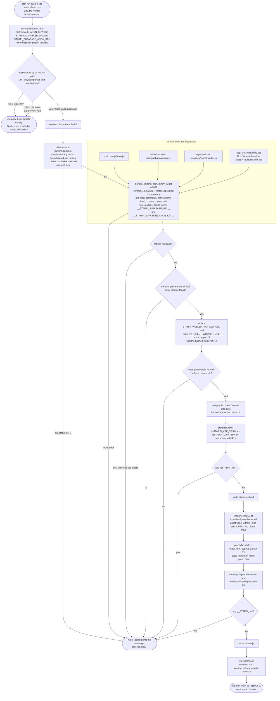
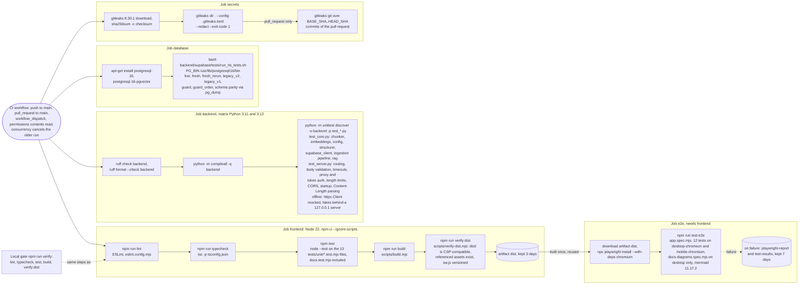
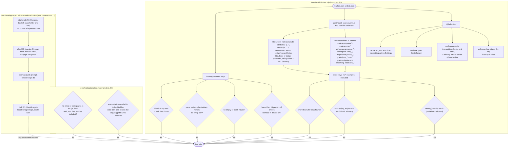
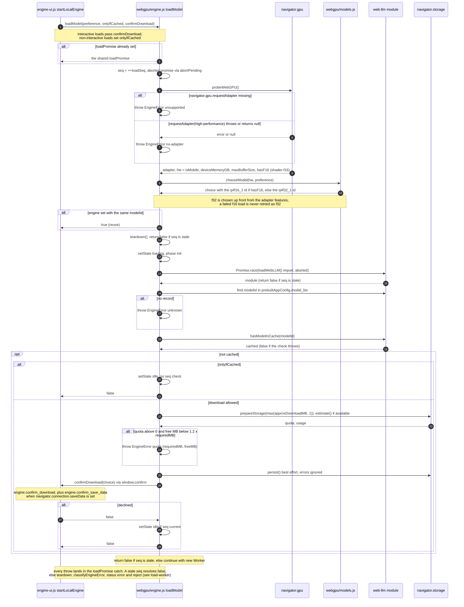
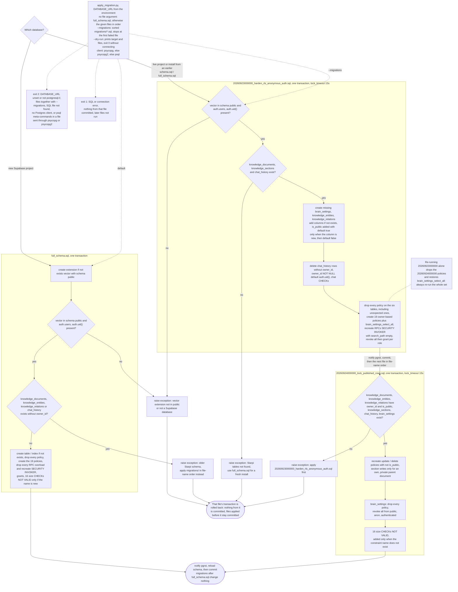

# Contributing to Starpi

Thanks for helping improve Starpi. This guide covers the local setup, the checks every change
must pass and the conventions the codebase relies on.

## Development setup

```bash
npm ci                 # Node.js 20.19+ (22 LTS recommended)
npm run dev            # watch build + local server with production headers on :3000
```

Backend (optional):

```bash
python -m pip install -r backend/requirements-dev.txt
```

Database tests need PostgreSQL 16 and pgvector
(`apt-get install postgresql-16 postgresql-16-pgvector` on Debian/Ubuntu).

Before changing a subsystem, read its section in the
[architecture atlas](docs/ARCHITECTURE.md). What `npm run build` does:

<!-- diagram: build-pipeline-build -->


## Checks before opening a pull request

| Area | Command |
| --- | --- |
| Frontend | `npm run verify` (lint, typecheck, unit tests, build, output verification) |
| End-to-end | `npm run build && npm run test:e2e` (first run: `npx playwright install chromium`) |
| Backend | `ruff check backend && ruff format --check backend && python -m unittest discover -s backend -p 'test_*.py'` |
| Database | `bash backend/supabase/tests/run_rls_tests.sh` |

CI runs all of them, plus gitleaks. `backend/scripts/brain_smoke.py` is a manual end-to-end
check against live endpoints and is not part of the automated suite.

<!-- diagram: test-strategy-ci-gates -->


**Diagrams** live in [docs/ARCHITECTURE.md](docs/ARCHITECTURE.md), the only place they are edited.
Update the diagram of any behaviour you change in the same pull request. Other Markdown files
may embed a diagram only as an exact copy under the same `<!-- diagram: <id> -->` marker
(`tests/unit/docs.test.mjs`), and every Mermaid block must render with the pinned Mermaid
release (`tests/e2e/docs-diagrams.spec.mjs`). Stick to `flowchart`, `sequenceDiagram`,
`stateDiagram-v2`, `erDiagram` and `classDiagram`, quote every flowchart label and keep colours
and `init` directives out.

## Frontend conventions

- **ES modules only**, bundled by esbuild. The production CSP forbids inline scripts, inline
  event handlers and inline styles:
  - interactive elements use `data-action="name"` (click) or `data-change="name"`, registered
    with `onAction()` / `onChange()` in `src/js/dom.js`. `tests/unit/actions.test.mjs` fails on
    unregistered or unused actions;
  - set styles through CSSOM (`el.style.x = …`) or Tailwind classes, never `style="…"`.
- **HTML construction:** interpolate untrusted values with `escapeHtml()`. Render Markdown only
  with `renderMarkdown()`. Values embedded in generated Markdown go through `escapeMarkdown()`.
  Never assign unsanitized strings to `innerHTML`.
- **Supabase access** goes through `src/js/supabase.js`, which returns `{ ok, data | error }`
  results and never throws. Handle every error kind in the UI; no silent failures.
- **Types:** core modules carry `// @ts-check` and JSDoc types. `npm run typecheck` runs in
  strict mode and `any` is not accepted.
- **Tailwind** is pinned to v3 to keep the current design; class names must be complete strings
  so the compiler can find them.
- **User-facing text** lives in `src/locales/en.json` (default) and `src/locales/de.json`, never
  inline. Use `data-i18n` / `data-i18n-placeholder` / `data-i18n-title` / `data-i18n-aria` in
  markup and `t()` or `setText()` (which re-translates on a language switch) in code. Add every
  key to both files with the same `{placeholders}`; `npm test` fails on missing keys. Code,
  comments and docs are English. Do not claim capabilities the code does not have (privacy,
  locality, hosting region).
- **Icons** are Lucide icons registered in `src/js/icons.js` (esbuild bundles only those
  imports); the tests fail on unregistered or unused icons and on emoji anywhere in `src/`.
  Icon-only buttons need an `aria-label` with a `data-i18n-aria` key.
- **Styling** uses the component classes in `src/styles/app.css` (`card`, `btn-*`, `badge-*`,
  `field`) before adding new one-off class combinations.

How the tests keep the dictionaries and keys consistent:

<!-- diagram: i18n-test-guards -->


## WebGPU and WebLLM

- The engine runs in `src/js/webgpu/worker.js`; `src/js/webgpu/engine.js` owns its lifecycle.
  Every load has a sequence number, and every exit path ends in `worker.terminate()`, which
  releases GPU memory deterministically.
- New models must exist in the pinned WebLLM prebuilt catalog, have a `q4f32_1` fallback, and
  get a catalog entry in `src/js/webgpu/models.js` (the unit tests enforce this).
- Upgrading `@mlc-ai/web-llm`: re-run the unit tests (model ids) and confirm that the bundle
  still needs no `unsafe-eval` (`npm run verify:dist` checks for `eval`/`new Function`).

<!-- diagram: webgpu-lifecycle-load-prepare -->


## Database changes

- Add a new timestamped file under `backend/supabase/migrations/` and update
  `full_schema.sql`, so fresh installs and upgraded databases stay identical. The test suite
  compares both with `pg_dump`.
- Every table needs RLS with explicit policies per role. Functions default to
  `SECURITY INVOKER` with `set search_path = ''`.
- Extend `backend/supabase/tests/rls_test.sql` for every new policy.

<!-- diagram: migrations-tests-apply-order -->


## Pull requests

- Branch from `main`, keep changes focused, and use [Conventional Commits](https://www.conventionalcommits.org/)
  (`fix(chat): …`, `feat(webgpu): …`, `docs: …`).
- Fill in the pull request template. Include benchmark numbers (tokens per second, time to
  first token, memory) when a change affects inference performance.
- Report security problems privately (see [SECURITY.md](SECURITY.md)), not in public issues.

## Reporting bugs

Use the issue templates. For WebGPU problems, include the browser version, the output of
`chrome://gpu` or `about:support`, and the adapter information
(`(await navigator.gpu.requestAdapter()).info`).
