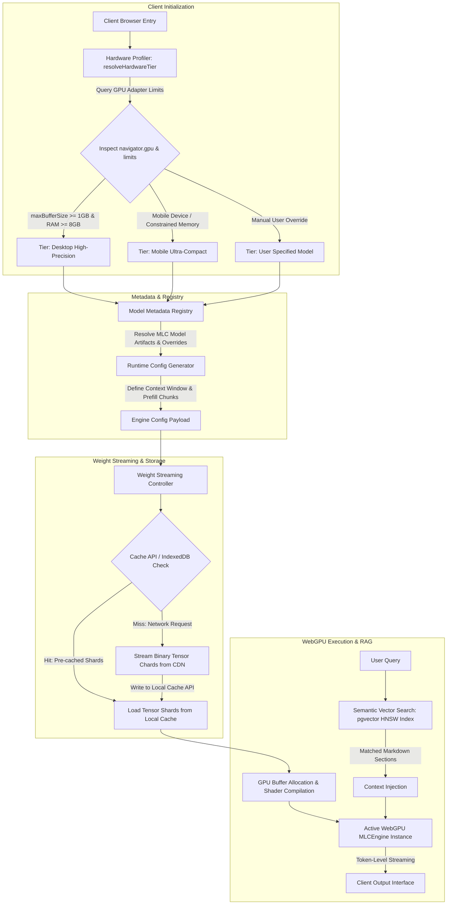

# Starpi

Browser-native, serverless artificial intelligence runtime and private semantic retrieval platform with adaptive WebGPU hardware profiling and on-device execution.

## Overview

Starpi is an open-source client-side inference engine and semantic knowledge repository designed to execute quantized large language models directly within standard web browsers without requiring centralized cloud GPU infrastructure. The system couples client-side WebGPU acceleration with vector-based Retrieval-Augmented Generation (RAG) backed by PostgreSQL and pgvector.

By executing models on client hardware, Starpi enforces complete prompt confidentiality, eliminates per-token operational expenditures, and operates autonomously under intermittent connectivity.

## Architecture

The inference pipeline dynamically adapts execution parameters to the client device capabilities. The lifecycle progresses from hardware profiling through metadata resolution and weight retrieval to GPU shader execution and vector retrieval.

### Inference Lifecycle



### Core Modules

1. **Hardware Profiler (`resolveHardwareTier`)**: Inspects `navigator.gpu`, `requestAdapter()`, `adapter.limits.maxBufferSize`, `navigator.deviceMemory`, and user-agent classifications. Automatically selects optimal context window dimensions and prefill chunk boundaries based on actual GPU memory bounds.
2. **Model Metadata Registry**: Maps dynamic tiers to model definitions, tokenizer configurations, and execution overrides. Ensures context window and prefill sizes prevent out-of-memory (OOM) browser tab termination.
3. **Weight Streaming Controller**: Coordinates asynchronous, chunked binary weight downloads from Hugging Face / MLC repositories. Automatically persists downloaded weights within browser storage (Cache API and IndexedDB).
4. **Runtime Execution Engine (`@mlc-ai/web-llm`)**: Manages WebGPU device pipelines, WGSL shader dispatch, KV-cache memory pools, and streaming token generation. Enforces strict VRAM disposal routines to prevent GPU memory leaks upon model switching.
5. **Semantic Retrieval Pipeline**: Connects client-side prompts to a PostgreSQL vector database using `pgvector` with Hierarchical Navigable Small World (HNSW) indexing for cosine similarity matching.

## Technical Specifications

### Supported Quantizations and Models

| Model Identifier | Parameter Count | Quantization Format | Download Size | Estimated VRAM | Default Target Tier |
| :--- | :--- | :--- | :--- | :--- | :--- |
| `Llama-3.2-1B-Instruct-q4f16_1-MLC` | 1.23B | 4-bit weight, 16-bit float activation | 705 MB | ~879 MB | Mobile / Constrained |
| `Qwen2.5-1.5B-Instruct-q4f16_1-MLC` | 1.54B | 4-bit weight, 16-bit float activation | 980 MB | ~1.5 GB | Low-tier Desktop / Tablet |
| `DeepSeek-R1-Distill-Qwen-1.5B-q4f16_1-MLC` | 1.54B | 4-bit weight, 16-bit float activation | 954 MB | ~1.5 GB | Mobile High-Reasoning |
| `Qwen2.5-3B-Instruct-q4f16_1-MLC` | 3.09B | 4-bit weight, 16-bit float activation | 1.85 GB | ~2.5 GB | Desktop Auto / High-Precision |
| `Hermes-3-Llama-3.2-3B-q4f16_1-MLC` | 3.21B | 4-bit weight, 16-bit float activation | 1.80 GB | ~2.4 GB | Desktop Autonomous Logic |
| `Phi-3.5-mini-instruct-q4f16_1-MLC` | 3.82B | 4-bit weight, 16-bit float activation | 2.20 GB | ~2.9 GB | High-Density Reasoning |

### Runtime & System Requirements

* **Browser WebGPU Support**:
  * Google Chrome / Chromium >= 113 (Desktop: Windows, macOS, Linux)
  * Google Chrome >= 121 (Android with WebGPU support enabled)
  * Apple Safari >= 17.4 (iOS, iPadOS, macOS with WebGPU flag active)
* **GPU Capabilities**:
  * WebGPU adapter supporting compute shaders and float16 shader extensions (`shader-f16` where available).
  * Desktop tier requirement: `maxBufferSize >= 1,073,741,824` bytes (1 GB) and `deviceMemory >= 8` GB.
  * Mobile tier requirement: `maxBufferSize >= 268,435,456` bytes (256 MB) with 128-token prefill chunking.
* **Storage and Caching**:
  * Browser Cache API and IndexedDB persistent storage partition.
  * Initial model weight download requires high-speed connectivity; subsequent executions load entirely from persistent cache without network transit.

### Memory Management and VRAM Hygiene

WebGPU operates under constrained browser process limits. Starpi implements proactive memory reclamation:
* Prior to instantiating a new model pipeline, `unloadCurrentWebGPU()` explicitly invokes engine disposal routines, purging GPU buffer handles and freeing allocated host-accessible memory.
* Context windows are constrained via `context_window_size` (2048 tokens on mobile, 4096 tokens on desktop).
* Prefill chunk sizes (`prefill_chunk_size`: 128 tokens for mobile, 512 tokens for desktop) balance compute throughput against memory allocation spikes.

## Quickstart

### Prerequisites

* Node.js >= 18.0.0
* Modern browser with native WebGPU support (Chrome, Edge, or Safari >= 17.4)

### Local Development Server

```bash
# Clone repository
git clone https://github.com/umutcantezgel-cpu/Starpi.git
cd Starpi

# Validate configuration
npm run validate

# Start local HTTP server with correct MIME type bindings
npm run dev
```

Navigate to `http://localhost:3000` to access the application interface.

### Static Deployment

Because Starpi executes entirely client-side, the frontend can be hosted on any static hosting provider or Content Delivery Network (CDN):

```bash
# Example static deployment via Vercel CLI
npx vercel --prod
```

Ensure the server sets appropriate CORS headers if serving custom model weights or accessing remote vector database endpoints.

## Vector Database Setup (Optional Cloud RAG)

Starpi integrates with PostgreSQL databases utilizing the `pgvector` extension:

1. Provision a PostgreSQL instance (e.g., Supabase, Neon, or self-hosted PostgreSQL).
2. Execute the schema configuration located in `backend/supabase/schema.sql`.
3. Configure the database endpoint and anonymous key in the application settings modal or via environment variables.

## Project Roadmap

* **Continuous Automated Benchmarking**:
  * Pipeline comparing client-side WebGPU execution perplexity, latency, and correctness against server-hosted frontier models via API.
  * Automated measurement of tokens-per-second, time-to-first-token (TTFT), and memory footprint across varied device tiers.
* **Automated In-Browser Model Quantization**:
  * Tooling to import custom GGUF and Safetensors weights, generating MLC-compatible WGSL shader layouts directly in web workflows.
* **Shader Kernel Optimization**:
  * Investigation of cooperative matrix multiplications (`subgroups` / `wgpu-matrix`) to maximize memory bandwidth utilization on integrated Apple Silicon and Vulkan backends.
* **Autonomous Multi-Agent Routing**:
  * Hybrid pipeline orchestrating on-device compact models for instant classification with remote verification fallbacks.

## License

This project is licensed under the MIT License. See the [LICENSE](LICENSE) file for details.