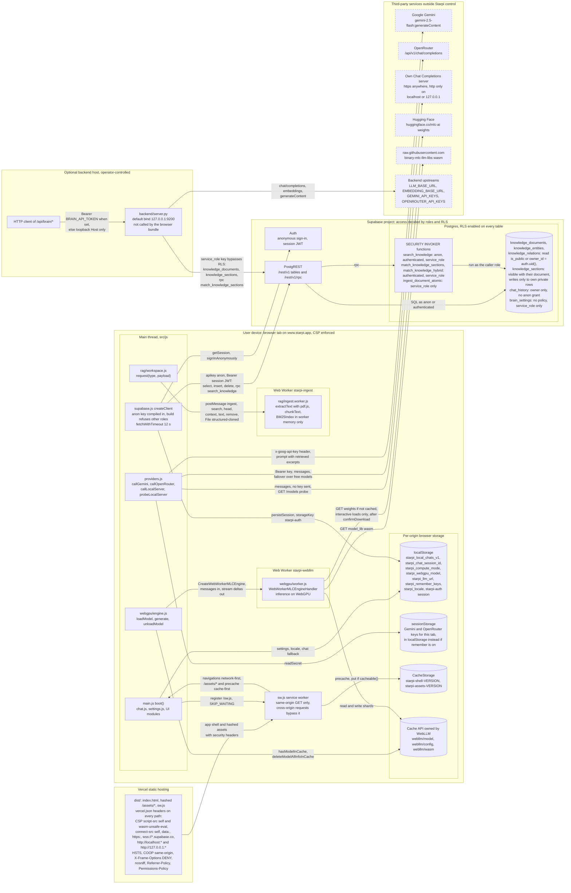
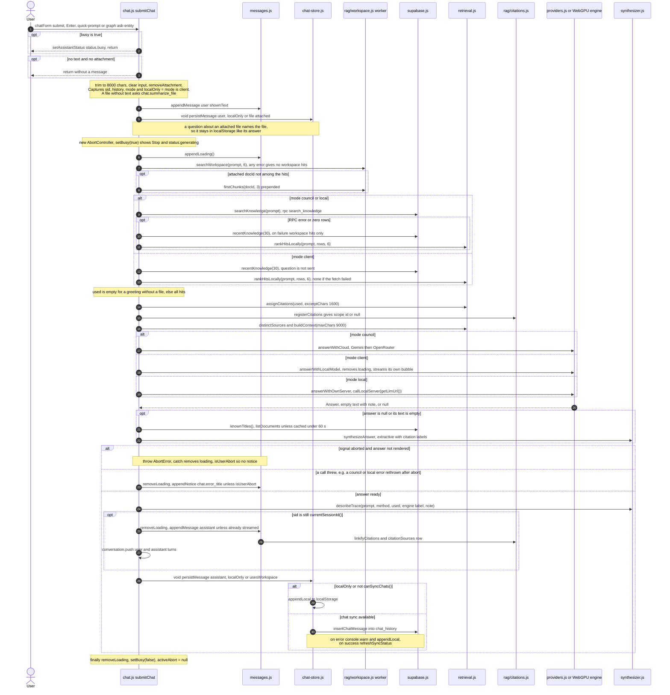
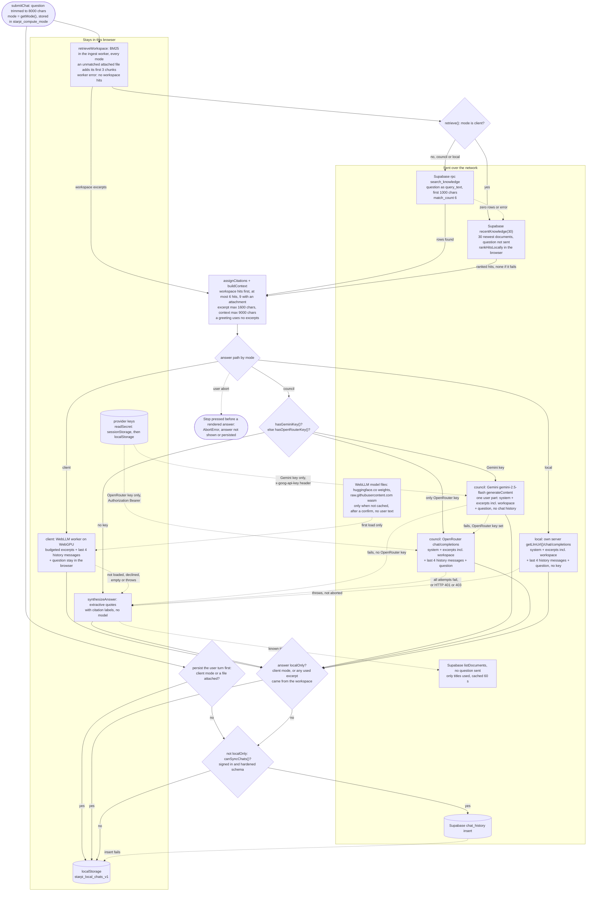
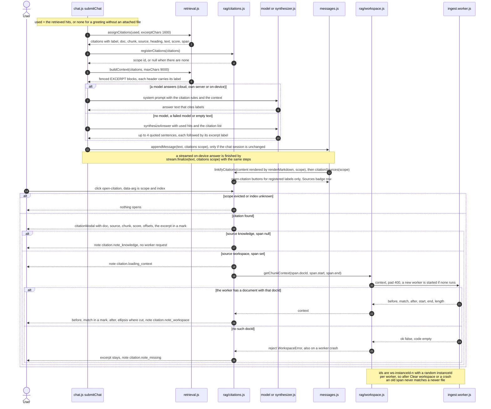
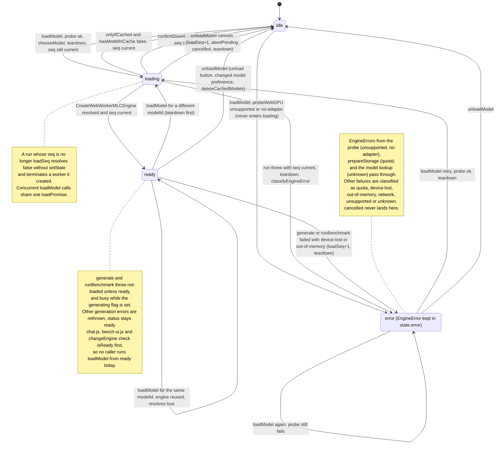

# Starpi

Browser-native knowledge assistant: on-device LLM inference with WebGPU, private on-device
document search with verifiable citations, retrieval over a Supabase Postgres knowledge base
protected by Row Level Security, and an optional Python ingestion backend with pgvector
embeddings. The interface is in English by default and switches to German with one click.

**Deployment:** [https://www.starpi.app](https://www.starpi.app) · **New here?** Start with the
[walkthrough](docs/WALKTHROUGH.md), then the [architecture atlas](docs/ARCHITECTURE.md) ·
[Changelog](CHANGELOG.md)

## Overview

Starpi answers questions about a company knowledge base (documents, meeting notes, a small
knowledge graph) and about files the user adds to an on-device workspace. The browser retrieves
relevant passages, labels each one `[Doc: <name>, Chunk: <n>]`, and then produces an answer in one
of four ways:

| Mode | Where the model runs | What leaves the device |
| --- | --- | --- |
| **On-device** | In the browser. [WebLLM](https://github.com/mlc-ai/web-llm) runs in a dedicated Web Worker on WebGPU. | Nothing. Candidate documents are fetched without the question and ranked in the browser. Chat history stays in `localStorage`. |
| **Cloud assistant** | Google Gemini or OpenRouter, with **your own** API key | The question and the retrieved excerpts go to the chosen provider. The question is searched with Postgres full-text search. |
| **Own server** | Any Chat Completions-compatible endpoint (`/v1/chat/completions`: MLX, Ollama, vLLM) at `https://…` or `http://localhost` | The question and the retrieved excerpts go to that server. The question is also searched with Postgres full-text search. |
| **Extractive fallback** | No model | Quotes matching sentences from the sources verbatim, each with its citation. Used when no key or model is available; it never invents content. |

Chat history is synchronised to Supabase only when the browser has an anonymous session **and**
the hardened RLS schema is installed, so every row is visible to its owner only. Otherwise it
stays on the device. A chat turn that uses the on-device workspace (the question and its answer)
is never synchronised.

System prompts follow the interface language: the on-device model is told *"You are Starpi, a
high-performance on-device AI assistant. Respond in English unless the user explicitly prompts in
another language."* (or the German equivalent), followed by grounding, prompt-injection and
citation rules (`src/js/prompts.js`).

### On-device workspace and citations

**Add knowledge → On-device workspace** accepts PDF, TXT, Markdown, JSON and CSV files (drag and
drop or file picker, up to 25 MB each). A dedicated worker (`src/js/rag/ingest.worker.js`)
extracts the text (PDF via a pinned, lazily loaded pdf.js; text via a streaming UTF-8 decoder;
JSON flattened into `path: value` lines), splits it into 500-character windows with 50 characters
of overlap that end on paragraph, sentence or word boundaries, and indexes the chunks with Okapi
BM25 (`k1 = 1.2`, `b = 0.75`, English and German stopwords). Documents live in the worker's memory
only and disappear on reload; nothing is uploaded.

Every answer registers the exact excerpts it was given. Citation labels in the answer become
buttons only when they match one of those excerpts, so a model cannot invent a clickable source.
The citation drawer shows the document, chunk number, BM25 score, character offsets and the chunk
highlighted inside the extracted text.

### Diagnostics and benchmark

The **Diagnostics** tab lists the WebGPU adapter (vendor, architecture, device), `shader-f16`
support, the relevant limits (buffer sizes, compute workgroup limits) and adapter features. The
benchmark runs on the loaded on-device model: one warm-up request, then a fixed prompt of about 64
tokens that generates exactly 128 tokens (`ignore_eos`). It reports the measured time to first
token, decode throughput (tokens after the first divided by the time after it), WebLLM's prefill
throughput and the total time. Without WebGPU the tab says so instead of showing numbers.

### Languages

English is the default for every visitor; the **EN | DE** switch in the header changes the
language instantly, without a reload, and the choice is kept in `localStorage`. Strings live in
`src/locales/en.json` and `src/locales/de.json`; markup references them with `data-i18n`,
`data-i18n-placeholder`, `data-i18n-title` and `data-i18n-aria`, and code uses `t()` / `setText()`
from `src/js/i18n/index.js`. Unit tests require identical keys and placeholders in both files and
check that every key used by the UI exists.

## Architecture

The [architecture atlas](docs/ARCHITECTURE.md) documents every subsystem with diagrams checked
against the code: boot, chat, retrieval and citations, the WebGPU engine, storage, the service
worker, the database and its policies, the backend, build, tests and deployment. The overview below
shows where each part runs and which trust boundary it sits behind; dashed nodes are services
outside Starpi's control.

<!-- diagram: system-context-overview -->


### Key flows

**One chat turn**, from the input to the persisted answer
([details](docs/ARCHITECTURE.md#3-answering-a-question)):

<!-- diagram: chat-request-lifecycle -->


**What leaves the device** in each mode:

<!-- diagram: modes-privacy-data-egress -->


**From a retrieved chunk to a verified citation**
([details](docs/ARCHITECTURE.md#4-on-device-workspace-and-citations)):

<!-- diagram: citations-answer-to-drawer -->


### Frontend modules (`src/js`)

| Module | Responsibility |
| --- | --- |
| `main.js` | Boot sequence, service worker registration and update prompt |
| `i18n/index.js`, `../locales/*.json` | Runtime translation (`t`, `setText`, `setLocale`), English default, German dictionary |
| `dom.js` | Single delegated dispatcher for `data-action` / `data-change` (no inline handlers) |
| `render.js` | `escapeHtml`, `escapeMarkdown`, `renderMarkdown` (marked + DOMPurify: no scripts, handlers, styles, images, `data-*` attributes or unsafe URLs) |
| `supabase.js` | Client, anonymous-session bootstrap, schema capability probe, typed queries with timeouts and error classification |
| `chat.js`, `chat-store.js`, `messages.js` | Chat flow, retrieval, persistence policy, message rendering with throttled streaming |
| `retrieval.js`, `synthesizer.js` | Keyword ranking, citation labels, context fencing against prompt injection, extractive answers |
| `prompts.js` | Language-specific system prompts (identity, grounding, citation rules) |
| `rag/ingest.worker.js`, `rag/parser.js`, `rag/chunker.js`, `rag/bm25.js` | On-device workspace: text extraction, sliding-window chunking, Okapi BM25 |
| `rag/workspace.js`, `rag/citations.js` | Worker RPC client; citation registry, safe citation buttons and the citation drawer |
| `bench/bench-ui.js`, `bench/diagnostics.js` | WebGPU adapter report and the inference benchmark |
| `providers.js` | Gemini (key in the `x-goog-api-key` header), OpenRouter, own Chat Completions server (URL validation) |
| `webgpu/models.js` | Pure model selection (shader-f16 detection, `q4f32_1` fallback, context budgeting) |
| `webgpu/engine.js`, `webgpu/worker.js` | Worker-based engine lifecycle: load sequencing, cancel, unload, device-loss handling, quota checks |
| `library.js`, `ingest.js`, `graph.js`, `settings.js`, `voice.js`, `ui.js` | Feature views |

### On-device models

Model ids are validated against the pinned WebLLM prebuilt catalog in the unit tests. On
adapters without the `shader-f16` feature the `q4f32_1` variant is selected automatically.

The engine's states, including cancelled and superseded loads and device loss:

<!-- diagram: webgpu-lifecycle-states -->


| Preset | WebLLM model (f16 / f32 fallback) | Approx. download | VRAM (f16 / f32) | Context window |
| --- | --- | --- | --- | --- |
| `llama-1b` (mobile default) | `Llama-3.2-1B-Instruct-q4f16_1-MLC` / `…q4f32_1-MLC` | 0.7 GB | 879 MB / 1,129 MB | 2,048 |
| `qwen-1.5b` | `Qwen2.5-1.5B-Instruct-q4f16_1-MLC` / `…q4f32_1-MLC` | 1.0 GB | 1,630 MB / 1,889 MB | 2,048 |
| `qwen-3b` (desktop default, ≥ 8 GB RAM) | `Qwen2.5-3B-Instruct-q4f16_1-MLC` / `…q4f32_1-MLC` | 1.9 GB | 2,505 MB / 2,894 MB | 4,096 |

Before downloading, the app checks `navigator.storage.estimate()`, asks for confirmation and
requests persistent storage. Weights are cached by WebLLM itself, not by the service worker.
**Settings → Advanced → Delete downloaded model data** removes them.

## Browser support

| Browser | WebGPU (local mode) | Notes |
| --- | --- | --- |
| Chrome / Edge 113+ (Windows, macOS, ChromeOS) | Yes | Linux support depends on GPU and driver; check `chrome://gpu`. |
| Chrome 121+ on Android 12+ | Yes | Compact 1B model with a 2,048-token context is selected by default. |
| Safari 26 (macOS, iOS, iPadOS) | Yes | iOS may evict cached model data under storage pressure. |
| Firefox 141+ | Windows only so far | Other platforms are rolling out. |
| Any browser without WebGPU | No | Cloud, own-server and extractive modes still work. |

Own-server mode from `https://www.starpi.app` to `http://localhost` triggers Chrome's Local
Network Access permission prompt (Chrome 142+), and Ollama must allow the origin
(`OLLAMA_ORIGINS`).

## Quickstart

Prerequisites: Node.js 20.19+ (22 LTS recommended), npm 10+. Python 3.11+ only for the backend.

```bash
git clone https://github.com/umutcantezgel-cpu/Starpi.git
cd Starpi
npm ci
npm run dev        # build in watch mode and serve dist/ on http://127.0.0.1:3000
```

The dev server applies the same response headers as production (`vercel.json`), including the
Content-Security-Policy.

| Command | Purpose |
| --- | --- |
| `npm run build` | Production build into `dist/` (Tailwind CSS, esbuild bundle, hashed assets, generated service worker) |
| `npm run preview` | Serve `dist/` with production headers |
| `npm run lint` / `npm run typecheck` | ESLint; TypeScript `checkJs` in strict mode for the core modules |
| `npm test` | Unit tests (`node --test`) |
| `npm run test:e2e` | Playwright tests against `dist/` with a mocked Supabase backend |
| `npm run verify` | Lint, typecheck, unit tests, build and output verification |

### Configuration

The Supabase URL and **anon** key are public by design and compiled into the bundle. Forks set
their own at build time:

```bash
STARPI_SUPABASE_URL=https://<project-ref>.supabase.co \
STARPI_SUPABASE_ANON_KEY=<anon key> \
npm run build
```

The build refuses any key whose JWT role is not `anon`, so a `service_role` key can never
reach the browser.

## Database setup (Supabase)

See [`backend/supabase/README.md`](backend/supabase/README.md) for details, verification
queries and rollback.

1. Enable **Anonymous sign-ins** (Authentication → Sign In / Providers). Consider CAPTCHA and
   rate limits for anonymous sign-ins.
2. New project: apply `backend/supabase/full_schema.sql`. Existing project: apply the files in
   `backend/supabase/migrations/` in file-name order (`20260923000000_harden_rls_anonymous_auth.sql`,
   then `20260924000000_lock_published_rows.sql`).
3. Verify with Supabase's security advisors.

Until the migration is applied, the app detects the old schema. It then keeps chats on the
device and notes, after saving, that new knowledge entries are visible to other visitors.

## Optional backend

`backend/` is a dependency-light Python service for server-side ingestion (Markdown
structuring, chunking, 1536-dimensional embeddings) and pgvector retrieval. It uses the
**service role** key and must never be exposed without authentication. It binds to
`127.0.0.1` by default and requires `BRAIN_API_TOKEN` on any other interface.

```bash
cd backend
python -m pip install -r requirements.txt
cp .env.example .env   # fill in SUPABASE_URL, SUPABASE_SERVICE_ROLE_KEY, LLM and embedding endpoints
python server.py
```

Endpoints, configuration, request guards and pipelines are described in
[backend/README.md](backend/README.md).

## Security model

- **Data access:** the browser uses the public anon key and an anonymous Supabase session;
  RLS restricts chats to their owner and private knowledge rows to their creator. SECURITY
  DEFINER functions are not callable by browser roles.
- **Content rendering:** all Markdown from the database or models passes through DOMPurify
  with a restrictive profile. Values interpolated into HTML are escaped. The UI uses
  delegated event handlers, so the CSP needs no `unsafe-inline`.
- **Headers:** `script-src 'self' 'wasm-unsafe-eval'`, `style-src 'self'`,
  `img-src 'self' data: blob:` (blocks exfiltration via remote images),
  `frame-ancestors 'none'`, plus Permissions-Policy, COOP and HSTS. `connect-src` allows
  `https:` because the own-server endpoint is user-defined.
- **Untrusted files:** workspace files are parsed in a dedicated worker; pdf.js runs there without
  `eval`, font loading or network access, and extracted text is only ever set as `textContent`.
  Citation buttons are created with DOM APIs from registered excerpts, never from model output.
- **Credentials:** provider keys are kept for the browser tab only unless the user opts in
  to storing them on the device. They are never written back into form fields.
- **Supply chain:** exact dependency pins with a lockfile, `npm ci --ignore-scripts`, no CDN
  scripts at runtime, SHA-pinned GitHub Actions, gitleaks in CI.

Report vulnerabilities as described in [SECURITY.md](SECURITY.md).

## Testing and CI

`.github/workflows/ci.yml` runs on every pull request:

| Job | Checks |
| --- | --- |
| `frontend` | ESLint, TypeScript, unit tests, production build, `verify-dist` (no inline scripts/handlers/styles, all assets present, no `eval`) |
| `e2e` | Playwright on desktop and mobile viewports under the production CSP: zero CSP violations, XSS payloads stay inert, graceful degradation, no chat writes without RLS |
| `backend` | ruff, byte-compilation, offline unit tests on Python 3.11 and 3.12 |
| `database` | Migration and RLS test suite on PostgreSQL 16 + pgvector (live, fresh and legacy schema shapes; idempotency; cross-user isolation) |
| `secrets` | gitleaks on the working tree and on the commits of the pull request |

## Roadmap

- **Benchmark history:** keep the Diagnostics results per model and device class (with peak GPU
  memory) and use them for the automatic model choice instead of static thresholds.
- **Quantization tiers:** measure the trade-offs between `q4f16_1`, `q4f32_1` and higher-precision
  variants per adapter, and add a tier for mid-range mobile GPUs.
- **Answer quality evaluation:** an English and German question-answering set over the knowledge base
  that compares local models, own-server models and cloud providers on answer faithfulness
  and citation accuracy.
- **Hybrid retrieval in the browser:** compute query embeddings on-device so local mode can use
  pgvector ranking without sending the question to the server.
- **Bundle size:** load the WebLLM runtime only inside the worker. Today the main thread also
  parses the shared chunk when local mode starts.

## Contributing

See [CONTRIBUTING.md](CONTRIBUTING.md), the [walkthrough](docs/WALKTHROUGH.md) for a tour of the code
and the [Code of Conduct](CODE_OF_CONDUCT.md). Changes are listed in [CHANGELOG.md](CHANGELOG.md).

## License

[MIT](LICENSE)
