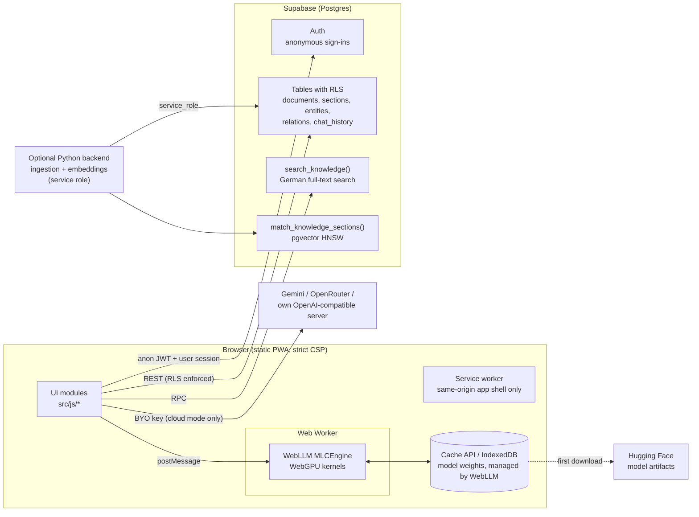

# Starpi

Browser-native knowledge assistant: on-device LLM inference with WebGPU, retrieval over a
Supabase Postgres knowledge base protected by Row Level Security, and an optional Python
ingestion backend with pgvector embeddings.

**Deployment:** [https://www.starpi.app](https://www.starpi.app)

## Overview

Starpi answers questions about a company knowledge base (documents, meeting notes, a small
knowledge graph). The browser retrieves relevant passages and then produces an answer in one
of four ways:

| Mode | Where the model runs | What leaves the device |
| --- | --- | --- |
| **Lokaler Modus** (local) | In the browser. [WebLLM](https://github.com/mlc-ai/web-llm) runs in a dedicated Web Worker on WebGPU. | Nothing. Candidate documents are fetched without the question and ranked in the browser. Chat history stays in `localStorage`. |
| **Schneller Assistent** (cloud) | Google Gemini or OpenRouter, with **your own** API key | The question and the retrieved excerpts go to the chosen provider. The question is searched with Postgres full-text search. |
| **Eigener Server** (own server) | Any OpenAI-compatible endpoint (MLX, Ollama, vLLM) at `https://…` or `http://localhost` | Only to that server. |
| **Extractive fallback** | No model | Quotes matching sentences from the knowledge base verbatim. Used when no key or model is available; it never invents content. |

Chat history is synchronised to Supabase only when the browser has an anonymous session **and**
the hardened RLS schema is installed, so every row is visible to its owner only. Otherwise it
stays on the device.

## Architecture



### Frontend modules (`src/js`)

| Module | Responsibility |
| --- | --- |
| `main.js` | Boot sequence, service worker registration and update prompt |
| `dom.js` | Single delegated dispatcher for `data-action` / `data-change` (no inline handlers) |
| `render.js` | `escapeHtml`, `escapeMarkdown`, `renderMarkdown` (marked + DOMPurify: no scripts, handlers, styles, images, `data-*` attributes or unsafe URLs) |
| `supabase.js` | Client, anonymous-session bootstrap, schema capability probe, typed queries with timeouts and error classification |
| `chat.js`, `chat-store.js`, `messages.js` | Chat flow, retrieval, persistence policy, message rendering with throttled streaming |
| `retrieval.js`, `synthesizer.js` | Local keyword ranking, context fencing against prompt injection, extractive answers |
| `providers.js` | Gemini (key in the `x-goog-api-key` header), OpenRouter, own server (URL validation) |
| `webgpu/models.js` | Pure model selection (shader-f16 detection, `q4f32_1` fallback, context budgeting) |
| `webgpu/engine.js`, `webgpu/worker.js` | Worker-based engine lifecycle: load sequencing, cancel, unload, device-loss handling, quota checks |
| `library.js`, `ingest.js`, `graph.js`, `settings.js`, `voice.js`, `ui.js` | Feature views |

### On-device models

Model ids are validated against the pinned WebLLM prebuilt catalog in the unit tests. On
adapters without the `shader-f16` feature the `q4f32_1` variant is selected automatically.

| Preset | WebLLM model (f16 / f32 fallback) | Approx. download | VRAM (f16 / f32) | Context window |
| --- | --- | --- | --- | --- |
| `llama-1b` (mobile default) | `Llama-3.2-1B-Instruct-q4f16_1-MLC` / `…q4f32_1-MLC` | 0.7 GB | 879 MB / 1,129 MB | 2,048 |
| `qwen-1.5b` | `Qwen2.5-1.5B-Instruct-q4f16_1-MLC` / `…q4f32_1-MLC` | 1.0 GB | 1,630 MB / 1,889 MB | 2,048 |
| `qwen-3b` (desktop default, ≥ 8 GB RAM) | `Qwen2.5-3B-Instruct-q4f16_1-MLC` / `…q4f32_1-MLC` | 1.9 GB | 2,505 MB / 2,894 MB | 4,096 |

Before downloading, the app checks `navigator.storage.estimate()`, asks for confirmation and
requests persistent storage. Weights are cached by WebLLM itself, not by the service worker.
**Settings → Heruntergeladene Modelldaten löschen** removes them.

## Browser support

| Browser | WebGPU (local mode) | Notes |
| --- | --- | --- |
| Chrome / Edge 113+ (Windows, macOS, ChromeOS) | Yes | Linux support depends on GPU and driver; check `chrome://gpu`. |
| Chrome 121+ on Android 12+ | Yes | Compact 1B model with a 2,048-token context is selected by default. |
| Safari 26 (macOS, iOS, iPadOS) | Yes | iOS may evict cached model data under storage pressure. |
| Firefox 141+ | Windows only so far | Other platforms are rolling out. |
| Any browser without WebGPU | No | Cloud, own-server and extractive modes still work. |

Own-server mode from `https://www.starpi.app` to `http://localhost` triggers Chrome's Local
Network Access permission prompt (Chrome 142+), and Ollama must allow the origin
(`OLLAMA_ORIGINS`).

## Quickstart

Prerequisites: Node.js 20.19+ (22 LTS recommended), npm 10+. Python 3.11+ only for the backend.

```bash
git clone https://github.com/umutcantezgel-cpu/Starpi.git
cd Starpi
npm ci
npm run dev        # build in watch mode and serve dist/ on http://127.0.0.1:3000
```

The dev server applies the same response headers as production (`vercel.json`), including the
Content-Security-Policy.

| Command | Purpose |
| --- | --- |
| `npm run build` | Production build into `dist/` (Tailwind CSS, esbuild bundle, hashed assets, generated service worker) |
| `npm run preview` | Serve `dist/` with production headers |
| `npm run lint` / `npm run typecheck` | ESLint; TypeScript `checkJs` in strict mode for the core modules |
| `npm test` | Unit tests (`node --test`) |
| `npm run test:e2e` | Playwright tests against `dist/` with a mocked Supabase backend |
| `npm run verify` | Lint, typecheck, unit tests, build and output verification |

### Configuration

The Supabase URL and **anon** key are public by design and compiled into the bundle. Forks set
their own at build time:

```bash
STARPI_SUPABASE_URL=https://<project-ref>.supabase.co \
STARPI_SUPABASE_ANON_KEY=<anon key> \
npm run build
```

The build refuses any key whose JWT role is not `anon`, so a `service_role` key can never
reach the browser.

## Database setup (Supabase)

See [`backend/supabase/README.md`](backend/supabase/README.md) for details, verification
queries and rollback.

1. Enable **Anonymous sign-ins** (Authentication → Sign In / Providers). Consider CAPTCHA and
   rate limits for anonymous sign-ins.
2. New project: apply `backend/supabase/full_schema.sql`. Existing project: apply
   `backend/supabase/migrations/20260923000000_harden_rls_anonymous_auth.sql`.
3. Verify with Supabase's security advisors.

Until the migration is applied, the app detects the old schema. It then keeps chats on the
device and notes, after saving, that new knowledge entries are visible to other visitors.

## Optional backend

`backend/` is a dependency-light Python service for server-side ingestion (Markdown
structuring, chunking, 1536-dimensional embeddings) and pgvector retrieval. It uses the
**service role** key and must never be exposed without authentication. It binds to
`127.0.0.1` by default and requires `BRAIN_API_TOKEN` on any other interface.

```bash
cd backend
python -m pip install -r requirements.txt
cp .env.example .env   # fill in SUPABASE_URL, SUPABASE_SERVICE_ROLE_KEY, LLM and embedding endpoints
python server.py
```

## Security model

- **Data access:** the browser uses the public anon key and an anonymous Supabase session;
  RLS restricts chats to their owner and private knowledge rows to their creator. SECURITY
  DEFINER functions are not callable by browser roles.
- **Content rendering:** all Markdown from the database or models passes through DOMPurify
  with a restrictive profile. Values interpolated into HTML are escaped. The UI uses
  delegated event handlers, so the CSP needs no `unsafe-inline`.
- **Headers:** `script-src 'self' 'wasm-unsafe-eval'`, `style-src 'self'`,
  `img-src 'self' data: blob:` (blocks exfiltration via remote images),
  `frame-ancestors 'none'`, plus Permissions-Policy, COOP and HSTS. `connect-src` allows
  `https:` because the own-server endpoint is user-defined.
- **Credentials:** provider keys are kept for the browser tab only unless the user opts in
  to storing them on the device. They are never written back into form fields.
- **Supply chain:** exact dependency pins with a lockfile, `npm ci --ignore-scripts`, no CDN
  scripts at runtime, SHA-pinned GitHub Actions, gitleaks in CI.

Report vulnerabilities as described in [SECURITY.md](SECURITY.md).

## Testing and CI

`.github/workflows/ci.yml` runs on every pull request:

| Job | Checks |
| --- | --- |
| `frontend` | ESLint, TypeScript, unit tests, production build, `verify-dist` (no inline scripts/handlers/styles, all assets present, no `eval`) |
| `e2e` | Playwright on desktop and mobile viewports under the production CSP: zero CSP violations, XSS payloads stay inert, graceful degradation, no chat writes without RLS |
| `backend` | ruff, byte-compilation, offline unit tests on Python 3.11 and 3.12 |
| `database` | Migration and RLS test suite on PostgreSQL 16 + pgvector (live, fresh and legacy schema shapes; idempotency; cross-user isolation) |
| `secrets` | gitleaks on the working tree and on the commits of the pull request |

## Roadmap

- **Performance profiling:** a reproducible in-browser benchmark harness that records
  time to first token, prefill and decode tokens per second, and peak GPU memory per model and
  device class. Results would feed the automatic model choice instead of static thresholds.
- **Quantization tiers:** measure the trade-offs between `q4f16_1`, `q4f32_1` and higher-precision
  variants per adapter, and add a tier for mid-range mobile GPUs.
- **Model benchmarking:** a German question-answering evaluation set over the knowledge base
  that compares local models, own-server models and cloud providers on answer faithfulness
  and citation accuracy.
- **Hybrid retrieval in the browser:** compute query embeddings on-device so local mode can use
  pgvector ranking without sending the question to the server.
- **Bundle size:** load the WebLLM runtime only inside the worker. Today the main thread also
  parses the shared chunk when local mode starts.

## Contributing

See [CONTRIBUTING.md](CONTRIBUTING.md) and the [Code of Conduct](CODE_OF_CONDUCT.md).

## License

[MIT](LICENSE)
