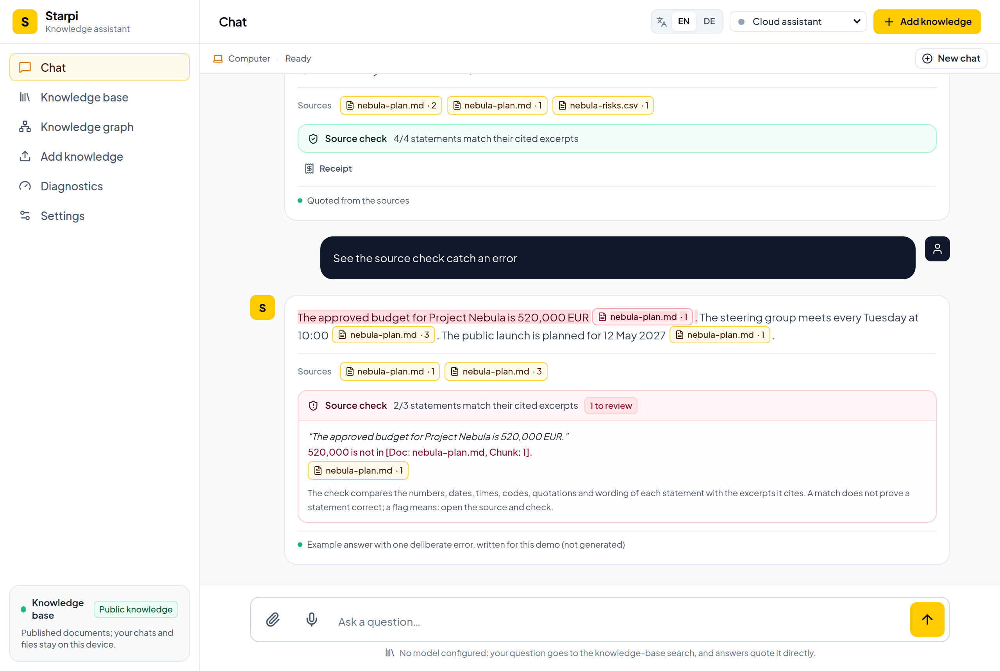
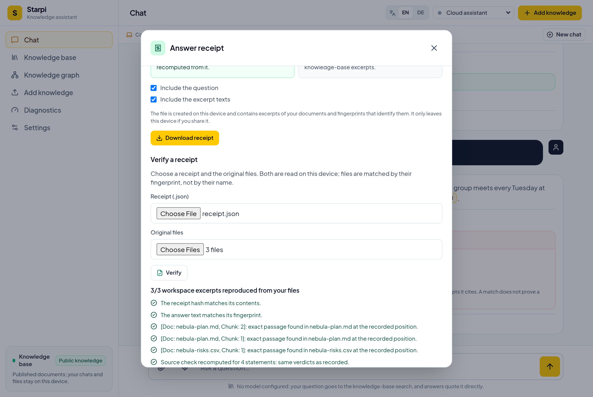
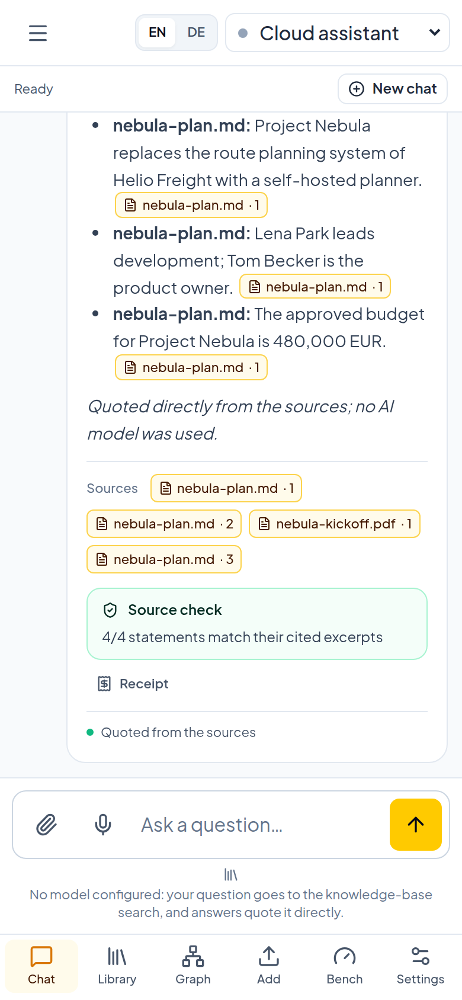
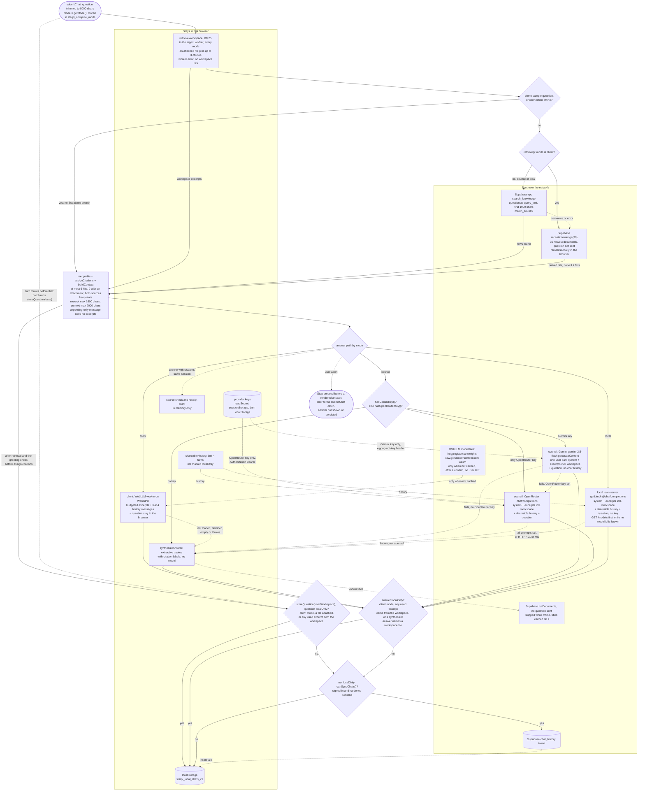
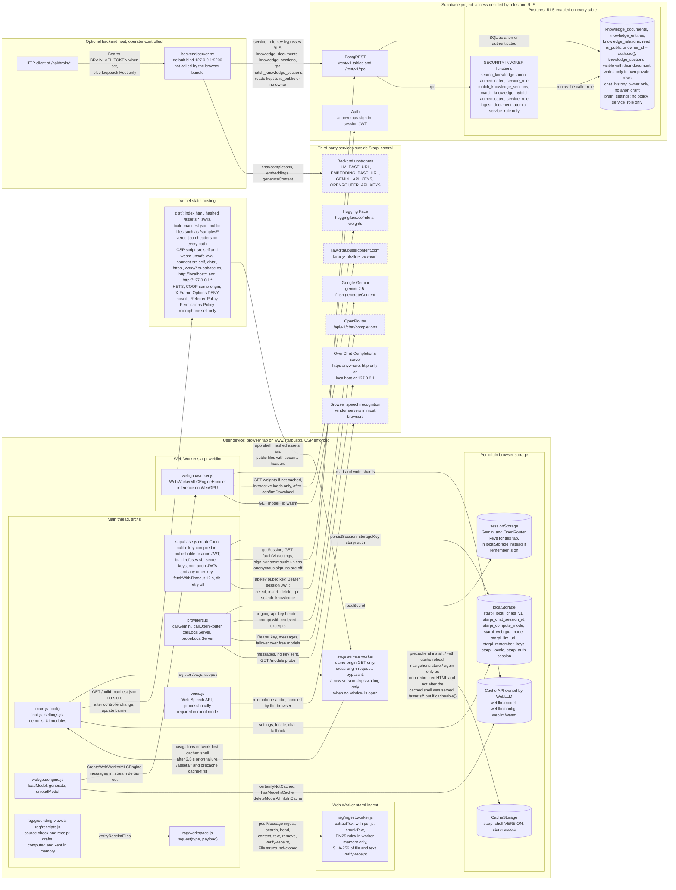

# Starpi

<p align="center">
  <a href="https://github.com/umutcantezgel-cpu/Starpi/actions/workflows/ci.yml"></a>
  <a href="https://github.com/umutcantezgel-cpu/Starpi/releases/latest"></a>
  <a href="LICENSE"></a>
  <a href="https://www.starpi.app"></a>
</p>

**A knowledge assistant in the browser that shows how far each answer can be trusted.** Starpi
answers questions from your files and from a shared knowledge base, cites every passage it used,
compares every statement of the answer with the passages it cites, and gives you a receipt that
anyone can check against the original files. Your files are read on your device and never
uploaded; the answer can come from an on-device model (WebGPU), your own server or a cloud model.
English and German.

<p align="center">
  
</p>

**Live:** [www.starpi.app](https://www.starpi.app) · **Tour of the code:** [walkthrough](docs/WALKTHROUGH.md) ·
**How it works in detail:** [architecture atlas](docs/ARCHITECTURE.md) · [Changelog](CHANGELOG.md)

## Try it in 20 seconds

1. Open [www.starpi.app](https://www.starpi.app). No account, no API key, nothing to install.
2. Click **Try with sample files**. A plan (Markdown), a risk register (CSV) and kickoff notes (PDF)
   of a fictitious project are read into the on-device workspace.
3. Ask one of the suggested questions. Every citation opens the exact passage, highlighted in its
   file, and the **Source check** under the answer shows how many statements match their excerpts.
4. Click **See the source check catch an error**: a prepared answer with one wrong number (labelled
   as written for the demo) is flagged, with the reason.
5. Open **Receipt** under an answer, download it, and verify it against the sample files, in the
   dialog or on the command line with `npm run verify:receipt`.

Without an API key Starpi answers by quoting the sources, and says so. Add a Gemini or OpenRouter
key, point it at your own server, or load an on-device model in **Settings**, and a model writes the
answer; the same checks apply.

## What is different

Retrieval-augmented assistants cite sources, but a citation does not tell you whether the sentence
next to it says what the source says. Starpi makes that visible and checkable:

- **Source check on every answer.** Each statement is compared with the excerpts it cites: numbers
  in English and German formats (480,000 = 480.000 = 480k), dates, times, weekdays, codes,
  quotations and wording, and names in English answers. A value that is not in the cited excerpt
  is named ("520,000 is not in [Doc: plan.md, Chunk: 1]"), the statement is highlighted, and its
  citation is marked. It runs in the browser, is deterministic and needs no second model. On
  labelled test answers it flagged every changed value in the held-out set and no statement of a
  faithful answer as unsupported ([how well it works](#how-well-it-works)).
- **Answer receipts.** A JSON file per answer with SHA-256 fingerprints of the source files, the
  exact offsets of each cited passage and the source-check verdicts. Anyone with the same files can
  reproduce every passage, in the app or with a command-line verifier. The format is specified in
  [`docs/spec/receipts.md`](docs/spec/receipts.md).
- **Citations the model cannot forge.** Only labels the app registered for the excerpts it sent
  become clickable, and the drawer shows the cited chunk inside its source text.
- **Files are read on the device.** PDF, Markdown, text, JSON and CSV files are parsed, chunked
  and indexed with BM25 in a Web Worker and never uploaded. Only the excerpts an answer needs go to
  the model you chose (none in on-device mode), and turns that use your files are never synced or
  sent to a cloud provider or your own server as chat history.
- **A privacy statement per mode.** The footer says where the question goes in the current mode;
  in on-device mode it does not leave the browser.

Both checks have limits, and the app says so where it shows them. The source check compares text;
a match does not prove a statement true, and a flag means "open the source and look". Receipts are
not signed: they show that the excerpts are reproducible from the same files, not who wrote the
answer or what a model read.

<table>
  <tr>
    <td width="62%"></td>
    <td width="38%"></td>
  </tr>
  <tr>
    <td>Verifying a receipt against the original files</td>
    <td>On a phone</td>
  </tr>
</table>

## How the source check works

The check reads the rendered answer, not the raw text, so it knows exactly which citation belongs
to which sentence (also for lists, tables and a "Sources:" line). For each statement it extracts the
facts and looks them up in the cited excerpts, then compares the remaining wording:

| Verdict | When |
| --- | --- |
| **Supported** | Every fact is in a cited excerpt and at least half of the content words appear there. |
| **Weak** | A value is rounded or approximate, appears only in another excerpt or in the question, or stands in the excerpt next to something else than the statement says; an English statement names someone or something the excerpt does not; the wording overlaps little; or a statement without a citation states a value that one of the excerpts contains. |
| **Unsupported** | A number, date, time, weekday, code or quotation appears in none of the excerpts, a cited label was not one of the excerpts, or the cited excerpt did not fit into the model's context. |
| **Unchecked** | The statement and its excerpt are in different languages, so only facts are compared, and the statement has none. |

Headings, short fragments, and statements with neither a citation nor a fact are not counted.

A value the excerpt does contain, but only next to other words ("75,000 EUR for infrastructure"
when the excerpt says "95,000 EUR for infrastructure and 75,000 EUR for training"), is marked weak,
and the panel quotes the passage where the value stands. In English answers, a name that none of
the cited excerpts contains ("the Munich depot" when the plan says Hamburg) is marked weak too.
When the answer and the excerpt are in different languages, only the facts are compared. The rules
live in [`src/js/core/facts.js`](src/js/core/facts.js) and
[`src/js/core/grounding.js`](src/js/core/grounding.js), carry a version that receipts record, and are
pinned by golden tests.

### How well it works

Measured with `npm run eval:source-check` on labelled answers about the sample files and the sample
knowledge base, in English, in German and across the two. Each answer is either faithful or has
exactly one planted error. The first set was available while the rules were adjusted; the held-out
set was written afterwards, in a different style, and only measured.

| | First set | Held-out set |
| --- | --- | --- |
| Faithful answers (statements) | 50 (143) | 100 (324) |
| Statements of faithful answers marked unsupported | 0 | 0 |
| Statements of faithful answers marked weak | 0 | 15 (4.6 %) |
| Changed number, date, time, weekday or code: flagged | 47 of 49 | 49 of 49 |
| Wrong name or place: flagged (names are checked in English only) | 3 of 10 | 4 of 10 |
| Correct value attached to the wrong thing: flagged | 2 of 10 | 6 of 10 |
| Negated statement: flagged | 0 of 10 | 0 of 10 |

The answers were written by language models following these instructions, and every label was
confirmed by two independent model reviewers; they are not answers from real users, and the sample
is small. One rule was corrected after the held-out set was written (a word from the file name no
longer counts as context for a value); it raised the held-out "wrong thing" row from 4 to 6 and
changed nothing else. Read the table as what the check can and cannot see: it is reliable for
changed values and blind to a statement that keeps the source's words and reverses their meaning.
The labelled answers are in [`tests/fixtures/grounding/eval.json`](tests/fixtures/grounding/eval.json),
and a unit test fails if any of these results gets worse.

<!-- diagram: source-check-pipeline -->

```mermaid
flowchart TD
    sIn(["chat.js submitChat: rendered messageEl, a citation scope,<br/>the same chat session still shown"]) --> sEng{"answer.engine is synthesizer?"}
    sEng -->|"yes"| sFull["every excerpt delivered full,<br/>text = the excerpt as given"]
    sEng -->|"no, a model answered"| sCov["contextCoverage(citationList, deliveredContext or context):<br/>the EXCERPT n blocks of the context that was sent give<br/>full, partial without the ellipsis, or omitted"]
    sFull --> sApply
    sCov --> sApply
    sDemo(["demo.js showCheckDemo: excerpts delivered full,<br/>no given, citedOnly off"]) -.-> sApply
    sApply["applyGrounding(messageEl): scope, sources with label, doc,<br/>heading, delivered text and state, given = the prompt and the<br/>user messages among the last 4 conversation entries,<br/>citedOnly = synthesizer answer"]
    sApply --> sSlot{".message-content and .message-provenance<br/>present and sources not empty?"}
    sSlot -->|"no"| sNull(["returns null, no panel"])
    sSlot -->|"yes"| sBlocks["blocksFromElement: one block per p, li, h1 to h6, tr,<br/>blockquote, dd, dt, pre skipped, br as a line break,<br/>td and th cells joined with a separator,<br/>kind p, li, heading, row, header-row or other"]
    sBlocks --> sBtn{"button with data-action open-citation<br/>and data-arg of this answer's scope?"}
    sBtn -->|"yes"| sCite["cite segment, chip position recorded"]
    sBtn -->|"no"| sIgn["other buttons ignored"]
    sBlocks --> sLoose["text matching LOOSE_LABEL_PATTERN: badcite,<br/>resolveLabel by document name and chunk number"]
    sBlocks --> sLead["list item, or the first paragraph of a loose list item,<br/>whose list follows a block ending in a colon:<br/>leadIn = that block"]
    sCite --> sSize
    sLoose --> sSize
    sLead --> sSize
    sSize{"groundAnswer: text segments over<br/>THRESHOLDS.maxChars 20000 characters?"}
    sSize -->|"yes"| sSkip["skipped too_long"]
    sSize -->|"no"| sAssoc["associate: sentenceSpans per block, no statement ends at the dot<br/>of an ordinal, a day.month date such as 1.6. or a known abbreviation,<br/>a marker belongs to the last statement that starts before it,<br/>a statement without one inherits from the next cited statement<br/>of its block, then the previous one, then its lead-in up to 4 hops,<br/>then the markers and bad labels of contentless blocks<br/>such as a Sources line"]
    sAssoc --> sMany{"more than maxSentences 300 statements?"}
    sMany -->|"yes"| sSkip
    sMany -->|"no"| sIdx["indexSource per excerpt over text, doc and heading,<br/>no index for an omitted excerpt, given indexed,<br/>answer language from guessLanguage"]
    sIdx --> sCheck["checkSentence per statement,<br/>see source-check-verdicts"]
    sCheck --> sCount["counts supported, weak, unsupported, unchecked,<br/>neutral statements not counted"]
    sCount --> sAny{"anything counted, unchecked or skipped?"}
    sSkip --> sAny
    sAny -->|"no"| sQuiet(["report returned, no panel"])
    sAny -->|"yes"| sBar["details.grounding-bar replaces the .message-provenance content:<br/>grounding-review and shield-alert when a statement is unsupported,<br/>else grounding-partial and shield-question-mark when one is weak,<br/>else grounding-ok and shield-check when statements were compared,<br/>else grounding-none and shield"]
    sBar --> sSum["summary: grounding.title, then grounding.too_long,<br/>grounding.summary ok of total, or grounding.only_unchecked,<br/>badges grounding.review n and grounding.partial n"]
    sSum --> sList["ol.grounding-list: unsupported first, then weak, in answer order,<br/>li id grd-n-i, n per panel, i the statement index,<br/>grounding.statement cut to 160 chars,<br/>one grounding.reason_code line per reason, citation badges"]
    sList --> sNotes["grounding.unchecked n when statements were not compared,<br/>grounding.disclaimer in every panel"]
    sNotes --> sOpen["details opened when a statement is unsupported"]
    sOpen --> sChips["each citation button belongs to the last statement of its block<br/>that starts before it, else the first, if that one is unsupported:<br/>class citation-chip-flag, aria-describedby = id of its list item"]
    sChips --> sHl{"Highlight and CSS.highlights available?"}
    sHl -->|"yes"| sMark["a Range per unsupported statement in the<br/>starpi-review highlight, no DOM change, no inline style"]
    sHl -->|"no"| sNoMark["no highlight, the flagged list<br/>stays the accessible channel"]
    sMark --> sRet(["report returned to chat.js for the receipt draft"])
    sNoMark --> sRet
    sReset(["resetMessages: new chat, deleted or restored history"]) -.-> sClear["clearGroundingHighlights"]
```

## How it works

<p align="center">
  
</p>

The browser retrieves passages from the on-device workspace (BM25) and from the shared knowledge
base (Postgres full-text search behind row level security), labels each one
`[Doc: <name>, Chunk: <n>]`, and answers in one of four ways:

| Mode | Where the answer is written | What leaves the device |
| --- | --- | --- |
| **On-device** | [WebLLM](https://github.com/mlc-ai/web-llm) on WebGPU, in a dedicated Web Worker | Nothing. Knowledge-base candidates are fetched without the question and ranked in the browser. |
| **Cloud assistant** | Google Gemini or OpenRouter, with **your own** API key | The question and the retrieved excerpts go to the provider, and the question to the knowledge-base search. Chat turns that used your files are never sent as history. |
| **Own server** | Any Chat Completions endpoint (`/v1/chat/completions`: MLX, Ollama, vLLM) at `https://…` or `http://localhost` | The question and the retrieved excerpts go to that server, and the question to the knowledge-base search. |
| **Quoted from the sources** | No model | Only the question, to the knowledge-base search. Matching sentences are quoted verbatim with their citations; used when no model is configured or a model fails. |

Chats are synced to Supabase only when the browser has an anonymous session **and** the hardened
row-level-security schema is installed, so every row is visible to its owner only; otherwise they
stay in the browser. **Settings › Delete chat history** removes both.

<details>
<summary><strong>What leaves the device in each mode</strong> (diagram)</summary>

<!-- diagram: modes-privacy-data-egress -->

```mermaid
flowchart TD
    Ask(["submitChat: question trimmed to 8000 chars<br/>mode = getMode(), stored in starpi_compute_mode"])
    UserTurn{"storeQuestion(usesWorkspace), question localOnly?<br/>client mode, a file attached,<br/>or any used excerpt from the workspace"}
    Skip{"demo sample question,<br/>or connection offline?"}
    RetMode{"retrieve(): mode is client?"}
    Ctx["mergeHits + assignCitations + buildContext<br/>at most 6 hits, 9 with an attachment, both sources keep slots<br/>excerpt max 1600 chars, context max 9000 chars<br/>a greeting-only message uses no excerpts"]
    Dispatch{"answer path by mode"}
    CKeys{"hasGeminiKey()?<br/>else hasOpenRouterKey()?"}
    Abort(["Stop pressed before a rendered answer:<br/>error to the submitChat catch,<br/>answer not shown or persisted"])
    Persist{"answer localOnly?<br/>client mode, any used excerpt<br/>came from the workspace, or a synthesizer<br/>answer names a workspace file"}
    Sync{"not localOnly: canSyncChats()?<br/>signed in and hardened schema"}

    subgraph dev["Stays in this browser"]
        WsSearch["retrieveWorkspace: BM25 in the ingest worker, every mode<br/>an attached file pins up to 3 chunks<br/>worker error: no workspace hits"]
        Keys[("provider keys<br/>readSecret: sessionStorage, then localStorage")]
        Hist["shareableHistory: last 4 turns<br/>not marked localOnly"]
        LGen["client: WebLLM worker on WebGPU<br/>budgeted excerpts + last 4 history messages<br/>+ question stay in the browser"]
        Synth["synthesizeAnswer: extractive quotes<br/>with citation labels, no model"]
        Check["source check and receipt draft,<br/>in memory only"]
        LS[("localStorage<br/>starpi_local_chats_v1")]
    end

    subgraph net["Sent over the network"]
        FTS["Supabase rpc search_knowledge<br/>question as query_text, first 1000 chars<br/>match_count 6"]
        Recent["Supabase recentKnowledge(30)<br/>30 newest documents, question not sent<br/>rankHitsLocally in the browser"]
        Gem["council: Gemini gemini-2.5-flash generateContent<br/>one user part: system + excerpts incl. workspace<br/>+ question, no chat history"]
        OR["council: OpenRouter chat/completions<br/>system + excerpts incl. workspace<br/>+ shareable history + question"]
        Srv["local: own server getLlmUrl()/chat/completions<br/>system + excerpts incl. workspace<br/>+ shareable history + question, no key<br/>GET /models first while no model id is known"]
        HF["WebLLM model files: huggingface.co weights,<br/>raw.githubusercontent.com wasm<br/>only when not cached, after a confirm, no user text"]
        Titles["Supabase listDocuments, no question sent<br/>skipped while offline, titles cached 60 s"]
        CH[("Supabase chat_history insert")]
    end

    Ask --> WsSearch --> Skip
    Skip -->|"yes: no Supabase search"| Ctx
    Skip -->|"no"| RetMode
    RetMode -->|"no, council or local"| FTS
    RetMode -->|"yes"| Recent
    FTS -->|"rows found"| Ctx
    FTS -.->|"zero rows or error"| Recent
    Recent -->|"ranked hits, none if it fails"| Ctx
    WsSearch -->|"workspace excerpts"| Ctx
    Ctx -->|"after retrieval and the greeting check,<br/>before assignCitations"| UserTurn
    Ask -.->|"turn throws before that:<br/>catch runs storeQuestion(false)"| UserTurn
    UserTurn -->|"yes"| LS
    UserTurn -->|"no"| Sync
    Ctx --> Dispatch
    Dispatch -->|"council"| CKeys
    Dispatch -->|"client"| LGen
    Dispatch -->|"local"| Srv
    CKeys -->|"Gemini key"| Gem
    CKeys -->|"only OpenRouter key"| OR
    CKeys -->|"no key"| Synth
    Gem -.->|"fails, OpenRouter key set"| OR
    Gem -.->|"fails, no OpenRouter key"| Synth
    OR -.->|"all attempts fail,<br/>or HTTP 401 or 403"| Synth
    Hist -.->|"history"| OR
    Hist -.->|"history"| Srv
    HF -.->|"only when not cached"| LGen
    LGen -.->|"not loaded, declined,<br/>empty or throws"| Synth
    Srv -.->|"throws, not aborted"| Synth
    Keys -.->|"Gemini key only,<br/>x-goog-api-key header"| Gem
    Keys -.->|"OpenRouter key only,<br/>Authorization Bearer"| OR
    Synth -.->|"known titles"| Titles
    Dispatch -.->|"user abort"| Abort
    Dispatch -.->|"answer with citations,<br/>same session"| Check
    Gem --> Persist
    OR --> Persist
    LGen --> Persist
    Srv --> Persist
    Synth --> Persist
    Persist -->|"yes"| LS
    Persist -->|"no"| Sync
    Sync -->|"yes"| CH
    Sync -->|"no"| LS
    CH -.->|"insert fails"| LS
```

</details>

<details>
<summary><strong>System context and trust boundaries</strong> (diagram)</summary>

<!-- diagram: system-context-overview -->

```mermaid
flowchart LR
    subgraph device["User device: browser tab on www.starpi.app, CSP enforced"]
        subgraph mainThread["Main thread, src/js"]
            boot["main.js boot()<br/>chat.js, settings.js, demo.js, UI modules"]
            sbClient["supabase.js createClient<br/>public key compiled in: publishable or anon JWT,<br/>build refuses sb_secret_ keys, non-anon JWTs<br/>and any other key, fetchWithTimeout 12 s, db retry off"]
            provJs["providers.js<br/>callGemini, callOpenRouter,<br/>callLocalServer, probeLocalServer"]
            engineJs["webgpu/engine.js<br/>loadModel, generate, unloadModel"]
            wsJs["rag/workspace.js<br/>request(type, payload)"]
            trustJs["rag/grounding-view.js, rag/receipts.js<br/>source check and receipt drafts,<br/>computed and kept in memory"]
            voiceJs["voice.js<br/>Web Speech API, processLocally<br/>required in client mode"]
        end
        subgraph llmWorker["Web Worker starpi-webllm"]
            mlc["webgpu/worker.js<br/>WebWorkerMLCEngineHandler<br/>inference on WebGPU"]
        end
        subgraph ingestWorker["Web Worker starpi-ingest"]
            ingest["rag/ingest.worker.js<br/>extractText with pdf.js, chunkText,<br/>BM25Index in worker memory only,<br/>SHA-256 of file and text, verify-receipt"]
        end
        sw["sw.js service worker<br/>same-origin GET only,<br/>cross-origin requests bypass it,<br/>a new version skips waiting only<br/>when no window is open"]
        subgraph browserStores["Per-origin browser storage"]
            ls[("localStorage<br/>starpi_local_chats_v1, starpi_chat_session_id,<br/>starpi_compute_mode, starpi_webgpu_model,<br/>starpi_llm_url, starpi_remember_keys,<br/>starpi_locale, starpi-auth session")]
            ss[("sessionStorage<br/>Gemini and OpenRouter keys for this tab,<br/>in localStorage instead if remember is on")]
            swCache[("CacheStorage<br/>starpi-shell-VERSION, starpi-assets")]
            modelCache[("Cache API owned by WebLLM<br/>webllm/model, webllm/config, webllm/wasm")]
        end
    end

    subgraph vercel["Vercel static hosting"]
        host["dist/: index.html, hashed /assets/*, sw.js,<br/>build-manifest.json, public files such as /samples/*<br/>vercel.json headers on every path:<br/>CSP script-src self and wasm-unsafe-eval,<br/>connect-src self, data:, https:, wss://*.supabase.co,<br/>http://localhost:* and http://127.0.0.1:*<br/>HSTS, COOP same-origin, X-Frame-Options DENY,<br/>nosniff, Referrer-Policy,<br/>Permissions-Policy microphone self only"]
    end

    subgraph supabase["Supabase project: access decided by roles and RLS"]
        auth["Auth<br/>anonymous sign-in, session JWT"]
        rest["PostgREST<br/>/rest/v1 tables and /rest/v1/rpc"]
        subgraph pg["Postgres, RLS enabled on every table"]
            tables[("knowledge_documents, knowledge_entities,<br/>knowledge_relations: read is_public or owner_id = auth.uid(),<br/>knowledge_sections: visible with their document,<br/>writes only to own private rows<br/>chat_history: owner only, no anon grant<br/>brain_settings: no policy, service_role only")]
            rpcFns["SECURITY INVOKER functions<br/>search_knowledge: anon, authenticated, service_role<br/>match_knowledge_sections, match_knowledge_hybrid:<br/>authenticated, service_role<br/>ingest_document_atomic: service_role only"]
        end
    end

    subgraph backendHost["Optional backend host, operator-controlled"]
        caller["HTTP client of /api/brain/*"]
        brain["backend/server.py<br/>default bind 127.0.0.1:9200<br/>not called by the browser bundle"]
    end

    subgraph thirdParty["Third-party services outside Starpi control"]
        gemini["Google Gemini<br/>gemini-2.5-flash:generateContent"]
        openrouter["OpenRouter<br/>/api/v1/chat/completions"]
        ownServer["Own Chat Completions server<br/>https anywhere, http only on<br/>localhost or 127.0.0.1"]
        hf["Hugging Face<br/>huggingface.co/mlc-ai weights"]
        ghLibs["raw.githubusercontent.com<br/>binary-mlc-llm-libs wasm"]
        speech["Browser speech recognition<br/>vendor servers in most browsers"]
        backendApis["Backend upstreams<br/>LLM_BASE_URL, EMBEDDING_BASE_URL,<br/>GEMINI_API_KEYS, OPENROUTER_API_KEYS"]
    end

    host -->|"app shell, hashed assets and<br/>public files with security headers"| sw
    sw -->|"navigations network-first, cached shell<br/>after 3.5 s or on failure,<br/>/assets/* and precache cache-first"| boot
    sw -->|"precache at install, / with cache reload,<br/>navigations store / again only as<br/>non-redirected HTML and not after the<br/>cached shell was served, /assets/* put if cacheable()"| swCache
    boot -->|"register /sw.js, scope /"| sw
    boot -->|"GET /build-manifest.json no-store<br/>after controllerchange, update banner"| host
    boot -->|"settings, locale, chat fallback"| ls
    provJs -->|"readSecret"| ss
    sbClient -->|"persistSession, storageKey starpi-auth"| ls
    engineJs -->|"CreateWebWorkerMLCEngine,<br/>messages in, stream deltas out"| mlc
    engineJs -->|"certainlyNotCached, hasModelInCache,<br/>deleteModelAllInfoInCache"| modelCache
    mlc -->|"read and write shards"| modelCache
    mlc -->|"GET weights if not cached,<br/>interactive loads only, after confirmDownload"| hf
    mlc -->|"GET model_lib wasm"| ghLibs
    wsJs -->|"postMessage ingest, search, head,<br/>context, text, remove, verify-receipt,<br/>File structured-cloned"| ingest
    trustJs -->|"verifyReceiptFiles"| wsJs
    sbClient -->|"getSession, GET /auth/v1/settings,<br/>signInAnonymously unless<br/>anonymous sign-ins are off"| auth
    sbClient -->|"apikey public key, Bearer session JWT:<br/>select, insert, delete, rpc search_knowledge"| rest
    rest -->|"SQL as anon or authenticated"| tables
    rest -->|"rpc"| rpcFns
    rpcFns -->|"run as the caller role"| tables
    provJs -->|"x-goog-api-key header,<br/>prompt with retrieved excerpts"| gemini
    provJs -->|"Bearer key, messages,<br/>failover over free models"| openrouter
    provJs -->|"messages, no key sent,<br/>GET /models probe"| ownServer
    voiceJs -->|"microphone audio, handled by the browser"| speech
    caller -->|"Bearer BRAIN_API_TOKEN when set,<br/>else loopback Host only"| brain
    brain -->|"service_role key bypasses RLS:<br/>knowledge_documents, knowledge_sections,<br/>rpc match_knowledge_sections,<br/>reads kept to is_public or no owner"| rest
    brain -->|"chat/completions, embeddings,<br/>generateContent"| backendApis

    classDef external stroke-dasharray: 5 5
    class gemini,openrouter,ownServer,hf,ghLibs,speech,backendApis external
```

</details>

The [architecture atlas](docs/ARCHITECTURE.md) documents every subsystem with diagrams checked
against the code: boot, chat, retrieval and citations, the source check and receipts, the WebGPU
engine, storage and offline use, the database and its policies, the backend, and build, test and
deployment.

## On-device models

Model ids are validated against the pinned WebLLM catalog in the unit tests. On adapters without
the `shader-f16` feature the `q4f32_1` variant is selected automatically.

| Preset | WebLLM model (f16 / f32 fallback) | Approx. download | VRAM (f16 / f32) | Context window |
| --- | --- | --- | --- | --- |
| `llama-1b` (mobile default) | `Llama-3.2-1B-Instruct-q4f16_1-MLC` / `…q4f32_1-MLC` | 0.7 GB | 879 MB / 1,129 MB | 2,048 |
| `qwen-1.5b` | `Qwen2.5-1.5B-Instruct-q4f16_1-MLC` / `…q4f32_1-MLC` | 1.0 GB | 1,630 MB / 1,889 MB | 2,048 |
| `qwen-3b` (desktop default, ≥ 8 GB RAM) | `Qwen2.5-3B-Instruct-q4f16_1-MLC` / `…q4f32_1-MLC` | 1.9 GB | 2,505 MB / 2,894 MB | 4,096 |

Nothing is downloaded without confirmation. Before asking, the app checks whether the model is
already cached and whether the storage quota suffices; persistent storage is requested only after
you agree. Weights are cached by WebLLM, not by the service worker; **Settings › Advanced › Delete
downloaded model data** removes them. The **Diagnostics** tab reports the WebGPU adapter and
measures time to first token and decode speed on the loaded model.

## Browser support

| Browser | On-device model (WebGPU) | Notes |
| --- | --- | --- |
| Chrome / Edge 113+ (Windows, macOS, ChromeOS) | Yes | Linux support depends on GPU and driver; check `chrome://gpu`. |
| Chrome 121+ on Android 12+ | Yes | The compact 1B model with a 2,048-token context is selected by default. |
| Safari 26 (macOS, iOS, iPadOS) | Yes | iOS may evict cached model data under storage pressure. |
| Firefox 141+ | Windows; other platforms are rolling out | `about:support` › Graphics shows whether WebGPU is available. |
| Any browser without WebGPU | No | Everything else works: sample files, workspace, source check, receipts, cloud and own-server modes. |

Own-server mode from `https://www.starpi.app` to `http://localhost` triggers Chrome's Local
Network Access permission prompt (Chrome 142+), and Ollama must allow the origin
(`OLLAMA_ORIGINS`).

## Quickstart

Prerequisites: Node.js 22.13+ (`.nvmrc`), npm 10+. Python 3.11+ only for the optional backend.

```bash
git clone https://github.com/umutcantezgel-cpu/Starpi.git
cd Starpi
npm ci
npm run dev        # build in watch mode and serve dist/ on http://127.0.0.1:3000
```

The dev server applies the same response headers as production (`vercel.json`), including the
Content-Security-Policy.

| Command | Purpose |
| --- | --- |
| `npm run build` | Production build into `dist/` (Tailwind CSS, esbuild bundle, hashed assets, generated service worker) |
| `npm run preview` | Serve `dist/` with production headers |
| `npm run lint` / `npm run typecheck` | ESLint; TypeScript `checkJs` in strict mode for every `@ts-check` module |
| `npm test` | Unit tests (`node --test`) |
| `npm run test:e2e` | Playwright tests against `dist/` with a mocked Supabase backend, including an axe accessibility scan |
| `npm run verify` | Lint, typecheck, unit tests, build and output verification |
| `npm run verify:receipt -- receipt.json file…` | Verify an answer receipt against the original files |
| `npm run docs:sync` | Copy diagrams from the atlas into the README and guides |

### Configuration

The Supabase URL and the public key are compiled into the bundle. Forks set their own at build
time, with a publishable key (`sb_publishable_…`) or a legacy `anon` JWT:

```bash
STARPI_SUPABASE_URL=https://<project-ref>.supabase.co \
STARPI_SUPABASE_ANON_KEY=<publishable or anon key> \
npm run build
```

The build refuses secret keys (`sb_secret_…`) and any JWT whose role is not `anon`, so a key that
bypasses row level security can never reach the browser.

## Database setup (Supabase)

See [`backend/supabase/README.md`](backend/supabase/README.md) for details, verification queries and
rollback.

1. Enable **Anonymous sign-ins** (Authentication › Sign In / Providers). Consider CAPTCHA and rate
   limits for anonymous sign-ins. Without them the app still reads published knowledge and keeps
   chats in the browser.
2. New project: apply `backend/supabase/full_schema.sql`. Existing project: apply the files in
   `backend/supabase/migrations/` in file-name order.
3. Check the result with Supabase's security advisors.

## Optional backend

`backend/` is a dependency-light Python service for server-side ingestion (Markdown structuring,
chunking, 1536-dimensional embeddings) and pgvector retrieval. It holds the **service role** key,
binds to `127.0.0.1` by default and requires `BRAIN_API_TOKEN` on any other interface. See
[backend/README.md](backend/README.md).

## Security

- **Data access:** the public key and an anonymous session; row level security limits chats to
  their owner and private knowledge rows to their creator, and published rows are read-only for
  the browser.
- **Rendering:** Markdown from the database or a model passes DOMPurify with a restrictive
  profile; the source check, receipts and citations are built with DOM APIs and `textContent`.
- **Headers:** `script-src 'self' 'wasm-unsafe-eval'`, `style-src 'self'`, no inline code (checked
  after every build), `frame-ancestors 'none'`, HSTS, COOP and a Permissions-Policy.
- **Untrusted files:** parsed in a worker; pdf.js runs without `eval` or font loading.
- **Credentials:** provider keys stay in the browser tab unless you choose to keep them.
- **Supply chain:** exact dependency pins, `npm ci --ignore-scripts`, SHA-pinned GitHub Actions,
  gitleaks in CI.

Details and known limitations are in [SECURITY.md](SECURITY.md).

## Testing and CI

`.github/workflows/ci.yml` runs on every push and pull request to `main`:

| Job | Checks |
| --- | --- |
| `frontend` | ESLint, TypeScript, unit tests (including golden tests for extraction, chunking and the source check, and receipt round trips), production build, `verify-dist` |
| `e2e` | Playwright on desktop and mobile viewports under the production CSP: zero CSP violations, sample files, source check, receipts verified against the original files, axe (no serious or critical violations), privacy of on-device turns, inert XSS payloads, offline reconnect |
| `backend` | ruff, byte-compilation and offline unit tests on Python 3.11 and 3.12 |
| `database` | Migration and RLS suite on PostgreSQL 16 with pgvector: live, fresh and legacy schemas, idempotency, schema parity, cross-user isolation, search |
| `secrets` | gitleaks on the working tree and on the commits of a pull request |

The unit and end-to-end suites also check the documentation: every Mermaid block renders, diagram
copies match the atlas, and links and anchors resolve.

## Roadmap

- **Answer quality evaluation:** an English and German question set over the sample data that
  compares on-device, own-server and cloud models on faithfulness and citation accuracy, with the
  source check as one of the measures.
- **Model-based checks:** an optional second opinion (entailment) for statements the deterministic
  check can only mark as weak.
- **Signed receipts:** optional signatures for receipts produced by a deployment.
- **Hybrid retrieval in the browser:** on-device query embeddings, so on-device mode can use
  pgvector ranking without sending the question to the server.
- **Benchmark history:** keep Diagnostics results per model and device class and use them for the
  automatic model choice.

## Contributing

See [CONTRIBUTING.md](CONTRIBUTING.md), the [walkthrough](docs/WALKTHROUGH.md) for a tour of the
code, and the [Code of Conduct](CODE_OF_CONDUCT.md). Changes are listed in
[CHANGELOG.md](CHANGELOG.md).

## License

[MIT](LICENSE)
