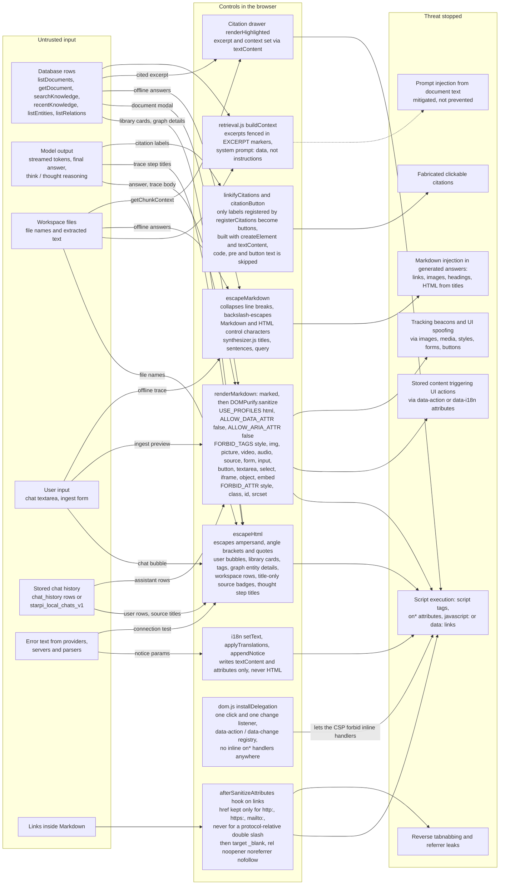
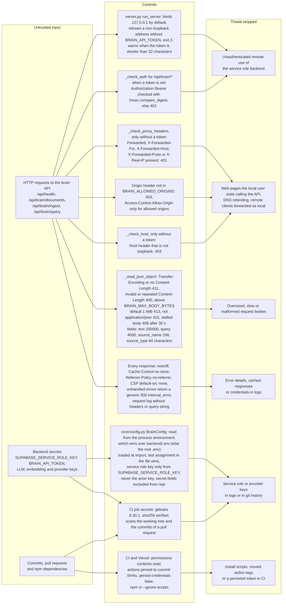

# Security Policy

## Supported versions

Security fixes are made on the `main` branch, which is what https://www.starpi.app deploys.

## Reporting a vulnerability

Please report vulnerabilities privately through GitHub:
**Security → Advisories → Report a vulnerability** in this repository. Do not open a public
issue for security problems.

Include the affected component (frontend, service worker, database policies, Python backend,
deployment scripts), reproduction steps, and the impact you observed. You can expect an initial
response within 7 days. Coordinated disclosure timelines are agreed per report.

## Scope

In scope:

- Cross-site scripting, HTML or Markdown injection, CSP bypasses in the web application
- Files added to the on-device workspace that execute code, escape the ingestion worker or make
  citations point at text the answer was not given
- Row Level Security or privilege problems in `backend/supabase` (reading or modifying another
  user's chats or private knowledge entries, bypassing `is_public`, calling privileged functions)
- Credential exposure (provider API keys, Supabase `service_role` key)
- Authentication, CORS or request-handling flaws in `backend/server.py`
- Service worker behaviour that caches private data or serves stale code

Out of scope:

- The Supabase **anon** key embedded in the frontend. It is public by design; access is
  enforced by RLS.
- Denial of service through large model downloads a user explicitly confirms
- Vulnerabilities in third-party providers (Supabase, Google Gemini, OpenRouter, Hugging Face)

## Security model in brief

- Browsers use the anon key plus an anonymous Supabase session. RLS limits chat history to its
  owner and private knowledge rows to their creator; browser roles cannot execute SECURITY
  DEFINER functions.
- The frontend ships with a strict Content-Security-Policy (no inline scripts, handlers or
  styles; no remote images) and sanitizes all rendered Markdown.
- The Python backend holds the `service_role` key, binds to `127.0.0.1` by default and requires
  a bearer token when exposed on another interface.
- CI runs gitleaks on the working tree and on the commits of every pull request.

The layers in detail (all diagrams are also in the
[architecture atlas](docs/ARCHITECTURE.md#9-security-layers)):

**Untrusted content on its way to the DOM**

<!-- diagram: security-layers-render -->

**Worker isolation, RLS, key handling, CSP and the build gate**

```mermaid
flowchart LR
    subgraph sg_in["Untrusted input"]
        iFile["Workspace files<br/>drop zone, file input, chat attachment"]
        iDb["Supabase reads and writes<br/>anon key plus anonymous session JWT"]
        iKey["Provider keys<br/>Gemini, OpenRouter"]
        iUrl["Own server URL cfgLlmUrl,<br/>stored as starpi_llm_url"]
        iSlip["Markup that slips past<br/>escaping and sanitizing"]
        iDist["dist/ build output<br/>index.html, bundles, sw.js"]
        iOrigin["Other sites and networks<br/>framing pages, opener windows,<br/>network attackers"]
    end

    subgraph sg_ctl["Controls"]
        cWorker["ingest.worker.js, Web Worker starpi-ingest<br/>parse, chunk and BM25 off the main thread,<br/>full text kept in worker memory, never uploaded or synced,<br/>failures return ParseError codes, ok false"]
        cParse["parser.js extractText<br/>extension allowlist txt, md, markdown, csv, log, json, pdf<br/>MAX_FILE_BYTES 25 MiB, MAX_TEXT_CHARS 5000000,<br/>at most MAX_PDF_PAGES 2000 read, normalizeText drops NUL and control chars"]
        cPdf["pdf.js legacy build inside the worker<br/>disableFontFace, useSystemFonts false,<br/>isOffscreenCanvasSupported false,<br/>PasswordException becomes encrypted_pdf"]
        cLocal["chat.js persistMessage localOnly:<br/>on-device mode, question and answer of a turn<br/>using workspace excerpts (question stored after retrieval)<br/>and questions with an attached file stay in localStorage<br/>matching excerpts still reach the cloud provider or own server"]
        cRls["Postgres RLS and grants<br/>visible = is_public or owner_id = auth.uid()<br/>published rows read-only for browser roles,<br/>brain_settings service role only, RPCs SECURITY INVOKER"]
        cCheck["CHECK size limits on browser-writable columns<br/>violations fail with SQLSTATE 23514"]
        cSync["canSyncChats: signedIn and hardened,<br/>otherwise chats stay in localStorage"]
        cSecret["storage.js writeSecret<br/>sessionStorage for this tab,<br/>localStorage only with remember keys,<br/>inputs cleared after save, clearKeys"]
        cHeader["providers.js: Gemini key in x-goog-api-key header,<br/>OpenRouter key as Authorization Bearer, never in a URL"]
        cNorm["providers.js normalizeServerUrl<br/>https anywhere, http only for localhost and 127.0.0.1,<br/>the plain-http hosts in connect-src, no user or password,<br/>query and hash dropped"]
        cCsp["vercel.json Content-Security-Policy<br/>default-src self, script-src self wasm-unsafe-eval, style-src self,<br/>img-src self data: blob:, worker-src self, media-src none,<br/>connect-src self data: https: wss://*.supabase.co<br/>http://localhost:* http://127.0.0.1:*<br/>object-src, frame-src, base-uri, form-action, frame-ancestors none"]
        cHdr["vercel.json headers: X-Frame-Options DENY, nosniff,<br/>COOP same-origin, HSTS max-age 63072000,<br/>Referrer-Policy strict-origin-when-cross-origin,<br/>Permissions-Policy microphone self only,<br/>camera, geolocation, payment, usb, serial, hid off"]
        cVerify["scripts/verify-dist.mjs after the build<br/>no inline script, style block, style attribute,<br/>on* handler or javascript: URL, scripts and stylesheets<br/>only from /assets/, referenced files exist, sw.js versioned,<br/>no eval or new Function, CSP without unsafe-inline or unsafe-eval"]
    end

    subgraph sg_thr["Threat stopped"]
        tFreeze["Frozen UI or exhausted memory<br/>from large or hostile files"]
        tPdf["Hostile PDF: font loading,<br/>parser failure in the page"]
        tLeak["Workspace files uploaded or synced<br/>to the database"]
        tTenant["Reading or changing other users' chats<br/>and private rows, editing published rows"]
        tSize["Oversized writes into the database"]
        tKey["Keys persisted on shared devices<br/>or exposed in URLs and logs"]
        tUrl["Cleartext http to remote hosts,<br/>credentials in URLs, non-http schemes"]
        tXss["Injected or inline script, eval"]
        tExfil["Image beacons and plugins: remote images,<br/>object, embed, frames, form posts"]
        tFrame["Clickjacking, cross-window access, downgrade"]
        tRegress["A build that breaks under<br/>or silently weakens the CSP"]
    end

    iFile --> cWorker
    iFile --> cParse
    iFile -->|"pdf"| cPdf
    cWorker --> tFreeze
    cWorker --> tLeak
    cParse --> tFreeze
    cPdf --> tPdf
    iFile -->|"attached-file questions,<br/>workspace turns: question and answer"| cLocal
    cLocal --> tLeak
    iDb --> cRls
    iDb --> cCheck
    iDb --> cSync
    cRls --> tTenant
    cSync -->|"no chat rows without owner RLS"| tTenant
    cCheck --> tSize
    iKey --> cSecret
    iKey --> cHeader
    cSecret --> tKey
    cHeader --> tKey
    iUrl --> cNorm
    cNorm --> tUrl
    iSlip --> cCsp
    iOrigin --> cHdr
    cCsp --> tXss
    cCsp --> tExfil
    cHdr --> tFrame
    iDist --> cVerify
    cVerify --> tRegress
```

<!-- diagram: security-layers-platform -->

**Backend API guards, backend secrets and CI supply chain**

<!-- diagram: security-layers-backend-ci -->

