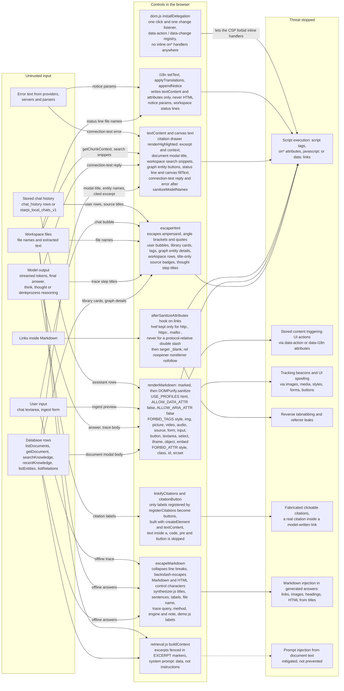

# Security Policy

## Supported versions

Security fixes are made on the `main` branch, which is what https://www.starpi.app deploys.

## Reporting a vulnerability

Please report vulnerabilities privately, preferably through GitHub:
**Security → Advisories → Report a vulnerability** in this repository. If you cannot use GitHub,
email **phoenixprojekt1@gmail.com** with the subject line `[starpi security]`. Do not open a
public issue, discussion or pull request for security problems.

Include the affected component (frontend, service worker, database policies, Python backend,
deployment scripts), the commit or release you tested, reproduction steps, and the impact you
observed.

### Coordinated disclosure

| Step | Target |
| --- | --- |
| Acknowledgement of your report | within 7 days |
| Triage: confirmed or declined, with a severity assessment | within 14 days |
| Fix released on `main` and deployed to www.starpi.app | within 90 days of the report |
| Public advisory (GitHub Security Advisory, CVE requested where applicable) | when the fix is released |

If a fix needs longer, we agree on a new date with you before the 90 days end. Reporters are
credited in the advisory unless they ask not to be. Please keep the details confidential until
the advisory is published.

### Safe harbor

We will not pursue or support legal action against research that follows this policy: testing
only against your own deployment, a local build or your own account on www.starpi.app; not
accessing, modifying or retaining other users' data; not degrading the service for others (no
load or denial-of-service testing); and reporting promptly through the channels above.

## Scope

In scope:

- Cross-site scripting, HTML or Markdown injection, CSP bypasses in the web application
- Files added to the on-device workspace that execute code, escape the ingestion worker or make
  citations point at text the answer was not given
- Row Level Security or privilege problems in `backend/supabase` (reading or modifying another
  user's chats or private knowledge entries, bypassing `is_public`, calling privileged functions)
- Credential exposure (provider API keys, Supabase `service_role` key)
- Authentication, CORS or request-handling flaws in `backend/server.py`
- Service worker behaviour that caches private data or serves stale code
- The source check or the receipt verifier reporting a match for text that does not match, or a
  receipt that the verifier accepts although its file, passage or hash was changed

Out of scope:

- The Supabase public key (publishable key or legacy **anon** JWT) embedded in the frontend. It
  is public by design; access is enforced by RLS. The build refuses secret and service-role keys.
- Denial of service through large model downloads a user explicitly confirms
- Vulnerabilities in third-party providers (Supabase, Google Gemini, OpenRouter, Hugging Face)

## Security model in brief

- Browsers use the anon key plus an anonymous Supabase session. RLS limits chat history to its
  owner and private knowledge rows to their creator; browser roles cannot execute SECURITY
  DEFINER functions.
- The frontend ships with a strict Content-Security-Policy (no inline scripts, handlers or
  styles; no remote images) and sanitizes all rendered Markdown.
- The Python backend holds the `service_role` key, binds to `127.0.0.1` by default and requires
  a bearer token when exposed on another interface.
- CI runs gitleaks on the working tree and on the commits of every pull request, and fails on
  any known advisory in a runtime npm dependency (`npm audit`) or in the backend requirements
  (`pip-audit`).
- Chat turns that use the on-device workspace are never synced and never sent to a cloud provider
  or an own server as chat history.

## Answer receipts and the source check

- **What a receipt contains.** The answer, the question and every excerpt the answer was given,
  cited or not (question and excerpts can be left out on export), SHA-256 fingerprints of the
  source files and of their extracted text, passage offsets and the source-check verdicts. A fingerprint identifies a file:
  whoever holds the file can tell it was a source, even when the excerpts are left out. Share a
  receipt only with people who may know that.
- **Where it goes.** Receipts are built in memory (at most 50 per page, never persisted) and leave
  the device only as a file you download. Verification reads the receipt and the original files on
  the device, in the ingest worker; nothing is uploaded.
- **What it proves.** That each workspace excerpt is an unchanged passage of the file with the
  recorded fingerprint. Receipts are **not signed**: they do not prove that Starpi produced the
  answer, which excerpts a model read, or that the answer is correct. See
  [docs/spec/receipts.md](docs/spec/receipts.md).
- **Untrusted receipts.** A receipt is JSON from anywhere. It is checked against size and field
  limits before use (`validateReceipt`), and everything shown from it is set as text, never as HTML.
- **The source check is a heuristic.** It compares numbers, dates, times, weekdays, codes,
  quotations and wording, and names in English statements, with the cited excerpts. It can miss a
  wrong statement that uses the excerpt's words, and it can flag a correct paraphrase; it is an aid
  for reading the sources, not a guarantee.

## Known limitations

- **Model downloads.** WebLLM downloads model weights from Hugging Face and the model library
  (WebAssembly) from GitHub at runtime. Starpi does not verify a hash of these files; it relies on
  HTTPS and on the pinned model ids. The Content-Security-Policy allows `wasm-unsafe-eval` for the
  model library and does not allow `unsafe-eval`.
- **Offline PDF reading.** pdf.js is loaded when the first PDF is read and then cached by the
  service worker. A PDF added offline before that fails with a clear message; text files work.
- **Anonymous sign-ins.** Every anonymous sign-in creates a user, and RLS bounds the size of each
  row a browser writes but not the number of rows. Enable CAPTCHA and rate limits for anonymous
  sign-ins (Supabase dashboard) before relying on it at scale.
- **Voice input.** Most browsers recognise speech on their vendor's servers. In the on-device mode
  voice input runs only where the browser offers on-device recognition (`processLocally`) and is
  switched off otherwise, with an explanation. In the other modes it uses the browser's speech
  service, which may send the audio to the browser vendor; the button's tooltip says so.

The layers in detail (all diagrams are also in the
[architecture atlas](docs/ARCHITECTURE.md#9-security-layers)):

**Untrusted content on its way to the DOM**

<!-- diagram: security-layers-render -->

```mermaid
flowchart LR
    subgraph sg_in["Untrusted input"]
        inDb["Database rows<br/>listDocuments, getDocument, searchKnowledge,<br/>recentKnowledge, listEntities, listRelations"]
        inModel["Model output<br/>streamed tokens, final answer,<br/>think, thought or denkprozess reasoning"]
        inWs["Workspace files<br/>file names and extracted text"]
        inUser["User input<br/>chat textarea, ingest form"]
        inHist["Stored chat history<br/>chat_history rows or<br/>starpi_local_chats_v1"]
        inErr["Error text from providers,<br/>servers and parsers"]
        inUrl["Links inside Markdown"]
    end

    subgraph sg_ctl["Controls in the browser"]
        cEsc["escapeHtml<br/>escapes ampersand, angle brackets and quotes<br/>user bubbles, library cards, tags, graph entity details,<br/>workspace rows, title-only source badges, thought step titles"]
        cEscMd["escapeMarkdown<br/>collapses line breaks, backslash-escapes<br/>Markdown and HTML control characters<br/>synthesizer.js titles, sentences, labels, file name,<br/>trace query, method, engine and note, demo.js labels"]
        cRender["renderMarkdown: marked, then DOMPurify.sanitize<br/>USE_PROFILES html, ALLOW_DATA_ATTR false, ALLOW_ARIA_ATTR false<br/>FORBID_TAGS style, img, picture, video, audio, source, form, input,<br/>button, textarea, select, iframe, object, embed<br/>FORBID_ATTR style, class, id, srcset"]
        cLink["afterSanitizeAttributes hook on links<br/>href kept only for http:, https:, mailto:,<br/>never for a protocol-relative double slash<br/>then target _blank, rel noopener noreferrer nofollow"]
        cCite["linkifyCitations and citationButton<br/>only labels registered by registerCitations become buttons,<br/>built with createElement and textContent,<br/>text inside a, code, pre and button is skipped"]
        cText["textContent and canvas text<br/>citation drawer renderHighlighted: excerpt and context,<br/>document modal title, workspace search snippets,<br/>graph entity buttons, status line and canvas fillText,<br/>connection-test reply and error after sanitizeModelNames"]
        cI18n["i18n setText, applyTranslations, appendNotice<br/>writes textContent and attributes only, never HTML<br/>notice params, workspace status lines"]
        cDeleg["dom.js installDelegation<br/>one click and one change listener,<br/>data-action / data-change registry,<br/>no inline on* handlers anywhere"]
        cFence["retrieval.js buildContext<br/>excerpts fenced in EXCERPT markers,<br/>system prompt: data, not instructions"]
    end

    subgraph sg_thr["Threat stopped"]
        tXss["Script execution: script tags,<br/>on* attributes, javascript: or data: links"]
        tAction["Stored content triggering UI actions<br/>via data-action or data-i18n attributes"]
        tTrack["Tracking beacons and UI spoofing<br/>via images, media, styles, forms, buttons"]
        tTab["Reverse tabnabbing and referrer leaks"]
        tFake["Fabricated clickable citations,<br/>a real citation inside a model-written link"]
        tMdInj["Markdown injection in generated answers:<br/>links, images, headings, HTML from titles"]
        tPrompt["Prompt injection from document text<br/>mitigated, not prevented"]
    end

    inDb -->|"library cards, graph details"| cEsc
    inDb -->|"document modal body"| cRender
    inDb -->|"modal title, entity names,<br/>cited excerpt"| cText
    inDb -->|"offline answers"| cEscMd
    inDb --> cFence
    inModel -->|"answer, trace body"| cRender
    inModel -->|"trace step titles"| cEsc
    inModel -->|"citation labels"| cCite
    inModel -->|"connection-test reply"| cText
    inWs -->|"file names"| cEsc
    inWs --> cFence
    inWs -->|"offline answers"| cEscMd
    inWs -->|"getChunkContext, search snippets"| cText
    inWs -->|"status line file names"| cI18n
    inUser -->|"chat bubble"| cEsc
    inUser -->|"ingest preview"| cRender
    inUser -->|"offline trace"| cEscMd
    inHist -->|"user rows, source titles"| cEsc
    inHist -->|"assistant rows"| cRender
    inErr -->|"notice params"| cI18n
    inErr -->|"connection-test error"| cText
    inUrl --> cLink

    cEsc --> tXss
    cRender --> tXss
    cRender --> tAction
    cRender --> tTrack
    cLink --> tXss
    cLink --> tTab
    cCite --> tFake
    cText --> tXss
    cI18n --> tXss
    cDeleg -->|"lets the CSP forbid inline handlers"| tXss
    cEscMd --> tMdInj
    cFence -.-> tPrompt
```

**Worker isolation, RLS, key handling, CSP and the build gate**

<!-- diagram: security-layers-platform -->

```mermaid
flowchart LR
    subgraph sg_in["Untrusted input"]
        iFile["Workspace files<br/>drop zone, file input, chat attachment"]
        iDb["Supabase access<br/>public key built into the bundle,<br/>anonymous session JWT, reads and writes"]
        iKey["Provider keys<br/>Gemini, OpenRouter"]
        iUrl["Own server URL cfgLlmUrl,<br/>stored as starpi_llm_url"]
        iNet["Responses from Supabase,<br/>providers and model downloads"]
        iSlip["Markup that slips past<br/>escaping and sanitizing"]
        iDist["dist/ build output<br/>index.html, bundles, app CSS,<br/>sw.js, build-manifest.json"]
        iOrigin["Other sites and networks<br/>framing pages, opener windows,<br/>network attackers"]
    end

    subgraph sg_ctl["Controls"]
        cWorker["ingest.worker.js, Web Worker starpi-ingest<br/>parse, chunk and BM25 off the main thread,<br/>full text kept in worker memory, never uploaded or synced by the app,<br/>failures return ParseError codes, ok false"]
        cParse["parser.js extractText<br/>extension allowlist txt, md, markdown, csv, log, json, pdf<br/>MAX_FILE_BYTES 25 MiB, MAX_TEXT_CHARS 5000000,<br/>at most MAX_PDF_PAGES 2000 read, normalizeText drops NUL and control chars"]
        cPdf["pdf.js legacy build inside the worker<br/>disableFontFace, useSystemFonts false,<br/>isOffscreenCanvasSupported false,<br/>PasswordException becomes encrypted_pdf,<br/>other document errors invalid_pdf,<br/>pdf.js failing to load becomes pdf_reader"]
        cLocal["chat.js and chat-store.js persistMessage localOnly:<br/>on-device mode, question and answer of a turn<br/>using workspace excerpts, question stored after retrieval,<br/>questions with an attached file and answers without a model<br/>that name a workspace file stay in localStorage<br/>with metadata local_only true, rows without the flag count as local"]
        cHist["chat.js shareableHistory: turns marked localOnly<br/>are never sent as history, the last 4 others go<br/>to OpenRouter and the own server, none to Gemini,<br/>matching excerpts still reach the provider"]
        cRls["Postgres RLS and grants<br/>visible = is_public or owner_id = auth.uid()<br/>published rows read-only for browser roles,<br/>chat_history: own rows, select, insert and delete,<br/>brain_settings service role only, RPCs SECURITY INVOKER"]
        cCheck["CHECK size limits on browser-writable columns<br/>violations fail with SQLSTATE 23514"]
        cSync["canSyncChats: signedIn and hardened,<br/>otherwise chats stay in localStorage"]
        cBuildKey["build.mjs assertPublicKey, lib/supabase-key.mjs<br/>sb_publishable_ key or a JWT with role anon,<br/>empty, sb_secret_, not a JWT or another role:<br/>the build fails"]
        cSecret["storage.js writeSecret<br/>sessionStorage for this tab,<br/>localStorage only with remember keys,<br/>inputs cleared after save, clearKeys"]
        cHeader["providers.js: Gemini key in x-goog-api-key header,<br/>OpenRouter key as Authorization Bearer, never in a URL"]
        cNorm["providers.js normalizeServerUrl<br/>https anywhere, http only for localhost and 127.0.0.1,<br/>the plain-http hosts in connect-src, no user or password,<br/>query and hash dropped"]
        cSw["sw.js fetch handler<br/>only same-origin GET requests handled,<br/>cross-origin requests bypass the worker,<br/>cached only when 200, basic and not no-store"]
        cCsp["vercel.json Content-Security-Policy<br/>default-src self, script-src self wasm-unsafe-eval, style-src self,<br/>font-src self, img-src self data: blob:, worker-src self,<br/>manifest-src self, media-src none,<br/>connect-src self data: https: wss://*.supabase.co<br/>http://localhost:* http://127.0.0.1:*<br/>object-src, frame-src, base-uri, form-action, frame-ancestors none"]
        cHdr["vercel.json headers: X-Frame-Options DENY, nosniff,<br/>COOP same-origin, HSTS max-age 63072000,<br/>Referrer-Policy strict-origin-when-cross-origin,<br/>Permissions-Policy microphone self only,<br/>camera, geolocation, payment, usb, serial, hid off"]
        cVerify["scripts/verify-dist.mjs in CI after npm run build:<br/>CSP compatibility, no inline script, style block, style attribute,<br/>on* handler or javascript: URL, scripts and stylesheets<br/>only from /assets/, referenced and precached files exist,<br/>no __STARPI_ placeholder in sw.js or the bundles,<br/>no eval or new Function, CSP without unsafe-inline or unsafe-eval"]
        cVerify2["scripts/verify-dist.mjs: version and offline shell<br/>buildVersion over index.html, asset URLs, public files<br/>and the sw.js template equals the manifest version,<br/>sw.js carries it, public files listed, ingest worker<br/>precached, /index.html not precached,<br/>app CSS contains ::highlight(starpi-review)"]
    end

    subgraph sg_thr["Threat stopped"]
        tFreeze["Frozen UI or exhausted memory<br/>from large or hostile files"]
        tPdf["Hostile PDF: font loading,<br/>parser failure in the page"]
        tLeak["Workspace content uploaded, synced<br/>or sent as chat history"]
        tTenant["Reading or changing other users' chats<br/>and private rows, editing published rows"]
        tSize["Oversized writes into the database"]
        tSecretKey["A key that bypasses RLS<br/>shipped to every browser"]
        tKey["Keys persisted on shared devices<br/>or exposed in URLs and logs"]
        tUrl["Cleartext http to remote hosts,<br/>credentials in URLs, non-http schemes"]
        tCache["Private API responses<br/>kept in CacheStorage"]
        tXss["Injected or inline script, eval"]
        tExfil["Image beacons and plugins: remote images,<br/>object, embed, frames, form posts"]
        tFrame["Clickjacking, cross-window access, downgrade"]
        tRegress["A build that breaks under or weakens the CSP,<br/>serves stale code or has no offline workspace"]
    end

    iFile --> cWorker
    iFile --> cParse
    iFile -->|"pdf"| cPdf
    cWorker --> tFreeze
    cWorker --> tLeak
    cParse --> tFreeze
    cPdf --> tPdf
    iFile -->|"attached-file questions,<br/>workspace turns: question and answer,<br/>answers without a model naming<br/>a workspace file"| cLocal
    iFile -->|"workspace and attached-file turns,<br/>turns whose answer without a model<br/>names a workspace file"| cHist
    cLocal --> tLeak
    cHist --> tLeak
    iDb --> cBuildKey
    iDb --> cRls
    iDb --> cCheck
    iDb --> cSync
    cBuildKey --> tSecretKey
    cRls --> tTenant
    cSync -->|"no chat rows without owner RLS"| tTenant
    cCheck --> tSize
    iKey --> cSecret
    iKey --> cHeader
    cSecret --> tKey
    cHeader --> tKey
    iUrl --> cNorm
    cNorm --> tUrl
    iNet --> cSw
    cSw --> tCache
    iSlip --> cCsp
    iOrigin --> cHdr
    cCsp --> tXss
    cCsp --> tExfil
    cHdr --> tFrame
    iDist --> cVerify
    iDist --> cVerify2
    cVerify --> tRegress
    cVerify2 --> tRegress
```

**Backend API guards, backend secrets and CI supply chain**

<!-- diagram: security-layers-backend-ci -->

```mermaid
flowchart LR
    subgraph sg_in["Untrusted input"]
        iReq["HTTP requests to the brain API<br/>/api/health, /api/brain/documents,<br/>/api/brain/ingest, /api/brain/query"]
        iSecret["Backend secrets<br/>SUPABASE_SERVICE_ROLE_KEY, BRAIN_API_TOKEN,<br/>LLM, embedding and provider keys"]
        iRepo["Commits, pull requests,<br/>npm and pip dependencies"]
    end

    subgraph sg_ctl["Controls"]
        cBind["server.py run_server: binds 127.0.0.1 by default,<br/>refuses a non-loopback address without BRAIN_API_TOKEN, exit 2,<br/>warns when the token is shorter than 32 characters"]
        cProxy["_check_proxy_headers, only without a token:<br/>Forwarded, X-Forwarded-For, X-Forwarded-Host,<br/>X-Forwarded-Proto or X-Real-IP present: 401"]
        cOrigin["Origin header not in BRAIN_ALLOWED_ORIGINS: 403,<br/>Access-Control-Allow-Origin only for allowed origins"]
        cHost["_check_host, only without a token:<br/>Host header that is not loopback: 403"]
        cAuth["_check_auth for /api/brain/* when a token is set:<br/>Authorization Bearer checked with hmac.compare_digest, else 401"]
        cBody["_read_json_object: Transfer-Encoding or no Content-Length 411,<br/>invalid or repeated Content-Length 400, above BRAIN_MAX_BODY_BYTES<br/>default 1 MiB 413, not application/json 415, stalled body 408 after 30 s<br/>fields: text 200000, query 4000, source_name 256, source_type 64 characters"]
        cResp["Every response: nosniff, Cache-Control no-store,<br/>Referrer-Policy no-referrer, CSP default-src none,<br/>unhandled errors return a generic 500 internal_error,<br/>request log without headers or query string"]
        cVisible["core/supabase_client.py VISIBLE_ROWS<br/>is_public true or owner_id null:<br/>list_documents filtered, match_knowledge_sections<br/>matches kept only for such documents,<br/>a failed lookup falls back to the in-memory search"]
        cCfg["core/config.py BrainConfig: read from the process environment,<br/>which wins over backend/.env (else the root .env)<br/>loaded at import, last assignment in the file wins,<br/>service role key only from SUPABASE_SERVICE_ROLE_KEY,<br/>never the anon key, secret fields excluded from repr"]
        cLeaks["CI job secrets: gitleaks 8.30.1, sha256 verified,<br/>scans the working tree and the commits of a pull request"]
        cAudit["CI job audit: npm audit --omit=dev fails on any advisory<br/>in a runtime dependency, pip-audit on<br/>backend/requirements-dev.txt fails on any advisory,<br/>development tooling: warning at high severity only"]
        cSupply["CI and Vercel: permissions contents read,<br/>actions pinned to commit SHAs, persist-credentials false,<br/>npm ci --ignore-scripts"]
        cRelease["release.yml: contents write for the release job only,<br/>which installs nothing and runs gh release create,<br/>after CI succeeded on a push to main or by hand on main,<br/>version always from package.json, no dispatch inputs,<br/>SHA-pinned checkout, persist-credentials false"]
    end

    subgraph sg_thr["Threat stopped"]
        tRemote["Unauthenticated remote use of<br/>the service role backend"]
        tRebind["Web pages the local user visits calling the API,<br/>DNS rebinding, remote clients forwarded as local"]
        tAbuse["Oversized, slow or malformed request bodies"]
        tInfo["Error details, cached responses<br/>or credentials in logs"]
        tPrivate["Private rows of browser sessions<br/>read through the service role,<br/>which bypasses RLS"]
        tKeys["Service role or provider keys<br/>in logs or in git history"]
        tSupply["Install scripts, moved action tags,<br/>a persisted token or write access<br/>in jobs that run dependency code"]
        tVuln["Dependencies with a published advisory<br/>shipped in dist/ or installed for the backend"]
    end

    iReq --> cBind
    iReq --> cProxy
    iReq --> cOrigin
    iReq --> cHost
    iReq --> cAuth
    iReq --> cBody
    iReq --> cResp
    iReq -->|"documents, query"| cVisible
    cBind --> tRemote
    cAuth --> tRemote
    cProxy --> tRebind
    cOrigin --> tRebind
    cHost --> tRebind
    cBody --> tAbuse
    cResp --> tInfo
    cVisible --> tPrivate
    iSecret --> cCfg
    iSecret --> cLeaks
    iRepo --> cLeaks
    iRepo --> cSupply
    iRepo --> cAudit
    cAudit --> tVuln
    cCfg --> tKeys
    cLeaks --> tKeys
    cSupply --> tSupply
    iRepo --> cRelease
    cRelease --> tSupply
```
