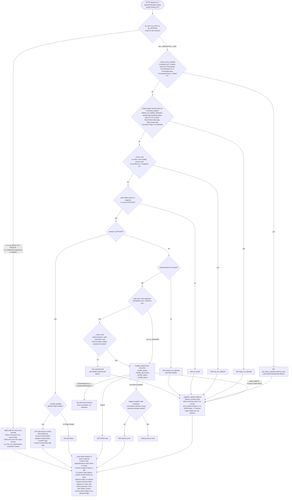
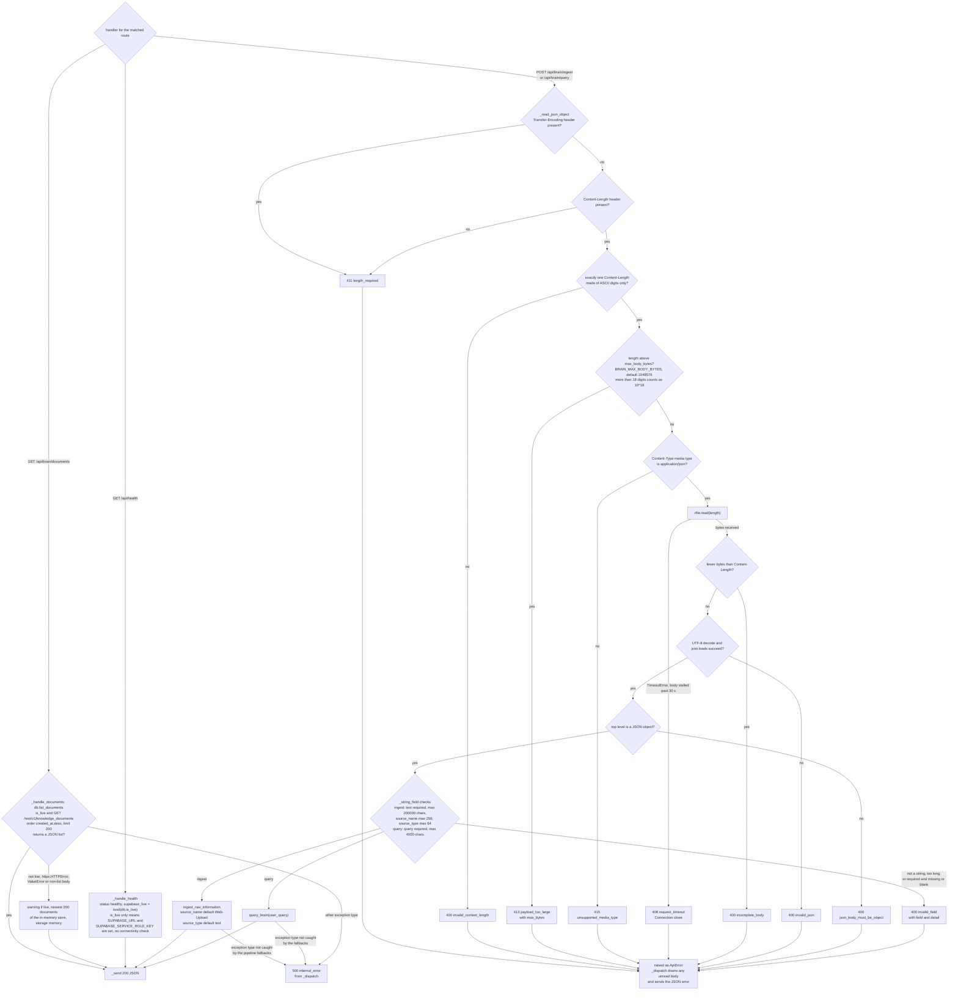
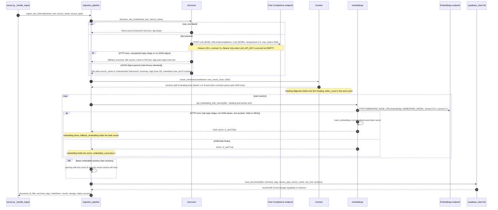
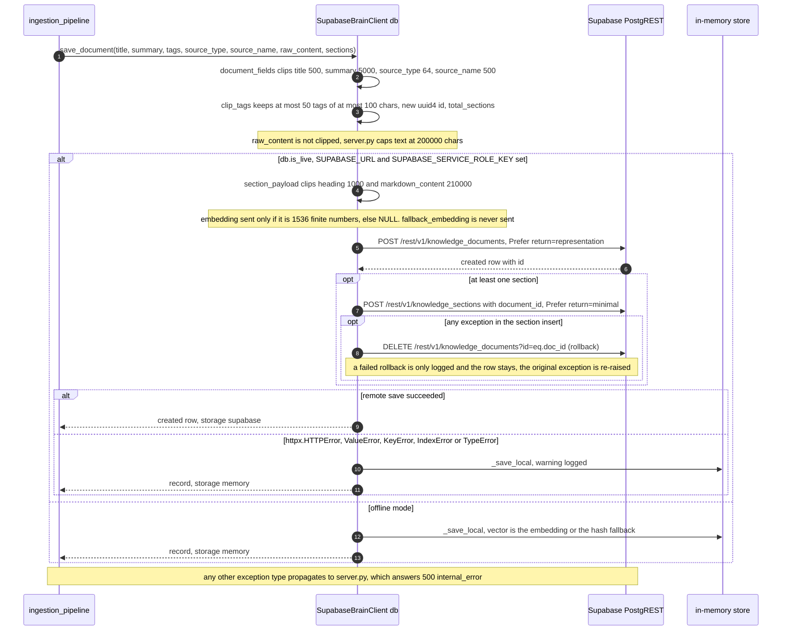
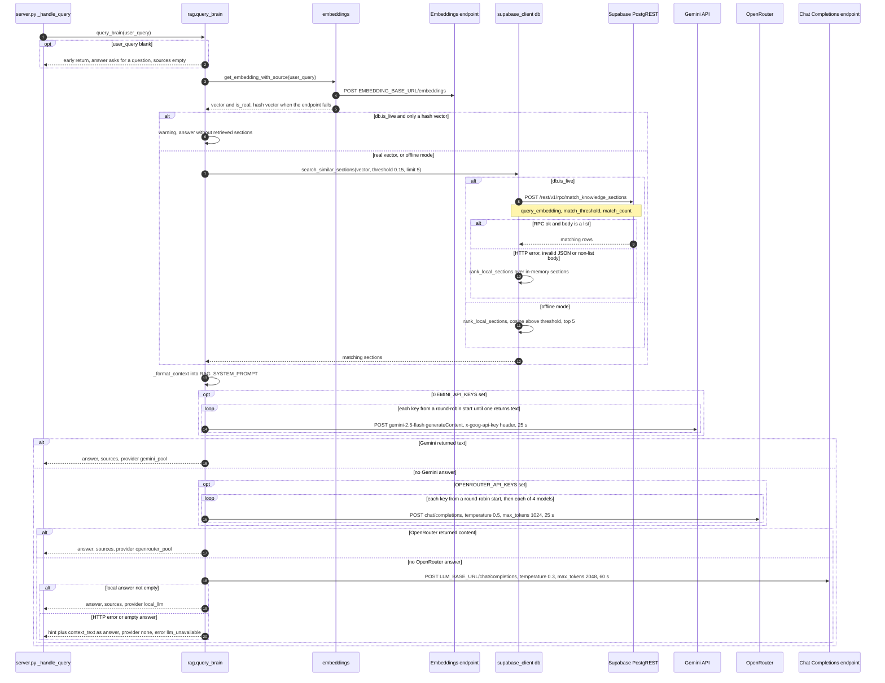
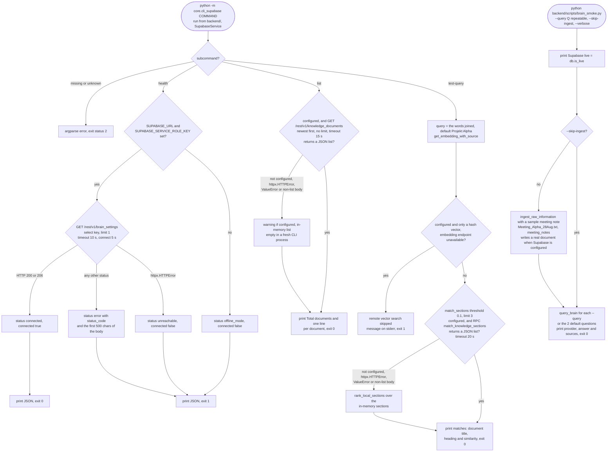

# Starpi backend (optional)

A dependency-light Python service for server-side ingestion and retrieval. It structures raw text
into Markdown sections, stores them with 1536-dimensional embeddings in Supabase and answers
questions over pgvector search. The browser app does not call it: the PWA reads Supabase directly
with the anon key and row level security.

The backend writes with the Supabase **service role key**, which bypasses RLS. Run it only on a
machine you control, keep it on `127.0.0.1` or behind a TLS reverse proxy with `BRAIN_API_TOKEN`
set, and never ship the service role key or the API token to a browser. The full set of backend
diagrams is in the [architecture atlas](../docs/ARCHITECTURE.md#10-optional-backend).

## Run locally

```bash
cd backend
python -m pip install -r requirements.txt
cp .env.example .env        # fill in the values you need, see below
python server.py            # 127.0.0.1:9200; override with: python server.py 9300 --host 127.0.0.1 --log-level DEBUG
```

Without `SUPABASE_URL` and `SUPABASE_SERVICE_ROLE_KEY` the service runs on an in-memory store,
which is enough for development and for the tests.

## Configuration

Values come from the process environment, then from `backend/.env` (or `.env` in the repository
root); the environment always wins, and within the file the last assignment of a key wins.
[`.env.example`](.env.example) documents every variable.

| Variable | Default | Purpose |
| --- | --- | --- |
| `SUPABASE_URL`, `SUPABASE_SERVICE_ROLE_KEY` | empty | Supabase project; both are required, and if either is empty documents are kept in memory only |
| `LLM_BASE_URL`, `LLM_API_KEY`, `LLM_MODEL` | `http://127.0.0.1:8000/v1`, `EMPTY`, `Qwen/Qwen2.5-7B-Instruct` | Chat Completions-compatible endpoint for structuring and answers |
| `GEMINI_API_KEYS`, `OPENROUTER_API_KEYS` | empty | Optional key pools, comma separated, tried before `LLM_BASE_URL` for answers |
| `EMBEDDING_BASE_URL`, `EMBEDDING_API_KEY`, `EMBEDDING_MODEL` | `http://127.0.0.1:8000/v1`, `EMPTY`, see `.env.example` | `/v1/embeddings` endpoint returning 1536 dimensions; set the model your endpoint serves. Without the endpoint, sections are stored without embeddings |
| `BRAIN_SERVER_HOST`, `BRAIN_SERVER_PORT` | `127.0.0.1`, `9200` | Bind address; any non-loopback address requires `BRAIN_API_TOKEN` |
| `BRAIN_API_TOKEN` | empty | Bearer token for `/api/brain/*` (`openssl rand -hex 32`) |
| `BRAIN_ALLOWED_ORIGINS` | local dev servers and `starpi.app` | CORS allow-list, comma separated |
| `BRAIN_MAX_BODY_BYTES` | `1048576` | Largest accepted request body |
| `BRAIN_LOG_LEVEL` | `INFO` | `DEBUG`, `INFO`, `WARNING` or `ERROR` |

## Endpoints

| Method and path | Token | Body | Response |
| --- | --- | --- | --- |
| `GET /api/health` | never | none | `{"status": "healthy", "supabase_live": bool}`; `supabase_live` only means URL and key are set |
| `GET /api/brain/documents` | when set | none | `{"documents": [...], "count": n}` |
| `POST /api/brain/ingest` | when set | `{"text": str, "source_name"?: str, "source_type"?: str}` (200000 / 256 / 64 characters) | document id, title, summary, tags, Markdown, section and embedding counts, storage |
| `POST /api/brain/query` | when set | `{"query": str}` (4000 characters) | `answer`, `sources`, `provider` (`gemini_pool`, `openrouter_pool` or `local_llm`); when no model answers, still 200 with `provider` `none`, `error` `llm_unavailable` and the retrieved context as `answer` |

Rejected requests get a 4xx or 5xx status and a JSON object with an `error` code. Every response,
including errors, carries the security headers.

## Request handling

Every request passes the same guards in a fixed order before a handler runs:

<!-- diagram: backend-request-routing -->


JSON bodies are bounded and validated before any work starts:

<!-- diagram: backend-request-body -->


Start-up refuses unsafe configurations:

```mermaid
flowchart TD
    Start(["python server.py [port] [--host HOST] [--log-level LEVEL]"]) --> Env["import core.config<br/>loads backend/.env, else the repo-root .env<br/>parse_env_line: a quoted value ends at its matching quote,<br/>an unquoted value drops a whitespace # comment<br/>last assignment of a key in the file wins<br/>variables already in the environment win"]
    Env --> Cfg["config = BrainConfig()<br/>BRAIN_SERVER_HOST default 127.0.0.1<br/>BRAIN_SERVER_PORT default 9200"]
    Cfg --> Int{"BRAIN_SERVER_PORT or BRAIN_MAX_BODY_BYTES<br/>set but not an integer?"}
    Int -->|"yes"| IntW["warning, default value used"]
    Int -->|"no"| LL
    IntW --> LL{"_env_log_level<br/>BRAIN_LOG_LEVEL value?"}
    LL -->|"empty"| LInfo["log_level INFO"]
    LL -->|"not DEBUG, INFO,<br/>WARNING or ERROR"| LWarn["warning without the raw value<br/>log_level INFO"]
    LL -->|"valid, case-insensitive"| LSet["log_level = that level"]
    LInfo --> Db
    LWarn --> Db
    LSet --> Db
    Db["server.py imports core.supabase_client<br/>db = SupabaseBrainClient()<br/>is_live = SUPABASE_URL and SUPABASE_SERVICE_ROLE_KEY<br/>both set, no network call"] --> Args
    Args{"main(): argparse<br/>--log-level upper-cased, one of LOG_LEVELS,<br/>default config.log_level<br/>port, if given, an integer?"}
    Args -->|"no"| ArgErr["argparse error, exit status 2"]
    Args -->|"yes"| Basic["logging.basicConfig(level)"]
    Basic --> Host["run_server<br/>host = --host or BRAIN_SERVER_HOST<br/>port = argument or BRAIN_SERVER_PORT"]
    Host --> Loop{"host is not localhost or a loopback IP<br/>and BRAIN_API_TOKEN is empty?"}
    Loop -->|"yes"| Refuse["log error, raise SystemExit(2)"]
    Loop -->|"no"| TokLen{"token set but shorter<br/>than 32 characters?"}
    TokLen -->|"yes"| TokW["warning"]
    TokLen -->|"no"| Bind
    TokW --> Bind["create_server: BrainHTTPServer (ThreadingHTTPServer)<br/>daemon_threads False, request threads not daemonic<br/>AF_INET6 when the host contains a colon<br/>server_bind skips the reverse DNS lookup"]
    Bind -->|"OSError, e.g. address in use"| BindErr["not caught: traceback, exit status 1"]
    Bind --> Sig{"running in the main thread?"}
    Sig -->|"yes"| SigT["install SIGTERM handler: logs Received SIGTERM,<br/>httpd.shutdown in a daemon thread"]
    Sig -->|"no"| Listen
    SigT --> Listen["log Brain API listening<br/>with supabase_live and token_auth"]
    Listen --> Live{"db.is_live?"}
    Live -->|"no"| MemW["warning: Supabase is not configured,<br/>documents are kept in memory only"]
    Live -->|"yes"| Serve
    MemW --> Serve["serve_forever"]
    Serve -->|"SIGTERM shutdown or KeyboardInterrupt"| Close["finally: server_close<br/>joins the non-daemon request threads,<br/>so requests in flight finish first"]
```

<!-- diagram: backend-request-startup -->


## Pipelines

Ingestion structures the text, chunks it and embeds each section:

<!-- diagram: backend-pipelines-ingest -->


On Supabase, a document whose sections cannot be inserted is deleted again (best effort: a failed
rollback is only logged and the row stays). A failed remote save falls back to the in-memory store:

<!-- diagram: backend-pipelines-storage -->


Queries embed the question, search pgvector and ask the answer providers in order:

<!-- diagram: backend-pipelines-query -->


## Command line

<!-- diagram: backend-pipelines-cli -->


## Tests

```bash
python -m pip install -r requirements-dev.txt
ruff check . && ruff format --check .
python -m unittest discover -s . -p 'test_*.py'
```

The unit tests run offline: calls to external services are mocked or replaced with fakes, and the
server tests send real HTTP requests to a server started on `127.0.0.1` with an ephemeral port. `scripts/brain_smoke.py` is a manual end-to-end
check against live endpoints. The database policies are tested separately with
`supabase/tests/run_rls_tests.sh` (see [supabase/README.md](supabase/README.md)).

## Deployment

[aws/cloud_architecture.md](aws/cloud_architecture.md) describes the EC2 deployment with
`remote_sync.sh` and `aws/deploy_ec2.sh`, the reverse proxy and operations.
