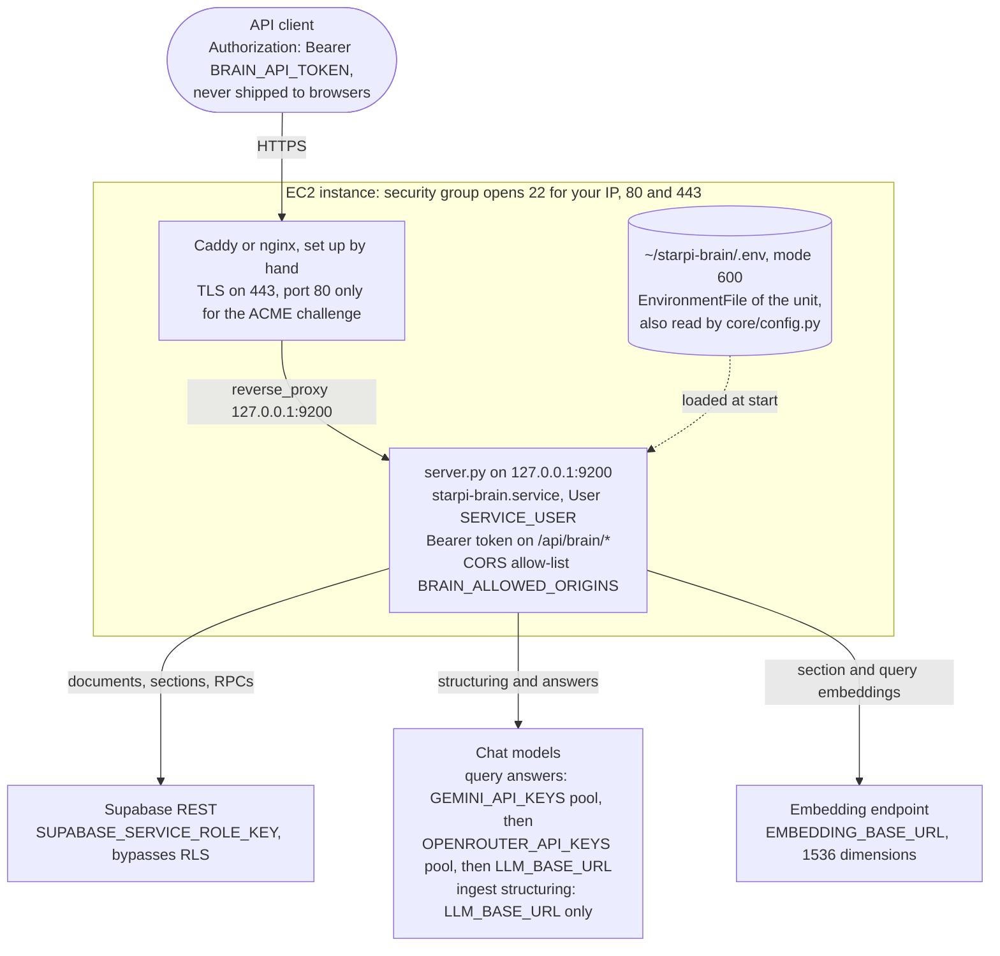

# Running the backend on AWS EC2

The Starpi PWA runs in the browser and talks to Supabase directly with the anon key; anonymous
sign-ins plus owner-based row level security keep each user's rows private. The Python backend in
`backend/` is optional. It ingests documents and answers retrieval queries with the Supabase
**service role key**, which bypasses RLS, so it must only run on a machine you control.

## Architecture

<!-- diagram: deployment-ec2-topology -->

`BRAIN_API_TOKEN` is a server credential. Do not embed it in the PWA or any other code shipped to
browsers.

A reverse proxy on the same host forwards every client from `127.0.0.1`, so the API must not run
without a token behind it. `aws/deploy_ec2.sh` generates one (`openssl rand -hex 32`, stored in
`.env` with mode 600, never printed) whenever it is missing or empty. As a second line of defence,
`server.py` without a token refuses every request that carries `Forwarded`, `X-Forwarded-*` or
`X-Real-IP` headers (401). Not every proxy adds those headers (nginx does not by default), so the
token is what actually protects the API.

## Network

| Port | Exposure |
| --- | --- |
| 22 | SSH, restricted to your own IP in the security group |
| 80, 443 | Reverse proxy (80 only for the ACME certificate challenge) |
| 9200 | Loopback only. Never open it in the security group |

There is no separate web UI port; the PWA is hosted elsewhere.

## Deployment

1. Launch an Ubuntu 22.04 or 24.04 instance. A small instance (e.g. `t3.small`) is enough for the
   API; model inference needs a GPU instance or a hosted endpoint.
2. From your machine run `backend/remote_sync.sh <host> <key.pem>`. It copies `backend/` (never the
   local `.env`) to `~/starpi-brain` and runs `aws/deploy_ec2.sh`, which creates a virtualenv,
   installs `requirements.txt`, generates `BRAIN_API_TOKEN` in `.env` if it is not set yet and
   installs `starpi-brain.service` bound to `127.0.0.1`.
3. On the server, fill in the rest of `~/starpi-brain/.env` (mode 600), then
   `sudo systemctl restart starpi-brain`. API clients read the token from that file.
4. Install Caddy (or nginx) and proxy your domain to the API, for example
   `api.example.com { reverse_proxy 127.0.0.1:9200 }`.
5. Check: `curl https://api.example.com/api/health` and
   `curl -H "Authorization: Bearer $TOKEN" https://api.example.com/api/brain/documents`.

What the two scripts do, including their failure paths:

```mermaid
flowchart TD
    Op(["operator machine<br/>backend/remote_sync.sh HOST KEY [REMOTE_USER]<br/>REMOTE_USER default ubuntu"]) --> KeyChk{"HOST and KEY given, key readable<br/>and its path without a single quote?"}
    KeyChk -->|"no"| Exit1["usage or error message, exit 1"]
    KeyChk -->|"yes"| Mode["warn if the key mode grants group or other<br/>any permission, the file is never changed"]
    Mode --> Sync["ssh mkdir -p REMOTE_DIR, default starpi-brain<br/>rsync -az backend/ excluding .env, .env.local, .venv,<br/>__pycache__, *.pyc, *.log, .ruff_cache<br/>.env.example is copied"]
    Sync --> Run["ssh: bash REMOTE_DIR/aws/deploy_ec2.sh<br/>SERVICE_USER is not passed on"]
    subgraph sg_ec2["EC2 host, Ubuntu 22.04 or 24.04"]
        User{"SERVICE_USER, default ubuntu,<br/>is not root and exists?"}
        User -->|"no"| Exit2["exit 1"]
        User -->|"yes"| S1["step 1 of 5: sudo apt-get update, apt-get install<br/>python3 python3-venv curl openssl"]
        S1 --> S2["step 2 of 5: python3 -m venv .venv<br/>pip install --upgrade pip, pip install -r requirements.txt"]
        S2 --> S3["step 3 of 5: umask 077<br/>.env copied from .env.example if missing<br/>chmod 600 .env"]
        S3 --> Tok{"last BRAIN_API_TOKEN assignment<br/>in .env has a value?"}
        Tok -->|"missing or empty"| Gen{"openssl rand -hex 32<br/>is 64 lowercase hex chars?"}
        Gen -->|"no"| Exit3["abort, exit 1"]
        Gen -->|"yes"| Write["temp file with mode 600: first assignment replaced,<br/>later ones dropped, appended if none, then mv<br/>token never printed or logged"]
        Tok -->|"yes"| S4
        Write --> S4["step 4 of 5: /etc/systemd/system/starpi-brain.service<br/>User SERVICE_USER, EnvironmentFile .env<br/>ExecStart .venv/bin/python server.py --host 127.0.0.1<br/>Restart on-failure, RestartSec 5<br/>NoNewPrivileges, ProtectSystem strict, ProtectHome read-only"]
        S4 --> S5["step 5 of 5: systemctl daemon-reload,<br/>enable and restart starpi-brain"]
        S5 --> HC{"curl http://127.0.0.1:PORT/api/health OK?<br/>PORT from BRAIN_SERVER_PORT in .env or 9200<br/>up to 10 tries, 1 s apart"}
        HC -->|"yes"| HCok["print Health check OK"]
        HC -->|"never"| HCno["no error, the script continues"]
        HCok --> Status["systemctl status, 5 lines<br/>print the next steps"]
        HCno --> Status
        S5 --> API["server.py on 127.0.0.1, port 9200 by default<br/>Bearer token on /api/brain/*<br/>port never opened in the security group"]
        Manual["manual: fill in .env with SUPABASE_URL,<br/>SUPABASE_SERVICE_ROLE_KEY and model endpoints,<br/>add the site origin to BRAIN_ALLOWED_ORIGINS,<br/>then sudo systemctl restart starpi-brain"]
        Proxy["manual: TLS reverse proxy, Caddy or nginx<br/>ports 443, and 80 for ACME<br/>not installed by the script"]
        Status -.-> Manual
        Status -.-> Proxy
        Manual -.-> API
        Proxy -->|"reverse_proxy 127.0.0.1:9200"| API
    end
    Run --> User
    Client(["API client"]) -->|"HTTPS with Authorization Bearer BRAIN_API_TOKEN"| Proxy
    API -->|"service role key"| SB[("Supabase REST")]
    API --> Models["chat model and embedding endpoints"]
```

<!-- diagram: deployment-ec2 -->

## Operations

- Logs: `journalctl -u starpi-brain -f`
- Updates: rerun `remote_sync.sh`; the deploy script restarts the service.
- Costs: set an AWS Budgets alert on the account.
- Secrets: if the service role key or API token leaks, rotate it in Supabase / the `.env` and
  restart the service.
