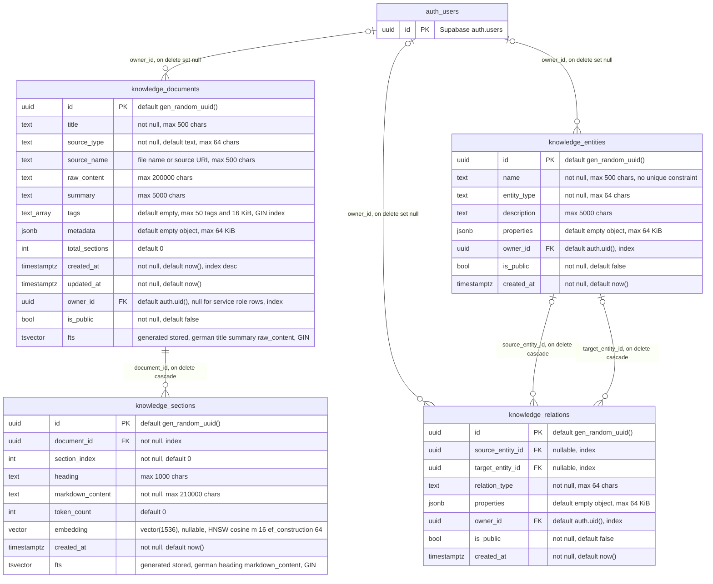
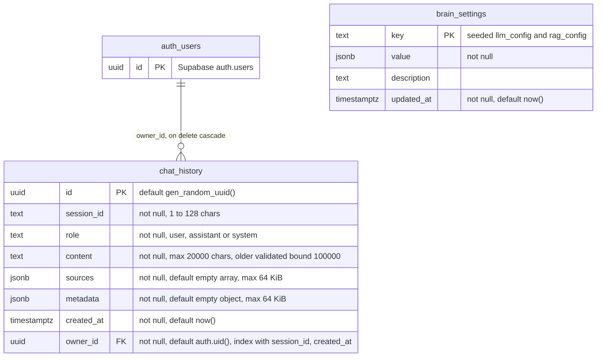
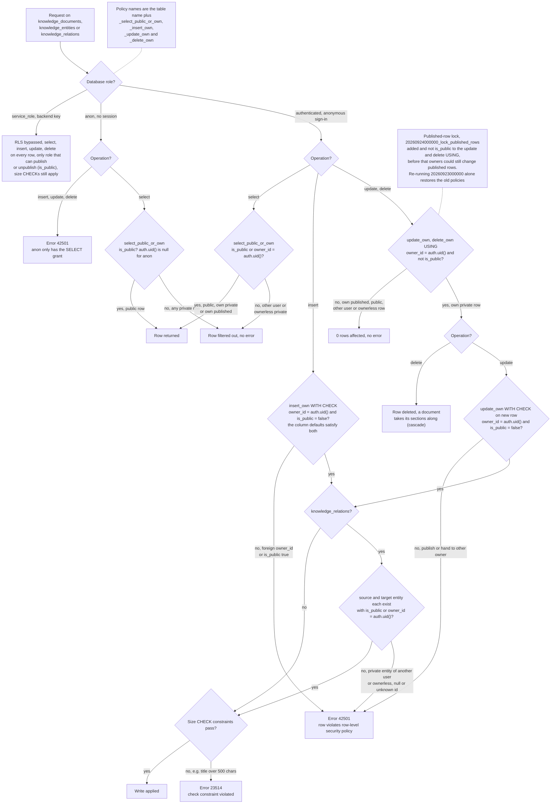
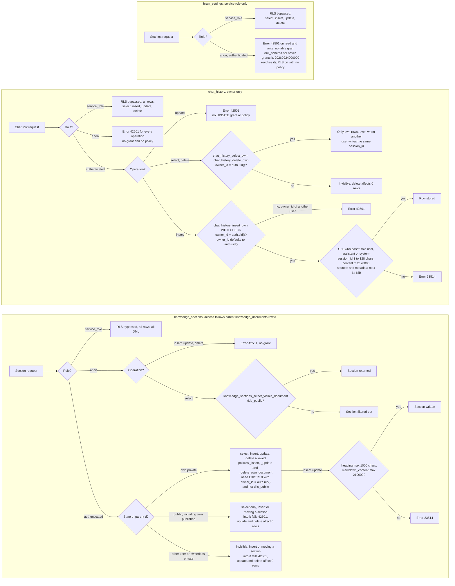
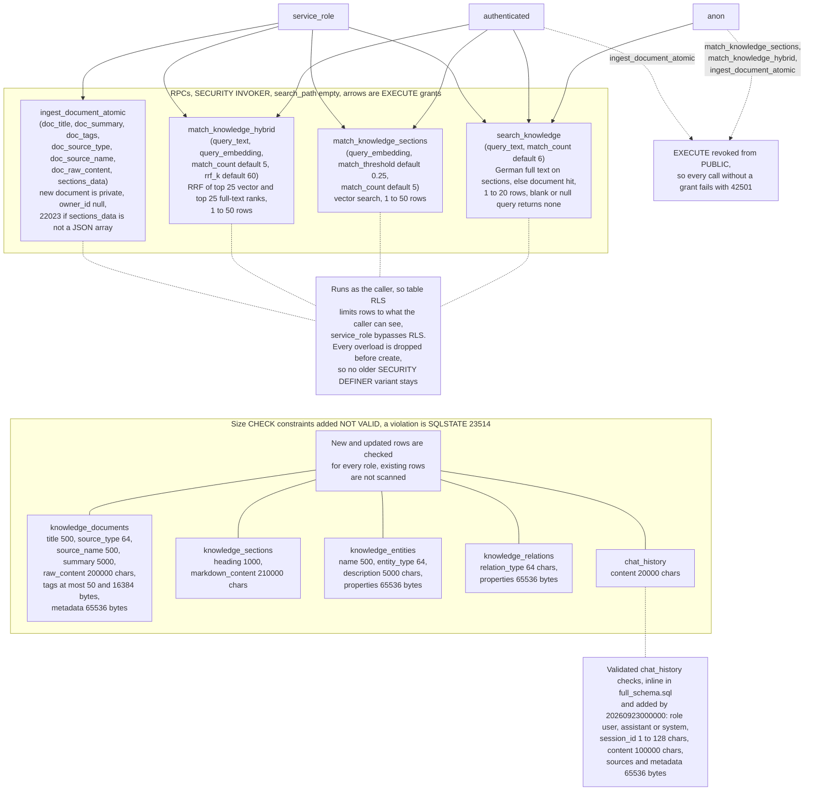
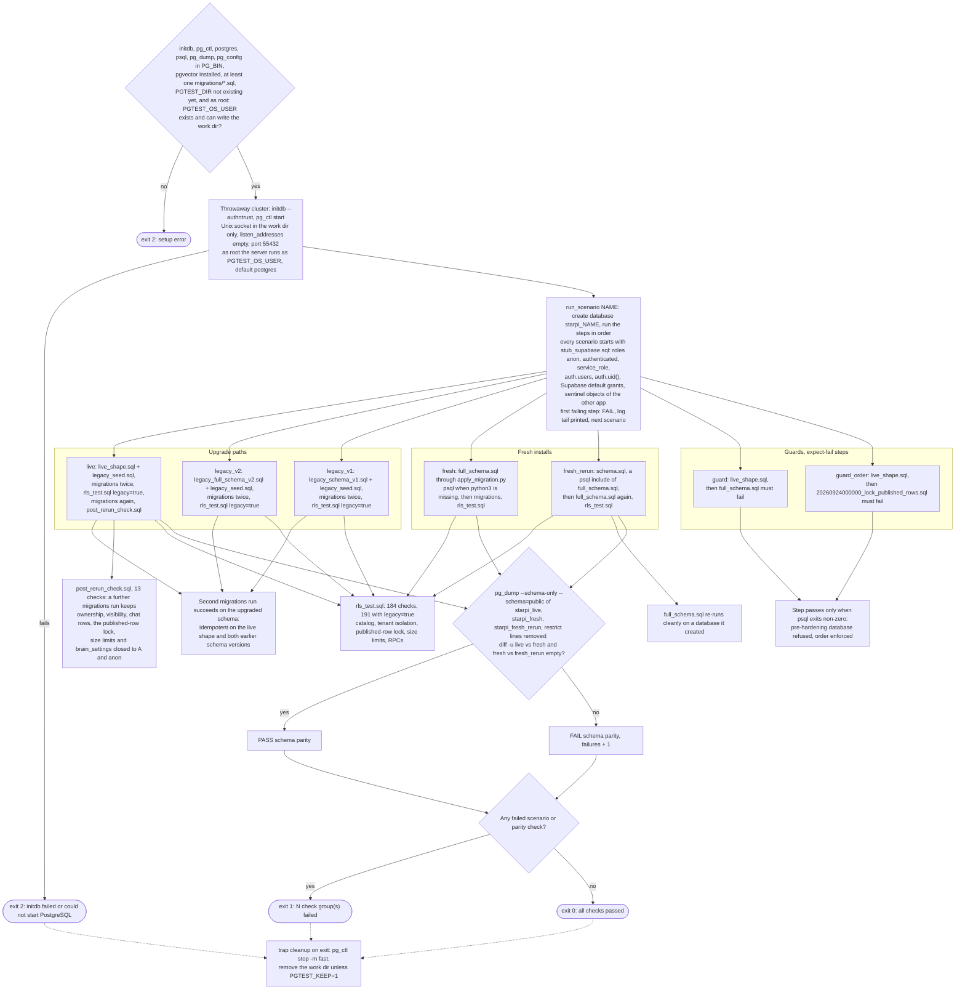

# Starpi database (Supabase)

SQL for the Starpi knowledge base: documents and sections with 1536-dim
pgvector embeddings (HNSW index), German full-text search, a small knowledge
graph, chat history and the RPCs used by the browser and the backend.

| Path | Purpose |
| --- | --- |
| `full_schema.sql` | Fresh install. Canonical schema (the state after all migrations), safe to re-run on a database it created. Refuses to run on a pre-hardening schema. |
| `migrations/20260923000000_harden_rls_anonymous_auth.sql` | Upgrade 1 of an existing database (the live project and any install from an earlier `schema.sql` / `full_schema.sql`): owner-based RLS for anonymous sign-ins. Idempotent. |
| `migrations/20260924000000_lock_published_rows.sql` | Upgrade 2 (needs upgrade 1): published rows read-only for browser roles, `brain_settings` service role only, size limits for browser writes. Idempotent. |
| `schema.sql` | Kept for old links: includes `full_schema.sql` when run with psql. |
| `apply_migration.py` | Applies `full_schema.sql`, given files or all migrations (in file-name order) to `DATABASE_URL`. |
| `tests/` | Local PostgreSQL tests for RLS, privileges, RPCs, size limits and idempotency (`run_rls_tests.sh`). |

Every SQL file runs in one transaction: if anything fails, nothing from that
file is changed. After `full_schema.sql`, applying the migrations changes
nothing, and the schema is identical to an upgraded database (checked by the
tests with `pg_dump`).

## Prerequisites

1. **Enable anonymous sign-ins**: Supabase dashboard, *Authentication > Sign In / Providers > Anonymous sign-ins*.
   The browser calls `supabase.auth.signInAnonymously()` and then works as role
   `authenticated` with its own user id. Without it the browser stays on the
   `anon` role: it can read public knowledge but cannot store chats or add
   documents.
2. Recommended for anonymous sign-ins: CAPTCHA protection (*Authentication > Attack Protection*)
   and a sensible rate limit for anonymous sign-ins (*Authentication > Rate Limits*).
   Every sign-in creates a row in `auth.users`.
3. The `vector` extension must live in schema `public` (it does in the live
   project; `full_schema.sql` and `20260923000000` check this and stop with a
   clear error otherwise).
4. Run the SQL as the owner of the Starpi tables (`postgres`, the default in
   the SQL editor and for the database connection string). Check with
   `select tablename, tableowner from pg_tables where tablename like 'knowledge_%' or tablename = 'chat_history';`

## Applying

Take a backup of the Starpi tables first (see [Rollback](#rollback)).

**Existing project (live database)**: apply the migrations in file-name order:

1. `migrations/20260923000000_harden_rls_anonymous_auth.sql`
2. `migrations/20260924000000_lock_published_rows.sql`

- SQL editor: paste and run the first file, then the second.
- psql:
  ```bash
  for f in backend/supabase/migrations/*.sql; do
      psql "$DATABASE_URL" -X -v ON_ERROR_STOP=1 -f "$f" || break
  done
  ```
- Python: `DATABASE_URL=... python backend/supabase/apply_migration.py --migrations`
  (all files in `migrations/`, in order, stops at the first failure)
- Supabase CLI: copy both files into your CLI project's `supabase/migrations/`
  and run `supabase db push`. Each file has its own `begin; ... commit;`.

The second file checks that the first one has been applied and stops
otherwise. Both are idempotent, but `20260923000000` re-creates its own
policies on every run (it first drops every policy on the Starpi tables), so
re-running it alone undoes the policy part of `20260924000000`. Always re-run
the whole set, as `--migrations` does.

**New project**: apply `full_schema.sql` the same way (SQL editor, `psql -f`,
or `python backend/supabase/apply_migration.py` which defaults to it).

`DATABASE_URL` is the Postgres connection string from the dashboard (*Connect*),
e.g. `postgresql://postgres:<password>@db.<project-ref>.supabase.co:5432/postgres`.
`apply_migration.py` uses psycopg / psycopg2 when installed and otherwise
`psql`; it passes credentials to psql via environment variables, not argv.

Every file ends with `notify pgrst, 'reload schema'`, so the REST API sees the
changed functions and privileges immediately.

### Behaviour changes to be aware of

`20260923000000`:

- `chat_history` rows that existed before the migration are **deleted**: they
  had no owner and were readable by anyone with the anon key (the live table
  had 0 rows).
- Knowledge rows that existed before the migration stay **public**
  (`is_public = true`). New rows are **private by default**, including rows the
  backend writes with the service role (`owner_id` is null for those). To show a
  backend document to browser users, publish it with the service role:
  `update public.knowledge_documents set is_public = true where id = '...';`
- `ingest_document_atomic` can only be called with the service role key;
  `match_knowledge_sections` / `match_knowledge_hybrid` need a signed-in user or
  the service role. The browser uses `search_knowledge` for keyword search.
- The global `UNIQUE (name, entity_type)` on `knowledge_entities` from the first
  `full_schema.sql` is dropped (it would let users block names for each other
  and reveal private entities).
- `chat_history.role` no longer accepts `'tool'`; content is limited to
  100000 characters, `session_id` to 1..128 characters, `sources` / `metadata`
  to 64 KiB of JSON each.

`20260924000000`:

- Once the service role publishes a row (`is_public = true`), its owner can no
  longer update or delete it (including setting `is_public = false` again), and
  can no longer insert, update, move or delete the sections of a published
  document. Unpublish with the service role to hand a row back to its owner.
- `brain_settings` is readable by the service role only (the browser never used
  it). The `using (true)` policy and the SELECT privileges of `anon` /
  `authenticated` are gone; RLS stays enabled without any policy.
- Size limits (CHECK constraints) on every column the browser can write:

  | Table | Limits (characters unless noted) |
  | --- | --- |
  | `knowledge_documents` | `title` 500, `source_type` 64, `source_name` 500, `summary` 5000, `raw_content` 200000, `tags` at most 50 and 16 KiB as text, `metadata` 64 KiB of JSON |
  | `knowledge_sections` | `heading` 1000, `markdown_content` 210000 |
  | `knowledge_entities` | `name` 500, `entity_type` 64, `description` 5000, `properties` 64 KiB of JSON |
  | `knowledge_relations` | `relation_type` 64, `properties` 64 KiB of JSON (there is no description column) |
  | `chat_history` | `content` 20000 |

  They sit above what the PWA sends (`src/js/config.js` `LIMITS`: 200000
  characters of document text, 200 character titles, 8000 character chat input)
  and what the backend writes (it clips generated titles, summaries and
  headings to these limits). A violation fails with SQLSTATE `23514` (HTTP 400
  from the REST API).
- The limits are added `NOT VALID`: every new or updated row is checked, rows
  that already exist are not, so legacy data never blocks the migration. An
  UPDATE of an existing oversized row fails until the row fits. To find such
  rows and then validate a constraint:
  ```sql
  select id, char_length(title) from public.knowledge_documents where char_length(title) > 500;
  alter table public.knowledge_documents validate constraint knowledge_documents_title_max_length;
  ```
  (`full_schema.sql` adds the same constraints `NOT VALID` as well, so fresh and
  upgraded schemas stay identical.)

## Schema

Knowledge base and knowledge graph (columns of the canonical `full_schema.sql`; databases
upgraded from the older schema may keep additional legacy columns):

<!-- diagram: db-schema-er -->


Chat history and settings:

<!-- diagram: db-schema-chat-settings -->


## Security model

Roles: `anon` = browser before sign-in (anon key), `authenticated` = browser
after anonymous sign-in (`owner_id = auth.uid()`), `service_role` = backend
(bypasses RLS). "own" means `owner_id = auth.uid()`; "visible" means
`is_public or owner_id = auth.uid()`.

| Table | anon | authenticated | service_role |
| --- | --- | --- | --- |
| `knowledge_documents` | SELECT public rows | SELECT visible; INSERT own rows with `is_public = false`; UPDATE / DELETE own private rows (the result must stay own and private) | all rows, all DML |
| `knowledge_sections` | SELECT if parent document is public | SELECT if parent visible; INSERT / UPDATE / DELETE if parent is own and private | all rows, all DML |
| `knowledge_entities` | SELECT public rows | same as documents | all rows, all DML |
| `knowledge_relations` | SELECT public rows | same as documents; both endpoint entities must be visible to the writer | all rows, all DML |
| `chat_history` | nothing | SELECT / INSERT / DELETE own rows; no UPDATE | all rows, all DML |
| `brain_settings` | nothing | nothing | all DML |

| Function | anon | authenticated | service_role | Notes |
| --- | --- | --- | --- | --- |
| `search_knowledge(query_text, match_count default 6)` | yes | yes | yes | German full-text search, returns `section_id, document_id, document_title, heading, markdown_content, tags, rank`; `match_count` clamped to 1..20; blank query returns nothing |
| `match_knowledge_sections(query_embedding, match_threshold, match_count)` | no | yes | yes | vector search, `match_count` clamped to 1..50 |
| `match_knowledge_hybrid(query_text, query_embedding, match_count, rrf_k)` | no | yes | yes | reciprocal rank fusion of vector and full-text ranks |
| `ingest_document_atomic(...)` | no | no | yes | document + sections in one transaction |

All four functions are `SECURITY INVOKER` with `search_path = ''`, so RLS
applies to the caller and results only contain visible rows. Only the service
role may publish (`is_public = true`), and published rows are read-only for
every browser role. No policy is unconditional. Deleting a user from `auth.users`
deletes their chat history and leaves their knowledge rows private without an
owner (`on delete set null`), i.e. visible only to the service role.

How a browser request is decided, per table and for the functions and size limits:

<!-- diagram: rls-access-knowledge-rows -->


<!-- diagram: rls-access-sections-chat-settings -->


<!-- diagram: rls-access-functions-limits -->


Advisor note: *extension_in_public* (vector) is expected. The extension stays
in `public` because existing columns and indexes use `public.vector`.

The SQL only touches the Starpi objects above. Other objects in the same
database (`leads`, `bookings`, `conversion_events`, `prune_conversion_events`)
are left alone.

## Verification

Run in the SQL editor after applying.

```sql
-- RLS on, and exactly 19 policies with explicit roles (4 per knowledge
-- table, 3 on chat_history, none on brain_settings)
select c.relname, c.relrowsecurity,
       (select count(*) from pg_policies p where p.schemaname = 'public' and p.tablename = c.relname) as policies
from pg_class c
where c.relnamespace = 'public'::regnamespace
  and c.relname in ('knowledge_documents', 'knowledge_sections', 'knowledge_entities',
                    'knowledge_relations', 'chat_history', 'brain_settings');

select tablename, policyname, cmd, roles, qual, with_check
from pg_policies
where schemaname = 'public'
  and tablename in ('knowledge_documents', 'knowledge_sections', 'knowledge_entities',
                    'knowledge_relations', 'chat_history', 'brain_settings')
order by tablename, policyname;

-- Table privileges per role
select table_name, grantee, string_agg(privilege_type, ', ' order by privilege_type) as privileges
from information_schema.role_table_grants
where table_schema = 'public'
  and grantee in ('anon', 'authenticated', 'service_role')
  and table_name in ('knowledge_documents', 'knowledge_sections', 'knowledge_entities',
                     'knowledge_relations', 'chat_history', 'brain_settings')
group by table_name, grantee
order by table_name, grantee;

-- Size limits: 16 constraints named *_max_length / *_max_size (convalidated = false)
select conrelid::regclass as table_name, conname, convalidated, pg_get_constraintdef(oid) as definition
from pg_constraint
where connamespace = 'public'::regnamespace and contype = 'c'
  and (conname like '%\_max\_length' or conname like '%\_max\_size')
order by 1, 2;

-- Functions: prosecdef = false, proconfig = {search_path=""}, EXECUTE per role
select p.oid::regprocedure as function, p.prosecdef, p.proconfig,
       has_function_privilege('anon', p.oid, 'execute') as anon,
       has_function_privilege('authenticated', p.oid, 'execute') as authenticated,
       has_function_privilege('service_role', p.oid, 'execute') as service_role
from pg_proc p
where p.pronamespace = 'public'::regnamespace
  and p.proname in ('search_knowledge', 'match_knowledge_sections',
                    'match_knowledge_hybrid', 'ingest_document_atomic');

-- Act as a signed-in user (use an id from auth.users) without changing anything
begin;
select set_config('request.jwt.claims', '{"sub": "<user-id>", "role": "authenticated"}', true);
set local role authenticated;
select count(*) from public.chat_history;                -- only that user's rows
select * from public.search_knowledge('Budget', 5);      -- only visible rows
rollback;
```

Over HTTP with the anon key, `GET /rest/v1/chat_history` and
`GET /rest/v1/brain_settings` must fail with `42501` (HTTP 401), while
`GET /rest/v1/knowledge_documents` returns only public rows.
*Database > Advisors > Security* should show no Starpi findings apart from
*extension_in_public*.

## Tests

`tests/run_rls_tests.sh` builds a throwaway PostgreSQL cluster (Unix socket
only), loads a small Supabase stand-in (`tests/stub_supabase.sql`: roles,
`auth.users`, `auth.uid()`, Supabase's default grants) and checks:

- the live shape (`tests/fixtures/live_shape.sql`) and both earlier schema
  versions, upgraded by all migrations twice, then again with user data
  present (`tests/post_rerun_check.sql`);
- a fresh `full_schema.sql` (applied through `apply_migration.py`) plus the
  migrations, and `schema.sql` followed by `full_schema.sql`;
- `full_schema.sql` refusing a pre-hardening database, and `20260924000000`
  refusing a database without `20260923000000`;
- identical `pg_dump` output for upgraded and fresh installs;
- 184 RLS / privilege / RPC / size-limit assertions per scenario, 191 in the
  scenarios seeded with legacy rows (`tests/rls_test.sql`), run as `anon`, two
  different anonymous users and `service_role`: tenant isolation in both
  directions on every table, published rows staying read-only for their owner,
  oversized writes rejected, and legacy rows above the limits surviving the
  upgrade.

The runner applies every file in `migrations/` in file-name order, so a new
migration is picked up without changing the script.

<!-- diagram: migrations-tests-rls-harness -->


```bash
# Debian / Ubuntu: apt-get install postgresql-16 postgresql-16-pgvector
PG_BIN=/usr/lib/postgresql/16/bin backend/supabase/tests/run_rls_tests.sh
```

It exits non-zero on any failure. As root it runs the server as the
`postgres` OS user (`PGTEST_OS_USER`); `PGTEST_KEEP=1` keeps logs and data.

## Rollback

- A failed run changes nothing: every file runs in a single transaction.
- Before applying to the live project, keep a copy of the Starpi data:
  `pg_dump "$DATABASE_URL" --data-only --table='public.knowledge_*' --table=public.chat_history --table=public.brain_settings -f starpi_backup.sql`
  (Supabase also keeps daily backups / PITR depending on the plan).
- There is no automatic down migration. Undo the migrations in reverse order,
  and do not run `apply_migration.py --migrations` (or `supabase db push`)
  afterwards, since that applies them again. With the Supabase CLI, mark an
  undone migration with `supabase migration repair --status reverted <version>`.
- If the browser cannot read or write after an upgrade, check first that
  anonymous sign-ins are enabled and that the frontend signs in.

### Undo `20260924000000` (back to the state after `20260923000000`)

1. Re-run `migrations/20260923000000_harden_rls_anonymous_auth.sql` on its own.
   It drops every policy on the six Starpi tables and re-creates its own: owners
   can again update / delete their published rows and their sections, and
   `brain_settings` is readable by `anon` / `authenticated` again (policy
   `brain_settings_select_all` plus SELECT privileges). Data is not changed.
2. Drop the size limits, which `20260923000000` does not know about:

```sql
begin;
do $$
declare
    c record;
begin
    for c in
        select conrelid::regclass as table_name, conname
        from pg_constraint
        where connamespace = 'public'::regnamespace
          and contype = 'c'
          and conrelid in ('public.knowledge_documents'::regclass, 'public.knowledge_sections'::regclass,
                           'public.knowledge_entities'::regclass, 'public.knowledge_relations'::regclass,
                           'public.chat_history'::regclass)
          and (conname like '%\_max\_length' or conname like '%\_max\_size')
    loop
        execute format('alter table %s drop constraint %I', c.table_name, c.conname);
    end loop;
end
$$;
commit;
```

The result has the same schema as a database upgraded with `20260923000000`
only (the constraints of that migration, e.g. `chat_history_content_length`,
do not match the name pattern and stay).

### Undo `20260923000000` (back to the open policies; not recommended)

This makes chat history and all knowledge world readable and writable again
for anyone holding the anon key. Undo `20260924000000` first. Re-creating the
old policies alone is **not** enough: the migration also revoked the table and
function privileges the old policies relied on and made
`chat_history.owner_id` NOT NULL (its default `auth.uid()` is null without a
signed-in user, so anonymous chat inserts would fail). For the live project
shape (`tests/fixtures/live_shape.sql`):

```sql
begin;

-- Owner-based policies out, the open policies of the live project back in.
do $$
declare
    pol record;
begin
    for pol in
        select tablename, policyname from pg_policies
        where schemaname = 'public'
          and tablename in ('knowledge_documents', 'knowledge_sections', 'knowledge_entities',
                            'knowledge_relations', 'chat_history', 'brain_settings')
    loop
        execute format('drop policy %I on public.%I', pol.policyname, pol.tablename);
    end loop;
end
$$;
create policy "Allow public read documents" on public.knowledge_documents for select using (true);
create policy "Allow public insert documents" on public.knowledge_documents for insert with check (true);
create policy "Allow public update documents" on public.knowledge_documents for update using (true);
create policy "Allow public read sections" on public.knowledge_sections for select using (true);
create policy "Allow public insert sections" on public.knowledge_sections for insert with check (true);
create policy "Allow public all chat_history" on public.chat_history for all using (true);
create policy "Allow public read brain_settings" on public.brain_settings for select using (true);

-- Supabase's default privileges, which the migration revoked.
grant all on table
    public.knowledge_documents, public.knowledge_sections, public.chat_history, public.brain_settings
    to anon, authenticated, service_role;
grant execute on function
    public.match_knowledge_sections(public.vector, double precision, integer),
    public.ingest_document_atomic(text, text, text[], text, text, text, jsonb)
    to public;

-- chat_history: rows without a signed-in user and the old role 'tool'.
alter table public.chat_history alter column owner_id drop not null;
alter table public.chat_history drop constraint chat_history_role_check;
alter table public.chat_history
    add constraint chat_history_role_check check (role in ('user', 'assistant', 'system', 'tool'));

notify pgrst, 'reload schema';
commit;
```

What stays, and why that is fine for the old code:

- The RPCs keep their current `SECURITY INVOKER` bodies. Under the open
  policies they see and write every row, like the old `SECURITY DEFINER`
  versions (`live_shape.sql` sections 6 and 7) did; re-creating those is not
  needed.
- The columns `owner_id`, `is_public` and `fts`, the indexes, `search_knowledge`
  / `match_knowledge_hybrid` and the remaining `chat_history` CHECK constraints
  (`session_id` 1..128 characters, content 100000 characters, `sources` /
  `metadata` 64 KiB) stay; the old code does not use them. New knowledge rows
  still default to `is_public = false`, which the open policies ignore.
- `knowledge_entities` / `knowledge_relations` did not exist in the live
  project; after the block above they have RLS without policies, so only the
  service role reaches them. Installs from the earlier `full_schema.sql` also
  had open read / insert policies on them and a global
  `UNIQUE (name, entity_type)` (see `tests/fixtures/legacy_full_schema_v2.sql`);
  re-create those from there if needed.
- `chat_history` rows the migration deleted (rows without an owner) can only be
  restored from a backup.
