# Starpi architecture

This atlas describes how Starpi works, one diagram per question a contributor or reviewer is likely
to ask. Every diagram was drawn from the source files listed under it and then checked against the
code line by line: names, guards, limits and failure paths are the ones in the code, not an
idealised design. When the code changes, change the diagram in the same pull request.

- **Rendering:** GitHub renders the diagrams. CI parses and renders every Mermaid block in the
  repository's Markdown files with the pinned Mermaid release (`tests/e2e/docs-diagrams.spec.mjs`),
  so a broken diagram fails the build.
- **Single source:** this file is the only place a diagram is edited. The README and the guides embed
  some of them as exact copies under the same `<!-- diagram: <id> -->` marker: `npm run docs:sync`
  refreshes the copies, and `tests/unit/docs.test.mjs` fails when a copy differs from this file.
- **Conventions:** dashed nodes and edges are optional, manual or outside Starpi's control. Mode names
  follow the UI: *on-device* is the `client` mode, *cloud assistant* is `council` and *own server* is
  `local`.

## Contents

1. [System overview](#1-system-overview)
   - [System context and trust boundaries](#system-context-and-trust-boundaries)
   - [What leaves the device: boot connection state and one chat turn](#what-leaves-the-device-boot-connection-state-and-one-chat-turn)
   - [Backend trust boundary: server.py request guards](#backend-trust-boundary-serverpy-request-guards)
   - [Frontend import graph (1 of 3): main.js and its application imports](#frontend-import-graph-1-of-3-mainjs-and-its-application-imports)
   - [Frontend import graph (2 of 3): imports made by the feature views](#frontend-import-graph-2-of-3-imports-made-by-the-feature-views)
   - [Frontend import graph (3 of 3): chat pipeline, workspace client and WebGPU](#frontend-import-graph-3-of-3-chat-pipeline-workspace-client-and-webgpu)
   - [Shared infrastructure modules, their importers and npm packages](#shared-infrastructure-modules-their-importers-and-npm-packages)
   - [Bundle entry points, Web Workers and lazy imports](#bundle-entry-points-web-workers-and-lazy-imports)
2. [Boot and settings](#2-boot-and-settings)
   - [boot(): module start-up order](#boot-module-start-up-order)
   - [Boot-time changeEngine: cached model only, never a download](#boot-time-changeengine-cached-model-only-never-a-download)
   - [connect(), connection subscribers and restoreHistory](#connect-connection-subscribers-and-restorehistory)
   - [saveSettings: server URL, API keys, model preference](#savesettings-server-url-api-keys-model-preference)
   - [changeEngine, clearKeys and deleteModelCache](#changeengine-clearkeys-and-deletemodelcache)
   - [testProvider: Gemini and OpenRouter connection tests](#testprovider-gemini-and-openrouter-connection-tests)
3. [Answering a question](#3-answering-a-question)
   - [submitChat: from input to persisted answer](#submitchat-from-input-to-persisted-answer)
   - [retrieve(): workspace BM25 plus knowledge-base decision tree per mode](#retrieve-workspace-bm25-plus-knowledge-base-decision-tree-per-mode)
   - [Answer dispatch, synthesizer fallback, rendering and persistence](#answer-dispatch-synthesizer-fallback-rendering-and-persistence)
   - [Answer modes: what leaves the device](#answer-modes-what-leaves-the-device)
   - [Council mode: Gemini then OpenRouter failover](#council-mode-gemini-then-openrouter-failover)
   - [Settings: server URL rules and key storage](#settings-server-url-rules-and-key-storage)
   - [Privacy notice under the chat input](#privacy-notice-under-the-chat-input)
   - [On-device model selection](#on-device-model-selection)
   - [On-device prompt budgeting](#on-device-prompt-budgeting)
4. [On-device workspace and citations](#4-on-device-workspace-and-citations)
   - [On-device workspace: from file drop to the document list](#on-device-workspace-from-file-drop-to-the-document-list)
   - [extractText: checks, text and JSON branches, normalization](#extracttext-checks-text-and-json-branches-normalization)
   - [pdfToText: pdf.js loading, page loop and limits](#pdftotext-pdfjs-loading-page-loop-and-limits)
   - [Workspace RPCs: search, head, context, text, remove, clear](#workspace-rpcs-search-head-context-text-remove-clear)
   - [Worker crash, Clear workspace and restart](#worker-crash-clear-workspace-and-restart)
   - [chunkText: sliding windows with exact offsets](#chunktext-sliding-windows-with-exact-offsets)
   - [Chunk boundary helpers: findBreak and safeBoundary](#chunk-boundary-helpers-findbreak-and-safeboundary)
   - [BM25Index: tokenize, add, remove and search](#bm25index-tokenize-add-remove-and-search)
   - [Citation labels, scopes and the fenced context](#citation-labels-scopes-and-the-fenced-context)
   - [From hits to a verified citation in the drawer](#from-hits-to-a-verified-citation-in-the-drawer)
   - [linkifyCitations and the Sources row](#linkifycitations-and-the-sources-row)
   - [Attaching a file to the chat](#attaching-a-file-to-the-chat)
   - [Asking about an attached file](#asking-about-an-attached-file)
   - [Voice input with the Web Speech API](#voice-input-with-the-web-speech-api)
5. [On-device inference](#5-on-device-inference)
   - [WebGPU engine status machine](#webgpu-engine-status-machine)
   - [loadModel: probe, choice, cache and storage checks](#loadmodel-probe-choice-cache-and-storage-checks)
   - [loadModel: worker creation, progress phases and generation guards](#loadmodel-worker-creation-progress-phases-and-generation-guards)
   - [Diagnostics tab: WebGPU probe](#diagnostics-tab-webgpu-probe)
   - [Inference benchmark run](#inference-benchmark-run)
6. [Knowledge base views](#6-knowledge-base-views)
   - [Knowledge base tab: document list and document modal](#knowledge-base-tab-document-list-and-document-modal)
   - [Knowledge graph tab: loading and canvas rendering](#knowledge-graph-tab-loading-and-canvas-rendering)
   - [Knowledge graph tab: selection, ask-entity and new entities](#knowledge-graph-tab-selection-ask-entity-and-new-entities)
7. [Languages, storage and offline](#7-languages-storage-and-offline)
   - [Locale boot and EN/DE switch](#locale-boot-and-ende-switch)
   - [How an element gets its translated text](#how-an-element-gets-its-translated-text)
   - [Tests that keep the dictionaries and keys consistent](#tests-that-keep-the-dictionaries-and-keys-consistent)
   - [localStorage, sessionStorage and the auth session](#localstorage-sessionstorage-and-the-auth-session)
   - [Caches and in-memory stores](#caches-and-in-memory-stores)
   - [Service worker fetch handler](#service-worker-fetch-handler)
   - [Service worker install, waiting and activate](#service-worker-install-waiting-and-activate)
   - [App update flow in the page](#app-update-flow-in-the-page)
8. [Supabase](#8-supabase)
   - [connect(): anonymous session and schema probe](#connect-anonymous-session-and-schema-probe)
   - [classifyError: mapping failures to error kinds](#classifyerror-mapping-failures-to-error-kinds)
   - [Database badge states (renderConnection)](#database-badge-states-renderconnection)
   - [Supabase schema: knowledge base and knowledge graph](#supabase-schema-knowledge-base-and-knowledge-graph)
   - [Supabase schema: chat history and settings](#supabase-schema-chat-history-and-settings)
   - [RLS decisions for documents, entities and relations](#rls-decisions-for-documents-entities-and-relations)
   - [RLS for sections, chat history and settings](#rls-for-sections-chat-history-and-settings)
   - [RPC EXECUTE grants and size limits](#rpc-execute-grants-and-size-limits)
   - [Migration apply order and guards](#migration-apply-order-and-guards)
   - [run_rls_tests.sh scenarios and assertions](#run_rls_testssh-scenarios-and-assertions)
   - [What rls_test.sql asserts, in order](#what-rls_testsql-asserts-in-order)
9. [Security layers](#9-security-layers)
   - [Untrusted content on its way to the DOM](#untrusted-content-on-its-way-to-the-dom)
   - [Worker isolation, RLS, key handling, CSP and the build gate](#worker-isolation-rls-key-handling-csp-and-the-build-gate)
   - [Backend API guards, backend secrets and CI supply chain](#backend-api-guards-backend-secrets-and-ci-supply-chain)
10. [Optional backend](#10-optional-backend)
    - [BrainAPIHandler: guards, routing and error responses](#brainapihandler-guards-routing-and-error-responses)
    - [BrainAPIHandler: JSON body validation and handler dispatch](#brainapihandler-json-body-validation-and-handler-dispatch)
    - [Brain API startup checks](#brain-api-startup-checks)
    - [ingest_raw_information: structuring, chunking and embeddings](#ingest_raw_information-structuring-chunking-and-embeddings)
    - [save_document: size clamping, insert and rollback](#save_document-size-clamping-insert-and-rollback)
    - [query_brain: vector retrieval and answer providers](#query_brain-vector-retrieval-and-answer-providers)
    - [Backend command line entry points: cli_supabase and brain_smoke](#backend-command-line-entry-points-cli_supabase-and-brain_smoke)
11. [Build, test and deploy](#11-build-test-and-deploy)
    - [npm run build (scripts/build.mjs)](#npm-run-build-scriptsbuildmjs)
    - [Build output gate (verify-dist.mjs)](#build-output-gate-verify-distmjs)
    - [Dev watch mode and the local static server](#dev-watch-mode-and-the-local-static-server)
    - [CI jobs and the test layers they run](#ci-jobs-and-the-test-layers-they-run)
    - [Unit tests grouped by concern](#unit-tests-grouped-by-concern)
    - [End-to-end tests with mocked Supabase and diagnostics](#end-to-end-tests-with-mocked-supabase-and-diagnostics)
    - [CI workflow triggers, jobs and Dependabot](#ci-workflow-triggers-jobs-and-dependabot)
    - [Frontend and end-to-end jobs](#frontend-and-end-to-end-jobs)
    - [Backend, database and secret-scanning jobs](#backend-database-and-secret-scanning-jobs)
    - [CI workflow and Vercel build of the PWA](#ci-workflow-and-vercel-build-of-the-pwa)
    - [Backend runtime on EC2](#backend-runtime-on-ec2)
    - [Backend deployment to EC2 with remote_sync.sh and deploy_ec2.sh](#backend-deployment-to-ec2-with-remote_syncsh-and-deploy_ec2sh)
    - [Supabase schema: fresh install or ordered migrations](#supabase-schema-fresh-install-or-ordered-migrations)

## 1. System overview

Where each part of Starpi runs, which trust boundary it sits behind, and how the frontend modules depend on each other. The browser tab is the trusted zone; Supabase, model providers, the optional backend and model downloads are reached across explicit boundaries.

### System context and trust boundaries

The browser tab is the trusted zone: the main thread, the two Web Workers (starpi-webllm for WebLLM inference, starpi-ingest for parsing and BM25), the service worker and per-origin storage all live there, and Vercel serves only static files with the vercel.json headers (CSP, HSTS, COOP, X-Frame-Options, Permissions-Policy). Supabase is reached only with the anon key (the build refuses any other JWT role) plus an anonymous session JWT, so role grants and RLS decide what each caller can read or write, and the RPC functions are SECURITY INVOKER; the optional Python backend is not called by the browser bundle and is the only component that holds the service_role key. Dashed nodes are third-party services outside Starpi control, and because cross-origin requests bypass sw.js, model files are cached only in WebLLM's own Cache API buckets.

<!-- diagram: system-context-overview -->
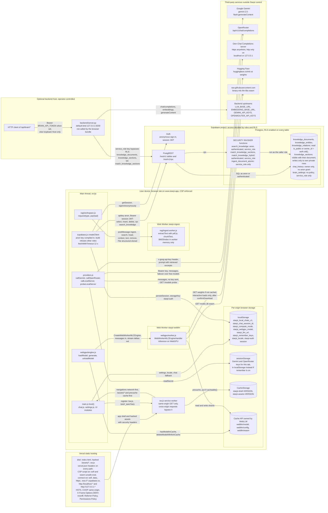
```mermaid
flowchart LR
    subgraph device["User device: browser tab on www.starpi.app, CSP enforced"]
        subgraph mainThread["Main thread, src/js"]
            boot["main.js boot()<br/>chat.js, settings.js, UI modules"]
            sbClient["supabase.js createClient<br/>anon key compiled in, build refuses other roles<br/>fetchWithTimeout 12 s"]
            provJs["providers.js<br/>callGemini, callOpenRouter,<br/>callLocalServer, probeLocalServer"]
            engineJs["webgpu/engine.js<br/>loadModel, generate, unloadModel"]
            wsJs["rag/workspace.js<br/>request(type, payload)"]
        end
        subgraph llmWorker["Web Worker starpi-webllm"]
            mlc["webgpu/worker.js<br/>WebWorkerMLCEngineHandler<br/>inference on WebGPU"]
        end
        subgraph ingestWorker["Web Worker starpi-ingest"]
            ingest["rag/ingest.worker.js<br/>extractText with pdf.js, chunkText,<br/>BM25Index in worker memory only"]
        end
        sw["sw.js service worker<br/>same-origin GET only,<br/>cross-origin requests bypass it"]
        subgraph browserStores["Per-origin browser storage"]
            ls[("localStorage<br/>starpi_local_chats_v1, starpi_chat_session_id,<br/>starpi_compute_mode, starpi_webgpu_model,<br/>starpi_llm_url, starpi_remember_keys,<br/>starpi_locale, starpi-auth session")]
            ss[("sessionStorage<br/>Gemini and OpenRouter keys for this tab,<br/>in localStorage instead if remember is on")]
            swCache[("CacheStorage<br/>starpi-shell-VERSION, starpi-assets-VERSION")]
            modelCache[("Cache API owned by WebLLM<br/>webllm/model, webllm/config, webllm/wasm")]
        end
    end

    subgraph vercel["Vercel static hosting"]
        host["dist/: index.html, hashed /assets/*, sw.js<br/>vercel.json headers on every path:<br/>CSP script-src self and wasm-unsafe-eval,<br/>connect-src self, data:, https:, wss://*.supabase.co,<br/>http://localhost:* and http://127.0.0.1:*<br/>HSTS, COOP same-origin, X-Frame-Options DENY,<br/>nosniff, Referrer-Policy, Permissions-Policy"]
    end

    subgraph supabase["Supabase project: access decided by roles and RLS"]
        auth["Auth<br/>anonymous sign-in, session JWT"]
        rest["PostgREST<br/>/rest/v1 tables and /rest/v1/rpc"]
        subgraph pg["Postgres, RLS enabled on every table"]
            tables[("knowledge_documents, knowledge_entities,<br/>knowledge_relations: read is_public or owner_id = auth.uid(),<br/>knowledge_sections: visible with their document,<br/>writes only to own private rows<br/>chat_history: owner only, no anon grant<br/>brain_settings: no policy, service_role only")]
            rpcFns["SECURITY INVOKER functions<br/>search_knowledge: anon, authenticated, service_role<br/>match_knowledge_sections, match_knowledge_hybrid:<br/>authenticated, service_role<br/>ingest_document_atomic: service_role only"]
        end
    end

    subgraph backendHost["Optional backend host, operator-controlled"]
        caller["HTTP client of /api/brain/*"]
        brain["backend/server.py<br/>default bind 127.0.0.1:9200<br/>not called by the browser bundle"]
    end

    subgraph thirdParty["Third-party services outside Starpi control"]
        gemini["Google Gemini<br/>gemini-2.5-flash:generateContent"]
        openrouter["OpenRouter<br/>/api/v1/chat/completions"]
        ownServer["Own Chat Completions server<br/>https anywhere, http only on<br/>localhost or 127.0.0.1"]
        hf["Hugging Face<br/>huggingface.co/mlc-ai weights"]
        ghLibs["raw.githubusercontent.com<br/>binary-mlc-llm-libs wasm"]
        backendApis["Backend upstreams<br/>LLM_BASE_URL, EMBEDDING_BASE_URL,<br/>GEMINI_API_KEYS, OPENROUTER_API_KEYS"]
    end

    host -->|"app shell and hashed assets<br/>with security headers"| sw
    sw -->|"navigations network-first,<br/>/assets/* and precache cache-first"| boot
    sw -->|"precache, put if cacheable()"| swCache
    boot -->|"register /sw.js, SKIP_WAITING"| sw
    boot -->|"settings, locale, chat fallback"| ls
    provJs -->|"readSecret"| ss
    sbClient -->|"persistSession, storageKey starpi-auth"| ls
    engineJs -->|"CreateWebWorkerMLCEngine,<br/>messages in, stream deltas out"| mlc
    engineJs -->|"hasModelInCache,<br/>deleteModelAllInfoInCache"| modelCache
    mlc -->|"read and write shards"| modelCache
    mlc -->|"GET weights if not cached,<br/>interactive loads only, after confirmDownload"| hf
    mlc -->|"GET model_lib wasm"| ghLibs
    wsJs -->|"postMessage ingest, search, head,<br/>context, text, remove,<br/>File structured-cloned"| ingest
    sbClient -->|"getSession, signInAnonymously"| auth
    sbClient -->|"apikey anon, Bearer session JWT:<br/>select, insert, delete, rpc search_knowledge"| rest
    rest -->|"SQL as anon or authenticated"| tables
    rest -->|"rpc"| rpcFns
    rpcFns -->|"run as the caller role"| tables
    provJs -->|"x-goog-api-key header,<br/>prompt with retrieved excerpts"| gemini
    provJs -->|"Bearer key, messages,<br/>failover over free models"| openrouter
    provJs -->|"messages, no key sent,<br/>GET /models probe"| ownServer
    caller -->|"Bearer BRAIN_API_TOKEN when set,<br/>else loopback Host only"| brain
    brain -->|"service_role key bypasses RLS:<br/>knowledge_documents, knowledge_sections,<br/>rpc match_knowledge_sections"| rest
    brain -->|"chat/completions, embeddings,<br/>generateContent"| backendApis

    classDef external stroke-dasharray: 5 5
    class gemini,openrouter,ownServer,hf,ghLibs,backendApis external
```

Sources: [`README.md`](../README.md), [`src/js/main.js`](../src/js/main.js), [`src/js/supabase.js`](../src/js/supabase.js), [`src/js/providers.js`](../src/js/providers.js), [`src/js/storage.js`](../src/js/storage.js), [`src/js/state.js`](../src/js/state.js), [`src/js/config.js`](../src/js/config.js), [`src/js/i18n/index.js`](../src/js/i18n/index.js), [`src/js/settings.js`](../src/js/settings.js), [`src/js/webgpu/engine.js`](../src/js/webgpu/engine.js), [`src/js/webgpu/worker.js`](../src/js/webgpu/worker.js), [`src/js/rag/workspace.js`](../src/js/rag/workspace.js), [`src/js/rag/ingest.worker.js`](../src/js/rag/ingest.worker.js), [`src/sw.js`](../src/sw.js), [`vercel.json`](../vercel.json), [`scripts/build.mjs`](../scripts/build.mjs), [`backend/server.py`](../backend/server.py), [`backend/core/config.py`](../backend/core/config.py), [`backend/core/supabase_client.py`](../backend/core/supabase_client.py), [`backend/core/rag.py`](../backend/core/rag.py), [`backend/supabase/full_schema.sql`](../backend/supabase/full_schema.sql)

### What leaves the device: boot connection state and one chat turn

At boot, connect() makes sure an anonymous session exists and probes knowledge_documents for the is_public column, and after an offline result scheduleReconnect() repeats it on the window online event or after 30 s, doubling up to 5 min; the result sets signedIn and hardened, and canSyncChats() requires both before any chat_history insert. Workspace search always stays in the ingestion worker, and in client mode Supabase receives only question-free reads (recentKnowledge(30), plus listDocuments() for knownTitles when the extractive fallback runs), while council and own-server modes also send the question, cut to 1000 characters, to the search_knowledge RPC and send it with the retrieved excerpts to the provider or server. Each answer path has its own guards (provider keys, OpenRouter stopping early on 401 or 403, WebGPU, cache, quota and download-confirmation checks before any Hugging Face download, normalizeServerUrl), and every failure ends in the extractive synthesizeAnswer. The question is stored only after retrieval (or by the catch if the turn throws first), and a message stays in localStorage when it is local-only (client mode, a used workspace hit, or for the question also an attached file), when sync is not possible, or when the chat_history insert fails.

<!-- diagram: system-context-egress-guards -->
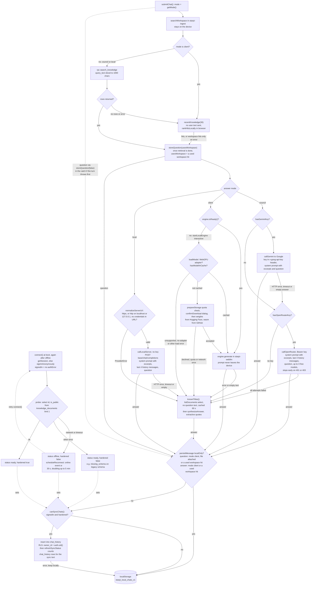
```mermaid
flowchart TD
    conn["connect() at boot, again after offline<br/>getSession, else signInAnonymously<br/>signedIn = no authError"]
    probe{"probe: select id, is_public<br/>from knowledge_documents limit 1"}
    offline["status offline, hardened false<br/>scheduleReconnect: online event or<br/>30 s, doubling up to 5 min"]
    legacy["status ready, hardened false<br/>e.g. missing_schema on legacy schema"]
    hardened["status ready, hardened true"]
    conn --> probe
    probe -->|"network or timeout"| offline
    probe -->|"other error"| legacy
    probe -->|"ok"| hardened
    offline -.->|"retry connect()"| conn

    submit["submitChat(): mode = getMode()"]
    wsSearch["searchWorkspace in starpi-ingest<br/>stays on the device"]
    modeR{"mode is client?"}
    recent["recentKnowledge(30)<br/>no user text sent,<br/>rankHitsLocally in browser"]
    fts["rpc search_knowledge<br/>query_text sliced to 1000 chars"]
    ftsQ{"rows returned?"}
    submit --> wsSearch --> modeR
    modeR -->|"yes"| recent
    modeR -->|"no: council or local"| fts
    fts --> ftsQ
    ftsQ -->|"no rows or error"| recent
    qStore["storeQuestion(usesWorkspace)<br/>once retrieval is done,<br/>usesWorkspace = a used workspace hit"]
    ftsQ -->|"yes"| qStore
    recent -->|"hits, or workspace hits only on error"| qStore
    qStore --> modeA

    modeA{"answer mode"}
    gemQ{"hasGeminiKey?"}
    gemCall["callGemini to Google<br/>key in x-goog-api-key header,<br/>system prompt with excerpts and question"]
    orQ{"hasOpenRouterKey?"}
    orCall["callOpenRouter, Bearer key<br/>system prompt with excerpts, last 4 history messages,<br/>question, up to 3 free models,<br/>stops early on 401 or 403"]
    modeA -->|"council"| gemQ
    gemQ -->|"yes"| gemCall
    gemQ -->|"no"| orQ
    gemCall -->|"HTTP error, timeout or empty answer"| orQ
    orQ -->|"yes"| orCall

    readyQ{"engine.isReady()?"}
    loadQ{"loadModel: WebGPU adapter?<br/>hasModelInCache?"}
    dl["prepareStorage quota check,<br/>confirmDownload dialog, then weights<br/>from Hugging Face, wasm from GitHub"]
    gen["engine.generate in starpi-webllm<br/>prompt never leaves the device"]
    modeA -->|"client"| readyQ
    readyQ -->|"yes"| gen
    readyQ -->|"no: startLocalEngine interactive"| loadQ
    loadQ -->|"cached"| gen
    loadQ -->|"not cached"| dl
    dl -->|"accepted"| gen

    urlQ{"normalizeServerUrl:<br/>https, or http on localhost or<br/>127.0.0.1, no credentials in URL?"}
    srv["callLocalServer, no key<br/>POST base/chat/completions<br/>system prompt with excerpts,<br/>last 4 history messages, question"]
    modeA -->|"local"| urlQ
    urlQ -->|"valid"| srv

    synth["knownTitles(): listDocuments select,<br/>no question text, cached 60 s<br/>then synthesizeAnswer, extractive quotes"]
    orQ -->|"no key"| synth
    orCall -->|"all attempts failed"| synth
    loadQ -->|"unsupported, no-adapter<br/>or other load error"| synth
    dl -->|"declined, quota or network error"| synth
    gen -->|"error or empty text"| synth
    urlQ -->|"ProviderError"| synth
    srv -->|"HTTP error, timeout or empty"| synth

    persistQ{"persistMessage localOnly?<br/>question: mode client, file attached<br/>or a used workspace hit<br/>answer: mode client or a used<br/>workspace hit"}
    syncQ{"canSyncChats():<br/>signedIn and hardened?"}
    lsStore[("localStorage<br/>starpi_local_chats_v1")]
    insert["insert into chat_history<br/>RLS: owner_id = auth.uid()<br/>then refreshSyncStatus counts<br/>chat_history rows for the sync text"]
    qStore -->|"question"| persistQ
    submit -.->|"question via storeQuestion(false)<br/>in the catch if the turn throws first"| persistQ
    gemCall -->|"answer"| persistQ
    orCall -->|"answer"| persistQ
    gen -->|"answer"| persistQ
    srv -->|"answer"| persistQ
    synth -->|"answer"| persistQ
    persistQ -->|"yes"| lsStore
    persistQ -->|"no"| syncQ
    syncQ -->|"no"| lsStore
    syncQ -->|"yes"| insert
    insert -->|"error, keep locally"| lsStore
    offline -.->|"sets"| syncQ
    legacy -.->|"sets"| syncQ
    hardened -.->|"sets"| syncQ
```

Sources: [`src/js/main.js`](../src/js/main.js), [`src/js/supabase.js`](../src/js/supabase.js), [`src/js/chat.js`](../src/js/chat.js), [`src/js/chat-store.js`](../src/js/chat-store.js), [`src/js/providers.js`](../src/js/providers.js), [`src/js/engine-ui.js`](../src/js/engine-ui.js), [`src/js/webgpu/engine.js`](../src/js/webgpu/engine.js), [`src/js/rag/workspace.js`](../src/js/rag/workspace.js), [`src/js/config.js`](../src/js/config.js), [`backend/supabase/full_schema.sql`](../backend/supabase/full_schema.sql)

### Backend trust boundary: server.py request guards

run_server refuses to bind to a non-loopback address unless BRAIN_API_TOKEN is set and exits with SystemExit(2). _route then checks every request in a fixed order: without a token it rejects requests carrying reverse-proxy headers (fail closed), it rejects any Origin not in BRAIN_ALLOWED_ORIGINS, and without a token it rejects non-loopback Host headers (DNS rebinding guard); only then does it resolve the route, answer OPTIONS, check the method and, for /api/brain/*, compare the Bearer token with hmac.compare_digest. Request bodies are bounded by _read_json_object and _string_field. The handlers write to Supabase with the service_role key, which bypasses RLS, and fall back to an in-memory store when Supabase is not configured or the remote call fails.

<!-- diagram: system-context-backend-guards -->
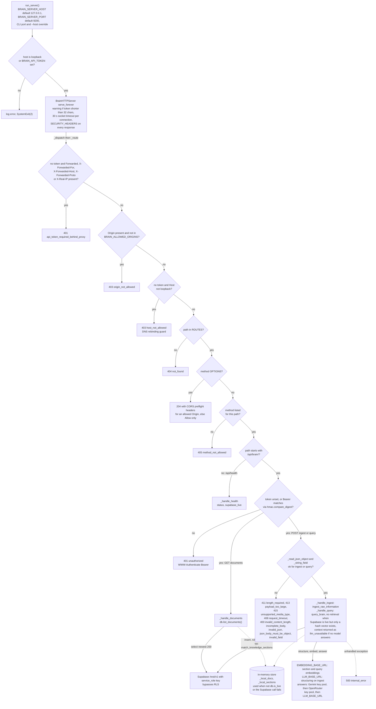
```mermaid
flowchart TD
    start["run_server()<br/>BRAIN_SERVER_HOST default 127.0.0.1,<br/>BRAIN_SERVER_PORT default 9200,<br/>CLI port and --host override"]
    bindQ{"host is loopback<br/>or BRAIN_API_TOKEN set?"}
    refuse["log error, SystemExit(2)"]
    listen["BrainHTTPServer serve_forever<br/>warning if token shorter than 32 chars,<br/>30 s socket timeout per connection,<br/>SECURITY_HEADERS on every response"]
    start --> bindQ
    bindQ -->|"no"| refuse
    bindQ -->|"yes"| listen

    proxyQ{"no token and Forwarded, X-Forwarded-For,<br/>X-Forwarded-Host, X-Forwarded-Proto<br/>or X-Real-IP present?"}
    r401p["401 api_token_required_behind_proxy"]
    originQ{"Origin present and not in<br/>BRAIN_ALLOWED_ORIGINS?"}
    r403o["403 origin_not_allowed"]
    hostQ{"no token and Host<br/>not loopback?"}
    r403h["403 host_not_allowed<br/>DNS rebinding guard"]
    listen -->|"_dispatch then _route"| proxyQ
    proxyQ -->|"yes"| r401p
    proxyQ -->|"no"| originQ
    originQ -->|"yes"| r403o
    originQ -->|"no"| hostQ
    hostQ -->|"yes"| r403h
    hostQ -->|"no"| routeQ

    routeQ{"path in ROUTES?"}
    r404["404 not_found"]
    optQ{"method OPTIONS?"}
    pre["204 with CORS preflight headers<br/>for an allowed Origin, else Allow only"]
    methQ{"method listed<br/>for this path?"}
    r405["405 method_not_allowed"]
    protQ{"path starts with<br/>/api/brain/?"}
    health["_handle_health<br/>status, supabase_live"]
    routeQ -->|"no"| r404
    routeQ -->|"yes"| optQ
    optQ -->|"yes"| pre
    optQ -->|"no"| methQ
    methQ -->|"no"| r405
    methQ -->|"yes"| protQ
    protQ -->|"no: /api/health"| health
    protQ -->|"yes"| bearerQ

    bearerQ{"token unset, or Bearer matches<br/>via hmac.compare_digest?"}
    r401["401 unauthorized<br/>WWW-Authenticate Bearer"]
    docs["_handle_documents<br/>db.list_documents()"]
    body{"_read_json_object and _string_field<br/>ok for ingest or query?"}
    r4xx["411 length_required, 413 payload_too_large,<br/>415 unsupported_media_type, 408 request_timeout,<br/>400 invalid_content_length, incomplete_body,<br/>invalid_json, json_body_must_be_object, invalid_field"]
    handlers["_handle_ingest: ingest_raw_information<br/>_handle_query: query_brain, no retrieval when<br/>Supabase is live but only a hash vector exists,<br/>context returned as llm_unavailable if no model answers"]
    bearerQ -->|"no"| r401
    bearerQ -->|"yes: GET documents"| docs
    bearerQ -->|"yes: POST ingest or query"| body
    body -->|"no"| r4xx
    body -->|"yes"| handlers

    supa["Supabase /rest/v1 with service_role key<br/>bypasses RLS"]
    mem[("in-memory store<br/>_local_docs, _local_sections<br/>used when not db.is_live<br/>or the Supabase call fails")]
    upstream["EMBEDDING_BASE_URL: section and query embeddings<br/>LLM_BASE_URL: structuring on ingest<br/>answers: Gemini key pool, then OpenRouter<br/>key pool, then LLM_BASE_URL"]
    docs -->|"select newest 200"| supa
    handlers -->|"insert, rollback delete,<br/>rpc match_knowledge_sections"| supa
    handlers -->|"structure, embed, answer"| upstream
    docs -.-> mem
    handlers -.-> mem
    r500["500 internal_error"]
    handlers -.->|"unhandled exception"| r500
```

Sources: [`backend/server.py`](../backend/server.py), [`backend/core/config.py`](../backend/core/config.py), [`backend/core/supabase_client.py`](../backend/core/supabase_client.py), [`backend/core/rag.py`](../backend/core/rag.py), [`backend/core/ingestion_pipeline.py`](../backend/core/ingestion_pipeline.py), [`backend/core/structurer.py`](../backend/core/structurer.py), [`backend/core/embeddings.py`](../backend/core/embeddings.py)

### Frontend import graph (1 of 3): main.js and its application imports

main.js is the only main-thread entry point and has 17 imports: the 12 application modules drawn here (with the names it imports from each) and 5 infrastructure modules (dom, i18n, icons, state, supabase) drawn in frontend-modules-infrastructure. The 49 imports between the 21 application modules are split across three diagrams: the 12 made by main.js here, the 17 made by settings.js, graph.js, ingest.js and bench/bench-ui.js in frontend-modules-views, and the 20 made by chat.js, engine-ui.js, messages.js, synthesizer.js, rag/citations.js and webgpu/engine.js in frontend-modules-chat. The import graph has no cycles.

<!-- diagram: frontend-modules-overview -->
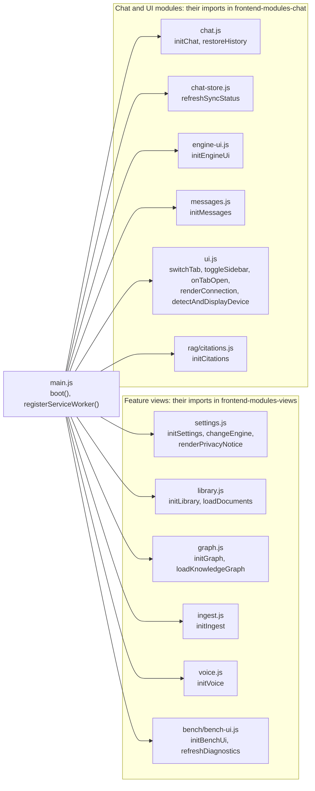
```mermaid
flowchart LR
    main["main.js<br/>boot(), registerServiceWorker()"]

    subgraph views["Feature views: their imports in frontend-modules-views"]
        settings["settings.js<br/>initSettings, changeEngine,<br/>renderPrivacyNotice"]
        library["library.js<br/>initLibrary, loadDocuments"]
        graphview["graph.js<br/>initGraph, loadKnowledgeGraph"]
        ingest["ingest.js<br/>initIngest"]
        voice["voice.js<br/>initVoice"]
        benchui["bench/bench-ui.js<br/>initBenchUi, refreshDiagnostics"]
    end

    subgraph core["Chat and UI modules: their imports in frontend-modules-chat"]
        chat["chat.js<br/>initChat, restoreHistory"]
        chatstore["chat-store.js<br/>refreshSyncStatus"]
        engineui["engine-ui.js<br/>initEngineUi"]
        messages["messages.js<br/>initMessages"]
        ui["ui.js<br/>switchTab, toggleSidebar, onTabOpen,<br/>renderConnection, detectAndDisplayDevice"]
        citations["rag/citations.js<br/>initCitations"]
    end

    main --> settings
    main --> library
    main --> graphview
    main --> ingest
    main --> voice
    main --> benchui
    main --> chat
    main --> chatstore
    main --> engineui
    main --> messages
    main --> ui
    main --> citations
```

Sources: [`src/js/main.js`](../src/js/main.js)

### Frontend import graph (2 of 3): imports made by the feature views

Every import between application modules made by settings.js, graph.js, ingest.js and bench/bench-ui.js (17 of the 49); library.js and voice.js import only infrastructure modules. Views that call into chat.js use narrow imports (graph.js submitChat, ingest.js invalidateKnownTitles, bench-ui.js isChatBusy), and chat.js imports no view back. graph.js and ingest.js reuse describeDataError from library.js, and settings.js and bench-ui.js drive the on-device engine both through engine-ui.js and directly through webgpu/engine.js.

<!-- diagram: frontend-modules-views -->
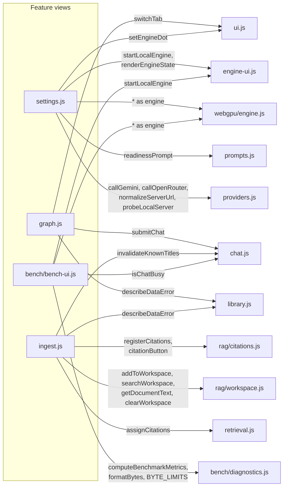
```mermaid
flowchart LR
    subgraph views["Feature views"]
        settings["settings.js"]
        graphview["graph.js"]
        ingest["ingest.js"]
        benchui["bench/bench-ui.js"]
    end

    chat["chat.js"]
    library["library.js"]
    engineui["engine-ui.js"]
    ui["ui.js"]
    prompts["prompts.js"]
    providers["providers.js"]
    engine["webgpu/engine.js"]
    diag["bench/diagnostics.js"]
    citations["rag/citations.js"]
    workspace["rag/workspace.js"]
    retrieval["retrieval.js"]

    graphview -->|"submitChat"| chat
    ingest -->|"invalidateKnownTitles"| chat
    benchui -->|"isChatBusy"| chat
    graphview -->|"describeDataError"| library
    ingest -->|"describeDataError"| library
    graphview -->|"switchTab"| ui
    settings -->|"setEngineDot"| ui
    settings -->|"startLocalEngine,<br/>renderEngineState"| engineui
    benchui -->|"startLocalEngine"| engineui
    settings -->|"* as engine"| engine
    benchui -->|"* as engine"| engine
    settings -->|"readinessPrompt"| prompts
    settings -->|"callGemini, callOpenRouter,<br/>normalizeServerUrl, probeLocalServer"| providers
    benchui -->|"computeBenchmarkMetrics,<br/>formatBytes, BYTE_LIMITS"| diag
    ingest -->|"registerCitations,<br/>citationButton"| citations
    ingest -->|"addToWorkspace, searchWorkspace,<br/>getDocumentText, clearWorkspace"| workspace
    ingest -->|"assignCitations"| retrieval
```

Sources: [`src/js/settings.js`](../src/js/settings.js), [`src/js/graph.js`](../src/js/graph.js), [`src/js/ingest.js`](../src/js/ingest.js), [`src/js/bench/bench-ui.js`](../src/js/bench/bench-ui.js), [`src/js/library.js`](../src/js/library.js), [`src/js/voice.js`](../src/js/voice.js)

### Frontend import graph (3 of 3): chat pipeline, workspace client and WebGPU

The other 20 of the 49 imports between application modules: every import made by chat.js, engine-ui.js, messages.js, synthesizer.js, rag/citations.js and webgpu/engine.js. chat.js is the hub: 12 of its 19 imports are drawn here, and the other 7 go to infrastructure (config, dom, i18n, render, signals, state, supabase). chat-store.js, prompts.js, providers.js, retrieval.js, ui.js, rag/workspace.js and webgpu/models.js import no other application module. retrieval.js is shared by chat.js, synthesizer.js (tokenize) and rag/citations.js, and rag/citations.js reads source text back from the workspace worker through getChunkContext.

<!-- diagram: frontend-modules-chat -->
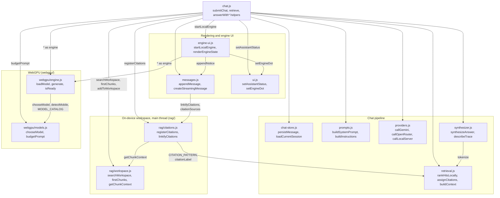
```mermaid
flowchart TD
    chat["chat.js<br/>submitChat, retrieve, answerWith* helpers"]

    subgraph pipeline["Chat pipeline"]
        chatstore["chat-store.js<br/>persistMessage, loadCurrentSession"]
        prompts["prompts.js<br/>buildSystemPrompt, buildInstructions"]
        providers["providers.js<br/>callGemini, callOpenRouter, callLocalServer"]
        synth["synthesizer.js<br/>synthesizeAnswer, describeTrace"]
        retrieval["retrieval.js<br/>rankHitsLocally, assignCitations, buildContext"]
    end

    subgraph rendering["Rendering and engine UI"]
        engineui["engine-ui.js<br/>startLocalEngine, renderEngineState"]
        messages["messages.js<br/>appendMessage, createStreamingMessage"]
        ui["ui.js<br/>setAssistantStatus, setEngineDot"]
    end

    subgraph ragmain["On-device workspace, main thread (rag/)"]
        citations["rag/citations.js<br/>registerCitations, linkifyCitations"]
        workspace["rag/workspace.js<br/>searchWorkspace, firstChunks, getChunkContext"]
    end

    subgraph gpu["WebGPU (webgpu/)"]
        engine["webgpu/engine.js<br/>loadModel, generate, isReady"]
        models["webgpu/models.js<br/>chooseModel, budgetPrompt"]
    end

    chat --> chatstore
    chat --> prompts
    chat --> providers
    chat --> synth
    chat --> retrieval
    chat -->|"startLocalEngine"| engineui
    chat --> messages
    chat -->|"setAssistantStatus"| ui
    chat -->|"registerCitations"| citations
    chat -->|"searchWorkspace, firstChunks,<br/>addToWorkspace"| workspace
    chat -->|"* as engine"| engine
    chat -->|"budgetPrompt"| models

    engineui -->|"appendNotice"| messages
    engineui -->|"setEngineDot"| ui
    engineui -->|"* as engine"| engine

    messages -->|"linkifyCitations,<br/>citationSources"| citations
    synth -->|"tokenize"| retrieval
    citations -->|"CITATION_PATTERN,<br/>citationLabel"| retrieval
    citations -->|"getChunkContext"| workspace
    engine -->|"chooseModel, detectMobile,<br/>MODEL_CATALOG"| models
```

Sources: [`src/js/chat.js`](../src/js/chat.js), [`src/js/engine-ui.js`](../src/js/engine-ui.js), [`src/js/messages.js`](../src/js/messages.js), [`src/js/synthesizer.js`](../src/js/synthesizer.js), [`src/js/rag/citations.js`](../src/js/rag/citations.js), [`src/js/webgpu/engine.js`](../src/js/webgpu/engine.js), [`src/js/chat-store.js`](../src/js/chat-store.js), [`src/js/prompts.js`](../src/js/prompts.js), [`src/js/providers.js`](../src/js/providers.js), [`src/js/retrieval.js`](../src/js/retrieval.js), [`src/js/ui.js`](../src/js/ui.js), [`src/js/rag/workspace.js`](../src/js/rag/workspace.js), [`src/js/webgpu/models.js`](../src/js/webgpu/models.js)

### Shared infrastructure modules, their importers and npm packages

Every import of config.js (8 importers), supabase.js (6), storage.js (4), state.js (4) and signals.js (3) is drawn. The most widely imported modules, i18n/index.js (16 importers), dom.js (13), icons.js (8) and render.js (7), show their importer count in the label instead of individual edges. config.js, signals.js and storage.js import nothing; state.js reaches into webgpu/models.js for normalizePreference, and supabase.js passes a fetch wrapped with withTimeoutSignal to createClient. The main thread's static npm dependencies (lucide, dompurify, marked, @supabase/supabase-js) come in only through icons.js, render.js and supabase.js, and i18n/index.js bundles both locale JSON files via import attributes. JSDoc typedef imports are not counted.

<!-- diagram: frontend-modules-infrastructure -->
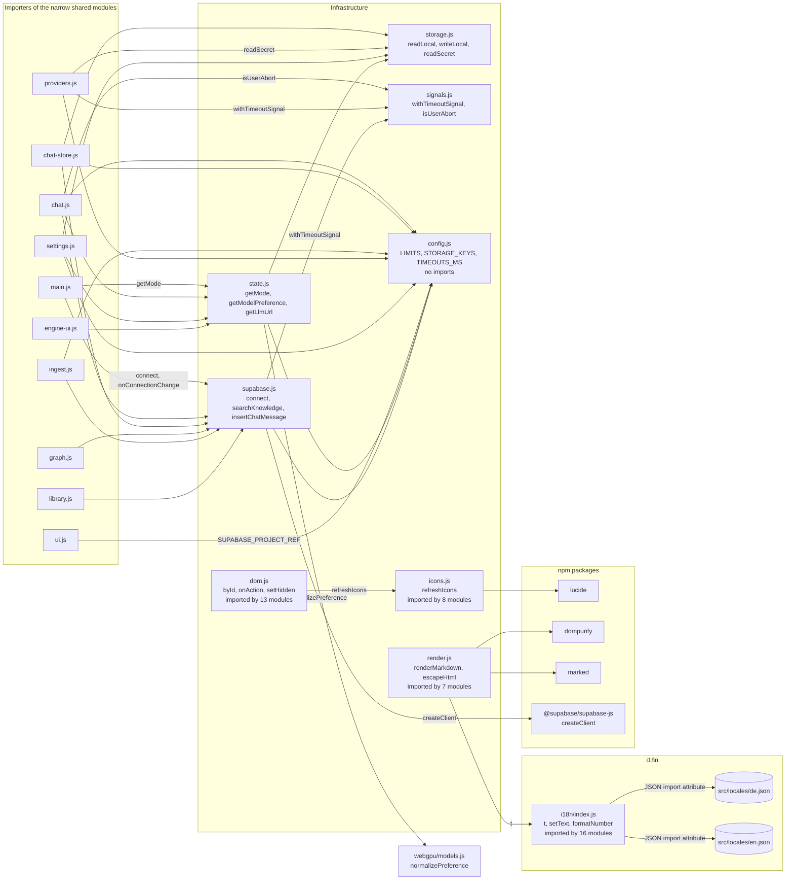
```mermaid
flowchart LR
    subgraph importers["Importers of the narrow shared modules"]
        main["main.js"]
        chat["chat.js"]
        chatstore["chat-store.js"]
        graphview["graph.js"]
        ingest["ingest.js"]
        library["library.js"]
        providers["providers.js"]
        settings["settings.js"]
        engineui["engine-ui.js"]
        ui["ui.js"]
    end

    subgraph infra["Infrastructure"]
        state["state.js<br/>getMode, getModelPreference, getLlmUrl"]
        supabase["supabase.js<br/>connect, searchKnowledge, insertChatMessage"]
        storage["storage.js<br/>readLocal, writeLocal, readSecret"]
        signals["signals.js<br/>withTimeoutSignal, isUserAbort"]
        config["config.js<br/>LIMITS, STORAGE_KEYS, TIMEOUTS_MS<br/>no imports"]
        dom["dom.js<br/>byId, onAction, setHidden<br/>imported by 13 modules"]
        icons["icons.js<br/>refreshIcons<br/>imported by 8 modules"]
        render["render.js<br/>renderMarkdown, escapeHtml<br/>imported by 7 modules"]
    end

    subgraph i18ngrp["i18n"]
        i18n["i18n/index.js<br/>t, setText, formatNumber<br/>imported by 16 modules"]
        de[("src/locales/de.json")]
        en[("src/locales/en.json")]
    end

    models["webgpu/models.js<br/>normalizePreference"]

    subgraph pkgs["npm packages"]
        lucide["lucide"]
        dompurify["dompurify"]
        marked["marked"]
        sbjs["@supabase/supabase-js<br/>createClient"]
    end

    main -->|"connect, onConnectionChange"| supabase
    main -->|"getMode"| state
    chat --> supabase
    chat -->|"isUserAbort"| signals
    chat --> state
    chat --> config
    chatstore --> supabase
    chatstore --> storage
    chatstore --> config
    graphview --> supabase
    ingest --> supabase
    ingest --> config
    library --> supabase
    providers -->|"readSecret"| storage
    providers -->|"withTimeoutSignal"| signals
    providers --> config
    settings --> storage
    settings --> state
    settings --> config
    engineui --> state
    ui -->|"SUPABASE_PROJECT_REF"| config

    state --> config
    state --> storage
    state -->|"normalizePreference"| models
    supabase --> config
    supabase -->|"withTimeoutSignal"| signals
    supabase -->|"createClient"| sbjs

    dom -->|"refreshIcons"| icons
    icons --> lucide
    render -->|"t"| i18n
    render --> dompurify
    render --> marked
    i18n -->|"JSON import attribute"| de
    i18n -->|"JSON import attribute"| en
```

Sources: [`src/js/config.js`](../src/js/config.js), [`src/js/dom.js`](../src/js/dom.js), [`src/js/icons.js`](../src/js/icons.js), [`src/js/render.js`](../src/js/render.js), [`src/js/storage.js`](../src/js/storage.js), [`src/js/signals.js`](../src/js/signals.js), [`src/js/state.js`](../src/js/state.js), [`src/js/supabase.js`](../src/js/supabase.js), [`src/js/i18n/index.js`](../src/js/i18n/index.js), [`src/js/main.js`](../src/js/main.js), [`src/js/chat.js`](../src/js/chat.js), [`src/js/chat-store.js`](../src/js/chat-store.js), [`src/js/graph.js`](../src/js/graph.js), [`src/js/ingest.js`](../src/js/ingest.js), [`src/js/library.js`](../src/js/library.js), [`src/js/providers.js`](../src/js/providers.js), [`src/js/settings.js`](../src/js/settings.js), [`src/js/engine-ui.js`](../src/js/engine-ui.js), [`src/js/ui.js`](../src/js/ui.js), [`src/js/webgpu/models.js`](../src/js/webgpu/models.js)

### Bundle entry points, Web Workers and lazy imports

scripts/build.mjs bundles three JS entry points with esbuild (splitting: true): main.js, rag/ingest.worker.js and webgpu/worker.js (plus the CSS entry). Nothing imports the workers: rag/workspace.js and webgpu/engine.js start them with new Worker(new URL(...)) using the placeholders __STARPI_INGEST_WORKER_URL__ and __STARPI_WEBLLM_WORKER_URL__, which build.mjs replaces with the hashed bundle names, and the build fails if either placeholder is missing from the output. Solid edges are static imports: main.js imports all six modules shown in its bundle, and the edges into rag/workspace.js and webgpu/engine.js are every static import of those two modules (other imports between main-thread modules are in frontend-modules-overview and frontend-modules-chat). Dotted edges are the two Worker spawns, the service worker registration, and the lazy import() calls for @mlc-ai/web-llm (in engine.js) and pdf.js (in parser.js, inside the ingestion worker).

<!-- diagram: frontend-modules-workers -->
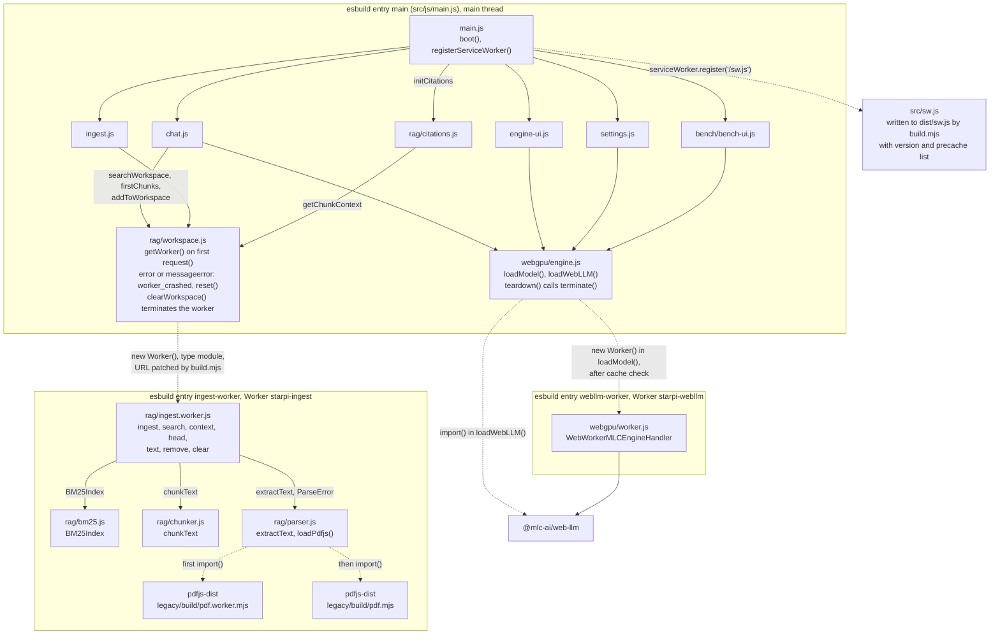
```mermaid
flowchart TD
    subgraph mainbundle["esbuild entry main (src/js/main.js), main thread"]
        main["main.js<br/>boot(), registerServiceWorker()"]
        chat["chat.js"]
        ingest["ingest.js"]
        citations["rag/citations.js"]
        engineui["engine-ui.js"]
        settings["settings.js"]
        benchui["bench/bench-ui.js"]
        workspace["rag/workspace.js<br/>getWorker() on first request()<br/>error or messageerror: worker_crashed, reset()<br/>clearWorkspace() terminates the worker"]
        engine["webgpu/engine.js<br/>loadModel(), loadWebLLM()<br/>teardown() calls terminate()"]
    end

    subgraph ingestbundle["esbuild entry ingest-worker, Worker starpi-ingest"]
        iw["rag/ingest.worker.js<br/>ingest, search, context, head,<br/>text, remove, clear"]
        bm25["rag/bm25.js<br/>BM25Index"]
        chunker["rag/chunker.js<br/>chunkText"]
        parser["rag/parser.js<br/>extractText, loadPdfjs()"]
        pdfw["pdfjs-dist<br/>legacy/build/pdf.worker.mjs"]
        pdf["pdfjs-dist<br/>legacy/build/pdf.mjs"]
    end

    subgraph llmbundle["esbuild entry webllm-worker, Worker starpi-webllm"]
        ww["webgpu/worker.js<br/>WebWorkerMLCEngineHandler"]
    end

    webllm["@mlc-ai/web-llm"]
    sw["src/sw.js<br/>written to dist/sw.js by build.mjs<br/>with version and precache list"]

    main --> chat
    main --> ingest
    main -->|"initCitations"| citations
    main --> engineui
    main --> settings
    main --> benchui
    main -.->|"serviceWorker.register('/sw.js')"| sw

    chat -->|"searchWorkspace, firstChunks,<br/>addToWorkspace"| workspace
    ingest --> workspace
    citations -->|"getChunkContext"| workspace
    chat --> engine
    engineui --> engine
    settings --> engine
    benchui --> engine

    workspace -.->|"new Worker(), type module,<br/>URL patched by build.mjs"| iw
    engine -.->|"new Worker() in loadModel(),<br/>after cache check"| ww
    engine -.->|"import() in loadWebLLM()"| webllm
    ww --> webllm

    iw -->|"BM25Index"| bm25
    iw -->|"chunkText"| chunker
    iw -->|"extractText, ParseError"| parser
    parser -.->|"first import()"| pdfw
    parser -.->|"then import()"| pdf
```

Sources: [`scripts/build.mjs`](../scripts/build.mjs), [`src/js/main.js`](../src/js/main.js), [`src/js/chat.js`](../src/js/chat.js), [`src/js/ingest.js`](../src/js/ingest.js), [`src/js/engine-ui.js`](../src/js/engine-ui.js), [`src/js/settings.js`](../src/js/settings.js), [`src/js/bench/bench-ui.js`](../src/js/bench/bench-ui.js), [`src/js/rag/citations.js`](../src/js/rag/citations.js), [`src/js/rag/workspace.js`](../src/js/rag/workspace.js), [`src/js/rag/ingest.worker.js`](../src/js/rag/ingest.worker.js), [`src/js/rag/bm25.js`](../src/js/rag/bm25.js), [`src/js/rag/chunker.js`](../src/js/rag/chunker.js), [`src/js/rag/parser.js`](../src/js/rag/parser.js), [`src/js/webgpu/engine.js`](../src/js/webgpu/engine.js), [`src/js/webgpu/worker.js`](../src/js/webgpu/worker.js), [`src/sw.js`](../src/sw.js)

## 2. Boot and settings

What happens between the first byte of `index.html` and a usable chat, and how the settings form stores provider keys, preferences and the engine choice.

### boot(): module start-up order

main.js boot() runs initI18n first, so the stored starpi_locale (or en) is applied before any module renders text, then installs the delegated click/change dispatcher, registers the switch-tab, toggle-sidebar and set-locale actions and the lazy onTabOpen hooks, and runs the ten init* functions, refreshIcons, detectAndDisplayDevice and registerServiceWorker (the /sw.js registration waits for window load). It subscribes to onConnectionChange before calling connect(), so the listener also renders the later attempts that connect() schedules itself after an offline result, while restoreHistory() runs only once. changeEngine is started with void, so it is neither awaited nor covered by boot().catch, while connect() and restoreHistory() are awaited in sequence. A throw or rejection inside boot() skips the remaining steps, and reportUnexpected only logs it with console.error.

<!-- diagram: boot-sequence-overview -->
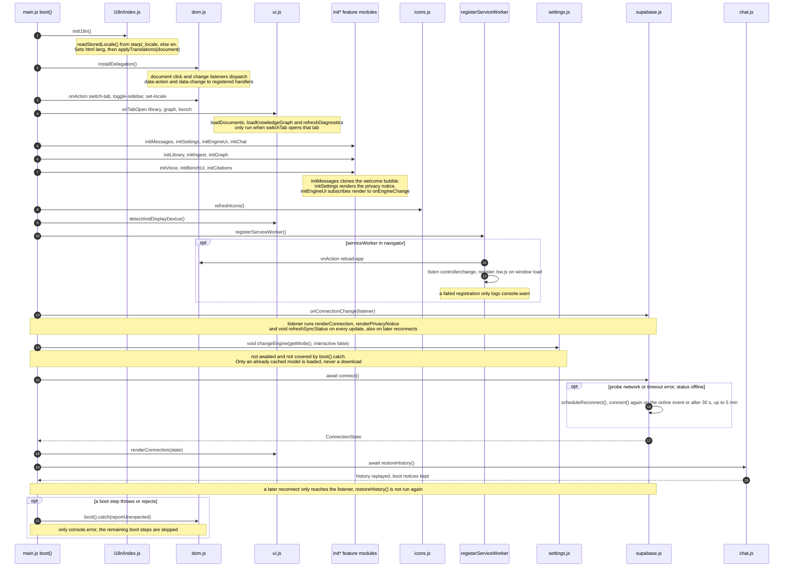
```mermaid
sequenceDiagram
    autonumber
    participant Main as main.js boot()
    participant I18n as i18n/index.js
    participant Dom as dom.js
    participant UI as ui.js
    participant Mods as init* feature modules
    participant Icons as icons.js
    participant SW as registerServiceWorker
    participant Set as settings.js
    participant Sb as supabase.js
    participant Chat as chat.js

    Main->>I18n: initI18n()
    Note over I18n: readStoredLocale() from starpi_locale, else en.<br/>Sets html lang, then applyTranslations(document)
    Main->>Dom: installDelegation()
    Note over Dom: document click and change listeners dispatch<br/>data-action and data-change to registered handlers
    Main->>Dom: onAction switch-tab, toggle-sidebar, set-locale
    Main->>UI: onTabOpen library, graph, bench
    Note over UI: loadDocuments, loadKnowledgeGraph and refreshDiagnostics<br/>only run when switchTab opens that tab
    Main->>Mods: initMessages, initSettings, initEngineUi, initChat
    Main->>Mods: initLibrary, initIngest, initGraph
    Main->>Mods: initVoice, initBenchUi, initCitations
    Note over Mods: initMessages clones the welcome bubble.<br/>initSettings renders the privacy notice.<br/>initEngineUi subscribes render to onEngineChange
    Main->>Icons: refreshIcons()
    Main->>UI: detectAndDisplayDevice()
    Main->>SW: registerServiceWorker()
    opt serviceWorker in navigator
        SW->>Dom: onAction reload-app
        SW->>SW: listen controllerchange, register /sw.js on window load
        Note over SW: a failed registration only logs console.warn
    end
    Main->>Sb: onConnectionChange(listener)
    Note over Main,Sb: listener runs renderConnection, renderPrivacyNotice<br/>and void refreshSyncStatus on every update, also on later reconnects
    Main->>Set: void changeEngine(getMode(), interactive false)
    Note over Main,Set: not awaited and not covered by boot().catch.<br/>Only an already cached model is loaded, never a download
    Main->>Sb: await connect()
    opt probe network or timeout error, status offline
        Sb->>Sb: scheduleReconnect(), connect() again on the online event or after 30 s, up to 5 min
    end
    Sb-->>Main: ConnectionState
    Main->>UI: renderConnection(state)
    Main->>Chat: await restoreHistory()
    Chat-->>Main: history replayed, boot notices kept
    Note over Main,Sb: a later reconnect only reaches the listener, restoreHistory() is not run again
    opt a boot step throws or rejects
        Main->>Dom: boot().catch(reportUnexpected)
        Note over Main,Dom: only console.error, the remaining boot steps are skipped
    end
```

Sources: [`src/js/main.js`](../src/js/main.js), [`src/js/i18n/index.js`](../src/js/i18n/index.js), [`src/js/dom.js`](../src/js/dom.js), [`src/js/ui.js`](../src/js/ui.js), [`src/js/messages.js`](../src/js/messages.js), [`src/js/settings.js`](../src/js/settings.js), [`src/js/engine-ui.js`](../src/js/engine-ui.js), [`src/js/icons.js`](../src/js/icons.js), [`src/js/supabase.js`](../src/js/supabase.js), [`src/js/chat.js`](../src/js/chat.js), [`src/js/state.js`](../src/js/state.js)

### Boot-time changeEngine: cached model only, never a download

At boot changeEngine applies the stored compute mode with interactive false (normalizeMode maps legacy values and falls back to council) and resolves to whether setMode could store it, which boot() discards. In client mode startLocalEngine calls engine.loadModel with onlyIfCached true and no confirmDownload callback, so an uncached model makes it resolve false (status idle, engine dot off) and nothing is downloaded. Missing WebGPU or adapter, a failed WebLLM import or a failed load of a cached model rejects with an EngineError, which engine-ui turns into a chat notice (notice_unavailable_title or notice_failed_title). Local mode probes GET /models on the own server URL with a 4 s timeout, and council mode only checks whether a Gemini or OpenRouter key exists.

<!-- diagram: boot-sequence-engine-restore -->
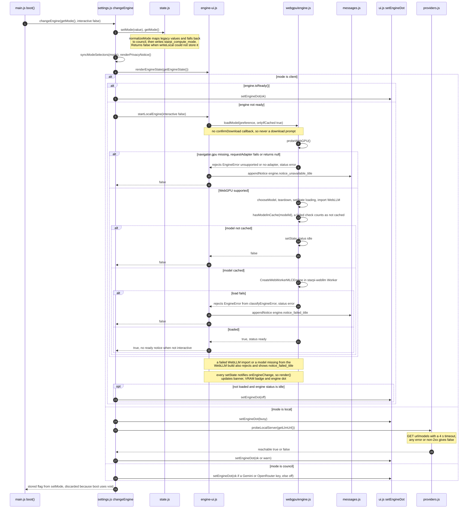
```mermaid
sequenceDiagram
    autonumber
    participant Main as main.js boot()
    participant Set as settings.js changeEngine
    participant St as state.js
    participant EUI as engine-ui.js
    participant Eng as webgpu/engine.js
    participant Msg as messages.js
    participant Dot as ui.js setEngineDot
    participant Prov as providers.js

    Main->>Set: changeEngine(getMode(), interactive false)
    Set->>St: setMode(value), getMode()
    Note over St: normalizeMode maps legacy values and falls back<br/>to council, then writes starpi_compute_mode.<br/>Returns false when writeLocal could not store it
    Set->>Set: syncModeSelectors(mode), renderPrivacyNotice()
    Set->>EUI: renderEngineState(getEngineState())
    alt mode is client
        alt engine.isReady()
            Set->>Dot: setEngineDot(ok)
        else engine not ready
            Set->>EUI: startLocalEngine(interactive false)
            EUI->>Eng: loadModel(preference, onlyIfCached true)
            Note over EUI,Eng: no confirmDownload callback, so never a download prompt
            Eng->>Eng: probeWebGPU()
            alt navigator.gpu missing, requestAdapter fails or returns null
                Eng-->>EUI: rejects EngineError unsupported or no-adapter, status error
                EUI->>Msg: appendNotice engine.notice_unavailable_title
                EUI-->>Set: false
            else WebGPU supported
                Eng->>Eng: chooseModel, teardown, setState loading, import WebLLM
                Eng->>Eng: hasModelInCache(modelId), a failed check counts as not cached
                alt model not cached
                    Eng->>Eng: setState status idle
                    Eng-->>EUI: false
                    EUI-->>Set: false
                else model cached
                    Eng->>Eng: CreateWebWorkerMLCEngine in starpi-webllm Worker
                    alt load fails
                        Eng-->>EUI: rejects EngineError from classifyEngineError, status error
                        EUI->>Msg: appendNotice engine.notice_failed_title
                        EUI-->>Set: false
                    else loaded
                        Eng-->>EUI: true, status ready
                        EUI-->>Set: true, no ready notice when not interactive
                    end
                end
            end
            Note over EUI,Eng: a failed WebLLM import or a model missing from the<br/>WebLLM build also rejects and shows notice_failed_title
            Note over EUI,Eng: every setState notifies onEngineChange, so render()<br/>updates banner, VRAM badge and engine dot
            opt not loaded and engine status is idle
                Set->>Dot: setEngineDot(off)
            end
        end
    else mode is local
        Set->>Dot: setEngineDot(busy)
        Set->>Prov: probeLocalServer(getLlmUrl())
        Note over Prov: GET url/models with a 4 s timeout,<br/>any error or non-2xx gives false
        Prov-->>Set: reachable true or false
        Set->>Dot: setEngineDot(ok or warn)
    else mode is council
        Set->>Dot: setEngineDot(ok if a Gemini or OpenRouter key, else off)
    end
    Set-->>Main: stored flag from setMode, discarded because boot uses void
```

Sources: [`src/js/main.js`](../src/js/main.js), [`src/js/settings.js`](../src/js/settings.js), [`src/js/engine-ui.js`](../src/js/engine-ui.js), [`src/js/webgpu/engine.js`](../src/js/webgpu/engine.js), [`src/js/state.js`](../src/js/state.js), [`src/js/messages.js`](../src/js/messages.js), [`src/js/ui.js`](../src/js/ui.js), [`src/js/providers.js`](../src/js/providers.js), [`src/js/config.js`](../src/js/config.js)

### connect(), connection subscribers and restoreHistory

connect() reuses the stored session or signs in anonymously, then probes for the hardened schema by selecting id and is_public from knowledge_documents. Only a network or timeout error of that probe marks the state offline, and scheduleReconnect() then clears connectPromise and calls connect() again on the window online event or after 30 s, doubling up to 5 min, until an attempt is no longer offline. updateConnection calls the single subscriber from main.js (renderConnection, renderPrivacyNotice, refreshSyncStatus) and boot then calls renderConnection again, while a later reconnect reaches only the subscriber and never runs restoreHistory again. restoreHistory reads chat_history only when canSyncChats() (signedIn and hardened), otherwise localStorage, replays the messages into the chat and the conversation with title-only sources, and re-appends every bubble shown after the welcome during boot (such as an engine notice) plus any live turns.

<!-- diagram: boot-sequence-connect-history -->
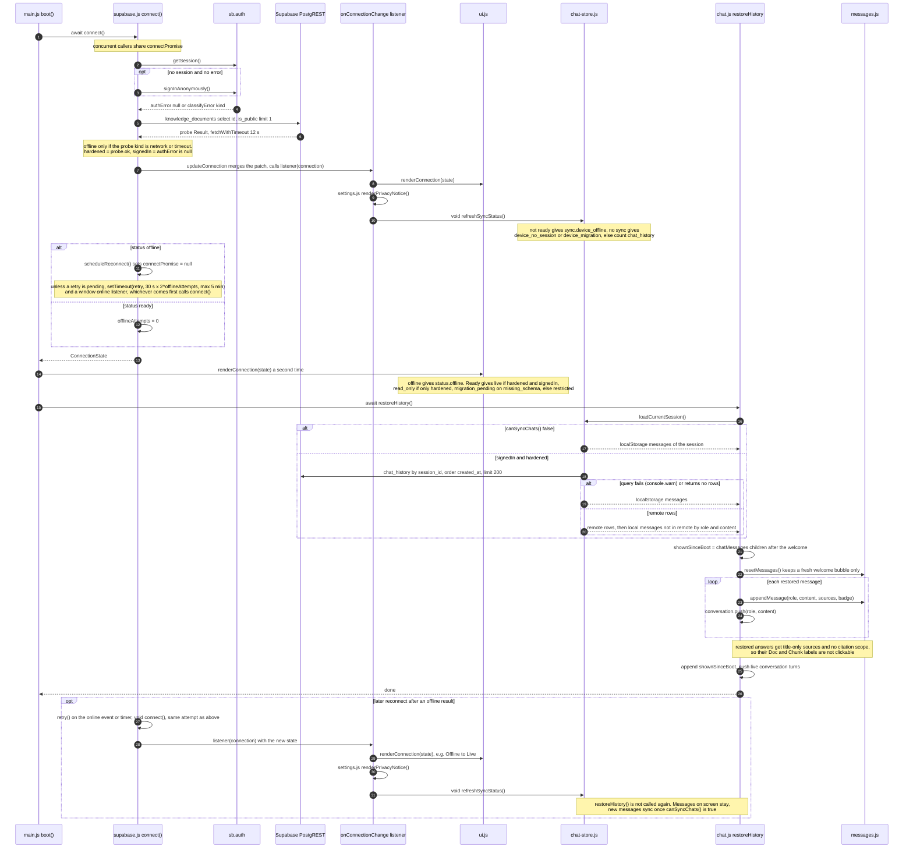
```mermaid
sequenceDiagram
    autonumber
    participant Main as main.js boot()
    participant Sb as supabase.js connect()
    participant Auth as sb.auth
    participant DB as Supabase PostgREST
    participant L as onConnectionChange listener
    participant UI as ui.js
    participant Store as chat-store.js
    participant Chat as chat.js restoreHistory
    participant Msg as messages.js

    Main->>Sb: await connect()
    Note over Sb: concurrent callers share connectPromise
    Sb->>Auth: getSession()
    opt no session and no error
        Sb->>Auth: signInAnonymously()
    end
    Auth-->>Sb: authError null or classifyError kind
    Sb->>DB: knowledge_documents select id, is_public limit 1
    DB-->>Sb: probe Result, fetchWithTimeout 12 s
    Note over Sb: offline only if the probe kind is network or timeout.<br/>hardened = probe.ok, signedIn = authError is null
    Sb->>L: updateConnection merges the patch, calls listener(connection)
    L->>UI: renderConnection(state)
    L->>L: settings.js renderPrivacyNotice()
    L->>Store: void refreshSyncStatus()
    Note over Store: not ready gives sync.device_offline, no sync gives<br/>device_no_session or device_migration, else count chat_history
    alt status offline
        Sb->>Sb: scheduleReconnect() sets connectPromise = null
        Note over Sb: unless a retry is pending, setTimeout(retry, 30 s x 2^offlineAttempts, max 5 min)<br/>and a window online listener, whichever comes first calls connect()
    else status ready
        Sb->>Sb: offlineAttempts = 0
    end
    Sb-->>Main: ConnectionState
    Main->>UI: renderConnection(state) a second time
    Note over UI: offline gives status.offline. Ready gives live if hardened and signedIn,<br/>read_only if only hardened, migration_pending on missing_schema, else restricted
    Main->>Chat: await restoreHistory()
    Chat->>Store: loadCurrentSession()
    alt canSyncChats() false
        Store-->>Chat: localStorage messages of the session
    else signedIn and hardened
        Store->>DB: chat_history by session_id, order created_at, limit 200
        alt query fails (console.warn) or returns no rows
            Store-->>Chat: localStorage messages
        else remote rows
            Store-->>Chat: remote rows, then local messages not in remote by role and content
        end
    end
    Chat->>Chat: shownSinceBoot = chatMessages children after the welcome
    Chat->>Msg: resetMessages() keeps a fresh welcome bubble only
    loop each restored message
        Chat->>Msg: appendMessage(role, content, sources, badge)
        Chat->>Chat: conversation.push(role, content)
    end
    Note over Chat,Msg: restored answers get title-only sources and no citation scope,<br/>so their Doc and Chunk labels are not clickable
    Chat->>Chat: append shownSinceBoot, push live conversation turns
    Chat-->>Main: done
    opt later reconnect after an offline result
        Sb->>Sb: retry() on the online event or timer, void connect(), same attempt as above
        Sb->>L: listener(connection) with the new state
        L->>UI: renderConnection(state), e.g. Offline to Live
        L->>L: settings.js renderPrivacyNotice()
        L->>Store: void refreshSyncStatus()
        Note over Store,Chat: restoreHistory() is not called again. Messages on screen stay,<br/>new messages sync once canSyncChats() is true
    end
```

Sources: [`src/js/main.js`](../src/js/main.js), [`src/js/supabase.js`](../src/js/supabase.js), [`src/js/ui.js`](../src/js/ui.js), [`src/js/settings.js`](../src/js/settings.js), [`src/js/chat-store.js`](../src/js/chat-store.js), [`src/js/chat.js`](../src/js/chat.js), [`src/js/messages.js`](../src/js/messages.js), [`src/js/rag/citations.js`](../src/js/rag/citations.js), [`src/js/config.js`](../src/js/config.js)

### saveSettings: server URL, API keys, model preference

saveSettings first validates the own-server URL with normalizeServerUrl and stops with an alert (and focus on the field) when it is invalid, insecure or contains credentials. The URL, the remember toggle and the model preference go to localStorage; each key is written only when a new one was typed, or re-written to the other storage when an existing key's remember setting changed, and writeSecret always deletes both copies first and then uses localStorage (remember) or sessionStorage. Inputs are cleared and only masked hints with the last four characters are shown. When the model preference changed and the engine status is not idle, the engine is unloaded before changeEngine applies the selected mode interactively; changeEngine resolves with whether setMode stored the mode, and saveSettings then alerts settings.saved_toast only when every write it made returned true, otherwise settings.save_failed.

<!-- diagram: settings-flow-save -->
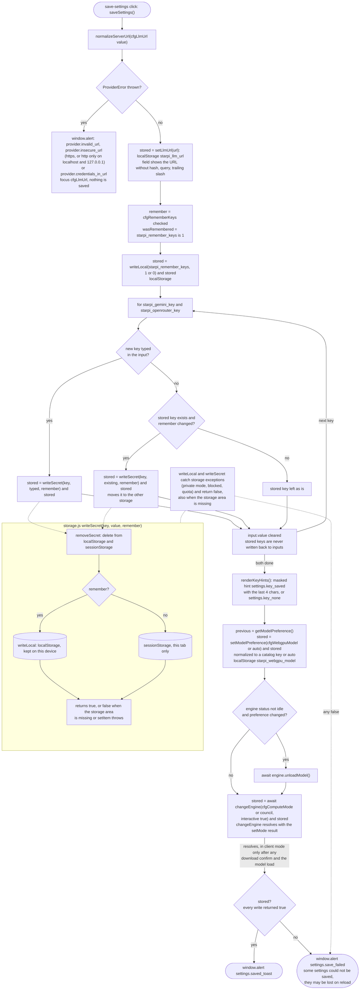
```mermaid
flowchart TD
    Save(["save-settings click: saveSettings()"]) --> Norm["normalizeServerUrl(cfgLlmUrl value)"]
    Norm --> UrlOk{"ProviderError thrown?"}
    UrlOk -->|"yes"| UrlAlert["window.alert: provider.invalid_url, provider.insecure_url<br/>(https, or http only on localhost and 127.0.0.1)<br/>or provider.credentials_in_url<br/>focus cfgLlmUrl, nothing is saved"]
    UrlOk -->|"no"| SetUrl["stored = setLlmUrl(url): localStorage starpi_llm_url<br/>field shows the URL without hash, query, trailing slash"]
    SetUrl --> Remember["remember = cfgRememberKeys checked<br/>wasRemembered = starpi_remember_keys is 1"]
    Remember --> Flag["stored = writeLocal(starpi_remember_keys, 1 or 0) and stored<br/>localStorage"]
    Flag --> Loop["for starpi_gemini_key and starpi_openrouter_key"]
    Loop --> Typed{"new key typed<br/>in the input?"}
    Typed -->|"yes"| WriteTyped["stored = writeSecret(key, typed, remember) and stored"]
    Typed -->|"no"| Moved{"stored key exists and<br/>remember changed?"}
    Moved -->|"yes"| Migrate["stored = writeSecret(key, existing, remember) and stored<br/>moves it to the other storage"]
    Moved -->|"no"| Keep["stored key left as is"]
    WriteTyped --> ClearInput
    Migrate --> ClearInput
    Keep --> ClearInput["input.value cleared<br/>stored keys are never written back to inputs"]
    ClearInput -->|"next key"| Loop
    ClearInput -->|"both done"| Hints["renderKeyHints(): masked hint settings.key_saved<br/>with the last 4 chars, or settings.key_none"]
    Hints --> Pref["previous = getModelPreference()<br/>stored = setModelPreference(cfgWebgpuModel or auto) and stored<br/>normalized to a catalog key or auto<br/>localStorage starpi_webgpu_model"]
    Pref --> PrefChanged{"engine status not idle<br/>and preference changed?"}
    PrefChanged -->|"yes"| Unload["await engine.unloadModel()"]
    PrefChanged -->|"no"| Change
    Unload --> Change["stored = await changeEngine(cfgComputeMode or council,<br/>interactive true) and stored<br/>changeEngine resolves with the setMode result"]
    Change -->|"resolves, in client mode only after any<br/>download confirm and the model load"| AllOk{"stored?<br/>every write returned true"}
    AllOk -->|"yes"| Toast(["window.alert settings.saved_toast"])
    AllOk -->|"no"| Failed(["window.alert settings.save_failed<br/>some settings could not be saved,<br/>they may be lost on reload"])

    subgraph sg_secret["storage.js writeSecret(key, value, remember)"]
        WS1["removeSecret: delete from<br/>localStorage and sessionStorage"] --> WS2{"remember?"}
        WS2 -->|"yes"| WS3[("writeLocal: localStorage, kept on this device")]
        WS2 -->|"no"| WS4[("sessionStorage, this tab only")]
        WS3 --> WS5["returns true, or false when the storage area<br/>is missing or setItem throws"]
        WS4 --> WS5
    end
    WriteTyped -.-> WS1
    Migrate -.-> WS1
    StoreErr["writeLocal and writeSecret catch storage exceptions<br/>(private mode, blocked, quota) and return false,<br/>also when the storage area is missing"] -.- sg_secret
    StoreErr -.->|"any false"| Failed
```

Sources: [`src/js/settings.js`](../src/js/settings.js), [`src/js/providers.js`](../src/js/providers.js), [`src/js/storage.js`](../src/js/storage.js), [`src/js/state.js`](../src/js/state.js), [`src/js/config.js`](../src/js/config.js), [`src/js/webgpu/models.js`](../src/js/webgpu/models.js), [`src/js/webgpu/engine.js`](../src/js/webgpu/engine.js)

### changeEngine, clearKeys and deleteModelCache

changeEngine stores the normalized mode in localStorage through setMode, syncs both mode selectors and the privacy notice, sets the status dot per mode and resolves with whether that write succeeded (saveSettings uses it, boot and both change-engine selects, engineSelector and cfgComputeMode, ignore it): client reuses a ready engine or calls startLocalEngine (interactive loads may ask to download, non-interactive loads only use a cached model), local probes GET /models on the own server with a 4 s timeout, council is ok only when a Gemini or OpenRouter key is stored. clearKeys removes both keys from localStorage and sessionStorage and refreshes hints and privacy notice but not the engine dot. deleteModelCache asks for confirmation, unloads the engine and deletes the cached f16 and f32 variants of every catalog model, alerting done or failed.

<!-- diagram: settings-flow-engine-keys-cache -->
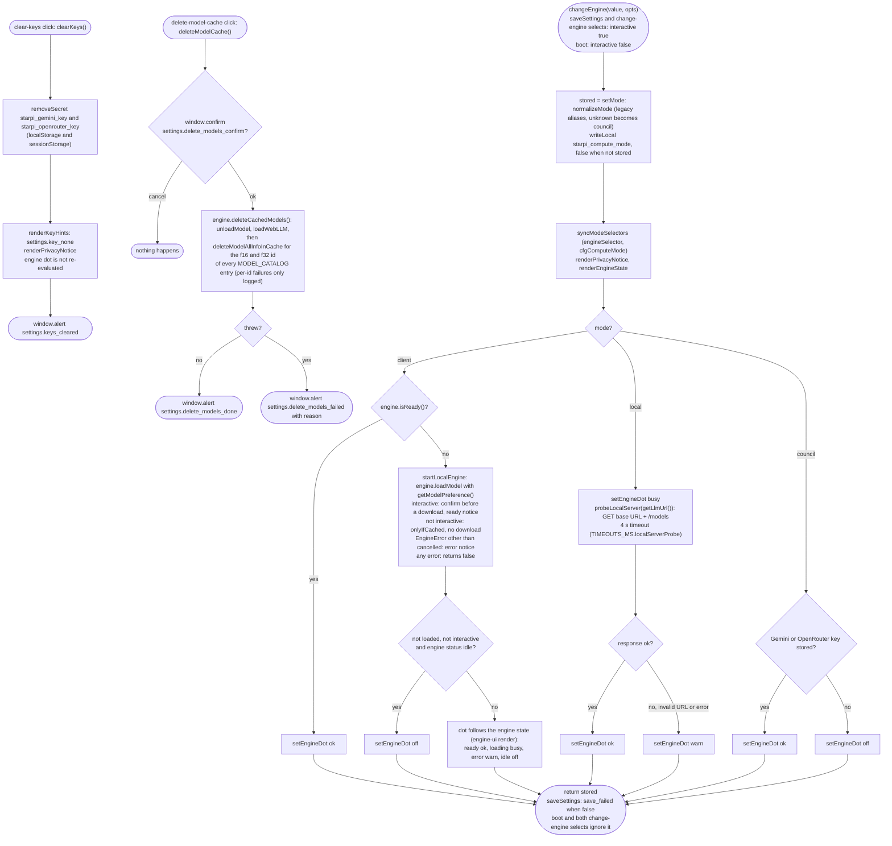
```mermaid
flowchart TD
    CE(["changeEngine(value, opts)<br/>saveSettings and change-engine selects: interactive true<br/>boot: interactive false"]) --> SetMode["stored = setMode: normalizeMode (legacy aliases, unknown becomes council)<br/>writeLocal starpi_compute_mode, false when not stored"]
    SetMode --> SyncUi["syncModeSelectors (engineSelector, cfgComputeMode)<br/>renderPrivacyNotice, renderEngineState"]
    SyncUi --> Mode{"mode?"}
    Mode -->|"client"| Ready{"engine.isReady()?"}
    Ready -->|"yes"| DotOk1["setEngineDot ok"]
    Ready -->|"no"| Start["startLocalEngine: engine.loadModel with getModelPreference()<br/>interactive: confirm before a download, ready notice<br/>not interactive: onlyIfCached, no download<br/>EngineError other than cancelled: error notice<br/>any error: returns false"]
    Start --> Loaded{"not loaded, not interactive<br/>and engine status idle?"}
    Loaded -->|"yes"| DotOff1["setEngineDot off"]
    Loaded -->|"no"| DotEngine["dot follows the engine state (engine-ui render):<br/>ready ok, loading busy, error warn, idle off"]
    Mode -->|"local"| Probe["setEngineDot busy<br/>probeLocalServer(getLlmUrl()): GET base URL + /models<br/>4 s timeout (TIMEOUTS_MS.localServerProbe)"]
    Probe --> ProbeOk{"response ok?"}
    ProbeOk -->|"yes"| DotOk2["setEngineDot ok"]
    ProbeOk -->|"no, invalid URL or error"| DotWarn["setEngineDot warn"]
    Mode -->|"council"| HasKey{"Gemini or OpenRouter key stored?"}
    HasKey -->|"yes"| DotOk3["setEngineDot ok"]
    HasKey -->|"no"| DotOff2["setEngineDot off"]
    Ret(["return stored<br/>saveSettings: save_failed when false<br/>boot and both change-engine selects ignore it"])
    DotOk1 --> Ret
    DotOff1 --> Ret
    DotEngine --> Ret
    DotOk2 --> Ret
    DotWarn --> Ret
    DotOk3 --> Ret
    DotOff2 --> Ret

    Clear(["clear-keys click: clearKeys()"]) --> Remove["removeSecret starpi_gemini_key and starpi_openrouter_key<br/>(localStorage and sessionStorage)"]
    Remove --> ClearUi["renderKeyHints: settings.key_none<br/>renderPrivacyNotice<br/>engine dot is not re-evaluated"]
    ClearUi --> ClearAlert(["window.alert settings.keys_cleared"])

    Del(["delete-model-cache click: deleteModelCache()"]) --> Confirm{"window.confirm<br/>settings.delete_models_confirm?"}
    Confirm -->|"cancel"| NoOp(["nothing happens"])
    Confirm -->|"ok"| DelCache["engine.deleteCachedModels(): unloadModel, loadWebLLM,<br/>then deleteModelAllInfoInCache for the f16 and f32 id<br/>of every MODEL_CATALOG entry (per-id failures only logged)"]
    DelCache --> Threw{"threw?"}
    Threw -->|"no"| DelDone(["window.alert settings.delete_models_done"])
    Threw -->|"yes"| DelFail(["window.alert settings.delete_models_failed with reason"])
```

Sources: [`src/js/settings.js`](../src/js/settings.js), [`src/js/engine-ui.js`](../src/js/engine-ui.js), [`src/js/webgpu/engine.js`](../src/js/webgpu/engine.js), [`src/js/providers.js`](../src/js/providers.js), [`src/js/state.js`](../src/js/state.js), [`src/js/storage.js`](../src/js/storage.js), [`src/js/config.js`](../src/js/config.js), [`src/js/main.js`](../src/js/main.js)

### testProvider: Gemini and OpenRouter connection tests

A test button disables itself, shows an amber running box and sends readinessPrompt in the active language (English or German) through callGemini or callOpenRouter, each request limited to 20 s. A missing key throws a ProviderError with notConfigured, which is shown as an amber not-configured box; any other failure shows a rose test_failed box; success shows a green box with the elapsed milliseconds and the first 140 characters of the reply. Replies and error messages pass through sanitizeModelNames, which also rewrites the provider name inside the not-configured message, and the button is re-enabled in all cases.

<!-- diagram: settings-flow-test-provider -->
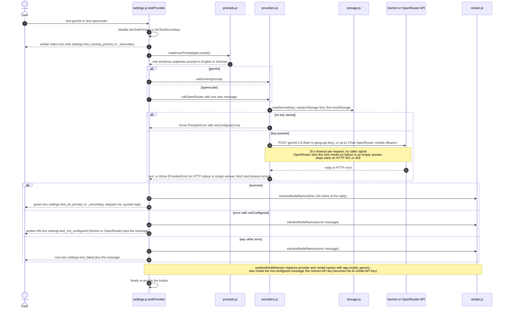
```mermaid
sequenceDiagram
    autonumber
    actor User
    participant Set as settings.js testProvider
    participant P as prompts.js
    participant Prov as providers.js
    participant St as storage.js
    participant API as Gemini or OpenRouter API
    participant R as render.js

    User->>Set: test-gemini or test-openrouter
    Set->>Set: disable btnTestPrimary or btnTestSecondary
    Set-->>User: amber status box with settings.test_running_primary or _secondary
    Set->>P: readinessPrompt(getLocale())
    P-->>Set: one-sentence readiness prompt in English or German
    alt gemini
        Set->>Prov: callGemini(prompt)
    else openrouter
        Set->>Prov: callOpenRouter with one user message
    end
    Prov->>St: readSecret(key), sessionStorage first, then localStorage
    alt no key stored
        Prov-->>Set: throw ProviderError with notConfigured true
    else key present
        Prov->>API: POST gemini-2.5-flash (x-goog-api-key), or up to 3 free OpenRouter models (Bearer)
        Note over Prov,API: 20 s timeout per request, no caller signal<br/>OpenRouter tries the next model on failure or an empty answer,<br/>stops early on HTTP 401 or 403
        API-->>Prov: reply or HTTP error
        Prov-->>Set: text, or throw (ProviderError for HTTP status or empty answer, fetch and timeout errors)
    end
    alt success
        Set->>R: sanitizeModelNames(first 140 chars of the reply)
        Set-->>User: green box settings.test_ok_primary or _secondary, elapsed ms, quoted reply
    else error with notConfigured
        Set->>R: sanitizeModelNames(error message)
        Set-->>User: amber info box settings.test_not_configured (Gemini or OpenRouter) plus the message
    else any other error
        Set->>R: sanitizeModelNames(error message)
        Set-->>User: rose box settings.test_failed plus the message
    end
    Note over Set,R: sanitizeModelNames replaces provider and model names with app.model_generic,<br/>also inside the not-configured message (No Gemini API key becomes No AI model API key)
    Set->>Set: finally re-enable the button
```

Sources: [`src/js/settings.js`](../src/js/settings.js), [`src/js/prompts.js`](../src/js/prompts.js), [`src/js/providers.js`](../src/js/providers.js), [`src/js/storage.js`](../src/js/storage.js), [`src/js/config.js`](../src/js/config.js), [`src/js/render.js`](../src/js/render.js), [`src/locales/en.json`](../src/locales/en.json)

## 3. Answering a question

One chat turn from submit to persisted answer: retrieval, citation assignment, the answer path chosen by the mode, the fallbacks when a path fails, and exactly which data leaves the device in each mode.

### submitChat: from input to persisted answer

submitChat returns early while a request is running (status.busy) or when there is neither text nor an attachment. It shows the user turn at once but stores it only after retrieval with storeQuestion(usesWorkspace), so the question stays on the device in client mode, with an attached workspace file or when a used hit comes from the workspace, and if the turn throws before that the catch stores it with usesWorkspace false. Retrieval merges on-device BM25 workspace chunks with Supabase knowledge hits, citations are assigned and registered, and the mode captured at submit picks council (Gemini then OpenRouter), client (on-device WebGPU, streamed) or local (own server); a null or empty answer falls back to the extractive synthesizer. The answer is rendered and added to the conversation only if the chat session is unchanged, and it stays in localStorage when the mode is client, a workspace excerpt was used, sync is unavailable or the insert fails.

<!-- diagram: chat-request-lifecycle -->
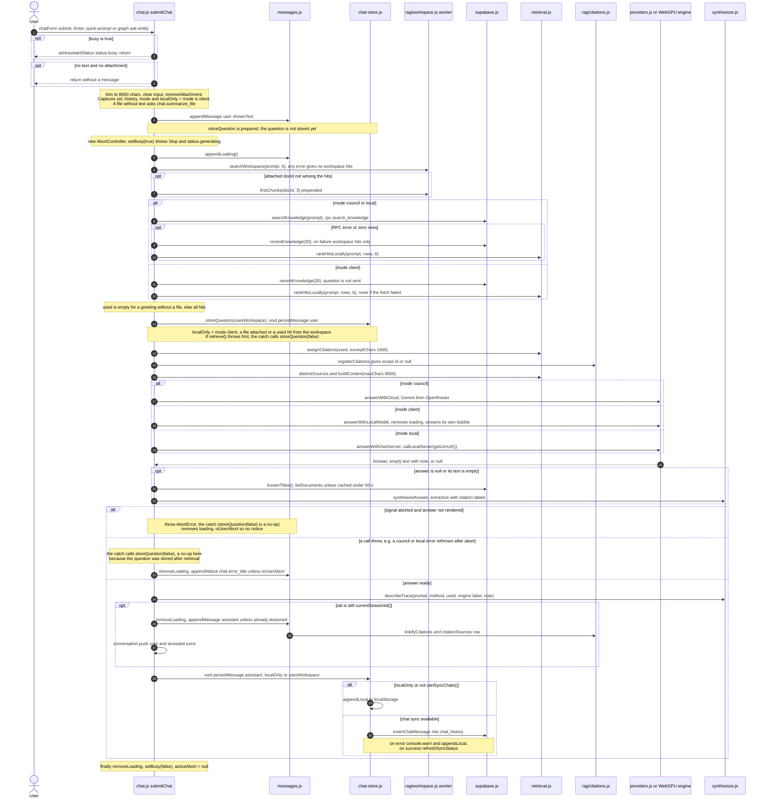
```mermaid
sequenceDiagram
    autonumber
    actor User
    participant Chat as chat.js submitChat
    participant Msg as messages.js
    participant Store as chat-store.js
    participant WS as rag/workspace.js worker
    participant SB as supabase.js
    participant Ret as retrieval.js
    participant Cit as rag/citations.js
    participant Eng as providers.js or WebGPU engine
    participant Syn as synthesizer.js

    User->>Chat: chatForm submit, Enter, quick-prompt or graph ask-entity
    opt busy is true
        Chat-->>User: setAssistantStatus status.busy, return
    end
    opt no text and no attachment
        Chat-->>User: return without a message
    end
    Note over Chat: trim to 8000 chars, clear input, removeAttachment.<br/>Captures sid, history, mode and localOnly = mode is client.<br/>A file without text asks chat.summarize_file
    Chat->>Msg: appendMessage user shownText
    Note over Chat,Store: storeQuestion is prepared, the question is not stored yet
    Note over Chat: new AbortController, setBusy(true) shows Stop and status.generating
    Chat->>Msg: appendLoading()
    Chat->>WS: searchWorkspace(prompt, 6), any error gives no workspace hits
    opt attached docId not among the hits
        Chat->>WS: firstChunks(docId, 3) prepended
    end
    alt mode council or local
        Chat->>SB: searchKnowledge(prompt), rpc search_knowledge
        opt RPC error or zero rows
            Chat->>SB: recentKnowledge(30), on failure workspace hits only
            Chat->>Ret: rankHitsLocally(prompt, rows, 6)
        end
    else mode client
        Chat->>SB: recentKnowledge(30), question is not sent
        Chat->>Ret: rankHitsLocally(prompt, rows, 6), none if the fetch failed
    end
    Note over Chat: used is empty for a greeting without a file, else all hits
    Chat->>Store: storeQuestion(usesWorkspace), void persistMessage user
    Note over Chat,Store: localOnly = mode client, a file attached or a used hit from the workspace.<br/>If retrieve() throws first, the catch calls storeQuestion(false)
    Chat->>Ret: assignCitations(used, excerptChars 1600)
    Chat->>Cit: registerCitations gives scope id or null
    Chat->>Ret: distinctSources and buildContext(maxChars 9000)
    alt mode council
        Chat->>Eng: answerWithCloud, Gemini then OpenRouter
    else mode client
        Chat->>Eng: answerWithLocalModel, removes loading, streams its own bubble
    else mode local
        Chat->>Eng: answerWithOwnServer, callLocalServer(getLlmUrl())
    end
    Eng-->>Chat: Answer, empty text with note, or null
    opt answer is null or its text is empty
        Chat->>SB: knownTitles(), listDocuments unless cached under 60 s
        Chat->>Syn: synthesizeAnswer, extractive with citation labels
    end
    alt signal aborted and answer not rendered
        Note over Chat,Msg: throw AbortError, the catch (storeQuestion(false) is a no-op)<br/>removes loading, isUserAbort so no notice
    else a call threw, e.g. a council or local error rethrown after abort
        Note over Chat: the catch calls storeQuestion(false), a no-op here<br/>because the question was stored after retrieval
        Chat->>Msg: removeLoading, appendNotice chat.error_title unless isUserAbort
    else answer ready
        Chat->>Syn: describeTrace(prompt, method, used, engine label, note)
        opt sid is still currentSessionId()
            Chat->>Msg: removeLoading, appendMessage assistant unless already streamed
            Msg->>Cit: linkifyCitations and citationSources row
            Chat->>Chat: conversation.push user and assistant turns
        end
        Chat->>Store: void persistMessage assistant, localOnly or usesWorkspace
        alt localOnly or not canSyncChats()
            Store->>Store: appendLocal to localStorage
        else chat sync available
            Store->>SB: insertChatMessage into chat_history
            Note over Store,SB: on error console.warn and appendLocal,<br/>on success refreshSyncStatus
        end
    end
    Note over Chat: finally removeLoading, setBusy(false), activeAbort = null
```

Sources: [`src/js/chat.js`](../src/js/chat.js), [`src/js/retrieval.js`](../src/js/retrieval.js), [`src/js/rag/citations.js`](../src/js/rag/citations.js), [`src/js/messages.js`](../src/js/messages.js), [`src/js/chat-store.js`](../src/js/chat-store.js), [`src/js/synthesizer.js`](../src/js/synthesizer.js), [`src/js/rag/workspace.js`](../src/js/rag/workspace.js), [`src/js/supabase.js`](../src/js/supabase.js), [`src/js/providers.js`](../src/js/providers.js), [`src/js/signals.js`](../src/js/signals.js), [`src/js/ui.js`](../src/js/ui.js), [`src/js/graph.js`](../src/js/graph.js), [`src/js/config.js`](../src/js/config.js)

### retrieve(): workspace BM25 plus knowledge-base decision tree per mode

retrieve() first asks the on-device workspace: searchWorkspace resolves empty without contacting the ingest worker when the workspace is empty, otherwise the worker returns the BM25 top 6 chunks, and a just-attached file that did not match contributes its first 3 chunks in front; any worker error drops all workspace hits. Results are capped at 6 hits, or 9 with an attachment, with workspace hits first. Council and local modes send the question to the search_knowledge RPC and, on zero rows, PGRST202 (missing_function) or any other error, rank the 30 newest documents from recentKnowledge in the browser; if that fetch fails too, only workspace hits remain with a Knowledge base unreachable label. Client mode never sends the question: it always ranks recentKnowledge(30) locally and silently keeps only the workspace hits if that fetch fails.

<!-- diagram: chat-request-retrieve -->
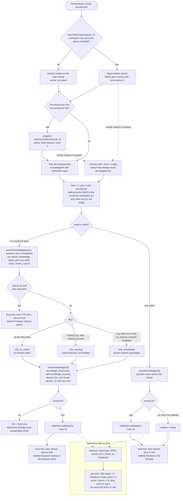
```mermaid
flowchart TD
    Start(["retrieve(query, mode, focusDocId)"]) --> WsEmpty{"searchWorkspace(query, 6):<br/>workspace has docs and query not blank?"}
    WsEmpty -->|"no"| WsNone["resolves empty on the main thread<br/>worker not asked"]
    WsEmpty -->|"yes"| Bm25["ingest worker search<br/>BM25 top 6 chunks with score above 0"]
    Bm25 --> Focus{"focusDocId set and<br/>not among the hits?"}
    WsNone --> Focus
    Focus -->|"yes"| Head["prepend firstChunks(focusDocId, 3)<br/>worker head request, score 0"]
    Focus -->|"no"| MapWs["map via workspaceHit<br/>KnowledgeHit with workspace span"]
    Head --> MapWs
    Bm25 -.->|"worker rejects or crashes"| WsFail["console.warn, local = empty<br/>search hits already found are dropped too"]
    Head -.->|"worker rejects or crashes"| WsFail
    MapWs --> Limit["limit = 6, plus 3 with focusDocId<br/>method prefix BM25 in the on-device workspace (n)<br/>only when local is not empty"]
    WsFail --> Limit
    Limit --> ModeChk{"mode is client?"}

    ModeChk -->|"no, council or local"| Fts["searchKnowledge(query), question sent to Supabase<br/>rpc search_knowledge, query_text max 1000 chars, match_count 6"]
    Fts --> FtsOk{"search.ok and<br/>rows returned?"}
    FtsOk -->|"yes"| FtsHits["local first, then FTS rows, slice to limit<br/>method Postgres full-text search"]
    FtsOk -->|"no"| Why{"why?"}
    Why -->|"ok but zero rows"| WhyNo["why_no_match<br/>no full-text match"]
    Why -->|"PGRST202, kind missing_function"| WhyMissing["why_missing<br/>search function not installed"]
    Why -->|"any other error kind,<br/>e.g. timeout, network, forbidden"| WhyUnavail["why_unavailable<br/>full-text search unavailable"]
    WhyNo --> Recent["recentKnowledge(30)<br/>knowledge_documents with knowledge_sections,<br/>newest first, one hit per section, no user text sent"]
    WhyMissing --> Recent
    WhyUnavail --> Recent
    Recent --> RecentOk{"recent.ok?"}
    RecentOk -->|"no"| Unreach["hits = local only<br/>method Knowledge base unreachable (kind)"]
    RecentOk -->|"yes"| RankFb["rankHitsLocally(query, rows, 6)"]
    RankFb --> KwHits["local first, then ranked, slice to limit<br/>method Keyword ranking in the browser (why)"]

    ModeChk -->|"yes, client"| RecentC["recentKnowledge(30)<br/>question never leaves the device"]
    RecentC --> RecentCOk{"recent.ok?"}
    RecentCOk -->|"yes"| RankC["rankHitsLocally(query, rows, 6)"]
    RecentCOk -->|"no, error not reported"| NoRank["ranked = empty"]
    RankC --> LocalHits["local first, then ranked, slice to limit<br/>method Ranked in the browser"]
    NoRank --> LocalHits

    subgraph rank["rankHitsLocally scoring"]
        Tok["tokenize: lowercase, NFKC,<br/>words over 2 chars, no stopwords"]
        Score["per term: title match +2, heading or body match +1<br/>score / (terms x 3), drop score 0, top 6<br/>no terms left gives no hits"]
        Tok --> Score
    end
    RankFb -.-> Tok
    RankC -.-> Tok
```

Sources: [`src/js/chat.js`](../src/js/chat.js), [`src/js/retrieval.js`](../src/js/retrieval.js), [`src/js/supabase.js`](../src/js/supabase.js), [`src/js/rag/workspace.js`](../src/js/rag/workspace.js), [`src/js/rag/ingest.worker.js`](../src/js/rag/ingest.worker.js), [`src/js/rag/bm25.js`](../src/js/rag/bm25.js), [`src/js/config.js`](../src/js/config.js), [`src/locales/en.json`](../src/locales/en.json)

### Answer dispatch, synthesizer fallback, rendering and persistence

The mode captured at submit selects the path: council sends Gemini one prompt without history and then tries OpenRouter with the last 4 history messages, client loads the WebGPU model interactively (it may ask to download) and streams into its own bubble marked rendered, and local calls the own server at getLlmUrl(). Council and local failures become an empty-text answer with a note (or null) unless the request was aborted, in which case the error is rethrown to the submitChat catch; client failures always become a note, and a null or empty answer is replaced by synthesizeAnswer. The answer is shown and added to the conversation only if the session id is unchanged. persistMessage keeps it in localStorage when localOnly is set (client mode or any used hit from the workspace, the same usesWorkspace that storeQuestion applied to the question right after retrieval), when canSyncChats() is false, or when the chat_history insert fails.

<!-- diagram: chat-request-answer-dispatch -->
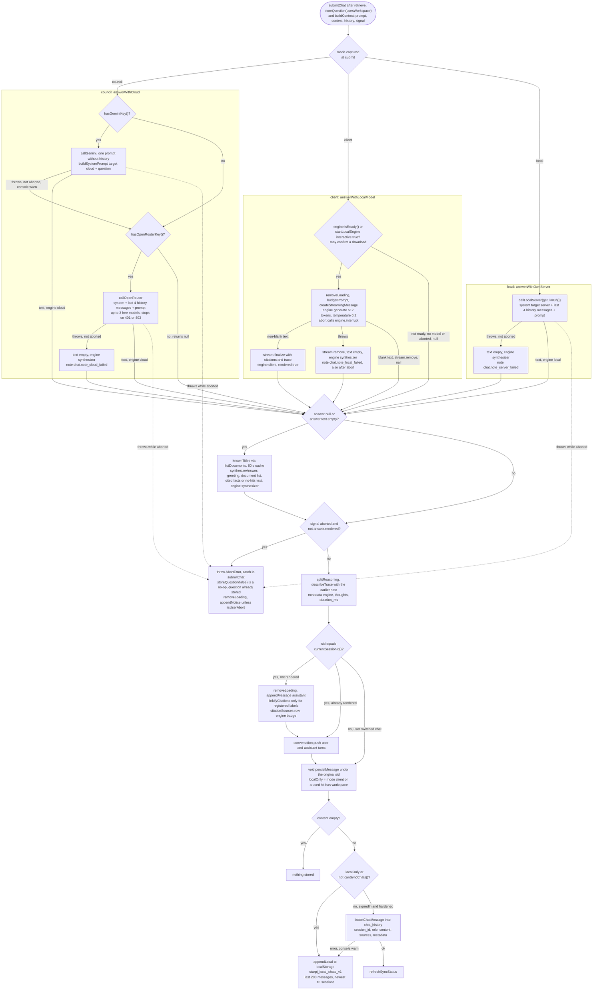
```mermaid
flowchart TD
    Entry(["submitChat after retrieve, storeQuestion(usesWorkspace)<br/>and buildContext: prompt, context, history, signal"]) --> Mode{"mode captured<br/>at submit"}

    subgraph cloud["council: answerWithCloud"]
        GemKey{"hasGeminiKey()?"}
        Gem["callGemini, one prompt without history<br/>buildSystemPrompt target cloud + question"]
        OrKey{"hasOpenRouterKey()?"}
        Or["callOpenRouter<br/>system + last 4 history messages + prompt<br/>up to 3 free models, stops on 401 or 403"]
        CloudFail["text empty, engine synthesizer<br/>note chat.note_cloud_failed"]
    end

    subgraph client["client: answerWithLocalModel"]
        Ready{"engine.isReady() or<br/>startLocalEngine interactive true?<br/>may confirm a download"}
        Gen["removeLoading, budgetPrompt, createStreamingMessage<br/>engine.generate 512 tokens, temperature 0.2<br/>abort calls engine.interrupt"]
        Fin["stream.finalize with citations and trace<br/>engine client, rendered true"]
        LocalFail["stream.remove, text empty, engine synthesizer<br/>note chat.note_local_failed, also after abort"]
    end

    subgraph server["local: answerWithOwnServer"]
        Srv["callLocalServer(getLlmUrl())<br/>system target server + last 4 history messages + prompt"]
        SrvFail["text empty, engine synthesizer<br/>note chat.note_server_failed"]
    end

    Check{"answer null or<br/>answer.text empty?"}

    Mode -->|"council"| GemKey
    GemKey -->|"yes"| Gem
    GemKey -->|"no"| OrKey
    Gem -->|"throws, not aborted, console.warn"| OrKey
    OrKey -->|"yes"| Or
    Or -->|"throws, not aborted"| CloudFail
    Mode -->|"client"| Ready
    Ready -->|"yes"| Gen
    Gen -->|"non-blank text"| Fin
    Gen -->|"throws"| LocalFail
    Mode -->|"local"| Srv
    Srv -->|"throws, not aborted"| SrvFail

    Gem -->|"text, engine cloud"| Check
    Or -->|"text, engine cloud"| Check
    Srv -->|"text, engine local"| Check
    Fin --> Check
    OrKey -->|"no, returns null"| Check
    Ready -->|"not ready, no model or aborted, null"| Check
    Gen -->|"blank text, stream.remove, null"| Check
    CloudFail --> Check
    LocalFail --> Check
    SrvFail --> Check

    Check -->|"yes"| Synth["knownTitles via listDocuments, 60 s cache<br/>synthesizeAnswer: greeting, document list,<br/>cited facts or no-hits text, engine synthesizer"]
    Check -->|"no"| AbortChk{"signal aborted and<br/>not answer.rendered?"}
    Synth --> AbortChk
    AbortChk -->|"yes"| Catch["throw AbortError, catch in submitChat<br/>storeQuestion(false) is a no-op, question already stored<br/>removeLoading, appendNotice unless isUserAbort"]
    Gem -.->|"throws while aborted"| Catch
    Or -.->|"throws while aborted"| Catch
    Srv -.->|"throws while aborted"| Catch
    AbortChk -->|"no"| Trace["splitReasoning, describeTrace with the earlier note<br/>metadata engine, thoughts, duration_ms"]
    Trace --> SidChk{"sid equals<br/>currentSessionId()?"}
    SidChk -->|"yes, not rendered"| Render["removeLoading, appendMessage assistant<br/>linkifyCitations only for registered labels<br/>citationSources row, engine badge"]
    SidChk -->|"yes, already rendered"| Push["conversation.push user and assistant turns"]
    Render --> Push
    SidChk -->|"no, user switched chat"| Persist
    Push --> Persist["void persistMessage under the original sid<br/>localOnly = mode client or a used hit has workspace"]
    Persist --> EmptyChk{"content empty?"}
    EmptyChk -->|"yes"| Skip["nothing stored"]
    EmptyChk -->|"no"| LocalChk{"localOnly or<br/>not canSyncChats()?"}
    LocalChk -->|"yes"| AppendLocal["appendLocal to localStorage starpi_local_chats_v1<br/>last 200 messages, newest 10 sessions"]
    LocalChk -->|"no, signedIn and hardened"| Insert["insertChatMessage into chat_history<br/>session_id, role, content, sources, metadata"]
    Insert -->|"error, console.warn"| AppendLocal
    Insert -->|"ok"| Status["refreshSyncStatus"]
```

Sources: [`src/js/chat.js`](../src/js/chat.js), [`src/js/prompts.js`](../src/js/prompts.js), [`src/js/synthesizer.js`](../src/js/synthesizer.js), [`src/js/messages.js`](../src/js/messages.js), [`src/js/rag/citations.js`](../src/js/rag/citations.js), [`src/js/chat-store.js`](../src/js/chat-store.js), [`src/js/supabase.js`](../src/js/supabase.js), [`src/js/providers.js`](../src/js/providers.js), [`src/js/engine-ui.js`](../src/js/engine-ui.js), [`src/js/signals.js`](../src/js/signals.js), [`src/js/config.js`](../src/js/config.js)

### Answer modes: what leaves the device

Every mode first runs BM25 over the on-device workspace in the ingest worker; council and own-server mode then send the question (first 1000 chars) to the Supabase search_knowledge RPC and fall back to recentKnowledge(30) on zero rows or an error, while client mode only fetches the 30 newest documents without the question and ranks them in the browser. The excerpts, workspace excerpts included, go to Gemini (no history) or OpenRouter (last 4 history messages) in council mode and to the own server (no key) in own-server mode, client mode keeps them in the WebLLM worker and only downloads model files, and every failure except a user abort falls back to the extractive synthesizer. The question is stored once retrieval shows whether workspace excerpts are used and stays in localStorage in client mode, with an attached file or when a used excerpt came from the workspace (a turn that fails before that stores it with the first two rules only), and the answer stays local in client mode or when a used excerpt came from the workspace, so a workspace turn never reaches chat_history. Everything else goes to chat_history only when canSyncChats() is true and the insert succeeds, otherwise to localStorage.

<!-- diagram: modes-privacy-data-egress -->
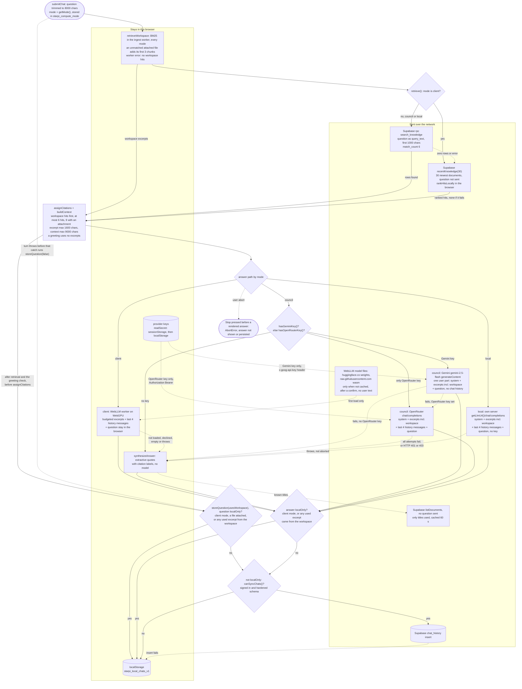
```mermaid
flowchart TD
    Ask(["submitChat: question trimmed to 8000 chars<br/>mode = getMode(), stored in starpi_compute_mode"])
    UserTurn{"storeQuestion(usesWorkspace), question localOnly?<br/>client mode, a file attached,<br/>or any used excerpt from the workspace"}
    RetMode{"retrieve(): mode is client?"}
    Ctx["assignCitations + buildContext<br/>workspace hits first, at most 6 hits, 9 with an attachment<br/>excerpt max 1600 chars, context max 9000 chars<br/>a greeting uses no excerpts"]
    Dispatch{"answer path by mode"}
    CKeys{"hasGeminiKey()?<br/>else hasOpenRouterKey()?"}
    Abort(["Stop pressed before a rendered answer:<br/>AbortError, answer not shown or persisted"])
    Persist{"answer localOnly?<br/>client mode, or any used excerpt<br/>came from the workspace"}
    Sync{"not localOnly: canSyncChats()?<br/>signed in and hardened schema"}

    subgraph dev["Stays in this browser"]
        WsSearch["retrieveWorkspace: BM25 in the ingest worker, every mode<br/>an unmatched attached file adds its first 3 chunks<br/>worker error: no workspace hits"]
        Keys[("provider keys<br/>readSecret: sessionStorage, then localStorage")]
        LGen["client: WebLLM worker on WebGPU<br/>budgeted excerpts + last 4 history messages<br/>+ question stay in the browser"]
        Synth["synthesizeAnswer: extractive quotes<br/>with citation labels, no model"]
        LS[("localStorage<br/>starpi_local_chats_v1")]
    end

    subgraph net["Sent over the network"]
        FTS["Supabase rpc search_knowledge<br/>question as query_text, first 1000 chars<br/>match_count 6"]
        Recent["Supabase recentKnowledge(30)<br/>30 newest documents, question not sent<br/>rankHitsLocally in the browser"]
        Gem["council: Gemini gemini-2.5-flash generateContent<br/>one user part: system + excerpts incl. workspace<br/>+ question, no chat history"]
        OR["council: OpenRouter chat/completions<br/>system + excerpts incl. workspace<br/>+ last 4 history messages + question"]
        Srv["local: own server getLlmUrl()/chat/completions<br/>system + excerpts incl. workspace<br/>+ last 4 history messages + question, no key"]
        HF["WebLLM model files: huggingface.co weights,<br/>raw.githubusercontent.com wasm<br/>only when not cached, after a confirm, no user text"]
        Titles["Supabase listDocuments, no question sent<br/>only titles used, cached 60 s"]
        CH[("Supabase chat_history insert")]
    end

    Ctx -->|"after retrieval and the greeting check,<br/>before assignCitations"| UserTurn
    Ask -.->|"turn throws before that:<br/>catch runs storeQuestion(false)"| UserTurn
    UserTurn -->|"yes"| LS
    UserTurn -->|"no"| Sync
    Ask --> WsSearch --> RetMode
    RetMode -->|"no, council or local"| FTS
    RetMode -->|"yes"| Recent
    FTS -->|"rows found"| Ctx
    FTS -.->|"zero rows or error"| Recent
    Recent -->|"ranked hits, none if it fails"| Ctx
    WsSearch -->|"workspace excerpts"| Ctx
    Ctx --> Dispatch
    Dispatch -->|"council"| CKeys
    Dispatch -->|"client"| LGen
    Dispatch -->|"local"| Srv
    CKeys -->|"Gemini key"| Gem
    CKeys -->|"only OpenRouter key"| OR
    CKeys -->|"no key"| Synth
    Gem -.->|"fails, OpenRouter key set"| OR
    Gem -.->|"fails, no OpenRouter key"| Synth
    OR -.->|"all attempts fail,<br/>or HTTP 401 or 403"| Synth
    HF -.->|"first load only"| LGen
    LGen -.->|"not loaded, declined,<br/>empty or throws"| Synth
    Srv -.->|"throws, not aborted"| Synth
    Keys -.->|"Gemini key only,<br/>x-goog-api-key header"| Gem
    Keys -.->|"OpenRouter key only,<br/>Authorization Bearer"| OR
    Synth -.->|"known titles"| Titles
    Dispatch -.->|"user abort"| Abort
    Gem --> Persist
    OR --> Persist
    LGen --> Persist
    Srv --> Persist
    Synth --> Persist
    Persist -->|"yes"| LS
    Persist -->|"no"| Sync
    Sync -->|"yes"| CH
    Sync -->|"no"| LS
    CH -.->|"insert fails"| LS
```

Sources: [`src/js/chat.js`](../src/js/chat.js), [`src/js/retrieval.js`](../src/js/retrieval.js), [`src/js/rag/workspace.js`](../src/js/rag/workspace.js), [`src/js/providers.js`](../src/js/providers.js), [`src/js/supabase.js`](../src/js/supabase.js), [`src/js/chat-store.js`](../src/js/chat-store.js), [`src/js/storage.js`](../src/js/storage.js), [`src/js/config.js`](../src/js/config.js), [`src/js/state.js`](../src/js/state.js), [`src/js/webgpu/engine.js`](../src/js/webgpu/engine.js), [`src/js/engine-ui.js`](../src/js/engine-ui.js)

### Council mode: Gemini then OpenRouter failover

answerWithCloud tries Gemini 2.5 Flash first when a Gemini key exists; on any failure that is not a user abort (HTTP error, empty answer, 20 s timeout, network) it continues with OpenRouter if an OpenRouter key is set, otherwise it returns null without a note. callOpenRouter tries up to 3 free models in a fixed order, moves on after empty answers and most errors, and stops early on HTTP 401 or 403; when every attempt fails the answer is empty with the note chat.note_cloud_failed (reason cut to 160 chars), which appears in the answer trace. In all these cases submitChat falls back to synthesizeAnswer, while a user abort is rethrown and no answer is persisted.

<!-- diagram: modes-privacy-cloud-failover -->
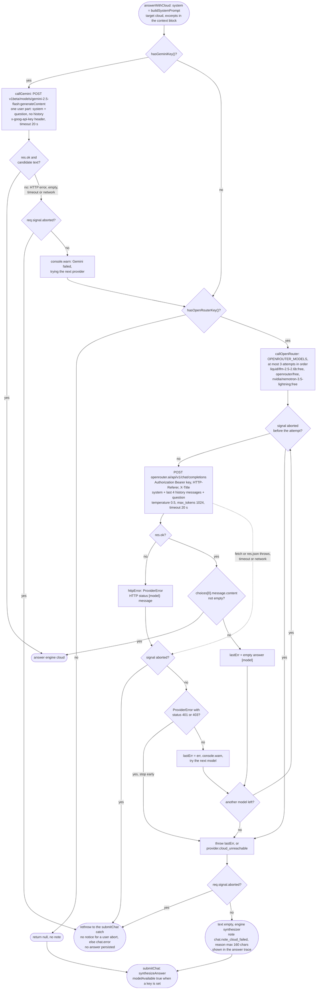
```mermaid
flowchart TD
    Start(["answerWithCloud: system = buildSystemPrompt<br/>target cloud, excerpts in the context block"])
    GK{"hasGeminiKey()?"}
    GCall["callGemini: POST v1beta/models/gemini-2.5-flash:generateContent<br/>one user part: system + question, no history<br/>x-goog-api-key header, timeout 20 s"]
    GOk{"res.ok and<br/>candidate text?"}
    GAb{"req.signal.aborted?"}
    GWarn["console.warn: Gemini failed,<br/>trying the next provider"]
    OK{"hasOpenRouterKey()?"}
    Null(["return null, no note"])
    Loop["callOpenRouter: OPENROUTER_MODELS,<br/>at most 3 attempts in order<br/>liquid/lfm-2.5-2.6b:free, openrouter/free,<br/>nvidia/nemotron-3.5-lightning:free"]
    LAb{"signal aborted<br/>before the attempt?"}
    Post["POST openrouter.ai/api/v1/chat/completions<br/>Authorization Bearer key, HTTP-Referer, X-Title<br/>system + last 4 history messages + question<br/>temperature 0.5, max_tokens 1024, timeout 20 s"]
    ROk{"res.ok?"}
    HttpErr["httpError: ProviderError<br/>HTTP status [model]: message"]
    Txt{"choices[0].message.content<br/>not empty?"}
    Empty["lastErr = empty answer [model]"]
    CatchAb{"signal aborted?"}
    Auth{"ProviderError with<br/>status 401 or 403?"}
    Warn["lastErr = err, console.warn,<br/>try the next model"]
    Next{"another model left?"}
    Throw["throw lastErr, or<br/>provider.cloud_unreachable"]
    OAb{"req.signal.aborted?"}
    Cloud(["answer engine cloud"])
    Note(["text empty, engine synthesizer<br/>note chat.note_cloud_failed, reason max 160 chars<br/>shown in the answer trace"])
    Rethrow(["rethrow to the submitChat catch<br/>no notice for a user abort, else chat.error<br/>no answer persisted"])
    Synth(["submitChat: synthesizeAnswer<br/>modelAvailable true when a key is set"])

    Start --> GK
    GK -->|"yes"| GCall
    GK -->|"no"| OK
    GCall --> GOk
    GOk -->|"yes"| Cloud
    GOk -->|"no: HTTP error, empty,<br/>timeout or network"| GAb
    GAb -->|"yes"| Rethrow
    GAb -->|"no"| GWarn --> OK
    OK -->|"no"| Null
    OK -->|"yes"| Loop --> LAb
    LAb -->|"no"| Post
    LAb -->|"yes"| Throw
    Post --> ROk
    ROk -->|"no"| HttpErr
    ROk -->|"yes"| Txt
    Txt -->|"yes"| Cloud
    Txt -->|"no"| Empty --> Next
    HttpErr --> CatchAb
    Post -.->|"fetch or res.json throws,<br/>timeout or network"| CatchAb
    CatchAb -->|"yes"| Rethrow
    CatchAb -->|"no"| Auth
    Auth -->|"yes, stop early"| Throw
    Auth -->|"no"| Warn --> Next
    Next -->|"yes"| LAb
    Next -->|"no"| Throw
    Throw --> OAb
    OAb -->|"yes"| Rethrow
    OAb -->|"no"| Note
    Note --> Synth
    Null --> Synth
```

Sources: [`src/js/chat.js`](../src/js/chat.js), [`src/js/providers.js`](../src/js/providers.js), [`src/js/config.js`](../src/js/config.js), [`src/js/signals.js`](../src/js/signals.js), [`src/js/synthesizer.js`](../src/js/synthesizer.js), [`src/js/render.js`](../src/js/render.js)

### Settings: server URL rules and key storage

saveSettings first validates the own-server URL with normalizeServerUrl: it must parse, use https unless it is http on localhost or 127.0.0.1 (exactly the plain-http hosts the vercel.json CSP connect-src allows, so http://[::1] is rejected), and carry no credentials; hash and query are removed and trailing slashes stripped, and any violation shows an alert and saves nothing. The remember toggle (starpi_remember_keys) decides where keys go: writeSecret deletes a key from both stores and writes it to localStorage when remembered, otherwise to sessionStorage for this tab only, flipping the toggle moves already stored keys, readSecret checks sessionStorage first and clear-keys removes both keys from both stores. A changed model preference unloads a non-idle engine before changeEngine applies the mode; after that finishes, the saved toast appears only when every storage write, the mode included, returned true, otherwise settings.save_failed, and a stored URL is validated again on every own-server request.

<!-- diagram: modes-privacy-settings-storage -->

```mermaid
flowchart TD
    Save(["save-settings: saveSettings()"])
    Parse{"normalizeServerUrl(cfgLlmUrl)<br/>new URL(value.trim()) parses?"}
    Proto{"protocol https:, or http: with hostname<br/>localhost or 127.0.0.1?<br/>the plain-http hosts of the CSP connect-src"}
    Cred{"username or password<br/>in the URL?"}
    Clean["clear hash and search,<br/>strip trailing slashes"]
    Bad["window.alert provider.invalid_url,<br/>provider.insecure_url or provider.credentials_in_url<br/>focus the field, nothing is saved"]
    SetUrl["setLlmUrl(url): localStorage starpi_llm_url<br/>value used when never saved: http://localhost:8000/v1<br/>returns whether it was stored"]
    Remember["remember = cfgRememberKeys checked<br/>writeLocal starpi_remember_keys 1 or 0"]
    Each["for starpi_gemini_key and starpi_openrouter_key"]
    Typed{"key typed<br/>in the field?"}
    Flip{"key already stored and<br/>remember toggle changed?"}
    Keep["stored key, if any, unchanged"]
    Write["writeSecret(key, value, remember)<br/>removeSecret from both stores first<br/>false when the store is missing or refuses"]
    RemChk{"remember?"}
    LSk[("localStorage<br/>kept across browser restarts")]
    SSk[("sessionStorage<br/>this tab only")]
    Hints["after both keys: fields cleared,<br/>renderKeyHints shows only the last 4 characters"]
    Pref["setModelPreference(cfgWebgpuModel)<br/>preference changed and engine not idle: unloadModel()"]
    Engine["await changeEngine(mode, interactive true)<br/>local mode: probeLocalServer GET url/models, 4 s<br/>client mode: may load the model first<br/>resolves with whether setMode stored the mode"]
    AllOk{"every write returned true?<br/>URL, remember flag, keys,<br/>model preference, mode"}
    Saved(["alert settings.saved_toast"])
    SaveFail(["alert settings.save_failed<br/>storage missing, blocked or full"])
    Read["readSecret: sessionStorage first,<br/>then localStorage"]
    Use["hasGeminiKey, hasOpenRouterKey,<br/>callGemini, callOpenRouter"]
    Clear(["clear-keys: removeSecret for both keys in both stores<br/>renderKeyHints, renderPrivacyNotice,<br/>alert settings.keys_cleared"])
    PerCall["stored URL is not validated at load, so<br/>callLocalServer and probeLocalServer run<br/>normalizeServerUrl again on every request<br/>invalid: chat uses the synthesizer, probe is false"]

    Save --> Parse
    Parse -->|"no"| Bad
    Parse -->|"yes"| Proto
    Proto -->|"no"| Bad
    Proto -->|"yes"| Cred
    Cred -->|"yes"| Bad
    Cred -->|"no"| Clean --> SetUrl --> Remember --> Each --> Typed
    Typed -->|"yes"| Write
    Typed -->|"no"| Flip
    Flip -->|"yes, move it"| Write
    Flip -->|"no"| Keep
    Write --> RemChk
    RemChk -->|"yes"| LSk
    RemChk -->|"no"| SSk
    Keep --> Hints
    LSk --> Hints
    SSk --> Hints
    Hints --> Pref --> Engine --> AllOk
    AllOk -->|"yes"| Saved
    AllOk -->|"no"| SaveFail
    SetUrl -.-> PerCall
    LSk -.-> Read
    SSk -.-> Read
    Read --> Use
    Clear -.->|"removes"| LSk
    Clear -.->|"removes"| SSk
```

Sources: [`src/js/settings.js`](../src/js/settings.js), [`src/js/providers.js`](../src/js/providers.js), [`src/js/storage.js`](../src/js/storage.js), [`src/js/state.js`](../src/js/state.js), [`src/js/config.js`](../src/js/config.js), [`src/js/chat.js`](../src/js/chat.js), [`vercel.json`](../vercel.json)

### Privacy notice under the chat input

renderPrivacyNotice chooses the footer from the mode alone, plus in council mode whether any provider key is stored, and re-renders on settings init, every changeEngine, clear-keys and every Supabase connection update, including each automatic reconnect attempt after an offline start. Every notice says where the question goes: nowhere in on-device mode, and to the knowledge-base search in the other three, plus the own server or the cloud provider. No notice mentions that council and own-server chats are stored in chat_history when canSyncChats() is true; the Settings tab shows the sync state.

<!-- diagram: modes-privacy-notice -->
```mermaid
flowchart TD
    Trig(["renderPrivacyNotice() fills the privacyNotice footer<br/>on initSettings, every changeEngine, clear-keys<br/>and every Supabase connection update,<br/>also on each reconnect attempt while offline"])
    Mode{"getMode()"}
    NLocal["client: lock icon, privacy.local<br/>your question and the model<br/>stay on this device"]
    NServer["local: server icon, privacy.server<br/>your question goes to host<br/>and to the knowledge-base search<br/>host = new URL(getLlmUrl()).host, a dash if unparsable"]
    Keys{"council: hasGeminiKey()<br/>or hasOpenRouterKey()?"}
    NCloud["cloud icon, privacy.cloud<br/>your question goes to the knowledge-base search,<br/>and with matching excerpts to your provider"]
    NExt["library icon, privacy.extractive<br/>question goes to the knowledge-base search,<br/>answers quote it directly"]
    RLocal["requests: recentKnowledge(30), model files<br/>on first load, listDocuments for the synthesizer<br/>none carries the question, chats stay local"]
    RServer["requests: search_knowledge with the question,<br/>own server with question, excerpts and history,<br/>chat_history when canSyncChats(),<br/>except turns that use workspace excerpts"]
    RCloud["requests: search_knowledge with the question,<br/>Gemini or OpenRouter with question and excerpts,<br/>chat_history when canSyncChats(),<br/>except turns that use workspace excerpts"]
    RExt["requests: search_knowledge with the question,<br/>listDocuments, chat_history when canSyncChats(),<br/>except turns that use workspace excerpts"]

    Trig --> Mode
    Mode -->|"client"| NLocal
    Mode -->|"local"| NServer
    Mode -->|"council"| Keys
    Keys -->|"yes"| NCloud
    Keys -->|"no"| NExt
    NLocal -.->|"actual requests"| RLocal
    NServer -.->|"actual requests"| RServer
    NCloud -.->|"actual requests"| RCloud
    NExt -.->|"actual requests"| RExt
```

Sources: [`src/js/settings.js`](../src/js/settings.js), [`src/locales/en.json`](../src/locales/en.json), [`src/js/main.js`](../src/js/main.js), [`src/js/chat.js`](../src/js/chat.js), [`src/js/chat-store.js`](../src/js/chat-store.js), [`src/js/supabase.js`](../src/js/supabase.js), [`src/js/state.js`](../src/js/state.js)

### On-device model selection

A manual preference always wins (unknown stored values become auto); in auto mode, mobile devices (userAgentData.mobile, else a user-agent regex) get Llama 3.2 1B, Qwen 2.5 3B needs maxBufferSize of at least 1 GiB and navigator.deviceMemory of at least 8 GB, Qwen 2.5 1.5B is picked when the buffer is large enough but the memory is hidden, and everything else gets Llama 3.2 1B. Adapters with shader-f16 load the q4f16_1 build, others the q4f32_1 build, and only a non-mobile qwen-3b gets a 4096-token context window (prefill chunk 512), every other choice 2048 (prefill 128 on mobile, else 256). The 700, 1000 and 1900 MB figures are the catalogue download estimates used for the confirm dialog and the 1.2x storage check, while the VRAM badge shows WebLLM vram_required_MB for the chosen build (values from the pinned @mlc-ai/web-llm 0.2.85). The same modelId reuses the loaded engine, a cache-only miss or a declined download resolves false, and every error ends in status error with a notice from startLocalEngine.

<!-- diagram: model-selection-choose-model -->
```mermaid
flowchart TD
    SetPref["save-settings: setModelPreference(cfgWebgpuModel)<br/>auto, llama-1b, qwen-1.5b or qwen-3b<br/>preference changed and engine not idle: unloadModel()"]
    Pref["preference = normalizePreference(starpi_webgpu_model)<br/>unknown or removed values become auto"]
    Start(["startLocalEngine: loadModel with getModelPreference()<br/>mode restore: onlyIfCached, no download<br/>chat answer and benchmark: interactive, may download"])
    Probe{"probeWebGPU: navigator.gpu present and<br/>requestAdapter high-performance returns an adapter?"}
    Unsup["EngineError unsupported or no-adapter"]
    HW["HardwareProfile<br/>deviceMemoryGB = navigator.deviceMemory, else null<br/>maxBufferSize = adapter.limits.maxBufferSize<br/>hasF16 = adapter.features has shader-f16"]
    MobQ{"detectMobile: userAgentData.mobile<br/>is a boolean?"}
    MobUAD["isMobile = userAgentData.mobile"]
    MobUA["isMobile = userAgent matches Android,<br/>iPhone, iPad, iPod or Mobile, any case"]
    PrefQ{"chooseModel: preference is auto?"}
    Manual["key = preference, reason manual<br/>no hardware check for the key"]
    IsMob{"isMobile?"}
    Big{"maxBufferSize at least 1 GiB<br/>and deviceMemoryGB at least 8?"}
    Unk{"maxBufferSize at least 1 GiB<br/>and deviceMemoryGB null?"}
    L1["llama-1b: Llama 3.2 1B<br/>approxDownloadMB 700<br/>WebLLM VRAM f16 879 MB, f32 1129 MB"]
    Q15["qwen-1.5b: Qwen 2.5 1.5B<br/>approxDownloadMB 1000<br/>WebLLM VRAM f16 1630 MB, f32 1889 MB"]
    Q3["qwen-3b: Qwen 2.5 3B<br/>approxDownloadMB 1900<br/>WebLLM VRAM f16 2505 MB, f32 2894 MB"]
    F16{"hasF16?"}
    Id16["modelId = spec.f16, a q4f16_1 build<br/>e.g. Qwen2.5-3B-Instruct-q4f16_1-MLC"]
    Id32["modelId = spec.f32, a q4f32_1 build<br/>e.g. Qwen2.5-3B-Instruct-q4f32_1-MLC"]
    Large{"large: key is qwen-3b<br/>and not mobile?"}
    Ctx4["chatOptions: context_window_size 4096<br/>prefill_chunk_size 512"]
    Ctx2["chatOptions: context_window_size 2048<br/>prefill_chunk_size 128 on mobile, else 256"]
    Same{"engine loaded with<br/>the same modelId?"}
    Reuse(["reuse it, resolve true"])
    Dl["teardown, status loading, import web-llm<br/>modelId not in prebuiltAppConfig: EngineError unknown<br/>not cached: onlyIfCached stops here, else prepareStorage<br/>needs 1.2 x approxDownloadMB free when the quota is known,<br/>then confirmDownload with approxDownloadMB"]
    Declined(["status idle, resolve false"])
    Create["CreateWebWorkerMLCEngine(worker, modelId,<br/>initProgressCallback, chatOptions)"]
    Ready(["status ready, vramMB = round(record.vram_required_MB)<br/>badge engine.vram_ready: label, f16 or f32,<br/>about vramMB / 1024 GB VRAM"])
    Fail(["loadModel catch: teardown, status error, rethrow<br/>startLocalEngine: notice engine.error.kind<br/>unless cancelled, resolves false"])

    SetPref --> Pref --> Start --> Probe
    Probe -->|"no"| Unsup --> Fail
    Probe -->|"yes"| HW --> MobQ
    MobQ -->|"yes"| MobUAD
    MobQ -->|"no"| MobUA
    MobUAD --> PrefQ
    MobUA --> PrefQ
    PrefQ -->|"no"| Manual
    PrefQ -->|"yes"| IsMob
    IsMob -->|"yes"| L1
    IsMob -->|"no"| Big
    Big -->|"yes"| Q3
    Big -->|"no"| Unk
    Unk -->|"yes, memory hidden"| Q15
    Unk -->|"no: under 8 GB or<br/>maxBufferSize under 1 GiB"| L1
    Manual --> F16
    L1 --> F16
    Q15 --> F16
    Q3 --> F16
    F16 -->|"yes"| Id16
    F16 -->|"no"| Id32
    Id16 --> Large
    Id32 --> Large
    Large -->|"yes"| Ctx4
    Large -->|"no"| Ctx2
    Ctx4 --> Same
    Ctx2 --> Same
    Same -->|"yes"| Reuse
    Same -->|"no"| Dl
    Dl -->|"cached, or download confirmed"| Create
    Dl -.->|"not cached with onlyIfCached,<br/>or download declined"| Declined
    Dl -.->|"not in the build,<br/>or quota too small"| Fail
    Create --> Ready
    Create -.->|"network, quota, device-lost,<br/>out-of-memory or other error"| Fail
```

Sources: [`src/js/webgpu/models.js`](../src/js/webgpu/models.js), [`src/js/webgpu/engine.js`](../src/js/webgpu/engine.js), [`src/js/engine-ui.js`](../src/js/engine-ui.js), [`src/js/state.js`](../src/js/state.js), [`src/js/settings.js`](../src/js/settings.js), [`src/js/config.js`](../src/js/config.js), [`src/index.html`](../src/index.html), [`package.json`](../package.json)

### On-device prompt budgeting

budgetPrompt reserves 512 output tokens plus 128 tokens of chat-template overhead and converts the rest of the context window to characters at 3 chars per token (4224 chars for a 2048 window, 10368 for 4096). It trims in a fixed order: system instructions up to 15% (594 en or 623 de chars, never cut), the question up to 35% of what is left, the retrieved context up to 80% of what is left, then history from the newest message backwards, each capped at 600 chars, until one no longer fits. The budgeted instructions plus contextSection, whose header is not counted, form one system message, followed by the kept history and the question, generated with 512 max tokens at temperature 0.2. A model that is not ready, an empty answer or an error falls back to the extractive synthesizer.

<!-- diagram: model-selection-prompt-budget -->
```mermaid
flowchart TD
    In(["answerWithLocalModel"])
    Ready{"engine.isReady(), or startLocalEngine<br/>interactive resolves true,<br/>model set and not aborted?"}
    Null(["return null: submitChat uses synthesizeAnswer"])
    Inputs["budgetPrompt input<br/>contextWindow = model.chatOptions.context_window_size<br/>maxOutputTokens 512<br/>system = buildInstructions(locale, local): identity + 4 rules<br/>context = buildContext excerpts, max 9000 chars<br/>history = last 4 history messages, user = the question"]
    Reserve["reserveTokens = 512 + 128 chat template overhead = 640"]
    Budget["remaining = max(256, contextWindow - 640) x 3 chars per token<br/>2048 window: 4224 chars, 4096 window: 10368 chars"]
    Take["take(text, max): allowed = min(max, remaining)<br/>longer text keeps allowed - 1 chars + ellipsis<br/>remaining shrinks by the kept length"]
    S1["Step 1 system: at most 15% of remaining, 633 or 1555<br/>594 en or 623 de chars, never cut"]
    S2["Step 2 user question: at most 35% of what is left<br/>en: 1270 chars in a 2048 window, 3420 in a 4096 window"]
    S3["Step 3 context: at most 80% of what is left<br/>en after a question of that length: 1888 or 5083 chars<br/>keeps the start, later excerpts are cut first<br/>workspace excerpts come first"]
    S4["Step 4 history, newest message first<br/>each capped at 600 chars, 599 + ellipsis<br/>en, 2048 window, long question: 472 chars left"]
    Fits{"message fits in remaining?"}
    Keep["unshift the message,<br/>remaining shrinks by its length"]
    More{"older message left?"}
    Drop["stop: this message and all<br/>older ones are dropped"]
    Sys["system message = budget.system + blank line +<br/>contextSection(locale, budget.context):<br/>header line + context, or the no matching excerpts line<br/>header and blank line are not counted in the budget"]
    Msgs["messages: system, then budget.history<br/>in chronological order, then user budget.user"]
    Gen["engine.generate: maxTokens 512, temperature 0.2, stream<br/>deltas go to createStreamingMessage<br/>Stop calls engine.interrupt()"]
    Out{"non-empty text?"}
    Done(["finalize the bubble with citations and trace<br/>answer engine client, rendered"])
    Fallback(["empty: null, throws: note chat.note_local_failed<br/>submitChat uses synthesizeAnswer"])

    In --> Ready
    Ready -->|"no"| Null
    Ready -->|"yes"| Inputs --> Reserve --> Budget --> S1 --> S2 --> S3 --> S4 --> Fits
    Take -.->|"applies to"| S1
    Take -.->|"applies to"| S2
    Take -.->|"applies to"| S3
    Fits -->|"yes"| Keep --> More
    More -->|"yes"| Fits
    More -->|"no"| Sys
    Fits -->|"no"| Drop --> Sys
    Sys --> Msgs --> Gen --> Out
    Out -->|"yes"| Done
    Out -->|"no, or generate throws"| Fallback
```

Sources: [`src/js/webgpu/models.js`](../src/js/webgpu/models.js), [`src/js/chat.js`](../src/js/chat.js), [`src/js/prompts.js`](../src/js/prompts.js), [`src/js/retrieval.js`](../src/js/retrieval.js), [`src/js/config.js`](../src/js/config.js), [`src/js/webgpu/engine.js`](../src/js/webgpu/engine.js)

## 4. On-device workspace and citations

Files added to the workspace are parsed, chunked and indexed in a dedicated worker and are never uploaded. Only the on-device mode keeps their matching excerpts on the device as well: the cloud assistant and an own server receive the excerpts, labelled with their file name, together with the question. Retrieved chunks are labelled `[Doc: <name>, Chunk: <n>]`; only labels the app registered itself become clickable citations.

### On-device workspace: from file drop to the document list

Files dropped on dropZone or picked in workspaceFileInput go through addFiles one at a time; names outside WORKSPACE_EXTENSIONS are rejected on the main thread and the rest are structured-cloned to the lazily created module worker (its URL patched in by scripts/build.mjs) in an ingest request. The worker posts parsing, chunking and indexing progress, extracts the text, chunks it with chunkText (500/50, the app never overrides them), numbers the document ws-instanceId-N from a random per-worker instanceId and its nextId counter and adds the chunks to its BM25Index. A ParseError returns as ok false with its code (any other exception as internal) and is shown as workspace.error_<code>; a worker error or messageerror event rejects every pending request with worker_crashed and resets the workspace; success appends the document and re-renders workspaceList.

<!-- diagram: workspace-ingestion-sequence -->
```mermaid
sequenceDiagram
    autonumber
    actor User
    participant UI as ingest.js
    participant WS as rag/workspace.js
    participant W as ingest.worker.js
    participant P as parser.js
    participant CH as chunker.js
    participant IX as bm25.js BM25Index

    Note over UI,WS: chat.js attachFile also calls addToWorkspace(file),<br/>without the extension filter or progress,<br/>and shows failures as a workspace.error_title notice
    User->>UI: drop on dropZone, or pick in workspaceFileInput
    loop addFiles, one file at a time, each awaited
        alt name does not match WORKSPACE_EXTENSIONS
            UI-->>User: status workspace.error_unsupported_type, next file
        else pdf, txt, md, markdown, json, csv or log
            UI->>WS: status workspace.progress_parsing 0 of 1, then addToWorkspace(file, onProgress)
            WS->>W: request() posts id, type ingest, payload file (structured clone)
            Note over WS,W: getWorker() creates the module worker starpi-ingest on first use,<br/>its URL is the hashed ingest-worker entry patched in by scripts/build.mjs
            W-->>WS: progress parsing 0 of 1
            Note over UI,WS: each progress message calls onProgress,<br/>status workspace.progress_ plus stage
            W->>P: extractText(file, onPage)
            opt PDF
                P-->>W: onPage(i, pages) after each page
                W-->>WS: progress parsing i of pages
            end
            alt extractText throws
                P-->>W: ParseError with a code, or another exception
                W-->>WS: ok false, error code (internal if not a ParseError), message, details
                WS-->>UI: reject WorkspaceError(code)
                UI-->>User: status workspace.error_ plus code, unknown codes as internal
            else worker error or messageerror event
                W--xWS: error event, no reply
                WS-->>UI: failAll rejects with worker_crashed, reset() drops the worker
                UI-->>User: status workspace.error_worker_crashed, see workspace-ingestion-reset
            else text extracted
                P-->>W: text, kind, pages
                W-->>WS: progress chunking 0 of 1
                W->>CH: chunkText(text), defaults chunkSize 500, chunkOverlap 50
                CH-->>W: chunks with index, start, end, text
                W->>W: docId = ws-instanceId-N, instanceId random per worker
                W-->>WS: progress indexing 0 of chunk count
                W->>IX: add(chunks) with docId, docName file.name, chunkIndex
                W->>W: documents.set(docId, info plus full text)
                W-->>WS: progress indexing n of n
                W-->>WS: ok true, docId, name, kind, chars, chunks, pages
                WS->>UI: docs = docs plus doc, notify() runs the onWorkspaceChange listener renderWorkspace()
                UI-->>User: workspaceList row per document, status workspace.added
            end
        end
    end
```

Sources: [`src/js/ingest.js`](../src/js/ingest.js), [`src/js/chat.js`](../src/js/chat.js), [`src/js/rag/workspace.js`](../src/js/rag/workspace.js), [`src/js/rag/ingest.worker.js`](../src/js/rag/ingest.worker.js), [`src/js/rag/parser.js`](../src/js/rag/parser.js), [`src/js/rag/chunker.js`](../src/js/rag/chunker.js), [`src/js/rag/bm25.js`](../src/js/rag/bm25.js), [`scripts/build.mjs`](../scripts/build.mjs), [`src/index.html`](../src/index.html), [`src/locales/en.json`](../src/locales/en.json)

### extractText: checks, text and JSON branches, normalization

extractText rejects unsupported extensions and files above MAX_FILE_BYTES (25 MiB) before reading anything, hands PDFs to pdfToText and decodes every other type incrementally with TextDecoderStream, cancelling the reader once the text exceeds MAX_TEXT_CHARS (5,000,000). JSON is parsed after a BOM strip and flattened into path: value lines, without a second length check. Every result is normalized (BOM, line endings, control characters) and rejected as empty when only whitespace remains; each rejection is a ParseError whose code the worker returns.

<!-- diagram: workspace-ingestion-extract-text -->
```mermaid
flowchart TD
    start(["extractText(file, onPage) in the worker"]) --> ext["ext = extensionOf(file.name): letters and digits<br/>after the last dot of the trimmed name, lowercased,<br/>empty when there are none"]
    ext --> supQ{"ext in SUPPORTED_EXTENSIONS?<br/>txt, md, markdown, csv, log, json, pdf"}
    supQ -->|"no"| eType["unsupported_type<br/>details ext, or ? when empty"]
    supQ -->|"yes"| sizeQ{"file.size above MAX_FILE_BYTES<br/>25 MiB = 26,214,400 bytes?"}
    sizeQ -->|"yes"| eBig["too_large<br/>details max 25"]
    sizeQ -->|"no"| kindQ{"ext?"}
    kindQ -->|"pdf"| pdf["pdfToText(await file.arrayBuffer(), onPage)<br/>see workspace-ingestion-pdf"]
    pdf -->|"throws"| ePdf["ParseError encrypted_pdf, invalid_pdf or too_large,<br/>other exceptions reach the UI as internal"]
    pdf -->|"text and pages"| norm
    kindQ -->|"json, txt, md, markdown, csv or log"| read{"streamToText(file.stream()):<br/>TextDecoderStream utf-8, reader done?"}
    read -->|"no"| append["text += decoded piece"]
    append --> streamLenQ{"text.length above<br/>MAX_TEXT_CHARS 5,000,000?"}
    streamLenQ -->|"yes, await reader.cancel()"| eLong["too_large<br/>details max 5000000"]
    streamLenQ -->|"no"| read
    read -->|"yes"| jsonQ{"ext is json?"}
    jsonQ -->|"yes"| parse{"JSON.parse after a BOM strip succeeds?"}
    parse -->|"no"| eJson["invalid_json<br/>message from JSON.parse"]
    parse -->|"yes"| flat["flattenJson: one path: value line per scalar<br/>in document order, skips null, undefined and empty strings,<br/>the flattened text is not length-checked again"]
    jsonQ -->|"no"| norm
    flat --> norm["normalizeText: strip a leading BOM, CRLF and CR to LF,<br/>drop control characters except tab and newline"]
    norm --> emptyQ{"only whitespace left?"}
    emptyQ -->|"yes"| eEmpty["empty"]
    emptyQ -->|"no"| ok(["return text, kind (markdown as md),<br/>pages (null unless pdf)"])

    subgraph sg_err["ParseError: the worker replies ok false with this code"]
        eType
        eBig
        eLong
        eJson
        eEmpty
    end
```

Sources: [`src/js/rag/parser.js`](../src/js/rag/parser.js), [`src/js/rag/ingest.worker.js`](../src/js/rag/ingest.worker.js)

### pdfToText: pdf.js loading, page loop and limits

pdfToText imports the pdf.js legacy build on first use (the pdf.js worker module first, so parsing runs in the ingestion worker's own thread) and caches that promise, a rejected one included. A PasswordException becomes encrypted_pdf and any other open failure invalid_pdf; at most MAX_PDF_PAGES (2000) pages are read, each page reports progress through onPage, and the text is rejected as too_large once the page texts exceed 5,000,000 characters. Import and page-read failures are not ParseErrors and reach the UI as internal, and task.destroy() runs in a finally block only after the document has opened.

<!-- diagram: workspace-ingestion-pdf -->
```mermaid
flowchart TD
    start(["pdfToText(buffer, onPage)"]) --> load["loadPdfjs(): pdfjsPromise ??= import of<br/>pdfjs-dist/legacy/build/pdf.worker.mjs, then pdf.mjs,<br/>so pdf.js parses in this worker's thread"]
    load --> loadQ{"imports resolve?"}
    loadQ -->|"no"| eImport["not a ParseError: code internal<br/>the rejected promise stays cached,<br/>later PDFs fail until the worker is replaced"]
    loadQ -->|"yes"| open["getDocument: data as Uint8Array, disableFontFace,<br/>useSystemFonts false, isOffscreenCanvasSupported false,<br/>stopAtErrors false, verbosity ERRORS"]
    open --> openQ{"await task.promise"}
    openQ -->|"PasswordException"| eEnc["encrypted_pdf"]
    openQ -->|"any other error"| eBad["invalid_pdf<br/>message from pdf.js"]
    openQ -->|"resolved"| pages["pages = min(numPages, MAX_PDF_PAGES 2000)<br/>later pages are never read"]
    pages --> page["page i: getPage, getTextContent,<br/>append each item.str, a newline after hasEOL,<br/>otherwise a space unless it ends in whitespace"]
    page -->|"getPage or getTextContent throws"| ePage["not a ParseError: code internal"]
    page --> clean["page.cleanup(), drop spaces and tabs before newlines,<br/>trim, keep the page text when not empty"]
    clean --> lenQ{"summed page text length above<br/>MAX_TEXT_CHARS 5,000,000?"}
    lenQ -->|"yes"| eLong["too_large<br/>details max 5000000"]
    lenQ -->|"no"| onPage["onPage(i, pages): the worker posts<br/>progress parsing i of pages"]
    onPage -->|"i below pages"| page
    onPage -->|"last page"| finished(["return text = page texts joined by a blank line,<br/>and pages"])
    fin["finally: await task.destroy()<br/>only once the document has opened"]
    eLong -.->|"finally"| fin
    ePage -.->|"finally"| fin
    finished -.->|"finally"| fin

    subgraph sg_perr["ParseError: the worker replies ok false with this code"]
        eEnc
        eBad
        eLong
    end
```

Sources: [`src/js/rag/parser.js`](../src/js/rag/parser.js), [`src/js/rag/ingest.worker.js`](../src/js/rag/ingest.worker.js)

### Workspace RPCs: search, head, context, text, remove, clear

Every workspace call goes through request(), which posts {id, type, payload} to the worker and settles on the reply with the same id. searchWorkspace resolves to an empty list without sending anything when there are no documents or the query is blank; the worker clamps topK to 1..50 (default 5), head counts to 1..10 (default 3) and the context pad to 0..2000 (default 300, workspace.js sends 400). context and text reply with code empty for an unknown docId while head replies with an empty list, and chat.js swallows any retrieval rejection. clearWorkspace rejects pending calls with cleared and terminates the worker instead of sending the worker's clear request.

<!-- diagram: workspace-ingestion-rpcs -->
```mermaid
sequenceDiagram
    autonumber
    participant ING as ingest.js
    participant CHAT as chat.js
    participant CIT as rag/citations.js
    participant WS as rag/workspace.js
    participant W as ingest.worker.js
    participant IX as bm25.js BM25Index

    Note over WS,W: request() posts id, type, payload and settles on the<br/>ok true or ok false reply with the same id,<br/>progress messages only call onProgress
    CHAT->>WS: retrieveWorkspace calls searchWorkspace(prompt, 6)
    Note over ING,CHAT: the ingest.js search form calls searchWorkspace(query, 5)
    alt docs empty or blank query
        WS-->>CHAT: empty list, no request is sent
    else documents present
        WS->>W: search, query and topK
        W->>IX: search(query, topK), topK = Number(topK) or 5, clamped to 1..50
        IX-->>W: hits with a score above 0, best first
        W-->>WS: docId, docName, chunkIndex, start, end, text, score, matchedTerms
        WS-->>CHAT: WorkspaceHit list
    end
    opt attached file has no hit
        CHAT->>WS: firstChunks(docId, 3)
        WS->>W: head, count clamped to 1..10 (default 3)
        W-->>WS: first index entries of docId, score 0, empty list for an unknown docId
        WS-->>CHAT: prepended to the hits
    end
    Note over CHAT,WS: any rejection here is caught, logged with console.warn,<br/>and the chat continues without workspace hits
    CIT->>WS: getChunkContext(docId, start, end)
    WS->>W: context, pad 400 (worker uses Number(pad) or 300, clamped to 0..2000)
    alt docId in documents
        W-->>WS: before, match, after, start, end (clamped to the text), length
    else unknown docId
        W-->>WS: ok false, code empty
    end
    ING->>WS: getDocumentText(docId) from the workspace-to-form button
    WS->>W: text, docId
    W-->>WS: name and full text, or ok false with code empty
    WS-->>ING: resolves or rejects, copyToForm fills the ingest form or shows workspace.error_empty
    ING->>WS: removeFromWorkspace(docId) from the workspace-remove button
    WS->>W: remove, docId
    W->>IX: remove(docId), df and totalLength reduced
    W-->>WS: removed chunk count, documents entry deleted
    WS->>ING: docs filtered, notify() re-renders the list
    ING->>WS: clearWorkspace() after window.confirm
    WS->>WS: failAll rejects pending requests with cleared, reset() terminates the worker
    WS->>ING: docs emptied and notify() only when there were documents
    ING->>ING: workspaceResults emptied, status workspace.cleared
    Note over W,IX: the worker also handles a clear request, but nothing sends it
```

Sources: [`src/js/rag/workspace.js`](../src/js/rag/workspace.js), [`src/js/rag/ingest.worker.js`](../src/js/rag/ingest.worker.js), [`src/js/rag/bm25.js`](../src/js/rag/bm25.js), [`src/js/ingest.js`](../src/js/ingest.js), [`src/js/chat.js`](../src/js/chat.js), [`src/js/rag/citations.js`](../src/js/rag/citations.js), [`src/js/config.js`](../src/js/config.js)

### Worker crash, Clear workspace and restart

A worker error or messageerror event and a confirmed Clear workspace both end in failAll plus reset(): every pending request rejects (worker_crashed or cleared), the worker is terminated and the document list is emptied. Each caller handles the rejection in its own way (status line, chat notice, retrieval without workspace hits, citation.note_missing, a logged error). The next request starts a fresh worker with a new random instanceId, so its document ids (ws-instanceId-n) never repeat an earlier one and an old citation span always ends in citation.note_missing.

<!-- diagram: workspace-ingestion-reset -->
```mermaid
flowchart TD
    crash(["worker error or messageerror event<br/>for example the worker script fails to load"])
    failCrash["console.error, then<br/>failAll(WorkspaceError worker_crashed)"]
    clickClear(["workspace-clear button"])
    confirmQ{"window.confirm(workspace.clear_confirm)?"}
    keepAll(["nothing changes"])
    failClear["clearWorkspace(): failAll(WorkspaceError cleared)<br/>the worker's clear request is never sent"]
    reset["reset(): worker.terminate(), worker = null"]
    docsQ{"docs non-empty?"}
    emptyDocs["docs = [], notify()<br/>renderWorkspace shows workspaceEmpty"]
    idle["no worker: documents, chunks and index are gone"]
    uiClear["ingest.js empties workspaceResults,<br/>status workspace.cleared"]
    pending["every pending request rejects with that WorkspaceError"]
    rIngest["addFiles: status workspace.error_worker_crashed or<br/>workspace.error_cleared (replacing workspace.cleared),<br/>then the next file"]
    rAttach["chat attachFile: workspace.error_title notice"]
    rChat["chat retrieveWorkspace: console.warn,<br/>the answer gets no workspace hits"]
    rCtx["citation drawer: citation.note_missing"]
    rText["copyToForm: status workspace.error_empty"]
    rRemove["workspace-remove: rejection logged by reportUnexpected"]
    fresh(["next request(): getWorker() starts a fresh worker,<br/>empty index, new random instanceId, nextId = 1"])
    reuse["new files get ws-instanceId-1, ws-instanceId-2:<br/>an old citation span never matches them<br/>and shows citation.note_missing"]

    crash --> failCrash
    failCrash --> reset
    clickClear --> confirmQ
    confirmQ -->|"no"| keepAll
    confirmQ -->|"yes"| failClear
    failClear --> reset
    failCrash -.->|"rejects"| pending
    failClear -.->|"rejects"| pending
    pending --> rIngest
    pending --> rAttach
    pending --> rChat
    pending --> rCtx
    pending --> rText
    pending --> rRemove
    reset --> docsQ
    docsQ -->|"yes"| emptyDocs
    docsQ -->|"no"| idle
    emptyDocs --> idle
    idle -->|"clear path, when clearWorkspace returns"| uiClear
    idle --> fresh
    fresh --> reuse
```

Sources: [`src/js/rag/workspace.js`](../src/js/rag/workspace.js), [`src/js/rag/ingest.worker.js`](../src/js/rag/ingest.worker.js), [`src/js/ingest.js`](../src/js/ingest.js), [`src/js/chat.js`](../src/js/chat.js), [`src/js/rag/citations.js`](../src/js/rag/citations.js), [`src/js/dom.js`](../src/js/dom.js), [`src/locales/en.json`](../src/locales/en.json)

### chunkText: sliding windows with exact offsets

chunkText validates its options first: chunkSize (default 500) and chunkOverlap (default 50) must be non-negative integers, the size at least 1 and the overlap smaller than the size, otherwise it throws a RangeError; a non-string or empty text gives no chunks, and the app never passes options, so 500 and 50 always apply. Each window ends at min(start + size, text.length), is pulled back to a paragraph, sentence or whitespace break in its last quarter unless it is the final window, and is moved to a safe boundary. Chunk bounds are trimmed of whitespace, whitespace-only windows are skipped, and each chunk text is exactly text.slice(start, end) of its trimmed bounds. The next window starts overlap characters before the end, but at least at start + 1 and on a safe boundary, so the loop always advances; the start = end fallback cannot be reached.

<!-- diagram: chunk-bm25-chunktext -->
```mermaid
flowchart TD
    start(["chunkText(text, options)"]) --> opts["size = chunkSize, 500 when undefined or null<br/>overlap = chunkOverlap, 50 when undefined or null<br/>the app never passes them, so always 500 and 50"]
    opts --> intQ{"size, then overlap:<br/>an integer and not negative?"}
    intQ -->|"no"| errInt["RangeError: chunkSize or chunkOverlap<br/>must be a non-negative integer"]
    intQ -->|"yes"| minQ{"size below 1?"}
    minQ -->|"yes"| errMin["RangeError: chunkSize must be at least 1"]
    minQ -->|"no"| ovQ{"overlap at least size?"}
    ovQ -->|"yes"| errOv["RangeError: chunkOverlap must be<br/>smaller than chunkSize"]
    ovQ -->|"no"| textQ{"text is a string with length above 0?"}
    textQ -->|"no"| none(["return no chunks"])
    textQ -->|"yes"| init["start = 0"]
    init --> loopQ{"start below text.length?"}
    loopQ -->|"no"| done(["return chunks"])
    loopQ -->|"yes"| hard["end = min(start + size, text.length)"]
    hard --> tailQ{"end below text.length?"}
    tailQ -->|"yes"| fb["end = findBreak(text, start, end, size)<br/>paragraph, sentence or whitespace break in the<br/>last floor(size / 4) characters, 125 by default"]
    tailQ -->|"no, final window"| sb
    fb --> sb["end = safeBoundary(text, end, start)<br/>never splits a surrogate pair<br/>or detaches a combining mark"]
    sb --> trim["s = start, e = end<br/>move s forward and e back past whitespace"]
    trim --> keepQ{"e greater than s?"}
    keepQ -->|"yes"| push["push index = chunks.length, start s, end e,<br/>text = text.slice(s, e), exact source offsets"]
    keepQ -->|"no, whitespace-only window"| lastQ
    push --> lastQ{"end at or past text.length?"}
    lastQ -->|"yes"| done
    lastQ -->|"no"| step["next = safeBoundary(text,<br/>max(end - overlap, start + 1), start)"]
    step --> progQ{"next greater than start?"}
    progQ -->|"yes, always"| setNext["start = next<br/>consecutive windows share about overlap characters"]
    progQ -->|"no, defensive fallback, unreachable"| setEnd["start = end"]
    setNext --> loopQ
    setEnd --> loopQ
```

Sources: [`src/js/rag/chunker.js`](../src/js/rag/chunker.js), [`src/js/rag/ingest.worker.js`](../src/js/rag/ingest.worker.js), [`src/js/rag/workspace.js`](../src/js/rag/workspace.js)

### Chunk boundary helpers: findBreak and safeBoundary

findBreak only looks at the last floor(size / 4) characters before hardEnd (125 for size 500, never before start + 1). It prefers the last double newline, then the last sentence punctuation followed by whitespace inside that window, then the last whitespace, and cuts at hardEnd only when none exists. safeBoundary steps a position back while it would split a UTF-16 surrogate pair or detach a combining mark, and steps forward from the original position instead when it reaches the lower limit. Positions at the very start or end of the text are always safe.

<!-- diagram: chunk-bm25-boundaries -->
```mermaid
flowchart TD
    subgraph sg_fb["findBreak(text, start, hardEnd, size)"]
        fbFrom["from = max(start + 1, hardEnd - floor(size / 4))<br/>window = text.slice(from, hardEnd)<br/>size 500: the last 125 characters"]
        fbPara{"window contains two newlines in a row?"}
        fbSent{"sentence end in the window: . ! ? or the single<br/>characters U+2026 ellipsis or U+3002 full stop,<br/>followed by whitespace before hardEnd?"}
        fbSpace{"any whitespace character in the window?"}
        rPara(["from + index of the last two newlines + 2<br/>break right after them"])
        rSent(["position right after the last<br/>sentence punctuation"])
        rSpace(["position after the last whitespace"])
        rHard(["hardEnd, hard cut"])
        fbFrom --> fbPara
        fbPara -->|"yes"| rPara
        fbPara -->|"no"| fbSent
        fbSent -->|"yes"| rSent
        fbSent -->|"no"| fbSpace
        fbSpace -->|"yes"| rSpace
        fbSpace -->|"no"| rHard
    end
    subgraph sg_sb["safeBoundary(text, pos, min)"]
        sbBack["p = pos, step back while p above min<br/>and isUnsafeBoundary(text, p)"]
        sbMinQ{"p equals min?"}
        sbFwd["p = pos, step forward while p below text.length<br/>and isUnsafeBoundary(text, p)"]
        sbRet(["return p"])
        sbBack --> sbMinQ
        sbMinQ -->|"yes, cannot move back"| sbFwd
        sbMinQ -->|"no"| sbRet
        sbFwd --> sbRet
    end
    subgraph sg_un["isUnsafeBoundary(text, pos)"]
        unEdge{"pos at or below 0,<br/>or at or above text.length?"}
        unLow{"charCodeAt(pos) is a low surrogate,<br/>0xDC00 to 0xDFFF?"}
        unMark{"code point at pos is a combining mark,<br/>Unicode category M?"}
        unSafe(["false, safe boundary"])
        unUnsafe(["true, unsafe boundary"])
        unEdge -->|"yes"| unSafe
        unEdge -->|"no"| unLow
        unLow -->|"yes, the pair would be split"| unUnsafe
        unLow -->|"no"| unMark
        unMark -->|"yes, the mark would be detached"| unUnsafe
        unMark -->|"no"| unSafe
    end
    sbBack -.->|"calls"| unEdge
    sbFwd -.->|"calls"| unEdge
```

Sources: [`src/js/rag/chunker.js`](../src/js/rag/chunker.js)

### BM25Index: tokenize, add, remove and search

bm25.js imports nothing. Its own tokenize applies NFKC and lowercasing, keeps runs of letters, marks and digits that start with a letter or digit, and drops English and German STOPWORDS and tokens shorter than 2 characters (retrieval.js has a separate tokenizer for knowledge base ranking). add records per-chunk term frequencies, one df increment per distinct term and the total token length, and remove reverses exactly that for one docId. search scores every chunk with Okapi BM25 (k1 = 1.2, b = 0.75, avgdl = totalLength / N or 1 when that is 0) and the always-positive idf ln(1 + (N - df + 0.5) / (df + 0.5)), keeps positive scores, sorts by score and then entry order, and returns the top K (the worker clamps K to 1..50, default 5); the worker's clear request exists but is never sent.

<!-- diagram: chunk-bm25-index -->
```mermaid
flowchart TD
    subgraph sg_tok["tokenize(text), defined in bm25.js itself"]
        tIn{"non-empty string?"}
        tNone["no tokens"]
        tNorm["normalize NFKC, then toLowerCase"]
        tRuns["match runs that start with a letter or digit<br/>and continue with letters, marks or digits"]
        tKeep["keep tokens of length 2 or more<br/>that are not in STOPWORDS, English and German"]
        tIn -->|"no"| tNone
        tIn -->|"yes"| tNorm
        tNorm --> tRuns
        tRuns --> tKeep
    end
    subgraph sg_add["add(chunks), for each chunk"]
        aTok["tokens = tokenize(chunk.text)"]
        aTf["tf = count of each term in the chunk"]
        aDf["df of each distinct term += 1"]
        aPush["entries.push chunk with tf and length = token count<br/>totalLength += length"]
        aTok --> aTf
        aTf --> aDf
        aDf --> aPush
    end
    subgraph sg_rm["remove(docId) and clear()"]
        rEach["each entry of docId: removed += 1,<br/>totalLength -= its length"]
        rDf["df of each term in its tf -= 1,<br/>term deleted when it reaches 0"]
        rKeep["entries = entries of other documents, order kept<br/>return removed count"]
        rClear["clear(): entries, df and totalLength reset"]
        rEach --> rDf
        rDf --> rKeep
    end
    subgraph sg_search["search(query, topK)"]
        sTerms["terms = distinct tokenize(query)"]
        sGuard{"any terms, any entries<br/>and topK above 0?"}
        sEmpty(["no hits"])
        sIdf["N = entries.length, avgdl = totalLength / N, or 1 when that is 0<br/>idf(t) = ln(1 + (N - df + 0.5) / (df + 0.5)), always positive"]
        sScore["for each entry and each term with tf above 0:<br/>score += idf * tf * (k1 + 1) / (tf + k1 * (1 - b + b * length / avgdl))<br/>k1 = 1.2, b = 0.75, the term is added to matchedTerms"]
        sPos{"score above 0?<br/>true for every chunk holding a query term"}
        sDrop["entry not returned"]
        sKeep["keep chunk, score, matchedTerms<br/>and the entry position"]
        sSort["sort by score descending,<br/>ties by entry position ascending"]
        sTop(["return the first topK hits"])
        sTerms --> sGuard
        sGuard -->|"no"| sEmpty
        sGuard -->|"yes"| sIdf
        sIdf --> sScore
        sScore --> sPos
        sPos -->|"no"| sDrop
        sPos -->|"yes"| sKeep
        sKeep --> sSort
        sSort --> sTop
    end
    subgraph sg_wk["ingest.worker.js requests"]
        wk(["search: topK = Number(topK) or 5,<br/>clamped to 1..50"])
        wkAdd(["ingest: chunks with docId ws-instanceId-N,<br/>docName, chunkIndex, start, end, text"])
        wkRm(["remove: docId"])
        wkClear(["clear: handled but never sent,<br/>clearWorkspace terminates the worker instead"])
        wkHead(["head: the first count entries of docId<br/>in entry order, score 0, no scoring"])
    end
    wk --> sTerms
    wkAdd --> aTok
    wkRm --> rEach
    wkClear --> rClear
    wkHead -.->|"reads entries"| aPush
    aTok -.->|"calls"| tIn
    sTerms -.->|"calls"| tIn
    aDf -.->|"df and totalLength feed"| sIdf
```

Sources: [`src/js/rag/bm25.js`](../src/js/rag/bm25.js), [`src/js/rag/ingest.worker.js`](../src/js/rag/ingest.worker.js), [`src/js/rag/workspace.js`](../src/js/rag/workspace.js)

### Citation labels, scopes and the fenced context

assignCitations gives every hit a label [Doc: <name>, Chunk: <n>]. Workspace chunks keep their real chunkIndex + 1, knowledge base sections are numbered per normalized title in order of appearance, a label already used gets chunk += 1000 until it is unique, and excerpts are cut at excerptChars (1600 in chat, 100000 in the workspace search form) while workspace citations keep their docId and character span. registerCitations stores the list under a scope id (null when empty) and deletes the oldest scope once more than MAX_SCOPES (200) exist. Only chat.js then builds the fenced context with buildContext (maxChars 9000); the workspace search form just renders one citation badge per hit.

<!-- diagram: citations-assign-and-context -->
```mermaid
flowchart TD
    callers(["assignCitations(hits, excerptChars)<br/>chat.js submitChat: LIMITS.excerptChars 1600<br/>ingest.js runWorkspaceSearch: 100000"])
    nextHit["next hit, in the given order<br/>in chat: workspace hits first, then knowledge base"]
    name["doc = labelName(documentTitle)<br/>runs of square brackets and line breaks become a space,<br/>whitespace collapsed, trimmed, empty becomes Document"]
    wsQ{"hit.workspace set?"}
    wsChunk["chunk = workspace.chunkIndex + 1<br/>the real 1-based chunk number"]
    kbChunk["chunk = perDoc counter + 1<br/>counter keyed by the normalized name, so sections<br/>are numbered per title in order of appearance"]
    label["label = citationLabel(doc, chunk)<br/>[Doc: doc, Chunk: chunk]"]
    dupQ{"label already used?"}
    bump["chunk += 1000, rebuild the label<br/>the drawer later shows this bumped number"]
    rec["used.add(label)<br/>text = content, cut at excerptChars plus an ellipsis<br/>heading without leading hash marks, score = rank"]
    srcQ{"hit.workspace set?"}
    wsSpan["source workspace<br/>span = docId, start, end"]
    kbSpan["source knowledge<br/>span null"]
    moreQ{"more hits?"}
    reg["registerCitations(citations)"]
    emptyQ{"list empty?"}
    nullScope["return null<br/>no citation buttons, no Sources row"]
    store["id = c plus ++scopeSeq<br/>scopes.set(id, citations)"]
    evictQ{"scopes.size above MAX_SCOPES 200?"}
    evict["delete the oldest scope<br/>its buttons no longer open anything"]
    callerQ{"caller?"}
    wsList(["ingest.js: one result row per hit with a citationButton<br/>badge, or the plain file name when the scope is null"])
    ctx["chat.js: buildContext(citationList, maxChars 9000)"]
    fence["for each citation while the context is shorter than maxChars:<br/>EXCERPT n header with the label and the heading,<br/>excerpt text, END EXCERPT n, the block cut to the remaining budget"]
    prompt(["context in the system prompt: excerpts are data,<br/>cite the header label exactly as written,<br/>an empty context becomes a no-excerpts line"])

    callers --> nextHit
    nextHit --> name
    name --> wsQ
    wsQ -->|"yes, on-device chunk"| wsChunk
    wsQ -->|"no, knowledge base"| kbChunk
    wsChunk --> label
    kbChunk --> label
    label --> dupQ
    dupQ -->|"yes, two documents share the name"| bump
    bump --> dupQ
    dupQ -->|"no"| rec
    rec --> srcQ
    srcQ -->|"yes"| wsSpan
    srcQ -->|"no"| kbSpan
    wsSpan --> moreQ
    kbSpan --> moreQ
    moreQ -->|"yes"| nextHit
    moreQ -->|"no"| reg
    reg --> emptyQ
    emptyQ -->|"yes"| nullScope
    emptyQ -->|"no"| store
    store --> evictQ
    evictQ -->|"yes"| evict
    evictQ -->|"no"| callerQ
    evict --> callerQ
    nullScope --> callerQ
    callerQ -->|"workspace search form"| wsList
    callerQ -->|"chat"| ctx
    ctx --> fence
    fence --> prompt
```

Sources: [`src/js/retrieval.js`](../src/js/retrieval.js), [`src/js/rag/citations.js`](../src/js/rag/citations.js), [`src/js/chat.js`](../src/js/chat.js), [`src/js/ingest.js`](../src/js/ingest.js), [`src/js/prompts.js`](../src/js/prompts.js), [`src/js/config.js`](../src/js/config.js)

### From hits to a verified citation in the drawer

submitChat turns the hits into citations, registers them under a scope and builds the fenced context; a model answers with the labels, or, when there is no usable model answer, synthesizeAnswer quotes up to 4 sentences, each followed by its excerpt label. messages.js renders the answer with renderMarkdown, and linkifyCitations turns only registered labels into open-citation buttons and adds a Sources row. openCitation looks the citation up in its scope, shows the metadata and excerpt at once, and for workspace citations asks the worker for up to 400 characters of context on each side of the span. An unknown docId keeps the excerpt with citation.note_missing; document ids carry a random per-worker prefix, so after Clear workspace or a crash an old span can never open a newer file's text.

<!-- diagram: citations-answer-to-drawer -->
```mermaid
sequenceDiagram
    autonumber
    actor User
    participant Chat as chat.js submitChat
    participant Ret as retrieval.js
    participant Cit as rag/citations.js
    participant Gen as model or synthesizer.js
    participant Msg as messages.js
    participant WS as rag/workspace.js
    participant W as ingest.worker.js

    Note over Chat: used = the retrieved hits, or none for a greeting without an attached file
    Chat->>Ret: assignCitations(used, excerptChars 1600)
    Ret-->>Chat: citations with label, doc, chunk, source, heading, text, score, span
    Chat->>Cit: registerCitations(citations)
    Cit-->>Chat: scope id, or null when there are none
    Chat->>Ret: buildContext(citations, maxChars 9000)
    Ret-->>Chat: fenced EXCERPT blocks, each header carries its label
    alt a model answers (cloud, own server or on-device)
        Chat->>Gen: system prompt with the citation rules and the context
        Gen-->>Chat: answer text that cites labels
    else no model, a failed model or empty text
        Chat->>Gen: synthesizeAnswer with used hits and the citation list
        Gen-->>Chat: up to 4 quoted sentences, each followed by its excerpt label
    end
    Chat->>Msg: appendMessage(text, citations scope), only if the chat session is unchanged
    Note over Chat,Msg: a streamed on-device answer is finished by<br/>stream.finalize(text, citations scope) with the same steps
    Msg->>Cit: linkifyCitations(content rendered by renderMarkdown, scope), then citationSources(scope)
    Cit-->>Msg: open-citation buttons for registered labels only, Sources badge row
    User->>Cit: click open-citation, data-arg is scope and index
    alt scope evicted or index unknown
        Cit-->>User: nothing opens
    else citation found
        Cit-->>User: citationModal with doc, source, chunk, score, offsets, the excerpt in a mark
        alt source knowledge, span null
            Cit-->>User: note citation.note_knowledge, no worker request
        else source workspace, span set
            Cit-->>User: note citation.loading_context
            Cit->>WS: getChunkContext(span.docId, span.start, span.end)
            WS->>W: context, pad 400, a new worker is started if none runs
            alt the worker has a document with that docId
                W-->>WS: before, match, after, start, end, length
                WS-->>Cit: context
                Cit-->>User: before, match in a mark, after, ellipsis where cut, note citation.note_workspace
            else no such docId
                W-->>WS: ok false, code empty
                WS-->>Cit: reject WorkspaceError, also on a worker crash
                Cit-->>User: excerpt stays, note citation.note_missing
            end
        end
    end
    Note over WS,W: ids are ws-instanceId-n with a random instanceId<br/>per worker, so after Clear workspace or a crash<br/>an old span never matches a newer file
```

Sources: [`src/js/chat.js`](../src/js/chat.js), [`src/js/retrieval.js`](../src/js/retrieval.js), [`src/js/rag/citations.js`](../src/js/rag/citations.js), [`src/js/messages.js`](../src/js/messages.js), [`src/js/synthesizer.js`](../src/js/synthesizer.js), [`src/js/render.js`](../src/js/render.js), [`src/js/rag/workspace.js`](../src/js/rag/workspace.js), [`src/js/rag/ingest.worker.js`](../src/js/rag/ingest.worker.js), [`src/index.html`](../src/index.html), [`src/locales/en.json`](../src/locales/en.json)

### linkifyCitations and the Sources row

linkifyCitations works on content already sanitized by renderMarkdown (no button tags, no data attributes) and returns at once without a live scope, so answers without citations and answers restored from history keep their labels as plain text. It collects the text nodes containing [Doc: outside code, pre and button, matches CITATION_PATTERN and rebuilds each label with citationLabel to compare it with the registered labels. Only registered labels are replaced by DOM-built buttons; unknown labels stay text, so a model cannot fabricate a clickable source. attachSources then adds the citationSources badge row, title-only badges for restored history, or nothing.

<!-- diagram: citations-linkify -->
```mermaid
flowchart TD
    lkStart(["linkifyCitations(root, scope)<br/>from appendMessage or stream.finalize"])
    purify["root holds renderMarkdown output: DOMPurify<br/>removed button tags and data attributes"]
    scopeQ{"scope set and still in scopes?"}
    noop(["return at once: labels stay plain text<br/>no citations, or history restored without a scope"])
    walk["TreeWalker collects text nodes containing [Doc:<br/>rejecting nodes inside code, pre or button"]
    nodeQ{"next collected text node?"}
    match{"next CITATION_PATTERN match in it?<br/>[Doc: name, Chunk: 1 to 6 digits]"}
    find["findIndex: citationLabel(name, Number(n)) normalizes the name,<br/>then looks for that exact label in the scope"]
    knownQ{"label registered in the scope?"}
    keep["match stays text<br/>a fabricated label is never clickable"]
    btn["citationButton(scope, index, inline): DOM-built button,<br/>data-action open-citation, data-arg scope:index,<br/>icon file-text or database, text doc and chunk"]
    changedQ{"any match replaced in this node?"}
    replace["node.replaceWith(fragment of text and buttons)"]
    icons["refreshIcons(root)"]
    attach["attachSources(bubble, opts)"]
    rowQ{"citationSources(scope) returns a row?<br/>needs a live scope with citations"}
    sources["Sources row: chat.sources label<br/>plus one badge button per citation"]
    srcQ{"opts.sources given?<br/>only for restored history"}
    fallback["title-only sourcesBlock badges"]
    noRow(["no Sources row"])

    lkStart --> purify
    purify --> scopeQ
    scopeQ -->|"no"| noop
    scopeQ -->|"yes"| walk
    walk --> nodeQ
    nodeQ -->|"yes"| match
    match -->|"yes"| find
    find --> knownQ
    knownQ -->|"no, index -1"| keep
    knownQ -->|"yes"| btn
    keep --> match
    btn --> match
    match -->|"no more"| changedQ
    changedQ -->|"yes"| replace
    changedQ -->|"no, node left as it is"| nodeQ
    replace --> nodeQ
    nodeQ -->|"no more"| icons
    icons --> attach
    noop --> attach
    attach --> rowQ
    rowQ -->|"yes"| sources
    rowQ -->|"no"| srcQ
    srcQ -->|"yes"| fallback
    srcQ -->|"no"| noRow
```

Sources: [`src/js/rag/citations.js`](../src/js/rag/citations.js), [`src/js/messages.js`](../src/js/messages.js), [`src/js/render.js`](../src/js/render.js), [`src/js/retrieval.js`](../src/js/retrieval.js), [`src/js/chat.js`](../src/js/chat.js)

### Attaching a file to the chat

Choosing a file (data-change attach-file) calls attachFile, which shows the chip with chat.attaching and sends the File to the starpi-ingest worker through addToWorkspace. The worker parses, chunks and BM25-indexes it and returns a DocumentInfo; the chip then shows the name and chunk count and the docId is kept as the pending attachment. A worker error reply (ParseError code or internal), a worker crash (worker_crashed) or a workspace clear during the read (cleared) rejects with a WorkspaceError, the chip is removed and a warning notice shows workspace.error_<code> (or workspace.error_internal when no such key exists). Removing the attachment only clears the chip; the file stays in the on-device workspace.

<!-- diagram: attachments-voice-attach -->
```mermaid
sequenceDiagram
    autonumber
    actor User
    participant Chat as chat.js
    participant WS as rag/workspace.js
    participant W as ingest.worker.js
    participant Msg as messages.js

    User->>Chat: choose a file in chatFileInput (change event, attach-file)
    Chat->>Chat: take files[0], reset the input value, no file means no action
    Chat-->>User: attachedInfo shown, attachedFileName = chat.attaching
    Chat->>WS: attachFile calls addToWorkspace(file)
    WS->>WS: getWorker() starts the starpi-ingest module worker if none is running
    WS->>W: postMessage id, type ingest, payload file (structured clone)
    W->>W: extractText, chunkText, docId ws-instanceId-N, BM25 index.add
    Note over WS,W: progress messages are posted, attachFile passes no onProgress
    alt worker replies ok
        W-->>WS: DocumentInfo docId, name, kind, chars, chunks, pages
        WS->>WS: docs list extended, workspace listeners notified
        WS-->>Chat: document
        Chat->>Chat: attachment = docId and name
        Chat-->>User: chip shows chat.attached (name, chunk count)
    else request rejected
        alt worker replies ok false
            W-->>WS: error code (ParseError code, else internal)
            Note right of W: ParseError codes: unsupported_type, too_large (25 MB file<br/>or 5 million chars), empty, invalid_json, invalid_pdf, encrypted_pdf
        else worker error or messageerror event
            WS->>WS: failAll worker_crashed, terminate worker, clear docs
        else workspace-clear clicked in the ingest tab meanwhile
            WS->>WS: clearWorkspace: failAll cleared, terminate worker, clear docs
        end
        WS-->>Chat: reject with WorkspaceError(code)
        Chat->>Chat: removeAttachment() hides the chip, clears chatFileInput
        Chat->>Msg: appendNotice tone warn, title workspace.error_title
        Note right of Msg: body workspace.error_ + code when that key exists,<br/>else workspace.error_internal, with the file name
    end
    User->>Chat: remove-attachment
    Chat->>Chat: removeAttachment(), attachment = null, the file stays in the workspace
```

Sources: [`src/js/chat.js`](../src/js/chat.js), [`src/js/rag/workspace.js`](../src/js/rag/workspace.js), [`src/js/rag/ingest.worker.js`](../src/js/rag/ingest.worker.js), [`src/js/rag/parser.js`](../src/js/rag/parser.js), [`src/js/ingest.js`](../src/js/ingest.js), [`src/js/messages.js`](../src/js/messages.js), [`src/index.html`](../src/index.html)

### Asking about an attached file

submitChat takes the pending attachment, hides the chip and uses chat.summarize_file as the prompt when no text was typed; the user message (prompt plus [file name]) is stored by storeQuestion once retrieval has run (or by the catch if the turn throws first), and because a file is attached it is localOnly and stays in localStorage in every mode. retrieveWorkspace runs a BM25 search (top 6) and, if none of the hits comes from the attached document, prepends its first 3 chunks; knowledge-base hits follow (full-text RPC with a local-ranking fallback, or local ranking only in on-device mode). The fenced context, including the file excerpts, goes to the model of the active mode, the answer is rendered with its citation scope and stays local in client mode or when a used hit comes from the workspace, normally the file's own excerpts; if the workspace search fails or the file was removed from the workspace meanwhile, only the question is kept local and the answer is synced like any other when chats sync. Opening a workspace citation reads the surrounding text from the worker with getChunkContext and falls back to citation.note_missing when the document is gone.

<!-- diagram: attachments-voice-ask -->
```mermaid
sequenceDiagram
    autonumber
    actor User
    participant Chat as chat.js submitChat
    participant Store as chat-store.js
    participant WS as rag/workspace.js
    participant W as ingest.worker.js
    participant KB as supabase.js
    participant Ret as retrieval.js
    participant Cit as rag/citations.js
    participant LLM as Model of the mode
    participant Msg as messages.js

    User->>Chat: send (text may be empty while a file is attached)
    Note over User,Chat: busy with an earlier answer gives status.busy and stops<br/>no text and no attachment also stops
    Chat->>Chat: file = attachment, chatInput cleared, removeAttachment() hides the chip
    Note over Chat: prompt = text or chat.summarize_file with the name<br/>shown text = prompt plus [file name]
    Chat->>Msg: appendMessage user, not stored yet
    Chat->>Msg: appendLoading bubble, after setBusy(true) shows stopBtn
    Chat->>WS: retrieveWorkspace calls searchWorkspace(prompt, 6)
    alt workspace empty or blank query
        WS-->>Chat: empty list, no worker request
    else documents in the workspace
        WS->>W: search, topK 6
        W-->>WS: BM25 hits
        WS-->>Chat: hits
    end
    opt no hit comes from the attached docId
        Chat->>WS: firstChunks(docId, 3)
        WS->>W: head, count 3
        W-->>WS: first 3 chunks, score 0
        WS-->>Chat: chunks put before the other hits
    end
    Note over Chat,WS: an error in retrieveWorkspace is logged and yields no workspace hits
    alt mode council or local
        Chat->>KB: searchKnowledge(prompt), RPC search_knowledge
        Note over Chat,KB: an error or zero rows fall back to recentKnowledge(30)<br/>ranked by rankHitsLocally, if that fails only workspace hits remain
    else mode client
        Chat->>KB: recentKnowledge(30) ranked by rankHitsLocally, question not sent
    end
    Note over Chat: workspace hits first, limit retrievalRows + 3 = 9<br/>the greeting shortcut is skipped when a file is attached
    Chat->>Store: storeQuestion(usesWorkspace), persistMessage user
    Note over Store: localOnly = client mode, a file attached or a used workspace hit,<br/>so with a file always localStorage starpi_local_chats_v1, never chat_history
    Chat->>Ret: assignCitations, workspace label [Doc: name, Chunk: chunkIndex + 1]
    Chat->>Cit: registerCitations gives the citation scope
    Chat->>Ret: buildContext fences the excerpts, max 9000 chars
    Chat->>LLM: prompt plus context incl. the file excerpts (Gemini or OpenRouter, WebGPU, own server)
    LLM-->>Chat: answer text, or none (e.g. no cloud key) and synthesizeAnswer is used
    alt answer ready
        Chat->>Msg: answer shown with its citation scope (same session only)
        Chat->>Store: persistMessage answer, localOnly = client mode or a used hit from the workspace
    else exception
        Chat->>Store: storeQuestion(false), stores only if retrieval had not finished, still local with a file
        Chat->>Msg: appendNotice chat.error_title, chat.error_body unless a user abort
    end
    User->>Cit: open-citation on a workspace label
    Cit->>WS: getChunkContext(docId, start, end)
    WS->>W: context, pad 400
    alt document still in the worker
        WS-->>Cit: before, match, after, chunk highlighted, citation.note_workspace
    else document gone (worker crash, clear or remove)
        WS-->>Cit: rejects, stored excerpt stays, citation.note_missing
    end
```

Sources: [`src/js/chat.js`](../src/js/chat.js), [`src/js/chat-store.js`](../src/js/chat-store.js), [`src/js/rag/workspace.js`](../src/js/rag/workspace.js), [`src/js/rag/ingest.worker.js`](../src/js/rag/ingest.worker.js), [`src/js/supabase.js`](../src/js/supabase.js), [`src/js/retrieval.js`](../src/js/retrieval.js), [`src/js/rag/citations.js`](../src/js/rag/citations.js), [`src/js/config.js`](../src/js/config.js)

### Voice input with the Web Speech API

toggle-voice first checks for SpeechRecognition or webkitSpeechRecognition and alerts chat.voice_unsupported when neither exists. A second click while recording stops recognition. Otherwise a new recognizer is created with lang from getIntlLocale (en-US or de-DE), continuous false and interimResults true. Every result event overwrites chatInput with the running transcript without submitting it, onstart turns the recording indicator on, and onend, onerror or an exception during setup turn it off.

<!-- diagram: attachments-voice-voice -->
```mermaid
flowchart TD
    Click(["voiceBtn click: toggle-voice"]) --> Ctor{"window.SpeechRecognition<br/>or webkitSpeechRecognition?"}
    Ctor -->|"neither"| Unsupported["window.alert chat.voice_unsupported"]
    Ctor -->|"available"| Rec{"recording?"}
    Rec -->|"yes"| Stop["recognition.stop()"]
    Rec -->|"no"| Create

    subgraph sg_try["try"]
        Create["recognition = new Ctor()"] --> Lang["recognition.lang = getIntlLocale()<br/>en-US for en, de-DE for de"]
        Lang --> Opts["continuous = false<br/>interimResults = true"]
        Opts --> Handlers["set onstart, onresult, onerror, onend"]
        Handlers --> Start["recognition.start()"]
    end
    sg_try -.->|"throws"| InitErr["console.error voice init error<br/>setRecording(false)"]

    subgraph sg_events["Recognition events"]
        OnStart["onstart"] --> RecOn["setRecording(true)<br/>voicePulse shown, voiceBtn red"]
        OnResult["onresult, interim and final"] --> Transcript["concatenate transcripts from<br/>resultIndex to the last result"]
        Transcript --> Fill["chatInput.value = transcript<br/>replaces the text, nothing is submitted"]
        OnError["onerror"] --> Warn["console.warn voice error"]
        Warn --> RecOff["setRecording(false)<br/>voicePulse hidden, voiceBtn gray"]
        OnEnd["onend, also after one utterance"] --> RecOff
    end
    Start --> OnStart
    Stop --> RecOff
```

Sources: [`src/js/voice.js`](../src/js/voice.js), [`src/js/i18n/index.js`](../src/js/i18n/index.js), [`src/js/main.js`](../src/js/main.js), [`src/index.html`](../src/index.html)

## 5. On-device inference

The WebLLM engine runs in its own Web Worker. Loads are sequenced so a superseded load can never change the engine state, and the benchmark reuses the loaded engine to measure time to first token and decode speed.

### WebGPU engine status machine

webgpu/engine.js keeps a single status of idle, loading, ready or error and notifies onEngineChange listeners on every setState. loadModel moves to loading only after the WebGPU probe, model choice and teardown (a failed probe goes straight to error), and returns to idle when the model is not cached for a non-interactive load, when the download is declined, or when unloadModel cancels it by bumping loadSeq. Load failures and fatal generation errors (device-lost, out-of-memory) tear the worker down and land in error, from which a new loadModel or unloadModel recovers. generate and runBenchmark are guarded by the ready status and a single generating flag, and every caller checks isReady before loading.

<!-- diagram: webgpu-lifecycle-states -->
```mermaid
stateDiagram-v2
    [*] --> idle
    state "error (EngineError kept in state.error)" as error_state
    idle --> loading : loadModel, probe ok, chooseModel, teardown, seq still current
    error_state --> loading : loadModel retry, probe ok, teardown
    ready --> loading : loadModel for a different modelId (teardown first)
    ready --> ready : loadModel for the same modelId, engine reused, resolves true
    idle --> error_state : loadModel, probeWebGPU unsupported or no-adapter (never enters loading)
    error_state --> error_state : loadModel again, probe still fails
    loading --> idle : onlyIfCached and hasModelInCache false, seq current
    loading --> idle : confirmDownload declined, seq current
    loading --> idle : unloadModel cancels (loadSeq+1, abortPending cancelled, teardown)
    loading --> ready : CreateWebWorkerMLCEngine resolved and seq current
    loading --> error_state : run threw with seq current, teardown, classifyEngineError
    ready --> error_state : generate or runBenchmark failed with device-lost or out-of-memory (loadSeq+1, teardown)
    ready --> idle : unloadModel (unload button, changed model preference, deleteCachedModels)
    error_state --> idle : unloadModel
    note right of loading
        A run whose seq is no longer loadSeq resolves false without setState
        and terminates a worker it created.
        Concurrent loadModel calls share one loadPromise.
    end note
    note right of ready
        generate and runBenchmark throw not-loaded unless ready,
        and busy while the generating flag is set.
        Other generation errors are rethrown, status stays ready.
        chat.js, bench-ui.js and changeEngine check isReady first,
        so no caller runs loadModel from ready today.
    end note
    note left of error_state
        EngineErrors from the probe (unsupported, no-adapter),
        prepareStorage (quota) and the model lookup (unknown) pass through.
        Other failures are classified as quota, device-lost,
        out-of-memory, network, unsupported or unknown.
        cancelled never lands here.
    end note
```

Sources: [`src/js/webgpu/engine.js`](../src/js/webgpu/engine.js), [`src/js/engine-ui.js`](../src/js/engine-ui.js), [`src/js/settings.js`](../src/js/settings.js), [`src/js/chat.js`](../src/js/chat.js), [`src/js/bench/bench-ui.js`](../src/js/bench/bench-ui.js)

### loadModel: probe, choice, cache and storage checks

Concurrent loadModel calls share one loadPromise, and every new load takes a sequence number plus an aborted promise that unloadModel can reject. The engine probes navigator.gpu (missing API gives unsupported, a failing or empty requestAdapter gives no-adapter), and models.js chooseModel picks the model for the hardware and preference, taking the q4f32_1 build only when the adapter lacks shader-f16; there is no runtime f16 to f32 retry. An engine that already runs that model is reused, otherwise the engine tears down, enters loading, races the WebLLM import against the abort and requires the model in prebuiltAppConfig. An uncached model either ends a non-interactive load with false or goes through prepareStorage (quota check with a 1.2 factor, best-effort persist) and the window.confirm download dialog, and every throw ends in the loadPromise catch.

<!-- diagram: webgpu-lifecycle-load-prepare -->
```mermaid
sequenceDiagram
    autonumber
    participant UI as engine-ui.js startLocalEngine
    participant Eng as webgpu/engine.js loadModel
    participant GPU as navigator.gpu
    participant Mod as webgpu/models.js
    participant Lib as web-llm module
    participant Sto as navigator.storage

    UI->>Eng: loadModel(preference, onlyIfCached, confirmDownload)
    Note over UI,Eng: interactive loads pass confirmDownload,<br/>non-interactive loads set onlyIfCached
    alt loadPromise already set
        Eng-->>UI: the shared loadPromise
    end
    Eng->>Eng: seq = ++loadSeq, aborted promise via abortPending
    Eng->>GPU: probeWebGPU()
    alt navigator.gpu.requestAdapter missing
        Eng->>Eng: throw EngineError unsupported
    else requestAdapter(high-performance) throws or returns null
        GPU-->>Eng: error or null
        Eng->>Eng: throw EngineError no-adapter
    end
    GPU-->>Eng: adapter, hw = isMobile, deviceMemoryGB, maxBufferSize, hasF16 (shader-f16)
    Eng->>Mod: chooseModel(hw, preference)
    Mod-->>Eng: choice with the q4f16_1 id if hasF16, else the q4f32_1 id
    Note over Eng,Mod: f32 is chosen up front from the adapter features,<br/>a failed f16 load is never retried as f32
    alt engine set with the same modelId
        Eng-->>UI: true (reuse)
    end
    Eng->>Eng: teardown(), return false if seq is stale
    Eng->>Eng: setState loading, phase init
    Eng->>Lib: Promise.race(loadWebLLM() import, aborted)
    Lib-->>Eng: module (return false if seq is stale)
    Eng->>Lib: find modelId in prebuiltAppConfig.model_list
    alt no record
        Eng->>Eng: throw EngineError unknown
    end
    Eng->>Lib: hasModelInCache(modelId)
    Lib-->>Eng: cached (false if the check throws)
    opt not cached
        alt onlyIfCached
            Eng->>Eng: setState idle if seq is current
            Eng-->>UI: false
        else download allowed
            Eng->>Sto: prepareStorage(max(approxDownloadMB, 1)), estimate() if available
            Sto-->>Eng: quota, usage
            alt quota above 0 and free MB below 1.2 x requiredMB
                Eng->>Eng: throw EngineError quota (requiredMB, freeMB)
            end
            Eng->>Sto: persist() best effort, errors ignored
            Eng->>UI: confirmDownload(choice) via window.confirm
            Note over UI: engine.confirm_download, plus engine.confirm_save_data<br/>when navigator.connection.saveData is set
            alt declined
                UI-->>Eng: false
                Eng->>Eng: setState idle if seq current
                Eng-->>UI: false
            end
        end
    end
    Note over Eng: return false if seq is stale, else continue with new Worker
    Note over UI,Eng: every throw lands in the loadPromise catch. A stale seq resolves false,<br/>else teardown, classifyEngineError, status error and reject (see load-worker)
```

Sources: [`src/js/webgpu/engine.js`](../src/js/webgpu/engine.js), [`src/js/engine-ui.js`](../src/js/engine-ui.js), [`src/js/webgpu/models.js`](../src/js/webgpu/models.js)

### loadModel: worker creation, progress phases and generation guards

The model runs in a dedicated module worker (worker.js with WebWorkerMLCEngineHandler) created by CreateWebWorkerMLCEngine, which races the abort promise and sends reload to the worker. Each progress report is mapped by classifyProgress onto init, download, cache, shaders or finalizing and rendered by engine-ui.js as engine.progress.<phase> with a percentage. Cancelling or unloading terminates the worker and returns to idle, success stores vramMB and resolves true, and failures are classified and shown as a localized notice. generate and runBenchmark reject with not-loaded or busy, a device-lost or out-of-memory error tears the engine down into error (teardown tries unload for up to 2 s before terminate), other errors leave it ready, and chat.js then answers with the synthesizer.

<!-- diagram: webgpu-lifecycle-load-worker -->
```mermaid
sequenceDiagram
    autonumber
    participant C as chat.js, bench-ui.js
    participant UI as engine-ui.js
    participant Eng as webgpu/engine.js
    participant Lib as web-llm module
    participant W as worker.js starpi-webllm

    Eng->>W: new Worker(WORKER_URL, type module, name starpi-webllm)
    Eng->>Lib: race CreateWebWorkerMLCEngine(w, modelId, initProgressCallback, chatOptions) vs aborted
    Lib->>W: reload(modelId, chatOptions) to WebWorkerMLCEngineHandler
    loop each InitProgressReport
        W-->>Lib: initProgressCallback message
        Lib-->>Eng: initProgressCallback(report)
        Eng->>Eng: if seq current, progress with classifyProgress(text)
        Eng-->>UI: onEngineChange, banner engine.progress.phase and percent
    end
    Note over Eng: Fetching param cache or Start to fetch params = download<br/>Loading model from cache = cache, text with shader = shaders<br/>Finish loading = finalizing, anything else = init
    alt user cancels (cancel-webgpu or unload-webgpu)
        UI->>Eng: unloadModel()
        Eng->>Eng: loadSeq+1, abortPending(cancelled), loadPromise null
        Eng->>W: teardown() terminate (no engine yet)
        Eng-->>UI: status idle, cancelled or unloaded notice
        Note over Eng: the aborted race rejects, the stale run resolves false
    else engine created and seq current
        Lib-->>Eng: WebWorkerMLCEngine
        Eng->>Eng: engine set, status ready, vramMB from vram_required_MB
        Eng-->>UI: resolves true, ready notice if interactive
    else run threw and seq current
        Eng->>W: teardown() terminate
        Eng->>Eng: classifyEngineError, status error
        Eng-->>UI: reject EngineError
        UI->>UI: errorNotice engine.error.kind unless cancelled, return false
    end
    Note over C,UI: chat.js and bench-ui.js first call startLocalEngine(interactive true)<br/>unless isReady(), false means no local generation
    C->>Eng: generate() or runBenchmark()
    alt status not ready or no engine
        Eng-->>C: EngineError not-loaded
    else generating flag set
        Eng-->>C: EngineError busy
    else ready and no generation running, generating = true
        Eng->>W: chat.completions.create(stream true)
        opt stop-generation or aborted request (chat.js)
            C->>Eng: interrupt()
            Eng->>W: interruptGenerate()
        end
        alt stream fails with device-lost or out-of-memory
            Eng->>Eng: loadSeq+1, loadPromise null
            Eng->>W: teardown() interruptGenerate, unload() or 2 s timeout, terminate
            Eng-->>C: status error, classified EngineError
        else stream fails with another error
            Eng-->>C: classified EngineError, status stays ready
        else success
            Eng-->>C: text or BenchmarkRun, generating reset
        end
    end
    Note over C: on error chat.js falls back to the synthesizer with chat.note_local_failed,<br/>bench-ui.js shows engine.error.kind
```

Sources: [`src/js/webgpu/engine.js`](../src/js/webgpu/engine.js), [`src/js/webgpu/worker.js`](../src/js/webgpu/worker.js), [`src/js/engine-ui.js`](../src/js/engine-ui.js), [`src/js/chat.js`](../src/js/chat.js), [`src/js/bench/bench-ui.js`](../src/js/bench/bench-ui.js), [`src/index.html`](../src/index.html)

### Diagnostics tab: WebGPU probe

Opening the bench tab runs refreshDiagnostics, which calls probeWebGPU: it returns unsupported when navigator.gpu or requestAdapter is missing, no-adapter when requestAdapter (high-performance) throws or returns null, and otherwise the adapter info, the 9 reported limits and the sorted features. The tab always shows the logical cores, and the memory only when navigator.deviceMemory is set; adapter fields, shader-f16 support and the limits appear only when WebGPU is supported, otherwise a warning badge. renderRunner then disables the benchmark button whenever WebGPU is unsupported or a run is in progress, and it reruns on every engine state change.

<!-- diagram: benchmark-diagnostics-probe -->
```mermaid
sequenceDiagram
    autonumber
    actor User
    participant Tabs as ui.js switchTab
    participant UI as bench-ui.js
    participant Eng as webgpu/engine.js
    participant GPU as navigator.gpu
    participant DOM as Diagnostics tab DOM

    User->>Tabs: switch-tab bench
    Tabs->>UI: onTabOpen hook, refreshDiagnostics()
    UI->>Eng: probeWebGPU()
    alt navigator.gpu or requestAdapter missing
        Eng-->>UI: supported false, EngineError unsupported
    else WebGPU API present
        Eng->>GPU: requestAdapter(powerPreference high-performance)
        alt throws or returns null
            GPU-->>Eng: error or null
            Eng-->>UI: supported false, EngineError no-adapter
        else adapter
            GPU-->>Eng: adapter with info, limits, features
            Note over Eng: info vendor, architecture, device, description<br/>9 REPORTED_LIMITS kept when finite<br/>features sorted, hw isMobile via detectMobile,<br/>deviceMemoryGB, maxBufferSize, hasF16 from shader-f16
            Eng-->>UI: supported true, adapter, hw
        end
    end
    alt navigator.deviceMemory set
        UI->>DOM: benchMemory memory_value, GB and logical cores
    else memory hidden
        UI->>DOM: benchMemory cores_value, logical cores only
    end
    alt supported
        UI->>DOM: vendor, architecture, description or device, features list
        UI->>DOM: benchF16 f16_yes or f16_no, badge ok webgpu_available
        UI->>DOM: renderLimits, 3 byte limits via formatBytes, others as counts
    else unsupported path
        UI->>DOM: clear adapter fields, benchF16 not_available
        UI->>DOM: badge warn webgpu_unsupported or webgpu_no_adapter, limits cleared
    end
    UI->>DOM: renderRunner()
    Note over UI,DOM: btnRunBenchmark disabled while running or unsupported<br/>label running, run when ready, else load_and_run<br/>hint hint_unsupported, hint_ready with modelId, or hint_load<br/>renderRunner also reruns on every engine state change
```

Sources: [`src/js/bench/bench-ui.js`](../src/js/bench/bench-ui.js), [`src/js/bench/diagnostics.js`](../src/js/bench/diagnostics.js), [`src/js/webgpu/engine.js`](../src/js/webgpu/engine.js), [`src/js/webgpu/models.js`](../src/js/webgpu/models.js), [`src/js/main.js`](../src/js/main.js), [`src/js/ui.js`](../src/js/ui.js)

### Inference benchmark run

executeBenchmark ignores clicks while a run is active, refuses to start while a chat request is running (isChatBusy), and when the engine is not ready loads the model interactively, stopping if that load resolves false (its notices go to the chat tab). runBenchmark refuses unless the engine is ready and idle, then resets the chat, sends a non-streamed warm-up of at most 8 tokens, resets again and times one streamed request for exactly 128 tokens (ignore_eos, include_usage), recording startedAt, firstTokenAt and finishedAt, and resets the chat only after a successful run. computeBenchmarkMetrics derives time to first token, decode throughput over the tokens after the first, total latency and the engine-reported prefill rate. Errors show engine.error.kind in the progress card, and device-lost or out-of-memory also tear the engine down.

<!-- diagram: benchmark-run -->
```mermaid
sequenceDiagram
    autonumber
    actor User
    participant UI as bench-ui.js
    participant Chat as chat.js
    participant EUI as engine-ui.js
    participant Eng as webgpu/engine.js
    participant W as WebLLM engine in worker.js
    participant Diag as diagnostics.js

    User->>UI: run-benchmark, executeBenchmark()
    alt running is true
        UI-->>User: click ignored
    else not running
        UI->>Chat: isChatBusy()
        Chat-->>UI: busy flag
        alt chat is busy
            UI-->>User: benchModelHint diagnostics.hint_busy
        else chat idle
            Note over UI: running = true, renderRunner shows diagnostics.running
            opt engine.isReady() is false
                UI->>EUI: startLocalEngine(interactive true)
                EUI->>Eng: loadModel(preference, confirmDownload)
                Eng-->>EUI: true, false or EngineError
                EUI-->>UI: loaded
                Note over UI,EUI: loaded false returns early (declined, cancelled or failed)<br/>load notices, ready or engine.error, go to the chat tab
            end
            UI->>Eng: runBenchmark(outputTokens 128, onPhase)
            Note over Eng: not ready rejects not-loaded, generating rejects busy,<br/>both before the try, else generating = true
            Eng->>UI: onPhase warmup 0 of 128
            Eng->>W: resetChat()
            Eng->>W: create Hello, max_tokens 8, temperature 0, not streamed
            Eng->>W: resetChat()
            Eng->>UI: onPhase prefill
            Note over Eng: startedAt = performance.now()
            Eng->>W: create BENCHMARK_PROMPT, max_tokens 128, temperature 0,<br/>ignore_eos true, stream, include_usage true
            loop every streamed chunk
                W-->>Eng: delta content, usage when present
                Note over Eng: first content chunk sets firstTokenAt<br/>every 8th content chunk calls onPhase decode
            end
            Note over Eng: finishedAt = performance.now()
            alt run completed
                Eng->>W: resetChat()
                Eng-->>UI: BenchmarkRun with modelId, f16, token counts,<br/>startedAt, firstTokenAt, finishedAt, engineStats
                Note over UI,Eng: completionTokens = usage or content chunk count<br/>promptTokens = usage or 0, no token gives firstTokenAt = finishedAt
                UI->>Diag: computeBenchmarkMetrics(run)
                Note over Diag: ttftMs = firstTokenAt - startedAt<br/>decode tok/s = (completionTokens - 1) / ((finishedAt - firstTokenAt) / 1000), else 0<br/>totalMs = finishedAt - startedAt, all clamped at 0<br/>prefill tok/s = engineStats.prefill_tokens_per_s or null
                Diag-->>UI: BenchmarkMetrics
                UI->>UI: benchResultTTFT, TPS, Prefill, Latency, result_meta
                UI->>UI: showProgress 128 of 128 phase_done
            else any step throws
                Note over Eng: errors after generating = true pass handleGenerationError<br/>and skip the final resetChat<br/>device-lost or out-of-memory tear the engine down (status error)
                Eng-->>UI: EngineError
                UI->>UI: benchProgressText engine.error.kind, unknown if not an EngineError
            end
            Note over UI,Eng: finally blocks: runBenchmark resets generating,<br/>executeBenchmark sets running = false and calls renderRunner()
        end
    end
```

Sources: [`src/js/bench/bench-ui.js`](../src/js/bench/bench-ui.js), [`src/js/bench/diagnostics.js`](../src/js/bench/diagnostics.js), [`src/js/webgpu/engine.js`](../src/js/webgpu/engine.js), [`src/js/webgpu/worker.js`](../src/js/webgpu/worker.js), [`src/js/engine-ui.js`](../src/js/engine-ui.js), [`src/js/chat.js`](../src/js/chat.js)

## 6. Knowledge base views

The library and the knowledge graph read Supabase through the anonymous session, so RLS decides which rows each visitor sees.

### Knowledge base tab: document list and document modal

Opening the library tab (or the reload-documents button) runs loadDocuments, which shows a loading line and then one of three states: a red message from describeDataError when listDocuments fails, an empty state whose CTA switches to the ingest tab, or one view-doc card per document (newest first, up to 200). Clicking a card opens docModal and calls getDocument, which queries the document row and its knowledge_sections in parallel; a missing row is reported as forbidden and a failed sections query just yields no sections. On success the title and meta are set, then the summary (as a quote) and the sections, or raw_content, are rendered through renderMarkdown, which sanitizes with DOMPurify.

<!-- diagram: knowledge-views-library -->
```mermaid
sequenceDiagram
    autonumber
    actor User
    participant UI as ui.js switchTab
    participant Lib as library.js
    participant SB as supabase.js
    participant DB as Supabase tables
    participant R as render.js

    User->>UI: switch-tab library (nav or mobile nav)
    UI->>Lib: onTabOpen hook calls loadDocuments()
    Note over User,Lib: the reload-documents button also calls loadDocuments()
    Lib-->>User: docsList shows library.loading
    Lib->>SB: listDocuments()
    SB->>DB: knowledge_documents select, order created_at desc, limit 200
    DB-->>SB: rows or error
    SB-->>Lib: Result, errors mapped by classifyError
    alt res.ok is false
        Lib-->>User: red message from describeDataError(res.error)
    else zero documents
        Lib-->>User: library.empty plus CTA button switch-tab ingest
    else documents found
        Lib-->>User: one view-doc card per document
        Note over Lib: card = title, source_type (default text), summary or first 150 chars<br/>of raw_content or library.no_summary, up to 3 tags, formatDate(created_at)
    end
    Note over Lib: describeDataError: network or timeout gives data.error_unreachable,<br/>missing_schema or missing_function gives data.error_missing_schema,<br/>forbidden and auth_disabled get their own keys,<br/>unknown and not_signed_in give data.error_other with the message
    User->>Lib: click card (view-doc, data-arg = document id)
    Lib-->>User: open docModal with library.document and library.loading_document
    Lib->>SB: getDocument(id)
    par document row
        SB->>DB: knowledge_documents eq id, maybeSingle
    and sections
        SB->>DB: knowledge_sections eq document_id, order section_index
    end
    alt document query failed
        SB-->>Lib: ok false with the classified error
    else no row returned
        SB-->>Lib: ok false, kind forbidden (not found or not shared)
    else row found
        SB-->>Lib: doc plus sections (empty list if the sections query failed)
    end
    alt res.ok is false
        Lib-->>User: title stays library.document, meta cleared, content = describeDataError text
    else ok
        Lib-->>User: title = doc.title, library.meta (date and time, section count)
        Lib->>R: renderMarkdown(summary quote + sections, else raw_content or library.no_content)
        R-->>Lib: HTML sanitized by DOMPurify
        Lib-->>User: modalDocContent shows the rendered content
    end
    User->>Lib: close-doc-modal or Escape
    Lib-->>User: docModal hidden
```

Sources: [`src/js/library.js`](../src/js/library.js), [`src/js/supabase.js`](../src/js/supabase.js), [`src/js/ui.js`](../src/js/ui.js), [`src/js/main.js`](../src/js/main.js), [`src/js/render.js`](../src/js/render.js), [`src/index.html`](../src/index.html)

### Knowledge graph tab: loading and canvas rendering

loadKnowledgeGraph runs when the graph tab opens, on reload-graph and after an entity is saved, and fetches entities and relations in parallel. If the entity query fails the graph is empty and the canvas shows the describeDataError text; a failed relations query is ignored and only drops the edges; zero entities show graph.empty. The empty message is stored as a closure, so redraws after a language switch re-translate it. Selection is reset, then renderGraph lays the entities out on a circle (radius 0.36 of the smaller canvas side), draws relation lines with their relation_type labels, and draws each node with initials and name; locale changes and window resizes redraw only while the graph tab is visible.

<!-- diagram: knowledge-views-graph-load -->
```mermaid
flowchart TD
    Trigger(["Graph tab opened (onTabOpen graph),<br/>reload-graph button or a saved entity"]) --> ShowLoader["loadKnowledgeGraph()<br/>show graphLoading"]
    ShowLoader --> Fetch["Promise.all: listEntities() and listRelations()<br/>knowledge_entities order name limit 500<br/>knowledge_relations limit 2000"]
    Fetch --> EntOk{"entRes.ok?"}
    EntOk -->|"no"| ErrState["graph = no entities, no relations<br/>emptyMessage = closure over describeDataError(entRes.error)"]
    EntOk -->|"yes"| RelOk{"relRes.ok?"}
    RelOk -->|"yes"| WithRel["graph = entities + relations"]
    RelOk -->|"no, ignored silently"| NoRel["graph = entities, relations = empty list"]
    WithRel --> Empty{"no entities?"}
    NoRel --> Empty
    Empty -->|"yes"| EmptyMsg["emptyMessage = closure over t graph.empty"]
    Empty -->|"no"| NoMsg["emptyMessage = null"]
    ErrState --> Reset
    EmptyMsg --> Reset
    NoMsg --> Reset["selectedId = null<br/>showEntityDetails(null): graph.details_badge, graph.details_empty"]
    Reset --> RenderCall["renderGraph()"]
    RenderCall --> Hide["finally: hide graphLoading"]
    RenderCall -.-> Guard

    subgraph sg_render["renderGraph()"]
        Guard{"graphCanvas, 2d context<br/>and non-zero size?"}
        Guard -->|"no, e.g. tab hidden"| Skip(["return without drawing"])
        Guard -->|"yes"| Scale["scale canvas by devicePixelRatio<br/>clearRect, reset positions map"]
        Scale --> HasEnt{"graph.entities empty?"}
        HasEnt -->|"yes"| DrawMsg["fillText the wrapped emptyMessage()<br/>(or graph.empty) centered<br/>evaluated per draw, so it follows the language"]
        HasEnt -->|"no"| Layout["circle layout: radius = 0.36 x min(width, height)<br/>first entity at the top, stored in positions"]
        Layout --> Edges["each relation with both endpoints placed:<br/>line + relation_type label at the midpoint<br/>highlighted when it touches selectedId"]
        Edges --> Nodes["each entity: circle radius 18 (22 when selected)<br/>stroke color by entity_type, 2-letter initials, name below"]
    end

    Locale(["onLocaleChange or window resize"]) --> Visible{"tab-graph visible?"}
    Visible -->|"yes, renderGraph()"| Guard
    Visible -->|"no"| Ignore(["no redraw"])
```

Sources: [`src/js/graph.js`](../src/js/graph.js), [`src/js/supabase.js`](../src/js/supabase.js), [`src/js/library.js`](../src/js/library.js), [`src/js/main.js`](../src/js/main.js), [`src/index.html`](../src/index.html)

### Knowledge graph tab: selection, ask-entity and new entities

A canvas click selects the first node within 25 px and shows its details: type badge, description, outgoing edges (listing target names) and incoming edges (listing source names); a click on empty space clears the selection. The ask-entity button switches to the chat tab and submits graph.ask_prompt through submitChat, which drops the question with status.busy while another answer is still generating. Saving the entity modal validates the name, falls back to the project type for unknown types, calls insertEntity, alerts graph.save_failed with describeDataError on failure (the modal stays open), and otherwise closes the modal and reloads the graph.

<!-- diagram: knowledge-views-graph-interactions -->
```mermaid
sequenceDiagram
    autonumber
    actor User
    participant Canvas as graphCanvas click handler
    participant G as graph.js
    participant UI as ui.js
    participant Chat as chat.js
    participant SB as supabase.js

    User->>Canvas: click at x, y
    Canvas->>G: hit test positions, Math.hypot up to 25 px, first match wins
    alt a node was hit
        G->>G: selectEntity(id): selectedId = id, renderGraph()
        G-->>User: showEntityDetails(entity)
        Note over G: badge graph.type_ + entity_type (raw type if no key)<br/>description or graph.no_description<br/>outgoing: source is entity, lists target names<br/>incoming: target is entity, lists source names<br/>unknown ids show graph.unknown_entity, none shows graph.no_edges<br/>graph.connections count and an ask-entity button
    else empty canvas area
        G->>G: selectedId = null, renderGraph()
        G-->>User: showEntityDetails(null) shows graph.details_empty
    end

    User->>G: ask-entity (data-arg = entity name)
    G->>UI: switchTab(chat)
    G->>Chat: submitChat(t graph.ask_prompt with the name)
    alt an earlier answer is still generating (busy)
        Chat-->>User: status.busy, the question is dropped
    else idle
        Chat-->>User: regular chat flow answers in the chat tab
    end

    User->>G: open-entity-modal
    G-->>User: entityModal shown
    User->>G: save-entity
    Note over G: name trimmed and cut to 200 chars, description to 2000<br/>type outside project, person, metric, tech, regulation becomes project
    alt name is empty
        G-->>User: alert graph.name_required
    else name given
        G->>SB: insertEntity(name, entityType, description)
        SB-->>G: Result from knowledge_entities insert
        alt res.ok is false
            G-->>User: alert graph.save_failed + describeDataError, modal stays open
        else inserted
            G->>G: closeEntityModal(): hide modal, clear name and description
            G->>G: await loadKnowledgeGraph()
            G-->>User: graph redrawn with the new entity
        end
    end
    User->>G: close-entity-modal or Escape
    G-->>User: closeEntityModal()
```

Sources: [`src/js/graph.js`](../src/js/graph.js), [`src/js/ui.js`](../src/js/ui.js), [`src/js/chat.js`](../src/js/chat.js), [`src/js/supabase.js`](../src/js/supabase.js), [`src/js/library.js`](../src/js/library.js), [`src/index.html`](../src/index.html)

## 7. Languages, storage and offline

Runtime translation without a reload, every piece of state the app keeps in the browser, and the service worker that caches the same-origin app shell.

### Locale boot and EN/DE switch

boot() calls initI18n first, which reads localStorage starpi_locale (only en or de are accepted, anything else or a storage error means en), sets the html lang attribute and translates the whole document. The EN/DE buttons dispatch the set-locale action to setLocale, which persists the choice, updates html lang, re-runs applyTranslations (which also re-translates every element set through setText and updates aria-pressed) and then calls each onLocaleChange listener without reloading the page. Only engine-ui.js, graph.js, ingest.js and bench-ui.js subscribe, because they render canvas text or locale-formatted numbers that the stored attributes cannot refresh; numbers inside other setText params keep their old format until the view re-renders.

<!-- diagram: i18n-boot-and-switch -->
```mermaid
sequenceDiagram
    autonumber
    actor User
    participant Main as main.js boot
    participant I18n as i18n/index.js
    participant LS as localStorage
    participant Doc as document
    participant Subs as engine-ui, graph, ingest, bench-ui
    participant Dom as dom.js delegation

    Note over I18n,LS: importing the module already sets current = readStoredLocale()
    Main->>I18n: initI18n() before any module renders
    I18n->>LS: getItem starpi_locale
    LS-->>I18n: stored value, null or throws
    Note over I18n: readStoredLocale keeps en or de,<br/>anything else or a storage error gives en
    I18n->>Doc: html lang = current
    I18n->>Doc: applyTranslations(document)
    Main->>Dom: onAction set-locale
    Main->>Subs: initEngineUi, initIngest, initGraph, initBenchUi
    Subs->>I18n: onLocaleChange(listener)
    Note over Subs,I18n: ui.js, messages.js and others only call setText and t,<br/>setText stores data-i18n and data-i18n-params on the element
    User->>Dom: click EN or DE button
    Dom->>Main: set-locale handler with data-arg
    Main->>I18n: setLocale(data-arg or en)
    Note over I18n: values other than en and de become en
    I18n->>LS: setItem starpi_locale (errors ignored)
    I18n->>Doc: html lang = locale
    I18n->>Doc: applyTranslations(document)
    Note over Doc: re-translates markup and every setText target with its stored params,<br/>sets aria-pressed on the set-locale buttons
    loop each listener, errors logged and skipped
        I18n->>Subs: listener(locale)
    end
    Note over Subs: engine-ui render(getEngineState()) for percent and GB<br/>graph renderGraph() if tab-graph is visible<br/>ingest renderWorkspace() for formatted counts<br/>bench-ui renderLimits() and refreshIcons
    Note over Doc,Subs: numbers already formatted into other setText params keep the old format<br/>until re-rendered, voice.js reads getIntlLocale() when recognition starts
```

Sources: [`src/js/main.js`](../src/js/main.js), [`src/js/i18n/index.js`](../src/js/i18n/index.js), [`src/js/engine-ui.js`](../src/js/engine-ui.js), [`src/js/graph.js`](../src/js/graph.js), [`src/js/ingest.js`](../src/js/ingest.js), [`src/js/bench/bench-ui.js`](../src/js/bench/bench-ui.js), [`src/js/voice.js`](../src/js/voice.js), [`src/js/ui.js`](../src/js/ui.js), [`src/js/messages.js`](../src/js/messages.js), [`src/index.html`](../src/index.html)

### How an element gets its translated text

Keys reach the runtime through data-i18n attributes in markup and HTML templates, through setText (which records the key and its params on the element so later language switches re-translate it) or through direct t() calls. applyTranslations, run by initI18n, setLocale and messages.js resetMessages, parses data-i18n-params as JSON and writes only textContent and the placeholder, title and aria-label attributes; direct t() results go into confirm and alert dialogs, canvas text or escaped HTML templates. t() looks the dotted key up in the current dictionary, then in en.json, then returns the key itself, and replaces {name} placeholders only for names present in params, while hasKey checks one dictionary without fallback. Numbers, dates and speech recognition use Intl locale en-US or de-DE.

<!-- diagram: i18n-translate-and-fallback -->
```mermaid
flowchart TD
    subgraph sg_keys["Where keys come from"]
        markup["index.html and HTML strings in messages.js, graph.js, ingest.js, library.js<br/>data-i18n, data-i18n-placeholder, data-i18n-title, data-i18n-aria"]
        settext["setText(el, key, params)<br/>ui, messages, engine-ui, graph, ingest, library, settings,<br/>chat, chat-store, bench-ui, rag/citations"]
        attrset["rag/citations.js setAttribute<br/>data-i18n-aria and data-i18n-params"]
        direct["t(key, params) called directly<br/>confirm and alert texts, canvas empty text, HTML templates"]
    end
    settext -->|"writes data-i18n, and data-i18n-params<br/>as JSON or removes it"| attrs["annotated element"]
    markup --> attrs
    attrset --> attrs
    callers(["initI18n and setLocale on document,<br/>messages.js resetMessages on the chat list"]) --> apply
    attrs --> apply["applyTranslations(root)<br/>root itself plus all annotated descendants"]
    apply --> parse{"data-i18n-params is<br/>a valid JSON object?"}
    parse -->|"yes"| withParams["params = parsed object"]
    parse -->|"no or missing"| noParams["params = undefined"]
    withParams --> tcall
    noParams --> tcall
    settext -->|"immediately"| tcall
    direct --> tcall
    tcall["t(key, params, locale = current)"] --> lk1{"dotted key resolves to a string<br/>in the current locale dictionary?"}
    lk1 -->|"yes"| tmpl["template"]
    lk1 -->|"no"| lk2{"resolves in en.json?"}
    lk2 -->|"yes"| tmpl
    lk2 -->|"no"| keyself["the key itself<br/>(missing entry stays visible)"]
    keyself --> tmpl
    tmpl --> hasP{"params given?"}
    hasP -->|"no"| out["translated string"]
    hasP -->|"yes"| interp["replace each {name} with params[name],<br/>unknown names keep the placeholder"]
    interp --> out
    out -->|"applyTranslations or setText"| write["textContent, placeholder,<br/>title or aria-label (never innerHTML)"]
    out -->|"direct t() callers"| writeDirect["window.confirm or alert, canvas fillText,<br/>or escapeHtml inside an HTML template"]
    haskey["hasKey(key, locale)<br/>same lookup in one dictionary, no en fallback<br/>used by chat.js, graph.js and i18n.test.mjs"] -.-> lk1
    subgraph sg_intl["Locale-aware formatting"]
        fmtN["formatNumber: Intl.NumberFormat"]
        fmtD["formatDate: Intl.DateTimeFormat,<br/>invalid date gives a dash"]
        voice["voice.js recognition.lang"]
        intl["getIntlLocale: en-US or de-DE"]
    end
    fmtN --> intl
    fmtD --> intl
    voice --> intl
```

Sources: [`src/js/i18n/index.js`](../src/js/i18n/index.js), [`src/locales/en.json`](../src/locales/en.json), [`src/js/ui.js`](../src/js/ui.js), [`src/js/messages.js`](../src/js/messages.js), [`src/js/engine-ui.js`](../src/js/engine-ui.js), [`src/js/graph.js`](../src/js/graph.js), [`src/js/ingest.js`](../src/js/ingest.js), [`src/js/library.js`](../src/js/library.js), [`src/js/settings.js`](../src/js/settings.js), [`src/js/chat.js`](../src/js/chat.js), [`src/js/chat-store.js`](../src/js/chat-store.js), [`src/js/rag/citations.js`](../src/js/rag/citations.js), [`src/js/bench/bench-ui.js`](../src/js/bench/bench-ui.js), [`src/js/voice.js`](../src/js/voice.js)

### Tests that keep the dictionaries and keys consistent

tests/unit/i18n.test.mjs flattens en.json and de.json and requires identical key sets, the same placeholders per key, no blank values and less than 15 percent of entries left untranslated. It collects every key literally used in src JavaScript and HTML (plus keys the code builds at runtime), requires more than 250 of them, requires each to resolve in both en and de without fallback, and pins t() behaviour for default, German lookup, interpolation and unknown keys. tests/unit/actions.test.mjs also rejects emoji in the locale files and any static aria-label without data-i18n-aria, and the Playwright internationalization test checks the default, the live switch without navigation and persistence in starpi_locale; CI runs all three.

<!-- diagram: i18n-test-guards -->
```mermaid
flowchart TD
    subgraph sg_i18n_test["tests/unit/i18n.test.mjs (npm test, CI)"]
        run(["load en.json and de.json"]) --> load["flatten() to dotted keys"]
        load --> parity{"identical key sets<br/>in both directions?"}
        load --> ph{"same sorted {placeholder} names<br/>for every key?"}
        load --> empty{"no empty or blank values?"}
        load --> diff{"fewer than 15 percent of entries<br/>identical in de and en?"}
        run --> scan["usedKeys() scans every .js and .html file under src"]
        scan --> patterns["literal keys from data-i18n attributes, t('..'),<br/>setText(el, '..'), setAssistantStatus, setWorkspaceStatus,<br/>title, body or badge properties, strings after ? or :, data-arg"]
        scan --> built["keys assembled at runtime: engine.progress.*, engine.error.*,<br/>workspace.progress_*, workspace.error_*, diagnostics.phase_*,<br/>graph.type_*, nav.*, graph.outgoing and incoming, trace.role_*"]
        patterns --> keys["used keys, ns.* examples excluded"]
        built --> keys
        keys --> count{"more than 250 keys found?"}
        keys --> resolveEn{"hasKey(key, en) for all?<br/>(no fallback allowed)"}
        keys --> resolveDe{"hasKey(key, de) for all?<br/>(no fallback allowed)"}
        run --> tt["t() behaviour"]
        tt --> t1["DEFAULT_LOCALE is en,<br/>nav.settings gives Settings"]
        tt --> t2["locale de gives Einstellungen"]
        tt --> t3["workspace.meta interpolates chunks and chars,<br/>a missing param leaves {chars} visible"]
        tt --> t4["unknown key returns the key,<br/>hasKey is false"]
    end
    subgraph sg_actions["tests/unit/actions.test.mjs (npm test, CI)"]
        emoji{"no emoji or pictographs in src .js, .html<br/>and .json files, locales included?"}
        aria{"every static aria-label in index.html has<br/>data-i18n-aria, except the lang-tagged EN/DE buttons?"}
    end
    subgraph sg_e2e["tests/e2e/app.spec.mjs internationalization (npm run test:e2e, CI)"]
        e1["starts with html lang en, English placeholder and nav,<br/>EN button aria-pressed true"]
        e2["click DE: lang de, German texts and aria-label,<br/>no page navigation"]
        e3["German quick prompt, reload keeps de"]
        e4["click EN: English again,<br/>localStorage starpi_locale is en"]
        e1 --> e2 --> e3 --> e4
    end
    parity -->|"no"| fail(["test fails"])
    ph -->|"no"| fail
    empty -->|"no"| fail
    diff -->|"no"| fail
    count -->|"no"| fail
    resolveEn -->|"no"| fail
    resolveDe -->|"no"| fail
    emoji -->|"no"| fail
    aria -->|"no"| fail
    e4 -.->|"any expectation not met"| fail
```

Sources: [`tests/unit/i18n.test.mjs`](../tests/unit/i18n.test.mjs), [`tests/unit/actions.test.mjs`](../tests/unit/actions.test.mjs), [`tests/e2e/app.spec.mjs`](../tests/e2e/app.spec.mjs), [`src/js/i18n/index.js`](../src/js/i18n/index.js), [`src/locales/en.json`](../src/locales/en.json), [`src/locales/de.json`](../src/locales/de.json), [`package.json`](../package.json), [`.github/workflows/ci.yml`](../.github/workflows/ci.yml)

### localStorage, sessionStorage and the auth session

All app preferences live in localStorage under the STORAGE_KEYS names from config.js; state.js normalizes and rewrites compute mode and model preference on every load and removes the legacy starpi_ai_tier key, and writeLocal and writeSecret return false when the storage area is missing, blocked or full, which only Save settings acts on (it alerts settings.save_failed instead of settings.saved_toast). Provider API keys go to sessionStorage by default and to localStorage only when starpi_remember_keys is 1; readSecret checks sessionStorage first, and Delete keys removes them from both. Chats go to starpi_local_chats_v1 (10 sessions, 200 messages each) in client mode, for questions with an attached file, for the question and answer of a turn that uses workspace excerpts, or whenever they cannot be synced; New chat only rotates starpi_chat_session_id, and supabase-js keeps the anonymous session under starpi-auth. No in-app action clears starpi_locale, the auth session or the local chat archive, which is only capped.

<!-- diagram: client-storage-web-storage -->
```mermaid
flowchart LR
    subgraph sg_local["localStorage via storage.js (per origin, survives reload and restart,<br/>helpers never throw, writes return false when not stored)"]
        k_mode[("starpi_compute_mode<br/>council, client or local")]
        k_model[("starpi_webgpu_model<br/>auto, llama-1b, qwen-1.5b or qwen-3b")]
        k_url[("starpi_llm_url<br/>own server URL, written on Save only")]
        k_remember[("starpi_remember_keys<br/>1 or 0")]
        k_keys_l[("starpi_gemini_key, starpi_openrouter_key<br/>only when remember is on")]
        k_sid[("starpi_chat_session_id<br/>starpi_ plus a UUID")]
        k_chats[("starpi_local_chats_v1<br/>10 newest sessions, 200 messages each")]
        k_legacy[("starpi_ai_tier<br/>legacy key")]
    end
    subgraph sg_i18n["localStorage via i18n/index.js (direct, errors ignored)"]
        k_locale[("starpi_locale<br/>en or de")]
    end
    subgraph sg_session["sessionStorage (this tab, survives reload, gone when the tab closes)"]
        k_keys_s[("starpi_gemini_key, starpi_openrouter_key<br/>when remember is off")]
    end
    subgraph sg_auth["supabase-js auth storage (localStorage, in memory if unavailable)"]
        k_auth[("starpi-auth<br/>anonymous session, persistSession,<br/>autoRefreshToken, detectSessionInUrl false")]
    end

    a_load(["Page load: state.js and chat-store.js"])
    a_mode(["changeEngine: boot restore or change-engine select"])
    a_save(["Save settings<br/>alert settings.save_failed when any write returns false"])
    a_clear(["Delete keys (clear-keys)"])
    a_read(["readSecret in providers.js and settings.js"])
    a_locale(["EN/DE toggle"])
    a_new(["New chat"])
    a_send(["Send a message"])
    a_restore(["restoreHistory at boot, not repeated after a reconnect"])
    a_connect(["connect() at boot, repeated after an offline result:<br/>online event or 30 s doubling up to 5 min"])
    a_close(["Close the tab"])
    a_site(["Browser: clear site data"])

    a_load -->|"normalize legacy aliases, rewrite"| k_mode
    a_load -->|"normalize, rewrite"| k_model
    a_load -->|"removeLocal"| k_legacy
    a_load -->|"new id if missing or not starpi_ plus 6-120 word chars"| k_sid
    a_mode -->|"setMode"| k_mode
    a_save -->|"setLlmUrl"| k_url
    a_save -->|"setModelPreference"| k_model
    a_save -->|"changeEngine, setMode"| k_mode
    a_save -->|"1 or 0"| k_remember
    a_save -->|"writeSecret removes from both, writes the typed key<br/>or moves the stored key when remember changes"| k_keys_l
    a_save --> k_keys_s
    a_clear -->|"removeSecret"| k_keys_l
    a_clear -->|"removeSecret"| k_keys_s
    a_read -.->|"first sessionStorage"| k_keys_s
    a_read -.->|"then localStorage"| k_keys_l
    a_locale -->|"setLocale"| k_locale
    a_new -->|"startNewSession, old archive entry stays"| k_sid
    a_send -->|"appendLocal: client mode, attached file,<br/>question and answer of a workspace turn,<br/>canSyncChats false or insert failed"| k_chats
    a_restore -.->|"loadCurrentSession reads, shown after synced rows"| k_chats
    a_connect -->|"getSession, else signInAnonymously"| k_auth
    a_close -.->|"discards"| k_keys_s
    a_site -.->|"no Starpi action removes these"| k_locale
    a_site -.-> k_chats
    a_site -.-> k_auth
```

Sources: [`src/js/config.js`](../src/js/config.js), [`src/js/storage.js`](../src/js/storage.js), [`src/js/state.js`](../src/js/state.js), [`src/js/settings.js`](../src/js/settings.js), [`src/js/providers.js`](../src/js/providers.js), [`src/js/chat-store.js`](../src/js/chat-store.js), [`src/js/chat.js`](../src/js/chat.js), [`src/js/main.js`](../src/js/main.js), [`src/js/i18n/index.js`](../src/js/i18n/index.js), [`src/js/supabase.js`](../src/js/supabase.js)

### Caches and in-memory stores

The service worker only caches same-origin GET responses in two versioned caches (starpi-shell and starpi-assets), and a newly activated build deletes every other starpi- cache, including legacy starpi-cache-vN ones that also trigger an immediate skipWaiting on install. Supabase, provider and model download traffic bypasses it; WebLLM caches model files itself in webllm/model, webllm/wasm and webllm/config, which survive reloads until Delete downloaded model data unloads the engine and deletes all six catalog model ids. Workspace documents and their BM25 index exist only in the ingestion worker memory and vanish on Clear workspace, a worker crash or reload (the citation drawer then shows note_missing); the citation registry holds at most 200 answer scopes in memory and is not cleared by New chat.

<!-- diagram: client-storage-caches-memory -->
```mermaid
flowchart TD
    subgraph sg_sw["Cache API owned by sw.js (prefix starpi-, VERSION = 12-hex build hash)"]
        c_shell[("starpi-shell-VERSION<br/>precached app shell and the latest /index.html")]
        c_assets[("starpi-assets-VERSION<br/>/assets/* and precache paths fetched on a cache miss,<br/>e.g. lazy WebLLM chunk and fonts")]
    end
    subgraph sg_webllm["Cache API owned by WebLLM (cacheBackend cache, never touched by sw.js)"]
        c_model[("webllm/model, webllm/wasm, webllm/config<br/>weights and tokenizer, model library, mlc-chat-config.json")]
    end
    subgraph sg_worker["Memory of ingest.worker.js (worker starpi-ingest, started on first request)"]
        m_docs[("documents Map ws-instanceId-N with full text<br/>and one BM25Index of all chunks")]
    end
    subgraph sg_main["Main-thread memory"]
        m_list[("rag/workspace.js docs list")]
        m_scopes[("rag/citations.js scopes Map c1..cN,<br/>max 200, oldest evicted")]
    end

    install["sw.js install: cache.addAll PRECACHE with cache reload,<br/>skipWaiting at once if a legacy starpi-cache-vN exists"]
    activate["sw.js activate: delete every other starpi- cache,<br/>then clients.claim"]
    req{"sw.js fetch event"}
    net["bypasses sw.js, never stored by the service worker"]
    probe["loadModel: hasModelInCache(modelId)"]
    load["model download in the starpi-webllm worker<br/>(Hugging Face weights, GitHub model library)<br/>after prepareStorage requested persist()"]
    ingest["add files to the workspace (addToWorkspace)"]
    answer["chat answer or workspace search (registerCitations)"]

    u_update(["Reload from the update banner (reload-app)"])
    u_delete(["Delete downloaded model data, after window.confirm"])
    u_remove(["Remove one workspace file"])
    u_clear(["Clear workspace, after window.confirm"])
    u_crash(["Ingest worker error or messageerror"])
    u_reload(["Reload or close the page"])
    u_new(["New chat"])

    install --> c_shell
    req -->|"navigation: network-first,<br/>a cacheable copy stored as /index.html"| c_shell
    req -.->|"navigation offline: /index.html from the shell cache,<br/>else a cached /, else the network error"| c_shell
    req -->|"/assets/* or precache path: cache-first over all caches,<br/>a miss stores 200 basic responses without no-store"| c_assets
    req -->|"non-GET, cross-origin (Supabase, Hugging Face, GitHub, providers)<br/>or another same-origin path such as /sw.js"| net
    probe -.->|"reads webllm/model"| c_model
    load --> c_model
    ingest --> m_docs
    ingest --> m_list
    answer -->|"only when the answer has citations"| m_scopes
    m_scopes -.->|"drawer calls getChunkContext for workspace citations,<br/>note_missing when the document is gone"| m_docs
    u_update -->|"SKIP_WAITING to the waiting worker"| activate
    activate -->|"keeps only the current VERSION caches"| c_shell
    activate --> c_assets
    u_delete -->|"unloadModel, deleteModelAllInfoInCache for the 6 catalog ids,<br/>failures only logged"| c_model
    u_remove -->|"remove request, list filtered"| m_docs
    u_remove --> m_list
    u_clear -->|"clearWorkspace: pending requests fail with cleared,<br/>worker.terminate"| m_docs
    u_clear -->|"emptied"| m_list
    u_crash -->|"pending requests fail with worker_crashed,<br/>worker terminated"| m_docs
    u_crash -->|"emptied"| m_list
    u_reload -->|"memory gone"| m_docs
    u_reload -->|"memory gone"| m_list
    u_reload -->|"memory gone"| m_scopes
    u_new -.->|"not cleared, only the chat DOM is reset"| m_scopes
```

Sources: [`src/sw.js`](../src/sw.js), [`scripts/build.mjs`](../scripts/build.mjs), [`src/js/main.js`](../src/js/main.js), [`src/js/webgpu/engine.js`](../src/js/webgpu/engine.js), [`src/js/webgpu/models.js`](../src/js/webgpu/models.js), [`src/js/settings.js`](../src/js/settings.js), [`src/js/rag/workspace.js`](../src/js/rag/workspace.js), [`src/js/rag/ingest.worker.js`](../src/js/rag/ingest.worker.js), [`src/js/ingest.js`](../src/js/ingest.js), [`src/js/rag/citations.js`](../src/js/rag/citations.js), [`src/js/chat.js`](../src/js/chat.js)

### Service worker fetch handler

sw.js only handles same-origin GET requests; everything else (Supabase, Hugging Face model weights, provider APIs, non-GET) bypasses the worker and never reaches CacheStorage. Navigations are network-first: any cacheable navigation response, whatever the path, is stored under /index.html in starpi-shell-VERSION, and on a network error that /index.html (or / from any cache) is served, otherwise the error is rethrown. /assets/* files and PRECACHE entries are cache-first across all caches, filling starpi-assets-VERSION on a miss, while other same-origin paths such as /sw.js and /build-manifest.json go straight to the network. At runtime only ok, basic, status 200 responses without no-store in Cache-Control are cached; the install-time precache does not apply this check.

<!-- diagram: service-worker-fetch -->
```mermaid
flowchart TD
    F(["fetch event in sw.js"]) --> M{"request.method is GET?"}
    M -->|"no"| NET["Not handled: no respondWith,<br/>the browser goes to the network"]
    M -->|"yes"| O{"url.origin equals<br/>self.location.origin?"}
    O -->|"no: Supabase, Hugging Face,<br/>provider APIs"| NET
    O -->|"yes"| NAV{"request.mode is navigate?"}
    NAV -->|"yes"| NF["networkFirstNavigation:<br/>fetch(event.request)"]
    NF -->|"response"| C1{"cacheable(response)?"}
    C1 -->|"yes"| PUT1["event.waitUntil: put a clone under the key<br/>/index.html in starpi-shell-VERSION,<br/>whatever same-origin path was navigated"]
    PUT1 --> RET1(["return the network response"])
    C1 -->|"no"| RET1
    NF -->|"network error"| FB{"caches.match /index.html in<br/>starpi-shell-VERSION, else<br/>caches.match / in any cache"}
    FB -->|"hit"| RET2(["return the cached app shell"])
    FB -->|"miss"| ERR1(["rethrow: navigation fails"])
    NAV -->|"no"| AS{"pathname starts with /assets/<br/>or is listed in PRECACHE?"}
    AS -->|"no: e.g. /sw.js,<br/>/build-manifest.json"| NET
    AS -->|"yes: e.g. hashed chunks, fonts,<br/>/manifest.webmanifest, /icons/ files"| CF["cacheFirstAsset:<br/>caches.match(event.request)<br/>across all caches"]
    CF -->|"hit"| RET3(["return the cached response"])
    CF -->|"miss"| NF2["fetch(event.request)"]
    NF2 --> C2{"cacheable(response)?"}
    C2 -->|"yes"| PUT2["event.waitUntil: put a clone in<br/>starpi-assets-VERSION"]
    PUT2 --> RET4(["return the network response"])
    C2 -->|"no"| RET4
    NF2 -->|"network error"| ERR2(["request fails: no fallback"])
    CR["cacheable(response), runtime only:<br/>response.ok, type basic, status 200<br/>and Cache-Control without no-store"]
    C1 -.- CR
    C2 -.- CR
    HDR["vercel.json in production:<br/>/assets/(.*) public, max-age=31536000, immutable<br/>/ and /index.html no-cache, still cacheable<br/>/sw.js no-cache, no-store, must-revalidate"]
    CR -.- HDR
```

Sources: [`src/sw.js`](../src/sw.js), [`scripts/build.mjs`](../scripts/build.mjs), [`vercel.json`](../vercel.json)

### Service worker install, waiting and activate

scripts/build.mjs injects a 12-character content hash as VERSION and the deduplicated app-shell PRECACHE list, which name the caches starpi-shell-VERSION and starpi-assets-VERSION. Install precaches the shell with cache reload requests, and a failed request fails the install. It skips waiting only when a legacy starpi-cache-vN cache from workers up to v1.0 exists, so otherwise an update waits until a SKIP_WAITING message arrives or the old worker's tabs are gone. Activate deletes only caches whose names start with starpi- other than the two current ones, which leaves the WebLLM caches (webllm/model, webllm/config, webllm/wasm) alone, and then claims the open clients.

<!-- diagram: service-worker-lifecycle -->
```mermaid
flowchart TD
    subgraph sg_build["scripts/build.mjs writes dist/sw.js"]
      V["VERSION: first 12 hex chars of sha256 over the<br/>rewritten index.html plus the sorted esbuild<br/>output URLs without .map and .LEGAL.txt"]
      P["PRECACHE: /, /index.html, app CSS, main JS,<br/>static imports of main, public/ files, deduplicated"]
    end
    V --> NAMES["SHELL_CACHE = starpi-shell-VERSION<br/>ASSET_CACHE = starpi-assets-VERSION"]
    TRIG(["main.js registers /sw.js, or a browser<br/>update check finds a changed sw.js"]) --> I1
    P --> I1
    NAMES --> I1
    subgraph sg_install["install event"]
      I1["caches.open(SHELL_CACHE)"] --> I2["cache.addAll(PRECACHE),<br/>each Request with cache reload"]
      I2 -->|"all stored"| I3{"caches.keys() has a legacy<br/>starpi-cache-vN key?"}
      I3 -->|"yes"| I4["self.skipWaiting()"]
    end
    I2 -->|"a request fails"| IF(["waitUntil rejects:<br/>install fails, the new worker is discarded"])
    I3 -->|"no"| OLD{"an older worker<br/>is still active?"}
    OLD -->|"no: first install"| A1
    OLD -->|"yes"| WAIT["waiting"]
    WAIT -->|"message event with<br/>data.type SKIP_WAITING"| I6["self.skipWaiting()"]
    WAIT -->|"every tab of the old worker closed"| A1
    I4 --> A1
    I6 --> A1
    subgraph sg_activate["activate event"]
      A1["caches.keys()"] --> A2{"key starts with starpi-<br/>and is neither SHELL_CACHE<br/>nor ASSET_CACHE?"}
      A2 -->|"yes"| A3["caches.delete(key):<br/>older shell, asset and legacy caches"]
      A2 -->|"no"| A4["kept: current caches and other caches<br/>such as webllm/model, webllm/config, webllm/wasm"]
      A3 --> A5["self.clients.claim()"]
      A4 --> A5
    end
```

Sources: [`src/sw.js`](../src/sw.js), [`scripts/build.mjs`](../scripts/build.mjs), [`src/js/main.js`](../src/js/main.js)

### App update flow in the page

registerServiceWorker, called from boot() in main.js, records whether the page already had a controller, registers the reload-app action and a controllerchange listener, and registers /sw.js with scope / after window load; a registration error only logs a warning. The updateBanner is unhidden when a worker is already waiting at registration or a newly installing worker reaches installed, in both cases only while the page has a controller, so a first install never shows it and its clients.claim does not reload the page. Reload posts SKIP_WAITING to the waiting worker (or simply reloads when none is waiting), and the resulting controllerchange reloads the page once, only if the page had a controller when it loaded.

<!-- diagram: service-worker-update-flow -->
```mermaid
sequenceDiagram
    autonumber
    actor User
    participant Banner as updateBanner
    participant Main as main.js registerServiceWorker
    participant Nav as navigator.serviceWorker
    participant Reg as ServiceWorkerRegistration
    participant New as new sw.js worker

    Note over Main: called from boot() after the init calls
    Main->>Main: return early if serviceWorker is not in navigator
    Main->>Nav: read controller into hadController
    Main->>Main: onAction reload-app
    Main->>Nav: listen for controllerchange
    Note over Main: registration waits for the window load event
    Main->>Nav: register /sw.js with scope /
    alt registration rejects
        Nav-->>Main: error
        Main->>Main: console.warn service worker registration failed
    else registered
        Nav-->>Main: registration
        opt registration.waiting and a controller exist
            Main->>Banner: showUpdate, remove the hidden class
        end
        Main->>Reg: listen for updatefound
        Note over Reg,New: the browser finds a new or changed sw.js and installs it
        Reg->>Main: updatefound
        Main->>New: listen for statechange on registration.installing
        New->>Main: statechange, state installed
        alt a controller exists
            Main->>Banner: showUpdate, remove the hidden class
        else no controller (first install)
            New->>New: activate, clients.claim
            Nav->>Main: controllerchange
            Main->>Main: hadController is false, no reload
        end
    end
    User->>Banner: click Reload
    Banner->>Main: document click delegation, data-action reload-app
    alt registration.waiting exists
        Main->>New: postMessage type SKIP_WAITING
        New->>New: self.skipWaiting, activate deletes old starpi- caches, clients.claim
        Nav->>Main: controllerchange
        alt hadController and not reloading yet
            Main->>Main: reloading = true, window.location.reload
        else page had no controller at load, or reload already started
            Main->>Main: no reload
        end
    else no waiting worker
        Main->>Main: window.location.reload
    end
    Note over New,Main: legacy starpi-cache-vN caches present: install calls skipWaiting itself, so a page that had a controller reloads on controllerchange without a click
```

Sources: [`src/js/main.js`](../src/js/main.js), [`src/js/dom.js`](../src/js/dom.js), [`src/sw.js`](../src/sw.js), [`src/index.html`](../src/index.html)

## 8. Supabase

The browser connects with the public anon key and an anonymous session; grants and row level security decide every read and write. The migrations are idempotent and are tested on PostgreSQL 16 with pgvector in CI.

### connect(): anonymous session and schema probe

The Supabase client is created once at module load with the anon key, a persisted session under storageKey starpi-auth (detectSessionInUrl false) and a fetch wrapper that aborts every request after 12000 ms. connect() restores the session with getSession() and only calls signInAnonymously() when there is none, then always probes the hardened schema with select id, is_public on knowledge_documents, as role anon when sign-in failed. A network or timeout probe error yields status offline and scheduleReconnect(), which clears connectPromise and, unless a retry is already pending, calls connect() again on the window online event or after 30 s, doubling per attempt up to 5 min; anything else yields status ready with signedIn = no authError and hardened = probe.ok and resets the backoff. updateConnection calls the only listener (main.js: renderConnection, renderPrivacyNotice, refreshSyncStatus, which counts chat_history rows when canSyncChats()), then boot() renders the state once more and restoreHistory() reads chat_history only when syncing is possible, while a later retry reaches only the listener and never restores history again.

<!-- diagram: supabase-connection-connect -->
```mermaid
sequenceDiagram
    autonumber
    participant Boot as main.js boot()
    participant Sb as supabase.js connect()
    participant Auth as sb.auth (auth-js)
    participant DB as PostgREST
    participant L as onConnectionChange listener
    participant UI as ui.js renderConnection
    participant CS as chat-store.js
    participant Win as window timer and online event

    Note over Sb: At module load createClient(SUPABASE_URL, SUPABASE_ANON_KEY)<br/>persistSession, autoRefreshToken, detectSessionInUrl false,<br/>storageKey starpi-auth, global fetch = fetchWithTimeout (12000 ms)
    Note over Sb: Initial state is status pending, signedIn false,<br/>hardened false, authError null, probeError null
    Boot->>Sb: onConnectionChange(listener)
    Boot->>Sb: await connect()
    alt connectPromise already set (not reached today, boot() and retry() call it only when none is set)
        Sb-->>Boot: same promise, concurrent callers share one attempt
    else no attempt running
        Sb->>Auth: ensureSession() calls getSession()
        alt error returned or thrown
            Auth-->>Sb: error
            Sb->>Sb: authError = classifyError(error)
        else data.session exists
            Auth-->>Sb: session, authError null
        else no session
            Sb->>Auth: signInAnonymously()
            alt error returned or thrown
                Auth-->>Sb: error
                Sb->>Sb: authError = classifyError(error), e.g. auth_disabled
            else anonymous session created
                Auth-->>Sb: session, authError null
            end
        end
        Note over Sb,DB: The probe also runs when authError is set,<br/>then without a user JWT, as role anon
        Sb->>DB: run() select id, is_public from knowledge_documents limit 1
        alt probe fails
            DB-->>Sb: error, e.g. 42703 when is_public is missing
            Sb->>Sb: probeError = classifyError(error)
        else probe ok
            DB-->>Sb: rows, the is_public column exists
        end
        Sb->>Sb: updateConnection(status, signedIn, authError, hardened, probeError)
        Note over Sb: status offline if the probe kind is network or timeout, else ready<br/>signedIn = authError is null, hardened = probe.ok,<br/>probeError null when the probe succeeded
        loop each listener in connectionListeners
            Sb->>L: listener(connection)
            L->>UI: renderConnection(state)
            L->>L: renderPrivacyNotice() from settings.js
            L->>CS: void refreshSyncStatus()
            opt status ready and canSyncChats()
                CS->>DB: countChatMessages(), HEAD count on chat_history
            end
        end
        alt status offline
            Sb->>Sb: scheduleReconnect() sets connectPromise = null
            opt no retryTimer pending
                Sb->>Win: setTimeout(retry, min(30000 x 2^offlineAttempts, 300000) ms), addEventListener online
                Note over Sb,Win: offlineAttempts + 1, so 30 s, 60 s, 120 s, 240 s, then 5 min
            end
        else status ready
            Sb->>Sb: offlineAttempts = 0
        end
        Sb-->>Boot: ConnectionState
    end
    Boot->>UI: renderConnection(state)
    Boot->>CS: await restoreHistory() in chat.js calls loadCurrentSession()
    alt canSyncChats()
        CS->>DB: loadChatSession(sessionId), chat_history by created_at, limit 200
        DB-->>CS: rows or error
        Note over CS: error or no rows gives the local messages,<br/>else remote rows plus local ones not yet synced
    else no sync
        Note over CS: local messages from localStorage starpi_local_chats_v1
    end
    CS-->>Boot: ChatRow list, rendered by restoreHistory()
    opt later, after an offline result
        Win->>Sb: retry() on the online event or timer: clearTimeout, remove online listener, void connect()
        Note over Sb,CS: a new attempt as above. The badge stays Offline until it settles, then the listener<br/>re-renders badge, privacy notice and sync status. restoreHistory() is not called again
    end
```

Sources: [`src/js/supabase.js`](../src/js/supabase.js), [`src/js/main.js`](../src/js/main.js), [`src/js/ui.js`](../src/js/ui.js), [`src/js/chat-store.js`](../src/js/chat-store.js), [`src/js/chat.js`](../src/js/chat.js), [`src/js/settings.js`](../src/js/settings.js), [`src/js/config.js`](../src/js/config.js), [`src/js/signals.js`](../src/js/signals.js), [`backend/supabase/full_schema.sql`](../backend/supabase/full_schema.sql)

### classifyError: mapping failures to error kinds

classifyError checks its rules in a fixed order, so a timeout or network failure wins over any database code: abort and timeout signals first, then fetch and network failures, then disabled anonymous sign-ins, PGRST202 (missing function), missing table or column codes, and finally 42501, PGRST301 and HTTP 401 or 403; everything else is unknown. Only the message regexes are case-insensitive. The dotted edges show what a kind means inside connect(): only a probe error decides offline, Migration pending or Restricted, while an ensureSession error of any kind (even a timeout) only clears signedIn. The ErrorKind typedef also lists not_signed_in, but classifyError never returns it.

<!-- diagram: supabase-connection-classify-error -->
```mermaid
flowchart TD
    input["err from supabase-js, auth-js or fetch, returned or thrown<br/>via run(), ensureSession() or countChatMessages()<br/>fetchWithTimeout aborts every request after 12000 ms"]
    norm["message = err.message, else String(err)<br/>code = err.code, name = err.name, status = err.status<br/>message regexes are case-insensitive,<br/>name, code and status compare exactly"]
    input --> norm
    norm --> qTimeout{"name TimeoutError or AbortError, or message matches<br/>TimeoutError, AbortError, timed? ?out<br/>(timeout, time out, timed out) or signal is aborted?"}
    qTimeout -->|"yes"| kTimeout(["timeout"])
    qTimeout -->|"no"| qNetwork{"message matches Failed to fetch, NetworkError,<br/>Load failed, fetch failed or ERR_[A-Z_]+,<br/>or name TypeError and message mentions fetch or network?"}
    qNetwork -->|"yes"| kNetwork(["network"])
    qNetwork -->|"no"| qAuth{"code anonymous_provider_disabled or message<br/>anonymous sign-ins are disabled?"}
    qAuth -->|"yes"| kAuth(["auth_disabled"])
    qAuth -->|"no"| qFn{"code PGRST202?"}
    qFn -->|"yes"| kFn(["missing_function"])
    qFn -->|"no"| qSchema{"code 42P01, PGRST205,<br/>42703 or PGRST204?"}
    qSchema -->|"yes"| kSchema(["missing_schema"])
    qSchema -->|"no"| qForbidden{"code 42501 or PGRST301,<br/>or status 401 or 403?"}
    qForbidden -->|"yes"| kForbidden(["forbidden"])
    qForbidden -->|"no"| kUnknown(["unknown"])

    subgraph sg_effect["Effect inside connect()"]
        eOffline["probe error: status offline, badge Offline,<br/>scheduleReconnect() resets connectPromise<br/>and retries connect() later"]
        eMigration["probe error: status ready, hardened false,<br/>badge Migration pending"]
        eRestricted["probe error: status ready, hardened false,<br/>badge Restricted, Error (code, else kind)"]
        eAuth["ensureSession error of any kind, also timeout or network:<br/>authError set, signedIn false, status still set by the probe,<br/>after a good probe badge Read only with<br/>Anonymous sign-ins are disabled for auth_disabled, else No session"]
    end
    kTimeout -.->|"probe"| eOffline
    kNetwork -.->|"probe"| eOffline
    kSchema -.->|"probe"| eMigration
    kFn -.->|"probe"| eRestricted
    kForbidden -.->|"probe"| eRestricted
    kUnknown -.->|"probe"| eRestricted
    kAuth -.->|"ensureSession"| eAuth
```

Sources: [`src/js/supabase.js`](../src/js/supabase.js), [`src/js/ui.js`](../src/js/ui.js), [`src/js/signals.js`](../src/js/signals.js), [`src/js/config.js`](../src/js/config.js), [`src/locales/en.json`](../src/locales/en.json)

### Database badge states (renderConnection)

dbStatusBadge and settingsDbBadge start as Connecting from the index.html markup; renderConnection first runs after connect() has settled and then shows Offline after a network or timeout probe error, or for status ready Live, Read only, Migration pending or Restricted depending on hardened, signedIn and the probe error kind, together with the badge class, the settingsDbAuth text and the project ref. refreshSyncStatus sets the chat sync text. canSyncChats() is true only in Live, the only state in which chat_history is written or read, and even there on-device, attachment and workspace messages stay in localStorage. Offline is not final: scheduleReconnect() repeats connect() on the window online event or after 30 s, doubling up to 5 min, and the listener re-renders the badge, while a ready state stays for the rest of the page session.

<!-- diagram: supabase-connection-badge-states -->
```mermaid
stateDiagram-v2
    state "Connecting (index.html markup)" as connecting
    state "Offline (tone off)" as offline
    state "Live (tone ok)" as live
    state "Read only (tone warn)" as read_only
    state "Migration pending (tone warn)" as migration_pending
    state "Restricted (tone warn)" as restricted
    state ready_choice <<choice>>

    connecting : badge-muted, grey dot, status pending
    connecting : settingsDbAuth status.rls_session
    connecting : sync text sync.checking
    offline : badge-muted, grey dot
    offline : settingsDbAuth status.no_session
    offline : sync text sync.device_offline
    live : badge-ok, green dot
    live : settingsDbAuth status.rls_session
    live : sync text sync.synced_count, sync.synced if the count fails
    read_only : badge-warn, amber dot
    read_only : settingsDbAuth status.rls_disabled if auth_disabled, else status.no_session
    read_only : sync text sync.device_no_session
    migration_pending : badge-warn, amber dot
    migration_pending : settingsDbAuth status.migration_needed
    migration_pending : sync text sync.device_migration
    restricted : badge-warn, amber dot
    restricted : settingsDbAuth status.probe_error with probeError code, else kind
    restricted : sync text sync.device_migration

    [*] --> connecting : page load, connect() running
    connecting --> offline : probe error kind network or timeout
    offline --> offline : retry still gets network or timeout, next delay doubled up to 5 min
    offline --> ready_choice : retry on the online event or timer gets status ready
    connecting --> ready_choice : status ready
    ready_choice --> live : hardened and signedIn
    ready_choice --> read_only : hardened, not signedIn
    ready_choice --> migration_pending : not hardened, probeError missing_schema
    ready_choice --> restricted : not hardened, any other probeError

    note right of live
        canSyncChats() is signedIn and hardened, true only here.
        persistMessage inserts into chat_history and
        loadCurrentSession reads it, except localOnly messages
        (on-device mode, a question with an attached file,
        question and answer of a turn that uses workspace
        excerpts) and failed inserts, which stay in localStorage.
        Every other state keeps chats in localStorage only.
    end note
    note left of offline
        scheduleReconnect() calls connect() again on the
        window online event or after 30 s, 60 s, ... up to 5 min.
        The badge stays Offline while a retry runs. History
        is not restored again, new messages sync once Live.
    end note
```

Sources: [`src/js/ui.js`](../src/js/ui.js), [`src/js/supabase.js`](../src/js/supabase.js), [`src/js/chat-store.js`](../src/js/chat-store.js), [`src/js/chat.js`](../src/js/chat.js), [`src/js/main.js`](../src/js/main.js), [`src/index.html`](../src/index.html), [`src/locales/en.json`](../src/locales/en.json)

### Supabase schema: knowledge base and knowledge graph

Four of the six public Starpi tables plus auth.users (drawn as auth_users), as full_schema.sql creates them. Each knowledge_sections row belongs to exactly one knowledge_documents row and is deleted with it. Both tables have a generated German tsvector column fts with a GIN index, and sections hold a nullable vector(1536) embedding with an HNSW cosine index. knowledge_documents, knowledge_entities and knowledge_relations have owner_id (default auth.uid(), null for service role rows, set null when the user is deleted) and is_public (default false; rows that existed before migration 20260923000000 were set public). knowledge_relations points at two knowledge_entities rows through nullable source_entity_id and target_entity_id with on delete cascade. The global UNIQUE (name, entity_type) on entities is dropped. The max limits are CHECK constraints added NOT VALID (characters unless noted), and databases upgraded from the older full_schema.sql keep legacy columns such as knowledge_relations.document_id.

<!-- diagram: db-schema-er -->
```mermaid
erDiagram
    auth_users {
        uuid id PK "Supabase auth.users"
    }
    knowledge_documents {
        uuid id PK "default gen_random_uuid()"
        text title "not null, max 500 chars"
        text source_type "not null, default text, max 64 chars"
        text source_name "file name or source URI, max 500 chars"
        text raw_content "max 200000 chars"
        text summary "max 5000 chars"
        text_array tags "default empty, max 50 tags and 16 KiB, GIN index"
        jsonb metadata "default empty object, max 64 KiB"
        int total_sections "default 0"
        timestamptz created_at "not null, default now(), index desc"
        timestamptz updated_at "not null, default now()"
        uuid owner_id FK "default auth.uid(), null for service role rows, index"
        bool is_public "not null, default false"
        tsvector fts "generated stored, german title summary raw_content, GIN"
    }
    knowledge_sections {
        uuid id PK "default gen_random_uuid()"
        uuid document_id FK "not null, index"
        int section_index "not null, default 0"
        text heading "max 1000 chars"
        text markdown_content "not null, max 210000 chars"
        int token_count "default 0"
        vector embedding "vector(1536), nullable, HNSW cosine m 16 ef_construction 64"
        timestamptz created_at "not null, default now()"
        tsvector fts "generated stored, german heading markdown_content, GIN"
    }
    knowledge_entities {
        uuid id PK "default gen_random_uuid()"
        text name "not null, max 500 chars, no unique constraint"
        text entity_type "not null, max 64 chars"
        text description "max 5000 chars"
        jsonb properties "default empty object, max 64 KiB"
        uuid owner_id FK "default auth.uid(), index"
        bool is_public "not null, default false"
        timestamptz created_at "not null, default now()"
    }
    knowledge_relations {
        uuid id PK "default gen_random_uuid()"
        uuid source_entity_id FK "nullable, index"
        uuid target_entity_id FK "nullable, index"
        text relation_type "not null, max 64 chars"
        jsonb properties "default empty object, max 64 KiB"
        uuid owner_id FK "default auth.uid(), index"
        bool is_public "not null, default false"
        timestamptz created_at "not null, default now()"
    }

    knowledge_documents ||--o{ knowledge_sections : "document_id, on delete cascade"
    auth_users |o--o{ knowledge_documents : "owner_id, on delete set null"
    auth_users |o--o{ knowledge_entities : "owner_id, on delete set null"
    auth_users |o--o{ knowledge_relations : "owner_id, on delete set null"
    knowledge_entities |o--o{ knowledge_relations : "source_entity_id, on delete cascade"
    knowledge_entities |o--o{ knowledge_relations : "target_entity_id, on delete cascade"
```

Sources: [`backend/supabase/full_schema.sql`](../backend/supabase/full_schema.sql), [`backend/supabase/migrations/20260923000000_harden_rls_anonymous_auth.sql`](../backend/supabase/migrations/20260923000000_harden_rls_anonymous_auth.sql), [`backend/supabase/migrations/20260924000000_lock_published_rows.sql`](../backend/supabase/migrations/20260924000000_lock_published_rows.sql)

### Supabase schema: chat history and settings

chat_history.owner_id is not null, defaults to auth.uid() and cascades when the auth user is deleted. Migration 20260923000000 deletes the older rows that had no owner. Validated CHECK constraints limit role to user, assistant or system, session_id to 1 to 128 characters, content to 100000 characters and sources and metadata to 64 KiB each. A NOT VALID constraint from 20260924000000 lowers the content limit to 20000 for new and updated rows. brain_settings has no foreign keys, a text primary key and the seeded keys llm_config and rag_config.

<!-- diagram: db-schema-chat-settings -->
```mermaid
erDiagram
    auth_users {
        uuid id PK "Supabase auth.users"
    }
    chat_history {
        uuid id PK "default gen_random_uuid()"
        text session_id "not null, 1 to 128 chars"
        text role "not null, user, assistant or system"
        text content "not null, max 20000 chars, older validated bound 100000"
        jsonb sources "not null, default empty array, max 64 KiB"
        jsonb metadata "not null, default empty object, max 64 KiB"
        timestamptz created_at "not null, default now()"
        uuid owner_id FK "not null, default auth.uid(), index with session_id, created_at"
    }
    brain_settings {
        text key PK "seeded llm_config and rag_config"
        jsonb value "not null"
        text description
        timestamptz updated_at "not null, default now()"
    }

    auth_users ||--o{ chat_history : "owner_id, on delete cascade"
```

Sources: [`backend/supabase/full_schema.sql`](../backend/supabase/full_schema.sql), [`backend/supabase/migrations/20260923000000_harden_rls_anonymous_auth.sql`](../backend/supabase/migrations/20260923000000_harden_rls_anonymous_auth.sql), [`backend/supabase/migrations/20260924000000_lock_published_rows.sql`](../backend/supabase/migrations/20260924000000_lock_published_rows.sql)

### RLS decisions for documents, entities and relations

anon only has SELECT and sees public rows. authenticated, the browser after anonymous sign-in, sees rows that are public or its own. service_role bypasses RLS and is the only role that can set is_public. Inserts and updates must keep the row own and private (WITH CHECK, 42501 otherwise), a relation also needs both endpoint entities to exist and be visible to the writer, and a write that passes RLS can still fail a size CHECK with 23514. Since the published-row lock, UPDATE and DELETE only reach own private rows, so a published row, even the caller's own, is left alone with 0 affected rows. Private rows of other users and ownerless private rows (written by the service role or left by a deleted user) are invisible to both browser roles.

<!-- diagram: rls-access-knowledge-rows -->
```mermaid
flowchart TD
    req["Request on knowledge_documents,<br/>knowledge_entities or knowledge_relations"]
    role{"Database role?"}
    req --> role
    role -->|"service_role, backend key"| svc["RLS bypassed, select, insert, update, delete<br/>on every row, only role that can publish<br/>or unpublish (is_public), size CHECKs still apply"]
    role -->|"anon, no session"| anonOp{"Operation?"}
    role -->|"authenticated, anonymous sign-in"| authOp{"Operation?"}

    anonOp -->|"insert, update, delete"| noGrant["Error 42501<br/>anon only has the SELECT grant"]
    anonOp -->|"select"| anonVis{"select_public_or_own<br/>is_public? auth.uid() is null for anon"}
    anonVis -->|"yes, public row"| shown["Row returned"]
    anonVis -->|"no, any private row"| filtered["Row filtered out, no error"]

    authOp -->|"select"| authVis{"select_public_or_own<br/>is_public or owner_id = auth.uid()?"}
    authVis -->|"yes, public, own private<br/>or own published"| shown
    authVis -->|"no, other user or<br/>ownerless private"| filtered

    authOp -->|"insert"| insChk{"insert_own WITH CHECK<br/>owner_id = auth.uid() and is_public = false?<br/>the column defaults satisfy both"}
    insChk -->|"no, foreign owner_id<br/>or is_public true"| rlsErr["Error 42501<br/>row violates row-level security policy"]
    insChk -->|"yes"| isRel{"knowledge_relations?"}
    isRel -->|"no"| sizeChk{"Size CHECK constraints pass?"}
    isRel -->|"yes"| endpoints{"source and target entity each exist<br/>with is_public or owner_id = auth.uid()?"}
    endpoints -->|"yes"| sizeChk
    endpoints -->|"no, private entity of another user<br/>or ownerless, null or unknown id"| rlsErr
    sizeChk -->|"yes"| applied["Write applied"]
    sizeChk -->|"no, e.g. title over 500 chars"| sizeErr["Error 23514<br/>check constraint violated"]

    authOp -->|"update, delete"| usingChk{"update_own, delete_own USING<br/>owner_id = auth.uid() and not is_public?"}
    usingChk -->|"no, own published, public,<br/>other user or ownerless row"| zeroRows["0 rows affected, no error"]
    usingChk -->|"yes, own private row"| opKind{"Operation?"}
    opKind -->|"delete"| deleted["Row deleted, a document<br/>takes its sections along (cascade)"]
    opKind -->|"update"| updChk{"update_own WITH CHECK on new row<br/>owner_id = auth.uid() and is_public = false?"}
    updChk -->|"no, publish or hand to other owner"| rlsErr
    updChk -->|"yes"| isRel

    names["Policy names are the table name plus<br/>_select_public_or_own, _insert_own,<br/>_update_own and _delete_own"]
    lock["Published-row lock, 20260924000000_lock_published_rows<br/>added and not is_public to the update and delete USING,<br/>before that owners could still change published rows.<br/>Re-running 20260923000000 alone restores the old policies"]
    names -.- role
    lock -.- usingChk
```

Sources: [`backend/supabase/full_schema.sql`](../backend/supabase/full_schema.sql), [`backend/supabase/migrations/20260923000000_harden_rls_anonymous_auth.sql`](../backend/supabase/migrations/20260923000000_harden_rls_anonymous_auth.sql), [`backend/supabase/migrations/20260924000000_lock_published_rows.sql`](../backend/supabase/migrations/20260924000000_lock_published_rows.sql), [`backend/supabase/tests/rls_test.sql`](../backend/supabase/tests/rls_test.sql)

### RLS for sections, chat history and settings

knowledge_sections have no owner column. A section is visible when its parent document is visible (knowledge_sections_select_visible_document), and browser writes need a parent that is own and private, so the sections of a published document are read-only too. chat_history is owner-only for authenticated (select, insert and delete of own rows, no UPDATE at all), completely closed to anon, and bounded by CHECK constraints that fail with 23514. brain_settings has RLS enabled with no policy and no anon or authenticated grant, so only the service role can read or change it.

<!-- diagram: rls-access-sections-chat-settings -->
```mermaid
flowchart TD
    subgraph sg_settings["brain_settings, service role only"]
        bReq["Settings request"]
        bRole{"Role?"}
        bReq --> bRole
        bRole -->|"service_role"| bSvc["RLS bypassed,<br/>select, insert, update, delete"]
        bRole -->|"anon, authenticated"| bDeny["Error 42501 on read and write, no table grant<br/>(full_schema.sql never grants it, 20260924000000<br/>revokes it), RLS on with no policy"]
    end

    subgraph sg_chat["chat_history, owner only"]
        cReq["Chat row request"]
        cRole{"Role?"}
        cReq --> cRole
        cRole -->|"service_role"| cSvc["RLS bypassed, all rows,<br/>select, insert, update, delete"]
        cRole -->|"anon"| cAnon["Error 42501 for every operation<br/>no grant and no policy"]
        cRole -->|"authenticated"| cOp{"Operation?"}
        cOp -->|"update"| cUpd["Error 42501<br/>no UPDATE grant or policy"]
        cOp -->|"select, delete"| cOwn{"chat_history_select_own, chat_history_delete_own<br/>owner_id = auth.uid()?"}
        cOwn -->|"yes"| cMine["Only own rows, even when another<br/>user writes the same session_id"]
        cOwn -->|"no"| cOther["Invisible, delete affects 0 rows"]
        cOp -->|"insert"| cIns{"chat_history_insert_own WITH CHECK<br/>owner_id = auth.uid()?<br/>owner_id defaults to auth.uid()"}
        cIns -->|"no, owner_id of another user"| cErr["Error 42501"]
        cIns -->|"yes"| cChk{"CHECKs pass? role user, assistant or system,<br/>session_id 1 to 128 chars, content max 20000,<br/>sources and metadata max 64 KiB"}
        cChk -->|"yes"| cStored["Row stored"]
        cChk -->|"no"| cSize["Error 23514"]
    end

    subgraph sg_sections["knowledge_sections, access follows parent knowledge_documents row d"]
        sReq["Section request"]
        sRole{"Role?"}
        sReq --> sRole
        sRole -->|"service_role"| sSvc["RLS bypassed, all rows, all DML"]
        sRole -->|"anon"| sAnonOp{"Operation?"}
        sAnonOp -->|"insert, update, delete"| sNoGrant["Error 42501, no grant"]
        sAnonOp -->|"select"| sAnonVis{"knowledge_sections_select_visible_document<br/>d.is_public?"}
        sAnonVis -->|"yes"| sShown["Section returned"]
        sAnonVis -->|"no"| sHidden["Section filtered out"]
        sRole -->|"authenticated"| sParent{"State of parent d?"}
        sParent -->|"own private"| sRW["select, insert, update, delete allowed<br/>policies _insert, _update and _delete_own_document<br/>need EXISTS d with owner_id = auth.uid()<br/>and not d.is_public"]
        sParent -->|"public, including own published"| sRO["select only, insert or moving a section<br/>into it fails 42501,<br/>update and delete affect 0 rows"]
        sParent -->|"other user or ownerless private"| sNone["invisible, insert or moving a section<br/>into it fails 42501,<br/>update and delete affect 0 rows"]
        sRW -->|"insert, update"| sChk{"heading max 1000 chars,<br/>markdown_content max 210000?"}
        sChk -->|"yes"| sDone["Section written"]
        sChk -->|"no"| sSize["Error 23514"]
    end
    sg_settings ~~~ sg_chat
    sg_chat ~~~ sg_sections
```

Sources: [`backend/supabase/full_schema.sql`](../backend/supabase/full_schema.sql), [`backend/supabase/migrations/20260923000000_harden_rls_anonymous_auth.sql`](../backend/supabase/migrations/20260923000000_harden_rls_anonymous_auth.sql), [`backend/supabase/migrations/20260924000000_lock_published_rows.sql`](../backend/supabase/migrations/20260924000000_lock_published_rows.sql), [`backend/supabase/tests/rls_test.sql`](../backend/supabase/tests/rls_test.sql)

### RPC EXECUTE grants and size limits

All four RPCs run as SECURITY INVOKER with an empty search_path, so the caller's RLS decides which rows they return or write, and every older overload is dropped first. search_knowledge is executable by anon, authenticated and service_role, match_knowledge_sections and match_knowledge_hybrid by authenticated and service_role, and ingest_document_atomic by service_role only. Any other call fails with 42501. CHECK constraints bound the text and JSON columns the browser can write. The _max_length and _max_size constraints are added NOT VALID, so they apply to new and updated rows of every role, while legacy rows are not scanned.

<!-- diagram: rls-access-functions-limits -->
```mermaid
flowchart TD
    anon["anon"]
    authn["authenticated"]
    svc["service_role"]

    subgraph sg_fns["RPCs, SECURITY INVOKER, search_path empty, arrows are EXECUTE grants"]
        sk["search_knowledge<br/>(query_text, match_count default 6)<br/>German full text on sections, else document hit,<br/>1 to 20 rows, blank or null query returns none"]
        mks["match_knowledge_sections<br/>(query_embedding, match_threshold default 0.25,<br/>match_count default 5)<br/>vector search, 1 to 50 rows"]
        mkh["match_knowledge_hybrid<br/>(query_text, query_embedding,<br/>match_count default 5, rrf_k default 60)<br/>RRF of top 25 vector and top 25 full-text ranks,<br/>1 to 50 rows"]
        ing["ingest_document_atomic<br/>(doc_title, doc_summary, doc_tags,<br/>doc_source_type, doc_source_name,<br/>doc_raw_content, sections_data)<br/>new document is private, owner_id null,<br/>22023 if sections_data is not a JSON array"]
    end

    anon --> sk
    authn --> sk
    authn --> mks
    authn --> mkh
    svc --> sk
    svc --> mks
    svc --> mkh
    svc --> ing

    invoker["Runs as the caller, so table RLS<br/>limits rows to what the caller can see,<br/>service_role bypasses RLS.<br/>Every overload is dropped before create,<br/>so no older SECURITY DEFINER variant stays"]
    sk -.- invoker
    mks -.- invoker
    mkh -.- invoker
    ing -.- invoker
    denied["EXECUTE revoked from PUBLIC,<br/>so every call without a grant fails with 42501"]
    anon -.->|"match_knowledge_sections,<br/>match_knowledge_hybrid,<br/>ingest_document_atomic"| denied
    authn -.->|"ingest_document_atomic"| denied

    subgraph sg_checks["Size CHECK constraints added NOT VALID, a violation is SQLSTATE 23514"]
        ckNote["New and updated rows are checked<br/>for every role, existing rows<br/>are not scanned"]
        ckDocs["knowledge_documents<br/>title 500, source_type 64,<br/>source_name 500, summary 5000,<br/>raw_content 200000 chars,<br/>tags at most 50 and 16384 bytes,<br/>metadata 65536 bytes"]
        ckSec["knowledge_sections<br/>heading 1000,<br/>markdown_content 210000 chars"]
        ckEnt["knowledge_entities<br/>name 500, entity_type 64,<br/>description 5000 chars,<br/>properties 65536 bytes"]
        ckRel["knowledge_relations<br/>relation_type 64 chars,<br/>properties 65536 bytes"]
        ckChat["chat_history<br/>content 20000 chars"]
        ckNote --- ckDocs
        ckNote --- ckSec
        ckNote --- ckEnt
        ckNote --- ckRel
        ckNote --- ckChat
    end
    ckOld["Validated chat_history checks, inline in full_schema.sql<br/>and added by 20260923000000: role user, assistant or system,<br/>session_id 1 to 128 chars, content 100000 chars,<br/>sources and metadata 65536 bytes"]
    ckChat -.- ckOld
    invoker ~~~ sg_checks
```

Sources: [`backend/supabase/full_schema.sql`](../backend/supabase/full_schema.sql), [`backend/supabase/migrations/20260923000000_harden_rls_anonymous_auth.sql`](../backend/supabase/migrations/20260923000000_harden_rls_anonymous_auth.sql), [`backend/supabase/migrations/20260924000000_lock_published_rows.sql`](../backend/supabase/migrations/20260924000000_lock_published_rows.sql), [`backend/supabase/tests/rls_test.sql`](../backend/supabase/tests/rls_test.sql), [`backend/supabase/README.md`](../backend/supabase/README.md)

### Migration apply order and guards

A new project gets full_schema.sql, an existing database gets every migrations/*.sql file in file-name order, either by hand or through apply_migration.py (no argument means full_schema.sql, --migrations stops at the first failed file, exit 2 for setup errors and exit 1 for SQL errors). Each SQL file is its own transaction whose preconditions raise an exception and roll back only that file: full_schema.sql refuses a pre-hardening schema, 20260923000000 refuses a database without the Starpi tables, and 20260924000000 refuses to run before 20260923000000 (missing owner_id / is_public or tables). All files are idempotent, but re-running 20260923000000 on its own drops the 20260924000000 policies, so the whole set is always re-run.

<!-- diagram: migrations-tests-apply-order -->
```mermaid
flowchart TD
    target{"Which database?"}
    tool["apply_migration.py, DATABASE_URL from the environment<br/>no file argument: full_schema.sql, otherwise the given files in order<br/>--migrations: sorted migrations/*.sql, stops at the first failed file<br/>--dry-run: prints target and files, exit 0 without connecting<br/>client: psycopg, else psycopg2, else psql"]
    toolErr["exit 2: DATABASE_URL unset or not postgresql://,<br/>files together with --migrations, SQL file not found,<br/>no Postgres client, or psql meta-commands in a file<br/>sent through psycopg or psycopg2"]
    toolFail["exit 1: SQL or connection error,<br/>nothing from that file committed, later files not run"]
    target -->|"new Supabase project"| fs0
    target -->|"live project or install from an earlier<br/>schema.sql / full_schema.sql"| m1a
    tool -.->|"default"| fs0
    tool -.->|"--migrations"| m1a
    tool -.-> toolErr
    tool -.-> toolFail

    subgraph sg_fs["full_schema.sql, one transaction"]
        fs0["create extension if not exists vector with schema public"]
        fs1{"vector in schema public and<br/>auth.users, auth.uid() present?"}
        fs2{"knowledge_documents, knowledge_entities,<br/>knowledge_relations or chat_history<br/>exists without owner_id?"}
        fs3["create table / index if not exists, drop every policy, create the 19 policies,<br/>drop every RPC overload and recreate SECURITY INVOKER,<br/>grants, 16 size CHECKs NOT VALID only if the name is new"]
    end
    fs0 --> fs1
    fs1 -->|"yes"| fs2
    fs2 -->|"no"| fs3

    subgraph sg_m1["20260923000000_harden_rls_anonymous_auth.sql, one transaction, lock_timeout 15s"]
        m1a{"vector in schema public and<br/>auth.users, auth.uid() present?"}
        m1b{"knowledge_documents, knowledge_sections<br/>and chat_history exist?"}
        m1c["create missing brain_settings, knowledge_entities, knowledge_relations<br/>add columns if not exists, is_public added with default true<br/>only when the column is new, then default false"]
        m1d["delete chat_history rows without owner_id,<br/>owner_id NOT NULL default auth.uid(), chat CHECKs"]
        m1e["drop every policy on the six tables, including unexpected ones,<br/>create 19 owner-based policies plus brain_settings_select_all,<br/>recreate RPCs SECURITY INVOKER<br/>with search_path empty, revoke all then grant per role"]
    end
    m1a -->|"yes"| m1b
    m1b -->|"yes"| m1c
    m1c --> m1d --> m1e

    subgraph sg_m2["20260924000000_lock_published_rows.sql, one transaction, lock_timeout 15s"]
        m2a{"knowledge_documents, knowledge_entities,<br/>knowledge_relations have owner_id and is_public,<br/>knowledge_sections, chat_history, brain_settings exist?"}
        m2b["recreate update / delete policies with not is_public,<br/>section writes only for an own, private parent document"]
        m2c["brain_settings: drop every policy,<br/>revoke all from public, anon, authenticated"]
        m2d["16 size CHECKs NOT VALID,<br/>added only when the constraint name does not exist"]
    end
    m1e -->|"notify pgrst, commit,<br/>then the next file in file-name order"| m2a
    m2a -->|"yes"| m2b --> m2c --> m2d

    abortVec["raise exception: vector extension not in public<br/>or not a Supabase database"]
    abortOld["raise exception: older Starpi schema,<br/>apply migrations/ in file-name order instead"]
    abortFresh["raise exception: Starpi tables not found,<br/>use full_schema.sql for a fresh install"]
    abortOrder["raise exception: apply<br/>20260923000000_harden_rls_anonymous_auth.sql first"]
    rollback(["That file's transaction is rolled back: nothing from it<br/>is committed, files applied before it stay committed"])
    fs1 -->|"no"| abortVec
    m1a -->|"no"| abortVec
    fs2 -->|"yes"| abortOld
    m1b -->|"no"| abortFresh
    m2a -->|"no"| abortOrder
    abortVec --> rollback
    abortOld --> rollback
    abortFresh --> rollback
    abortOrder --> rollback

    done(["notify pgrst, reload schema, then commit<br/>migrations after full_schema.sql change nothing"])
    fs3 --> done
    m2d --> done
    rerun["Re-running 20260923000000 alone drops the 20260924000000 policies<br/>and restores brain_settings_select_all: always re-run the whole set"]
    rerun -.- m1e
```

Sources: [`backend/supabase/README.md`](../backend/supabase/README.md), [`backend/supabase/apply_migration.py`](../backend/supabase/apply_migration.py), [`backend/supabase/full_schema.sql`](../backend/supabase/full_schema.sql), [`backend/supabase/migrations/20260923000000_harden_rls_anonymous_auth.sql`](../backend/supabase/migrations/20260923000000_harden_rls_anonymous_auth.sql), [`backend/supabase/migrations/20260924000000_lock_published_rows.sql`](../backend/supabase/migrations/20260924000000_lock_published_rows.sql)

### run_rls_tests.sh scenarios and assertions

run_rls_tests.sh starts a throwaway PostgreSQL cluster on a Unix socket, loads stub_supabase.sql into one database per scenario and runs its steps in order; the first failing step fails that scenario. The upgrade scenarios (live, legacy_v2, legacy_v1) apply all migrations twice to prove idempotency, the fresh scenarios cover full_schema.sql via apply_migration.py and a schema.sql plus full_schema.sql re-run, and the guard scenarios pass only when full_schema.sql or 20260924000000 fails on the live shape. Finally pg_dump output of live, fresh and fresh_rerun must be identical; any failed group exits 1, setup problems exit 2, and the work directory is removed unless PGTEST_KEEP=1.

<!-- diagram: migrations-tests-rls-harness -->
```mermaid
flowchart TD
    setup{"initdb, pg_ctl, postgres, psql, pg_dump, pg_config in PG_BIN,<br/>pgvector installed, at least one migrations/*.sql,<br/>PGTEST_DIR not existing yet, and as root: PGTEST_OS_USER<br/>exists and can write the work dir?"}
    setupErr(["exit 2: setup error"])
    cluster["Throwaway cluster: initdb --auth=trust, pg_ctl start<br/>Unix socket in the work dir only, listen_addresses empty, port 55432<br/>as root the server runs as PGTEST_OS_USER, default postgres"]
    setup -->|"no"| setupErr
    setup -->|"yes"| cluster
    clusterErr(["exit 2: initdb failed or could not start PostgreSQL"])
    cluster -->|"fails"| clusterErr
    scen["run_scenario NAME: create database starpi_NAME, run the steps in order<br/>every scenario starts with stub_supabase.sql: roles anon, authenticated, service_role,<br/>auth.users, auth.uid(), Supabase default grants, sentinel objects of the other app<br/>first failing step: FAIL, log tail printed, next scenario"]
    cluster --> scen

    subgraph sg_upgrade["Upgrade paths"]
        live["live: live_shape.sql + legacy_seed.sql,<br/>migrations twice, rls_test.sql legacy=true,<br/>migrations again, post_rerun_check.sql"]
        v2["legacy_v2: legacy_full_schema_v2.sql + legacy_seed.sql,<br/>migrations twice, rls_test.sql legacy=true"]
        v1["legacy_v1: legacy_schema_v1.sql + legacy_seed.sql,<br/>migrations twice, rls_test.sql legacy=true"]
    end
    subgraph sg_fresh["Fresh installs"]
        fresh["fresh: full_schema.sql through apply_migration.py<br/>psql when python3 is missing, then migrations, rls_test.sql"]
        rerunS["fresh_rerun: schema.sql, a psql include of full_schema.sql,<br/>then full_schema.sql again, rls_test.sql"]
    end
    subgraph sg_guard["Guards, expect-fail steps"]
        guard["guard: live_shape.sql,<br/>then full_schema.sql must fail"]
        guardOrder["guard_order: live_shape.sql,<br/>then 20260924000000_lock_published_rows.sql must fail"]
    end
    scen --> live
    scen --> v2
    scen --> v1
    scen --> fresh
    scen --> rerunS
    scen --> guard
    scen --> guardOrder

    aIdem["Second migrations run succeeds on the upgraded schema:<br/>idempotent on the live shape and both earlier schema versions"]
    aRls["rls_test.sql: 184 checks, 191 with legacy=true<br/>catalog, tenant isolation, published-row lock, size limits, RPCs"]
    aPost["post_rerun_check.sql, 13 checks: a further migrations run keeps<br/>ownership, visibility, chat rows, the published-row lock,<br/>size limits and brain_settings closed to A and anon"]
    aGuard["Step passes only when psql exits non-zero:<br/>pre-hardening database refused, order enforced"]
    aFreshRerun["full_schema.sql re-runs cleanly on a database it created"]
    live --> aIdem
    v2 --> aIdem
    v1 --> aIdem
    live --> aPost
    live --> aRls
    v2 --> aRls
    v1 --> aRls
    fresh --> aRls
    rerunS --> aRls
    rerunS --> aFreshRerun
    guard --> aGuard
    guardOrder --> aGuard

    parity{"pg_dump --schema-only --schema=public of starpi_live,<br/>starpi_fresh, starpi_fresh_rerun, restrict lines removed:<br/>diff -u live vs fresh and fresh vs fresh_rerun empty?"}
    live --> parity
    fresh --> parity
    rerunS --> parity
    parity -->|"yes"| parityOk["PASS schema parity"]
    parity -->|"no"| parityFail["FAIL schema parity, failures + 1"]

    result{"Any failed scenario or parity check?"}
    parityOk --> result
    parityFail --> result
    result -->|"yes"| exit1(["exit 1: N check group(s) failed"])
    result -->|"no"| exit0(["exit 0: all checks passed"])
    cleanup["trap cleanup on exit: pg_ctl stop -m fast,<br/>remove the work dir unless PGTEST_KEEP=1"]
    exit1 -.-> cleanup
    exit0 -.-> cleanup
    clusterErr -.-> cleanup
```

Sources: [`backend/supabase/tests/run_rls_tests.sh`](../backend/supabase/tests/run_rls_tests.sh), [`backend/supabase/tests/stub_supabase.sql`](../backend/supabase/tests/stub_supabase.sql), [`backend/supabase/tests/rls_test.sql`](../backend/supabase/tests/rls_test.sql), [`backend/supabase/tests/post_rerun_check.sql`](../backend/supabase/tests/post_rerun_check.sql), [`backend/supabase/README.md`](../backend/supabase/README.md), [`backend/supabase/apply_migration.py`](../backend/supabase/apply_migration.py)

### What rls_test.sql asserts, in order

rls_test.sql runs as superuser, service_role, anon and two anonymous users A and B, switching roles the way PostgREST does, and stops at the first failing check. It checks the catalog (policies, constraints, RPC security, privilege matrices), then tenant isolation in both directions, per-column size limits (SQLSTATE 23514) and permission errors (42501). It also checks that published rows are read-only for their owner, and the cascade and auth-user deletion paths. With legacy=true it adds 7 checks on rows that existed before the migration (191 instead of 184 checks).

<!-- diagram: migrations-tests-rls-assertions -->
```mermaid
flowchart TD
    helpers["Helpers in schema rls_test: expect_ok, expect_error with default SQLSTATE 42501,<br/>expect_count, expect_affected, expect_true, expect_none<br/>roles switched like PostgREST: SET ROLE plus request.jwt.claim.sub<br/>first failing check raises FAIL and psql stops with ON_ERROR_STOP"]
    catalog["Catalog, superuser: RLS on all six tables, exactly the 19 expected policies,<br/>no policy with qual or with_check true, exactly the 16 size-limit constraints,<br/>4 RPCs SECURITY INVOKER with search_path pinned, table privilege matrix,<br/>function EXECUTE matrix, other app objects untouched, embedding nullable"]
    isLegacy{"legacy=true?"}
    legacy["Legacy rows: legacy document kept, public, no owner,<br/>ownerless chat rows deleted, legacy entities and relations public,<br/>oversized legacy row survives NOT VALID limits,<br/>updating it fails with 23514 until it fits"]
    service["service_role: inserts public and private documents, sections, a public entity,<br/>ingest_document_atomic stores a private document without owner,<br/>match_knowledge_sections finds the ingested section,<br/>match_knowledge_hybrid ranks the Budgetplanung section first,<br/>sees private rows, reads brain_settings"]
    userA["User A: owner_id defaults to auth.uid(), is_public to false,<br/>cannot insert public or foreign-owned rows, publish or hand over,<br/>cannot change public documents or add sections to them,<br/>per-column limits fail with 23514, exact limits accepted,<br/>chat role, content 20000, sources 64 KiB, session_id 1 to 128, no chat UPDATE,<br/>RPCs skip private service rows, no ingest_document_atomic, no brain_settings"]
    userB["User B: sees none of A's documents, sections, entities,<br/>relations or chat rows, shared session id stays per owner,<br/>cannot update or delete A's rows, cannot link to A's private entity"]
    aVsB["A against B: the same isolation in the other direction,<br/>both users' rows intact afterwards"]
    anon["anon: no chat_history access, only public documents, sections and entities,<br/>no writes, no brain_settings, search_knowledge ranking, websearch syntax,<br/>blank or null query returns nothing, match_count default 6, capped at 20,<br/>no EXECUTE on ingest_document_atomic or the match RPCs"]
    legacyAnon["legacy=true: anon finds the legacy public document"]
    publish["Publishing: service_role publishes the ingested document,<br/>its sections become visible to anon and to A's vector search,<br/>A deletes own session and own draft document"]
    locked["Published rows read-only for the owner: A edits own private section,<br/>entity and relation, service_role publishes them, then A cannot update,<br/>unpublish or delete own published document, entity or relation,<br/>and cannot add, update, move or delete sections of the published document"]
    cascade["Cleanup: deleting a document cascades to its sections,<br/>deleting an auth user removes their chat rows<br/>and leaves their knowledge rows private without owner"]
    notice(["raise notice rls_test: N checks passed<br/>the runner greps it into the PASS line"])

    helpers --> catalog --> isLegacy
    isLegacy -->|"yes"| legacy --> service
    isLegacy -->|"no"| service
    service --> userA --> userB --> aVsB --> anon
    anon -.->|"legacy=true"| legacyAnon
    anon --> publish --> locked --> cascade --> notice
```

Sources: [`backend/supabase/tests/rls_test.sql`](../backend/supabase/tests/rls_test.sql), [`backend/supabase/tests/post_rerun_check.sql`](../backend/supabase/tests/post_rerun_check.sql)

## 9. Security layers

The defences a hostile document, model answer or network response has to get through, from the HTTP headers to DOMPurify, the citation registry and the database policies.

### Untrusted content on its way to the DOM

Every untrusted input reaches the page through one of a few controls. Plain values are escaped with escapeHtml, values inside generated Markdown with escapeMarkdown, and Markdown itself goes through renderMarkdown, where DOMPurify strips data-*, aria-*, style, class and id attributes and forbids images, media, forms, buttons and frames. A link hook keeps only http:, https: and mailto: links and opens them with rel noopener noreferrer nofollow. Citation buttons are built with DOM APIs only for labels registered from real excerpts, localized UI and error notices are written as textContent, and all UI actions go through one delegated data-action listener, so no inline handlers are needed. Prompt fencing in buildContext only mitigates prompt injection.

<!-- diagram: security-layers-render -->
```mermaid
flowchart LR
    subgraph sg_in["Untrusted input"]
        inDb["Database rows<br/>listDocuments, getDocument, searchKnowledge,<br/>recentKnowledge, listEntities, listRelations"]
        inModel["Model output<br/>streamed tokens, final answer,<br/>think / thought reasoning"]
        inWs["Workspace files<br/>file names and extracted text"]
        inUser["User input<br/>chat textarea, ingest form"]
        inHist["Stored chat history<br/>chat_history rows or<br/>starpi_local_chats_v1"]
        inErr["Error text from providers,<br/>servers and parsers"]
        inUrl["Links inside Markdown"]
    end

    subgraph sg_ctl["Controls in the browser"]
        cEsc["escapeHtml<br/>escapes ampersand, angle brackets and quotes<br/>user bubbles, library cards, tags, graph entity details,<br/>workspace rows, title-only source badges, thought step titles"]
        cEscMd["escapeMarkdown<br/>collapses line breaks, backslash-escapes<br/>Markdown and HTML control characters<br/>synthesizer.js titles, sentences, query"]
        cRender["renderMarkdown: marked, then DOMPurify.sanitize<br/>USE_PROFILES html, ALLOW_DATA_ATTR false, ALLOW_ARIA_ATTR false<br/>FORBID_TAGS style, img, picture, video, audio, source, form, input,<br/>button, textarea, select, iframe, object, embed<br/>FORBID_ATTR style, class, id, srcset"]
        cLink["afterSanitizeAttributes hook on links<br/>href kept only for http:, https:, mailto:,<br/>never for a protocol-relative double slash<br/>then target _blank, rel noopener noreferrer nofollow"]
        cCite["linkifyCitations and citationButton<br/>only labels registered by registerCitations become buttons,<br/>built with createElement and textContent,<br/>code, pre and button text is skipped"]
        cDrawer["Citation drawer renderHighlighted<br/>excerpt and context set via textContent"]
        cI18n["i18n setText, applyTranslations, appendNotice<br/>writes textContent and attributes only, never HTML"]
        cDeleg["dom.js installDelegation<br/>one click and one change listener,<br/>data-action / data-change registry,<br/>no inline on* handlers anywhere"]
        cFence["retrieval.js buildContext<br/>excerpts fenced in EXCERPT markers,<br/>system prompt: data, not instructions"]
    end

    subgraph sg_thr["Threat stopped"]
        tXss["Script execution: script tags,<br/>on* attributes, javascript: or data: links"]
        tAction["Stored content triggering UI actions<br/>via data-action or data-i18n attributes"]
        tTrack["Tracking beacons and UI spoofing<br/>via images, media, styles, forms, buttons"]
        tTab["Reverse tabnabbing and referrer leaks"]
        tFake["Fabricated clickable citations"]
        tMdInj["Markdown injection in generated answers:<br/>links, images, headings, HTML from titles"]
        tPrompt["Prompt injection from document text<br/>mitigated, not prevented"]
    end

    inDb -->|"library cards, graph details"| cEsc
    inDb -->|"document modal"| cRender
    inDb -->|"offline answers"| cEscMd
    inDb -->|"cited excerpt"| cDrawer
    inDb --> cFence
    inModel -->|"answer, trace body"| cRender
    inModel -->|"trace step titles"| cEsc
    inModel -->|"citation labels"| cCite
    inWs -->|"file names"| cEsc
    inWs --> cFence
    inWs -->|"offline answers"| cEscMd
    inWs -->|"getChunkContext"| cDrawer
    inUser -->|"chat bubble"| cEsc
    inUser -->|"ingest preview"| cRender
    inUser -->|"offline trace"| cEscMd
    inHist -->|"user rows, source titles"| cEsc
    inHist -->|"assistant rows"| cRender
    inErr -->|"notice params"| cI18n
    inErr -->|"connection test"| cEsc
    inUrl --> cLink

    cEsc --> tXss
    cRender --> tXss
    cRender --> tAction
    cRender --> tTrack
    cLink --> tXss
    cLink --> tTab
    cCite --> tFake
    cDrawer --> tXss
    cI18n --> tXss
    cDeleg -->|"lets the CSP forbid inline handlers"| tXss
    cEscMd --> tMdInj
    cFence -.-> tPrompt
```

Sources: [`src/js/render.js`](../src/js/render.js), [`src/js/messages.js`](../src/js/messages.js), [`src/js/rag/citations.js`](../src/js/rag/citations.js), [`src/js/i18n/index.js`](../src/js/i18n/index.js), [`src/js/dom.js`](../src/js/dom.js), [`src/js/library.js`](../src/js/library.js), [`src/js/ingest.js`](../src/js/ingest.js), [`src/js/synthesizer.js`](../src/js/synthesizer.js), [`src/js/settings.js`](../src/js/settings.js), [`src/js/chat.js`](../src/js/chat.js), [`src/js/retrieval.js`](../src/js/retrieval.js), [`src/js/prompts.js`](../src/js/prompts.js), [`src/js/graph.js`](../src/js/graph.js), [`src/js/supabase.js`](../src/js/supabase.js)

### Worker isolation, RLS, key handling, CSP and the build gate

Workspace files are parsed only inside the starpi-ingest Web Worker, with an extension allowlist, byte, character and page limits, and pdf.js without font loading; they are never uploaded or synced, only matching excerpts go to the cloud provider or own server that writes an answer, and the question and answer of a turn that uses them, like any question with an attached file, stay in localStorage. Supabase access uses the anon key plus an anonymous session, so RLS, grants and CHECK size limits decide what a browser can read or write, and chats sync only when canSyncChats() confirms a session and the hardened schema. Provider keys stay in sessionStorage unless the user opts to remember them and travel only in headers, own-server URLs must be https (plain http only on localhost or 127.0.0.1, the http hosts connect-src allows) without credentials, the vercel.json CSP and headers block script injection, remote image beacons, plugins and framing while connect-src still allows any https host, and verify-dist.mjs fails the build if dist/ would break or weaken that policy.

<!-- diagram: security-layers-platform -->
```mermaid
flowchart LR
    subgraph sg_in["Untrusted input"]
        iFile["Workspace files<br/>drop zone, file input, chat attachment"]
        iDb["Supabase reads and writes<br/>anon key plus anonymous session JWT"]
        iKey["Provider keys<br/>Gemini, OpenRouter"]
        iUrl["Own server URL cfgLlmUrl,<br/>stored as starpi_llm_url"]
        iSlip["Markup that slips past<br/>escaping and sanitizing"]
        iDist["dist/ build output<br/>index.html, bundles, sw.js"]
        iOrigin["Other sites and networks<br/>framing pages, opener windows,<br/>network attackers"]
    end

    subgraph sg_ctl["Controls"]
        cWorker["ingest.worker.js, Web Worker starpi-ingest<br/>parse, chunk and BM25 off the main thread,<br/>full text kept in worker memory, never uploaded or synced,<br/>failures return ParseError codes, ok false"]
        cParse["parser.js extractText<br/>extension allowlist txt, md, markdown, csv, log, json, pdf<br/>MAX_FILE_BYTES 25 MiB, MAX_TEXT_CHARS 5000000,<br/>at most MAX_PDF_PAGES 2000 read, normalizeText drops NUL and control chars"]
        cPdf["pdf.js legacy build inside the worker<br/>disableFontFace, useSystemFonts false,<br/>isOffscreenCanvasSupported false,<br/>PasswordException becomes encrypted_pdf"]
        cLocal["chat.js persistMessage localOnly:<br/>on-device mode, question and answer of a turn<br/>using workspace excerpts (question stored after retrieval)<br/>and questions with an attached file stay in localStorage<br/>matching excerpts still reach the cloud provider or own server"]
        cRls["Postgres RLS and grants<br/>visible = is_public or owner_id = auth.uid()<br/>published rows read-only for browser roles,<br/>brain_settings service role only, RPCs SECURITY INVOKER"]
        cCheck["CHECK size limits on browser-writable columns<br/>violations fail with SQLSTATE 23514"]
        cSync["canSyncChats: signedIn and hardened,<br/>otherwise chats stay in localStorage"]
        cSecret["storage.js writeSecret<br/>sessionStorage for this tab,<br/>localStorage only with remember keys,<br/>inputs cleared after save, clearKeys"]
        cHeader["providers.js: Gemini key in x-goog-api-key header,<br/>OpenRouter key as Authorization Bearer, never in a URL"]
        cNorm["providers.js normalizeServerUrl<br/>https anywhere, http only for localhost and 127.0.0.1,<br/>the plain-http hosts in connect-src, no user or password,<br/>query and hash dropped"]
        cCsp["vercel.json Content-Security-Policy<br/>default-src self, script-src self wasm-unsafe-eval, style-src self,<br/>img-src self data: blob:, worker-src self, media-src none,<br/>connect-src self data: https: wss://*.supabase.co<br/>http://localhost:* http://127.0.0.1:*<br/>object-src, frame-src, base-uri, form-action, frame-ancestors none"]
        cHdr["vercel.json headers: X-Frame-Options DENY, nosniff,<br/>COOP same-origin, HSTS max-age 63072000,<br/>Referrer-Policy strict-origin-when-cross-origin,<br/>Permissions-Policy microphone self only,<br/>camera, geolocation, payment, usb, serial, hid off"]
        cVerify["scripts/verify-dist.mjs after the build<br/>no inline script, style block, style attribute,<br/>on* handler or javascript: URL, scripts and stylesheets<br/>only from /assets/, referenced files exist, sw.js versioned,<br/>no eval or new Function, CSP without unsafe-inline or unsafe-eval"]
    end

    subgraph sg_thr["Threat stopped"]
        tFreeze["Frozen UI or exhausted memory<br/>from large or hostile files"]
        tPdf["Hostile PDF: font loading,<br/>parser failure in the page"]
        tLeak["Workspace files uploaded or synced<br/>to the database"]
        tTenant["Reading or changing other users' chats<br/>and private rows, editing published rows"]
        tSize["Oversized writes into the database"]
        tKey["Keys persisted on shared devices<br/>or exposed in URLs and logs"]
        tUrl["Cleartext http to remote hosts,<br/>credentials in URLs, non-http schemes"]
        tXss["Injected or inline script, eval"]
        tExfil["Image beacons and plugins: remote images,<br/>object, embed, frames, form posts"]
        tFrame["Clickjacking, cross-window access, downgrade"]
        tRegress["A build that breaks under<br/>or silently weakens the CSP"]
    end

    iFile --> cWorker
    iFile --> cParse
    iFile -->|"pdf"| cPdf
    cWorker --> tFreeze
    cWorker --> tLeak
    cParse --> tFreeze
    cPdf --> tPdf
    iFile -->|"attached-file questions,<br/>workspace turns: question and answer"| cLocal
    cLocal --> tLeak
    iDb --> cRls
    iDb --> cCheck
    iDb --> cSync
    cRls --> tTenant
    cSync -->|"no chat rows without owner RLS"| tTenant
    cCheck --> tSize
    iKey --> cSecret
    iKey --> cHeader
    cSecret --> tKey
    cHeader --> tKey
    iUrl --> cNorm
    cNorm --> tUrl
    iSlip --> cCsp
    iOrigin --> cHdr
    cCsp --> tXss
    cCsp --> tExfil
    cHdr --> tFrame
    iDist --> cVerify
    cVerify --> tRegress
```

Sources: [`src/js/rag/ingest.worker.js`](../src/js/rag/ingest.worker.js), [`src/js/rag/parser.js`](../src/js/rag/parser.js), [`src/js/supabase.js`](../src/js/supabase.js), [`src/js/chat-store.js`](../src/js/chat-store.js), [`src/js/chat.js`](../src/js/chat.js), [`src/js/storage.js`](../src/js/storage.js), [`src/js/providers.js`](../src/js/providers.js), [`src/js/settings.js`](../src/js/settings.js), [`vercel.json`](../vercel.json), [`scripts/verify-dist.mjs`](../scripts/verify-dist.mjs), [`backend/supabase/migrations/20260924000000_lock_published_rows.sql`](../backend/supabase/migrations/20260924000000_lock_published_rows.sql), [`src/js/config.js`](../src/js/config.js), [`src/js/state.js`](../src/js/state.js), [`src/js/rag/workspace.js`](../src/js/rag/workspace.js), [`src/locales/en.json`](../src/locales/en.json), [`backend/supabase/migrations/20260923000000_harden_rls_anonymous_auth.sql`](../backend/supabase/migrations/20260923000000_harden_rls_anonymous_auth.sql), [`backend/supabase/full_schema.sql`](../backend/supabase/full_schema.sql)

### Backend API guards, backend secrets and CI supply chain

The Python backend holds the service role key, so server.py binds to 127.0.0.1 unless BRAIN_API_TOKEN is set and then requires a Bearer token for /api/brain/*; without a token it refuses proxy headers and non-loopback Host headers, and it always rejects origins outside BRAIN_ALLOWED_ORIGINS. Request bodies are bounded (Content-Length required, 1 MiB default, JSON only, 30 s timeout, per-field character limits) and every response carries restrictive headers and generic errors. Secrets come only from the process environment or the .env file that core/config.py loads itself (backend/.env, else the repository root; the environment wins, and within the file the last assignment wins) and never appear in repr, and CI scans the tree and pull-request commits with a checksum-verified gitleaks while running with read-only permissions, SHA-pinned actions and npm ci --ignore-scripts.

<!-- diagram: security-layers-backend-ci -->
```mermaid
flowchart LR
    subgraph sg_in["Untrusted input"]
        iReq["HTTP requests to the brain API<br/>/api/health, /api/brain/documents,<br/>/api/brain/ingest, /api/brain/query"]
        iSecret["Backend secrets<br/>SUPABASE_SERVICE_ROLE_KEY, BRAIN_API_TOKEN,<br/>LLM, embedding and provider keys"]
        iRepo["Commits, pull requests<br/>and npm dependencies"]
    end

    subgraph sg_ctl["Controls"]
        cBind["server.py run_server: binds 127.0.0.1 by default,<br/>refuses a non-loopback address without BRAIN_API_TOKEN, exit 2,<br/>warns when the token is shorter than 32 characters"]
        cProxy["_check_proxy_headers, only without a token:<br/>Forwarded, X-Forwarded-For, X-Forwarded-Host,<br/>X-Forwarded-Proto or X-Real-IP present: 401"]
        cOrigin["Origin header not in BRAIN_ALLOWED_ORIGINS: 403,<br/>Access-Control-Allow-Origin only for allowed origins"]
        cHost["_check_host, only without a token:<br/>Host header that is not loopback: 403"]
        cAuth["_check_auth for /api/brain/* when a token is set:<br/>Authorization Bearer checked with hmac.compare_digest, else 401"]
        cBody["_read_json_object: Transfer-Encoding or no Content-Length 411,<br/>invalid or repeated Content-Length 400, above BRAIN_MAX_BODY_BYTES<br/>default 1 MiB 413, not application/json 415, stalled body 408 after 30 s<br/>fields: text 200000, query 4000, source_name 256, source_type 64 characters"]
        cResp["Every response: nosniff, Cache-Control no-store,<br/>Referrer-Policy no-referrer, CSP default-src none,<br/>unhandled errors return a generic 500 internal_error,<br/>request log without headers or query string"]
        cCfg["core/config.py BrainConfig: read from the process environment,<br/>which wins over backend/.env (else the root .env)<br/>loaded at import, last assignment in the file wins,<br/>service role key only from SUPABASE_SERVICE_ROLE_KEY,<br/>never the anon key, secret fields excluded from repr"]
        cLeaks["CI job secrets: gitleaks 8.30.1, sha256 verified,<br/>scans the working tree and the commits of a pull request"]
        cSupply["CI and Vercel: permissions contents read,<br/>actions pinned to commit SHAs, persist-credentials false,<br/>npm ci --ignore-scripts"]
    end

    subgraph sg_thr["Threat stopped"]
        tRemote["Unauthenticated remote use of<br/>the service role backend"]
        tRebind["Web pages the local user visits calling the API,<br/>DNS rebinding, remote clients forwarded as local"]
        tAbuse["Oversized, slow or malformed request bodies"]
        tInfo["Error details, cached responses<br/>or credentials in logs"]
        tKeys["Service role or provider keys<br/>in logs or in git history"]
        tSupply["Install scripts, moved action tags<br/>or a persisted token in CI"]
    end

    iReq --> cBind
    iReq --> cProxy
    iReq --> cOrigin
    iReq --> cHost
    iReq --> cAuth
    iReq --> cBody
    iReq --> cResp
    cBind --> tRemote
    cAuth --> tRemote
    cProxy --> tRebind
    cOrigin --> tRebind
    cHost --> tRebind
    cBody --> tAbuse
    cResp --> tInfo
    iSecret --> cCfg
    iSecret --> cLeaks
    iRepo --> cLeaks
    iRepo --> cSupply
    cCfg --> tKeys
    cLeaks --> tKeys
    cSupply --> tSupply
```

Sources: [`backend/server.py`](../backend/server.py), [`backend/core/config.py`](../backend/core/config.py), [`.github/workflows/ci.yml`](../.github/workflows/ci.yml), [`vercel.json`](../vercel.json), [`SECURITY.md`](../SECURITY.md), [`backend/test_server.py`](../backend/test_server.py), [`backend/test_core.py`](../backend/test_core.py)

## 10. Optional backend

`backend/` is a dependency-light Python service for server-side ingestion and pgvector retrieval. It is the only component that holds the service role key, so its request guards fail closed.

### BrainAPIHandler: guards, routing and error responses

Methods without a do_ handler (HEAD, PUT, DELETE and so on) and malformed requests are answered by the send_error override (for example 501 not_implemented) before any guard runs. Every other request passes the guards in a fixed order: without BRAIN_API_TOKEN any reverse proxy header (Forwarded, X-Forwarded-*, X-Real-IP) gives 401 api_token_required_behind_proxy, then an Origin outside BRAIN_ALLOWED_ORIGINS gives 403, then (again only without a token) a non-loopback Host gives 403, and only after that are routes matched (404, OPTIONS preflight, 405 with Allow); Bearer auth with hmac.compare_digest applies to /api/brain/* only when a token is configured. Before an ApiError response the unread body is drained only when its Content-Length is at most 65536 bytes, unexpected exceptions are logged with a traceback and become 500 internal_error if nothing was sent yet, and every response, including the send_error ones, carries nosniff, no-store, no-referrer, a deny-all CSP and Vary Origin.

<!-- diagram: backend-request-routing -->
```mermaid
flowchart TD
    Req(["HTTP request on a BrainAPIHandler thread<br/>socket timeout 30 s"]) --> HasDo{"do_GET, do_POST or do_OPTIONS<br/>exists for the method?"}
    HasDo -->|"no, e.g. HEAD, PUT, DELETE,<br/>or a malformed request line or headers"| StdErr["stdlib calls the send_error override<br/>before any guard runs: drains body,<br/>JSON error from the status phrase<br/>e.g. 501 not_implemented, connection closed"]
    HasDo -->|"yes, _dispatch then _route"| Proxy{"_check_proxy_headers<br/>no BRAIN_API_TOKEN and any of Forwarded,<br/>X-Forwarded-For, X-Forwarded-Host,<br/>X-Forwarded-Proto, X-Real-IP?"}
    Proxy -->|"yes"| E401P["401 api_token_required_behind_proxy<br/>with WWW-Authenticate Bearer"]
    Proxy -->|"no"| Orig{"Origin header present and not in allowed_origins?<br/>BRAIN_ALLOWED_ORIGINS, default http://localhost:3000,<br/>http://127.0.0.1:3000, https://www.starpi.app, https://starpi.app<br/>an empty Origin is not allowed"}
    Orig -->|"yes"| E403O["403 origin_not_allowed"]
    Orig -->|"no"| HostC{"_check_host<br/>no token, Host header present and<br/>not localhost or a loopback IP?"}
    HostC -->|"yes"| E403H["403 host_not_allowed"]
    HostC -->|"no"| Path{"path without query or fragment<br/>is a key of ROUTES?"}
    Path -->|"no"| E404["404 not_found"]
    Path -->|"yes"| IsOpt{"method is OPTIONS?"}
    IsOpt -->|"yes"| PreO{"_handle_preflight<br/>allowed Origin header?"}
    PreO -->|"no Origin header"| P204A["204 with Allow"]
    PreO -->|"yes"| P204B["204 with Access-Control-Allow-Methods,<br/>Access-Control-Allow-Headers Authorization, Content-Type,<br/>Access-Control-Max-Age 600"]
    IsOpt -->|"no"| MethOk{"method listed for this path?"}
    MethOk -->|"no"| E405["405 method_not_allowed<br/>with Allow header"]
    MethOk -->|"yes"| Prot{"path starts with /api/brain/<br/>and BRAIN_API_TOKEN is set?"}
    Prot -->|"no, e.g. /api/health"| Handler
    Prot -->|"yes"| Bearer{"_check_auth<br/>scheme Bearer, case-insensitive, and<br/>hmac.compare_digest matches the token?"}
    Bearer -->|"no"| E401["401 unauthorized<br/>with WWW-Authenticate Bearer"]
    Bearer -->|"yes"| Handler["handler method from ROUTES<br/>_handle_health, _handle_documents,<br/>_handle_ingest, _handle_query"]
    Handler -->|"returns"| OK["200 JSON body"]
    Handler -->|"raises ApiError<br/>in body or field checks"| AE
    E401P --> AE
    E403O --> AE
    E403H --> AE
    E404 --> AE
    E405 --> AE
    E401 --> AE
    AE["_dispatch catches ApiError<br/>_discard_unread_body drains the body only if it is unread<br/>and Content-Length is 1 to 65536 bytes, 1 s timeout<br/>larger bodies are not drained"] --> Send
    Handler -->|"BrokenPipeError or ConnectionResetError"| Disc["log client disconnected<br/>close connection, no response"]
    Handler -->|"any other exception"| Started{"logger.exception with traceback,<br/>connection marked to close<br/>response already started?"}
    Started -->|"no"| E500["500 internal_error"]
    Started -->|"yes"| Closed["nothing more is sent"]
    E500 --> Send
    OK --> Send
    P204A --> Send
    P204B --> Send
    StdErr --> Send
    Send["_send adds headers to every response<br/>Content-Type application/json when there is a body<br/>Content-Length except on 204<br/>X-Content-Type-Options nosniff, Cache-Control no-store<br/>Referrer-Policy no-referrer<br/>Content-Security-Policy default-src 'none' and frame-ancestors 'none'<br/>Vary Origin, Access-Control-Allow-Origin for an allowed Origin"]
```

Sources: [`backend/server.py`](../backend/server.py), [`backend/core/config.py`](../backend/core/config.py)

### BrainAPIHandler: JSON body validation and handler dispatch

GET handlers answer directly: /api/health reports supabase_live, which only says that the Supabase URL and service role key are set, and /api/brain/documents falls back to the in-memory store (still 200) when Supabase is not configured or answers with an HTTP error, invalid JSON or a non-list body. POST /api/brain/ingest and /api/brain/query read the body through _read_json_object: Transfer-Encoding or a missing Content-Length gives 411, a duplicate or non-numeric Content-Length 400, more than BRAIN_MAX_BODY_BYTES (default 1 MiB) 413 and a non-JSON Content-Type 415, all before any byte of the body is read. A body that stalls past the 30 s socket timeout gives 408 and closes the connection, then short bodies, invalid JSON, non-object JSON and bad string fields give 400 before ingest_raw_information or query_brain runs; exception types that the storage and model fallbacks do not catch end as 500 internal_error.

<!-- diagram: backend-request-body -->
```mermaid
flowchart TD
    H{"handler for the matched route"}
    H -->|"GET /api/health"| Health["_handle_health<br/>status healthy, supabase_live = bool(db.is_live)<br/>is_live only means SUPABASE_URL and<br/>SUPABASE_SERVICE_ROLE_KEY are set, no connectivity check"]
    H -->|"GET /api/brain/documents"| Docs{"_handle_documents: db.list_documents<br/>is_live and GET /rest/v1/knowledge_documents<br/>order created_at.desc, limit 200<br/>returns a JSON list?"}
    Docs -->|"yes"| R200
    Docs -->|"not live, httpx.HTTPError,<br/>ValueError or non-list body"| DocsMem["warning if live, newest 200 documents<br/>of the in-memory store, storage memory"]
    DocsMem --> R200
    H -->|"POST /api/brain/ingest<br/>or /api/brain/query"| TE{"_read_json_object<br/>Transfer-Encoding header present?"}
    TE -->|"yes"| E411["411 length_required"]
    TE -->|"no"| CL{"Content-Length header present?"}
    CL -->|"no"| E411
    CL -->|"yes"| CLv{"exactly one Content-Length<br/>made of ASCII digits only?"}
    CLv -->|"no"| E400L["400 invalid_content_length"]
    CLv -->|"yes"| Max{"length above max_body_bytes?<br/>BRAIN_MAX_BODY_BYTES, default 1048576<br/>more than 18 digits counts as 10^18"}
    Max -->|"yes"| E413["413 payload_too_large<br/>with max_bytes"]
    Max -->|"no"| CT{"Content-Type media type<br/>is application/json?"}
    CT -->|"no"| E415["415 unsupported_media_type"]
    CT -->|"yes"| Read["rfile.read(length)"]
    Read -->|"TimeoutError, body stalled past 30 s"| E408["408 request_timeout<br/>Connection close"]
    Read -->|"bytes received"| Short{"fewer bytes than Content-Length?"}
    Short -->|"yes"| E400B["400 incomplete_body"]
    Short -->|"no"| Json{"UTF-8 decode and json.loads succeed?"}
    Json -->|"no"| E400J["400 invalid_json"]
    Json -->|"yes"| Obj{"top level is a JSON object?"}
    Obj -->|"no"| E400O["400 json_body_must_be_object"]
    Obj -->|"yes"| Fields{"_string_field checks<br/>ingest: text required, max 200000 chars,<br/>source_name max 256, source_type max 64<br/>query: query required, max 4000 chars"}
    Fields -->|"not a string, too long,<br/>or required and missing or blank"| E400F["400 invalid_field<br/>with field and detail"]
    Fields -->|"ingest"| Ing["ingest_raw_information<br/>source_name default Web-Upload<br/>source_type default text"]
    Fields -->|"query"| Qry["query_brain(user_query)"]
    Health --> R200["_send 200 JSON"]
    Ing --> R200
    Qry --> R200
    Ing -->|"exception type not caught<br/>by the pipeline fallbacks"| E500["500 internal_error<br/>from _dispatch"]
    Qry -->|"exception type not caught<br/>by the fallbacks"| E500
    Docs -->|"other exception type"| E500
    E411 --> AE
    E400L --> AE
    E413 --> AE
    E415 --> AE
    E408 --> AE
    E400B --> AE
    E400J --> AE
    E400O --> AE
    E400F --> AE
    AE["raised as ApiError<br/>_dispatch drains any unread body<br/>and sends the JSON error"]
```

Sources: [`backend/server.py`](../backend/server.py), [`backend/core/config.py`](../backend/core/config.py), [`backend/core/supabase_client.py`](../backend/core/supabase_client.py)

### Brain API startup checks

Importing core.config loads backend/.env (or the repo-root .env), where quoted values end at the matching quote, unquoted values drop a whitespace # comment and the last assignment of a key wins, without overriding existing environment variables, and validates BRAIN_LOG_LEVEL, falling back to INFO with a warning that never echoes the raw value; importing core.supabase_client creates db, which counts as live when SUPABASE_URL and SUPABASE_SERVICE_ROLE_KEY are both set, without any network call. main() validates --log-level and the optional port with argparse (exit 2), and run_server refuses (SystemExit 2) to bind a non-loopback address when BRAIN_API_TOKEN is empty and warns about tokens shorter than 32 characters. A bind error such as a port in use is not caught; otherwise the server installs a SIGTERM handler for systemd, warns when Supabase is not configured and serves until SIGTERM or Ctrl+C. Request threads are not daemonic (daemon_threads False), so server_close in the finally block waits for requests in flight before the process exits.

<!-- diagram: backend-request-startup -->
```mermaid
flowchart TD
    Start(["python server.py [port] [--host HOST] [--log-level LEVEL]"]) --> Env["import core.config<br/>loads backend/.env, else the repo-root .env<br/>parse_env_line: a quoted value ends at its matching quote,<br/>an unquoted value drops a whitespace # comment<br/>last assignment of a key in the file wins<br/>variables already in the environment win"]
    Env --> Cfg["config = BrainConfig()<br/>BRAIN_SERVER_HOST default 127.0.0.1<br/>BRAIN_SERVER_PORT default 9200"]
    Cfg --> Int{"BRAIN_SERVER_PORT or BRAIN_MAX_BODY_BYTES<br/>set but not an integer?"}
    Int -->|"yes"| IntW["warning, default value used"]
    Int -->|"no"| LL
    IntW --> LL{"_env_log_level<br/>BRAIN_LOG_LEVEL value?"}
    LL -->|"empty"| LInfo["log_level INFO"]
    LL -->|"not DEBUG, INFO,<br/>WARNING or ERROR"| LWarn["warning without the raw value<br/>log_level INFO"]
    LL -->|"valid, case-insensitive"| LSet["log_level = that level"]
    LInfo --> Db
    LWarn --> Db
    LSet --> Db
    Db["server.py imports core.supabase_client<br/>db = SupabaseBrainClient()<br/>is_live = SUPABASE_URL and SUPABASE_SERVICE_ROLE_KEY<br/>both set, no network call"] --> Args
    Args{"main(): argparse<br/>--log-level upper-cased, one of LOG_LEVELS,<br/>default config.log_level<br/>port, if given, an integer?"}
    Args -->|"no"| ArgErr["argparse error, exit status 2"]
    Args -->|"yes"| Basic["logging.basicConfig(level)"]
    Basic --> Host["run_server<br/>host = --host or BRAIN_SERVER_HOST<br/>port = argument or BRAIN_SERVER_PORT"]
    Host --> Loop{"host is not localhost or a loopback IP<br/>and BRAIN_API_TOKEN is empty?"}
    Loop -->|"yes"| Refuse["log error, raise SystemExit(2)"]
    Loop -->|"no"| TokLen{"token set but shorter<br/>than 32 characters?"}
    TokLen -->|"yes"| TokW["warning"]
    TokLen -->|"no"| Bind
    TokW --> Bind["create_server: BrainHTTPServer (ThreadingHTTPServer)<br/>daemon_threads False, request threads not daemonic<br/>AF_INET6 when the host contains a colon<br/>server_bind skips the reverse DNS lookup"]
    Bind -->|"OSError, e.g. address in use"| BindErr["not caught: traceback, exit status 1"]
    Bind --> Sig{"running in the main thread?"}
    Sig -->|"yes"| SigT["install SIGTERM handler: logs Received SIGTERM,<br/>httpd.shutdown in a daemon thread"]
    Sig -->|"no"| Listen
    SigT --> Listen["log Brain API listening<br/>with supabase_live and token_auth"]
    Listen --> Live{"db.is_live?"}
    Live -->|"no"| MemW["warning: Supabase is not configured,<br/>documents are kept in memory only"]
    Live -->|"yes"| Serve
    MemW --> Serve["serve_forever"]
    Serve -->|"SIGTERM shutdown or KeyboardInterrupt"| Close["finally: server_close<br/>joins the non-daemon request threads,<br/>so requests in flight finish first"]
```

Sources: [`backend/server.py`](../backend/server.py), [`backend/core/config.py`](../backend/core/config.py), [`backend/core/supabase_client.py`](../backend/core/supabase_client.py)

### ingest_raw_information: structuring, chunking and embeddings

The raw text is first structured by the configured Chat Completions model into title, summary, tags and Markdown, and any HTTP or parsing failure falls back to fallback_structure instead of failing the ingest. chunk_markdown splits the Markdown at heading lines and after 1500 characters, and each section is embedded through the /embeddings endpoint once, without retries. Vectors that are not 1536 finite numbers (including NaN or Infinity) are rejected and replaced by a word-hash vector that goes into fallback_embedding only, so it is never persisted as an embedding, and a warning logs how many sections vector search will miss.

<!-- diagram: backend-pipelines-ingest -->
```mermaid
sequenceDiagram
    autonumber
    participant Srv as server.py _handle_ingest
    participant Pipe as ingestion_pipeline
    participant Str as structurer
    participant LLM as Chat Completions endpoint
    participant Chk as chunker
    participant Emb as embeddings
    participant EAPI as Embeddings endpoint
    participant DB as supabase_client db

    Srv->>Pipe: ingest_raw_information(raw_text, source_name, source_type)
    Pipe->>Str: structure_raw_content(raw_text, source_name)
    alt raw_text blank
        Str-->>Pipe: fixed Leeres Dokument structure, tag empty
    else text present
        Str->>LLM: POST LLM_BASE_URL/chat/completions, LLM_MODEL, temperature 0.2, max_tokens 3000
        Note over Str,LLM: timeout 120 s, connect 3 s, Bearer only when LLM_API_KEY is set and not EMPTY
        alt HTTP error, unexpected reply shape or no JSON object
            Str-->>Pipe: fallback_structure, title source_name or first line, tags auto-ingest and raw
        else JSON object parsed (code fences tolerated)
            Str-->>Pipe: title (else source_name or Unbenanntes Dokument), summary, tags (max 20), markdown (raw_text if missing)
        end
    end
    Pipe->>Chk: chunk_markdown(markdown, max_chunk_chars 1500)
    Chk-->>Pipe: sections split at heading lines (levels 1 to 4) and when a section grows past 1500 chars
    Note over Chk: heading Allgemein before the first heading, token_count is the word count
    loop each section
        Pipe->>Emb: get_embedding_with_source(title - heading and section text)
        Emb->>EAPI: POST EMBEDDING_BASE_URL/embeddings, EMBEDDING_MODEL, timeout 20 s, connect 2 s
        alt HTTP error, bad reply shape, not 1536 values, non-numeric, NaN or Infinity
            Emb->>Emb: hash_embedding, L2-normalised word-hash vector
            Emb-->>Pipe: hash vector, is_real False
            Note over Pipe: embedding None, fallback_embedding holds the hash vector
        else 1536 finite floats
            Emb-->>Pipe: vector, is_real True
            Note over Pipe: embedding holds the vector, embedded_count plus 1
        end
    end
    opt fewer embedded sections than sections
        Pipe->>Pipe: warning with the count of sections vector search will miss
    end
    Pipe->>DB: save_document(title, summary, tags, source_type, source_name, raw_text, sections)
    DB-->>Pipe: record with id and storage supabase or memory
    Pipe-->>Srv: document_id, title, summary, tags, markdown, counts, storage, status success
```

Sources: [`backend/core/ingestion_pipeline.py`](../backend/core/ingestion_pipeline.py), [`backend/core/structurer.py`](../backend/core/structurer.py), [`backend/core/chunker.py`](../backend/core/chunker.py), [`backend/core/embeddings.py`](../backend/core/embeddings.py), [`backend/core/http_utils.py`](../backend/core/http_utils.py)

### save_document: size clamping, insert and rollback

save_document clips model-generated fields to the database CHECK limits (title 500, summary 5000, 50 tags of 100 chars, heading 1000, section text 210000) and sends an embedding only when it is a real 1536-value finite vector, so the hash fallback is never persisted. With Supabase configured it inserts the document, then its sections, and deletes the document again if the section insert raises anything, re-raising the original error (a failed rollback is only logged). Expected HTTP and data errors fall back to the in-memory store (storage memory); other exceptions reach server.py as a 500. SupabaseService.ingest_document (ingest_document_atomic RPC) is not on this path and is not called by the server or by any CLI command.

<!-- diagram: backend-pipelines-storage -->
```mermaid
sequenceDiagram
    autonumber
    participant Pipe as ingestion_pipeline
    participant DB as SupabaseBrainClient db
    participant REST as Supabase PostgREST
    participant Mem as in-memory store

    Pipe->>DB: save_document(title, summary, tags, source_type, source_name, raw_content, sections)
    DB->>DB: document_fields clips title 500, summary 5000, source_type 64, source_name 500
    DB->>DB: clip_tags keeps at most 50 tags of at most 100 chars, new uuid4 id, total_sections
    Note over DB: raw_content is not clipped, server.py caps text at 200000 chars
    alt db.is_live, SUPABASE_URL and SUPABASE_SERVICE_ROLE_KEY set
        DB->>DB: section_payload clips heading 1000 and markdown_content 210000
        Note over DB: embedding sent only if it is 1536 finite numbers, else NULL. fallback_embedding is never sent
        DB->>REST: POST /rest/v1/knowledge_documents, Prefer return=representation
        REST-->>DB: created row with id
        opt at least one section
            DB->>REST: POST /rest/v1/knowledge_sections with document_id, Prefer return=minimal
            opt any exception in the section insert
                DB->>REST: DELETE /rest/v1/knowledge_documents?id=eq.doc_id (rollback)
                Note over DB,REST: a failed rollback is only logged and the row stays, the original exception is re-raised
            end
        end
        alt remote save succeeded
            DB-->>Pipe: created row, storage supabase
        else httpx.HTTPError, ValueError, KeyError, IndexError or TypeError
            DB->>Mem: _save_local, warning logged
            DB-->>Pipe: record, storage memory
        end
    else offline mode
        DB->>Mem: _save_local, vector is the embedding or the hash fallback
        DB-->>Pipe: record, storage memory
    end
    Note over Pipe,REST: any other exception type propagates to server.py, which answers 500 internal_error
```

Sources: [`backend/core/ingestion_pipeline.py`](../backend/core/ingestion_pipeline.py), [`backend/core/supabase_client.py`](../backend/core/supabase_client.py), [`backend/core/embeddings.py`](../backend/core/embeddings.py), [`backend/server.py`](../backend/server.py)

### query_brain: vector retrieval and answer providers

query_brain embeds the question and skips remote retrieval when Supabase is live but only a hash vector is available, because hash vectors cannot be compared with stored embeddings. Otherwise it calls the match_knowledge_sections RPC (threshold 0.15, 5 matches) and falls back to cosine ranking of in-memory sections on errors or when offline. Answers come from the first provider that returns text: the Gemini key pool, the OpenRouter key pool (4 models per key), then the configured Chat Completions endpoint, and if all fail the formatted context itself is returned with provider none and error llm_unavailable.

<!-- diagram: backend-pipelines-query -->
```mermaid
sequenceDiagram
    autonumber
    participant Srv as server.py _handle_query
    participant Rag as rag.query_brain
    participant Emb as embeddings
    participant EAPI as Embeddings endpoint
    participant DB as supabase_client db
    participant REST as Supabase PostgREST
    participant Gem as Gemini API
    participant ORt as OpenRouter
    participant LLM as Chat Completions endpoint

    Srv->>Rag: query_brain(user_query)
    opt user_query blank
        Rag-->>Srv: early return, answer asks for a question, sources empty
    end
    Rag->>Emb: get_embedding_with_source(user_query)
    Emb->>EAPI: POST EMBEDDING_BASE_URL/embeddings
    Emb-->>Rag: vector and is_real, hash vector when the endpoint fails
    alt db.is_live and only a hash vector
        Rag->>Rag: warning, answer without retrieved sections
    else real vector, or offline mode
        Rag->>DB: search_similar_sections(vector, threshold 0.15, limit 5)
        alt db.is_live
            DB->>REST: POST /rest/v1/rpc/match_knowledge_sections
            Note over DB,REST: query_embedding, match_threshold, match_count
            alt RPC ok and body is a list
                REST-->>DB: matching rows
            else HTTP error, invalid JSON or non-list body
                DB->>DB: rank_local_sections over in-memory sections
            end
        else offline mode
            DB->>DB: rank_local_sections, cosine above threshold, top 5
        end
        DB-->>Rag: matching sections
    end
    Rag->>Rag: _format_context into RAG_SYSTEM_PROMPT
    opt GEMINI_API_KEYS set
        loop each key from a round-robin start until one returns text
            Rag->>Gem: POST gemini-2.5-flash generateContent, x-goog-api-key header, 25 s
        end
    end
    alt Gemini returned text
        Rag-->>Srv: answer, sources, provider gemini_pool
    else no Gemini answer
        opt OPENROUTER_API_KEYS set
            loop each key from a round-robin start, then each of 4 models
                Rag->>ORt: POST chat/completions, temperature 0.5, max_tokens 1024, 25 s
            end
        end
        alt OpenRouter returned content
            Rag-->>Srv: answer, sources, provider openrouter_pool
        else no OpenRouter answer
            Rag->>LLM: POST LLM_BASE_URL/chat/completions, temperature 0.3, max_tokens 2048, 60 s
            alt local answer not empty
                Rag-->>Srv: answer, sources, provider local_llm
            else HTTP error or empty answer
                Rag-->>Srv: hint plus context_text as answer, provider none, error llm_unavailable
            end
        end
    end
```

Sources: [`backend/core/rag.py`](../backend/core/rag.py), [`backend/core/embeddings.py`](../backend/core/embeddings.py), [`backend/core/supabase_client.py`](../backend/core/supabase_client.py), [`backend/core/http_utils.py`](../backend/core/http_utils.py)

### Backend command line entry points: cli_supabase and brain_smoke

python -m core.cli_supabase uses SupabaseService with the service role key: health reads one row of brain_settings and exits 0 only on HTTP 200 or 206, list prints all documents newest first, and test-query embeds the text and calls match_knowledge_sections with threshold 0.1 and 3 matches. When Supabase is configured but the embedding endpoint is down, test-query exits 1 instead of searching with a hash vector, while list and test-query fall back to an in-memory store that is empty in a new process. SupabaseService.ingest_document (ingest_document_atomic RPC) is not used by any command. scripts/brain_smoke.py runs the real ingestion pipeline on a sample note and then query_brain, so it writes a test document when Supabase is configured.

<!-- diagram: backend-pipelines-cli -->
```mermaid
flowchart TD
    Cli(["python -m core.cli_supabase COMMAND<br/>run from backend/, SupabaseService"]) --> Parse{"subcommand?"}
    Parse -->|"missing or unknown"| ArgErr["argparse error, exit status 2"]
    Parse -->|"health"| HConf{"SUPABASE_URL and<br/>SUPABASE_SERVICE_ROLE_KEY set?"}
    HConf -->|"no"| HOff["status offline_mode, connected false"]
    HConf -->|"yes"| HGet{"GET /rest/v1/brain_settings<br/>select key, limit 1<br/>timeout 10 s, connect 5 s"}
    HGet -->|"httpx.HTTPError"| HUnr["status unreachable, connected false"]
    HGet -->|"HTTP 200 or 206"| HOk["status connected, connected true"]
    HGet -->|"any other status"| HErr["status error with status_code<br/>and the first 500 chars of the body"]
    HOk --> HExit0["print JSON, exit 0"]
    HOff --> HExit1["print JSON, exit 1"]
    HUnr --> HExit1
    HErr --> HExit1
    Parse -->|"list"| LReq{"configured, and GET /rest/v1/knowledge_documents<br/>newest first, no limit, timeout 15 s<br/>returns a JSON list?"}
    LReq -->|"yes"| LPrint["print Total documents and one line<br/>per document, exit 0"]
    LReq -->|"not configured, httpx.HTTPError,<br/>ValueError or non-list body"| LMem["warning if configured, in-memory list<br/>empty in a fresh CLI process"]
    LMem --> LPrint
    Parse -->|"test-query"| QText["query = the words joined, default Projekt Alpha<br/>get_embedding_with_source"]
    QText --> QReal{"configured and only a hash vector,<br/>embedding endpoint unavailable?"}
    QReal -->|"yes"| QE2["remote vector search skipped<br/>message on stderr, exit 1"]
    QReal -->|"no"| QM{"match_sections threshold 0.1, limit 3<br/>configured, and RPC match_knowledge_sections<br/>returns a JSON list? timeout 20 s"}
    QM -->|"yes"| QPrint["print matches: document title,<br/>heading and similarity, exit 0"]
    QM -->|"not configured, httpx.HTTPError,<br/>ValueError or non-list body"| QMem["rank_local_sections over the<br/>in-memory sections"]
    QMem --> QPrint
    Smoke(["python backend/scripts/brain_smoke.py<br/>--query Q repeatable, --skip-ingest, --verbose"]) --> SLive["print Supabase live = db.is_live"]
    SLive --> SIng{"--skip-ingest?"}
    SIng -->|"no"| SIngest["ingest_raw_information with a sample meeting note<br/>Meeting_Alpha_28Aug.txt, meeting_notes<br/>writes a real document when Supabase is configured"]
    SIng -->|"yes"| SQ
    SIngest --> SQ["query_brain for each --query<br/>or the 2 default questions<br/>print provider, answer and sources, exit 0"]
```

Sources: [`backend/core/cli_supabase.py`](../backend/core/cli_supabase.py), [`backend/core/supabase_service.py`](../backend/core/supabase_service.py), [`backend/core/supabase_client.py`](../backend/core/supabase_client.py), [`backend/core/embeddings.py`](../backend/core/embeddings.py), [`backend/scripts/brain_smoke.py`](../backend/scripts/brain_smoke.py)

## 11. Build, test and deploy

How the static bundle is built and verified, which tests guard which behaviour, what CI runs on pushes and pull requests to main, and how the frontend, database and backend are deployed.

### npm run build (scripts/build.mjs)

When build.mjs loads, assertAnonKey rejects any Supabase key whose JWT role is not anon by throwing an uncaught error, before anything else runs. buildOnce then removes dist/, compiles Tailwind into .build/tailwind.css and bundles four esbuild entries (main, webllm-worker, ingest-worker, app CSS) into content-hashed files with code splitting. After bundling it patches the two worker URL placeholders into the chunks that reference them, copies public/, rewrites the %STARPI_ placeholders in index.html, generates dist/sw.js with a 12-character content version and the app-shell precache list, and writes build-manifest.json. Tailwind or esbuild errors, esbuild warnings, a missing entry output and any placeholder left unpatched or unresolved each abort the build with exit code 1.

<!-- diagram: build-pipeline-build -->
```mermaid
flowchart TD
    START(["npm run build: node scripts/build.mjs<br/>also the Vercel buildCommand"]) --> ENV["SUPABASE_URL and SUPABASE_ANON_KEY from<br/>STARPI_SUPABASE_URL and STARPI_SUPABASE_ANON_KEY,<br/>else the public project defaults"]
    ENV --> AK{"assertAnonKey at module load:<br/>JWT payload parses and role is anon?"}
    AK -->|"not a valid JWT"| FAILTOP(["uncaught Error outside main():<br/>Node prints it with the stack, exit code 1"])
    AK -->|"role is not anon,<br/>e.g. service_role"| FAILTOP
    AK -->|"yes: main() calls buildOnce"| CLEAN["remove dist/, create .build/"]
    CLEAN --> TW["tailwindcss -c tailwind.config.js<br/>-i src/styles/app.css -o .build/tailwind.css --minify<br/>content: src/index.html and src/js JS files"]
    TW -->|"exit status not 0"| FAIL
    TW -->|"ok"| ESB
    subgraph sg_esb["esbuild.build into dist/assets"]
      E1["main: src/js/main.js"]
      E2["webllm-worker: src/js/webgpu/worker.js"]
      E3["ingest-worker: src/js/rag/ingest.worker.js"]
      E4["app: src/styles/entry.css<br/>Plus Jakarta Sans font faces + .build/tailwind.css"]
      ESB["bundle, splitting, esm, minify, target es2022,<br/>chrome113, safari17, firefox121, linked sourcemaps<br/>and legal comments, entries name-hash, chunks chunk-hash,<br/>fonts as files, define inlines __STARPI_SUPABASE_URL__<br/>and __STARPI_SUPABASE_ANON_KEY__"]
      E1 --> ESB
      E2 --> ESB
      E3 --> ESB
      E4 --> ESB
    end
    ESB -->|"build error"| FAIL
    ESB --> WARN{"esbuild warnings?"}
    WARN -->|"yes: warnings are errors"| FAIL
    WARN -->|"no"| META{"metafile present and all four<br/>entry outputs found?"}
    META -->|"no"| FAIL
    META -->|"yes"| PATCH["replace __STARPI_WEBLLM_WORKER_URL__ and<br/>__STARPI_INGEST_WORKER_URL__ in the output JS<br/>with the hashed worker URLs"]
    PATCH --> PCHK{"each placeholder found in<br/>at least one chunk?"}
    PCHK -->|"no"| FAIL
    PCHK -->|"yes"| PUB["copyPublic: public/ copied into dist/,<br/>file list kept for the precache"]
    PUB --> HTML["src/index.html: %STARPI_APP_CSS% and<br/>%STARPI_MAIN_JS% set to the hashed URLs"]
    HTML --> HCHK{"any %STARPI_ left?"}
    HCHK -->|"yes"| FAIL
    HCHK -->|"no"| WHTML["write dist/index.html"]
    WHTML --> VER["version: sha256 of index.html plus the sorted<br/>asset URLs without .map and .LEGAL.txt, 12 hex chars"]
    VER --> SHELL["precache shell: /, /index.html, app CSS, main JS,<br/>static imports of main, public files"]
    SHELL --> SW["src/sw.js: inject the version and<br/>the deduplicated precache list"]
    SW --> SCHK{"any __STARPI_ left?"}
    SCHK -->|"yes"| FAIL
    SCHK -->|"no"| WSW["write dist/sw.js"]
    WSW --> MAN["write dist/build-manifest.json:<br/>version, entries, assets, precache"]
    MAN --> DONE(["log built main JS, app CSS,<br/>version and duration"])
    FAIL(["main().catch prints the message,<br/>process.exit(1)"])
```

Sources: [`scripts/build.mjs`](../scripts/build.mjs), [`package.json`](../package.json), [`tailwind.config.js`](../tailwind.config.js), [`src/styles/entry.css`](../src/styles/entry.css), [`src/index.html`](../src/index.html), [`src/sw.js`](../src/sw.js), [`vercel.json`](../vercel.json)

### Build output gate (verify-dist.mjs)

verify-dist.mjs reads build-manifest.json and index.html and runs all five check groups, collecting problems instead of stopping at the first one; only a missing or unparsable file crashes it early. It enforces CSP-compatible HTML (no inline scripts, styles or handlers, only /assets/ scripts and stylesheets, no javascript: URLs), checks that every referenced and precached file exists, that sw.js carries the build version with no placeholders, and that no JS asset has a leftover placeholder, new Function or bare eval. It also requires a Content-Security-Policy in vercel.json without unsafe-inline or unsafe-eval. Any problem prints the list and exits 1.

<!-- diagram: build-pipeline-verify-dist -->
```mermaid
flowchart TD
    START(["npm run verify:dist: node scripts/verify-dist.mjs<br/>after npm run build in npm run verify and CI"]) --> READ["read dist/build-manifest.json<br/>and dist/index.html"]
    READ -->|"missing file or invalid JSON, here or at the<br/>later reads of sw.js, JS assets, vercel.json"| CRASH(["uncaught error: non-zero exit"])
    READ --> C1
    subgraph sg_html["1. index.html works under script-src self and style-src self"]
      C1["every script tag has a src under /assets/<br/>and no inline content"]
      C2["no style block and no inline style attribute"]
      C3["no on* event handler attributes"]
      C4["every rel=stylesheet link href is under /assets/"]
      C5["no javascript: URL"]
      C1 --> C2 --> C3 --> C4 --> C5
    end
    C5 --> R1
    subgraph sg_refs["2. references resolve"]
      R1["every root-relative src and href in index.html<br/>and every precache entry, except /,<br/>is a file in dist/"]
    end
    R1 --> S1
    subgraph sg_sw["3. service worker"]
      S1["dist/sw.js has no __STARPI_ placeholder"]
      S2["dist/sw.js contains manifest.version"]
      S1 --> S2
    end
    S2 --> J1
    subgraph sg_js["4. every .js file in manifest.assets"]
      J1["no __STARPI_ placeholder"]
      J2["no new Function( call"]
      J3["no bare eval( call,<br/>obj.eval( is not matched"]
      J1 --> J2 --> J3
    end
    J3 --> P1
    subgraph sg_csp["5. production CSP in vercel.json"]
      P1["a Content-Security-Policy header exists"]
      P2["no 'unsafe-inline' or 'unsafe-eval'<br/>('wasm-unsafe-eval' passes)"]
      P1 --> P2
    end
    P2 --> Q{"any problem collected?"}
    Q -->|"yes"| FAIL(["print verify-dist: N problem(s)<br/>with the list, exit 1"])
    Q -->|"no"| OK(["verify-dist: OK with version,<br/>asset count and precache count"])
```

Sources: [`scripts/verify-dist.mjs`](../scripts/verify-dist.mjs), [`package.json`](../package.json), [`vercel.json`](../vercel.json), [`scripts/build.mjs`](../scripts/build.mjs)

### Dev watch mode and the local static server

npm run dev runs the build with --watch --serve: after the first build (whose failure exits 1) it watches src/ and public/ with a 120 ms debounce, where rebuild errors are logged and never stop the watcher, and it spawns serve.mjs on port 3000. The same serve.mjs backs npm run preview and the Playwright webServer on port 4173, and it only serves an existing dist/ on 127.0.0.1. It applies the vercel.json header rules in file order, with (.*) as the only wildcard: every path gets the CSP and security headers, hashed assets are immutable, and /, /index.html, /sw.js and /manifest.webmanifest add their own rules, so previews and the e2e suite, workers included, run under the production CSP. Files resolve as path, path.html or path/index.html inside dist/; misses return 404, HEAD returns no body, and exceptions return 500.

<!-- diagram: build-pipeline-dev-server -->
```mermaid
flowchart TD
    DEV(["npm run dev:<br/>build.mjs --watch --serve"]) --> B1["buildOnce: same steps as npm run build"]
    B1 -->|"first build fails"| X1(["process.exit(1)"])
    B1 -->|"ok"| WATCH["fs.watch src/ and public/ recursively"]
    WATCH --> SPAWN["--serve: spawn node scripts/serve.mjs --port 3000"]
    WATCH -->|"file change"| DEB["debounce 120 ms, then buildOnce<br/>(dist/ is removed and rebuilt)"]
    DEB -->|"ok"| LOGR["log rebuilt with the new version"]
    DEB -->|"error"| LOGE["console.error, keep watching"]
    PREV(["npm run preview:<br/>serve.mjs --port 3000"]) --> SRV
    SPAWN --> SRV
    PW(["Playwright webServer: serve.mjs --port 4173,<br/>reuses a running server only outside CI,<br/>waits up to 30 s for /"]) --> SRV
    SRV["serve.mjs on 127.0.0.1 serves the existing dist/,<br/>it never builds"] --> RULES["header rules from vercel.json via toRegExp:<br/>(.*) is the only wildcard, the rest is literal,<br/>every matching rule applies in file order"]
    RULES --> REQ{"request pathname"}
    REQ -->|"every path, rule /(.*)"| H1["CSP, nosniff, X-Frame-Options, Referrer-Policy,<br/>COOP, HSTS, Permissions-Policy"]
    REQ -->|"/, /index.html, /sw.js,<br/>/manifest.webmanifest"| H2["plus the exact-source rule: Cache-Control,<br/>Service-Worker-Allowed or Content-Type"]
    REQ -->|"/assets/(.*)"| H3["plus Cache-Control: public,<br/>max-age=31536000, immutable"]
    H1 --> RES
    H2 --> RES
    H3 --> RES
    RES{"resolveFile: path, path.html or<br/>path/index.html inside dist/?<br/>/ maps to /index.html"}
    RES -->|"none, or outside dist/"| NF(["404 Not found"])
    RES -->|"found"| CT["Content-Type from the MIME table<br/>unless a rule already set it"]
    CT --> HEAD{"HEAD request?"}
    HEAD -->|"yes"| HEND(["end without a body"])
    HEAD -->|"no"| STREAM(["stream the file"])
    RES -->|"exception, e.g. malformed<br/>percent-encoding"| E500(["500 with the error text"])
```

Sources: [`scripts/build.mjs`](../scripts/build.mjs), [`scripts/serve.mjs`](../scripts/serve.mjs), [`package.json`](../package.json), [`playwright.config.mjs`](../playwright.config.mjs), [`vercel.json`](../vercel.json)

### CI jobs and the test layers they run

The CI workflow runs five jobs on pushes and pull requests to main (and on manual dispatch). The frontend job runs lint, typecheck, the 13-file node:test unit suite (including the documentation test), the production build and verify-dist, then uploads dist, which the e2e job reuses to run Playwright under the production headers, including the Mermaid render gate. The backend job lints, byte-compiles and runs the offline unittest suites on Python 3.11 and 3.12. The database job installs PostgreSQL 16 with pgvector and runs the RLS harness, and the secrets job scans the tree, and on pull requests the new commits, with a checksum-verified gitleaks. npm run verify repeats the frontend gate locally.

<!-- diagram: test-strategy-ci-gates -->
```mermaid
flowchart LR
    trig(["CI workflow: push to main, pull_request to main,<br/>workflow_dispatch, permissions contents read,<br/>concurrency cancels the older run"])

    subgraph jobFront["Job frontend: Node 22, npm ci --ignore-scripts"]
        lint["npm run lint<br/>ESLint, eslint.config.mjs"]
        tc["npm run typecheck<br/>tsc -p tsconfig.json"]
        unit["npm test<br/>node --test on the 13 tests/unit/*.test.mjs files,<br/>docs.test.mjs included"]
        build["npm run build<br/>scripts/build.mjs"]
        verify["npm run verify:dist<br/>scripts/verify-dist.mjs: dist/ is CSP-compatible,<br/>referenced assets exist, sw.js versioned"]
        art[("artifact dist, kept 3 days")]
    end

    subgraph jobE2e["Job e2e, needs frontend"]
        dl["download artifact dist,<br/>npx playwright install --with-deps chromium"]
        pw["npm run test:e2e<br/>app.spec.mjs, 15 tests on desktop-chromium and mobile-chromium,<br/>docs-diagrams.spec.mjs on desktop only, mermaid 11.17.2"]
        rep[("on failure: playwright-report<br/>and test-results, kept 7 days")]
    end

    subgraph jobBack["Job backend, matrix Python 3.11 and 3.12"]
        ruff["ruff check backend,<br/>ruff format --check backend"]
        comp["python -m compileall -q backend"]
        ut["python -m unittest discover -s backend -p test_*.py<br/>test_core.py: chunker, embeddings, config, structurer,<br/>supabase_client, ingestion pipeline, rag<br/>test_server.py: routing, body validation, timeouts, proxy and<br/>token auth, length limits, CORS, startup,<br/>shutdown waits for requests in flight, Content-Length parsing<br/>offline: httpx.Client mocked, fakes behind a 127.0.0.1 server"]
    end

    subgraph jobDb["Job database"]
        apt["apt-get install postgresql-16,<br/>postgresql-16-pgvector"]
        rls["bash backend/supabase/tests/run_rls_tests.sh<br/>PG_BIN /usr/lib/postgresql/16/bin<br/>live, fresh, fresh_rerun, legacy_v2, legacy_v1,<br/>guard, guard_order, schema parity via pg_dump"]
    end

    subgraph jobSec["Job secrets"]
        gl["gitleaks 8.30.1 download,<br/>sha256sum -c checksum"]
        glDir["gitleaks dir . --config .gitleaks.toml<br/>--redact --exit-code 1"]
        glPr["gitleaks git over BASE_SHA..HEAD_SHA<br/>commits of the pull request"]
    end

    local["Local gate npm run verify:<br/>lint, typecheck, test, build, verify:dist"]

    trig --> lint
    trig --> ruff
    trig --> apt
    trig --> gl
    lint --> tc --> unit --> build --> verify --> art
    art -->|"built once, reused"| dl --> pw
    pw -.->|"failure"| rep
    ruff --> comp --> ut
    apt --> rls
    gl --> glDir
    glDir -->|"pull_request only"| glPr
    local -.->|"same steps as"| lint
```

Sources: [`.github/workflows/ci.yml`](../.github/workflows/ci.yml), [`package.json`](../package.json), [`backend/test_core.py`](../backend/test_core.py), [`backend/test_server.py`](../backend/test_server.py), [`backend/supabase/tests/run_rls_tests.sh`](../backend/supabase/tests/run_rls_tests.sh), [`scripts/verify-dist.mjs`](../scripts/verify-dist.mjs), [`playwright.config.mjs`](../playwright.config.mjs), [`tests/unit/docs.test.mjs`](../tests/unit/docs.test.mjs), [`tests/e2e/docs-diagrams.spec.mjs`](../tests/e2e/docs-diagrams.spec.mjs)

### Unit tests grouped by concern

npm test runs the 13 tests/unit/*.test.mjs files with the built-in node:test runner in the frontend CI job. Security and UI contract tests cover the sanitizer (on a real jsdom DOM), server URL validation (http only for localhost and 127.0.0.1), the CSP and build settings in vercel.json, handler and icon coverage, and dictionary parity. Retrieval tests pin exact BM25 scores, chunk boundaries, parser error codes (with a generated PDF from tests/fixtures/pdf.mjs), citation labels and grounded offline answers; model tests pin the prompts, the WebLLM model catalog and the benchmark metrics, and docs.test.mjs keeps every documentation diagram single-sourced in docs/ARCHITECTURE.md and checks relative links and heading anchors in every Markdown file.

<!-- diagram: test-strategy-unit -->
```mermaid
flowchart LR
    runner(["npm test: node --test tests/unit/*.test.mjs, 13 files<br/>CI job frontend, also inside npm run verify"])

    subgraph gSec["Security and UI contracts"]
        render["render.test.mjs, real DOM via jsdom<br/>escapeHtml, renderMarkdown drops scripts, handlers, styles,<br/>images, iframes, javascript: and data: links, data-*, class, id,<br/>https links get rel noopener noreferrer nofollow,<br/>escapeMarkdown, sanitizeModelNames on whole words"]
        config["config.test.mjs, constants from setup.mjs<br/>normalizeServerUrl: https anywhere, http only on localhost<br/>and 127.0.0.1, http://[::1] rejected, normalizeMode, classifyError,<br/>vercel.json CSP: script-src self wasm-unsafe-eval, no unsafe-*,<br/>object-src, frame-ancestors, base-uri none, img-src without https:,<br/>output dist, npm ci --ignore-scripts, microphone self"]
        actions["actions.test.mjs, static scan of src/<br/>every data-action and data-change has a handler and vice versa,<br/>no inline on* attributes, lucide icons bundled exactly as used,<br/>no emoji, icon-only buttons named, aria-labels translatable"]
        i18n["i18n.test.mjs<br/>en.json and de.json: same keys and placeholders, no empty values,<br/>German differs, every key used in src/ resolves without fallback,<br/>t() interpolation and key fallback"]
    end

    subgraph gRag["Workspace, retrieval and offline answers"]
        parser["parser.test.mjs with tests/fixtures/pdf.mjs makePdf<br/>extensions, BOM and control characters, JSON flattening,<br/>UTF-8 split across stream chunks, PDF text via pdf.js,<br/>error codes for unsupported, empty and broken files"]
        chunker["chunker.test.mjs<br/>500-character windows with 50 overlap,<br/>paragraph, sentence, word boundaries,<br/>surrogate pairs kept, linear time, invalid options"]
        bm25["bm25.test.mjs<br/>tokenize, exact Okapi BM25 with k1 1.2 and b 0.75,<br/>idf, saturation, ties, topK, removal equals never added"]
        retrieval["retrieval.test.mjs<br/>rankHitsLocally, distinctSources, citation labels,<br/>excerpt truncation, buildContext fencing and size limit"]
        synth["synthesizer.test.mjs<br/>answers only with source sentences and cites each,<br/>admits no match, escapes titles against Markdown links"]
    end

    subgraph gModel["Prompts, models and diagnostics"]
        prompts["prompts.test.mjs<br/>identity per language, grounding, prompt-injection<br/>and citation rules, context block, readiness prompt,<br/>WebLLM load progress phases"]
        models["models.test.mjs<br/>only models in the pinned WebLLM prebuilt list,<br/>f32 fallback per model, chooseModel, detectMobile, budgetPrompt"]
        diag["diagnostics.test.mjs<br/>computeBenchmarkMetrics reports TTFT and throughput<br/>only when measured, formatBytes, BYTE_LIMITS"]
    end

    subgraph gDocs["Documentation"]
        docs["docs.test.mjs, helpers from scripts/markdown.mjs<br/>every mermaid block in docs/ARCHITECTURE.md has a unique<br/>diagram id marker, other Markdown files embed a diagram<br/>only as an exact copy under the same marker,<br/>relative links in every Markdown file resolve to existing files<br/>and their #anchors to existing headings,<br/>helper tests: backtick and tilde fences, link targets,<br/>GitHub heading anchors"]
    end

    runner --> render
    runner --> config
    runner --> actions
    runner --> i18n
    runner --> parser
    runner --> chunker
    runner --> bm25
    runner --> retrieval
    runner --> synth
    runner --> prompts
    runner --> models
    runner --> diag
    runner --> docs
```

Sources: [`tests/unit/render.test.mjs`](../tests/unit/render.test.mjs), [`tests/unit/config.test.mjs`](../tests/unit/config.test.mjs), [`tests/unit/setup.mjs`](../tests/unit/setup.mjs), [`tests/unit/actions.test.mjs`](../tests/unit/actions.test.mjs), [`tests/unit/i18n.test.mjs`](../tests/unit/i18n.test.mjs), [`tests/unit/parser.test.mjs`](../tests/unit/parser.test.mjs), [`tests/unit/chunker.test.mjs`](../tests/unit/chunker.test.mjs), [`tests/unit/bm25.test.mjs`](../tests/unit/bm25.test.mjs), [`tests/unit/retrieval.test.mjs`](../tests/unit/retrieval.test.mjs), [`tests/unit/synthesizer.test.mjs`](../tests/unit/synthesizer.test.mjs), [`tests/unit/prompts.test.mjs`](../tests/unit/prompts.test.mjs), [`tests/unit/models.test.mjs`](../tests/unit/models.test.mjs), [`tests/unit/diagnostics.test.mjs`](../tests/unit/diagnostics.test.mjs), [`tests/fixtures/pdf.mjs`](../tests/fixtures/pdf.mjs), [`package.json`](../package.json), [`tests/unit/docs.test.mjs`](../tests/unit/docs.test.mjs), [`scripts/markdown.mjs`](../scripts/markdown.mjs)

### End-to-end tests with mocked Supabase and diagnostics

Playwright serves the built dist/ through scripts/serve.mjs, which applies the vercel.json headers to every path, and runs the 15 app.spec.mjs tests on a desktop and a mobile Chromium project. mockSupabase answers every *.supabase.co request, either as a pre-migration project without anonymous sign-ins or as a hardened one, and seeds a document with hostile markup; the diagnostics fixture fails a test on any CSP violation, page error, unexpected console error or request to a host other than 127.0.0.1 and the mocked Supabase. The workspace tests prove that a question answered from workspace files or about an attached file stays in localStorage with its answer while chats sync, and that a citation made before Clear workspace never opens a file added afterwards. Two settings tests check that the save dialog confirms only what the browser stored, an offline-start test checks that the app reconnects on the online event and then syncs chats, and docs-diagrams.spec.mjs renders every Mermaid block in the repository Markdown once on desktop with mermaid 11.17.2.

<!-- diagram: test-strategy-e2e -->
```mermaid
flowchart TD
    job(["CI job e2e: npm run test:e2e<br/>against the dist artifact from job frontend"])
    cfg["playwright.config.mjs: testDir tests/e2e, timeout 45 s, retries 0,<br/>forbidOnly in CI, serviceWorkers block, trace retain-on-failure"]
    serve["webServer: node scripts/serve.mjs --port 4173 on 127.0.0.1<br/>serves dist/ with the vercel.json headers on every path,<br/>so pages and workers run under the real CSP"]
    desk["project desktop-chromium<br/>Desktop Chrome, 1280 x 800"]
    mob["project mobile-chromium<br/>Pixel 7"]
    job --> cfg
    cfg --> serve
    cfg --> desk
    cfg --> mob

    subgraph fx["tests/e2e/fixtures.mjs"]
        mock["mockSupabase with hardened and anonymousAuth flags<br/>routes *.supabase.co: signup, knowledge_documents, sections,<br/>rpc/search_knowledge, entities, relations, chat_history<br/>not hardened: 42703 on is_public, PGRST202, PGRST205<br/>no anonymous auth: 422 anonymous_provider_disabled<br/>MALICIOUS_DOC and its section: img onerror, script, onmouseover,<br/>javascript: link, remote beacon image"]
        diagx["diagnostics fixture<br/>securitypolicyviolation logged as CSP_VIOLATION,<br/>pageerror and console.error collected, 4xx resource logs ignored,<br/>requests outside 127.0.0.1 and *.supabase.co aborted and recorded,<br/>the test fails unless the list is empty"]
    end

    subgraph app["app.spec.mjs, 15 tests, both projects"]
        direction LR
        s1["Migration pending, anonymous sign-ins disabled:<br/>CSP and nosniff on index.html, sw.js, manifest and a script,<br/>hashed assets immutable, Migration pending badge,<br/>offline answer with a citation, This device only,<br/>no chat_history requests, no emoji, icons aria-hidden"]
        s2["Hostile database content: card shows the markup as text,<br/>no img and no javascript: link in the modal, window.__xss undefined"]
        s3["Graph tables missing: honest empty state"]
        s4["Own server http://evil.example/v1 rejected,<br/>starpi_llm_url not stored"]
        sSave["Saving settings, 2 tests: own server http://127.0.0.1:11434/v1,<br/>dialog Settings saved. and starpi_llm_url stored,<br/>Storage.setItem throwing: dialog Some settings could not be saved"]
        s5["Hardened schema: two chat_history POSTs with<br/>Bearer test-access-token, no owner_id in the body,<br/>search_knowledge RPC used"]
        sOff["Offline start: *.supabase.co aborted as internetdisconnected,<br/>badge Offline, online event, badge Live,<br/>then question and answer give two chat_history POSTs,<br/>net::ERR_INTERNET_DISCONNECTED console errors required,<br/>removed, then no other diagnostics"]
        s6["No WebGPU, 2 tests: on-device mode explained, question<br/>ranked in the browser, no search RPC or chat POST,<br/>benchmark shows WebGPU not supported"]
        s7["i18n: English default, German without a reload,<br/>German kept after reload, starpi_locale stored"]
        s8["Workspace: notes.md and a makePdf plan.pdf indexed in the worker,<br/>BM25 scores, cited answer opens the drawer on the chunk,<br/>file text never sent to Supabase,<br/>question and answer kept in starpi_local_chats_v1,<br/>no chat_history POST although chats sync"]
        s9["Attached orion-roadmap.md while chats sync:<br/>question and answer kept in starpi_local_chats_v1,<br/>no chat_history POST"]
        s10["Citation of alpha.md, Clear workspace, beta.md added:<br/>the old citation shows the file-missing note<br/>and its own excerpt, never the new file"]
        s11["Unsupported photo.png rejected with a clear message"]
    end

    docs["docs-diagrams.spec.mjs, desktop-chromium only<br/>every mermaid block in repository Markdown parses and renders<br/>with the pinned mermaid 11.17.2, securityLevel strict,<br/>in a blank page: no app server, no diagnostics fixture"]

    serve --> app
    desk --> app
    mob --> app
    desk --> docs
    mock -->|"per test: mockSupabase"| app
    diagx -->|"every test"| app
```

Sources: [`playwright.config.mjs`](../playwright.config.mjs), [`tests/e2e/fixtures.mjs`](../tests/e2e/fixtures.mjs), [`tests/e2e/app.spec.mjs`](../tests/e2e/app.spec.mjs), [`tests/e2e/docs-diagrams.spec.mjs`](../tests/e2e/docs-diagrams.spec.mjs), [`tests/fixtures/pdf.mjs`](../tests/fixtures/pdf.mjs), [`scripts/serve.mjs`](../scripts/serve.mjs), [`.github/workflows/ci.yml`](../.github/workflows/ci.yml)

### CI workflow triggers, jobs and Dependabot

The CI workflow runs on pushes and pull requests to main (the default branch) and on manual dispatch, with read-only contents permission and one concurrency group per PR or ref that cancels older runs. Four jobs start in parallel: frontend, the backend Python 3.11/3.12 matrix, database and secrets. e2e runs only after frontend succeeds, because it needs the dist artifact that frontend uploads, and besides the app specs it renders every Mermaid block in the repository's Markdown. Dependabot opens weekly update PRs for npm (dev dependencies grouped, Tailwind majors ignored), pip in /backend and GitHub Actions, and those PRs go through the same workflow.

<!-- diagram: ci-workflow-overview -->
```mermaid
flowchart TD
    subgraph sg_dependabot["dependabot.yml: weekly update PRs"]
      D1["npm at /: at most 5 open PRs,<br/>development deps grouped as dev-tooling,<br/>tailwindcss major updates ignored"]
      D2["pip at /backend: at most 3 open PRs"]
      D3["github-actions at /: at most 3 open PRs"]
    end
    subgraph sg_on["CI workflow triggers"]
      T1(["push to main"])
      T2(["pull_request to main"])
      T3(["workflow_dispatch"])
    end
    sg_dependabot -->|"update PRs against main,<br/>the default branch"| T2
    sg_on --> CFG["permissions: contents read<br/>concurrency group ci-(workflow)-(PR number or ref),<br/>cancel-in-progress: a newer run cancels the older one"]
    CFG --> FE["frontend: Frontend (lint, typecheck, unit tests, build)<br/>15 min, uploads the dist artifact"]
    CFG --> BE["backend: Backend (Python 3.11) and Backend (Python 3.12)<br/>10 min, matrix with fail-fast false"]
    CFG --> DB["database: Database migration and RLS tests<br/>(PostgreSQL 16 + pgvector), 15 min"]
    CFG --> SEC["secrets: Secret scanning (gitleaks)<br/>5 min, gitleaks 8.30.1"]
    FE -->|"needs: frontend succeeded"| E2E["e2e: End-to-end (Playwright, production headers)<br/>20 min, app specs plus rendering of every<br/>Mermaid block in the Markdown files"]
    FE -->|"frontend failed"| SKIP["e2e is skipped"]
    FE --> RES{"every job succeeded?"}
    E2E --> RES
    BE --> RES
    DB --> RES
    SEC --> RES
    SKIP --> RES
    RES -->|"yes"| GREEN(["CI run passes"])
    RES -->|"no: a step exited non-zero<br/>or a job hit its timeout"| RED(["CI run fails"])
    NOTE["every job: ubuntu-24.04, actions pinned by commit SHA,<br/>checkout with persist-credentials false"]
    CFG -.- NOTE
```

Sources: [`.github/workflows/ci.yml`](../.github/workflows/ci.yml), [`.github/dependabot.yml`](../.github/dependabot.yml), [`tests/e2e/docs-diagrams.spec.mjs`](../tests/e2e/docs-diagrams.spec.mjs)

### Frontend and end-to-end jobs

The frontend job installs from the lockfile without install scripts, then runs lint, typecheck, unit tests, the production build and verify:dist, and uploads dist (kept 3 days, and the upload errors if there are no files); any failing step fails the job and skips e2e. e2e downloads that same dist, installs Chromium and runs Playwright against scripts/serve.mjs on port 4173 with service workers blocked, test.only forbidden on CI and no retries. Its specs exercise the app under the production headers (every response, workers included, carries the CSP) with a mocked Supabase, and parse and render every Mermaid block in the Markdown files with mermaid 11.17.2 on desktop only. If any e2e step fails, playwright-report and test-results are uploaded for 7 days.

<!-- diagram: ci-frontend-e2e -->
```mermaid
flowchart TD
    subgraph sg_fe["frontend job: Frontend (lint, typecheck, unit tests, build)"]
      F1["actions/checkout v7.0.1, persist-credentials false"]
      F2["actions/setup-node v7.0.0: Node 22, npm cache"]
      F3["npm ci --ignore-scripts"]
      F4["npm run lint: eslint ."]
      F5["npm run typecheck: tsc -p tsconfig.json"]
      F6["npm test: node --test tests/unit/*.test.mjs"]
      F7["npm run build: scripts/build.mjs"]
      F8["npm run verify:dist: CSP compatibility,<br/>assets, service worker"]
      F9["actions/upload-artifact v7.0.1: dist,<br/>kept 3 days, if-no-files-found error"]
      F1 --> F2 --> F3 --> F4 --> F5 --> F6 --> F7 --> F8 --> F9
    end
    sg_fe -->|"any step exits non-zero"| FEFAIL(["frontend fails, later steps skipped,<br/>e2e skipped"])
    F9 -->|"needs: frontend"| G1
    subgraph sg_e2e["e2e job: End-to-end (Playwright, production headers)"]
      G1["checkout, setup-node 22,<br/>npm ci --ignore-scripts"]
      G2["actions/download-artifact v8.0.1: dist into dist/"]
      G3["npx playwright install --with-deps chromium"]
      G4["npm run test:e2e: playwright test"]
      G1 --> G2 --> G3 --> G4
    end
    PWC["playwright.config.mjs: testDir tests/e2e,<br/>webServer node scripts/serve.mjs --port 4173,<br/>projects desktop-chromium and mobile-chromium,<br/>serviceWorkers block, forbidOnly on CI, retries 0,<br/>list + html reporter on CI, trace retain-on-failure"]
    G4 -.- PWC
    SPECS["app.spec.mjs: the app under the production CSP,<br/>with a mocked Supabase<br/>docs-diagrams.spec.mjs: every mermaid block in the<br/>Markdown files parses and renders with mermaid 11.17.2,<br/>desktop-chromium only"]
    G4 -.- SPECS
    G4 -->|"all tests passed"| EOK(["e2e passes"])
    sg_e2e -->|"any step fails"| G5["if failure(): upload-artifact playwright-report<br/>with playwright-report/ and test-results/, kept 7 days"]
    G5 --> EFAIL(["e2e fails"])
```

Sources: [`.github/workflows/ci.yml`](../.github/workflows/ci.yml), [`package.json`](../package.json), [`playwright.config.mjs`](../playwright.config.mjs), [`scripts/serve.mjs`](../scripts/serve.mjs), [`tests/e2e/app.spec.mjs`](../tests/e2e/app.spec.mjs), [`tests/e2e/fixtures.mjs`](../tests/e2e/fixtures.mjs), [`tests/e2e/docs-diagrams.spec.mjs`](../tests/e2e/docs-diagrams.spec.mjs)

### Backend, database and secret-scanning jobs

The backend job runs once per Python version (3.11, 3.12) with fail-fast off, and runs ruff check, ruff format --check, a byte-compile and the offline unittest suite, any of which fails its leg. The database job installs PostgreSQL 16 with pgvector and runs run_rls_tests.sh, which starts a throwaway cluster, runs seven migration and RLS scenarios plus a schema-parity diff, and exits 1 if any of them failed and 2 on a setup error. The secrets job downloads gitleaks 8.30.1, verifies its pinned SHA-256, scans the working tree, and on pull requests also scans the commits between the base and head SHAs. A failed download, a checksum mismatch or any leak fails the job.

<!-- diagram: ci-backend-database-secrets -->
```mermaid
flowchart TD
    subgraph sg_be["backend job, once per Python 3.11 and 3.12"]
      B1["checkout, actions/setup-python v7.0.0<br/>with pip cache keyed on backend/requirements*.txt"]
      B2["python -m pip install -r backend/requirements-dev.txt<br/>(requirements.txt plus ruff 0.16.8)"]
      B3["Lint: ruff check backend --no-cache"]
      B4["Lint: ruff format --check backend"]
      B5["python -m compileall -q backend"]
      B6["python -m unittest discover<br/>-s backend -p test_*.py -v"]
      B1 --> B2 --> B3 --> B4 --> B5 --> B6
    end
    sg_be -->|"install error, lint error, unformatted file,<br/>syntax error or failing test"| BFAIL(["that matrix leg fails,<br/>the other leg keeps running"])
    subgraph sg_db["database job"]
      D1["checkout"]
      D2["sudo apt-get update, then apt-get install<br/>postgresql-16 postgresql-16-pgvector"]
      D3["bash backend/supabase/tests/run_rls_tests.sh<br/>with PG_BIN=/usr/lib/postgresql/16/bin"]
      D4["throwaway cluster: initdb, pg_ctl start<br/>on a Unix socket, port 55432"]
      D5["scenarios live, fresh, fresh_rerun, legacy_v2,<br/>legacy_v1, guard, guard_order,<br/>a failed scenario is counted and the rest still run"]
      D6["schema parity: pg_dump public schemas of<br/>live, fresh and fresh_rerun must be identical"]
      D1 --> D2 --> D3 --> D4 --> D5 --> D6
    end
    D2 -->|"apt error"| DFAIL(["database fails"])
    D6 --> DX{"run_rls_tests.sh exit code"}
    DX -->|"0: all scenarios and schema parity pass"| DOK(["database passes"])
    DX -->|"1: a scenario or schema parity failed"| DFAIL
    DX -->|"2: setup error, e.g. PG binaries or pgvector<br/>missing, no migrations, initdb or start failed"| DFAIL
    subgraph sg_sec["secrets job"]
      S1["checkout with fetch-depth 0"]
      S2["curl -f the gitleaks 8.30.1 linux_x64 tarball<br/>into RUNNER_TEMP, under set -euo pipefail"]
      S3{"sha256sum -c matches<br/>the pinned checksum?"}
      S7["tar extracts the gitleaks binary"]
      S4{"gitleaks dir . --config .gitleaks.toml<br/>--redact --exit-code 1 finds a leak?"}
      S5{"event is pull_request?"}
      S6{"gitleaks git . with log-opts<br/>BASE_SHA..HEAD_SHA finds a leak?"}
      S1 --> S2 --> S3
      S3 -->|"yes"| S7 --> S4
      S4 -->|"no"| S5
      S5 -->|"yes"| S6
    end
    GL[".gitleaks.toml: default rules, allowlists for the<br/>public anon JWT and for generated paths<br/>such as dist/ and node_modules/"]
    S4 -.- GL
    S2 -->|"download fails"| SFAIL(["secrets fails"])
    S3 -->|"no"| SFAIL
    S4 -->|"yes"| SFAIL
    S6 -->|"yes"| SFAIL
    S5 -->|"no: push or workflow_dispatch"| SOK(["secrets passes"])
    S6 -->|"no"| SOK
```

Sources: [`.github/workflows/ci.yml`](../.github/workflows/ci.yml), [`backend/supabase/tests/run_rls_tests.sh`](../backend/supabase/tests/run_rls_tests.sh), [`backend/requirements-dev.txt`](../backend/requirements-dev.txt), [`.gitleaks.toml`](../.gitleaks.toml)

### CI workflow and Vercel build of the PWA

Pushes and pull requests to main (and manual dispatch) run five CI jobs: frontend (lint, typecheck, unit tests, build, verify:dist), e2e on the built dist under the vercel.json headers, backend on Python 3.11 and 3.12, the database migration and RLS suite, and gitleaks secret scanning. ci.yml has no deploy job, so the Vercel build is triggered by settings of the Vercel project outside this repo and nothing in the repo makes it wait for CI. vercel.json installs with npm ci --ignore-scripts, builds with npm run build (which stops on a non-anon Supabase key) into dist and sets a strict CSP, nosniff, X-Frame-Options DENY, COOP, HSTS and Permissions-Policy on all paths, plus immutable caching for assets/ and no-cache for sw.js, the root and index.html.

<!-- diagram: deployment-ci-vercel -->
```mermaid
flowchart TD
    Push(["git push to main"])
    PR(["pull request to main<br/>or workflow_dispatch"])
    subgraph sg_ci["GitHub Actions: .github/workflows/ci.yml"]
        Conc["permissions contents read<br/>concurrency per PR or ref, cancel-in-progress"]
        FE["frontend job, Node 22<br/>npm ci --ignore-scripts, lint, typecheck,<br/>npm test, npm run build, npm run verify:dist<br/>uploads the dist artifact"]
        E2E["e2e job, needs frontend<br/>npm ci --ignore-scripts, downloads dist,<br/>installs Chromium, npm run test:e2e<br/>includes the Mermaid docs render test<br/>playwright-report uploaded on failure"]
        BE["backend job, Python 3.11 and 3.12<br/>pip install requirements-dev.txt<br/>ruff check, ruff format --check,<br/>compileall, unittest discover test_*.py"]
        DBJ["database job<br/>PostgreSQL 16 and pgvector<br/>backend/supabase/tests/run_rls_tests.sh"]
        SEC["secrets job<br/>gitleaks 8.30.1, sha256 verified<br/>working tree, plus PR commits on pull_request"]
    end
    Push --> Conc
    PR --> Conc
    Conc --> FE
    Conc --> BE
    Conc --> DBJ
    Conc --> SEC
    FE -->|"dist artifact"| E2E
    Push -.->|"trigger set in the Vercel project, not in this repo<br/>ci.yml has no deploy job, nothing waits for CI"| VI
    subgraph sg_vercel["Vercel build from vercel.json"]
        VI["installCommand<br/>npm ci --ignore-scripts"]
        VB["buildCommand npm run build = scripts/build.mjs<br/>STARPI_SUPABASE_URL, STARPI_SUPABASE_ANON_KEY<br/>or the compiled-in defaults<br/>stops if the key's JWT role is not anon<br/>esbuild warnings fail the build"]
        VO[("outputDirectory dist<br/>framework null, cleanUrls true")]
        VI --> VB --> VO
    end
    VO --> Site(["static PWA at www.starpi.app"])
    subgraph sg_headers["Response headers from vercel.json"]
        HCsp["all paths: Content-Security-Policy<br/>default-src 'self'<br/>script-src 'self' 'wasm-unsafe-eval'<br/>style-src, font-src, worker-src, manifest-src 'self'<br/>img-src 'self' data: blob:<br/>connect-src 'self' data: https: wss://*.supabase.co<br/>http://localhost:* http://127.0.0.1:*<br/>media-src, object-src, frame-src 'none'<br/>base-uri, form-action, frame-ancestors 'none'"]
        HSec["all paths<br/>X-Content-Type-Options nosniff, X-Frame-Options DENY<br/>Referrer-Policy strict-origin-when-cross-origin<br/>Cross-Origin-Opener-Policy same-origin<br/>Strict-Transport-Security max-age=63072000<br/>Permissions-Policy microphone=(self), camera=(),<br/>geolocation=(), payment=(), usb=(), serial=(), hid=()"]
        HCache["Cache-Control<br/>assets/*: public, max-age=31536000, immutable<br/>sw.js: no-cache, no-store, must-revalidate<br/>and Service-Worker-Allowed /<br/>root and index.html: no-cache"]
        HMan["manifest.webmanifest<br/>Content-Type application/manifest+json"]
    end
    Site --> HCsp
    Site --> HSec
    Site --> HCache
    Site --> HMan
    FE -.->|"verify:dist requires a CSP<br/>without unsafe-inline or unsafe-eval"| HCsp
    E2E -.->|"Playwright webServer: scripts/serve.mjs<br/>on port 4173 applies the vercel.json headers"| sg_headers
```

Sources: [`.github/workflows/ci.yml`](../.github/workflows/ci.yml), [`vercel.json`](../vercel.json), [`README.md`](../README.md), [`package.json`](../package.json), [`scripts/build.mjs`](../scripts/build.mjs), [`scripts/verify-dist.mjs`](../scripts/verify-dist.mjs), [`scripts/serve.mjs`](../scripts/serve.mjs), [`playwright.config.mjs`](../playwright.config.mjs), [`tests/e2e/docs-diagrams.spec.mjs`](../tests/e2e/docs-diagrams.spec.mjs)

### Backend runtime on EC2

On EC2 the API listens on 127.0.0.1:9200 only; port 9200 is never opened in the security group. A reverse proxy, installed by hand after deploy_ec2.sh, terminates TLS and forwards to the loopback port, so the API must run with BRAIN_API_TOKEN, which deploy_ec2.sh generates into the mode-600 .env when it is missing. The systemd unit has no EnvironmentFile: server.py loads that file itself through core/config.py, so the script makes it belong to SERVICE_USER. The service role key in it bypasses RLS, so the token and the key never leave the server.

<!-- diagram: deployment-ec2-topology -->
```mermaid
flowchart TD
    client(["API client<br/>Authorization: Bearer BRAIN_API_TOKEN,<br/>never shipped to browsers"])
    subgraph ec2["EC2 instance: security group opens 22 for your IP, 80 and 443"]
        proxy["Caddy or nginx, set up by hand<br/>TLS on 443, port 80 only for the ACME challenge"]
        server["server.py on 127.0.0.1:9200<br/>starpi-brain.service, User SERVICE_USER<br/>Bearer token on /api/brain/*<br/>CORS allow-list BRAIN_ALLOWED_ORIGINS"]
        envf[("~/starpi-brain/.env, mode 600, owned by SERVICE_USER<br/>read by core/config.py when server.py starts,<br/>not an EnvironmentFile of the unit")]
    end
    supa["Supabase REST<br/>SUPABASE_SERVICE_ROLE_KEY, bypasses RLS"]
    llm["Chat models<br/>query answers: GEMINI_API_KEYS pool, then<br/>OPENROUTER_API_KEYS pool, then LLM_BASE_URL<br/>ingest structuring: LLM_BASE_URL only"]
    emb["Embedding endpoint<br/>EMBEDDING_BASE_URL, 1536 dimensions"]

    client -->|"HTTPS"| proxy
    proxy -->|"reverse_proxy 127.0.0.1:9200"| server
    envf -.->|"loaded by server.py at start"| server
    server -->|"documents, sections, RPCs"| supa
    server -->|"structuring and answers"| llm
    server -->|"section and query embeddings"| emb
```

Sources: [`backend/aws/cloud_architecture.md`](../backend/aws/cloud_architecture.md), [`backend/aws/deploy_ec2.sh`](../backend/aws/deploy_ec2.sh), [`backend/server.py`](../backend/server.py), [`backend/core/config.py`](../backend/core/config.py), [`backend/core/rag.py`](../backend/core/rag.py), [`backend/core/embeddings.py`](../backend/core/embeddings.py), [`backend/.env.example`](../backend/.env.example), [`backend/core/structurer.py`](../backend/core/structurer.py)

### Backend deployment to EC2 with remote_sync.sh and deploy_ec2.sh

remote_sync.sh checks its arguments and the SSH key, rsyncs backend/ to ~/starpi-brain without .env, .env.local, the virtualenv and cache files (.env.example is copied) and runs aws/deploy_ec2.sh over SSH. The deploy script refuses a root or missing SERVICE_USER, installs a virtualenv with requirements.txt, aborts when it cannot read .env even with sudo, keeps .env at mode 600 owned by SERVICE_USER and generates a 64-hex-character BRAIN_API_TOKEN with openssl when it is missing or empty, never printing it and aborting if openssl output looks wrong. It writes a hardened starpi-brain systemd unit without EnvironmentFile that runs server.py bound to 127.0.0.1 (server.py loads .env itself), restarts it, reads PORT through core.config as SERVICE_USER and polls /api/health up to 20 times, exiting 1 with a journalctl hint when nothing answers; filling in .env, BRAIN_ALLOWED_ORIGINS and the TLS reverse proxy (Caddy or nginx) in front of port 9200 are manual steps.

<!-- diagram: deployment-ec2 -->
```mermaid
flowchart TD
    Op(["operator machine<br/>backend/remote_sync.sh HOST KEY [REMOTE_USER]<br/>REMOTE_USER default ubuntu"]) --> KeyChk{"HOST and KEY given, key readable<br/>and its path without a single quote?"}
    KeyChk -->|"no"| Exit1["usage or error message, exit 1"]
    KeyChk -->|"yes"| Mode["warn if the key mode grants group or other<br/>any permission, the file is never changed"]
    Mode --> Sync["ssh mkdir -p REMOTE_DIR, default starpi-brain<br/>rsync -az backend/ excluding .env, .env.local, .venv,<br/>__pycache__, *.pyc, *.log, .ruff_cache<br/>.env.example is copied"]
    Sync --> Run["ssh: bash REMOTE_DIR/aws/deploy_ec2.sh<br/>SERVICE_USER is not passed on"]
    subgraph sg_ec2["EC2 host, Ubuntu 22.04 or 24.04"]
        User{"SERVICE_USER, default ubuntu,<br/>is not root and exists?"}
        User -->|"no"| Exit2["exit 1"]
        User -->|"yes"| S1["step 1 of 5: sudo apt-get update, apt-get install<br/>python3 python3-venv curl openssl"]
        S1 --> S2["step 2 of 5: python3 -m venv .venv<br/>pip install --upgrade pip, pip install -r requirements.txt"]
        S2 --> S3["step 3 of 5: umask 077<br/>.env copied from .env.example if missing"]
        S3 --> Rd{"read_env_file succeeds?<br/>cat .env, or sudo cat when<br/>the current user cannot read it"}
        Rd -->|"no"| ExitR["Cannot read .env,<br/>abort without changes, exit 1"]
        Rd -->|"yes"| Ch6["chmod 600 .env, with sudo when the<br/>current user does not own it, e.g. on a re-run<br/>after it was given to another SERVICE_USER"]
        Ch6 --> Tok{"last BRAIN_API_TOKEN assignment<br/>in read_env_file output has a value?"}
        Tok -->|"missing or empty"| Gen{"openssl rand -hex 32<br/>is 64 lowercase hex chars?"}
        Gen -->|"no"| Exit3["abort, exit 1"]
        Gen -->|"yes"| Write["temp file with mode 600 from read_env_file:<br/>first assignment replaced, later ones dropped,<br/>appended if none, then mv<br/>token never printed or logged"]
        Tok -->|"yes"| Own
        Write --> Own{".env owner is SERVICE_USER?"}
        Own -->|"no"| Chown["sudo chown SERVICE_USER .env"]
        Own -->|"yes"| S4
        Chown --> S4["step 4 of 5: /etc/systemd/system/starpi-brain.service<br/>User SERVICE_USER, no EnvironmentFile,<br/>server.py loads .env itself<br/>ExecStart .venv/bin/python server.py --host 127.0.0.1<br/>Restart on-failure, RestartSec 5<br/>NoNewPrivileges, ProtectSystem strict, ProtectHome read-only"]
        S4 --> S5["step 5 of 5: systemctl daemon-reload,<br/>enable and restart starpi-brain"]
        S5 --> Port["PORT = config.server_port from core.config<br/>.venv/bin/python run as SERVICE_USER,<br/>same loader and .env as the service<br/>set -e stops the script if this fails"]
        Port --> HC{"curl http://127.0.0.1:PORT/api/health OK?<br/>up to 20 tries, 1 s apart"}
        HC -->|"yes"| Status["systemctl status, 5 lines"]
        HC -->|"no answer in 20 tries"| Status
        Status --> Healthy{"health check answered?"}
        Healthy -->|"no"| HCno["Health check failed on stderr<br/>hint: journalctl -u starpi-brain -n 50 --no-pager<br/>exit 1"]
        Healthy -->|"yes"| HCok["print Health check OK on 127.0.0.1:PORT<br/>print the next steps"]
        S5 --> API["server.py on 127.0.0.1, port 9200 by default<br/>Bearer token on /api/brain/*<br/>port never opened in the security group"]
        Manual["manual: as SERVICE_USER fill in .env with SUPABASE_URL,<br/>SUPABASE_SERVICE_ROLE_KEY and model endpoints,<br/>add the site origin to BRAIN_ALLOWED_ORIGINS,<br/>then sudo systemctl restart starpi-brain"]
        Proxy["manual: TLS reverse proxy, Caddy or nginx<br/>ports 443, and 80 for ACME<br/>not installed by the script"]
        HCok -.-> Manual
        HCok -.-> Proxy
        Manual -.-> API
        Proxy -->|"reverse_proxy 127.0.0.1:9200"| API
    end
    Run --> User
    Client(["API client"]) -->|"HTTPS with Authorization Bearer BRAIN_API_TOKEN"| Proxy
    API -->|"service role key"| SB[("Supabase REST")]
    API --> Models["chat model and embedding endpoints"]
```

Sources: [`backend/remote_sync.sh`](../backend/remote_sync.sh), [`backend/aws/deploy_ec2.sh`](../backend/aws/deploy_ec2.sh), [`backend/aws/cloud_architecture.md`](../backend/aws/cloud_architecture.md), [`backend/.env.example`](../backend/.env.example), [`backend/core/config.py`](../backend/core/config.py)

### Supabase schema: fresh install or ordered migrations

A new project gets full_schema.sql, an existing one the two migrations in file-name order: 20260923000000_harden_rls_anonymous_auth.sql, then 20260924000000_lock_published_rows.sql; each file first checks its preconditions (vector in public, Supabase auth, which Starpi tables and columns exist) and raises an exception otherwise, so full_schema.sql refuses an older schema and the second migration refuses a database without the first. Every file runs in a single transaction and ends with notify pgrst to reload the schema, and an operator applies them by hand through the SQL editor, a psql loop, apply_migration.py --migrations or supabase db push; no workflow touches the live project. Re-running only the first migration undoes the policies of the second, so the whole set is always re-run, and the CI database job checks on a throwaway cluster that fresh and upgraded schemas are identical.

<!-- diagram: deployment-supabase-migrations -->
```mermaid
flowchart TD
    Pre["prerequisites, set by hand<br/>anonymous sign-ins enabled<br/>vector extension in schema public<br/>run as the table owner postgres"] --> Backup["pg_dump --data-only backup of the<br/>knowledge_*, chat_history and brain_settings tables"]
    Backup --> Kind{"new or existing project?"}
    Kind -->|"new project"| Full["full_schema.sql"]
    Full --> FullG{"vector in public, auth.users and auth.uid() exist,<br/>no Starpi table without owner_id?"}
    FullG -->|"no"| FullStop["raise exception, nothing committed<br/>older schema: apply migrations/ instead"]
    FullG -->|"yes"| Tx
    Kind -->|"existing project"| M1["migrations/20260923000000_harden_rls_anonymous_auth.sql<br/>owner-based RLS for anonymous sign-ins<br/>deletes ownerless chat_history rows"]
    M1 --> M1G{"vector in public, auth.users and auth.uid() exist,<br/>knowledge_documents, knowledge_sections<br/>and chat_history exist?"}
    M1G -->|"no"| M1Stop["raise exception, nothing committed<br/>no Starpi tables: use full_schema.sql"]
    M1G -->|"yes, then in file-name order"| M2["migrations/20260924000000_lock_published_rows.sql<br/>published rows read-only for browser roles<br/>brain_settings service role only, size limits NOT VALID"]
    M2 --> M2G{"owner_id and is_public on documents,<br/>entities and relations, and knowledge_sections,<br/>chat_history, brain_settings exist?"}
    M2G -->|"no"| M2Stop["raise exception, nothing committed<br/>apply 20260923000000 first"]
    M2G -->|"yes"| Tx
    Full -.->|"migrations afterwards change nothing"| M1
    subgraph sg_tools["ways to apply, all run by hand"]
        T1["SQL editor, one file after the other"]
        T2["psql -X -v ON_ERROR_STOP=1 loop over<br/>migrations/*.sql, break at the first failure"]
        T3["apply_migration.py with DATABASE_URL<br/>no argument: full_schema.sql<br/>--migrations: file-name order, stops at the first failure<br/>psycopg, psycopg2 or psql, exit 1 SQL error, 2 setup"]
        T4["supabase db push after copying both files<br/>into the CLI project's supabase/migrations/"]
    end
    sg_tools --> Tx["each file: begin, one transaction,<br/>lock_timeout 15s in the migrations,<br/>notify pgrst reload schema, commit"]
    Tx --> DB[("Supabase Postgres and PostgREST")]
    DB --> Verify["verify with Supabase security advisors<br/>and the verification queries"]
    Rerun["re-running 20260923000000 alone undoes<br/>the policy part of 20260924000000:<br/>always re-run the whole set"] -.-> M1
    CIdb["CI database job: run_rls_tests.sh on a throwaway<br/>PostgreSQL 16 and pgvector cluster, never the live project<br/>every migrations file in file-name order, guard checks,<br/>fresh vs upgraded pg_dump"] -.->|"tests"| Tx
    PWA(["browser PWA, anon key and RLS"]) --> DB
    Backend(["Python backend, service role key"]) --> DB
```

Sources: [`backend/supabase/README.md`](../backend/supabase/README.md), [`backend/supabase/apply_migration.py`](../backend/supabase/apply_migration.py), [`backend/supabase/full_schema.sql`](../backend/supabase/full_schema.sql), [`backend/supabase/migrations/20260923000000_harden_rls_anonymous_auth.sql`](../backend/supabase/migrations/20260923000000_harden_rls_anonymous_auth.sql), [`backend/supabase/migrations/20260924000000_lock_published_rows.sql`](../backend/supabase/migrations/20260924000000_lock_published_rows.sql), [`backend/supabase/tests/run_rls_tests.sh`](../backend/supabase/tests/run_rls_tests.sh), [`README.md`](../README.md), [`.github/workflows/ci.yml`](../.github/workflows/ci.yml)
