# Starpi architecture

This atlas describes how Starpi works, one diagram per question a contributor or reviewer is likely
to ask. Every diagram was drawn from the source files listed under it and then checked against the
code line by line: names, guards, limits and failure paths are the ones in the code, not an
idealised design. When the code changes, change the diagram in the same pull request.

- **Rendering:** GitHub renders the diagrams. CI parses and renders every Mermaid block in the
  repository's Markdown files with the pinned Mermaid release (`tests/e2e/docs-diagrams.spec.mjs`),
  so a broken diagram fails the build.
- **Single source:** this file is the only place a diagram is edited. The README and the guides embed
  some of them as exact copies under the same `<!-- diagram: <id> -->` marker: `npm run docs:sync`
  refreshes the copies, and `tests/unit/docs.test.mjs` fails when a copy differs from this file.
- **Conventions:** dashed nodes and edges are optional, manual or outside Starpi's control. Mode names
  follow the UI: *on-device* is the `client` mode, *cloud assistant* is `council` and *own server* is
  `local`.

## Contents

1. [System overview](#1-system-overview)
   - [System context and trust boundaries](#system-context-and-trust-boundaries)
   - [What leaves the device: connection state](#what-leaves-the-device-connection-state)
   - [What leaves the device: one chat turn](#what-leaves-the-device-one-chat-turn)
   - [Backend trust boundary: server.py request guards](#backend-trust-boundary-serverpy-request-guards)
   - [Frontend import graph (1 of 4): main.js and its application imports](#frontend-import-graph-1-of-4-mainjs-and-its-application-imports)
   - [Frontend import graph (2 of 4): imports made by the feature views](#frontend-import-graph-2-of-4-imports-made-by-the-feature-views)
   - [Frontend import graph (3 of 4): chat pipeline, workspace client and WebGPU](#frontend-import-graph-3-of-4-chat-pipeline-workspace-client-and-webgpu)
   - [Frontend import graph (4 of 4): demo, source check, receipts and core/](#frontend-import-graph-4-of-4-demo-source-check-receipts-and-core)
   - [Shared infrastructure modules, their importers and npm packages](#shared-infrastructure-modules-their-importers-and-npm-packages)
   - [Bundle entry points, Web Workers and lazy imports](#bundle-entry-points-web-workers-and-lazy-imports)
2. [Boot and settings](#2-boot-and-settings)
   - [boot(): module start-up order](#boot-module-start-up-order)
   - [Boot-time changeEngine: cached model only, never a download](#boot-time-changeengine-cached-model-only-never-a-download)
   - [connect(), connection subscribers and restoreHistory](#connect-connection-subscribers-and-restorehistory)
   - [restoreHistory: merging synced and on-device messages](#restorehistory-merging-synced-and-on-device-messages)
   - [saveSettings: server URL, API keys, model preference](#savesettings-server-url-api-keys-model-preference)
   - [changeEngine, clearKeys and deleteModelCache](#changeengine-clearkeys-and-deletemodelcache)
   - [deleteHistory: deleting the chat history](#deletehistory-deleting-the-chat-history)
   - [testProvider: Gemini and OpenRouter connection tests](#testprovider-gemini-and-openrouter-connection-tests)
3. [Answering a question](#3-answering-a-question)
   - [submitChat: from input to persisted answer](#submitchat-from-input-to-persisted-answer)
   - [retrieve(): knowledge-base decision tree per mode](#retrieve-knowledge-base-decision-tree-per-mode)
   - [Workspace hits and mergeHits: slots per source and the pinned file](#workspace-hits-and-mergehits-slots-per-source-and-the-pinned-file)
   - [Answer dispatch, synthesizer fallback, rendering and persistence](#answer-dispatch-synthesizer-fallback-rendering-and-persistence)
   - [After rendering: source check, receipt draft and conversation turns](#after-rendering-source-check-receipt-draft-and-conversation-turns)
   - [synthesizeAnswer: the extractive fallback](#synthesizeanswer-the-extractive-fallback)
   - [Answer modes: what leaves the device](#answer-modes-what-leaves-the-device)
   - [Council mode: Gemini then OpenRouter failover](#council-mode-gemini-then-openrouter-failover)
   - [Settings: server URL rules and key storage](#settings-server-url-rules-and-key-storage)
   - [Privacy notice under the chat input](#privacy-notice-under-the-chat-input)
   - [On-device model selection](#on-device-model-selection)
   - [On-device prompt budgeting](#on-device-prompt-budgeting)
4. [On-device workspace and citations](#4-on-device-workspace-and-citations)
   - [On-device workspace: from file drop to the document list](#on-device-workspace-from-file-drop-to-the-document-list)
   - [ingest() in the worker: fingerprint, duplicate check, unique name and DocumentInfo](#ingest-in-the-worker-fingerprint-duplicate-check-unique-name-and-documentinfo)
   - [extractText: checks, text, JSON and CSV branches, normalization](#extracttext-checks-text-json-and-csv-branches-normalization)
   - [csvToText: CSV rows as column: value lines](#csvtotext-csv-rows-as-column-value-lines)
   - [pdfToText: pdf.js loading, page loop and limits](#pdftotext-pdfjs-loading-page-loop-and-limits)
   - [Workspace RPCs: search, head, context, text, remove, clear](#workspace-rpcs-search-head-context-text-remove-clear)
   - [verify-receipt: re-checking an answer receipt against the original files](#verify-receipt-re-checking-an-answer-receipt-against-the-original-files)
   - [Worker crash, Clear workspace and restart](#worker-crash-clear-workspace-and-restart)
   - [chunkText: sliding windows with exact offsets](#chunktext-sliding-windows-with-exact-offsets)
   - [Chunk boundary helpers: findBreak and safeBoundary](#chunk-boundary-helpers-findbreak-and-safeboundary)
   - [BM25Index: tokenize, add, remove and search](#bm25index-tokenize-add-remove-and-search)
   - [Citation labels, scopes and the fenced context](#citation-labels-scopes-and-the-fenced-context)
   - [From hits to a citation in the drawer](#from-hits-to-a-citation-in-the-drawer)
   - [linkifyCitations and the Sources row](#linkifycitations-and-the-sources-row)
   - [Attaching a file to the chat](#attaching-a-file-to-the-chat)
   - [Asking about an attached file](#asking-about-an-attached-file)
   - [Voice input with the Web Speech API](#voice-input-with-the-web-speech-api)
5. [On-device inference](#5-on-device-inference)
   - [WebGPU engine status machine](#webgpu-engine-status-machine)
   - [loadModel: probe, choice, cache and storage checks](#loadmodel-probe-choice-cache-and-storage-checks)
   - [loadModel: WebLLM import, model record and partial cache](#loadmodel-webllm-import-model-record-and-partial-cache)
   - [loadModel: worker creation, progress phases and generation guards](#loadmodel-worker-creation-progress-phases-and-generation-guards)
   - [Diagnostics tab: WebGPU probe](#diagnostics-tab-webgpu-probe)
   - [Inference benchmark run](#inference-benchmark-run)
6. [Knowledge base views](#6-knowledge-base-views)
   - [Knowledge base tab: document list](#knowledge-base-tab-document-list)
   - [Knowledge base tab: document modal](#knowledge-base-tab-document-modal)
   - [Knowledge graph tab: loading, status and entity list](#knowledge-graph-tab-loading-status-and-entity-list)
   - [Knowledge graph tab: canvas drawing](#knowledge-graph-tab-canvas-drawing)
   - [Knowledge graph tab: selection and ask-entity](#knowledge-graph-tab-selection-and-ask-entity)
   - [Knowledge graph tab: new entities](#knowledge-graph-tab-new-entities)
7. [Languages, storage and offline](#7-languages-storage-and-offline)
   - [Locale boot and EN/DE switch](#locale-boot-and-ende-switch)
   - [How an element gets its translated text](#how-an-element-gets-its-translated-text)
   - [Tests that keep the dictionaries and keys consistent](#tests-that-keep-the-dictionaries-and-keys-consistent)
   - [localStorage, sessionStorage and the auth session](#localstorage-sessionstorage-and-the-auth-session)
   - [Caches and the on-device workspace](#caches-and-the-on-device-workspace)
   - [In-memory answer stores](#in-memory-answer-stores)
   - [Service worker fetch handler](#service-worker-fetch-handler)
   - [Service worker install, waiting and activate](#service-worker-install-waiting-and-activate)
   - [App update flow in the page](#app-update-flow-in-the-page)
8. [Supabase](#8-supabase)
   - [connect(): anonymous session and schema probe](#connect-anonymous-session-and-schema-probe)
   - [classifyError: mapping failures to error kinds](#classifyerror-mapping-failures-to-error-kinds)
   - [Database badge states (renderConnection)](#database-badge-states-renderconnection)
   - [Data access functions: callers, tables and failure paths](#data-access-functions-callers-tables-and-failure-paths)
   - [Chat sync: chat_history and the localStorage fallback](#chat-sync-chat_history-and-the-localstorage-fallback)
   - [Supabase schema: knowledge base and knowledge graph](#supabase-schema-knowledge-base-and-knowledge-graph)
   - [Supabase schema: chat history and settings](#supabase-schema-chat-history-and-settings)
   - [RLS decisions for documents, entities and relations](#rls-decisions-for-documents-entities-and-relations)
   - [RLS for sections, chat history and settings](#rls-for-sections-chat-history-and-settings)
   - [RPC EXECUTE grants and size limits](#rpc-execute-grants-and-size-limits)
   - [search_knowledge: full matches first, then shared terms](#search_knowledge-full-matches-first-then-shared-terms)
   - [Migration apply order and guards](#migration-apply-order-and-guards)
   - [run_rls_tests.sh scenarios and assertions](#run_rls_testssh-scenarios-and-assertions)
   - [What rls_test.sql asserts, in order](#what-rls_testsql-asserts-in-order)
9. [Security layers](#9-security-layers)
   - [Untrusted content on its way to the DOM](#untrusted-content-on-its-way-to-the-dom)
   - [Source-check panel and answer receipts](#source-check-panel-and-answer-receipts)
   - [Worker isolation, RLS, key handling, CSP and the build gate](#worker-isolation-rls-key-handling-csp-and-the-build-gate)
   - [Backend API guards, backend secrets and CI supply chain](#backend-api-guards-backend-secrets-and-ci-supply-chain)
10. [Optional backend](#10-optional-backend)
    - [BrainAPIHandler: guards, routing and error responses](#brainapihandler-guards-routing-and-error-responses)
    - [BrainAPIHandler: JSON body validation and handler dispatch](#brainapihandler-json-body-validation-and-handler-dispatch)
    - [Brain API startup checks](#brain-api-startup-checks)
    - [ingest_raw_information: structuring, chunking and embeddings](#ingest_raw_information-structuring-chunking-and-embeddings)
    - [save_document: size clamping, insert and rollback](#save_document-size-clamping-insert-and-rollback)
    - [query_brain: vector retrieval and answer providers](#query_brain-vector-retrieval-and-answer-providers)
    - [Service role reads: which rows the backend returns](#service-role-reads-which-rows-the-backend-returns)
    - [Backend command line entry points: cli_supabase and brain_smoke](#backend-command-line-entry-points-cli_supabase-and-brain_smoke)
11. [Build, test and deploy](#11-build-test-and-deploy)
    - [npm run build (scripts/build.mjs)](#npm-run-build-scriptsbuildmjs)
    - [Build output gate (verify-dist.mjs)](#build-output-gate-verify-distmjs)
    - [Dev watch mode and the local static server](#dev-watch-mode-and-the-local-static-server)
    - [Command-line tools beside the build](#command-line-tools-beside-the-build)
    - [CI jobs and the test layers they run](#ci-jobs-and-the-test-layers-they-run)
    - [Unit tests grouped by concern](#unit-tests-grouped-by-concern)
    - [Unit tests for the source check, receipts and sample files](#unit-tests-for-the-source-check-receipts-and-sample-files)
    - [End-to-end tests with mocked Supabase and diagnostics](#end-to-end-tests-with-mocked-supabase-and-diagnostics)
    - [End-to-end tests for the source check, receipts and accessibility](#end-to-end-tests-for-the-source-check-receipts-and-accessibility)
    - [CI workflow triggers, jobs and Dependabot](#ci-workflow-triggers-jobs-and-dependabot)
    - [Frontend and end-to-end jobs](#frontend-and-end-to-end-jobs)
    - [Backend, database, audit and secret-scanning jobs](#backend-database-audit-and-secret-scanning-jobs)
    - [Release workflow after CI](#release-workflow-after-ci)
    - [CI workflow and Vercel build of the PWA](#ci-workflow-and-vercel-build-of-the-pwa)
    - [Backend runtime on EC2](#backend-runtime-on-ec2)
    - [Backend deployment to EC2 with remote_sync.sh and deploy_ec2.sh](#backend-deployment-to-ec2-with-remote_syncsh-and-deploy_ec2sh)
    - [Supabase schema: fresh install or ordered migrations](#supabase-schema-fresh-install-or-ordered-migrations)
12. [Source check, answer receipts and sample files](#12-source-check-answer-receipts-and-sample-files)
    - [Source check: from the rendered answer to the panel](#source-check-from-the-rendered-answer-to-the-panel)
    - [checkSentence: when a statement is checked, its reasons and its verdict](#checksentence-when-a-statement-is-checked-its-reasons-and-its-verdict)
    - [Facts: strict claims, lenient excerpts and how they are matched](#facts-strict-claims-lenient-excerpts-and-how-they-are-matched)
    - [Answer receipts: fingerprints, draft, dialog and download](#answer-receipts-fingerprints-draft-dialog-and-download)
    - [Deterministic citation verification and receipt flow](#deterministic-citation-verification-and-receipt-flow)
    - [Re-checking a receipt in the app and on the command line](#re-checking-a-receipt-in-the-app-and-on-the-command-line)
    - [Sample files and the source-check demo](#sample-files-and-the-source-check-demo)

## 1. System overview

Where each part of Starpi runs, which trust boundary it sits behind, and how the frontend modules depend on each other. The browser tab is the trusted zone; Supabase, model providers, the optional backend, model downloads and the browser's speech recognition are reached across explicit boundaries.

### System context and trust boundaries

The browser tab is the trusted zone: the main thread, the two Web Workers (starpi-webllm for WebLLM inference, starpi-ingest for parsing, hashing and BM25), the service worker and per-origin storage all live there, and Vercel serves only static files with the vercel.json headers (CSP, HSTS, COOP, X-Frame-Options, Permissions-Policy). Supabase is reached only with the public key (a publishable sb_publishable_ key or a JWT with role anon; scripts/lib/supabase-key.mjs makes the build refuse an empty key, sb_secret_ keys, JWTs with any other role and anything that is neither) plus an anonymous session JWT, so role grants and RLS decide what each caller can read or write, and the RPC functions are SECURITY INVOKER. The optional Python backend is not called by the browser bundle and is the only component that holds the service_role key; because that key bypasses RLS, the backend itself limits its document list and its search matches to rows that are public or have no owner (rows it wrote itself), so private rows of browser sessions do not leave through it. The source check and the answer receipts are computed in the tab, a receipt loaded for verification is checked in the ingestion worker, and neither is sent anywhere; a receipt leaves the tab only as a JSON file the user downloads. Dashed nodes are third-party services outside Starpi control, including the browser's speech recognition, which in client mode voice.js uses only where the browser offers on-device recognition (processLocally). Because cross-origin requests bypass sw.js, model files are cached only in WebLLM's own Cache API buckets. A new sw.js version takes over at install only when no window of the app is open; otherwise it waits until those windows close or a page posts a SKIP_WAITING message (the app itself sends none), and a navigation answered with the cached shell after the 3.5 s deadline does not store the late network response as the new shell.

<!-- diagram: system-context-overview -->
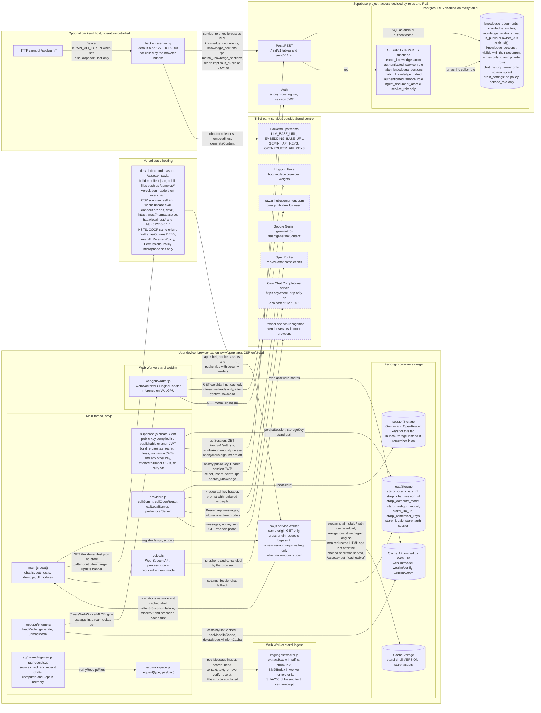
```mermaid
flowchart LR
    subgraph device["User device: browser tab on www.starpi.app, CSP enforced"]
        subgraph mainThread["Main thread, src/js"]
            boot["main.js boot()<br/>chat.js, settings.js, demo.js, UI modules"]
            sbClient["supabase.js createClient<br/>public key compiled in: publishable or anon JWT,<br/>build refuses sb_secret_ keys, non-anon JWTs<br/>and any other key, fetchWithTimeout 12 s, db retry off"]
            provJs["providers.js<br/>callGemini, callOpenRouter,<br/>callLocalServer, probeLocalServer"]
            engineJs["webgpu/engine.js<br/>loadModel, generate, unloadModel"]
            wsJs["rag/workspace.js<br/>request(type, payload)"]
            trustJs["rag/grounding-view.js, rag/receipts.js<br/>source check and receipt drafts,<br/>computed and kept in memory"]
            voiceJs["voice.js<br/>Web Speech API, processLocally<br/>required in client mode"]
        end
        subgraph llmWorker["Web Worker starpi-webllm"]
            mlc["webgpu/worker.js<br/>WebWorkerMLCEngineHandler<br/>inference on WebGPU"]
        end
        subgraph ingestWorker["Web Worker starpi-ingest"]
            ingest["rag/ingest.worker.js<br/>extractText with pdf.js, chunkText,<br/>BM25Index in worker memory only,<br/>SHA-256 of file and text, verify-receipt"]
        end
        sw["sw.js service worker<br/>same-origin GET only,<br/>cross-origin requests bypass it,<br/>a new version skips waiting only<br/>when no window is open"]
        subgraph browserStores["Per-origin browser storage"]
            ls[("localStorage<br/>starpi_local_chats_v1, starpi_chat_session_id,<br/>starpi_compute_mode, starpi_webgpu_model,<br/>starpi_llm_url, starpi_remember_keys,<br/>starpi_locale, starpi-auth session")]
            ss[("sessionStorage<br/>Gemini and OpenRouter keys for this tab,<br/>in localStorage instead if remember is on")]
            swCache[("CacheStorage<br/>starpi-shell-VERSION, starpi-assets")]
            modelCache[("Cache API owned by WebLLM<br/>webllm/model, webllm/config, webllm/wasm")]
        end
    end

    subgraph vercel["Vercel static hosting"]
        host["dist/: index.html, hashed /assets/*, sw.js,<br/>build-manifest.json, public files such as /samples/*<br/>vercel.json headers on every path:<br/>CSP script-src self and wasm-unsafe-eval,<br/>connect-src self, data:, https:, wss://*.supabase.co,<br/>http://localhost:* and http://127.0.0.1:*<br/>HSTS, COOP same-origin, X-Frame-Options DENY,<br/>nosniff, Referrer-Policy,<br/>Permissions-Policy microphone self only"]
    end

    subgraph supabase["Supabase project: access decided by roles and RLS"]
        auth["Auth<br/>anonymous sign-in, session JWT"]
        rest["PostgREST<br/>/rest/v1 tables and /rest/v1/rpc"]
        subgraph pg["Postgres, RLS enabled on every table"]
            tables[("knowledge_documents, knowledge_entities,<br/>knowledge_relations: read is_public or owner_id = auth.uid(),<br/>knowledge_sections: visible with their document,<br/>writes only to own private rows<br/>chat_history: owner only, no anon grant<br/>brain_settings: no policy, service_role only")]
            rpcFns["SECURITY INVOKER functions<br/>search_knowledge: anon, authenticated, service_role<br/>match_knowledge_sections, match_knowledge_hybrid:<br/>authenticated, service_role<br/>ingest_document_atomic: service_role only"]
        end
    end

    subgraph backendHost["Optional backend host, operator-controlled"]
        caller["HTTP client of /api/brain/*"]
        brain["backend/server.py<br/>default bind 127.0.0.1:9200<br/>not called by the browser bundle"]
    end

    subgraph thirdParty["Third-party services outside Starpi control"]
        gemini["Google Gemini<br/>gemini-2.5-flash:generateContent"]
        openrouter["OpenRouter<br/>/api/v1/chat/completions"]
        ownServer["Own Chat Completions server<br/>https anywhere, http only on<br/>localhost or 127.0.0.1"]
        hf["Hugging Face<br/>huggingface.co/mlc-ai weights"]
        ghLibs["raw.githubusercontent.com<br/>binary-mlc-llm-libs wasm"]
        speech["Browser speech recognition<br/>vendor servers in most browsers"]
        backendApis["Backend upstreams<br/>LLM_BASE_URL, EMBEDDING_BASE_URL,<br/>GEMINI_API_KEYS, OPENROUTER_API_KEYS"]
    end

    host -->|"app shell, hashed assets and<br/>public files with security headers"| sw
    sw -->|"navigations network-first, cached shell<br/>after 3.5 s or on failure,<br/>/assets/* and precache cache-first"| boot
    sw -->|"precache at install, / with cache reload,<br/>navigations store / again only as<br/>non-redirected HTML and not after the<br/>cached shell was served, /assets/* put if cacheable()"| swCache
    boot -->|"register /sw.js, scope /"| sw
    boot -->|"GET /build-manifest.json no-store<br/>after controllerchange, update banner"| host
    boot -->|"settings, locale, chat fallback"| ls
    provJs -->|"readSecret"| ss
    sbClient -->|"persistSession, storageKey starpi-auth"| ls
    engineJs -->|"CreateWebWorkerMLCEngine,<br/>messages in, stream deltas out"| mlc
    engineJs -->|"certainlyNotCached, hasModelInCache,<br/>deleteModelAllInfoInCache"| modelCache
    mlc -->|"read and write shards"| modelCache
    mlc -->|"GET weights if not cached,<br/>interactive loads only, after confirmDownload"| hf
    mlc -->|"GET model_lib wasm"| ghLibs
    wsJs -->|"postMessage ingest, search, head,<br/>context, text, remove, verify-receipt,<br/>File structured-cloned"| ingest
    trustJs -->|"verifyReceiptFiles"| wsJs
    sbClient -->|"getSession, GET /auth/v1/settings,<br/>signInAnonymously unless<br/>anonymous sign-ins are off"| auth
    sbClient -->|"apikey public key, Bearer session JWT:<br/>select, insert, delete, rpc search_knowledge"| rest
    rest -->|"SQL as anon or authenticated"| tables
    rest -->|"rpc"| rpcFns
    rpcFns -->|"run as the caller role"| tables
    provJs -->|"x-goog-api-key header,<br/>prompt with retrieved excerpts"| gemini
    provJs -->|"Bearer key, messages,<br/>failover over free models"| openrouter
    provJs -->|"messages, no key sent,<br/>GET /models probe"| ownServer
    voiceJs -->|"microphone audio, handled by the browser"| speech
    caller -->|"Bearer BRAIN_API_TOKEN when set,<br/>else loopback Host only"| brain
    brain -->|"service_role key bypasses RLS:<br/>knowledge_documents, knowledge_sections,<br/>rpc match_knowledge_sections,<br/>reads kept to is_public or no owner"| rest
    brain -->|"chat/completions, embeddings,<br/>generateContent"| backendApis

    classDef external stroke-dasharray: 5 5
    class gemini,openrouter,ownServer,hf,ghLibs,speech,backendApis external
```

Sources: [`README.md`](../README.md), [`src/js/main.js`](../src/js/main.js), [`src/js/supabase.js`](../src/js/supabase.js), [`src/js/providers.js`](../src/js/providers.js), [`src/js/storage.js`](../src/js/storage.js), [`src/js/state.js`](../src/js/state.js), [`src/js/config.js`](../src/js/config.js), [`src/js/i18n/index.js`](../src/js/i18n/index.js), [`src/js/settings.js`](../src/js/settings.js), [`src/js/voice.js`](../src/js/voice.js), [`src/js/demo.js`](../src/js/demo.js), [`src/js/rag/grounding-view.js`](../src/js/rag/grounding-view.js), [`src/js/rag/receipts.js`](../src/js/rag/receipts.js), [`src/js/webgpu/engine.js`](../src/js/webgpu/engine.js), [`src/js/webgpu/worker.js`](../src/js/webgpu/worker.js), [`src/js/rag/workspace.js`](../src/js/rag/workspace.js), [`src/js/rag/ingest.worker.js`](../src/js/rag/ingest.worker.js), [`src/sw.js`](../src/sw.js), [`vercel.json`](../vercel.json), [`scripts/build.mjs`](../scripts/build.mjs), [`scripts/lib/supabase-key.mjs`](../scripts/lib/supabase-key.mjs), [`backend/server.py`](../backend/server.py), [`backend/core/config.py`](../backend/core/config.py), [`backend/core/supabase_client.py`](../backend/core/supabase_client.py), [`backend/core/rag.py`](../backend/core/rag.py), [`backend/supabase/full_schema.sql`](../backend/supabase/full_schema.sql)

### What leaves the device: connection state

boot() awaits connect(), which is safe to call repeatedly because concurrent callers share one attempt. When navigator.onLine is false, connect() marks the connection offline without sending a request. Otherwise ensureSession() reuses a stored session; without one it first reads the public auth settings (GET /auth/v1/settings with the public key) and, when they say anonymous sign-ins are off, returns auth_disabled without sending a sign-in request; when that settings request times out (12 s), it returns the timeout error and skips the sign-in as well, so the attempt does not wait a second time for a project that does not answer; otherwise, also when the settings say nothing about anonymous sign-ins or the request fails in another way, it calls signInAnonymously(). A probe then reads knowledge_documents for the is_public column. The result sets status, signedIn (no authError) and hardened (probe ok), a result that is not offline resets the back-off, and every change reaches the onConnectionChange listeners that main.js registers. Every Supabase request goes through fetchWithTimeout (12 s) with postgrest retries switched off, and run() switches a ready connection to offline as soon as any request fails with a network error or a timeout; it changes only the status, so signedIn and hardened keep their values. scheduleReconnect() repeats connect() on the window online event or after 30 s, doubling up to 5 min. While the status is offline, chat retrieval and knownTitles() send no Supabase request, and chat_history is written and read only when canSyncChats() sees both signedIn and hardened; after run() went offline that can still be true, and a failed insert then keeps the message in localStorage. Deleting the history in settings is the exception: deleteChatHistory() clears the local chats and skips the remote delete only when the status is ready and canSyncChats() is false; while the status is offline or pending it still calls deleteOwnChats(), which sends the delete when a stored session exists, and a failure is reported as a partial delete instead of a success.

<!-- diagram: system-context-egress-connection -->
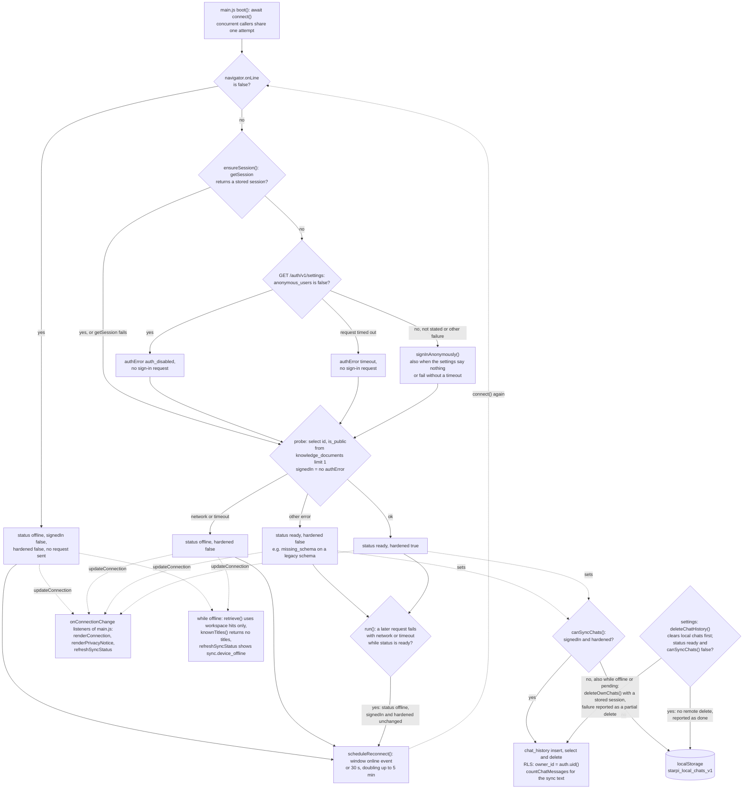
```mermaid
flowchart TD
    boot["main.js boot(): await connect()<br/>concurrent callers share one attempt"]
    onlineQ{"navigator.onLine<br/>is false?"}
    noReq["status offline, signedIn false,<br/>hardened false, no request sent"]
    sess{"ensureSession(): getSession<br/>returns a stored session?"}
    settingsQ{"GET /auth/v1/settings:<br/>anonymous_users is false?"}
    authOff["authError auth_disabled,<br/>no sign-in request"]
    authTimeout["authError timeout,<br/>no sign-in request"]
    signIn["signInAnonymously()<br/>also when the settings say nothing<br/>or fail without a timeout"]
    probe{"probe: select id, is_public<br/>from knowledge_documents limit 1<br/>signedIn = no authError"}
    offline["status offline, hardened false"]
    legacy["status ready, hardened false<br/>e.g. missing_schema on a legacy schema"]
    hardened["status ready, hardened true"]
    retry["scheduleReconnect(): window online event<br/>or 30 s, doubling up to 5 min"]
    boot --> onlineQ
    onlineQ -->|"yes"| noReq
    onlineQ -->|"no"| sess
    sess -->|"yes, or getSession fails"| probe
    sess -->|"no"| settingsQ
    settingsQ -->|"yes"| authOff
    settingsQ -->|"request timed out"| authTimeout
    settingsQ -->|"no, not stated or other failure"| signIn
    authOff --> probe
    authTimeout --> probe
    signIn --> probe
    probe -->|"network or timeout"| offline
    probe -->|"other error"| legacy
    probe -->|"ok"| hardened
    noReq --> retry
    offline --> retry
    retry -.->|"connect() again"| onlineQ

    runQ{"run(): a later request fails<br/>with network or timeout<br/>while status is ready?"}
    legacy --> runQ
    hardened --> runQ
    runQ -->|"yes: status offline,<br/>signedIn and hardened unchanged"| retry

    listeners["onConnectionChange listeners of main.js:<br/>renderConnection, renderPrivacyNotice,<br/>refreshSyncStatus"]
    noReq -.->|"updateConnection"| listeners
    offline -.->|"updateConnection"| listeners
    legacy -.->|"updateConnection"| listeners
    hardened -.->|"updateConnection"| listeners

    offUse["while offline: retrieve() uses workspace hits only,<br/>knownTitles() returns no titles,<br/>refreshSyncStatus shows sync.device_offline"]
    noReq -.-> offUse
    offline -.-> offUse

    syncQ{"canSyncChats():<br/>signedIn and hardened?"}
    chatSb["chat_history insert, select and delete<br/>RLS: owner_id = auth.uid()<br/>countChatMessages for the sync text"]
    chatLs[("localStorage<br/>starpi_local_chats_v1")]
    legacy -.->|"sets"| syncQ
    hardened -.->|"sets"| syncQ
    syncQ -->|"yes"| chatSb
    syncQ -->|"no"| chatLs

    delQ{"settings: deleteChatHistory()<br/>clears local chats first;<br/>status ready and<br/>canSyncChats() false?"}
    delQ -->|"yes: no remote delete,<br/>reported as done"| chatLs
    delQ -->|"no, also while offline or pending:<br/>deleteOwnChats() with a stored session,<br/>failure reported as a partial delete"| chatSb
```

Sources: [`src/js/supabase.js`](../src/js/supabase.js), [`src/js/main.js`](../src/js/main.js), [`src/js/chat.js`](../src/js/chat.js), [`src/js/chat-store.js`](../src/js/chat-store.js), [`src/js/settings.js`](../src/js/settings.js), [`src/js/config.js`](../src/js/config.js), [`backend/supabase/full_schema.sql`](../backend/supabase/full_schema.sql)

### What leaves the device: one chat turn

Workspace search always stays in the ingestion worker. A sample question offered by demo.js (data-scope workspace, so submitChat gets workspaceOnly) and any question while the connection is offline use workspace hits only. Otherwise, in client mode Supabase receives only question-free reads (recentKnowledge(30), ranked in the browser), while council and own-server modes also send the question, cut to 1000 characters, to the search_knowledge RPC and fall back to recentKnowledge(30) when it returns no rows or fails. Council and own-server modes then send the question with the retrieved excerpts, workspace excerpts included, to the provider or server; OpenRouter and the own server also get shareableHistory(), the last 4 conversation turns not marked localOnly, and Gemini gets no history. Each answer path has its own guards (provider keys, OpenRouter stopping early on 401 or 403, the WebGPU probe and the WebLLM cache checks before the quota check and the download confirmation, normalizeServerUrl), and every failure or empty answer ends in the extractive synthesizeAnswer, whose knownTitles() reads document titles only. When excerpts were used, the source check and the receipt draft are computed on the device. Both turns are marked localOnly in the conversation for client mode, a used workspace hit, an attached file, or an extractive synthesizer answer that contains the name of a file in the workspace (for example a greeting or document list that names the on-device files); that last case also keeps the stored answer local-only, while its question has already been stored by the retrieval rule. The question is stored only after retrieval (or by the catch if the turn throws first). A message stays in localStorage with metadata.local_only set to its local-only flag when it is local-only or when sync is not possible, and without the flag when the chat_history insert fails; loadCurrentSession() reads local rows without the flag back as local-only, and restoreHistory() carries the flag into the conversation.

<!-- diagram: system-context-egress-guards -->

```mermaid
flowchart TD
    submit["submitChat(): input cut to 8000 chars,<br/>waits for a file still being read,<br/>mode = getMode()"]
    wsSearch["retrieveWorkspace: searchWorkspace<br/>in starpi-ingest, an attached file's<br/>chunks first, stays on the device"]
    scopeQ{"workspaceOnly:<br/>a demo sample question?"}
    offQ{"getConnection().status<br/>is offline?"}
    wsOnly["workspace hits only,<br/>no Supabase request"]
    modeR{"mode is client?"}
    recent["recentKnowledge(30)<br/>no user text sent,<br/>rankHitsLocally in the browser"]
    fts["rpc search_knowledge<br/>query_text sliced to 1000 chars,<br/>match_count 6"]
    ftsQ{"rows returned?"}
    submit --> wsSearch --> scopeQ
    scopeQ -->|"yes"| wsOnly
    scopeQ -->|"no"| offQ
    offQ -->|"yes"| wsOnly
    offQ -->|"no"| modeR
    modeR -->|"yes"| recent
    modeR -->|"no: council or local"| fts
    fts --> ftsQ
    ftsQ -->|"no rows or error"| recent
    qStore["no hits used for a greeting without a file<br/>storeQuestion(usesWorkspace),<br/>usesWorkspace = a used workspace hit"]
    ftsQ -->|"yes"| qStore
    recent -->|"ranked hits, or workspace<br/>hits only on error"| qStore
    wsOnly --> qStore
    qStore --> modeA

    modeA{"answer mode"}
    gemQ{"hasGeminiKey?"}
    gemCall["callGemini to Google, 20 s<br/>key in x-goog-api-key header,<br/>system prompt with excerpts<br/>and the question, no history"]
    orQ{"hasOpenRouterKey?"}
    orCall["callOpenRouter, Bearer key, 20 s per model<br/>system prompt with excerpts,<br/>shareableHistory, question,<br/>up to 3 free models, stops early on 401 or 403"]
    modeA -->|"council"| gemQ
    gemQ -->|"yes"| gemCall
    gemQ -->|"no"| orQ
    gemCall -->|"HTTP error, timeout or empty answer"| orQ
    orQ -->|"yes"| orCall

    readyQ{"engine.isReady()?"}
    loadQ{"startLocalEngine interactive, loadModel:<br/>WebGPU adapter? model cached per<br/>certainlyNotCached and hasModelInCache?"}
    dl["checkQuota, confirmDownload dialog,<br/>storage.persist, then weights from<br/>Hugging Face and wasm from GitHub"]
    gen["engine.generate in starpi-webllm<br/>prompt and last 4 turns<br/>never leave the device"]
    modeA -->|"client"| readyQ
    readyQ -->|"yes"| gen
    readyQ -->|"no"| loadQ
    loadQ -->|"cached"| gen
    loadQ -->|"not or partly cached"| dl
    dl -->|"accepted"| gen

    urlQ{"normalizeServerUrl:<br/>https, or http on localhost or<br/>127.0.0.1, no credentials in URL?"}
    srv["callLocalServer, no key, 90 s<br/>GET base/models, 4 s, until a model id is known,<br/>POST base/chat/completions: system prompt<br/>with excerpts, shareableHistory, question"]
    modeA -->|"local"| urlQ
    urlQ -->|"valid"| srv

    synth["knownTitles(): listDocuments select,<br/>no question text, cached 60 s,<br/>none while offline,<br/>then synthesizeAnswer, extractive quotes"]
    orQ -->|"no key"| synth
    orCall -->|"all attempts failed"| synth
    loadQ -->|"unsupported, no-adapter<br/>or other load error"| synth
    dl -->|"declined, quota, code-download<br/>or network error"| synth
    gen -->|"error or empty text"| synth
    urlQ -->|"ProviderError"| synth
    srv -->|"HTTP error, timeout or empty"| synth

    check["when excerpts were used: applyGrounding<br/>source check and storeReceiptDraft<br/>on this device, receipt JSON saved<br/>only when the user downloads it"]
    gemCall -->|"answer"| check
    orCall -->|"answer"| check
    gen -->|"answer"| check
    srv -->|"answer"| check
    synth -->|"answer"| check
    turns["conversation.push: both turns localOnly<br/>for client mode, a used workspace hit, a file<br/>or a synthesizer answer naming a workspace file,<br/>question cut to 4000 chars"]
    check --> turns
    turns -.->|"shareableHistory drops localOnly<br/>turns, keeps the last 4"| orCall
    turns -.->|"shareableHistory"| srv

    persistQ{"persistMessage localOnly?<br/>question: client mode, a file<br/>or a used workspace hit<br/>answer: client mode, a used<br/>workspace hit or a synthesizer<br/>answer naming a workspace file"}
    syncQ{"canSyncChats():<br/>signedIn and hardened?"}
    lsStore[("localStorage starpi_local_chats_v1<br/>last 200 messages of 10 sessions")]
    insert["insert into chat_history<br/>RLS: owner_id = auth.uid()<br/>then refreshSyncStatus counts<br/>chat_history rows for the sync text"]
    qStore -->|"question"| persistQ
    submit -.->|"question via storeQuestion(false)<br/>in the catch if the turn throws first"| persistQ
    turns -->|"answer"| persistQ
    persistQ -->|"yes: local_only true"| lsStore
    persistQ -->|"no"| syncQ
    syncQ -->|"no: local_only false"| lsStore
    syncQ -->|"yes"| insert
    insert -->|"error: kept without the flag,<br/>read back as local-only"| lsStore
```

Sources: [`src/js/chat.js`](../src/js/chat.js), [`src/js/chat-store.js`](../src/js/chat-store.js), [`src/js/supabase.js`](../src/js/supabase.js), [`src/js/providers.js`](../src/js/providers.js), [`src/js/engine-ui.js`](../src/js/engine-ui.js), [`src/js/webgpu/engine.js`](../src/js/webgpu/engine.js), [`src/js/rag/workspace.js`](../src/js/rag/workspace.js), [`src/js/rag/grounding-view.js`](../src/js/rag/grounding-view.js), [`src/js/rag/receipts.js`](../src/js/rag/receipts.js), [`src/js/demo.js`](../src/js/demo.js), [`src/js/synthesizer.js`](../src/js/synthesizer.js), [`src/js/config.js`](../src/js/config.js), [`backend/supabase/full_schema.sql`](../backend/supabase/full_schema.sql)

### Backend trust boundary: server.py request guards

run_server refuses to bind to a non-loopback address unless BRAIN_API_TOKEN is set and exits with SystemExit(2). _route then checks every request in a fixed order: without a token it rejects requests carrying reverse-proxy headers (fail closed), it rejects any Origin not in BRAIN_ALLOWED_ORIGINS, and without a token it rejects non-loopback Host headers (DNS rebinding guard); only then does it resolve the route, answer OPTIONS, check the method and, for /api/brain/*, compare the Bearer token with hmac.compare_digest. Request bodies are bounded by _read_json_object and _string_field. The handlers use Supabase with the service_role key, which bypasses RLS, so supabase_client.py filters every read with VISIBLE_ROWS to rows that are public or have no owner (rows the backend wrote itself; they are not public by default): the document list selects only such rows, and vector matches are kept only when their document passes the same filter, so private rows of browser sessions (owner set, not public) are not returned. When Supabase is not configured or the remote call fails, the handlers fall back to an in-memory store.

<!-- diagram: system-context-backend-guards -->
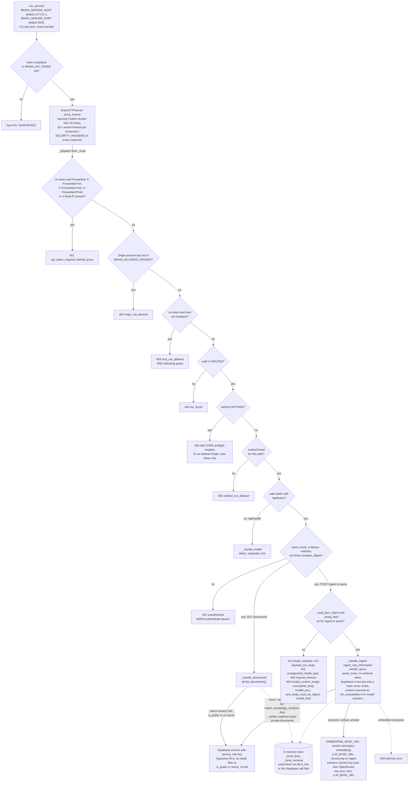
```mermaid
flowchart TD
    start["run_server()<br/>BRAIN_SERVER_HOST default 127.0.0.1,<br/>BRAIN_SERVER_PORT default 9200,<br/>CLI port and --host override"]
    bindQ{"host is loopback<br/>or BRAIN_API_TOKEN set?"}
    refuse["log error, SystemExit(2)"]
    listen["BrainHTTPServer serve_forever<br/>warning if token shorter than 32 chars,<br/>30 s socket timeout per connection,<br/>SECURITY_HEADERS on every response"]
    start --> bindQ
    bindQ -->|"no"| refuse
    bindQ -->|"yes"| listen

    proxyQ{"no token and Forwarded, X-Forwarded-For,<br/>X-Forwarded-Host, X-Forwarded-Proto<br/>or X-Real-IP present?"}
    r401p["401 api_token_required_behind_proxy"]
    originQ{"Origin present and not in<br/>BRAIN_ALLOWED_ORIGINS?"}
    r403o["403 origin_not_allowed"]
    hostQ{"no token and Host<br/>not loopback?"}
    r403h["403 host_not_allowed<br/>DNS rebinding guard"]
    listen -->|"_dispatch then _route"| proxyQ
    proxyQ -->|"yes"| r401p
    proxyQ -->|"no"| originQ
    originQ -->|"yes"| r403o
    originQ -->|"no"| hostQ
    hostQ -->|"yes"| r403h
    hostQ -->|"no"| routeQ

    routeQ{"path in ROUTES?"}
    r404["404 not_found"]
    optQ{"method OPTIONS?"}
    pre["204 with CORS preflight headers<br/>for an allowed Origin, else Allow only"]
    methQ{"method listed<br/>for this path?"}
    r405["405 method_not_allowed"]
    protQ{"path starts with<br/>/api/brain/?"}
    health["_handle_health<br/>status, supabase_live"]
    routeQ -->|"no"| r404
    routeQ -->|"yes"| optQ
    optQ -->|"yes"| pre
    optQ -->|"no"| methQ
    methQ -->|"no"| r405
    methQ -->|"yes"| protQ
    protQ -->|"no: /api/health"| health
    protQ -->|"yes"| bearerQ

    bearerQ{"token unset, or Bearer matches<br/>via hmac.compare_digest?"}
    r401["401 unauthorized<br/>WWW-Authenticate Bearer"]
    docs["_handle_documents<br/>db.list_documents()"]
    body{"_read_json_object and _string_field<br/>ok for ingest or query?"}
    r4xx["411 length_required, 413 payload_too_large,<br/>415 unsupported_media_type, 408 request_timeout,<br/>400 invalid_content_length, incomplete_body,<br/>invalid_json, json_body_must_be_object, invalid_field"]
    handlers["_handle_ingest: ingest_raw_information<br/>_handle_query: query_brain, no retrieval when<br/>Supabase is live but only a hash vector exists,<br/>context returned as llm_unavailable if no model answers"]
    bearerQ -->|"no"| r401
    bearerQ -->|"yes: GET documents"| docs
    bearerQ -->|"yes: POST ingest or query"| body
    body -->|"no"| r4xx
    body -->|"yes"| handlers

    supa["Supabase /rest/v1 with service_role key<br/>bypasses RLS, so reads filter to<br/>is_public or owner_id null"]
    mem[("in-memory store<br/>_local_docs, _local_sections<br/>used when not db.is_live<br/>or the Supabase call fails")]
    upstream["EMBEDDING_BASE_URL: section and query embeddings<br/>LLM_BASE_URL: structuring on ingest<br/>answers: Gemini key pool, then OpenRouter<br/>key pool, then LLM_BASE_URL"]
    docs -->|"select newest 200,<br/>is_public or no owner"| supa
    handlers -->|"insert, rollback delete,<br/>rpc match_knowledge_sections, then<br/>_visible_matches drops private documents"| supa
    handlers -->|"structure, embed, answer"| upstream
    docs -.-> mem
    handlers -.-> mem
    r500["500 internal_error"]
    handlers -.->|"unhandled exception"| r500
```

Sources: [`backend/server.py`](../backend/server.py), [`backend/core/config.py`](../backend/core/config.py), [`backend/core/supabase_client.py`](../backend/core/supabase_client.py), [`backend/core/rag.py`](../backend/core/rag.py), [`backend/core/ingestion_pipeline.py`](../backend/core/ingestion_pipeline.py), [`backend/core/structurer.py`](../backend/core/structurer.py), [`backend/core/embeddings.py`](../backend/core/embeddings.py)

### Frontend import graph (1 of 4): main.js and its application imports

main.js is the only main-thread entry point and has 19 imports: the 14 application modules drawn here (with the names it imports from each) and 5 infrastructure modules (dom, i18n, icons, state, supabase) drawn in frontend-modules-infrastructure. Application modules are every module reachable from main.js except the 10 infrastructure modules drawn in frontend-modules-infrastructure; there are 31 of them, including the five core/ modules and rag/bm25.js and rag/chunker.js, which core/ reuses from the ingestion worker. The 81 imports between them are split across four diagrams: the 14 made by main.js here, the 20 made by settings.js, graph.js, ingest.js, bench/bench-ui.js and voice.js in frontend-modules-views, the 23 made by chat.js, engine-ui.js, messages.js, rag/citations.js and webgpu/engine.js in frontend-modules-chat, and the 24 made by demo.js, synthesizer.js, retrieval.js, rag/grounding-view.js, rag/receipts.js and the core/ modules in frontend-modules-trust. An import and a re-export of the same module count as one edge. The import graph has no cycles.

<!-- diagram: frontend-modules-overview -->
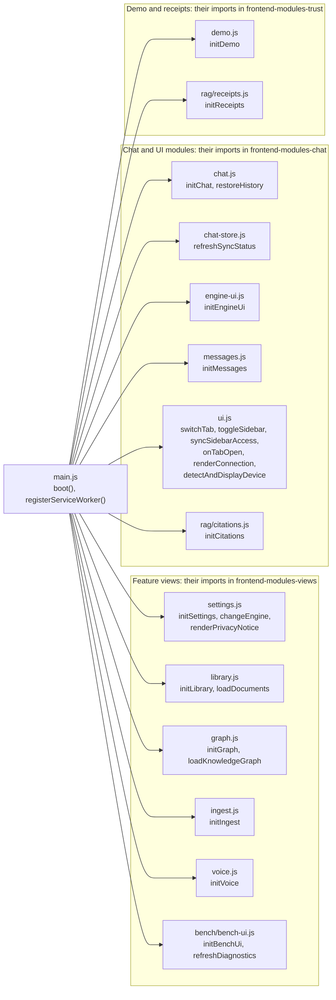
```mermaid
flowchart LR
    main["main.js<br/>boot(), registerServiceWorker()"]

    subgraph views["Feature views: their imports in frontend-modules-views"]
        settings["settings.js<br/>initSettings, changeEngine,<br/>renderPrivacyNotice"]
        library["library.js<br/>initLibrary, loadDocuments"]
        graphview["graph.js<br/>initGraph, loadKnowledgeGraph"]
        ingest["ingest.js<br/>initIngest"]
        voice["voice.js<br/>initVoice"]
        benchui["bench/bench-ui.js<br/>initBenchUi, refreshDiagnostics"]
    end

    subgraph core["Chat and UI modules: their imports in frontend-modules-chat"]
        chat["chat.js<br/>initChat, restoreHistory"]
        chatstore["chat-store.js<br/>refreshSyncStatus"]
        engineui["engine-ui.js<br/>initEngineUi"]
        messages["messages.js<br/>initMessages"]
        ui["ui.js<br/>switchTab, toggleSidebar, syncSidebarAccess,<br/>onTabOpen, renderConnection,<br/>detectAndDisplayDevice"]
        citations["rag/citations.js<br/>initCitations"]
    end

    subgraph trust["Demo and receipts: their imports in frontend-modules-trust"]
        demo["demo.js<br/>initDemo"]
        receipts["rag/receipts.js<br/>initReceipts"]
    end

    main --> settings
    main --> library
    main --> graphview
    main --> ingest
    main --> voice
    main --> benchui
    main --> chat
    main --> chatstore
    main --> engineui
    main --> messages
    main --> ui
    main --> citations
    main --> demo
    main --> receipts
```

Sources: [`src/js/main.js`](../src/js/main.js)

### Frontend import graph (2 of 4): imports made by the feature views

Every import between application modules made by settings.js, graph.js, ingest.js, bench/bench-ui.js and voice.js (20 of the 81); library.js imports only infrastructure modules (dialog, dom, i18n, render, supabase). Views that call into chat.js use narrow imports (graph.js submitChat, ingest.js invalidateKnownTitles, bench-ui.js isChatBusy, settings.js isChatBusy and resetConversation), and chat.js imports no view back. settings.js deletes the chat history through deleteChatHistory in chat-store.js and refuses to start while isChatBusy() reports an answer still being written (settings.delete_history_busy), graph.js and ingest.js reuse describeDataError from library.js, settings.js and bench-ui.js drive the on-device engine both through engine-ui.js and directly through webgpu/engine.js, and voice.js reports speech errors with appendNotice from messages.js.

<!-- diagram: frontend-modules-views -->
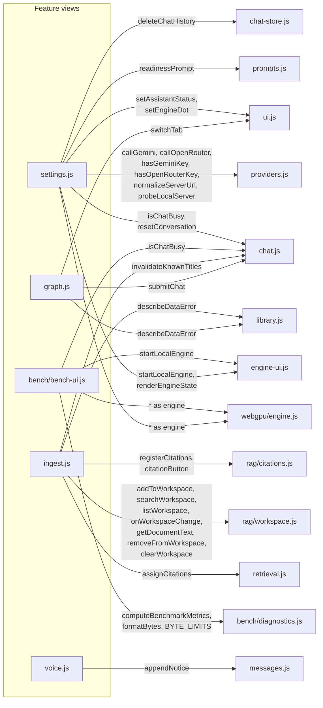
```mermaid
flowchart LR
    subgraph views["Feature views"]
        settings["settings.js"]
        graphview["graph.js"]
        ingest["ingest.js"]
        benchui["bench/bench-ui.js"]
        voice["voice.js"]
    end

    chat["chat.js"]
    chatstore["chat-store.js"]
    library["library.js"]
    engineui["engine-ui.js"]
    ui["ui.js"]
    messages["messages.js"]
    prompts["prompts.js"]
    providers["providers.js"]
    engine["webgpu/engine.js"]
    diag["bench/diagnostics.js"]
    citations["rag/citations.js"]
    workspace["rag/workspace.js"]
    retrieval["retrieval.js"]

    graphview -->|"submitChat"| chat
    ingest -->|"invalidateKnownTitles"| chat
    benchui -->|"isChatBusy"| chat
    settings -->|"isChatBusy,<br/>resetConversation"| chat
    settings -->|"deleteChatHistory"| chatstore
    graphview -->|"describeDataError"| library
    ingest -->|"describeDataError"| library
    graphview -->|"switchTab"| ui
    settings -->|"setAssistantStatus,<br/>setEngineDot"| ui
    settings -->|"startLocalEngine,<br/>renderEngineState"| engineui
    benchui -->|"startLocalEngine"| engineui
    settings -->|"* as engine"| engine
    benchui -->|"* as engine"| engine
    settings -->|"readinessPrompt"| prompts
    settings -->|"callGemini, callOpenRouter,<br/>hasGeminiKey, hasOpenRouterKey,<br/>normalizeServerUrl, probeLocalServer"| providers
    benchui -->|"computeBenchmarkMetrics,<br/>formatBytes, BYTE_LIMITS"| diag
    ingest -->|"registerCitations,<br/>citationButton"| citations
    ingest -->|"addToWorkspace, searchWorkspace,<br/>listWorkspace, onWorkspaceChange,<br/>getDocumentText, removeFromWorkspace,<br/>clearWorkspace"| workspace
    ingest -->|"assignCitations"| retrieval
    voice -->|"appendNotice"| messages
```

Sources: [`src/js/settings.js`](../src/js/settings.js), [`src/js/graph.js`](../src/js/graph.js), [`src/js/ingest.js`](../src/js/ingest.js), [`src/js/bench/bench-ui.js`](../src/js/bench/bench-ui.js), [`src/js/voice.js`](../src/js/voice.js), [`src/js/library.js`](../src/js/library.js)

### Frontend import graph (3 of 4): chat pipeline, workspace client and WebGPU

The 23 imports between application modules made by chat.js, engine-ui.js, messages.js, rag/citations.js and webgpu/engine.js. chat.js is the hub: 15 of its 23 imports are drawn here, and the other 8 go to infrastructure (config, dom, i18n, icons, render, signals, state, supabase). chat-store.js, prompts.js, providers.js, ui.js, rag/workspace.js and webgpu/models.js import no other application module. After an answer is rendered, chat.js runs the source check through applyGrounding in rag/grounding-view.js, with contextCoverage from core/grounding.js telling which part of each excerpt reached the model, and keeps a receipt draft through rag/receipts.js, passing for a partly delivered excerpt how many of its leading characters reached the model (deliveredChars); the imports of those modules, and of synthesizer.js and retrieval.js, are in frontend-modules-trust. rag/citations.js takes CITATION_PATTERN and citationLabel from retrieval.js, which re-exports them from core/labels.js, and reads source text back from the workspace worker through getChunkContext.

<!-- diagram: frontend-modules-chat -->
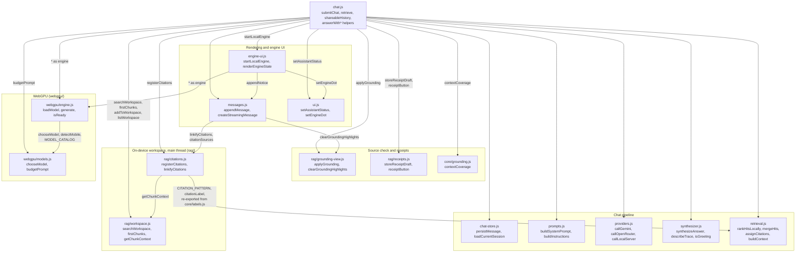
```mermaid
flowchart TD
    chat["chat.js<br/>submitChat, retrieve, shareableHistory,<br/>answerWith* helpers"]

    subgraph pipeline["Chat pipeline"]
        chatstore["chat-store.js<br/>persistMessage, loadCurrentSession"]
        prompts["prompts.js<br/>buildSystemPrompt, buildInstructions"]
        providers["providers.js<br/>callGemini, callOpenRouter, callLocalServer"]
        synth["synthesizer.js<br/>synthesizeAnswer, describeTrace, isGreeting"]
        retrieval["retrieval.js<br/>rankHitsLocally, mergeHits,<br/>assignCitations, buildContext"]
    end

    subgraph rendering["Rendering and engine UI"]
        engineui["engine-ui.js<br/>startLocalEngine, renderEngineState"]
        messages["messages.js<br/>appendMessage, createStreamingMessage"]
        ui["ui.js<br/>setAssistantStatus, setEngineDot"]
    end

    subgraph trust["Source check and receipts"]
        groundview["rag/grounding-view.js<br/>applyGrounding, clearGroundingHighlights"]
        receipts["rag/receipts.js<br/>storeReceiptDraft, receiptButton"]
        coregrounding["core/grounding.js<br/>contextCoverage"]
    end

    subgraph ragmain["On-device workspace, main thread (rag/)"]
        citations["rag/citations.js<br/>registerCitations, linkifyCitations"]
        workspace["rag/workspace.js<br/>searchWorkspace, firstChunks, getChunkContext"]
    end

    subgraph gpu["WebGPU (webgpu/)"]
        engine["webgpu/engine.js<br/>loadModel, generate, isReady"]
        models["webgpu/models.js<br/>chooseModel, budgetPrompt"]
    end

    chat --> chatstore
    chat --> prompts
    chat --> providers
    chat --> synth
    chat --> retrieval
    chat -->|"startLocalEngine"| engineui
    chat --> messages
    chat -->|"setAssistantStatus"| ui
    chat -->|"applyGrounding"| groundview
    chat -->|"storeReceiptDraft,<br/>receiptButton"| receipts
    chat -->|"contextCoverage"| coregrounding
    chat -->|"registerCitations"| citations
    chat -->|"searchWorkspace, firstChunks,<br/>addToWorkspace, listWorkspace"| workspace
    chat -->|"* as engine"| engine
    chat -->|"budgetPrompt"| models

    engineui -->|"appendNotice"| messages
    engineui -->|"setEngineDot"| ui
    engineui -->|"* as engine"| engine

    messages -->|"linkifyCitations,<br/>citationSources"| citations
    messages -->|"clearGroundingHighlights"| groundview
    citations -->|"CITATION_PATTERN, citationLabel,<br/>re-exported from core/labels.js"| retrieval
    citations -->|"getChunkContext"| workspace
    engine -->|"chooseModel, detectMobile,<br/>MODEL_CATALOG"| models
```

Sources: [`src/js/chat.js`](../src/js/chat.js), [`src/js/engine-ui.js`](../src/js/engine-ui.js), [`src/js/messages.js`](../src/js/messages.js), [`src/js/rag/citations.js`](../src/js/rag/citations.js), [`src/js/webgpu/engine.js`](../src/js/webgpu/engine.js), [`src/js/chat-store.js`](../src/js/chat-store.js), [`src/js/prompts.js`](../src/js/prompts.js), [`src/js/providers.js`](../src/js/providers.js), [`src/js/synthesizer.js`](../src/js/synthesizer.js), [`src/js/retrieval.js`](../src/js/retrieval.js), [`src/js/ui.js`](../src/js/ui.js), [`src/js/rag/grounding-view.js`](../src/js/rag/grounding-view.js), [`src/js/rag/receipts.js`](../src/js/rag/receipts.js), [`src/js/core/grounding.js`](../src/js/core/grounding.js), [`src/js/rag/workspace.js`](../src/js/rag/workspace.js), [`src/js/webgpu/models.js`](../src/js/webgpu/models.js)

### Frontend import graph (4 of 4): demo, source check, receipts and core/

The remaining 24 of the 81 imports: every import made by demo.js, synthesizer.js, retrieval.js, rag/grounding-view.js, rag/receipts.js and the core/ modules. The five core/ modules import no infrastructure module and use no DOM, so the same code runs in the page, in the ingestion worker and in Node: core/labels.js holds the citation label format that retrieval.js re-exports, core/sentences.js the sentence splitting that synthesizer.js re-exports and safeSlice, with which retrieval.js shortens excerpts and core/grounding.js the passage it quotes in a fact_context reason without splitting a surrogate pair, core/facts.js and core/grounding.js the source check, and core/receipt.js builds and verifies starpi.receipt/v1 receipts. core/facts.js reuses tokenize and the stopword lists of rag/bm25.js, core/grounding.js reuses its English stopword list, and core/receipt.js reuses chunkText and CHUNKER from rag/chunker.js, so both worker modules are part of the main-thread graph too. Outside this graph, rag/ingest.worker.js imports core/receipt.js to hash files and verify receipts, scripts/verify-receipt.mjs imports core/receipt.js and rag/parser.js in Node, and packages/core/src/index.js re-exports the core/ modules, rag/parser.js, rag/chunker.js and rag/bm25.js as the @starpi/core package. demo.js fetches the sample files from /samples/ into the workspace and shows a fixed answer with one deliberate error through applyGrounding, in the language of the sample set that is complete in the workspace (the interface language first, and also when neither set is complete).

<!-- diagram: frontend-modules-trust -->
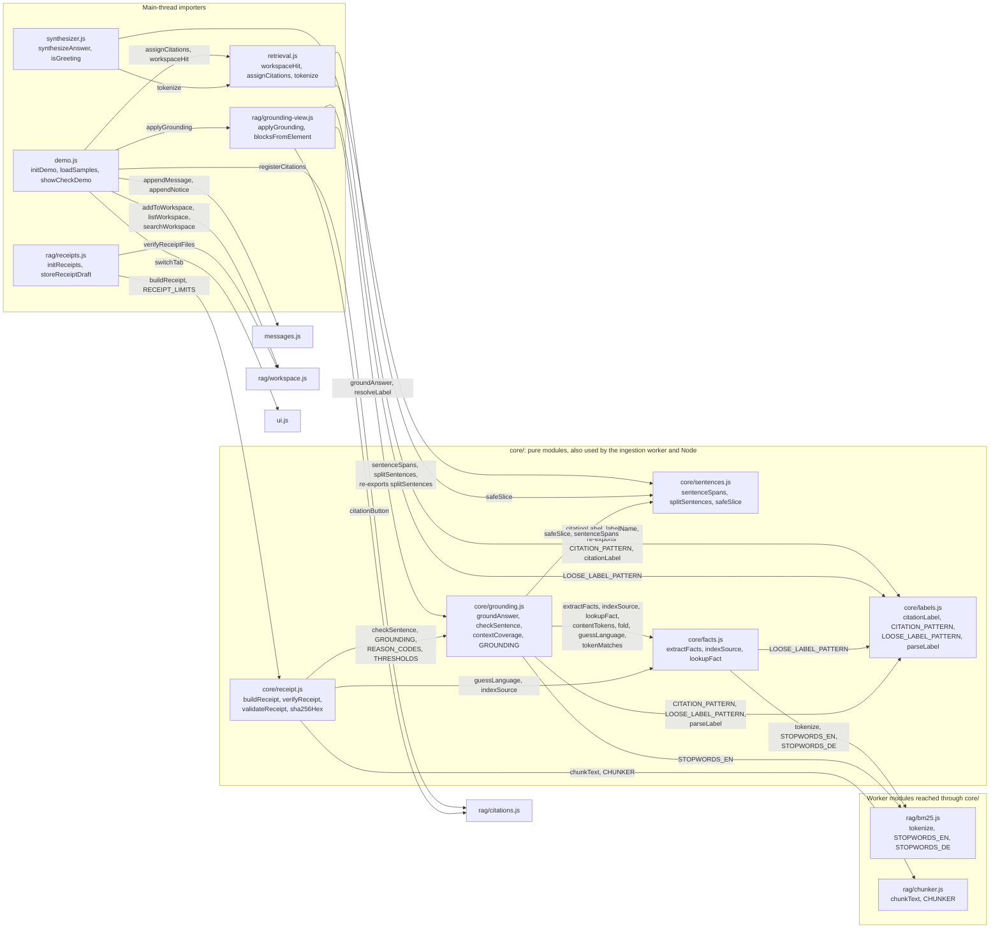
```mermaid
flowchart LR
    subgraph users["Main-thread importers"]
        demo["demo.js<br/>initDemo, loadSamples, showCheckDemo"]
        synth["synthesizer.js<br/>synthesizeAnswer, isGreeting"]
        retrieval["retrieval.js<br/>workspaceHit, assignCitations, tokenize"]
        groundview["rag/grounding-view.js<br/>applyGrounding, blocksFromElement"]
        receipts["rag/receipts.js<br/>initReceipts, storeReceiptDraft"]
    end

    messages["messages.js"]
    citations["rag/citations.js"]
    workspace["rag/workspace.js"]
    ui["ui.js"]

    subgraph core["core/: pure modules, also used by the ingestion worker and Node"]
        labels["core/labels.js<br/>citationLabel, CITATION_PATTERN,<br/>LOOSE_LABEL_PATTERN, parseLabel"]
        sentences["core/sentences.js<br/>sentenceSpans, splitSentences, safeSlice"]
        facts["core/facts.js<br/>extractFacts, indexSource, lookupFact"]
        grounding["core/grounding.js<br/>groundAnswer, checkSentence,<br/>contextCoverage, GROUNDING"]
        receipt["core/receipt.js<br/>buildReceipt, verifyReceipt,<br/>validateReceipt, sha256Hex"]
    end

    subgraph ragw["Worker modules reached through core/"]
        bm25["rag/bm25.js<br/>tokenize, STOPWORDS_EN, STOPWORDS_DE"]
        chunker["rag/chunker.js<br/>chunkText, CHUNKER"]
    end

    demo -->|"appendMessage, appendNotice"| messages
    demo -->|"registerCitations"| citations
    demo -->|"applyGrounding"| groundview
    demo -->|"addToWorkspace, listWorkspace,<br/>searchWorkspace"| workspace
    demo -->|"assignCitations, workspaceHit"| retrieval
    demo -->|"switchTab"| ui
    synth -->|"tokenize"| retrieval
    synth -->|"sentenceSpans, splitSentences,<br/>re-exports splitSentences"| sentences
    retrieval -->|"citationLabel, labelName,<br/>re-exports CITATION_PATTERN, citationLabel"| labels
    retrieval -->|"safeSlice"| sentences
    groundview -->|"groundAnswer, resolveLabel"| grounding
    groundview -->|"LOOSE_LABEL_PATTERN"| labels
    groundview -->|"citationButton"| citations
    receipts -->|"buildReceipt, RECEIPT_LIMITS"| receipt
    receipts -->|"verifyReceiptFiles"| workspace
    facts -->|"tokenize, STOPWORDS_EN,<br/>STOPWORDS_DE"| bm25
    facts -->|"LOOSE_LABEL_PATTERN"| labels
    grounding -->|"extractFacts, indexSource, lookupFact,<br/>contentTokens, fold, guessLanguage,<br/>tokenMatches"| facts
    grounding -->|"STOPWORDS_EN"| bm25
    grounding -->|"CITATION_PATTERN, LOOSE_LABEL_PATTERN,<br/>parseLabel"| labels
    grounding -->|"safeSlice, sentenceSpans"| sentences
    receipt -->|"chunkText, CHUNKER"| chunker
    receipt -->|"guessLanguage, indexSource"| facts
    receipt -->|"checkSentence, GROUNDING,<br/>REASON_CODES, THRESHOLDS"| grounding
```

Sources: [`src/js/demo.js`](../src/js/demo.js), [`src/js/synthesizer.js`](../src/js/synthesizer.js), [`src/js/retrieval.js`](../src/js/retrieval.js), [`src/js/rag/grounding-view.js`](../src/js/rag/grounding-view.js), [`src/js/rag/receipts.js`](../src/js/rag/receipts.js), [`src/js/core/labels.js`](../src/js/core/labels.js), [`src/js/core/sentences.js`](../src/js/core/sentences.js), [`src/js/core/facts.js`](../src/js/core/facts.js), [`src/js/core/grounding.js`](../src/js/core/grounding.js), [`src/js/core/receipt.js`](../src/js/core/receipt.js), [`src/js/rag/bm25.js`](../src/js/rag/bm25.js), [`src/js/rag/chunker.js`](../src/js/rag/chunker.js), [`src/js/rag/ingest.worker.js`](../src/js/rag/ingest.worker.js), [`scripts/verify-receipt.mjs`](../scripts/verify-receipt.mjs), [`packages/core/src/index.js`](../packages/core/src/index.js)

### Shared infrastructure modules, their importers and npm packages

Every import of config.js (9 importers), supabase.js (7), state.js (5), storage.js (4) and signals.js (3) is drawn. The most widely imported modules, i18n/index.js (19 importers), dom.js (16), icons.js (12) and render.js (8), show their importer count in the label instead of individual edges, and dialog.js, which gives the citation, document, entity and receipt dialogs their focus handling, names its 4 importers in its label. config.js, signals.js and storage.js import nothing; config.js takes APP_VERSION and the Supabase URL and key from build-time defines, state.js reaches into webgpu/models.js for normalizePreference, and supabase.js passes a fetch wrapped with withTimeoutSignal to createClient. The main thread's static npm dependencies (lucide, dompurify, marked, @supabase/supabase-js) come in only through icons.js, render.js and supabase.js, and i18n/index.js bundles both locale JSON files via import attributes. JSDoc typedef imports are not counted.

<!-- diagram: frontend-modules-infrastructure -->
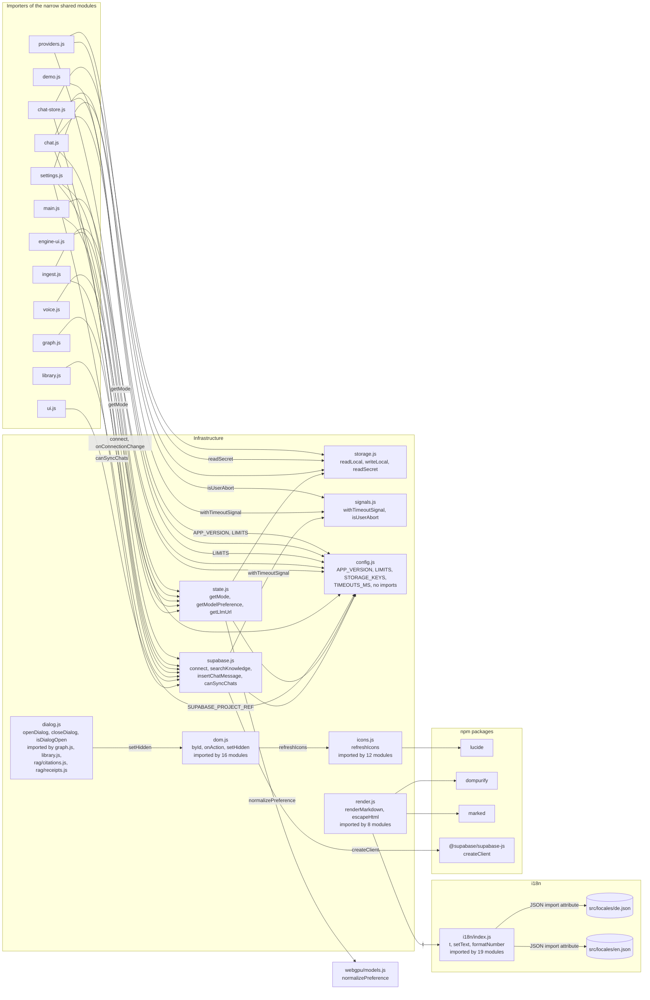
```mermaid
flowchart LR
    subgraph importers["Importers of the narrow shared modules"]
        main["main.js"]
        chat["chat.js"]
        chatstore["chat-store.js"]
        demo["demo.js"]
        graphview["graph.js"]
        ingest["ingest.js"]
        library["library.js"]
        providers["providers.js"]
        settings["settings.js"]
        engineui["engine-ui.js"]
        ui["ui.js"]
        voice["voice.js"]
    end

    subgraph infra["Infrastructure"]
        state["state.js<br/>getMode, getModelPreference, getLlmUrl"]
        supabase["supabase.js<br/>connect, searchKnowledge,<br/>insertChatMessage, canSyncChats"]
        storage["storage.js<br/>readLocal, writeLocal, readSecret"]
        signals["signals.js<br/>withTimeoutSignal, isUserAbort"]
        config["config.js<br/>APP_VERSION, LIMITS, STORAGE_KEYS,<br/>TIMEOUTS_MS, no imports"]
        dom["dom.js<br/>byId, onAction, setHidden<br/>imported by 16 modules"]
        dialog["dialog.js<br/>openDialog, closeDialog, isDialogOpen<br/>imported by graph.js, library.js,<br/>rag/citations.js, rag/receipts.js"]
        icons["icons.js<br/>refreshIcons<br/>imported by 12 modules"]
        render["render.js<br/>renderMarkdown, escapeHtml<br/>imported by 8 modules"]
    end

    subgraph i18ngrp["i18n"]
        i18n["i18n/index.js<br/>t, setText, formatNumber<br/>imported by 19 modules"]
        de[("src/locales/de.json")]
        en[("src/locales/en.json")]
    end

    models["webgpu/models.js<br/>normalizePreference"]

    subgraph pkgs["npm packages"]
        lucide["lucide"]
        dompurify["dompurify"]
        marked["marked"]
        sbjs["@supabase/supabase-js<br/>createClient"]
    end

    main -->|"connect, onConnectionChange"| supabase
    main -->|"getMode"| state
    chat --> supabase
    chat -->|"isUserAbort"| signals
    chat --> state
    chat -->|"APP_VERSION, LIMITS"| config
    chatstore --> supabase
    chatstore --> storage
    chatstore --> config
    demo -->|"LIMITS"| config
    graphview --> supabase
    ingest --> supabase
    ingest --> config
    library --> supabase
    providers -->|"readSecret"| storage
    providers -->|"withTimeoutSignal"| signals
    providers --> config
    settings -->|"canSyncChats"| supabase
    settings --> storage
    settings --> state
    settings --> config
    engineui --> state
    voice -->|"getMode"| state
    ui -->|"SUPABASE_PROJECT_REF"| config

    state --> config
    state --> storage
    state -->|"normalizePreference"| models
    supabase --> config
    supabase -->|"withTimeoutSignal"| signals
    supabase -->|"createClient"| sbjs

    dom -->|"refreshIcons"| icons
    dialog -->|"setHidden"| dom
    icons --> lucide
    render -->|"t"| i18n
    render --> dompurify
    render --> marked
    i18n -->|"JSON import attribute"| de
    i18n -->|"JSON import attribute"| en
```

Sources: [`src/js/config.js`](../src/js/config.js), [`src/js/dom.js`](../src/js/dom.js), [`src/js/dialog.js`](../src/js/dialog.js), [`src/js/icons.js`](../src/js/icons.js), [`src/js/render.js`](../src/js/render.js), [`src/js/storage.js`](../src/js/storage.js), [`src/js/signals.js`](../src/js/signals.js), [`src/js/state.js`](../src/js/state.js), [`src/js/supabase.js`](../src/js/supabase.js), [`src/js/i18n/index.js`](../src/js/i18n/index.js), [`src/js/main.js`](../src/js/main.js), [`src/js/chat.js`](../src/js/chat.js), [`src/js/chat-store.js`](../src/js/chat-store.js), [`src/js/demo.js`](../src/js/demo.js), [`src/js/graph.js`](../src/js/graph.js), [`src/js/ingest.js`](../src/js/ingest.js), [`src/js/library.js`](../src/js/library.js), [`src/js/providers.js`](../src/js/providers.js), [`src/js/settings.js`](../src/js/settings.js), [`src/js/engine-ui.js`](../src/js/engine-ui.js), [`src/js/ui.js`](../src/js/ui.js), [`src/js/voice.js`](../src/js/voice.js), [`src/js/webgpu/models.js`](../src/js/webgpu/models.js), [`scripts/build.mjs`](../scripts/build.mjs)

### Bundle entry points, Web Workers and lazy imports

scripts/build.mjs bundles three JS entry points with esbuild (splitting: true): main.js, rag/ingest.worker.js and webgpu/worker.js (plus the CSS entry). Nothing imports the workers: rag/workspace.js and webgpu/engine.js start them with new Worker(new URL(...)) using the placeholders __STARPI_INGEST_WORKER_URL__ and __STARPI_WEBLLM_WORKER_URL__, which build.mjs replaces with the hashed bundle names, and the build fails if either placeholder is missing from the output. Because the page and the ingestion worker both import core/receipt.js, core/grounding.js, core/facts.js, core/labels.js, core/sentences.js, rag/bm25.js and rag/chunker.js, esbuild puts these seven modules in one chunk that both entries import statically, and @mlc-ai/web-llm is one chunk shared by the WebLLM worker and the page. The service worker precaches the page, its CSS, main.js, the chunks main.js imports statically, the ingestion worker, the Latin font and the public files; WebLLM and pdf.js are cached on first use. Solid edges are static imports: main.js's edges go to the modules shown in its bundle (its other imports are in frontend-modules-overview), the edges into rag/workspace.js and webgpu/engine.js are every static import of those two modules, and the edges into the shared chunk show one path from the page and one from the ingestion worker (rag/grounding-view.js, retrieval.js and synthesizer.js also import core/ modules, see frontend-modules-trust). Dotted edges are the two Worker spawns, the service worker registration, and the lazy import() calls for @mlc-ai/web-llm (in engine.js) and pdf.js (in parser.js, inside the ingestion worker). scripts/verify-receipt.mjs is not part of the app build; it runs the same receipt, extraction and chunking code in Node. A separate build, scripts/build-core.mjs, bundles packages/core/src/index.js (which re-exports the shared-chunk modules and rag/parser.js) into packages/core/dist/index.js and scripts/verify-receipt.mjs into packages/core/dist/verify-receipt.js, the @starpi/core package, with pdfjs-dist left external.

<!-- diagram: frontend-modules-workers -->
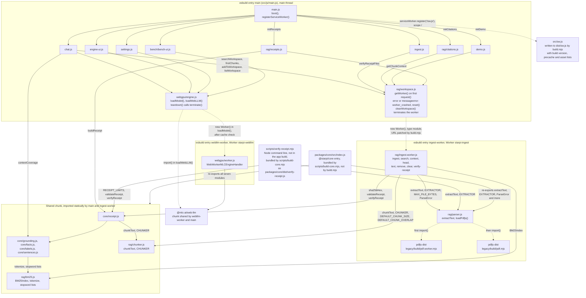
```mermaid
flowchart TD
    subgraph mainbundle["esbuild entry main (src/js/main.js), main thread"]
        main["main.js<br/>boot(), registerServiceWorker()"]
        chat["chat.js"]
        ingest["ingest.js"]
        citations["rag/citations.js"]
        demo["demo.js"]
        receipts["rag/receipts.js"]
        engineui["engine-ui.js"]
        settings["settings.js"]
        benchui["bench/bench-ui.js"]
        workspace["rag/workspace.js<br/>getWorker() on first request()<br/>error or messageerror: worker_crashed, reset()<br/>clearWorkspace() terminates the worker"]
        engine["webgpu/engine.js<br/>loadModel(), loadWebLLM()<br/>teardown() calls terminate()"]
    end

    subgraph shared["Shared chunk, imported statically by main and ingest-worker"]
        coreReceipt["core/receipt.js"]
        coreCheck["core/grounding.js, core/facts.js,<br/>core/labels.js, core/sentences.js"]
        bm25["rag/bm25.js<br/>BM25Index, tokenize, stopword lists"]
        chunker["rag/chunker.js<br/>chunkText, CHUNKER"]
    end

    subgraph ingestbundle["esbuild entry ingest-worker, Worker starpi-ingest"]
        iw["rag/ingest.worker.js<br/>ingest, search, context, head,<br/>text, remove, clear, verify-receipt"]
        parser["rag/parser.js<br/>extractText, loadPdfjs()"]
        pdfw["pdfjs-dist<br/>legacy/build/pdf.worker.mjs"]
        pdf["pdfjs-dist<br/>legacy/build/pdf.mjs"]
    end

    subgraph llmbundle["esbuild entry webllm-worker, Worker starpi-webllm"]
        ww["webgpu/worker.js<br/>WebWorkerMLCEngineHandler"]
    end

    webllm["@mlc-ai/web-llm<br/>chunk shared by webllm-worker and main"]
    sw["src/sw.js<br/>written to dist/sw.js by build.mjs<br/>with build version, precache and asset lists"]
    cli["scripts/verify-receipt.mjs<br/>Node command line, not in the app build,<br/>bundled by scripts/build-core.mjs<br/>as packages/core/dist/verify-receipt.js"]
    corepkg["packages/core/src/index.js<br/>@starpi/core entry, bundled by<br/>scripts/build-core.mjs, not by build.mjs"]

    main --> chat
    main --> ingest
    main -->|"initCitations"| citations
    main -->|"initDemo"| demo
    main -->|"initReceipts"| receipts
    main --> engineui
    main --> settings
    main --> benchui
    main -.->|"serviceWorker.register('/sw.js'), scope /"| sw

    chat -->|"searchWorkspace, firstChunks,<br/>addToWorkspace, listWorkspace"| workspace
    ingest --> workspace
    citations -->|"getChunkContext"| workspace
    demo --> workspace
    receipts -->|"verifyReceiptFiles"| workspace
    chat --> engine
    engineui --> engine
    settings --> engine
    benchui --> engine

    chat -->|"contextCoverage"| coreCheck
    receipts -->|"buildReceipt"| coreReceipt
    coreReceipt --> coreCheck
    coreReceipt -->|"chunkText, CHUNKER"| chunker
    coreCheck -->|"tokenize, stopword lists"| bm25

    workspace -.->|"new Worker(), type module,<br/>URL patched by build.mjs"| iw
    engine -.->|"new Worker() in loadModel(),<br/>after cache check"| ww
    engine -.->|"import() in loadWebLLM()"| webllm
    ww --> webllm

    iw -->|"sha256Hex, validateReceipt,<br/>verifyReceipt"| coreReceipt
    iw -->|"BM25Index"| bm25
    iw -->|"chunkText, CHUNKER,<br/>DEFAULT_CHUNK_SIZE, DEFAULT_CHUNK_OVERLAP"| chunker
    iw -->|"extractText, EXTRACTOR,<br/>MAX_FILE_BYTES, ParseError"| parser
    parser -.->|"first import()"| pdfw
    parser -.->|"then import()"| pdf
    cli -->|"RECEIPT_LIMITS, validateReceipt,<br/>verifyReceipt"| coreReceipt
    cli -->|"extractText, EXTRACTOR"| parser
    corepkg -->|"re-exports all seven modules"| shared
    corepkg -->|"re-exports extractText,<br/>EXTRACTOR, ParseError and more"| parser
```

Sources: [`scripts/build.mjs`](../scripts/build.mjs), [`src/js/main.js`](../src/js/main.js), [`src/js/chat.js`](../src/js/chat.js), [`src/js/ingest.js`](../src/js/ingest.js), [`src/js/demo.js`](../src/js/demo.js), [`src/js/engine-ui.js`](../src/js/engine-ui.js), [`src/js/settings.js`](../src/js/settings.js), [`src/js/bench/bench-ui.js`](../src/js/bench/bench-ui.js), [`src/js/rag/citations.js`](../src/js/rag/citations.js), [`src/js/rag/receipts.js`](../src/js/rag/receipts.js), [`src/js/rag/workspace.js`](../src/js/rag/workspace.js), [`src/js/rag/ingest.worker.js`](../src/js/rag/ingest.worker.js), [`src/js/core/receipt.js`](../src/js/core/receipt.js), [`src/js/core/grounding.js`](../src/js/core/grounding.js), [`src/js/rag/bm25.js`](../src/js/rag/bm25.js), [`src/js/rag/chunker.js`](../src/js/rag/chunker.js), [`src/js/rag/parser.js`](../src/js/rag/parser.js), [`src/js/webgpu/engine.js`](../src/js/webgpu/engine.js), [`src/js/webgpu/worker.js`](../src/js/webgpu/worker.js), [`src/sw.js`](../src/sw.js), [`scripts/verify-receipt.mjs`](../scripts/verify-receipt.mjs), [`scripts/build-core.mjs`](../scripts/build-core.mjs), [`packages/core/src/index.js`](../packages/core/src/index.js)

## 2. Boot and settings

What happens between the first byte of `index.html` and a usable chat, and how the settings form stores provider keys, preferences and the engine choice, tests provider keys and deletes the chat history.

### boot(): module start-up order

main.js boot() runs initI18n first, so the stored starpi_locale (or en) is applied before any module renders text. It then installs the delegated click/change dispatcher, registers the switch-tab and toggle-sidebar actions, calls syncSidebarAccess(false) so that below 768 px the closed off-canvas sidebar is inert, registers set-locale and the lazy onTabOpen hooks, and runs the twelve init* functions (initDemo and initReceipts last), refreshIcons, detectAndDisplayDevice and registerServiceWorker. registerServiceWorker registers the reload-app and dismiss-update actions, fetches /build-manifest.json on every controllerchange and shows the update banner only when its entries.mainJs differs from the page's own /assets/ module script, and registers /sw.js on window load (section 7 shows the update flow). sw.js calls skipWaiting only when no window is open at install time or on a SKIP_WAITING message, which main.js never sends, so an updated worker usually waits until every Starpi tab is closed. boot() subscribes to onConnectionChange before calling connect(), so the listener also renders the later attempts that connect() schedules itself after an offline result, while restoreHistory() runs only once. changeEngine is started with void, so it is neither awaited nor covered by boot().catch, while connect() and restoreHistory() are awaited in sequence. A throw or rejection inside boot() skips the remaining steps, and reportUnexpected only logs it with console.error.

<!-- diagram: boot-sequence-overview -->
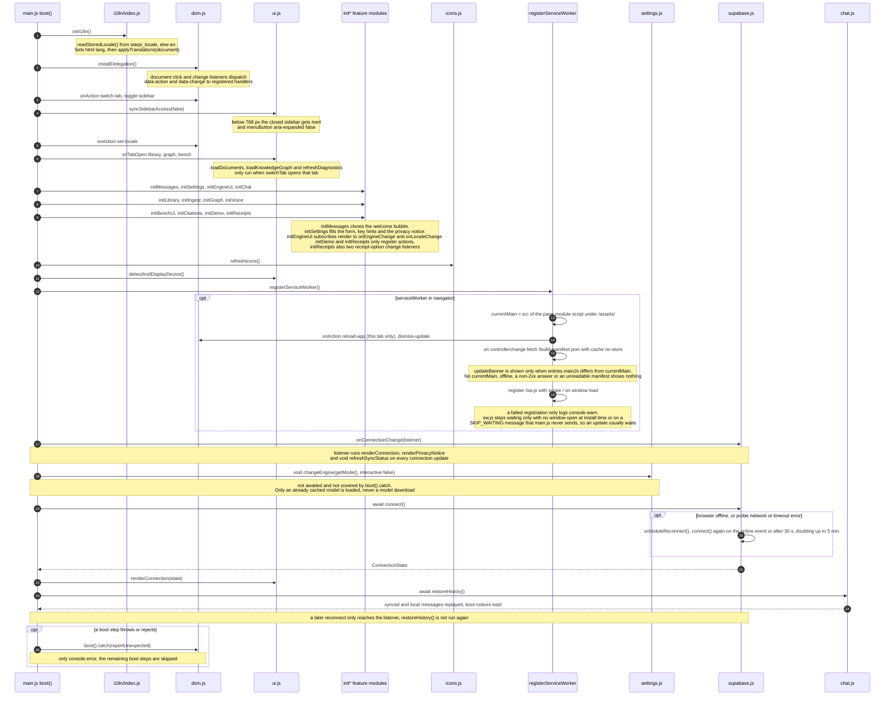
```mermaid
sequenceDiagram
    autonumber
    participant Main as main.js boot()
    participant I18n as i18n/index.js
    participant Dom as dom.js
    participant UI as ui.js
    participant Mods as init* feature modules
    participant Icons as icons.js
    participant SW as registerServiceWorker
    participant Set as settings.js
    participant Sb as supabase.js
    participant Chat as chat.js

    Main->>I18n: initI18n()
    Note over I18n: readStoredLocale() from starpi_locale, else en.<br/>Sets html lang, then applyTranslations(document)
    Main->>Dom: installDelegation()
    Note over Dom: document click and change listeners dispatch<br/>data-action and data-change to registered handlers
    Main->>Dom: onAction switch-tab, toggle-sidebar
    Main->>UI: syncSidebarAccess(false)
    Note over UI: below 768 px the closed sidebar gets inert<br/>and menuButton aria-expanded false
    Main->>Dom: onAction set-locale
    Main->>UI: onTabOpen library, graph, bench
    Note over UI: loadDocuments, loadKnowledgeGraph and refreshDiagnostics<br/>only run when switchTab opens that tab
    Main->>Mods: initMessages, initSettings, initEngineUi, initChat
    Main->>Mods: initLibrary, initIngest, initGraph, initVoice
    Main->>Mods: initBenchUi, initCitations, initDemo, initReceipts
    Note over Mods: initMessages clones the welcome bubble.<br/>initSettings fills the form, key hints and the privacy notice.<br/>initEngineUi subscribes render to onEngineChange and onLocaleChange.<br/>initDemo and initReceipts only register actions,<br/>initReceipts also two receipt-option change listeners
    Main->>Icons: refreshIcons()
    Main->>UI: detectAndDisplayDevice()
    Main->>SW: registerServiceWorker()
    opt serviceWorker in navigator
        SW->>SW: currentMain = src of the page module script under /assets/
        SW->>Dom: onAction reload-app (this tab only), dismiss-update
        SW->>SW: on controllerchange fetch /build-manifest.json with cache no-store
        Note over SW: updateBanner is shown only when entries.mainJs differs from currentMain.<br/>No currentMain, offline, a non-2xx answer or an unreadable manifest shows nothing
        SW->>SW: register /sw.js with scope / on window load
        Note over SW: a failed registration only logs console.warn.<br/>sw.js skips waiting only with no window open at install time or on a<br/>SKIP_WAITING message that main.js never sends, so an update usually waits
    end
    Main->>Sb: onConnectionChange(listener)
    Note over Main,Sb: listener runs renderConnection, renderPrivacyNotice<br/>and void refreshSyncStatus on every connection update
    Main->>Set: void changeEngine(getMode(), interactive false)
    Note over Main,Set: not awaited and not covered by boot().catch.<br/>Only an already cached model is loaded, never a model download
    Main->>Sb: await connect()
    opt browser offline, or probe network or timeout error
        Sb->>Sb: scheduleReconnect(), connect() again on the online event or after 30 s, doubling up to 5 min
    end
    Sb-->>Main: ConnectionState
    Main->>UI: renderConnection(state)
    Main->>Chat: await restoreHistory()
    Chat-->>Main: synced and local messages replayed, boot notices kept
    Note over Main,Sb: a later reconnect only reaches the listener, restoreHistory() is not run again
    opt a boot step throws or rejects
        Main->>Dom: boot().catch(reportUnexpected)
        Note over Main,Dom: only console.error, the remaining boot steps are skipped
    end
```

Sources: [`src/js/main.js`](../src/js/main.js), [`src/js/i18n/index.js`](../src/js/i18n/index.js), [`src/js/dom.js`](../src/js/dom.js), [`src/js/ui.js`](../src/js/ui.js), [`src/js/messages.js`](../src/js/messages.js), [`src/js/settings.js`](../src/js/settings.js), [`src/js/engine-ui.js`](../src/js/engine-ui.js), [`src/js/demo.js`](../src/js/demo.js), [`src/js/rag/receipts.js`](../src/js/rag/receipts.js), [`src/js/icons.js`](../src/js/icons.js), [`src/js/supabase.js`](../src/js/supabase.js), [`src/js/chat.js`](../src/js/chat.js), [`src/js/state.js`](../src/js/state.js), [`scripts/build.mjs`](../scripts/build.mjs), [`src/sw.js`](../src/sw.js)

### Boot-time changeEngine: cached model only, never a download

At boot changeEngine applies the stored compute mode with interactive false (normalizeMode maps legacy values and falls back to council) and resolves to whether setMode could store it, which boot() discards. In client mode startLocalEngine calls engine.loadModel with onlyIfCached true and no confirmDownload callback. After probeWebGPU and chooseModel, certainlyNotCached looks for the model's tensor-cache.json in the webllm/model cache of the Cache API: when that cache or the file is missing, loadModel resolves false before the WebLLM library is imported and the engine status stays unchanged (idle at boot). Otherwise (the index is there, or the Cache API is missing or fails) the engine tears down any old worker, switches to loading, imports WebLLM, checks that the model id is in the WebLLM build and asks hasModelInCache; a model that is not fully cached also resolves false, with status idle. In both cases no model data is downloaded and changeEngine turns the engine dot off. Missing WebGPU or adapter, a failed WebLLM import (kind code-download when the error message is one of the browser texts for a failed module import), a model missing from the WebLLM build (kind unknown) or a failed load of a cached model rejects with an EngineError and status error, which engine-ui turns into a chat notice (notice_unavailable_title for the kinds unsupported and no-adapter, otherwise notice_failed_title). Local mode probes GET /models on the own server URL with a 4 s timeout and shows the result in both the engine dot and the assistant status line, and council mode only checks whether a Gemini or OpenRouter key exists.

<!-- diagram: boot-sequence-engine-restore -->
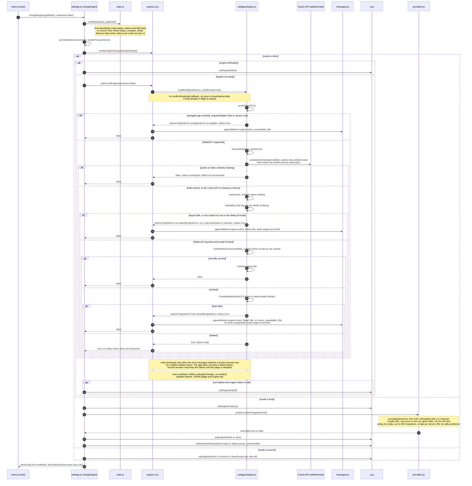
```mermaid
sequenceDiagram
    autonumber
    participant Main as main.js boot()
    participant Set as settings.js changeEngine
    participant St as state.js
    participant EUI as engine-ui.js
    participant Eng as webgpu/engine.js
    participant CS as Cache API webllm/model
    participant Msg as messages.js
    participant UI as ui.js
    participant Prov as providers.js

    Main->>Set: changeEngine(getMode(), interactive false)
    Set->>St: setMode(value), getMode()
    Note over St: normalizeMode maps legacy values and falls back<br/>to council, then writes starpi_compute_mode.<br/>Returns false when writeLocal could not store it
    Set->>Set: syncModeSelectors(mode), renderPrivacyNotice()
    Set->>EUI: renderEngineState(getEngineState())
    alt mode is client
        alt engine.isReady()
            Set->>UI: setEngineDot(ok)
        else engine not ready
            Set->>EUI: startLocalEngine(interactive false)
            EUI->>Eng: loadModel(preference, onlyIfCached true)
            Note over EUI,Eng: no confirmDownload callback, so never a download prompt.<br/>A load already in flight is shared
            Eng->>Eng: probeWebGPU()
            alt navigator.gpu missing, requestAdapter fails or returns null
                Eng-->>EUI: rejects EngineError unsupported or no-adapter, status error
                EUI->>Msg: appendNotice engine.notice_unavailable_title
                EUI-->>Set: false
            else WebGPU supported
                Eng->>Eng: chooseModel(hw, preference)
                Eng->>CS: certainlyNotCached(modelId): caches.has webllm/model,<br/>then match the model's tensor-cache.json
                alt cache or index certainly missing
                    Eng-->>EUI: false, status unchanged, WebLLM not imported
                    EUI-->>Set: false
                else index found, or the Cache API is missing or throws
                    Eng->>Eng: teardown(), setState status loading
                    Eng->>Eng: loadWebLLM() imports the WebLLM library
                    alt import fails, or the model id is not in the WebLLM build
                        Eng-->>EUI: rejects EngineError via classifyEngineError, e.g. code-download or unknown, status error
                        EUI->>Msg: appendNotice engine.notice_failed_title, body engine.error.kind
                        EUI-->>Set: false
                    else WebLLM imported and model id listed
                        Eng->>Eng: hasModelInCache(modelId), a failed check counts as not cached
                        alt not fully cached
                            Eng->>Eng: setState status idle
                            Eng-->>EUI: false
                            EUI-->>Set: false
                        else cached
                            Eng->>Eng: CreateWebWorkerMLCEngine in starpi-webllm Worker
                            alt load fails
                                Eng-->>EUI: rejects EngineError from classifyEngineError, status error
                                EUI->>Msg: appendNotice engine.notice_failed_title, or notice_unavailable_title<br/>for kind unsupported, body engine.error.kind
                                EUI-->>Set: false
                            else loaded
                                Eng-->>EUI: true, status ready
                                EUI-->>Set: true, no ready notice when not interactive
                            end
                        end
                    end
                end
            end
            Note over EUI,Eng: code-download only when the error message matches a known browser text<br/>for a failed module import. The app does not keep a failed import,<br/>but the browser may keep the failure until the page is reloaded
            Note over EUI,Eng: every setState notifies onEngineChange, so render()<br/>updates banner, VRAM badge and engine dot
            opt not loaded and engine status is idle
                Set->>UI: setEngineDot(off)
            end
        end
    else mode is local
        Set->>UI: setEngineDot(busy)
        Set->>Prov: probeLocalServer(getLlmUrl())
        Note over Prov: normalizeServerUrl, then GET url/models with a 4 s timeout.<br/>Invalid URL, any error or non-2xx gives false. On 2xx the first<br/>string id in data, cut to 200 characters, is kept per server URL for callLocalServer
        Prov-->>Set: reachable true or false
        Set->>UI: setEngineDot(ok or warn)
        Set->>UI: setAssistantStatus(status.ready or status.server_unreachable)
    else mode is council
        Set->>UI: setEngineDot(ok if a Gemini or OpenRouter key, else off)
    end
    Set-->>Main: stored flag from setMode, discarded because boot uses void
```

Sources: [`src/js/main.js`](../src/js/main.js), [`src/js/settings.js`](../src/js/settings.js), [`src/js/engine-ui.js`](../src/js/engine-ui.js), [`src/js/webgpu/engine.js`](../src/js/webgpu/engine.js), [`src/js/webgpu/models.js`](../src/js/webgpu/models.js), [`src/js/state.js`](../src/js/state.js), [`src/js/messages.js`](../src/js/messages.js), [`src/js/ui.js`](../src/js/ui.js), [`src/js/providers.js`](../src/js/providers.js), [`src/js/config.js`](../src/js/config.js)

### connect(), connection subscribers and restoreHistory

connect() first checks navigator.onLine: when the browser reports offline it marks the state offline (signedIn and hardened false, authError and probeError of kind network) without sending any request. Otherwise ensureSession reuses the stored session; without one it first reads the public auth settings (GET /auth/v1/settings). When they report anonymous sign-ins as off, authError is auth_disabled; when that read times out, the timeout error itself becomes authError. In both cases no sign-in request is sent, so a project that does not answer costs one timeout less. In all other cases (sign-ins on, a non-2xx answer, an unreadable body or a network error) it signs in anonymously. connect() then probes for the hardened schema by selecting id and is_public from knowledge_documents; every Supabase request, including the settings read, has a 12 s fetch timeout and the client's own retries are off (db retry false). Only a network or timeout error of that probe marks the state offline; a timeout authError on its own only leaves signedIn false. In both offline cases scheduleReconnect() clears connectPromise and calls connect() again on the window online event or after 30 s, doubling up to 5 min, until an attempt is no longer offline. Later, any request sent through run() that fails with a network or timeout error while the status is ready switches only the status to offline (signedIn and hardened keep their values) and schedules the same reconnect. updateConnection calls the single subscriber from main.js (renderConnection, renderPrivacyNotice, refreshSyncStatus) and boot then calls renderConnection again, while a later reconnect reaches only the subscriber and never runs restoreHistory again.

<!-- diagram: boot-sequence-connect-history -->
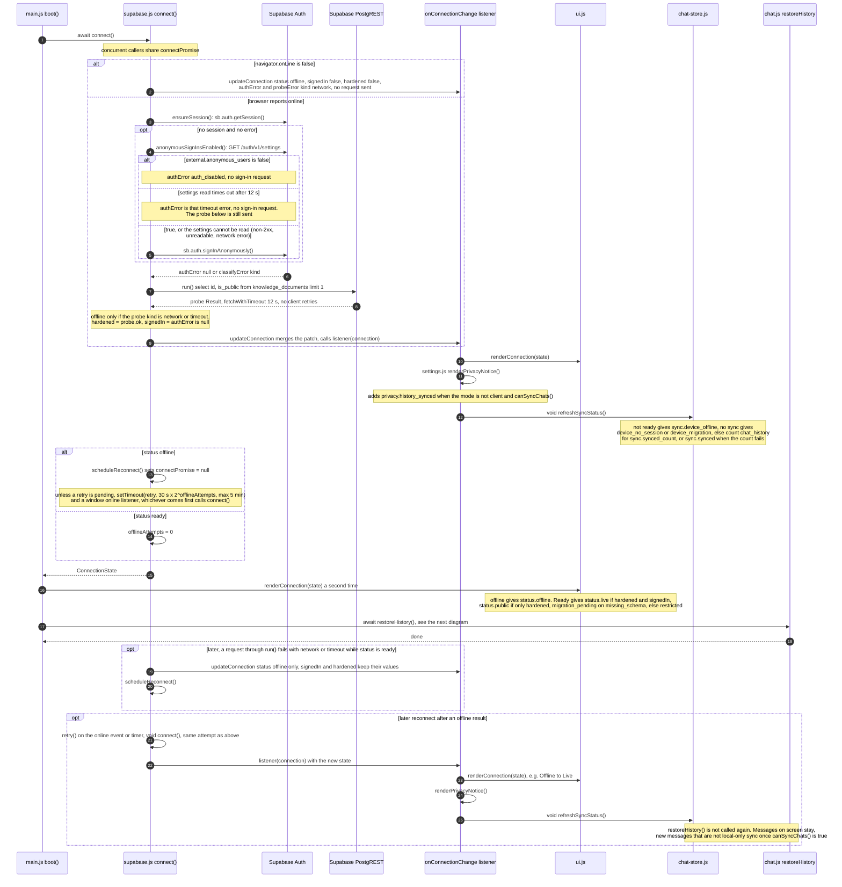
```mermaid
sequenceDiagram
    autonumber
    participant Main as main.js boot()
    participant Sb as supabase.js connect()
    participant Auth as Supabase Auth
    participant DB as Supabase PostgREST
    participant L as onConnectionChange listener
    participant UI as ui.js
    participant Store as chat-store.js
    participant Chat as chat.js restoreHistory

    Main->>Sb: await connect()
    Note over Sb: concurrent callers share connectPromise
    alt navigator.onLine is false
        Sb->>L: updateConnection status offline, signedIn false, hardened false,<br/>authError and probeError kind network, no request sent
    else browser reports online
        Sb->>Auth: ensureSession(): sb.auth.getSession()
        opt no session and no error
            Sb->>Auth: anonymousSignInsEnabled(): GET /auth/v1/settings
            alt external.anonymous_users is false
                Note over Sb,Auth: authError auth_disabled, no sign-in request
            else settings read times out after 12 s
                Note over Sb,Auth: authError is that timeout error, no sign-in request.<br/>The probe below is still sent
            else true, or the settings cannot be read (non-2xx, unreadable, network error)
                Sb->>Auth: sb.auth.signInAnonymously()
            end
        end
        Auth-->>Sb: authError null or classifyError kind
        Sb->>DB: run() select id, is_public from knowledge_documents limit 1
        DB-->>Sb: probe Result, fetchWithTimeout 12 s, no client retries
        Note over Sb: offline only if the probe kind is network or timeout.<br/>hardened = probe.ok, signedIn = authError is null
        Sb->>L: updateConnection merges the patch, calls listener(connection)
    end
    L->>UI: renderConnection(state)
    L->>L: settings.js renderPrivacyNotice()
    Note over L: adds privacy.history_synced when the mode is not client and canSyncChats()
    L->>Store: void refreshSyncStatus()
    Note over Store: not ready gives sync.device_offline, no sync gives<br/>device_no_session or device_migration, else count chat_history<br/>for sync.synced_count, or sync.synced when the count fails
    alt status offline
        Sb->>Sb: scheduleReconnect() sets connectPromise = null
        Note over Sb: unless a retry is pending, setTimeout(retry, 30 s x 2^offlineAttempts, max 5 min)<br/>and a window online listener, whichever comes first calls connect()
    else status ready
        Sb->>Sb: offlineAttempts = 0
    end
    Sb-->>Main: ConnectionState
    Main->>UI: renderConnection(state) a second time
    Note over UI: offline gives status.offline. Ready gives status.live if hardened and signedIn,<br/>status.public if only hardened, migration_pending on missing_schema, else restricted
    Main->>Chat: await restoreHistory(), see the next diagram
    Chat-->>Main: done
    opt later, a request through run() fails with network or timeout while status is ready
        Sb->>L: updateConnection status offline only, signedIn and hardened keep their values
        Sb->>Sb: scheduleReconnect()
    end
    opt later reconnect after an offline result
        Sb->>Sb: retry() on the online event or timer, void connect(), same attempt as above
        Sb->>L: listener(connection) with the new state
        L->>UI: renderConnection(state), e.g. Offline to Live
        L->>L: renderPrivacyNotice()
        L->>Store: void refreshSyncStatus()
        Note over Store,Chat: restoreHistory() is not called again. Messages on screen stay,<br/>new messages that are not local-only sync once canSyncChats() is true
    end
```

Sources: [`src/js/main.js`](../src/js/main.js), [`src/js/supabase.js`](../src/js/supabase.js), [`src/js/ui.js`](../src/js/ui.js), [`src/js/settings.js`](../src/js/settings.js), [`src/js/chat-store.js`](../src/js/chat-store.js), [`src/js/chat.js`](../src/js/chat.js), [`src/js/config.js`](../src/js/config.js)

### restoreHistory: merging synced and on-device messages

restoreHistory first awaits loadCurrentSession. It reads the current session's messages from localStorage, where rows without a boolean metadata.local_only flag count as on-device turns, and, only when canSyncChats() (signedIn and hardened), the newest 200 chat_history rows of the session, returned oldest first. With rows on both sides, mergeByTime drops local rows without created_at that repeat a synced row's role and content, and sorts the rest by created_at with a stable sort, rows without a valid time last. A failed query only logs console.warn and falls back to the local rows. The messages are replayed with title-only sources and the stored engine badge, the conversation keeps each turn's localOnly flag so that on-device turns are never sent as history to OpenRouter or the own server, every bubble shown after the welcome while the history loaded (such as an engine notice) is appended again after the restored messages, and turns already in memory are kept after the restored turns.

<!-- diagram: boot-sequence-restore-history -->
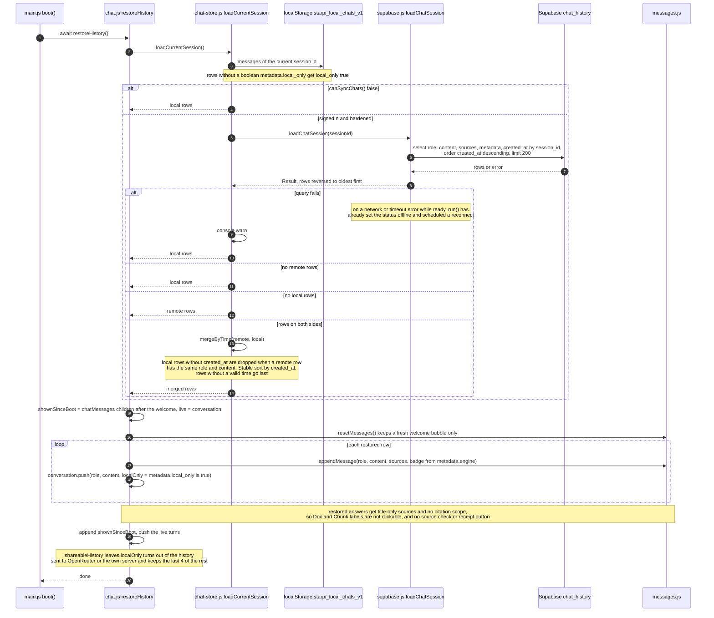
```mermaid
sequenceDiagram
    autonumber
    participant Main as main.js boot()
    participant Chat as chat.js restoreHistory
    participant Store as chat-store.js loadCurrentSession
    participant LS as localStorage starpi_local_chats_v1
    participant Sb as supabase.js loadChatSession
    participant DB as Supabase chat_history
    participant Msg as messages.js

    Main->>Chat: await restoreHistory()
    Chat->>Store: loadCurrentSession()
    Store->>LS: messages of the current session id
    Note over Store,LS: rows without a boolean metadata.local_only get local_only true
    alt canSyncChats() false
        Store-->>Chat: local rows
    else signedIn and hardened
        Store->>Sb: loadChatSession(sessionId)
        Sb->>DB: select role, content, sources, metadata, created_at by session_id,<br/>order created_at descending, limit 200
        DB-->>Sb: rows or error
        Sb-->>Store: Result, rows reversed to oldest first
        alt query fails
            Note over Sb: on a network or timeout error while ready, run() has<br/>already set the status offline and scheduled a reconnect
            Store->>Store: console.warn
            Store-->>Chat: local rows
        else no remote rows
            Store-->>Chat: local rows
        else no local rows
            Store-->>Chat: remote rows
        else rows on both sides
            Store->>Store: mergeByTime(remote, local)
            Note over Store: local rows without created_at are dropped when a remote row<br/>has the same role and content. Stable sort by created_at,<br/>rows without a valid time go last
            Store-->>Chat: merged rows
        end
    end
    Chat->>Chat: shownSinceBoot = chatMessages children after the welcome, live = conversation
    Chat->>Msg: resetMessages() keeps a fresh welcome bubble only
    loop each restored row
        Chat->>Msg: appendMessage(role, content, sources, badge from metadata.engine)
        Chat->>Chat: conversation.push(role, content, localOnly = metadata.local_only is true)
    end
    Note over Chat,Msg: restored answers get title-only sources and no citation scope,<br/>so Doc and Chunk labels are not clickable, and no source check or receipt button
    Chat->>Chat: append shownSinceBoot, push the live turns
    Note over Chat: shareableHistory leaves localOnly turns out of the history<br/>sent to OpenRouter or the own server and keeps the last 4 of the rest
    Chat-->>Main: done
```

Sources: [`src/js/chat.js`](../src/js/chat.js), [`src/js/chat-store.js`](../src/js/chat-store.js), [`src/js/supabase.js`](../src/js/supabase.js), [`src/js/messages.js`](../src/js/messages.js), [`src/js/rag/citations.js`](../src/js/rag/citations.js), [`src/js/storage.js`](../src/js/storage.js), [`src/js/config.js`](../src/js/config.js)

### saveSettings: server URL, API keys, model preference

saveSettings first validates the own-server URL with normalizeServerUrl and stops with an alert (and focus on the field) when it is invalid, insecure or contains credentials. The URL, the remember toggle and the model preference go to localStorage; each key is written only when a new one was typed, or re-written to the other storage when an existing key's remember setting changed, and writeSecret always deletes both copies first and then uses localStorage (remember) or sessionStorage. Inputs are cleared and only masked hints with the last four characters are shown. When the model preference changed and the engine status is not idle, the engine is unloaded before changeEngine applies the selected mode interactively; changeEngine resolves with whether setMode stored the mode, and saveSettings then alerts settings.saved_toast only when every write it made returned true, otherwise settings.save_failed.

<!-- diagram: settings-flow-save -->
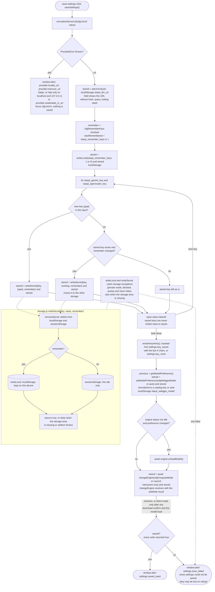
```mermaid
flowchart TD
    Save(["save-settings click: saveSettings()"]) --> Norm["normalizeServerUrl(cfgLlmUrl value)"]
    Norm --> UrlOk{"ProviderError thrown?"}
    UrlOk -->|"yes"| UrlAlert["window.alert: provider.invalid_url, provider.insecure_url<br/>(https, or http only on localhost and 127.0.0.1)<br/>or provider.credentials_in_url<br/>focus cfgLlmUrl, nothing is saved"]
    UrlOk -->|"no"| SetUrl["stored = setLlmUrl(url): localStorage starpi_llm_url<br/>field shows the URL without hash, query, trailing slash"]
    SetUrl --> Remember["remember = cfgRememberKeys checked<br/>wasRemembered = starpi_remember_keys is 1"]
    Remember --> Flag["stored = writeLocal(starpi_remember_keys, 1 or 0) and stored<br/>localStorage"]
    Flag --> Loop["for starpi_gemini_key and starpi_openrouter_key"]
    Loop --> Typed{"new key typed<br/>in the input?"}
    Typed -->|"yes"| WriteTyped["stored = writeSecret(key, typed, remember) and stored"]
    Typed -->|"no"| Moved{"stored key exists and<br/>remember changed?"}
    Moved -->|"yes"| Migrate["stored = writeSecret(key, existing, remember) and stored<br/>moves it to the other storage"]
    Moved -->|"no"| Keep["stored key left as is"]
    WriteTyped --> ClearInput
    Migrate --> ClearInput
    Keep --> ClearInput["input.value cleared<br/>stored keys are never written back to inputs"]
    ClearInput -->|"next key"| Loop
    ClearInput -->|"both done"| Hints["renderKeyHints(): masked hint settings.key_saved<br/>with the last 4 chars, or settings.key_none"]
    Hints --> Pref["previous = getModelPreference()<br/>stored = setModelPreference(cfgWebgpuModel or auto) and stored<br/>normalized to a catalog key or auto<br/>localStorage starpi_webgpu_model"]
    Pref --> PrefChanged{"engine status not idle<br/>and preference changed?"}
    PrefChanged -->|"yes"| Unload["await engine.unloadModel()"]
    PrefChanged -->|"no"| Change
    Unload --> Change["stored = await changeEngine(cfgComputeMode or council,<br/>interactive true) and stored<br/>changeEngine resolves with the setMode result"]
    Change -->|"resolves, in client mode only after any<br/>download confirm and the model load"| AllOk{"stored?<br/>every write returned true"}
    AllOk -->|"yes"| Toast(["window.alert settings.saved_toast"])
    AllOk -->|"no"| Failed(["window.alert settings.save_failed<br/>some settings could not be saved,<br/>they may be lost on reload"])

    subgraph sg_secret["storage.js writeSecret(key, value, remember)"]
        WS1["removeSecret: delete from<br/>localStorage and sessionStorage"] --> WS2{"remember?"}
        WS2 -->|"yes"| WS3[("writeLocal: localStorage, kept on this device")]
        WS2 -->|"no"| WS4[("sessionStorage, this tab only")]
        WS3 --> WS5["returns true, or false when the storage area<br/>is missing or setItem throws"]
        WS4 --> WS5
    end
    WriteTyped -.-> WS1
    Migrate -.-> WS1
    StoreErr["writeLocal and writeSecret catch storage exceptions<br/>(private mode, blocked, quota) and return false,<br/>also when the storage area is missing"] -.- sg_secret
    StoreErr -.->|"any false"| Failed
```

Sources: [`src/js/settings.js`](../src/js/settings.js), [`src/js/providers.js`](../src/js/providers.js), [`src/js/storage.js`](../src/js/storage.js), [`src/js/state.js`](../src/js/state.js), [`src/js/config.js`](../src/js/config.js), [`src/js/webgpu/models.js`](../src/js/webgpu/models.js), [`src/js/webgpu/engine.js`](../src/js/webgpu/engine.js)

### changeEngine, clearKeys and deleteModelCache

changeEngine stores the normalized mode in localStorage through setMode, syncs both mode selectors and the privacy notice, sets the status dot per mode and resolves with whether that write succeeded (saveSettings uses it, boot and both change-engine selects, engineSelector and cfgComputeMode, ignore it): client reuses a ready engine or calls startLocalEngine (interactive loads may ask to download, non-interactive loads only use a cached model), local probes GET /models on the own server with a 4 s timeout and also writes status.ready or status.server_unreachable to the assistant status line, council is ok only when a Gemini or OpenRouter key is stored. Client and council mode leave the assistant status line as it is. clearKeys removes both keys from localStorage and sessionStorage and refreshes hints and privacy notice but not the engine dot. deleteModelCache asks for confirmation, unloads the engine and deletes the cached f16 and f32 variants of every catalog model, alerting done or failed.

<!-- diagram: settings-flow-engine-keys-cache -->
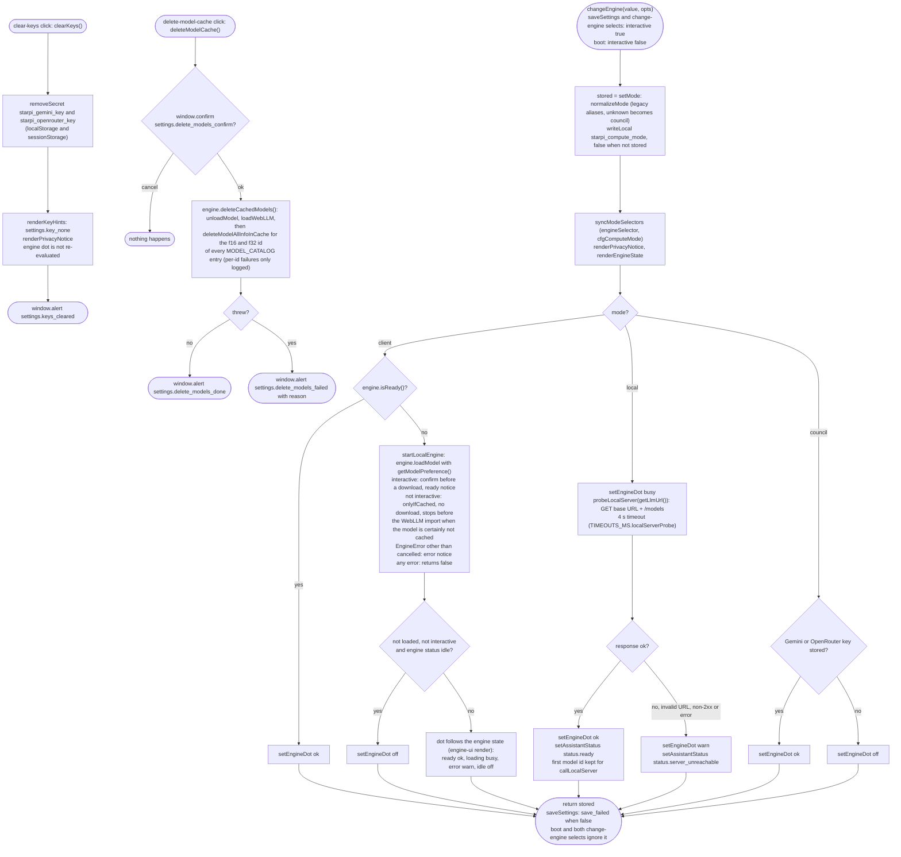
```mermaid
flowchart TD
    CE(["changeEngine(value, opts)<br/>saveSettings and change-engine selects: interactive true<br/>boot: interactive false"]) --> SetMode["stored = setMode: normalizeMode (legacy aliases, unknown becomes council)<br/>writeLocal starpi_compute_mode, false when not stored"]
    SetMode --> SyncUi["syncModeSelectors (engineSelector, cfgComputeMode)<br/>renderPrivacyNotice, renderEngineState"]
    SyncUi --> Mode{"mode?"}
    Mode -->|"client"| Ready{"engine.isReady()?"}
    Ready -->|"yes"| DotOk1["setEngineDot ok"]
    Ready -->|"no"| Start["startLocalEngine: engine.loadModel with getModelPreference()<br/>interactive: confirm before a download, ready notice<br/>not interactive: onlyIfCached, no download, stops before<br/>the WebLLM import when the model is certainly not cached<br/>EngineError other than cancelled: error notice<br/>any error: returns false"]
    Start --> Loaded{"not loaded, not interactive<br/>and engine status idle?"}
    Loaded -->|"yes"| DotOff1["setEngineDot off"]
    Loaded -->|"no"| DotEngine["dot follows the engine state (engine-ui render):<br/>ready ok, loading busy, error warn, idle off"]
    Mode -->|"local"| Probe["setEngineDot busy<br/>probeLocalServer(getLlmUrl()): GET base URL + /models<br/>4 s timeout (TIMEOUTS_MS.localServerProbe)"]
    Probe --> ProbeOk{"response ok?"}
    ProbeOk -->|"yes"| DotOk2["setEngineDot ok<br/>setAssistantStatus status.ready<br/>first model id kept for callLocalServer"]
    ProbeOk -->|"no, invalid URL, non-2xx or error"| DotWarn["setEngineDot warn<br/>setAssistantStatus status.server_unreachable"]
    Mode -->|"council"| HasKey{"Gemini or OpenRouter key stored?"}
    HasKey -->|"yes"| DotOk3["setEngineDot ok"]
    HasKey -->|"no"| DotOff2["setEngineDot off"]
    Ret(["return stored<br/>saveSettings: save_failed when false<br/>boot and both change-engine selects ignore it"])
    DotOk1 --> Ret
    DotOff1 --> Ret
    DotEngine --> Ret
    DotOk2 --> Ret
    DotWarn --> Ret
    DotOk3 --> Ret
    DotOff2 --> Ret

    Clear(["clear-keys click: clearKeys()"]) --> Remove["removeSecret starpi_gemini_key and starpi_openrouter_key<br/>(localStorage and sessionStorage)"]
    Remove --> ClearUi["renderKeyHints: settings.key_none<br/>renderPrivacyNotice<br/>engine dot is not re-evaluated"]
    ClearUi --> ClearAlert(["window.alert settings.keys_cleared"])

    Del(["delete-model-cache click: deleteModelCache()"]) --> Confirm{"window.confirm<br/>settings.delete_models_confirm?"}
    Confirm -->|"cancel"| NoOp(["nothing happens"])
    Confirm -->|"ok"| DelCache["engine.deleteCachedModels(): unloadModel, loadWebLLM,<br/>then deleteModelAllInfoInCache for the f16 and f32 id<br/>of every MODEL_CATALOG entry (per-id failures only logged)"]
    DelCache --> Threw{"threw?"}
    Threw -->|"no"| DelDone(["window.alert settings.delete_models_done"])
    Threw -->|"yes"| DelFail(["window.alert settings.delete_models_failed with reason"])
```

Sources: [`src/js/settings.js`](../src/js/settings.js), [`src/js/engine-ui.js`](../src/js/engine-ui.js), [`src/js/webgpu/engine.js`](../src/js/webgpu/engine.js), [`src/js/providers.js`](../src/js/providers.js), [`src/js/state.js`](../src/js/state.js), [`src/js/storage.js`](../src/js/storage.js), [`src/js/ui.js`](../src/js/ui.js), [`src/js/config.js`](../src/js/config.js), [`src/js/main.js`](../src/js/main.js)

### deleteHistory: deleting the chat history

The delete-chat-history button first checks isChatBusy(): while an answer is still running (or a question waits for an attached file) it only alerts settings.delete_history_busy and deletes nothing, because the running turn would be stored again after the delete. Otherwise it asks for confirmation and then calls deleteChatHistory in chat-store.js. It overwrites the local chat store with an empty object, which removes every session kept in this browser (a failed write is not reported), and starts a new session id. It resolves true without any remote delete only when the connection status is ready and canSyncChats() is false (no session or an older schema, so nothing was synced). In every other case, including offline and a still pending connection, it calls deleteOwnChats, which reads the auth session and deletes every chat_history row whose owner_id is the signed-in user, across all of that user's sessions; row level security limits the delete to own rows. If reading the session throws, deleteOwnChats returns a failed Result without sending the delete; if it yields no user id, nothing is deleted in Supabase and the Result still counts as ok. Offline, the delete request is still sent when a user id is found and its failure is reported. After deleteChatHistory the chat on screen is reset whatever it returned, and the alert says settings.delete_history_done, or settings.delete_history_partial when deleteOwnChats returned a failed Result.

<!-- diagram: settings-flow-delete-history -->
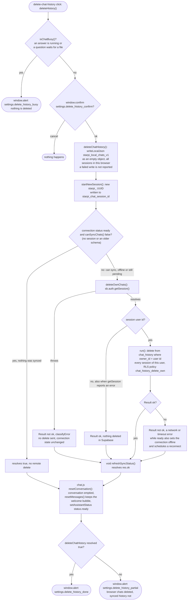
```mermaid
flowchart TD
    Start(["delete-chat-history click: deleteHistory()"]) --> Busy{"isChatBusy()?<br/>an answer is running or<br/>a question waits for a file"}
    Busy -->|"yes"| BusyAlert(["window.alert settings.delete_history_busy<br/>nothing is deleted"])
    Busy -->|"no"| Confirm{"window.confirm<br/>settings.delete_history_confirm?"}
    Confirm -->|"cancel"| NoOp(["nothing happens"])
    Confirm -->|"ok"| Wipe["deleteChatHistory(): writeLocalJson starpi_local_chats_v1<br/>as an empty object, all sessions in this browser<br/>a failed write is not reported"]
    Wipe --> NewSid["startNewSession(): new starpi_ UUID<br/>written to starpi_chat_session_id"]
    NewSid --> CanSync{"connection status ready<br/>and canSyncChats() false?<br/>(no session or an older schema)"}
    CanSync -->|"yes, nothing was synced"| LocalOnly["resolves true, no remote delete"]
    CanSync -->|"no: can sync, offline or still pending"| GetSession["deleteOwnChats(): sb.auth.getSession()"]
    GetSession -->|"throws"| SessErr["Result not ok, classifyError<br/>no delete sent, connection state unchanged"]
    GetSession -->|"resolves"| Uid{"session user id?"}
    Uid -->|"no, also when getSession reports an error"| NoUid["Result ok, nothing deleted in Supabase"]
    Uid -->|"yes"| Rows["run(): delete from chat_history where owner_id = user id<br/>every session of this user, RLS policy chat_history_delete_own"]
    Rows --> RowsOk{"Result ok?"}
    RowsOk -->|"yes"| Refresh
    RowsOk -->|"no"| RowsFail["Result not ok, a network or timeout error<br/>while ready also sets the connection offline<br/>and schedules a reconnect"]
    NoUid --> Refresh["void refreshSyncStatus()<br/>resolves res.ok"]
    RowsFail --> Refresh
    SessErr --> Refresh
    LocalOnly --> Reset
    Refresh --> Reset["chat.js resetConversation(): conversation emptied,<br/>resetMessages() keeps the welcome bubble,<br/>setAssistantStatus status.ready"]
    Reset --> Ok{"deleteChatHistory resolved true?"}
    Ok -->|"yes"| Done(["window.alert settings.delete_history_done"])
    Ok -->|"no"| Partial(["window.alert settings.delete_history_partial<br/>browser chats deleted, synced history not"])
```

Sources: [`src/js/settings.js`](../src/js/settings.js), [`src/js/chat-store.js`](../src/js/chat-store.js), [`src/js/supabase.js`](../src/js/supabase.js), [`src/js/chat.js`](../src/js/chat.js), [`src/js/messages.js`](../src/js/messages.js), [`src/js/storage.js`](../src/js/storage.js), [`src/js/config.js`](../src/js/config.js), [`backend/supabase/migrations/20260923000000_harden_rls_anonymous_auth.sql`](../backend/supabase/migrations/20260923000000_harden_rls_anonymous_auth.sql), [`src/locales/en.json`](../src/locales/en.json)

### testProvider: Gemini and OpenRouter connection tests

A test button disables itself, shows an amber running box and sends readinessPrompt in the active language (English or German) through callGemini or callOpenRouter, each request limited to 20 s. A key typed into cfgGeminiKey or cfgOpenrouterKey is tested as typed, without saving it or clearing the field; with an empty field the stored key is used (sessionStorage first, then localStorage). With neither, the provider throws a ProviderError with notConfigured, shown as an amber settings.test_not_configured box with the settings.test_enter_key hint; any other failure shows a rose settings.test_failed box with the error message; success shows a green box with the elapsed milliseconds and the first 140 characters of the reply. The reply and the error message pass through sanitizeModelNames. The headings and the hint are set with setText, so they re-translate on a language switch (the milliseconds, the reply and the error message do not), and the button is re-enabled in all cases.

<!-- diagram: settings-flow-test-provider -->
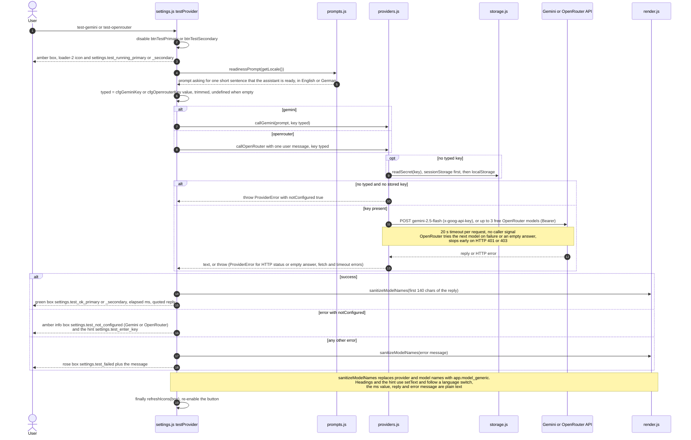
```mermaid
sequenceDiagram
    autonumber
    actor User
    participant Set as settings.js testProvider
    participant P as prompts.js
    participant Prov as providers.js
    participant St as storage.js
    participant API as Gemini or OpenRouter API
    participant R as render.js

    User->>Set: test-gemini or test-openrouter
    Set->>Set: disable btnTestPrimary or btnTestSecondary
    Set-->>User: amber box, loader-2 icon and settings.test_running_primary or _secondary
    Set->>P: readinessPrompt(getLocale())
    P-->>Set: prompt asking for one short sentence that the assistant is ready, in English or German
    Set->>Set: typed = cfgGeminiKey or cfgOpenrouterKey value, trimmed, undefined when empty
    alt gemini
        Set->>Prov: callGemini(prompt, key typed)
    else openrouter
        Set->>Prov: callOpenRouter with one user message, key typed
    end
    opt no typed key
        Prov->>St: readSecret(key), sessionStorage first, then localStorage
    end
    alt no typed and no stored key
        Prov-->>Set: throw ProviderError with notConfigured true
    else key present
        Prov->>API: POST gemini-2.5-flash (x-goog-api-key), or up to 3 free OpenRouter models (Bearer)
        Note over Prov,API: 20 s timeout per request, no caller signal<br/>OpenRouter tries the next model on failure or an empty answer,<br/>stops early on HTTP 401 or 403
        API-->>Prov: reply or HTTP error
        Prov-->>Set: text, or throw (ProviderError for HTTP status or empty answer, fetch and timeout errors)
    end
    alt success
        Set->>R: sanitizeModelNames(first 140 chars of the reply)
        Set-->>User: green box settings.test_ok_primary or _secondary, elapsed ms, quoted reply
    else error with notConfigured
        Set-->>User: amber info box settings.test_not_configured (Gemini or OpenRouter)<br/>and the hint settings.test_enter_key
    else any other error
        Set->>R: sanitizeModelNames(error message)
        Set-->>User: rose box settings.test_failed plus the message
    end
    Note over Set,R: sanitizeModelNames replaces provider and model names with app.model_generic.<br/>Headings and the hint use setText and follow a language switch,<br/>the ms value, reply and error message are plain text
    Set->>Set: finally refreshIcons(box), re-enable the button
```

Sources: [`src/js/settings.js`](../src/js/settings.js), [`src/js/prompts.js`](../src/js/prompts.js), [`src/js/providers.js`](../src/js/providers.js), [`src/js/storage.js`](../src/js/storage.js), [`src/js/config.js`](../src/js/config.js), [`src/js/render.js`](../src/js/render.js), [`src/js/i18n/index.js`](../src/js/i18n/index.js), [`src/locales/en.json`](../src/locales/en.json)

## 3. Answering a question

One chat turn from submit to persisted answer: retrieval and how workspace and knowledge-base hits share the slots, citation assignment, the answer path chosen by the mode, the fallbacks when a path fails, the source check and receipt draft after rendering, and exactly which data leaves the device in each mode, followed by the settings, the privacy notice and the on-device model selection and prompt budget that shape a turn.

### submitChat: from input to persisted answer

submitChat returns early with status.busy while a request runs. If an attached file is still being read, it marks itself busy, shows status.reading_file and waits for the read, so a question is not sent before its file is ready (if the read fails, the question goes without it); it then returns when there is neither text nor an attachment. It shows the user turn at once but stores it only after retrieval with storeQuestion(usesWorkspace), so the question stays on the device in client mode, with an attached file or when a used hit comes from the workspace; if the turn throws before that, the catch stores it with usesWorkspace false. Retrieval merges on-device BM25 workspace chunks with Supabase knowledge hits, a greeting-only message uses none of them, and citations are assigned and registered. The mode captured at submit picks council (Gemini then OpenRouter), client (on-device WebGPU, streamed) or local (own server); a model that fails shows a chat.provider_failed notice, and a null or empty answer falls back to the extractive synthesizer. Only while the chat session is unchanged is the answer rendered, source-checked, given a receipt button and added to the conversation; a finished answer is persisted under the original session id whether or not the session changed, and it stays in localStorage when the mode is client, a workspace excerpt was used, an extractive answer contains the name of a workspace file (a greeting or document list, for example), sync is unavailable or the insert fails. When the turn ends, setBusy(false) puts the focus back in the input if the Stop button or nothing had it.

<!-- diagram: chat-request-lifecycle -->
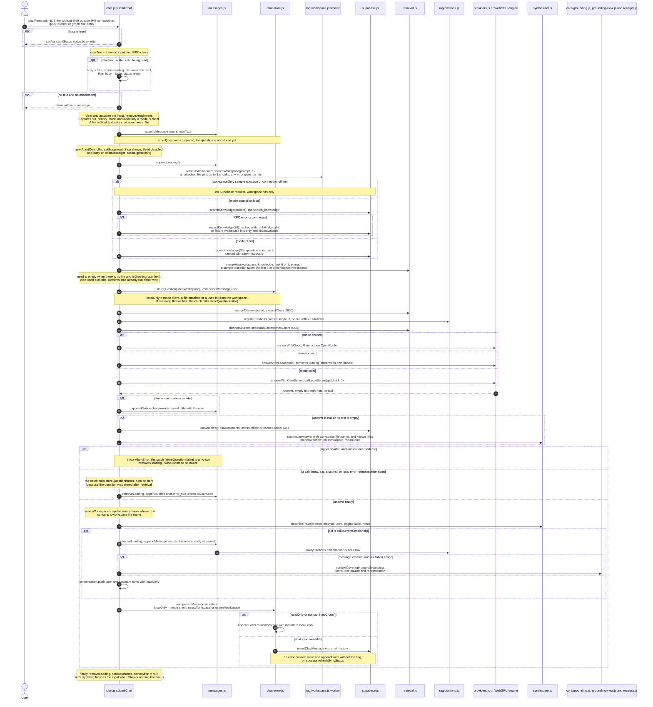
```mermaid
sequenceDiagram
    autonumber
    actor User
    participant Chat as chat.js submitChat
    participant Msg as messages.js
    participant Store as chat-store.js
    participant WS as rag/workspace.js worker
    participant SB as supabase.js
    participant Ret as retrieval.js
    participant Cit as rag/citations.js
    participant Eng as providers.js or WebGPU engine
    participant Syn as synthesizer.js
    participant Chk as core/grounding.js, grounding-view.js and receipts.js

    User->>Chat: chatForm submit, Enter without Shift outside IME composition,<br/>quick-prompt or graph ask-entity
    opt busy is true
        Chat-->>User: setAssistantStatus status.busy, return
    end
    Note over Chat: userText = trimmed input, first 8000 chars
    opt attaching: a file is still being read
        Chat->>Chat: busy = true, status.reading_file, await the read,<br/>then busy = false, status.ready
    end
    opt no text and no attachment
        Chat-->>User: return without a message
    end
    Note over Chat: clear and autosize the input, removeAttachment.<br/>Captures sid, history, mode and localOnly = mode is client.<br/>A file without text asks chat.summarize_file
    Chat->>Msg: appendMessage user shownText
    Note over Chat,Store: storeQuestion is prepared, the question is not stored yet
    Note over Chat: new AbortController, setBusy(true): Stop shown, Send disabled,<br/>aria-busy on chatMessages, status.generating
    Chat->>Msg: appendLoading()
    Chat->>WS: retrieveWorkspace: searchWorkspace(prompt, 6),<br/>an attached file pins up to 3 chunks, any error gives no hits
    alt workspaceOnly sample question or connection offline
        Note over Chat,SB: no Supabase request, workspace hits only
    else mode council or local
        Chat->>SB: searchKnowledge(prompt), rpc search_knowledge
        opt RPC error or zero rows
            Chat->>SB: recentKnowledge(30), ranked with rankHitsLocally,<br/>on failure workspace hits only and kbUnavailable
        end
    else mode client
        Chat->>SB: recentKnowledge(30), question is not sent,<br/>ranked with rankHitsLocally
    end
    Chat->>Ret: mergeHits(workspace, knowledge, limit 6 or 9, pinned),<br/>a sample question takes the first 6 or 9 workspace hits instead
    Note over Chat: used is empty when there is no file and isGreeting(userText),<br/>else used = all hits. Retrieval has already run either way
    Chat->>Store: storeQuestion(usesWorkspace), void persistMessage user
    Note over Chat,Store: localOnly = mode client, a file attached or a used hit from the workspace.<br/>If retrieve() throws first, the catch calls storeQuestion(false)
    Chat->>Ret: assignCitations(used, excerptChars 1600)
    Chat->>Cit: registerCitations gives a scope id, or null without citations
    Chat->>Ret: distinctSources and buildContext(maxChars 9000)
    alt mode council
        Chat->>Eng: answerWithCloud, Gemini then OpenRouter
    else mode client
        Chat->>Eng: answerWithLocalModel, removes loading, streams its own bubble
    else mode local
        Chat->>Eng: answerWithOwnServer, callLocalServer(getLlmUrl())
    end
    Eng-->>Chat: Answer, empty text with note, or null
    opt the answer carries a note
        Chat->>Msg: appendNotice chat.provider_failed_title with the note
    end
    opt answer is null or its text is empty
        Chat->>SB: knownTitles(): listDocuments unless offline or cached under 60 s
        Chat->>Syn: synthesizeAnswer with workspace file names and known titles,<br/>modelAvailable, kbUnavailable, focusName
    end
    alt signal aborted and answer not rendered
        Note over Chat,Msg: throw AbortError, the catch (storeQuestion(false) is a no-op)<br/>removes loading, isUserAbort so no notice
    else a call threw, e.g. a council or local error rethrown after abort
        Note over Chat: the catch calls storeQuestion(false), a no-op here<br/>because the question was stored after retrieval
        Chat->>Msg: removeLoading, appendNotice chat.error_title unless isUserAbort
    else answer ready
        Note over Chat: namesWorkspace = synthesizer answer whose text<br/>contains a workspace file name
        Chat->>Syn: describeTrace(prompt, method, used, engine label, note)
        opt sid is still currentSessionId()
            Chat->>Msg: removeLoading, appendMessage assistant unless already streamed
            Msg->>Cit: linkifyCitations and citationSources row
            opt message element and a citation scope
                Chat->>Chk: contextCoverage, applyGrounding,<br/>storeReceiptDraft and receiptButton
            end
            Chat->>Chat: conversation.push user and assistant turns with localOnly
        end
        Chat->>Store: void persistMessage assistant,<br/>localOnly = mode client, usesWorkspace or namesWorkspace
        alt localOnly or not canSyncChats()
            Store->>Store: appendLocal to localStorage with metadata.local_only
        else chat sync available
            Store->>SB: insertChatMessage into chat_history
            Note over Store,SB: on error console.warn and appendLocal without the flag,<br/>on success refreshSyncStatus
        end
    end
    Note over Chat: finally removeLoading, setBusy(false), activeAbort = null.<br/>setBusy(false) focuses the input when Stop or nothing had focus
```

Sources: [`src/js/chat.js`](../src/js/chat.js), [`src/js/retrieval.js`](../src/js/retrieval.js), [`src/js/rag/citations.js`](../src/js/rag/citations.js), [`src/js/messages.js`](../src/js/messages.js), [`src/js/chat-store.js`](../src/js/chat-store.js), [`src/js/synthesizer.js`](../src/js/synthesizer.js), [`src/js/rag/workspace.js`](../src/js/rag/workspace.js), [`src/js/supabase.js`](../src/js/supabase.js), [`src/js/providers.js`](../src/js/providers.js), [`src/js/core/grounding.js`](../src/js/core/grounding.js), [`src/js/rag/grounding-view.js`](../src/js/rag/grounding-view.js), [`src/js/rag/receipts.js`](../src/js/rag/receipts.js), [`src/js/signals.js`](../src/js/signals.js), [`src/js/ui.js`](../src/js/ui.js), [`src/js/graph.js`](../src/js/graph.js), [`src/js/demo.js`](../src/js/demo.js), [`src/js/config.js`](../src/js/config.js)

### retrieve(): knowledge-base decision tree per mode

retrieve() first collects the workspace hits (next diagram) and sets the limit to 6 hits, or 9 with an attached file. A demo sample question (quick-prompt with data-scope workspace, workspaceOnly) takes the first hits of the workspace without a Supabase search; while the connection status is offline, retrieve() also skips Supabase and returns the workspace hits with the method "knowledge base not reachable, skipped" and kbUnavailable true. Council and local modes send the question to the search_knowledge RPC. Since migration 20260924120000 the RPC returns the rows that contain every search term and, when no visible row does, the rows that share at least two terms (or the only one), ranked by the number of shared terms. On zero rows or any error, PGRST202 (missing_function) included, the browser ranks the 30 newest documents from recentKnowledge; if that fetch fails too, only workspace hits remain and kbUnavailable is set. Client mode never sends the question: it always ranks recentKnowledge(30) locally. Every result goes through mergeHits, and the method line counts the workspace hits that survived the merge ("BM25 in the on-device workspace (n)") and joins the remote label with " + ". A network or timeout error from any Supabase request while the connection is ready switches it to offline and schedules a reconnect, so later turns skip Supabase until it answers again.

<!-- diagram: chat-request-retrieve -->
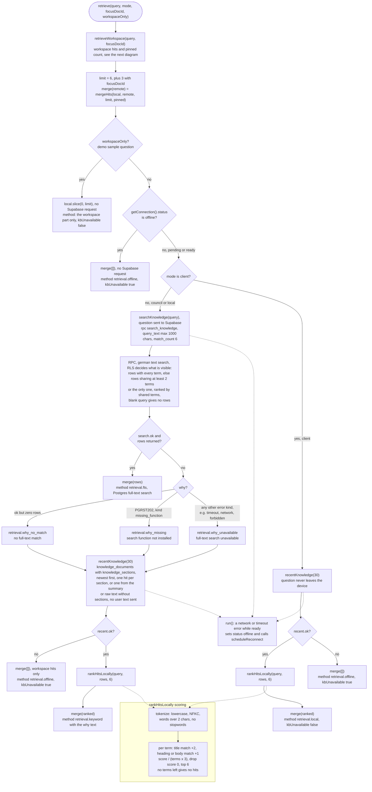
```mermaid
flowchart TD
    Start(["retrieve(query, mode, focusDocId, workspaceOnly)"]) --> Ws["retrieveWorkspace(query, focusDocId)<br/>workspace hits and pinned count, see the next diagram"]
    Ws --> Limit["limit = 6, plus 3 with focusDocId<br/>merge(remote) = mergeHits(local, remote, limit, pinned)"]
    Limit --> Only{"workspaceOnly?<br/>demo sample question"}
    Only -->|"yes"| OnlyHits["local.slice(0, limit), no Supabase request<br/>method: the workspace part only, kbUnavailable false"]
    Only -->|"no"| Off{"getConnection().status<br/>is offline?"}
    Off -->|"yes"| OffHits["merge([]), no Supabase request<br/>method retrieval.offline, kbUnavailable true"]
    Off -->|"no, pending or ready"| ModeChk{"mode is client?"}

    ModeChk -->|"no, council or local"| Fts["searchKnowledge(query), question sent to Supabase<br/>rpc search_knowledge, query_text max 1000 chars, match_count 6"]
    Fts --> Rpc["RPC, german text search, RLS decides what is visible:<br/>rows with every term, else rows sharing at least 2 terms<br/>or the only one, ranked by shared terms,<br/>blank query gives no rows"]
    Rpc --> FtsOk{"search.ok and<br/>rows returned?"}
    FtsOk -->|"yes"| FtsHits["merge(rows)<br/>method retrieval.fts, Postgres full-text search"]
    FtsOk -->|"no"| Why{"why?"}
    Why -->|"ok but zero rows"| WhyNo["retrieval.why_no_match<br/>no full-text match"]
    Why -->|"PGRST202, kind missing_function"| WhyMissing["retrieval.why_missing<br/>search function not installed"]
    Why -->|"any other error kind,<br/>e.g. timeout, network, forbidden"| WhyUnavail["retrieval.why_unavailable<br/>full-text search unavailable"]
    WhyNo --> Recent["recentKnowledge(30)<br/>knowledge_documents with knowledge_sections,<br/>newest first, one hit per section, or one from the summary<br/>or raw text without sections, no user text sent"]
    WhyMissing --> Recent
    WhyUnavail --> Recent
    Recent --> RecentOk{"recent.ok?"}
    RecentOk -->|"no"| Unreach["merge([]), workspace hits only<br/>method retrieval.offline, kbUnavailable true"]
    RecentOk -->|"yes"| RankFb["rankHitsLocally(query, rows, 6)"]
    RankFb --> KwHits["merge(ranked)<br/>method retrieval.keyword with the why text"]

    ModeChk -->|"yes, client"| RecentC["recentKnowledge(30)<br/>question never leaves the device"]
    RecentC --> RecentCOk{"recent.ok?"}
    RecentCOk -->|"yes"| RankC["rankHitsLocally(query, rows, 6)"]
    RankC --> LocalHits["merge(ranked)<br/>method retrieval.local, kbUnavailable false"]
    RecentCOk -->|"no"| NoRank["merge([])<br/>method retrieval.offline, kbUnavailable true"]

    Net["run(): a network or timeout error while ready<br/>sets status offline and calls scheduleReconnect"]
    Fts -.-> Net
    Recent -.-> Net
    RecentC -.-> Net

    subgraph rank["rankHitsLocally scoring"]
        Tok["tokenize: lowercase, NFKC,<br/>words over 2 chars, no stopwords"]
        Score["per term: title match +2, heading or body match +1<br/>score / (terms x 3), drop score 0, top 6<br/>no terms left gives no hits"]
        Tok --> Score
    end
    RankFb -.-> Tok
    RankC -.-> Tok
```

Sources: [`src/js/chat.js`](../src/js/chat.js), [`src/js/retrieval.js`](../src/js/retrieval.js), [`src/js/supabase.js`](../src/js/supabase.js), [`backend/supabase/migrations/20260924120000_search_knowledge_shared_terms.sql`](../backend/supabase/migrations/20260924120000_search_knowledge_shared_terms.sql), [`src/js/demo.js`](../src/js/demo.js), [`src/js/config.js`](../src/js/config.js), [`src/locales/en.json`](../src/locales/en.json)

### Workspace hits and mergeHits: slots per source and the pinned file

searchWorkspace resolves empty without contacting the ingest worker when the workspace has no documents or the query is blank; otherwise the worker returns the BM25 top 6 chunks with a score above 0. Without an attached file every hit is kept in rank order. With one, up to 3 of its matching chunks, or its first 3 chunks (score 0) when none matched, are pinned in front of the hits from other files, and any further chunks of that file are dropped; any worker error drops all workspace hits. mergeHits keeps the pinned hits, then gives the knowledge base the larger of half the remaining slots (rounded up) and the slots the other workspace hits cannot fill, but never more than it has hits, and fills the rest with workspace hits. The order is pinned hits, other workspace hits, knowledge-base hits, so neither source crowds out the other.

<!-- diagram: chat-request-workspace-merge -->
```mermaid
flowchart TD
    Start(["retrieveWorkspace(query, focusDocId)"]) --> Empty{"searchWorkspace(query, 6):<br/>workspace has documents and query not blank?"}
    Empty -->|"no"| None["resolves empty on the main thread<br/>worker not asked"]
    Empty -->|"yes"| Bm25["ingest worker search<br/>BM25 top 6 chunks with score above 0"]
    None --> Focus{"focusDocId set?<br/>a file attached to this question"}
    Bm25 --> Focus
    Focus -->|"no"| Plain["hits = found chunks via workspaceHit<br/>pinned = 0"]
    Focus -->|"yes"| InFile{"any found chunk<br/>from that file?"}
    InFile -->|"yes"| Best["focus = its first 3 found chunks"]
    InFile -->|"no"| Head["focus = firstChunks(focusDocId, 3)<br/>worker head request, score 0"]
    Best --> Pin["hits = focus, then found chunks of other files<br/>pinned = number of focus chunks, at most 3<br/>further chunks of the file are dropped"]
    Head --> Pin
    Bm25 -.->|"worker rejects or crashes"| Fail["console.warn workspace search failed<br/>hits empty, pinned 0"]
    Head -.->|"worker rejects or crashes"| Fail

    Plain --> Merge
    Pin --> Merge
    Fail --> Merge
    Merge(["mergeHits(workspace, knowledge, limit, pinned)"]) --> Kept["kept = first min(pinned, limit) workspace hits<br/>rest = the other workspace hits<br/>room = limit - kept"]
    Kept --> FromKb["fromKnowledge = min(knowledge hits,<br/>max(room - rest, ceil(room / 2)))"]
    FromKb --> FromWs["fromWorkspace = min(rest, room - fromKnowledge)"]
    FromWs --> Out["kept, then the first fromWorkspace of rest,<br/>then the first fromKnowledge knowledge hits"]
    Out --> Ex1["no file, limit 6: 6 workspace and 6 knowledge hits give 3 + 3,<br/>2 workspace hits give 2 + 4,<br/>no knowledge hits give up to 6 workspace hits"]
    Out --> Ex2["attached file, limit 9: 3 pinned, room 6,<br/>3 hits from other files and 6 knowledge hits give 3 + 3 + 3,<br/>no hits from other files give 3 + 6"]
```

Sources: [`src/js/chat.js`](../src/js/chat.js), [`src/js/retrieval.js`](../src/js/retrieval.js), [`src/js/rag/workspace.js`](../src/js/rag/workspace.js), [`src/js/rag/ingest.worker.js`](../src/js/rag/ingest.worker.js), [`src/js/rag/bm25.js`](../src/js/rag/bm25.js), [`src/js/config.js`](../src/js/config.js)

### Answer dispatch, synthesizer fallback, rendering and persistence

The mode captured at submit selects the path: council sends Gemini one prompt without history and falls back to OpenRouter when there is no Gemini key or the Gemini call fails, client loads the WebGPU model interactively (it may ask to download) and streams into its own bubble marked rendered, and local calls the own server at getLlmUrl(). OpenRouter and the own server get shareableHistory: the last 4 turns that are not marked localOnly, so turns from on-device mode, with workspace excerpts or with an attached file are never sent as history. Council and local failures become an empty-text answer with a note unless the request was aborted, in which case the error is rethrown to the submitChat catch; in client mode a generation error always becomes a note, while a model that is not loaded, a blank answer or an abort before generating returns null. A note is shown at once as a chat.provider_failed notice, and a null or empty answer is replaced by synthesizeAnswer with modelAvailable false after a note. The answer is shown, source-checked and added to the conversation only if the session id is unchanged. persistMessage keeps it in localStorage with metadata.local_only when localOnly is set (client mode, any used hit from the workspace, the same usesWorkspace that storeQuestion applied to the question right after retrieval, or an extractive answer whose text contains a workspace file name, which does not change how the question was stored) or when canSyncChats() is false; a failed chat_history insert also falls back to localStorage, without the flag, and such rows are read back as on-device turns.

<!-- diagram: chat-request-answer-dispatch -->
```mermaid
flowchart TD
    Entry(["submitChat after retrieve, storeQuestion(usesWorkspace)<br/>and buildContext: prompt, context, history, signal"]) --> Mode{"mode captured<br/>at submit"}

    subgraph cloud["council: answerWithCloud"]
        GemKey{"hasGeminiKey()?"}
        Gem["callGemini, one prompt without history<br/>buildSystemPrompt target cloud + question"]
        OrKey{"hasOpenRouterKey()?"}
        Or["callOpenRouter<br/>system + shareableHistory + prompt<br/>up to 3 free models, stops on 401 or 403"]
        GemFailed{"Gemini failed<br/>before?"}
        CloudFail["text empty, engine synthesizer<br/>note chat.note_cloud_failed"]
    end

    subgraph client["client: answerWithLocalModel"]
        Ready{"engine.isReady() or<br/>startLocalEngine interactive true?<br/>may confirm a download"}
        Gen["budgetPrompt, removeLoading, createStreamingMessage<br/>engine.generate 512 tokens, temperature 0.2<br/>abort calls engine.interrupt"]
        Fin["stream.finalize with citations and trace<br/>engine client, rendered, element,<br/>deliveredContext = budgeted context"]
        LocalFail["stream.remove, text empty, engine synthesizer<br/>note chat.note_local_failed, also after abort"]
    end

    subgraph server["local: answerWithOwnServer"]
        Srv["callLocalServer(getLlmUrl())<br/>system target server + shareableHistory + prompt"]
        SrvFail["text empty, engine synthesizer<br/>note chat.note_server_failed"]
    end

    Share["shareableHistory: turns without localOnly,<br/>last 4, role and content only"]
    Notice["appendNotice chat.provider_failed_title,<br/>body chat.provider_failed_body with the note"]
    Check{"answer null or<br/>answer.text empty?"}

    Mode -->|"council"| GemKey
    GemKey -->|"yes"| Gem
    GemKey -->|"no"| OrKey
    Gem -->|"throws, not aborted, console.warn"| OrKey
    OrKey -->|"yes"| Or
    OrKey -->|"no"| GemFailed
    GemFailed -->|"yes, Gemini reason"| CloudFail
    Or -->|"throws, not aborted"| CloudFail
    Mode -->|"client"| Ready
    Ready -->|"yes"| Gen
    Gen -->|"non-blank text"| Fin
    Gen -->|"throws"| LocalFail
    Mode -->|"local"| Srv
    Srv -->|"throws, not aborted"| SrvFail
    Share -.-> Or
    Share -.-> Srv

    Gem -->|"text, engine cloud"| Check
    Or -->|"text, engine cloud"| Check
    Srv -->|"text, engine local"| Check
    Fin --> Check
    GemFailed -->|"no key at all, null"| Check
    Ready -->|"not ready, no model or aborted, null"| Check
    Gen -->|"blank text, stream.remove, null"| Check
    CloudFail --> Notice
    LocalFail --> Notice
    SrvFail --> Notice
    Notice --> Check

    Check -->|"yes"| Synth["synthesizeAnswer, engine synthesizer<br/>known titles: workspace file names + knownTitles()<br/>modelAvailable = no note and, in council mode,<br/>a Gemini or OpenRouter key stored"]
    Check -->|"no"| AbortChk{"signal aborted and<br/>not answer.rendered?"}
    Synth --> AbortChk
    AbortChk -->|"yes, throw AbortError"| Catch["catch in submitChat, no answer persisted<br/>storeQuestion(false) is a no-op, question already stored<br/>removeLoading, chat.error_title notice unless<br/>isUserAbort: the error is a DOMException AbortError"]
    Gem -.->|"throws while aborted"| Catch
    Or -.->|"throws while aborted"| Catch
    Srv -.->|"throws while aborted"| Catch
    AbortChk -->|"no"| Trace["splitReasoning, describeTrace with the note<br/>metadata engine, thoughts, duration_ms"]
    Trace --> Names["namesWorkspace: engine synthesizer and the<br/>answer text contains a workspace file name"]
    Names --> SidChk{"sid equals<br/>currentSessionId()?"}
    SidChk -->|"yes, not rendered"| Render["removeLoading, appendMessage assistant<br/>linkifyCitations only for registered labels<br/>citationSources row, engine badge"]
    SidChk -->|"yes, already rendered"| After
    Render --> After["source check, receipt button and<br/>conversation.push, see the next diagram"]
    SidChk -->|"no, user switched chat"| Persist
    After --> Persist["void persistMessage under the original sid<br/>localOnly = mode client, a used hit has workspace,<br/>or a synthesizer answer names a workspace file"]
    Persist --> EmptyChk{"content empty?"}
    EmptyChk -->|"yes"| Skip["nothing stored"]
    EmptyChk -->|"no"| LocalChk{"localOnly or<br/>not canSyncChats()?"}
    LocalChk -->|"yes"| AppendLocal["appendLocal to localStorage starpi_local_chats_v1<br/>metadata.local_only = localOnly, created_at stamped<br/>last 200 messages, newest 10 sessions"]
    LocalChk -->|"no, signedIn and hardened"| Insert["insertChatMessage into chat_history<br/>session_id, role, content, sources, metadata"]
    Insert -->|"error, console.warn"| AppendFail["appendLocal without local_only,<br/>read back later as an on-device turn"]
    Insert -->|"ok"| Status["refreshSyncStatus"]
```

Sources: [`src/js/chat.js`](../src/js/chat.js), [`src/js/prompts.js`](../src/js/prompts.js), [`src/js/synthesizer.js`](../src/js/synthesizer.js), [`src/js/messages.js`](../src/js/messages.js), [`src/js/rag/citations.js`](../src/js/rag/citations.js), [`src/js/chat-store.js`](../src/js/chat-store.js), [`src/js/supabase.js`](../src/js/supabase.js), [`src/js/providers.js`](../src/js/providers.js), [`src/js/engine-ui.js`](../src/js/engine-ui.js), [`src/js/signals.js`](../src/js/signals.js), [`src/js/render.js`](../src/js/render.js), [`src/js/config.js`](../src/js/config.js), [`src/locales/en.json`](../src/locales/en.json)

### After rendering: source check, receipt draft and conversation turns

While the session is unchanged, submitChat takes the rendered message element (the appended bubble, or the streamed bubble of an on-device answer) and, when the answer has a citation scope, runs the source check and adds a receipt button. The check first needs the part of each excerpt that reached the model: extractive answers count every excerpt as delivered in full, and for model answers contextCoverage parses the context that was actually sent (the budgeted context for the on-device model, otherwise the buildContext string) back into its excerpt blocks and marks each excerpt full, partial or omitted. applyGrounding compares the numbers, dates, times, weekdays, codes, quotations and wording of each statement in the rendered answer with the excerpts it cites and shows the result under the answer; a match does not prove a statement correct. A value or name that the check does not find in the excerpts but finds in the question or one of the last user turns is marked from_conversation, a weak verdict; the model's own earlier answers do not count as given. When nothing was compared (the answer is too long, or answer and excerpts are in different languages and no statement was counted), the bar is neutral (grounding-none, a plain shield icon) instead of green. The receipt draft stays in memory, records for a partly delivered excerpt how many of its first characters reached the model (deliveredChars), and becomes an unsigned JSON file only when the user exports it from the receipt dialog: it shows that cited workspace excerpts can be reproduced from the same files, not that the receipt is authentic, what a model saw, or that its reasoning is right. Finally both turns are pushed to the in-memory conversation with localOnly set for client mode, workspace excerpts, an attached file or an extractive answer that names a workspace file.

<!-- diagram: chat-request-source-check -->
```mermaid
flowchart TD
    In(["sid equals currentSessionId()"]) --> El["messageEl = answer.element of a streamed answer,<br/>else the bubble appendMessage returned"]
    El --> Has{"messageEl and a<br/>citation scope?"}
    Has -->|"no, e.g. no used hits"| Push
    Has -->|"yes"| EngChk{"answer.engine is<br/>synthesizer?"}
    EngChk -->|"yes"| Full["every excerpt delivered full,<br/>text = the excerpt as given"]
    EngChk -->|"no, a model answered"| Cov["contextCoverage(citationList,<br/>deliveredContext or context):<br/>finds the EXCERPT n blocks that were sent"]
    Cov --> Blk{"block n found<br/>with text?"}
    Blk -->|"no"| Om["omitted, empty text"]
    Blk -->|"closing fence, text not cut"| Fu["full"]
    Blk -->|"closing fence missing, or text shortened<br/>by buildContext or budgetPrompt, ending in an ellipsis"| Pa["partial, ellipsis removed"]
    Full --> Apply
    Om --> Apply
    Fu --> Apply
    Pa --> Apply
    Apply["applyGrounding(messageEl): scope, sources with label,<br/>doc, heading, delivered text and state,<br/>given = prompt + the user turns among the last 4<br/>history messages, citedOnly for a synthesizer answer"]
    Apply --> Slot{".message-content and .message-provenance<br/>present and sources not empty?"}
    Slot -->|"no"| NoRep["report null, nothing shown"]
    Slot -->|"yes"| Ground["groundAnswer on the rendered blocks: numbers, dates,<br/>times, weekdays, codes, quotations and wording<br/>of each statement against its cited excerpts<br/>over 20000 chars or 300 statements: skipped, too_long"]
    Ground --> Show{"any statement counted,<br/>unchecked or skipped?"}
    Show -->|"no"| Quiet["report returned, no bar"]
    Show -->|"yes"| Bar["details bar replaces the content of .message-provenance:<br/>review, partial or ok color and shield icon, neutral<br/>grounding-none with a plain shield when nothing was compared,<br/>grounding.title with grounding.summary ok of total,<br/>grounding.too_long or grounding.only_unchecked,<br/>badges to review and partly, flagged statements,<br/>grounding.disclaimer, opened when one is unsupported,<br/>unsupported statements highlighted"]
    NoRep --> Draft
    Quiet --> Draft
    Bar --> Draft
    Draft["storeReceiptDraft: createdAt, APP_VERSION, answer text,<br/>engine and locale, question, grounding report,<br/>citations with delivered state, deliveredChars<br/>for a partly delivered excerpt, workspace file<br/>and text SHA-256 and chunk offsets"]
    Draft --> Mem[("in-memory Map, ids r1, r2 and so on<br/>at most 50 drafts, never stored")]
    Draft --> Btn["receiptButton(id) appended to .message-provenance<br/>data-action open-receipt, then refreshIcons"]
    Btn -.->|"export in the receipt dialog"| Json["buildReceipt: unsigned JSON starpi.receipt/v1,<br/>id from a hash of its body,<br/>at most 20 reasons per statement"]
    Btn --> Push
    Push["conversation.push user turn, first 4000 chars,<br/>and assistant turn, both with localOnly =<br/>mode client, usesWorkspace, namesWorkspace<br/>or a file attached"]
    Push --> Out(["persistMessage follows, see the previous diagram"])
```

Sources: [`src/js/chat.js`](../src/js/chat.js), [`src/js/core/grounding.js`](../src/js/core/grounding.js), [`src/js/rag/grounding-view.js`](../src/js/rag/grounding-view.js), [`src/js/rag/receipts.js`](../src/js/rag/receipts.js), [`src/js/core/receipt.js`](../src/js/core/receipt.js), [`src/js/messages.js`](../src/js/messages.js), [`src/locales/en.json`](../src/locales/en.json)

### synthesizeAnswer: the extractive fallback

synthesizeAnswer never generates text: it builds Markdown from the used hits and their citations. Its document list joins the titles of the used hits with the known titles (workspace file names plus knownTitles(), which calls listDocuments unless the connection is offline and caches the titles for 60 s only after a successful read) and shows up to 8 of them followed by "and n more". A greeting-only message gets synth.greeting with that list, and a request for the list itself (DOC_LIST_REQUEST, such as "Which documents are available?") gets the list, or the unreachable text when the knowledge base could not be searched and no title is known. Otherwise it quotes up to 4 sentences that share a search term with the question, each with the label of its excerpt; the last sentence of an excerpt cut at 1600 chars is left out. When no sentence shares a term (for example "Summarize the attached file"), it quotes the first 2 quotable sentences of each passage, at most 4, the attached file first. Only when nothing is quotable does it answer with the unreachable or the no-hits text. When modelAvailable is false, every answer ends with synth.footer_no_model.

<!-- diagram: chat-request-synthesizer -->
```mermaid
flowchart TD
    In(["synthesizeAnswer(query, hits, citations, knownTitles,<br/>modelAvailable, kbUnavailable, focusName)"]) --> Titles["document list: titles of the hits + known titles, unique<br/>shows 8, then synth.more_documents<br/>empty: synth.kb_unavailable_short when kbUnavailable,<br/>else synth.no_documents"]
    Titles --> Greet{"isGreeting(query)?<br/>only a greeting, or who are you,<br/>what can you do"}
    Greet -->|"yes"| GreetOut["synth.greeting,<br/>synth.available_documents and the list"]
    Greet -->|"no"| DocList{"DOC_LIST_REQUEST?<br/>e.g. Which documents are available?"}
    DocList -->|"yes"| DocUnav{"kbUnavailable and<br/>no title known?"}
    DocUnav -->|"yes"| Unav["synth.kb_unavailable_heading<br/>and synth.kb_unavailable_body"]
    DocUnav -->|"no"| DocOut["synth.documents_heading with the count,<br/>then the list"]
    DocList -->|"no"| Quot["quotable text per hit: the excerpt as given,<br/>an excerpt cut at 1600 chars loses its last sentence"]
    Quot --> Facts["extractSentences(query, quotable, 4):<br/>sentences of 16 to 399 chars with at least 5 words,<br/>no lower-case fragment at a workspace chunk start,<br/>scored by shared query terms, best first"]
    Facts --> HasFacts{"any sentence shares<br/>a term?"}
    HasFacts -->|"yes"| FactsOut["synth.facts_heading, one line per sentence:<br/>document title, sentence, excerpt label"]
    HasFacts -->|"no"| Open["first 2 quotable sentences per passage,<br/>at most 4, the attached file first"]
    Open --> HasOpen{"any sentence?"}
    HasOpen -->|"yes, file attached"| FileOut["synth.file_heading with the file name,<br/>lines with excerpt labels"]
    HasOpen -->|"yes, no file"| Closest["synth.closest_heading, synth.closest_note,<br/>lines with excerpt labels"]
    HasOpen -->|"no"| KbChk{"kbUnavailable?"}
    KbChk -->|"yes"| Unav
    KbChk -->|"no"| NoHits["synth.no_hits_heading, synth.no_hits_body,<br/>synth.available_documents and the list"]
    Done(["Markdown, engine synthesizer<br/>modelAvailable false: synth.footer_no_model appended"])
    GreetOut --> Done
    DocOut --> Done
    Unav --> Done
    FactsOut --> Done
    FileOut --> Done
    Closest --> Done
    NoHits --> Done
```

Sources: [`src/js/synthesizer.js`](../src/js/synthesizer.js), [`src/js/chat.js`](../src/js/chat.js), [`src/js/retrieval.js`](../src/js/retrieval.js), [`src/js/core/sentences.js`](../src/js/core/sentences.js), [`src/js/supabase.js`](../src/js/supabase.js), [`src/locales/en.json`](../src/locales/en.json)

### Answer modes: what leaves the device

Every mode first runs BM25 over the on-device workspace in the ingest worker when it holds files. Unless the question is a demo sample question or the connection is offline, council and own-server mode then send the question (first 1000 chars) to the Supabase search_knowledge RPC and fall back to recentKnowledge(30) on zero rows or an error, while client mode only fetches the 30 newest documents without the question and ranks them in the browser; a greeting-only message goes through the same retrieval before its excerpts are dropped. The excerpts, workspace excerpts included, go to Gemini (no history) or OpenRouter in council mode and to the own server (no key) in own-server mode; OpenRouter and the own server also get the last 4 history turns not marked localOnly. Client mode keeps everything in the WebLLM worker and only downloads model files. Every failure except a user abort falls back to the extractive synthesizer, which may read document titles with listDocuments. The question is stored once retrieval shows whether workspace excerpts are used and stays in localStorage in client mode, with an attached file or when a used excerpt came from the workspace (a turn that fails before that uses the first two rules only); the answer stays local in client mode, when a used excerpt came from the workspace or when an extractive answer contains a workspace file name (a greeting or document list, whose question may still be synced), so a workspace turn never reaches chat_history. Everything else goes to chat_history only when canSyncChats() is true and the insert succeeds, otherwise to localStorage. Source-check results and receipt drafts stay in memory.

<!-- diagram: modes-privacy-data-egress -->
```mermaid
flowchart TD
    Ask(["submitChat: question trimmed to 8000 chars<br/>mode = getMode(), stored in starpi_compute_mode"])
    UserTurn{"storeQuestion(usesWorkspace), question localOnly?<br/>client mode, a file attached,<br/>or any used excerpt from the workspace"}
    Skip{"demo sample question,<br/>or connection offline?"}
    RetMode{"retrieve(): mode is client?"}
    Ctx["mergeHits + assignCitations + buildContext<br/>at most 6 hits, 9 with an attachment, both sources keep slots<br/>excerpt max 1600 chars, context max 9000 chars<br/>a greeting-only message uses no excerpts"]
    Dispatch{"answer path by mode"}
    CKeys{"hasGeminiKey()?<br/>else hasOpenRouterKey()?"}
    Abort(["Stop pressed before a rendered answer:<br/>error to the submitChat catch,<br/>answer not shown or persisted"])
    Persist{"answer localOnly?<br/>client mode, any used excerpt<br/>came from the workspace, or a synthesizer<br/>answer names a workspace file"}
    Sync{"not localOnly: canSyncChats()?<br/>signed in and hardened schema"}

    subgraph dev["Stays in this browser"]
        WsSearch["retrieveWorkspace: BM25 in the ingest worker, every mode<br/>an attached file pins up to 3 chunks<br/>worker error: no workspace hits"]
        Keys[("provider keys<br/>readSecret: sessionStorage, then localStorage")]
        Hist["shareableHistory: last 4 turns<br/>not marked localOnly"]
        LGen["client: WebLLM worker on WebGPU<br/>budgeted excerpts + last 4 history messages<br/>+ question stay in the browser"]
        Synth["synthesizeAnswer: extractive quotes<br/>with citation labels, no model"]
        Check["source check and receipt draft,<br/>in memory only"]
        LS[("localStorage<br/>starpi_local_chats_v1")]
    end

    subgraph net["Sent over the network"]
        FTS["Supabase rpc search_knowledge<br/>question as query_text, first 1000 chars<br/>match_count 6"]
        Recent["Supabase recentKnowledge(30)<br/>30 newest documents, question not sent<br/>rankHitsLocally in the browser"]
        Gem["council: Gemini gemini-2.5-flash generateContent<br/>one user part: system + excerpts incl. workspace<br/>+ question, no chat history"]
        OR["council: OpenRouter chat/completions<br/>system + excerpts incl. workspace<br/>+ shareable history + question"]
        Srv["local: own server getLlmUrl()/chat/completions<br/>system + excerpts incl. workspace<br/>+ shareable history + question, no key<br/>GET /models first while no model id is known"]
        HF["WebLLM model files: huggingface.co weights,<br/>raw.githubusercontent.com wasm<br/>only when not cached, after a confirm, no user text"]
        Titles["Supabase listDocuments, no question sent<br/>skipped while offline, titles cached 60 s"]
        CH[("Supabase chat_history insert")]
    end

    Ask --> WsSearch --> Skip
    Skip -->|"yes: no Supabase search"| Ctx
    Skip -->|"no"| RetMode
    RetMode -->|"no, council or local"| FTS
    RetMode -->|"yes"| Recent
    FTS -->|"rows found"| Ctx
    FTS -.->|"zero rows or error"| Recent
    Recent -->|"ranked hits, none if it fails"| Ctx
    WsSearch -->|"workspace excerpts"| Ctx
    Ctx -->|"after retrieval and the greeting check,<br/>before assignCitations"| UserTurn
    Ask -.->|"turn throws before that:<br/>catch runs storeQuestion(false)"| UserTurn
    UserTurn -->|"yes"| LS
    UserTurn -->|"no"| Sync
    Ctx --> Dispatch
    Dispatch -->|"council"| CKeys
    Dispatch -->|"client"| LGen
    Dispatch -->|"local"| Srv
    CKeys -->|"Gemini key"| Gem
    CKeys -->|"only OpenRouter key"| OR
    CKeys -->|"no key"| Synth
    Gem -.->|"fails, OpenRouter key set"| OR
    Gem -.->|"fails, no OpenRouter key"| Synth
    OR -.->|"all attempts fail,<br/>or HTTP 401 or 403"| Synth
    Hist -.->|"history"| OR
    Hist -.->|"history"| Srv
    HF -.->|"only when not cached"| LGen
    LGen -.->|"not loaded, declined,<br/>empty or throws"| Synth
    Srv -.->|"throws, not aborted"| Synth
    Keys -.->|"Gemini key only,<br/>x-goog-api-key header"| Gem
    Keys -.->|"OpenRouter key only,<br/>Authorization Bearer"| OR
    Synth -.->|"known titles"| Titles
    Dispatch -.->|"user abort"| Abort
    Dispatch -.->|"answer with citations,<br/>same session"| Check
    Gem --> Persist
    OR --> Persist
    LGen --> Persist
    Srv --> Persist
    Synth --> Persist
    Persist -->|"yes"| LS
    Persist -->|"no"| Sync
    Sync -->|"yes"| CH
    Sync -->|"no"| LS
    CH -.->|"insert fails"| LS
```

Sources: [`src/js/chat.js`](../src/js/chat.js), [`src/js/retrieval.js`](../src/js/retrieval.js), [`src/js/rag/workspace.js`](../src/js/rag/workspace.js), [`src/js/providers.js`](../src/js/providers.js), [`src/js/supabase.js`](../src/js/supabase.js), [`src/js/chat-store.js`](../src/js/chat-store.js), [`src/js/storage.js`](../src/js/storage.js), [`src/js/config.js`](../src/js/config.js), [`src/js/state.js`](../src/js/state.js), [`src/js/webgpu/engine.js`](../src/js/webgpu/engine.js), [`src/js/engine-ui.js`](../src/js/engine-ui.js), [`src/js/rag/receipts.js`](../src/js/rag/receipts.js), [`src/js/demo.js`](../src/js/demo.js)

### Council mode: Gemini then OpenRouter failover

answerWithCloud tries Gemini 2.5 Flash first when a Gemini key exists; on any failure that is not a user abort (HTTP error, empty answer, 20 s timeout, network) it keeps the reason, with provider and model names replaced by sanitizeModelNames and cut to 160 chars, and continues with OpenRouter if an OpenRouter key is set. callOpenRouter tries up to 3 free models in a fixed order, moves on after empty answers and most errors, and stops early on HTTP 401 or 403; when every attempt fails the answer is empty with the note chat.note_cloud_failed and the OpenRouter reason. Without an OpenRouter key a failed Gemini call gives the same note with the Gemini reason, so only a council turn with no key at all returns null. A note appears in a chat.provider_failed notice above the answer and in the answer trace. In all these cases submitChat falls back to synthesizeAnswer with modelAvailable false, so the answer ends with synth.footer_no_model. After Stop the error is rethrown and no answer is persisted; the submitChat catch stays silent only for a DOMException AbortError, so Stop pressed during retrieval with only an OpenRouter key, where the model loop never starts, shows chat.error_title with provider.cloud_unreachable.

<!-- diagram: modes-privacy-cloud-failover -->
```mermaid
flowchart TD
    Start(["answerWithCloud: system = buildSystemPrompt<br/>target cloud, excerpts in the context block<br/>geminiFailure = null"])
    GK{"hasGeminiKey()?"}
    GCall["callGemini: POST v1beta/models/gemini-2.5-flash:generateContent<br/>one user part: system + question, no history<br/>x-goog-api-key header, timeout 20 s"]
    GOk{"res.ok and<br/>candidate text?"}
    GAb{"req.signal.aborted?"}
    GWarn["geminiFailure = sanitizeModelNames(message),<br/>first 160 chars, console.warn:<br/>Gemini failed, trying the next provider"]
    OK{"hasOpenRouterKey()?"}
    GF{"geminiFailure set?"}
    Null(["return null, no note<br/>no key at all"])
    Loop["callOpenRouter: OPENROUTER_MODELS,<br/>at most 3 attempts in order<br/>liquid/lfm-2.5-2.6b:free, openrouter/free,<br/>nvidia/nemotron-3.5-lightning:free"]
    LAb{"signal aborted<br/>before the attempt?"}
    Post["POST openrouter.ai/api/v1/chat/completions<br/>Authorization Bearer key, HTTP-Referer, X-Title<br/>system + shareableHistory + question<br/>temperature 0.5, max_tokens 1024, timeout 20 s"]
    ROk{"res.ok?"}
    HttpErr["httpError: ProviderError<br/>HTTP status [model]: message"]
    Txt{"choices[0].message.content<br/>not empty?"}
    Empty["lastErr = empty answer [model]"]
    CatchAb{"signal aborted?"}
    Auth{"ProviderError with<br/>status 401 or 403?"}
    Warn["lastErr = err, console.warn,<br/>try the next model"]
    Next{"another model left?"}
    Throw["throw lastErr, or<br/>provider.cloud_unreachable"]
    OAb{"req.signal.aborted?"}
    Cloud(["answer engine cloud"])
    Note(["text empty, engine synthesizer<br/>note chat.note_cloud_failed with the OpenRouter<br/>or Gemini reason, sanitized, max 160 chars"])
    Rethrow(["rethrow to the submitChat catch, no answer persisted<br/>a DOMException AbortError shows no notice,<br/>any other error chat.error_title, e.g. Stop during<br/>retrieval with only an OpenRouter key:<br/>provider.cloud_unreachable"])
    Synth(["submitChat: appendNotice chat.provider_failed_title<br/>when there is a note, then synthesizeAnswer<br/>modelAvailable false: synth.footer_no_model"])

    Start --> GK
    GK -->|"yes"| GCall
    GK -->|"no"| OK
    GCall --> GOk
    GOk -->|"yes"| Cloud
    GOk -->|"no: HTTP error, empty,<br/>timeout or network"| GAb
    GAb -->|"yes"| Rethrow
    GAb -->|"no"| GWarn --> OK
    OK -->|"no"| GF
    GF -->|"yes"| Note
    GF -->|"no"| Null
    OK -->|"yes"| Loop --> LAb
    LAb -->|"no"| Post
    LAb -->|"yes"| Throw
    Post --> ROk
    ROk -->|"no"| HttpErr
    ROk -->|"yes"| Txt
    Txt -->|"yes"| Cloud
    Txt -->|"no"| Empty --> Next
    HttpErr --> CatchAb
    Post -.->|"fetch or res.json throws,<br/>timeout or network"| CatchAb
    CatchAb -->|"yes"| Rethrow
    CatchAb -->|"no"| Auth
    Auth -->|"yes, stop early"| Throw
    Auth -->|"no"| Warn --> Next
    Next -->|"yes"| LAb
    Next -->|"no"| Throw
    Throw --> OAb
    OAb -->|"yes"| Rethrow
    OAb -->|"no"| Note
    Note --> Synth
    Null --> Synth
```

Sources: [`src/js/chat.js`](../src/js/chat.js), [`src/js/providers.js`](../src/js/providers.js), [`src/js/config.js`](../src/js/config.js), [`src/js/signals.js`](../src/js/signals.js), [`src/js/synthesizer.js`](../src/js/synthesizer.js), [`src/js/render.js`](../src/js/render.js), [`src/locales/en.json`](../src/locales/en.json)

### Settings: server URL rules and key storage

saveSettings first validates the own-server URL with normalizeServerUrl: it must parse, use https unless it is http on localhost or 127.0.0.1 (exactly the plain-http hosts the vercel.json CSP connect-src allows, so http://[::1] is rejected), and carry no credentials; hash and query are removed and trailing slashes stripped, and any violation shows an alert and saves nothing. The remember toggle (starpi_remember_keys) decides where keys go: writeSecret deletes a key from both stores and writes it to localStorage when remembered, otherwise to sessionStorage for this tab only, flipping the toggle moves already stored keys, readSecret checks sessionStorage first and clear-keys removes both keys from both stores. The connection tests use a key typed into the field as typed, without storing it. A changed model preference unloads a non-idle engine before changeEngine applies the mode; after that finishes, the saved toast appears only when every storage write, the mode included, returned true, otherwise settings.save_failed. A stored URL is validated again on every own-server request, and probeLocalServer remembers the first model id the server lists, which callLocalServer then sends as model.

<!-- diagram: modes-privacy-settings-storage -->
```mermaid
flowchart TD
    Save(["save-settings: saveSettings()"])
    Parse{"normalizeServerUrl(cfgLlmUrl)<br/>new URL(value.trim()) parses?"}
    Proto{"protocol https:, or http: with hostname<br/>localhost or 127.0.0.1?<br/>the plain-http hosts of the CSP connect-src"}
    Cred{"username or password<br/>in the URL?"}
    Clean["clear hash and search,<br/>strip trailing slashes"]
    Bad["window.alert provider.invalid_url,<br/>provider.insecure_url or provider.credentials_in_url<br/>focus the field, nothing is saved"]
    SetUrl["setLlmUrl(url): localStorage starpi_llm_url<br/>value used when never saved: http://localhost:8000/v1<br/>returns whether it was stored"]
    Remember["remember = cfgRememberKeys checked<br/>writeLocal starpi_remember_keys 1 or 0"]
    Each["for starpi_gemini_key and starpi_openrouter_key"]
    Typed{"key typed<br/>in the field?"}
    Flip{"key already stored and<br/>remember toggle changed?"}
    Keep["stored key, if any, unchanged"]
    Write["writeSecret(key, value, remember)<br/>removeSecret from both stores first<br/>false when the store is missing or refuses"]
    RemChk{"remember?"}
    LSk[("localStorage<br/>kept across browser restarts")]
    SSk[("sessionStorage<br/>this tab only")]
    Hints["after both keys: fields cleared,<br/>renderKeyHints shows only the last 4 characters"]
    Pref["setModelPreference(cfgWebgpuModel)<br/>preference changed and engine not idle: unloadModel()"]
    Engine["await changeEngine(mode, interactive true)<br/>local mode: probeLocalServer GET url/models, 4 s,<br/>remembers the first listed model id,<br/>status.server_unreachable when it fails<br/>client mode: may load the model first<br/>resolves with whether setMode stored the mode"]
    AllOk{"every write returned true?<br/>URL, remember flag, keys,<br/>model preference, mode"}
    Saved(["alert settings.saved_toast"])
    SaveFail(["alert settings.save_failed<br/>storage missing, blocked or full"])
    Read["readSecret: sessionStorage first,<br/>then localStorage"]
    Use["hasGeminiKey, hasOpenRouterKey,<br/>callGemini, callOpenRouter<br/>connection tests: a typed key is used as typed"]
    Clear(["clear-keys: removeSecret for both keys in both stores<br/>renderKeyHints, renderPrivacyNotice,<br/>alert settings.keys_cleared"])
    PerCall["stored URL is not validated at load, so<br/>callLocalServer and probeLocalServer run<br/>normalizeServerUrl again on every request<br/>invalid: note chat.note_server_failed and<br/>the synthesizer answers, probe is false"]

    Save --> Parse
    Parse -->|"no"| Bad
    Parse -->|"yes"| Proto
    Proto -->|"no"| Bad
    Proto -->|"yes"| Cred
    Cred -->|"yes"| Bad
    Cred -->|"no"| Clean --> SetUrl --> Remember --> Each --> Typed
    Typed -->|"yes"| Write
    Typed -->|"no"| Flip
    Flip -->|"yes, move it"| Write
    Flip -->|"no"| Keep
    Write --> RemChk
    RemChk -->|"yes"| LSk
    RemChk -->|"no"| SSk
    Keep --> Hints
    LSk --> Hints
    SSk --> Hints
    Hints --> Pref --> Engine --> AllOk
    AllOk -->|"yes"| Saved
    AllOk -->|"no"| SaveFail
    SetUrl -.-> PerCall
    LSk -.-> Read
    SSk -.-> Read
    Read --> Use
    Clear -.->|"removes"| LSk
    Clear -.->|"removes"| SSk
```

Sources: [`src/js/settings.js`](../src/js/settings.js), [`src/js/providers.js`](../src/js/providers.js), [`src/js/storage.js`](../src/js/storage.js), [`src/js/state.js`](../src/js/state.js), [`src/js/config.js`](../src/js/config.js), [`src/js/chat.js`](../src/js/chat.js), [`vercel.json`](../vercel.json)

### Privacy notice under the chat input

renderPrivacyNotice chooses the footer from the mode alone, plus in council mode whether any provider key is stored, and re-renders on settings init, every changeEngine, clear-keys and every Supabase connection update: each connect attempt, the automatic reconnects after an offline result and the switch to offline after a failed request. Every notice says where the question goes: nowhere in on-device mode, and to the knowledge-base search in the other three, plus the own server or the cloud provider. Outside on-device mode, a second line, privacy.history_synced, says that questions and answers are saved to the private chat history whenever canSyncChats() is true. The texts do not mention the exceptions: a demo sample question or an offline connection skips the knowledge-base search, and turns that use workspace excerpts, like extractive answers that name workspace files, stay in the browser. When chats stay in the browser no line says so; privacy.history_local exists in the dictionaries but no code renders it.

<!-- diagram: modes-privacy-notice -->
```mermaid
flowchart TD
    Trig(["renderPrivacyNotice() fills the privacyNotice footer<br/>on initSettings, every changeEngine, clear-keys<br/>and every Supabase connection update,<br/>reconnect attempts and the switch to offline included"])
    Mode{"getMode()"}
    NLocal["client: lock icon, privacy.local<br/>your question and the model<br/>stay on this device"]
    NServer["local: server icon, privacy.server<br/>your question goes to host<br/>and to the knowledge-base search<br/>host = new URL(getLlmUrl()).host, a dash if unparsable"]
    Keys{"council: hasGeminiKey()<br/>or hasOpenRouterKey()?"}
    NCloud["cloud icon, privacy.cloud<br/>your question goes to the knowledge-base search,<br/>and with matching excerpts to your provider"]
    NExt["library icon, privacy.extractive<br/>question goes to the knowledge-base search,<br/>answers quote it directly"]
    SyncChk{"canSyncChats()?<br/>signed in and hardened schema"}
    Hist["second line privacy.history_synced:<br/>questions and answers are saved to your<br/>private chat history, delete it in Settings"]
    NoHist["no history line,<br/>privacy.history_local is never rendered"]
    RLocal["requests: recentKnowledge(30) unless offline<br/>or a sample question, model files when not cached,<br/>listDocuments for the synthesizer,<br/>none carries the question, chats stay local"]
    RServer["requests: search_knowledge with the question<br/>unless offline or a sample question, GET /models<br/>while no model id is known, own server with<br/>question, excerpts and shareable history,<br/>listDocuments when the synthesizer answers,<br/>chat_history except turns with workspace excerpts<br/>and extractive answers naming workspace files"]
    RCloud["requests: search_knowledge with the question<br/>unless offline or a sample question, Gemini or OpenRouter<br/>with question and excerpts, OpenRouter also history,<br/>listDocuments when the synthesizer answers,<br/>chat_history except turns with workspace excerpts<br/>and extractive answers naming workspace files"]
    RExt["requests: search_knowledge with the question<br/>unless offline or a sample question, listDocuments,<br/>chat_history except turns with workspace excerpts<br/>and extractive answers naming workspace files"]

    Trig --> Mode
    Mode -->|"client"| NLocal
    Mode -->|"local"| NServer
    Mode -->|"council"| Keys
    Keys -->|"yes"| NCloud
    Keys -->|"no"| NExt
    NLocal --> NoHist
    NServer --> SyncChk
    NCloud --> SyncChk
    NExt --> SyncChk
    SyncChk -->|"yes"| Hist
    SyncChk -->|"no"| NoHist
    NLocal -.->|"actual requests"| RLocal
    NServer -.->|"actual requests"| RServer
    NCloud -.->|"actual requests"| RCloud
    NExt -.->|"actual requests"| RExt
```

Sources: [`src/js/settings.js`](../src/js/settings.js), [`src/locales/en.json`](../src/locales/en.json), [`src/js/main.js`](../src/js/main.js), [`src/js/chat.js`](../src/js/chat.js), [`src/js/chat-store.js`](../src/js/chat-store.js), [`src/js/supabase.js`](../src/js/supabase.js), [`src/js/state.js`](../src/js/state.js), [`src/js/demo.js`](../src/js/demo.js)

### On-device model selection

A manual preference always wins (unknown stored values become auto); in auto mode, mobile devices (userAgentData.mobile, else a user-agent regex) get Llama 3.2 1B, Qwen 2.5 3B needs maxBufferSize of at least 1 GiB and navigator.deviceMemory of at least 8 GB, Qwen 2.5 1.5B is picked when the buffer is large enough but the memory is hidden, and everything else gets Llama 3.2 1B. Adapters with shader-f16 load the q4f16_1 build, others the q4f32_1 build, and only a non-mobile qwen-3b gets a 4096-token context window (prefill chunk 512), every other choice 2048 (prefill 128 on mobile, else 256). The 700, 1000 and 1900 MB figures are the catalogue download estimates used for the confirm dialog and the 1.2x quota check, while the VRAM badge shows WebLLM vram_required_MB for the chosen build (values from the pinned @mlc-ai/web-llm 0.2.85). The same modelId reuses the loaded engine. A model that is certainly not cached is settled before anything is torn down or the WebLLM library is imported: a start-up load resolves false, an interactive one checks the quota, asks, and requests persistent storage; a partly cached model gets the same consent after the import. A declined download resolves false, and every error ends in status error with a notice from startLocalEngine unless the load was cancelled.

<!-- diagram: model-selection-choose-model -->
```mermaid
flowchart TD
    SetPref["save-settings: setModelPreference(cfgWebgpuModel)<br/>auto, llama-1b, qwen-1.5b or qwen-3b<br/>preference changed and engine not idle: unloadModel()"]
    Pref["preference = normalizePreference(starpi_webgpu_model)<br/>unknown or removed values become auto"]
    Start(["startLocalEngine: loadModel with getModelPreference()<br/>mode restore at boot: onlyIfCached, no download<br/>chat answer, benchmark, mode change: interactive"])
    Probe{"probeWebGPU: navigator.gpu present and<br/>requestAdapter high-performance returns an adapter?"}
    Unsup["EngineError unsupported or no-adapter"]
    HW["HardwareProfile<br/>deviceMemoryGB = navigator.deviceMemory, else null<br/>maxBufferSize = adapter.limits.maxBufferSize<br/>hasF16 = adapter.features has shader-f16"]
    MobQ{"detectMobile: userAgentData.mobile<br/>is a boolean?"}
    MobUAD["isMobile = userAgentData.mobile"]
    MobUA["isMobile = userAgent matches Android,<br/>iPhone, iPad, iPod or Mobile, any case"]
    PrefQ{"chooseModel: preference is auto?"}
    Manual["key = preference, reason manual<br/>no hardware check for the key"]
    IsMob{"isMobile?"}
    Big{"maxBufferSize at least 1 GiB<br/>and deviceMemoryGB at least 8?"}
    Unk{"maxBufferSize at least 1 GiB<br/>and deviceMemoryGB null?"}
    L1["llama-1b: Llama 3.2 1B<br/>approxDownloadMB 700<br/>WebLLM VRAM f16 879 MB, f32 1129 MB"]
    Q15["qwen-1.5b: Qwen 2.5 1.5B<br/>approxDownloadMB 1000<br/>WebLLM VRAM f16 1630 MB, f32 1889 MB"]
    Q3["qwen-3b: Qwen 2.5 3B<br/>approxDownloadMB 1900<br/>WebLLM VRAM f16 2505 MB, f32 2894 MB"]
    F16{"hasF16?"}
    Id16["modelId = spec.f16, a q4f16_1 build<br/>e.g. Qwen2.5-3B-Instruct-q4f16_1-MLC"]
    Id32["modelId = spec.f32, a q4f32_1 build<br/>e.g. Qwen2.5-3B-Instruct-q4f32_1-MLC"]
    Large{"large: key is qwen-3b<br/>and not mobile?"}
    Ctx4["chatOptions: context_window_size 4096<br/>prefill_chunk_size 512"]
    Ctx2["chatOptions: context_window_size 2048<br/>prefill_chunk_size 128 on mobile, else 256"]
    Same{"engine loaded with<br/>the same modelId?"}
    Reuse(["reuse it, resolve true"])
    Missing{"certainlyNotCached(modelId)?<br/>Cache API webllm/model has<br/>no tensor-cache.json for it"}
    Silent(["resolve false, state unchanged,<br/>WebLLM library not imported"])
    Agree["agreeToDownload: checkQuota needs<br/>1.2 x approxDownloadMB free when the quota is known,<br/>confirmDownload with approxDownloadMB,<br/>then navigator.storage.persist, best effort"]
    Load["teardown, status loading, import web-llm<br/>modelId not in prebuiltAppConfig: EngineError unknown"]
    Partial{"not certainly missing, but<br/>hasModelInCache false?<br/>index cached, shards missing"}
    Declined(["status idle, resolve false"])
    Create["CreateWebWorkerMLCEngine(worker, modelId,<br/>initProgressCallback, chatOptions)"]
    Ready(["status ready, vramMB = round(record.vram_required_MB)<br/>badge engine.vram_ready: label, f16 or f32,<br/>about vramMB / 1024 GB VRAM<br/>engine.vram_ready_no_size without a size"])
    Fail(["loadModel catch: teardown, status error, rethrow<br/>startLocalEngine: notice engine.error.kind<br/>unless cancelled, resolves false"])

    SetPref --> Pref --> Start --> Probe
    Probe -->|"no"| Unsup --> Fail
    Probe -->|"yes"| HW --> MobQ
    MobQ -->|"yes"| MobUAD
    MobQ -->|"no"| MobUA
    MobUAD --> PrefQ
    MobUA --> PrefQ
    PrefQ -->|"no"| Manual
    PrefQ -->|"yes"| IsMob
    IsMob -->|"yes"| L1
    IsMob -->|"no"| Big
    Big -->|"yes"| Q3
    Big -->|"no"| Unk
    Unk -->|"yes, memory hidden"| Q15
    Unk -->|"no: under 8 GB or<br/>maxBufferSize under 1 GiB"| L1
    Manual --> F16
    L1 --> F16
    Q15 --> F16
    Q3 --> F16
    F16 -->|"yes"| Id16
    F16 -->|"no"| Id32
    Id16 --> Large
    Id32 --> Large
    Large -->|"yes"| Ctx4
    Large -->|"no"| Ctx2
    Ctx4 --> Same
    Ctx2 --> Same
    Same -->|"yes"| Reuse
    Same -->|"no"| Missing
    Missing -->|"yes, onlyIfCached"| Silent
    Missing -->|"yes, interactive"| Agree
    Agree -->|"agreed"| Load
    Agree -.->|"declined"| Silent
    Agree -.->|"quota too small"| Fail
    Missing -->|"no, or not known"| Load
    Load --> Partial
    Partial -->|"yes: onlyIfCached,<br/>or agreeToDownload declined"| Declined
    Partial -->|"no, or agreed"| Create
    Partial -.->|"quota too small"| Fail
    Load -.->|"import fails: code-download,<br/>not in the build: unknown"| Fail
    Create --> Ready
    Create -.->|"network, quota, device-lost,<br/>out-of-memory or other error"| Fail
```

Sources: [`src/js/webgpu/models.js`](../src/js/webgpu/models.js), [`src/js/webgpu/engine.js`](../src/js/webgpu/engine.js), [`src/js/engine-ui.js`](../src/js/engine-ui.js), [`src/js/state.js`](../src/js/state.js), [`src/js/settings.js`](../src/js/settings.js), [`src/js/chat.js`](../src/js/chat.js), [`src/js/bench/bench-ui.js`](../src/js/bench/bench-ui.js), [`src/js/config.js`](../src/js/config.js), [`src/index.html`](../src/index.html), [`package.json`](../package.json)

### On-device prompt budgeting

budgetPrompt reserves 512 output tokens plus 128 tokens of chat-template overhead and converts the rest of the context window to characters at 3 chars per token (4224 chars for a 2048 window, 10368 for 4096). It trims in a fixed order: system instructions up to 15% (594 en or 623 de chars, never cut), the question up to 35% of what is left, the retrieved context up to 80% of what is left, then history from the newest message backwards, each capped at 600 chars, until one no longer fits. The on-device model gets the last 4 history messages, on-device turns included. The budgeted instructions plus contextSection, whose header is not counted, form one system message, followed by the kept history and the question, generated with 512 max tokens at temperature 0.2. Cutting the context can remove closing excerpt fences; the budgeted context is returned as deliveredContext, so the source check marks cut excerpts partial and dropped ones omitted. A model that is not ready or an empty answer falls back to the extractive synthesizer, and an error does too after a chat.provider_failed notice.

<!-- diagram: model-selection-prompt-budget -->
```mermaid
flowchart TD
    In(["answerWithLocalModel"])
    Ready{"engine.isReady(), or startLocalEngine<br/>interactive resolves true,<br/>model set and not aborted?"}
    Null(["return null: submitChat uses synthesizeAnswer"])
    Inputs["budgetPrompt input<br/>contextWindow = model.chatOptions.context_window_size<br/>maxOutputTokens 512<br/>system = buildInstructions(locale, local): identity + 4 rules<br/>context = buildContext excerpts, max 9000 chars<br/>history = last 4 history messages, user = the question"]
    Reserve["reserveTokens = 512 + 128 chat template overhead = 640"]
    Budget["remaining = max(256, contextWindow - 640) x 3 chars per token<br/>2048 window: 4224 chars, 4096 window: 10368 chars"]
    Take["take(text, max): allowed = min(max, remaining)<br/>longer text keeps allowed - 1 chars + ellipsis<br/>remaining shrinks by the kept length"]
    S1["Step 1 system: at most 15% of remaining, 633 or 1555<br/>594 en or 623 de chars, never cut"]
    S2["Step 2 user question: at most 35% of what is left<br/>en: 1270 chars in a 2048 window, 3420 in a 4096 window"]
    S3["Step 3 context: at most 80% of what is left<br/>en after a question of that length: 1888 or 5083 chars<br/>keeps the start: attached file and workspace excerpts<br/>come first, later excerpts and closing fences are cut"]
    S4["Step 4 history, newest message first<br/>each capped at 600 chars, 599 + ellipsis<br/>en, 2048 window, long question and context: 472 chars left"]
    Fits{"message fits in remaining?"}
    Keep["unshift the message,<br/>remaining shrinks by its length"]
    More{"older message left?"}
    Drop["stop: this message and all<br/>older ones are dropped"]
    Sys["system message = budget.system + blank line +<br/>contextSection(locale, budget.context):<br/>header line + context, or the no matching excerpts line<br/>header and blank line are not counted in the budget"]
    Msgs["messages: system, then budget.history<br/>in chronological order, then user budget.user"]
    Gen["engine.generate: maxTokens 512, temperature 0.2, stream<br/>deltas go to createStreamingMessage<br/>Stop calls engine.interrupt()"]
    Out{"non-empty text?"}
    Done(["finalize the bubble with citations and trace<br/>answer engine client, rendered, element,<br/>deliveredContext = budget.context for the source check"])
    Fallback(["empty: stream.remove, null<br/>throws: stream.remove, note chat.note_local_failed,<br/>chat.provider_failed notice<br/>submitChat uses synthesizeAnswer"])

    In --> Ready
    Ready -->|"no"| Null
    Ready -->|"yes"| Inputs --> Reserve --> Budget --> S1 --> S2 --> S3 --> S4 --> Fits
    Take -.->|"applies to"| S1
    Take -.->|"applies to"| S2
    Take -.->|"applies to"| S3
    Fits -->|"yes"| Keep --> More
    More -->|"yes"| Fits
    More -->|"no"| Sys
    Fits -->|"no"| Drop --> Sys
    Sys --> Msgs --> Gen --> Out
    Out -->|"yes"| Done
    Out -->|"no, or generate throws"| Fallback
```

Sources: [`src/js/webgpu/models.js`](../src/js/webgpu/models.js), [`src/js/chat.js`](../src/js/chat.js), [`src/js/prompts.js`](../src/js/prompts.js), [`src/js/retrieval.js`](../src/js/retrieval.js), [`src/js/config.js`](../src/js/config.js), [`src/js/webgpu/engine.js`](../src/js/webgpu/engine.js), [`src/js/core/grounding.js`](../src/js/core/grounding.js)

## 4. On-device workspace and citations

Files added to the workspace are parsed, chunked and indexed in a dedicated worker and are never uploaded. Only the on-device mode keeps their matching excerpts on the device as well: the cloud assistant and an own server receive the excerpts, labelled with their file name, together with the question. Retrieved chunks are labelled `[Doc: <name>, Chunk: <n>]`; only labels the app registered itself become clickable citations. The worker also records a SHA-256 fingerprint of each file and of its extracted text; answer receipts copy them, so that a cited excerpt can later be reproduced from the same file.

### On-device workspace: from file drop to the document list

Files dropped on dropZone or picked in workspaceFileInput go through addFiles one at a time; names outside WORKSPACE_EXTENSIONS are rejected on the main thread and the rest are structured-cloned to the lazily created module worker (its URL patched in by scripts/build.mjs) in an ingest request. The status line keeps one line per finished file and shows the current file's progress below them: reading while the worker fingerprints the file, then parsing, chunking and indexing. A file whose fingerprint and chunk settings match a document already in this worker is not indexed again: the worker returns that document with duplicate true and the list stays unchanged. Otherwise the worker extracts the text, chunks it with chunkText (500/50, no caller overrides them), gives the document a unique name and the id ws-instanceId-N and adds the chunks to its BM25Index. A ParseError returns as ok false with its code (any other exception as internal) and is reported as workspace.error_<code>; a worker error or messageerror event rejects every pending request with worker_crashed and resets the workspace; success appends the document and re-renders workspaceList.

<!-- diagram: workspace-ingestion-sequence -->
```mermaid
sequenceDiagram
    autonumber
    actor User
    participant UI as ingest.js
    participant WS as rag/workspace.js
    participant W as ingest.worker.js
    participant P as parser.js
    participant CH as chunker.js
    participant IX as bm25.js BM25Index

    Note over UI,WS: chat.js attachFile and demo.js loadSamples also call addToWorkspace(file),<br/>without the extension filter or progress
    User->>UI: drop on dropZone, or pick in workspaceFileInput
    loop addFiles, one file at a time, each awaited
        alt name does not match WORKSPACE_EXTENSIONS
            UI-->>User: report line workspace.error_unsupported_type, next file
        else pdf, txt, md, markdown, json, csv or log
            UI-->>User: report lines plus workspace.progress_parsing 0 of 1
            UI->>WS: addToWorkspace(file, onProgress)
            WS->>W: request() posts id, type ingest, payload file (structured clone)
            Note over WS,W: getWorker() creates the module worker starpi-ingest on first use,<br/>its URL is the hashed ingest-worker entry patched in by scripts/build.mjs
            W-->>WS: progress reading 0 of 1
            Note over UI,WS: each progress message calls onProgress: the current line becomes<br/>workspace.progress_ plus stage, reading shows Fingerprinting
            W->>W: fileSha256 of the file bytes, or null,<br/>then the duplicate check, see workspace-ingestion-worker
            alt same fileSha256 and chunk settings as a document in this worker
                W-->>WS: ok true, that DocumentInfo with duplicate true
                WS-->>UI: returned without changing docs or calling notify()
                UI-->>User: report line workspace.duplicate with the existing name
            else a new file
                W-->>WS: progress parsing 0 of 1
                W->>P: extractText(file, onPage)
                opt PDF
                    P-->>W: onPage(i, pages) after each page
                    W-->>WS: progress parsing i of pages
                end
                alt extractText or a later step of ingest throws
                    P-->>W: ParseError with a code, or another exception
                    W-->>WS: ok false, error code (internal if not a ParseError), message, details
                    WS-->>UI: reject WorkspaceError(code)
                    UI-->>User: report line workspace.error_ plus code, unlisted codes as internal
                else worker error or messageerror event
                    W--xWS: error event, no reply
                    WS-->>UI: failAll rejects with worker_crashed, reset() drops the worker
                    UI-->>User: report line workspace.error_worker_crashed, see workspace-ingestion-reset
                else text extracted
                    P-->>W: text, kind, pages, pdf.js version for PDFs
                    W->>W: textSha256 = SHA-256 of the normalized text
                    W-->>WS: progress chunking 0 of 1
                    W->>W: name = uniqueName(file.name), numbered when the name is taken
                    W->>CH: chunkText(text), chunkSize 500, chunkOverlap 50
                    CH-->>W: chunks with index, start, end, text
                    W->>W: docId = ws-instanceId-N, instanceId random per worker
                    W-->>WS: progress indexing 0 of chunk count
                    W->>IX: add(chunks) with docId, docName = the unique name, chunkIndex
                    W->>W: documents.set(docId, DocumentInfo plus full text)
                    W-->>WS: progress indexing n of n
                    W-->>WS: ok true, DocumentInfo
                    WS->>UI: docs = docs plus doc, notify() runs the onWorkspaceChange listener renderWorkspace()
                    UI-->>User: workspaceList row per document, report line workspace.added
                end
            end
        end
        Note over UI: after each file show(null) leaves the report lines without a progress line
    end
```

Sources: [`src/js/ingest.js`](../src/js/ingest.js), [`src/js/chat.js`](../src/js/chat.js), [`src/js/demo.js`](../src/js/demo.js), [`src/js/rag/workspace.js`](../src/js/rag/workspace.js), [`src/js/rag/ingest.worker.js`](../src/js/rag/ingest.worker.js), [`src/js/rag/parser.js`](../src/js/rag/parser.js), [`src/js/rag/chunker.js`](../src/js/rag/chunker.js), [`src/js/rag/bm25.js`](../src/js/rag/bm25.js), [`scripts/build.mjs`](../scripts/build.mjs), [`src/index.html`](../src/index.html), [`src/locales/en.json`](../src/locales/en.json)

### ingest() in the worker: fingerprint, duplicate check, unique name and DocumentInfo

The worker fingerprints the file before parsing, because pdf.js takes ownership of (detaches) the buffer it reads: fileSha256 is the SHA-256 of the file bytes, or null without crypto.subtle or when the file is larger than MAX_FILE_BYTES (extractText then rejects it: too_large, or unsupported_type when the extension is not supported). A document already in this worker with the same fileSha256 and the same chunk size and overlap is returned with duplicate true and is not parsed or indexed again; the check covers only the current worker, so after a remove, Clear workspace or a crash the same file is indexed anew. A file that is not a duplicate but whose name is taken gets the first free name of the form report (2).pdf, so every citation label names exactly one document. textSha256 is the SHA-256 of the extracted, normalized text as UTF-8; it has no null fallback, because sha256Hex calls crypto.subtle directly, so without it the ingest fails as internal. The DocumentInfo also records the byte size, the extractor (starpi-extract version 1, plus the pdf.js version for PDFs) and the chunker (starpi-chunk version 1 with size and overlap); answer receipts copy these fields.

<!-- diagram: workspace-ingestion-worker -->
```mermaid
flowchart TD
    start(["ingest(id, payload) in ingest.worker.js"]) --> pRead["progress reading 0 of 1"]
    pRead --> subtleQ{"crypto.subtle available and<br/>file.size at most MAX_FILE_BYTES 25 MiB?"}
    subtleQ -->|"yes"| fsha["fileSha256 = sha256Hex(await file.arrayBuffer())<br/>taken before parsing: pdf.js detaches the buffer it reads"]
    subtleQ -->|"no"| fnull["fileSha256 = null"]
    fsha --> opts["size = payload.chunkSize, 500 when not given<br/>overlap = payload.chunkOverlap, 50 when not given<br/>no caller sets them"]
    fnull --> opts
    opts --> dupQ{"fileSha256 set and a document in this worker<br/>with the same fileSha256, chunker.size<br/>and chunker.overlap?"}
    dupQ -->|"yes"| dup(["return a copy of its DocumentInfo without the text,<br/>duplicate true, nothing is parsed or indexed"])
    dupQ -->|"no"| parse["progress parsing 0 of 1<br/>extractText(file, onPage), see workspace-ingestion-extract-text"]
    parse -->|"throws"| perr(["ParseError code, or internal:<br/>the worker replies ok false"])
    parse -->|"text, kind, pages, pdfjs"| tsha["textSha256 = sha256Hex(text)<br/>the normalized text as UTF-8"]
    tsha -->|"crypto.subtle missing: TypeError"| perr
    tsha --> pChunk["progress chunking 0 of 1"]
    pChunk --> nameQ{"file.name already used by<br/>a document in this worker?"}
    nameQ -->|"no"| keepName["name = file.name"]
    nameQ -->|"yes"| numName["name = stem (n) ext with the first free n from 2<br/>report.pdf becomes report (2).pdf, a name without<br/>a dot after its first character gets the suffix at the end"]
    keepName --> chunk
    numName --> chunk
    chunk["chunks = chunkText(text, chunkSize size, chunkOverlap overlap)"] --> docId["docId = ws-instanceId-N, N = nextId++<br/>instanceId = crypto.randomUUID() once per worker"]
    docId --> add["progress indexing 0 of chunk count<br/>index.add: docId, docName name, chunkIndex, start, end, text"]
    add --> info["DocumentInfo: docId, name, kind, chars, chunks, pages,<br/>bytes = file.size, fileSha256, textSha256,<br/>extractor = starpi-extract version 1 plus pdfjs,<br/>chunker = starpi-chunk version 1 plus size and overlap"]
    info --> keep["documents.set(docId, DocumentInfo plus the text)<br/>progress indexing n of n"]
    keep --> ok(["return DocumentInfo: the worker replies ok true"])
```

Sources: [`src/js/rag/ingest.worker.js`](../src/js/rag/ingest.worker.js), [`src/js/rag/parser.js`](../src/js/rag/parser.js), [`src/js/rag/chunker.js`](../src/js/rag/chunker.js), [`src/js/core/receipt.js`](../src/js/core/receipt.js), [`src/js/rag/workspace.js`](../src/js/rag/workspace.js)

### extractText: checks, text, JSON and CSV branches, normalization

extractText rejects unsupported extensions and files above MAX_FILE_BYTES (25 MiB) before reading anything, hands PDFs to pdfToText and decodes every other type incrementally with TextDecoderStream, cancelling the reader once the text exceeds MAX_TEXT_CHARS (5,000,000). JSON is parsed after a BOM strip and flattened into path: value lines; CSV is normalized and, when it has a usable header row, turned into one `column: value; column: value` line per row (see workspace-ingestion-csv). Neither converted text is length-checked again. Every result is normalized (BOM, line endings, control characters) and rejected as empty when only whitespace remains; each rejection is a ParseError whose code the worker returns. The result also carries the pdf.js version (null for other types), which the worker records in the document's extractor field.

<!-- diagram: workspace-ingestion-extract-text -->
```mermaid
flowchart TD
    start(["extractText(file, onPage) in the worker"]) --> ext["ext = extensionOf(file.name): the ASCII letters and digits<br/>after the last dot of the trimmed name, lowercased,<br/>empty when the name does not end that way"]
    ext --> supQ{"ext in SUPPORTED_EXTENSIONS?<br/>txt, md, markdown, csv, log, json, pdf"}
    supQ -->|"no"| eType["unsupported_type<br/>details ext, or ? when empty"]
    supQ -->|"yes"| sizeQ{"file.size above MAX_FILE_BYTES<br/>25 MiB = 26,214,400 bytes?"}
    sizeQ -->|"yes"| eBig["too_large<br/>details max 25"]
    sizeQ -->|"no"| kindQ{"ext?"}
    kindQ -->|"pdf"| pdf["pdfToText(await file.arrayBuffer(), onPage)<br/>see workspace-ingestion-pdf"]
    pdf -->|"throws"| ePdf["ParseError pdf_reader, encrypted_pdf, invalid_pdf<br/>or too_large, a page read failure reaches the UI as internal"]
    pdf -->|"text, pages and the pdf.js version"| norm
    kindQ -->|"json, csv, txt, md, markdown or log"| read{"streamToText(file.stream()):<br/>TextDecoderStream utf-8, reader done?"}
    read -->|"no"| append["text += decoded piece"]
    append --> streamLenQ{"text.length above<br/>MAX_TEXT_CHARS 5,000,000?"}
    streamLenQ -->|"yes, await reader.cancel()"| eLong["too_large<br/>details max 5000000"]
    streamLenQ -->|"no"| read
    read -->|"yes"| typeQ{"ext?"}
    typeQ -->|"json"| parse{"JSON.parse after a BOM strip succeeds?"}
    parse -->|"no"| eJson["invalid_json<br/>message from JSON.parse"]
    parse -->|"yes"| flat["flattenJson: one path: value line per scalar<br/>in document order, skips null, undefined and empty strings"]
    typeQ -->|"csv"| csv["csvToText(normalizeText(text))<br/>column: value lines when the header is usable,<br/>see workspace-ingestion-csv"]
    typeQ -->|"txt, md, markdown or log"| norm
    flat -->|"not length-checked again"| norm
    csv -->|"not length-checked again"| norm
    norm["normalizeText: strip a leading BOM, CRLF and CR to LF,<br/>drop control characters except tab and newline"]
    norm --> emptyQ{"only whitespace left?"}
    emptyQ -->|"yes"| eEmpty["empty"]
    emptyQ -->|"no"| ok(["return text, kind (markdown as md),<br/>pages and pdfjs, both null unless pdf"])

    subgraph sg_err["ParseError: the worker replies ok false with this code"]
        eType
        eBig
        eLong
        eJson
        eEmpty
    end
```

Sources: [`src/js/rag/parser.js`](../src/js/rag/parser.js), [`src/js/rag/ingest.worker.js`](../src/js/rag/ingest.worker.js)

### csvToText: CSV rows as column: value lines

csvToText picks the delimiter that occurs most often in the first line (comma, semicolon or tab, the earlier one in that order on a tie) and returns the text unchanged when none occurs. parseCsv splits the text with RFC 4180 quoting (a quoted field may contain the delimiter, doubled quotes and line breaks) and drops rows whose fields are all blank. The header row is usable only when every trimmed column name is non-empty and not made only of digits, dots, commas, hyphens and whitespace, no two names are equal ignoring case, and every row has as many fields as the header; otherwise the text stays as it is. Each data row then becomes one line of `column: value` pairs joined by a semicolon and a space, with whitespace in values collapsed and empty values left out, so each row reads as one statement.

<!-- diagram: workspace-ingestion-csv -->
```mermaid
flowchart TD
    start(["csvToText(text), called with the normalized text"]) --> first["firstLine = text up to the first newline"]
    first --> delim["count commas, semicolons and tabs in firstLine<br/>delimiter = the most frequent,<br/>on a tie the first of comma, semicolon, tab"]
    delim --> zeroQ{"count 0?"}
    zeroQ -->|"yes"| same(["return text unchanged"])
    zeroQ -->|"no"| parse["parseCsv(text, delimiter): RFC 4180 quoting,<br/>a quote opens only at the start of a field,<br/>a doubled quote inside becomes one quote,<br/>quoted fields may hold the delimiter and line breaks"]
    parse --> blank["drop rows whose fields are all blank"]
    blank --> rowsQ{"at least 2 rows?"}
    rowsQ -->|"no"| same
    rowsQ -->|"yes"| header["header = the first row, names trimmed"]
    header --> usableQ{"every name non-empty and not only digits,<br/>dots, commas, hyphens and whitespace,<br/>names unique ignoring case,<br/>every row as long as the header?"}
    usableQ -->|"no, e.g. numeric or duplicate names, ragged rows"| same
    usableQ -->|"yes"| rows["each data row: header name with its value,<br/>whitespace in values collapsed and trimmed,<br/>empty values left out"]
    rows --> line["pairs written as column: value,<br/>joined by a semicolon and a space"]
    line --> drop["rows without any value dropped,<br/>lines joined with a newline"]
    drop --> out(["return the converted text"])
```

Sources: [`src/js/rag/parser.js`](../src/js/rag/parser.js)

### pdfToText: pdf.js loading, page loop and limits

pdfToText imports the pdf.js legacy build on first use (the pdf.js worker module first, so parsing runs in the ingestion worker's own thread; the legacy build carries polyfills for newer built-ins) and caches that promise. A failed import is not cached: the promise is reset, the file fails with pdf_reader and the next PDF tries again. A PasswordException becomes encrypted_pdf and any other open failure invalid_pdf; at most MAX_PDF_PAGES (2000) pages are read, each page reports progress through onPage, and the text is rejected as too_large once the page texts exceed 5,000,000 characters. Page-read failures are not ParseErrors and reach the UI as internal, and task.destroy() runs in a finally block only after the document has opened. The result carries the pdf.js version string.

<!-- diagram: workspace-ingestion-pdf -->
```mermaid
flowchart TD
    start(["pdfToText(buffer, onPage)"]) --> load["loadPdfjs(): pdfjsPromise ??= import of<br/>pdfjs-dist/legacy/build/pdf.worker.mjs, then pdf.mjs,<br/>so pdf.js parses in this worker's thread"]
    load --> loadQ{"imports resolve?"}
    loadQ -->|"no"| eImport["pdf_reader with the import error message<br/>pdfjsPromise = null, the next PDF imports again"]
    loadQ -->|"yes, the promise stays cached"| open["getDocument: data as Uint8Array, disableFontFace,<br/>useSystemFonts false, isOffscreenCanvasSupported false,<br/>stopAtErrors false, verbosity ERRORS"]
    open --> openQ{"await task.promise"}
    openQ -->|"PasswordException"| eEnc["encrypted_pdf"]
    openQ -->|"any other error"| eBad["invalid_pdf<br/>message from pdf.js"]
    openQ -->|"resolved"| pages["pages = min(numPages, MAX_PDF_PAGES 2000)<br/>later pages are never read"]
    pages --> page["page i: getPage, getTextContent,<br/>append each item.str, a newline after hasEOL,<br/>otherwise a space unless item.str is empty<br/>or ends in whitespace, items without str skipped"]
    page -->|"getPage or getTextContent throws"| ePage["not a ParseError: code internal"]
    page --> clean["page.cleanup(), drop spaces and tabs before newlines,<br/>trim, keep the page text when not empty"]
    clean --> lenQ{"summed page text length above<br/>MAX_TEXT_CHARS 5,000,000?"}
    lenQ -->|"yes"| eLong["too_large<br/>details max 5000000"]
    lenQ -->|"no"| onPage["onPage(i, pages): the worker posts<br/>progress parsing i of pages"]
    onPage -->|"i below pages"| page
    onPage -->|"last page"| finished(["return text = page texts joined by a blank line,<br/>pages, and pdfjs = the pdf.js version"])
    fin["finally: await task.destroy()<br/>only once the document has opened"]
    eLong -.->|"finally"| fin
    ePage -.->|"finally"| fin
    finished -.->|"finally"| fin

    subgraph sg_perr["ParseError: the worker replies ok false with this code"]
        eImport
        eEnc
        eBad
        eLong
    end
```

Sources: [`src/js/rag/parser.js`](../src/js/rag/parser.js), [`src/js/rag/ingest.worker.js`](../src/js/rag/ingest.worker.js), [`src/locales/en.json`](../src/locales/en.json)

### Workspace RPCs: search, head, context, text, remove, clear

Every workspace call goes through request(), which posts {id, type, payload} to the worker and settles on the reply with the same id. searchWorkspace resolves to an empty list without sending anything when there are no documents or the query is blank; the worker clamps topK to 1..50 (default 5), head counts to 1..10 (default 3) and the context pad to 0..2000 (default 300, workspace.js sends 400). chat.js asks for the top 6 (LIMITS.retrievalRows) and for the first 3 chunks of an attached file when none of the hits comes from it; the workspace search form and the demo's check answer ask for 5. context and text reply with code empty for an unknown docId while head replies with an empty list, and chat.js swallows any retrieval rejection. clearWorkspace rejects pending calls with cleared and terminates the worker instead of sending the worker's clear request. The remaining request type besides ingest, verify-receipt, is shown in workspace-ingestion-verify-receipt.

<!-- diagram: workspace-ingestion-rpcs -->
```mermaid
sequenceDiagram
    autonumber
    participant ING as ingest.js
    participant CHAT as chat.js
    participant CIT as rag/citations.js
    participant WS as rag/workspace.js
    participant W as ingest.worker.js
    participant IX as bm25.js BM25Index

    Note over WS,W: request() posts id, type, payload and settles on the<br/>ok true or ok false reply with the same id,<br/>progress messages only call onProgress
    CHAT->>WS: retrieveWorkspace calls searchWorkspace(prompt, LIMITS.retrievalRows 6)
    Note over ING,CHAT: the ingest.js search form and demo.js showCheckDemo<br/>call searchWorkspace(query, 5)
    alt docs empty or blank query
        WS-->>CHAT: empty list, no request is sent
    else documents present
        WS->>W: search, query and topK
        W->>IX: search(query, topK), topK = Number(topK) or 5, clamped to 1..50
        IX-->>W: hits with a score above 0, best first
        W-->>WS: docId, docName, chunkIndex, start, end, text, score, matchedTerms
        WS-->>CHAT: WorkspaceHit list
    end
    opt a file is attached and none of the hits comes from it
        CHAT->>WS: firstChunks(docId, 3)
        WS->>W: head, count clamped to 1..10 (default 3)
        W-->>WS: first index entries of docId, score 0, empty list for an unknown docId
        WS-->>CHAT: pinned in front of the hits, see chat-request-workspace-merge
    end
    Note over CHAT,WS: any rejection here is caught, logged with console.warn,<br/>and the chat continues without workspace hits
    CIT->>WS: getChunkContext(docId, start, end)
    WS->>W: context, pad 400 (worker uses Number(pad) or 300, clamped to 0..2000)
    alt docId in documents
        W-->>WS: before, match, after, start, end (clamped to the text), length
    else unknown docId
        W-->>WS: ok false, code empty
    end
    ING->>WS: getDocumentText(docId) from the workspace-to-form button
    WS->>W: text, docId
    W-->>WS: name and full text, or ok false with code empty
    WS-->>ING: resolves or rejects, copyToForm fills the ingest form<br/>(workspace.truncated above LIMITS.ingestContentChars 200000)<br/>or shows workspace.error_empty
    ING->>WS: removeFromWorkspace(docId) from the workspace-remove button
    WS->>W: remove, docId
    W->>IX: remove(docId), df and totalLength reduced
    W-->>WS: removed chunk count, documents entry deleted
    WS->>ING: docs filtered, notify() re-renders the list
    ING->>WS: clearWorkspace() after window.confirm
    WS->>WS: failAll rejects pending requests with cleared, reset() terminates the worker
    WS->>ING: docs emptied and notify() only when there were documents
    ING->>ING: workspaceResults emptied, status workspace.cleared
    Note over W,IX: the worker also handles a clear request, but nothing sends it.<br/>rag/receipts.js sends verify-receipt through verifyReceiptFiles,<br/>see workspace-ingestion-verify-receipt
```

Sources: [`src/js/rag/workspace.js`](../src/js/rag/workspace.js), [`src/js/rag/ingest.worker.js`](../src/js/rag/ingest.worker.js), [`src/js/rag/bm25.js`](../src/js/rag/bm25.js), [`src/js/ingest.js`](../src/js/ingest.js), [`src/js/chat.js`](../src/js/chat.js), [`src/js/demo.js`](../src/js/demo.js), [`src/js/rag/citations.js`](../src/js/rag/citations.js), [`src/js/rag/receipts.js`](../src/js/rag/receipts.js), [`src/js/config.js`](../src/js/config.js)

### verify-receipt: re-checking an answer receipt against the original files

The receipt dialog's verify mode reads the chosen receipt file (at most RECEIPT_LIMITS.bytes, 2,000,000 bytes), parses it as JSON on the main thread and sends it with the chosen original files to the ingestion worker, because extraction and chunking are too heavy for the UI thread; nothing is added to the workspace. The worker validates the receipt against the starpi.receipt/v1 schema and its size limits, refusing members the format does not define and reason codes outside REASON_CODES, and replies with the first invalid path instead of throwing; it takes the first 20 chosen files (MAX_VERIFY_FILES) and skips any of them above MAX_FILE_BYTES. For each workspace citation that carries a file fingerprint it looks for a provided file with the same SHA-256, extracts that file once with the worker's own extractText, and compares the text fingerprint, the passage at the recorded offsets and the chunk bounds that chunkText gives with the recorded size and overlap; a file that cannot be extracted adds a warning and leaves those three checks empty. A match shows that the cited excerpt can be reproduced from the same file under the recorded rules. The source-check verdicts are then recomputed on the excerpt texts in the receipt, or, when a text was left out or does not match its fingerprint, on the matching passage, unless the excerpt was truncated or never reached the model; for a partly delivered excerpt only its first deliveredChars characters count, and without deliveredChars that excerpt counts as unavailable; a statement is not recomputed when one of its cited excerpts, or of the other excerpts its reasons name, is unavailable. Receipts are unsigned JSON, so the check does not show that the receipt is authentic, what a model saw or that the answer's reasoning is right. Section 12 (receipts-verify) draws the same check in more detail, with the recomputed source check and the command-line script.

<!-- diagram: workspace-ingestion-verify-receipt -->
```mermaid
flowchart TD
    vStart(["verify-receipt button in the receipt dialog"]) --> hasQ{"a file chosen in receiptFile?"}
    hasQ -->|"no"| needR["receipt.verify_need_receipt"]
    hasQ -->|"yes"| sizeQ{"receiptFile.size above<br/>RECEIPT_LIMITS.bytes 2,000,000?"}
    sizeQ -->|"yes"| invSize["receipt.verify_invalid, reason size"]
    sizeQ -->|"no"| jsonQ{"JSON.parse of its text succeeds?"}
    jsonQ -->|"no"| invJson["receipt.verify_invalid, reason JSON"]
    jsonQ -->|"yes"| send["receipt.verify_running, then verifyReceiptFiles:<br/>request verify-receipt with the receipt<br/>and the files chosen in receiptSources"]
    send -.->|"rejects, e.g. worker crash or Clear workspace"| rej["receipt.verify_invalid with the error message"]
    send --> valQ{"validateReceipt in the worker: schema starpi.receipt/v1,<br/>field types, hex fingerprints, size limits,<br/>no unknown members, reason codes from REASON_CODES?"}
    valQ -->|"no"| inv["reply invalid with error and path<br/>receipt.verify_invalid, reason error (path)"]
    valQ -->|"yes"| files["the first MAX_VERIFY_FILES 20 chosen files,<br/>any above MAX_FILE_BYTES skipped, the rest read into bytes,<br/>nothing is added to the workspace"]
    files --> hashes["verifyReceipt: idMatches from the receipt hash,<br/>answerMatches from the answer hash,<br/>provided files keyed by the SHA-256 of their bytes"]
    hashes --> exc["next citation: an excerpt text in the receipt that<br/>does not match its recorded SHA-256 adds a warning"]
    exc --> citQ{"workspace source with a document,<br/>a chunk and a fileSha256?"}
    citQ -->|"no, e.g. knowledge base"| nv["file not_verifiable"]
    citQ -->|"yes"| fileQ{"a provided file with that fileSha256?"}
    fileQ -->|"no"| miss["file missing"]
    fileQ -->|"yes"| extr["file match: extractText on a File named document.<br/>plus the recorded kind, e.g. document.pdf,<br/>once per fingerprint"]
    extr --> extrQ{"extraction succeeds?"}
    extrQ -->|"no"| extrErr["the error message becomes a warning,<br/>text, passage and chunk stay unchecked"]
    extrQ -->|"yes"| tCheck["text: match when its SHA-256 equals textSha256,<br/>else version_differs when the extractor id or version differ,<br/>or both pdf.js versions are known and differ, else mismatch;<br/>a version difference also adds a warning"]
    tCheck --> pCheck["passage at the recorded start and end: match when<br/>its SHA-256 equals the recorded chunk or excerpt hash,<br/>moved when the receipt's excerpt text matches its hash<br/>and, whitespace collapsed and a final ellipsis dropped,<br/>occurs in the text, else mismatch"]
    pCheck --> cCheck["chunk: chunkText with the recorded size and overlap,<br/>match when the chunk at the recorded index has the same<br/>start and end, else version_differs when the recorded<br/>chunker id or version differ, else mismatch;<br/>a RangeError counts as no match"]
    nv --> moreQ
    miss --> moreQ
    extrErr --> moreQ
    cCheck --> moreQ{"more citations?"}
    moreQ -->|"yes"| exc
    moreQ -->|"no"| report(["VerifyReport: passages that match of citations marked verifiable,<br/>source-check verdicts recomputed on the excerpt texts or matching passages,<br/>a partly delivered excerpt only on its first deliveredChars characters,<br/>skipping statements whose cited or other named excerpts are unknown,<br/>compared with the recorded ones, warnings, shown by renderReport,<br/>see receipts-verify"])
```

Sources: [`src/js/rag/receipts.js`](../src/js/rag/receipts.js), [`src/js/rag/workspace.js`](../src/js/rag/workspace.js), [`src/js/rag/ingest.worker.js`](../src/js/rag/ingest.worker.js), [`src/js/core/receipt.js`](../src/js/core/receipt.js), [`src/js/rag/parser.js`](../src/js/rag/parser.js), [`src/js/rag/chunker.js`](../src/js/rag/chunker.js), [`src/index.html`](../src/index.html), [`src/locales/en.json`](../src/locales/en.json)

### Worker crash, Clear workspace and restart

A worker error or messageerror event and a confirmed Clear workspace both end in failAll plus reset(): every pending request rejects (worker_crashed or cleared), the worker is terminated and the document list is emptied. Each caller handles the rejection in its own way (a status line, a chat notice, the demo's error notice, retrieval without workspace hits, citation.note_missing, a receipt check message, a logged error; the workspace search form does not catch it). The next request starts a fresh worker with a new random instanceId and an empty document map, so its document ids (ws-instanceId-n) never repeat an earlier one, an old citation span always ends in citation.note_missing, and a file added again is indexed anew instead of being reported as a duplicate.

<!-- diagram: workspace-ingestion-reset -->
```mermaid
flowchart TD
    crash(["worker error or messageerror event<br/>for example the worker script fails to load"])
    failCrash["console.error, then<br/>failAll(WorkspaceError worker_crashed)"]
    clickClear(["workspace-clear button"])
    confirmQ{"window.confirm(workspace.clear_confirm)?"}
    keepAll(["nothing changes"])
    failClear["clearWorkspace(): failAll(WorkspaceError cleared)<br/>the worker's clear request is never sent"]
    reset["reset(): worker.terminate(), worker = null"]
    docsQ{"docs non-empty?"}
    emptyDocs["docs = [], notify()<br/>renderWorkspace shows workspaceEmpty"]
    idle["no worker: documents, chunks and index are gone"]
    uiClear["ingest.js empties workspaceResults,<br/>status workspace.cleared"]
    pending["every pending request rejects with that WorkspaceError"]
    rIngest["addFiles: report line workspace.error_worker_crashed<br/>or workspace.error_cleared, the report replaces<br/>workspace.cleared, then the next file"]
    rAttach["chat readAttachment, if still the current attachment:<br/>chip removed, workspace.error_title notice"]
    rDemo["demo.js loadSamples: its loading notice<br/>turns into demo.error_title with the reason"]
    rChat["chat retrieveWorkspace: console.warn,<br/>the answer gets no workspace hits"]
    rCtx["citation drawer: citation.note_missing,<br/>unless another citation was opened since"]
    rVerify["receipt verify: receipt.verify_invalid<br/>with the error message"]
    rText["copyToForm: status workspace.error_empty"]
    rRemove["workspace-remove and the demo's check answer:<br/>rejection logged by reportUnexpected"]
    rSearch["workspace search form: the rejection is not caught,<br/>the browser reports it as unhandled"]
    fresh(["next request(): getWorker() starts a fresh worker,<br/>empty index and documents, new random instanceId, nextId = 1"])
    reuse["new files get ws-instanceId-1, ws-instanceId-2:<br/>an old citation span never matches them<br/>and shows citation.note_missing,<br/>a file added again is not a duplicate"]

    crash --> failCrash
    failCrash --> reset
    clickClear --> confirmQ
    confirmQ -->|"no"| keepAll
    confirmQ -->|"yes"| failClear
    failClear --> reset
    failCrash -.->|"rejects"| pending
    failClear -.->|"rejects"| pending
    pending --> rIngest
    pending --> rAttach
    pending --> rDemo
    pending --> rChat
    pending --> rCtx
    pending --> rVerify
    pending --> rText
    pending --> rRemove
    pending --> rSearch
    reset --> docsQ
    docsQ -->|"yes"| emptyDocs
    docsQ -->|"no"| idle
    emptyDocs --> idle
    idle -->|"clear path, when clearWorkspace returns"| uiClear
    idle --> fresh
    fresh --> reuse
```

Sources: [`src/js/rag/workspace.js`](../src/js/rag/workspace.js), [`src/js/rag/ingest.worker.js`](../src/js/rag/ingest.worker.js), [`src/js/ingest.js`](../src/js/ingest.js), [`src/js/chat.js`](../src/js/chat.js), [`src/js/demo.js`](../src/js/demo.js), [`src/js/rag/citations.js`](../src/js/rag/citations.js), [`src/js/rag/receipts.js`](../src/js/rag/receipts.js), [`src/js/dom.js`](../src/js/dom.js), [`src/locales/en.json`](../src/locales/en.json)

### chunkText: sliding windows with exact offsets

chunkText validates its options first: chunkSize (default 500) and chunkOverlap (default 50) must be non-negative integers, the size at least 1 and the overlap smaller than the size, otherwise it throws a RangeError; a non-string or empty text gives no chunks. Ingestion passes the size and overlap from the ingest payload, which no caller sets, so 500 and 50 always apply and are recorded with CHUNKER (starpi-chunk version 1) in the document's chunker field; verifyReceipt calls chunkText with the size and overlap recorded in a receipt and treats a RangeError as a failed chunk check. Each window ends at min(start + size, text.length), is pulled back to a paragraph, sentence or whitespace break in its last quarter unless it is the final window, and is moved to a safe boundary. Chunk bounds are trimmed of whitespace, whitespace-only windows are skipped, and each chunk text is exactly text.slice(start, end) of its trimmed bounds. The next window starts overlap characters before the end, but at least at start + 1 and on a safe boundary, so the loop always advances; the start = end fallback cannot be reached.

<!-- diagram: chunk-bm25-chunktext -->
```mermaid
flowchart TD
    start(["chunkText(text, options)"]) --> opts["size = chunkSize, 500 when undefined or null<br/>overlap = chunkOverlap, 50 when undefined or null<br/>ingestion always uses 500 and 50,<br/>verifyReceipt passes the values recorded in a receipt"]
    opts --> intQ{"size, then overlap:<br/>an integer and not negative?"}
    intQ -->|"no"| errInt["RangeError: chunkSize or chunkOverlap<br/>must be a non-negative integer"]
    intQ -->|"yes"| minQ{"size below 1?"}
    minQ -->|"yes"| errMin["RangeError: chunkSize must be at least 1"]
    minQ -->|"no"| ovQ{"overlap at least size?"}
    ovQ -->|"yes"| errOv["RangeError: chunkOverlap must be<br/>smaller than chunkSize"]
    ovQ -->|"no"| textQ{"text is a string with length above 0?"}
    textQ -->|"no"| none(["return no chunks"])
    textQ -->|"yes"| init["start = 0"]
    init --> loopQ{"start below text.length?"}
    loopQ -->|"no"| done(["return chunks"])
    loopQ -->|"yes"| hard["end = min(start + size, text.length)"]
    hard --> tailQ{"end below text.length?"}
    tailQ -->|"yes"| fb["end = findBreak(text, start, end, size)<br/>paragraph, sentence or whitespace break in the<br/>last floor(size / 4) characters, 125 by default"]
    tailQ -->|"no, final window"| sb
    fb --> sb["end = safeBoundary(text, end, start)<br/>never splits a surrogate pair<br/>or detaches a combining mark"]
    sb --> trim["s = start, e = end<br/>move s forward and e back past whitespace"]
    trim --> keepQ{"e greater than s?"}
    keepQ -->|"yes"| push["push index = chunks.length, start s, end e,<br/>text = text.slice(s, e), exact source offsets"]
    keepQ -->|"no, whitespace-only window"| lastQ
    push --> lastQ{"end at or past text.length?"}
    lastQ -->|"yes"| done
    lastQ -->|"no"| step["next = safeBoundary(text,<br/>max(end - overlap, start + 1), start)"]
    step --> progQ{"next greater than start?"}
    progQ -->|"yes, always"| setNext["start = next<br/>consecutive windows share about overlap characters"]
    progQ -->|"no, defensive fallback, unreachable"| setEnd["start = end"]
    setNext --> loopQ
    setEnd --> loopQ
```

Sources: [`src/js/rag/chunker.js`](../src/js/rag/chunker.js), [`src/js/rag/ingest.worker.js`](../src/js/rag/ingest.worker.js), [`src/js/rag/workspace.js`](../src/js/rag/workspace.js), [`src/js/core/receipt.js`](../src/js/core/receipt.js)

### Chunk boundary helpers: findBreak and safeBoundary

findBreak only looks at the last floor(size / 4) characters before hardEnd (125 for size 500, never before start + 1). It prefers the last double newline, then the last sentence punctuation followed by whitespace inside that window, then the last whitespace, and cuts at hardEnd only when none exists. safeBoundary steps a position back while it would split a UTF-16 surrogate pair or detach a combining mark, and steps forward from the original position instead when it reaches the lower limit. Positions at the very start or end of the text are always safe.

<!-- diagram: chunk-bm25-boundaries -->
```mermaid
flowchart TD
    subgraph sg_fb["findBreak(text, start, hardEnd, size)"]
        fbFrom["from = max(start + 1, hardEnd - floor(size / 4))<br/>window = text.slice(from, hardEnd)<br/>size 500: the last 125 characters"]
        fbPara{"window contains two newlines in a row?"}
        fbSent{"sentence end in the window: . ! ? or the single<br/>characters U+2026 ellipsis or U+3002 full stop,<br/>followed by whitespace before hardEnd?"}
        fbSpace{"any whitespace character in the window?"}
        rPara(["from + index of the last two newlines + 2<br/>break right after them"])
        rSent(["position right after the last<br/>sentence punctuation"])
        rSpace(["position after the last whitespace"])
        rHard(["hardEnd, hard cut"])
        fbFrom --> fbPara
        fbPara -->|"yes"| rPara
        fbPara -->|"no"| fbSent
        fbSent -->|"yes"| rSent
        fbSent -->|"no"| fbSpace
        fbSpace -->|"yes"| rSpace
        fbSpace -->|"no"| rHard
    end
    subgraph sg_sb["safeBoundary(text, pos, min)"]
        sbBack["p = pos, step back while p above min<br/>and isUnsafeBoundary(text, p)"]
        sbMinQ{"p equals min?"}
        sbFwd["p = pos, step forward while p below text.length<br/>and isUnsafeBoundary(text, p)"]
        sbRet(["return p"])
        sbBack --> sbMinQ
        sbMinQ -->|"yes, cannot move back"| sbFwd
        sbMinQ -->|"no"| sbRet
        sbFwd --> sbRet
    end
    subgraph sg_un["isUnsafeBoundary(text, pos)"]
        unEdge{"pos at or below 0,<br/>or at or above text.length?"}
        unLow{"charCodeAt(pos) is a low surrogate,<br/>0xDC00 to 0xDFFF?"}
        unMark{"code point at pos is a combining mark,<br/>Unicode category M?"}
        unSafe(["false, safe boundary"])
        unUnsafe(["true, unsafe boundary"])
        unEdge -->|"yes"| unSafe
        unEdge -->|"no"| unLow
        unLow -->|"yes, the pair would be split"| unUnsafe
        unLow -->|"no"| unMark
        unMark -->|"yes, the mark would be detached"| unUnsafe
        unMark -->|"no"| unSafe
    end
    sbBack -.->|"calls"| unEdge
    sbFwd -.->|"calls"| unEdge
```

Sources: [`src/js/rag/chunker.js`](../src/js/rag/chunker.js)

### BM25Index: tokenize, add, remove and search

bm25.js imports nothing. Its own tokenize applies NFKC and lowercasing, keeps runs of letters, marks and digits that start with a letter or digit, and drops tokens shorter than 2 characters and stopwords: STOPWORDS is the union of the exported STOPWORDS_EN and STOPWORDS_DE lists, which core/facts.js imports together with tokenize for the source check (retrieval.js keeps a separate tokenizer for knowledge base ranking). add records per-chunk term frequencies, one df increment per distinct term and the total token length, and remove reverses exactly that for one docId. search scores every chunk with Okapi BM25 (k1 = 1.2, b = 0.75, avgdl = totalLength / N or 1 when that is 0) and the always-positive idf ln(1 + (N - df + 0.5) / (df + 0.5)), keeps positive scores, sorts by score and then entry order, and returns the top K (the worker clamps K to 1..50, default 5); the worker's clear request exists but is never sent.

<!-- diagram: chunk-bm25-index -->
```mermaid
flowchart TD
    subgraph sg_tok["tokenize(text), defined in bm25.js itself"]
        tIn{"non-empty string?"}
        tNone["no tokens"]
        tNorm["normalize NFKC, then toLowerCase"]
        tRuns["match runs that start with a letter or digit<br/>and continue with letters, marks or digits"]
        tKeep["keep tokens of length 2 or more that are not in<br/>STOPWORDS = STOPWORDS_EN plus STOPWORDS_DE"]
        tIn -->|"no"| tNone
        tIn -->|"yes"| tNorm
        tNorm --> tRuns
        tRuns --> tKeep
    end
    subgraph sg_add["add(chunks), for each chunk"]
        aTok["tokens = tokenize(chunk.text)"]
        aTf["tf = count of each term in the chunk"]
        aDf["df of each distinct term += 1"]
        aPush["entries.push chunk with tf and length = token count<br/>totalLength += length"]
        aTok --> aTf
        aTf --> aDf
        aDf --> aPush
    end
    subgraph sg_rm["remove(docId) and clear()"]
        rEach["each entry of docId: removed += 1,<br/>totalLength -= its length"]
        rDf["df of each term in its tf -= 1,<br/>term deleted when it reaches 0"]
        rKeep["entries = entries of other documents, order kept<br/>return removed count"]
        rClear["clear(): entries, df and totalLength reset"]
        rEach --> rDf
        rDf --> rKeep
    end
    subgraph sg_search["search(query, topK)"]
        sTerms["terms = distinct tokenize(query)"]
        sGuard{"any terms, any entries<br/>and topK above 0?"}
        sEmpty(["no hits"])
        sIdf["N = entries.length, avgdl = totalLength / N, or 1 when that is 0<br/>idf(t) = ln(1 + (N - df + 0.5) / (df + 0.5)), always positive"]
        sScore["for each entry and each term with tf above 0:<br/>score += idf * tf * (k1 + 1) / (tf + k1 * (1 - b + b * length / avgdl))<br/>k1 = 1.2, b = 0.75, the term is added to matchedTerms"]
        sPos{"score above 0?<br/>true for every chunk holding a query term"}
        sDrop["entry not returned"]
        sKeep["keep chunk, score, matchedTerms<br/>and the entry position"]
        sSort["sort by score descending,<br/>ties by entry position ascending"]
        sTop(["return the first topK hits"])
        sTerms --> sGuard
        sGuard -->|"no"| sEmpty
        sGuard -->|"yes"| sIdf
        sIdf --> sScore
        sScore --> sPos
        sPos -->|"no"| sDrop
        sPos -->|"yes"| sKeep
        sKeep --> sSort
        sSort --> sTop
    end
    subgraph sg_wk["ingest.worker.js requests"]
        wk(["search: topK = Number(topK) or 5,<br/>clamped to 1..50"])
        wkAdd(["ingest: chunks with docId ws-instanceId-N,<br/>docName = the unique name, chunkIndex, start, end, text"])
        wkRm(["remove: docId"])
        wkClear(["clear: handled but never sent,<br/>clearWorkspace terminates the worker instead"])
        wkHead(["head: the first count entries of docId<br/>in entry order, score 0, no scoring"])
    end
    facts(["core/facts.js imports tokenize,<br/>STOPWORDS_EN and STOPWORDS_DE"])
    wk --> sTerms
    wkAdd --> aTok
    wkRm --> rEach
    wkClear --> rClear
    wkHead -.->|"reads entries"| aPush
    aTok -.->|"calls"| tIn
    sTerms -.->|"calls"| tIn
    facts -.->|"calls"| tIn
    aDf -.->|"df and totalLength feed"| sIdf
```

Sources: [`src/js/rag/bm25.js`](../src/js/rag/bm25.js), [`src/js/rag/ingest.worker.js`](../src/js/rag/ingest.worker.js), [`src/js/rag/workspace.js`](../src/js/rag/workspace.js), [`src/js/core/facts.js`](../src/js/core/facts.js)

### Citation labels, scopes and the fenced context

assignCitations gives every hit a label [Doc: <name>, Chunk: <n>] built with labelName and citationLabel from core/labels.js (retrieval.js re-exports citationLabel and CITATION_PATTERN). Workspace chunks keep their real chunkIndex + 1, knowledge base sections are numbered per normalized title in order of appearance, and a label already used gets chunk += 1000 until it is unique. Excerpts are cut with safeSlice at excerptChars (1600 in chat and in the demo's check answer, 100000 in the workspace search form; one UTF-16 unit earlier when the cut would split a surrogate pair) and marked truncated; each citation keeps its documentId and, for a workspace chunk, a span with docId, chunkIndex and character offsets. registerCitations stores the list under a scope id (null when empty) and deletes the oldest scope once more than MAX_SCOPES (200) exist. Only chat.js then builds the fenced context with buildContext (maxChars LIMITS.contextCharsCloud, 9000, in every mode): every excerpt gets an opening and a closing fence with its position number, and when the budget runs out an excerpt's text is cut with an ellipsis, never its fences. An excerpt is skipped when less than 120 characters (or less than its own length, if shorter) would be left for its text; a later, shorter excerpt can still fit.

<!-- diagram: citations-assign-and-context -->
```mermaid
flowchart TD
    callers(["assignCitations(hits, limits), limits.excerptChars:<br/>chat.js submitChat, demo.js showCheckDemo: LIMITS.excerptChars 1600<br/>ingest.js runWorkspaceSearch: 100000"])
    nextHit["next hit, in the given order<br/>in chat: pinned file chunks, other workspace hits, knowledge base"]
    name["doc = labelName(documentTitle) from core/labels.js<br/>runs of square brackets and line breaks become a space,<br/>whitespace collapsed, trimmed, empty becomes Document"]
    wsQ{"hit.workspace set?"}
    wsChunk["chunk = workspace.chunkIndex + 1<br/>the real 1-based chunk number"]
    kbChunk["chunk = perDoc counter + 1<br/>counter keyed by the normalized name, so sections<br/>are numbered per title in order of appearance"]
    label["label = citationLabel(doc, chunk)<br/>[Doc: doc, Chunk: chunk]"]
    dupQ{"label already used?"}
    bump["chunk += 1000, rebuild the label<br/>the drawer later shows this bumped number"]
    rec["used.add(label), truncated = content longer than excerptChars<br/>text = content, cut by safeSlice at excerptChars plus an ellipsis,<br/>one unit earlier instead of splitting a surrogate pair<br/>heading without leading hash marks, score = rank"]
    srcQ{"hit.workspace set?"}
    wsSpan["source workspace, documentId = docId<br/>span = docId, chunkIndex, start, end"]
    kbSpan["source knowledge, documentId of the<br/>knowledge document, span null"]
    moreQ{"more hits?"}
    reg["registerCitations(citations)"]
    emptyQ{"list empty?"}
    nullScope["return null<br/>no citation buttons, no Sources row"]
    store["id = c plus ++scopeSeq<br/>scopes.set(id, citations)"]
    evictQ{"scopes.size above MAX_SCOPES 200?"}
    evict["delete the oldest scope<br/>its buttons no longer open anything"]
    callerQ{"caller?"}
    wsList(["ingest.js: one result row per hit with a citationButton<br/>badge, or the plain file name when the scope is null"])
    demoOut(["demo.js: a fixed answer text written for the demo<br/>with these labels, in the language of the sample set<br/>found complete in the workspace, the interface language first,<br/>appendMessage with the scope, then the source check with applyGrounding"])
    ctx["chat.js: buildContext(citationList,<br/>maxChars LIMITS.contextCharsCloud 9000)<br/>for citation n: opening fence EXCERPT n with the label<br/>and the heading, closing fence END EXCERPT n"]
    roomQ{"room left for the text after both fences and,<br/>from the second block on, a blank-line separator:<br/>below min(120, text length)?"}
    skip["excerpt left out, number n is not reused,<br/>the next citation is tried"]
    cutQ{"text longer than the room?"}
    cut["text cut by safeSlice to room - 1 characters,<br/>one fewer instead of splitting a surrogate pair,<br/>trailing whitespace removed, plus an ellipsis"]
    whole["whole excerpt text"]
    join["blocks joined with a blank line"]
    prompt(["context in the system prompt under Knowledge base excerpts:<br/>excerpts are data, cite the header label exactly as written,<br/>an empty context becomes a no-matching-excerpts line"])

    callers --> nextHit
    nextHit --> name
    name --> wsQ
    wsQ -->|"yes, on-device chunk"| wsChunk
    wsQ -->|"no, knowledge base"| kbChunk
    wsChunk --> label
    kbChunk --> label
    label --> dupQ
    dupQ -->|"yes, e.g. a file and a knowledge base<br/>document share the name"| bump
    bump --> dupQ
    dupQ -->|"no"| rec
    rec --> srcQ
    srcQ -->|"yes"| wsSpan
    srcQ -->|"no"| kbSpan
    wsSpan --> moreQ
    kbSpan --> moreQ
    moreQ -->|"yes"| nextHit
    moreQ -->|"no"| reg
    reg --> emptyQ
    emptyQ -->|"yes"| nullScope
    emptyQ -->|"no"| store
    store --> evictQ
    evictQ -->|"yes"| evict
    evictQ -->|"no"| callerQ
    evict --> callerQ
    nullScope --> callerQ
    callerQ -->|"workspace search form"| wsList
    callerQ -->|"demo check answer"| demoOut
    callerQ -->|"chat"| ctx
    ctx --> roomQ
    roomQ -->|"yes"| skip
    roomQ -->|"no"| cutQ
    cutQ -->|"yes"| cut
    cutQ -->|"no"| whole
    skip --> join
    cut --> join
    whole --> join
    join --> prompt
```

Sources: [`src/js/retrieval.js`](../src/js/retrieval.js), [`src/js/core/labels.js`](../src/js/core/labels.js), [`src/js/core/sentences.js`](../src/js/core/sentences.js), [`src/js/rag/citations.js`](../src/js/rag/citations.js), [`src/js/chat.js`](../src/js/chat.js), [`src/js/ingest.js`](../src/js/ingest.js), [`src/js/demo.js`](../src/js/demo.js), [`src/js/rag/grounding-view.js`](../src/js/rag/grounding-view.js), [`src/js/prompts.js`](../src/js/prompts.js), [`src/js/config.js`](../src/js/config.js)

### From hits to a citation in the drawer

submitChat turns the hits into citations, registers them under a scope and builds the fenced context; a model answers with the labels, or, when there is no usable model answer, synthesizeAnswer quotes up to 4 sentences, each followed by its excerpt label. messages.js renders the answer with renderMarkdown, linkifyCitations turns only registered labels into open-citation buttons and attachSources adds a Sources row; the source check and the receipt button follow (see chat-request-source-check). openCitation looks the citation up in its scope, fills in the metadata, shows the excerpt at once in a mark and opens citationModal through dialog.js, which focuses the close button, keeps Tab inside the dialog, closes it on Escape and returns focus to the chip. For a workspace citation it then asks the worker for up to 400 characters of context on each side of the span and scrolls only the excerpt box to the mark; a reply that arrives after another citation was opened, or after the dialog was closed, is ignored. An unknown docId keeps the excerpt with citation.note_missing; document ids carry a random per-worker prefix, so after Clear workspace or a crash an old span can never open a newer file's text.

<!-- diagram: citations-answer-to-drawer -->
```mermaid
sequenceDiagram
    autonumber
    actor User
    participant Chat as chat.js submitChat
    participant Ret as retrieval.js
    participant Cit as rag/citations.js
    participant Dlg as dialog.js
    participant Gen as model or synthesizer.js
    participant Msg as messages.js
    participant WS as rag/workspace.js
    participant W as ingest.worker.js

    Note over Chat: used = the retrieved hits, or none for a greeting without an attached file
    Chat->>Ret: assignCitations(used, excerptChars 1600)
    Ret-->>Chat: citations with label, doc, chunk, source, heading, text, truncated, score, documentId, span
    Chat->>Cit: registerCitations(citations)
    Cit-->>Chat: scope id, or null when there are none
    Chat->>Ret: buildContext(citations, maxChars 9000)
    Ret-->>Chat: fenced EXCERPT blocks, each header carries its label
    alt a model answers (cloud, own server or on-device)
        Chat->>Gen: system prompt with the citation rules and the context
        Gen-->>Chat: answer text that cites labels
    else no model, a failed model or empty text
        Chat->>Gen: synthesizeAnswer with used hits and the citation list
        Gen-->>Chat: up to 4 quoted sentences, each followed by its excerpt label
    end
    Chat->>Msg: appendMessage(text, citations scope), only if the chat session is unchanged
    Note over Chat,Msg: a streamed on-device answer is finished by<br/>stream.finalize(text, citations scope) with the same steps
    Msg->>Cit: linkifyCitations(content rendered by renderMarkdown, scope), then citationSources(scope)
    Cit-->>Msg: open-citation buttons for registered labels only, Sources badge row
    Note over Chat,Msg: then the source check and the receipt button, see chat-request-source-check
    User->>Cit: click open-citation, data-arg is scope and index
    alt scope evicted or index unknown
        Cit-->>User: nothing opens
    else citation found
        Cit->>Cit: fill doc, source, chunk, score, offsets, then token = ++openSeq
        Cit->>Cit: the excerpt in a mark, note citation.loading_context<br/>for a workspace citation, else citation.note_knowledge
        Cit->>Dlg: openDialog(citationModal), trigger the chip, initial focus the close button
        Dlg-->>User: citationModal shown, Tab stays inside, Escape closes it
        alt source knowledge, span null
            Note over Cit: no worker request, the stored excerpt is all there is
        else source workspace, span set
            Cit->>WS: getChunkContext(span.docId, span.start, span.end)
            WS->>W: context, pad 400, a new worker is started if none runs
            alt the worker has a document with that docId
                W-->>WS: before, match, after, start, end, length
                WS-->>Cit: context
                alt token still equals openSeq and the dialog is open
                    Cit-->>User: before, match in a mark, after, ellipsis where cut, note citation.note_workspace
                else another citation was opened or the dialog was closed
                    Cit->>Cit: reply ignored
                end
            else no such docId
                W-->>WS: ok false, code empty
                WS-->>Cit: reject WorkspaceError, also on a worker crash or clear
                Cit-->>User: excerpt stays, note citation.note_missing unless another citation was opened
            end
        end
    end
    User->>Dlg: close-citation button or Escape
    Dlg-->>User: closeDialog hides the modal, focus returns to the chip if it is still in the page
    Note over WS,W: ids are ws-instanceId-n with a random instanceId<br/>per worker, so after Clear workspace or a crash<br/>an old span never matches a newer file
```

Sources: [`src/js/chat.js`](../src/js/chat.js), [`src/js/retrieval.js`](../src/js/retrieval.js), [`src/js/rag/citations.js`](../src/js/rag/citations.js), [`src/js/dialog.js`](../src/js/dialog.js), [`src/js/messages.js`](../src/js/messages.js), [`src/js/synthesizer.js`](../src/js/synthesizer.js), [`src/js/render.js`](../src/js/render.js), [`src/js/rag/workspace.js`](../src/js/rag/workspace.js), [`src/js/rag/ingest.worker.js`](../src/js/rag/ingest.worker.js), [`src/index.html`](../src/index.html), [`src/locales/en.json`](../src/locales/en.json)

### linkifyCitations and the Sources row

linkifyCitations works on content already sanitized by renderMarkdown (no button tags, no data attributes) and returns at once without a live scope, so answers without citations and answers restored from history keep their labels as plain text. It collects the text nodes containing [Doc: outside links, code, pre and buttons (a citation button never becomes part of a model-written link), matches CITATION_PATTERN and rebuilds each label with citationLabel to compare it with the registered labels. Only registered labels are replaced by DOM-built buttons; unknown labels stay text, so a model cannot fabricate a clickable source. Each button holds an icon, the document name and the chunk number in separate spans, so a long name can be cut while the number stays visible, and takes its aria-label from citation.open. attachSources then adds the citationSources badge row, title-only badges for restored history, or nothing.

<!-- diagram: citations-linkify -->
```mermaid
flowchart TD
    lkStart(["linkifyCitations(root, scope)<br/>from appendMessage or stream.finalize"])
    purify["root holds renderMarkdown output: DOMPurify<br/>removed button tags and data attributes"]
    scopeQ{"scope set and still in scopes?"}
    noop(["return at once: labels stay plain text<br/>no citations, or history restored without a scope"])
    walk["TreeWalker collects text nodes containing [Doc:<br/>rejecting nodes inside a, code, pre or button"]
    nodeQ{"next collected text node?"}
    match{"next CITATION_PATTERN match in it?<br/>[Doc: name, Chunk: 1 to 6 digits], from core/labels.js"}
    find["findIndex: citationLabel(name, Number(n)) normalizes the name,<br/>then looks for that exact label in the scope"]
    knownQ{"label registered in the scope?"}
    keep["match stays text<br/>a fabricated label is never clickable"]
    btn["citationButton(scope, index, inline): DOM-built button,<br/>data-action open-citation, data-arg scope:index,<br/>aria-label citation.open with doc and chunk,<br/>icon file-text or database, a citation-chip-doc span<br/>with the name, a citation-chip-num span with the chunk"]
    changedQ{"any match replaced in this node?"}
    replace["node.replaceWith(fragment of text and buttons)"]
    icons["refreshIcons(root)"]
    attach["attachSources(bubble, opts)"]
    rowQ{"citationSources(scope) returns a row?<br/>needs a live scope with citations"}
    sources["Sources row: chat.sources label<br/>plus one badge button per citation"]
    srcQ{"opts.sources given?<br/>only for restored history"}
    fallback["title-only sourcesBlock badges"]
    noRow(["no Sources row"])

    lkStart --> purify
    purify --> scopeQ
    scopeQ -->|"no"| noop
    scopeQ -->|"yes"| walk
    walk --> nodeQ
    nodeQ -->|"yes"| match
    match -->|"yes"| find
    find --> knownQ
    knownQ -->|"no, index -1"| keep
    knownQ -->|"yes"| btn
    keep --> match
    btn --> match
    match -->|"no more"| changedQ
    changedQ -->|"yes"| replace
    changedQ -->|"no, node left as it is"| nodeQ
    replace --> nodeQ
    nodeQ -->|"no more"| icons
    icons --> attach
    noop --> attach
    attach --> rowQ
    rowQ -->|"yes"| sources
    rowQ -->|"no"| srcQ
    srcQ -->|"yes"| fallback
    srcQ -->|"no"| noRow
```

Sources: [`src/js/rag/citations.js`](../src/js/rag/citations.js), [`src/js/core/labels.js`](../src/js/core/labels.js), [`src/js/messages.js`](../src/js/messages.js), [`src/js/render.js`](../src/js/render.js), [`src/js/retrieval.js`](../src/js/retrieval.js), [`src/js/chat.js`](../src/js/chat.js), [`src/locales/en.json`](../src/locales/en.json)

### Attaching a file to the chat

Choosing a file (data-change attach-file) calls attachFile, which gives the read a token from attachSeq, shows the chip with chat.attaching and sends the File to the starpi-ingest worker through addToWorkspace, without progress. While the read runs, submitChat waits for it (status.reading_file) instead of sending the question without the file. The worker fingerprints, parses, chunks and BM25-indexes the file and returns a DocumentInfo, or the existing document with duplicate true when the same file is already in the workspace; the chip then shows the name and chunk count and the docId is kept as the pending attachment. A worker error reply (ParseError code or internal), a worker crash (worker_crashed) or a workspace clear during the read (cleared) rejects with a WorkspaceError, the chip is removed and a warning notice shows workspace.error_<code> (or workspace.error_internal when no such key exists). A result or error that arrives after the attachment was removed or replaced is ignored. Removing the attachment only clears the chip; the file stays in the on-device workspace.

<!-- diagram: attachments-voice-attach -->
```mermaid
sequenceDiagram
    autonumber
    actor User
    participant Chat as chat.js
    participant WS as rag/workspace.js
    participant W as ingest.worker.js
    participant Msg as messages.js

    User->>Chat: pick-chat-file opens chatFileInput, choose a file (change event, attach-file)
    Chat->>Chat: take files[0], reset the input value, no file means no action
    Chat->>Chat: attachFile: token = ++attachSeq, attachment = null,<br/>attaching = the readAttachment promise until it settles
    Chat-->>User: attachedInfo shown, attachedFileName = chat.attaching
    Chat->>WS: readAttachment calls addToWorkspace(file), no onProgress
    WS->>WS: getWorker() starts the starpi-ingest module worker if none is running
    WS->>W: postMessage id, type ingest, payload file (structured clone)
    W->>W: fileSha256, duplicate check, extractText, textSha256,<br/>uniqueName, chunkText, docId ws-instanceId-N, BM25 index.add
    Note over Chat: a submit meanwhile waits for attaching with status.reading_file
    alt worker replies ok
        W-->>WS: DocumentInfo, or the existing one with duplicate true
        WS->>WS: a new document extends docs and notifies the listeners,<br/>a duplicate changes nothing
        WS-->>Chat: document
        alt token still equals attachSeq
            Chat->>Chat: attachment = docId and name
            Chat-->>User: chip shows chat.attached (name, chunk count)
        else the attachment was removed or replaced meanwhile
            Chat->>Chat: result ignored, the file stays in the workspace
        end
    else request rejected
        alt worker replies ok false
            W-->>WS: error code (ParseError code, else internal)
            Note right of W: ParseError codes: unsupported_type, too_large (25 MiB file<br/>or 5 million chars), empty, invalid_json, invalid_pdf,<br/>encrypted_pdf, pdf_reader
        else worker error or messageerror event
            WS->>WS: failAll worker_crashed, terminate worker, clear docs
        else workspace-clear clicked in the ingest tab meanwhile
            WS->>WS: clearWorkspace: failAll cleared, terminate worker, clear docs
        end
        WS-->>Chat: reject with WorkspaceError(code)
        opt token still equals attachSeq
            Chat->>Chat: removeAttachment() hides the chip, clears chatFileInput
            Chat->>Msg: appendNotice tone warn, title workspace.error_title
            Note right of Msg: body workspace.error_ + code when that key exists,<br/>else workspace.error_internal, with the file name
        end
    end
    User->>Chat: remove-attachment
    Chat->>Chat: removeAttachment(): attachment = null, attachSeq += 1,<br/>chip hidden, the file stays in the workspace
```

Sources: [`src/js/chat.js`](../src/js/chat.js), [`src/js/rag/workspace.js`](../src/js/rag/workspace.js), [`src/js/rag/ingest.worker.js`](../src/js/rag/ingest.worker.js), [`src/js/rag/parser.js`](../src/js/rag/parser.js), [`src/js/messages.js`](../src/js/messages.js), [`src/js/i18n/index.js`](../src/js/i18n/index.js), [`src/index.html`](../src/index.html), [`src/locales/en.json`](../src/locales/en.json)

### Asking about an attached file

submitChat first waits for a file that is still being read (status.reading_file), then takes the pending attachment, hides the chip and uses chat.summarize_file as the prompt when no text was typed. The user message (prompt plus [name], the file's name in the workspace, numbered when it was taken) is stored by storeQuestion once retrieval has run (or by the catch if the turn throws first), and because a file is attached it is localOnly and stays in localStorage in every mode. retrieveWorkspace runs a BM25 search (top 6) and pins up to 3 chunks of the attached document in front: its matching chunks, or its first 3 chunks when none of the hits comes from it. mergeHits then fills up to 9 slots (6 plus 3) with the pinned chunks, other workspace hits and knowledge base hits (full-text RPC with a local-ranking fallback, local ranking only in on-device mode, none while the connection is offline); a workspace-only sample question skips the knowledge base and mergeHits and takes the first 9 workspace hits. The fenced context, including the file excerpts, goes to the model of the active mode; the answer is rendered with its citation scope and the source check, and stays local in client mode, when a used hit comes from the workspace (normally the file's own excerpts), or when it was quoted without a model (synthesizer) and its text contains the name of a file in the workspace, such as a list of the available documents. If no used hit comes from the workspace (the workspace search failed, or the file was removed meanwhile and no other file matched) and the answer names no workspace file, only the question is kept local and the answer is synced like any other when chats sync. Opening a workspace citation reads the surrounding text from the worker with getChunkContext and falls back to citation.note_missing when the document is gone.

<!-- diagram: attachments-voice-ask -->
```mermaid
sequenceDiagram
    autonumber
    actor User
    participant Chat as chat.js submitChat
    participant Store as chat-store.js
    participant WS as rag/workspace.js
    participant W as ingest.worker.js
    participant KB as supabase.js
    participant Ret as retrieval.js
    participant Cit as rag/citations.js
    participant LLM as Model of the mode
    participant Msg as messages.js

    User->>Chat: send (text may be empty while a file is attached)
    Note over User,Chat: busy with an earlier answer gives status.busy and stops
    opt the file is still being read
        Chat->>Chat: busy, status.reading_file, await attaching
    end
    Note over User,Chat: no text and no attachment stops here
    Chat->>Chat: file = attachment, chatInput cleared, removeAttachment() hides the chip
    Note over Chat: prompt = text or chat.summarize_file with the name<br/>shown text = prompt plus [name], the workspace name of the file
    Chat->>Msg: appendMessage user, not stored yet
    Chat->>Msg: appendLoading bubble, after setBusy(true) shows stopBtn
    Chat->>WS: retrieveWorkspace calls searchWorkspace(prompt, 6)
    alt workspace empty or blank query
        WS-->>Chat: empty list, no worker request
    else documents in the workspace
        WS->>W: search, topK 6
        W-->>WS: BM25 hits
        WS-->>Chat: hits
    end
    alt some hits come from the attached docId
        Chat->>Chat: focus = the first 3 of them
    else none
        Chat->>WS: firstChunks(docId, 3)
        WS->>W: head, count 3
        W-->>WS: first 3 chunks with score 0, empty when the file is gone
        WS-->>Chat: focus = those chunks
    end
    Note over Chat,WS: hits = focus, then the hits of other files, pinned = focus count.<br/>An error in retrieveWorkspace is logged and yields no workspace hits
    alt workspaceOnly sample question
        Note over Chat,KB: no knowledge base request, the first 9 workspace hits
    else connection offline
        Note over Chat,KB: no knowledge base request, kbUnavailable
    else mode council or local
        Chat->>KB: searchKnowledge(prompt), on an error or zero rows recentKnowledge(30) ranked locally
    else mode client
        Chat->>KB: recentKnowledge(30) ranked locally, question not sent
    end
    Chat->>Ret: mergeHits(workspace, knowledge, limit 6 + 3 = 9, pinned), not for workspaceOnly
    Note over Chat: the pinned chunks always stay, the greeting shortcut is skipped when a file is attached
    Chat->>Store: storeQuestion(usesWorkspace), persistMessage user
    Note over Store: localOnly = client mode, a file attached or a used workspace hit,<br/>so with a file always localStorage starpi_local_chats_v1, never chat_history
    Chat->>Ret: assignCitations, workspace label [Doc: name, Chunk: chunkIndex + 1]
    Chat->>Cit: registerCitations gives the citation scope
    Chat->>Ret: buildContext fences the excerpts, max 9000 chars
    Chat->>LLM: prompt plus context incl. the file excerpts (Gemini or OpenRouter, WebGPU, own server)
    LLM-->>Chat: answer text, or none or empty (e.g. no cloud key, a failed model),<br/>then synthesizeAnswer is used with focusName = that name
    alt answer ready
        Chat->>Msg: answer shown with its citation scope, source check and receipt button (same session only)
        Chat->>Store: persistMessage answer, localOnly = client mode, a used hit from the workspace,<br/>or a synthesizer answer whose text contains a workspace file name
    else exception
        Chat->>Store: storeQuestion(false), stores only if retrieval had not finished, still local with a file
        Chat->>Msg: appendNotice chat.error_title, chat.error_body unless a user abort
    end
    User->>Cit: open-citation on a workspace label
    Cit->>WS: getChunkContext(docId, start, end)
    WS->>W: context, pad 400
    alt document still in the worker
        WS-->>Cit: before, match, after, chunk highlighted, citation.note_workspace
    else document gone (worker crash, clear or remove)
        WS-->>Cit: rejects, stored excerpt stays, citation.note_missing
    end
```

Sources: [`src/js/chat.js`](../src/js/chat.js), [`src/js/chat-store.js`](../src/js/chat-store.js), [`src/js/rag/workspace.js`](../src/js/rag/workspace.js), [`src/js/rag/ingest.worker.js`](../src/js/rag/ingest.worker.js), [`src/js/supabase.js`](../src/js/supabase.js), [`src/js/retrieval.js`](../src/js/retrieval.js), [`src/js/rag/citations.js`](../src/js/rag/citations.js), [`src/js/synthesizer.js`](../src/js/synthesizer.js), [`src/js/messages.js`](../src/js/messages.js), [`src/js/config.js`](../src/js/config.js), [`src/locales/en.json`](../src/locales/en.json)

### Voice input with the Web Speech API

toggle-voice first checks for SpeechRecognition or webkitSpeechRecognition and shows a chat.voice_unsupported notice when neither exists. A second click while recording stops recognition. Because most browsers recognize speech on their vendor's servers, in the on-device mode (client) voice input only starts when the recognizer supports processLocally; otherwise an info notice (chat.voice_off_title, chat.voice_off_local) says that it is off. A new recognizer gets lang from getIntlLocale (en-US or de-DE), continuous false, interimResults true and, in the on-device mode, processLocally true. Every result event overwrites chatInput with the running transcript and dispatches an input event so the box grows, without submitting it. onstart turns the recording state on (pulse, red button, aria-pressed true, aria-label chat.voice_stop); onend, onerror or an exception during setup turn it off, and every error except aborted shows a warning notice chosen by its error code.

<!-- diagram: attachments-voice-voice -->
```mermaid
flowchart TD
    VClick(["voiceBtn click: toggle-voice"]) --> Ctor{"window.SpeechRecognition<br/>or webkitSpeechRecognition?"}
    Ctor -->|"neither"| Unsupported["appendNotice warn chat.voice_unsupported"]
    Ctor -->|"available"| Rec{"recording?"}
    Rec -->|"yes"| Stop["recognition.stop(), setRecording(false)"]
    Rec -->|"no"| ModeQ{"getMode() is client,<br/>the on-device mode?"}
    ModeQ -->|"yes"| LocalQ{"processLocally in Ctor.prototype?"}
    LocalQ -->|"no"| Off["appendNotice info chat.voice_off_title,<br/>body chat.voice_off_local, no recognition"]
    LocalQ -->|"yes"| Create
    ModeQ -->|"no"| Create

    subgraph sg_try["try"]
        Create["recognition = new Ctor()"] --> Lang["recognition.lang = getIntlLocale()<br/>en-US for en, de-DE for de"]
        Lang --> Opts["continuous = false, interimResults = true,<br/>processLocally = true in the on-device mode"]
        Opts --> Handlers["set onstart, onresult, onerror, onend"]
        Handlers --> Start["recognition.start()"]
    end
    sg_try -.->|"throws"| InitErr["console.error voice init error, setRecording(false),<br/>notice chat.voice_error_other with the error name"]

    subgraph sg_events["Recognition events"]
        OnStart["onstart"] --> RecOn["setRecording(true): voicePulse shown,<br/>voiceBtn text-red-700, aria-pressed true,<br/>aria-label chat.voice_stop"]
        OnResult["onresult, interim and final"] --> Transcript["concatenate transcripts from<br/>resultIndex to the last result"]
        Transcript --> Fill["chatInput.value = transcript, input event<br/>grows the box, nothing is submitted"]
        OnError["onerror"] --> ErrOff["setRecording(false)"]
        ErrOff --> AbortQ{"error is aborted?"}
        AbortQ -->|"yes"| Quiet["no notice"]
        AbortQ -->|"no"| ErrNotice["notice warn by error code:<br/>not-allowed, service-not-allowed: chat.voice_error_denied<br/>audio-capture: chat.voice_error_microphone<br/>network: chat.voice_error_network<br/>no-speech: chat.voice_error_no_speech<br/>language-not-supported: chat.voice_error_language<br/>any other: chat.voice_error_other with the code"]
        OnEnd["onend, also after one utterance"] --> RecOff["setRecording(false): voicePulse hidden,<br/>text-red-700 removed, aria-pressed false,<br/>aria-label chat.voice_input"]
    end
    Start --> OnStart
    Stop --> RecOff
```

Sources: [`src/js/voice.js`](../src/js/voice.js), [`src/js/i18n/index.js`](../src/js/i18n/index.js), [`src/js/messages.js`](../src/js/messages.js), [`src/js/state.js`](../src/js/state.js), [`src/js/chat.js`](../src/js/chat.js), [`src/js/main.js`](../src/js/main.js), [`src/index.html`](../src/index.html), [`src/locales/en.json`](../src/locales/en.json)

## 5. On-device inference

The WebLLM engine runs in its own Web Worker. Loads are sequenced so a superseded load can never change the engine status, and a load settles the cheap questions first: when a model is certainly not cached, a start-up load stops before the WebLLM library is imported, and an interactive load asks for download consent before the library is imported or any model data is downloaded. The benchmark runs on the loaded engine, after an interactive load when none is ready, to measure time to first token and decode speed.

### WebGPU engine status machine

webgpu/engine.js keeps a single status of idle, loading, ready or error and notifies onEngineChange listeners on every setState. loadModel does the WebGPU probe, the model choice and the Cache Storage check before it enters loading. A failed probe, or a failed quota check for a model that is certainly not cached, goes straight to error. A non-interactive load that finds nothing cached and a declined download for such a model resolve false without any setState, so the status stays what it was. Otherwise loadModel tears down and enters loading, and it returns to idle from there when a model that the cheap check could not rule out turns out not to be fully cached and the load is non-interactive or the download is declined, or when unloadModel cancels it by bumping loadSeq. Load failures and fatal generation errors (device-lost, out-of-memory) tear the worker down and land in error, from which a new loadModel or unloadModel recovers. generate and runBenchmark are guarded by the ready status and a single generating flag, and every caller checks isReady before loading.

<!-- diagram: webgpu-lifecycle-states -->
```mermaid
stateDiagram-v2
    [*] --> idle
    state "error (EngineError kept in state.error)" as error_state
    idle --> loading : loadModel, probe ok, cache check and consent passed, teardown, seq still current
    error_state --> loading : loadModel retry, same checks passed, teardown
    ready --> loading : loadModel for a different modelId, checks passed, teardown first
    ready --> ready : loadModel for the same modelId, engine reused, resolves true
    idle --> idle : certainly not cached and onlyIfCached, or download declined, resolves false without setState
    idle --> error_state : probeWebGPU unsupported or no-adapter, or checkQuota quota (never enters loading)
    error_state --> error_state : loadModel again, probe or checkQuota fails, or certainly not cached with onlyIfCached or a declined download keeps the old error
    loading --> idle : not ruled out but hasModelInCache false, onlyIfCached or declined, seq current
    loading --> idle : unloadModel cancels (loadSeq+1, abortPending cancelled, teardown)
    loading --> ready : CreateWebWorkerMLCEngine resolved and seq current
    loading --> error_state : run threw with seq current, teardown, classifyEngineError
    ready --> error_state : generate or runBenchmark failed with device-lost or out-of-memory (loadSeq+1, teardown)
    ready --> idle : unloadModel (unload button, changed model preference, deleteCachedModels)
    error_state --> idle : unloadModel
    note right of loading
        A run whose seq is no longer loadSeq resolves false without setState.
        Its worker is terminated by the teardown in unloadModel,
        or by the run itself when the engine arrives after seq changed.
        Concurrent loadModel calls share one loadPromise.
        loadWebLLM drops a rejected import, so the next load imports again.
    end note
    note right of ready
        generate and runBenchmark throw not-loaded unless ready,
        and busy while the generating flag is set.
        Other generation errors are rethrown, status stays ready.
        chat.js, bench-ui.js and changeEngine check isReady first,
        so no caller runs loadModel from ready today.
    end note
    note left of error_state
        EngineErrors from the probe (unsupported, no-adapter),
        checkQuota (quota) and the model lookup (unknown) pass through.
        Other failures are classified in this order as quota, device-lost,
        out-of-memory, code-download, network, unsupported or unknown.
        cancelled never lands here.
    end note
```

Sources: [`src/js/webgpu/engine.js`](../src/js/webgpu/engine.js), [`src/js/engine-ui.js`](../src/js/engine-ui.js), [`src/js/settings.js`](../src/js/settings.js), [`src/js/chat.js`](../src/js/chat.js), [`src/js/bench/bench-ui.js`](../src/js/bench/bench-ui.js)

### loadModel: probe, choice, cache and storage checks

Concurrent loadModel calls share one loadPromise, and every new load takes a sequence number plus an aborted promise that unloadModel can reject. The engine probes navigator.gpu (missing API gives unsupported, a failing or empty requestAdapter gives no-adapter), and models.js chooseModel picks the model for the hardware and preference, taking the q4f32_1 build only when the adapter lacks shader-f16; there is no runtime f16 to f32 retry. An engine that already runs that model is reused. Otherwise certainlyNotCached looks in the Cache Storage cache webllm/model for the model's tensor-cache.json entry, without importing WebLLM; it answers true only when the cache or the entry is missing, and false when there is no Cache API or the check throws. For a model that is certainly not cached, a non-interactive load resolves false at once, and an interactive load runs agreeToDownload: checkQuota (a 1.2 factor on the approximate download size), then the window.confirm download dialog, and only after consent requestPersistence. Neither exit calls setState, and every throw ends in the loadPromise catch.

<!-- diagram: webgpu-lifecycle-load-prepare -->
```mermaid
sequenceDiagram
    autonumber
    participant UI as engine-ui.js startLocalEngine
    participant Eng as webgpu/engine.js loadModel
    participant GPU as navigator.gpu
    participant Mod as webgpu/models.js
    participant CS as Cache Storage webllm/model
    participant Sto as navigator.storage

    UI->>Eng: loadModel(preference, onlyIfCached, confirmDownload)
    Note over UI,Eng: interactive loads pass confirmDownload,<br/>non-interactive loads set onlyIfCached
    alt loadPromise already set
        Eng-->>UI: the shared loadPromise
    end
    Eng->>Eng: seq = ++loadSeq, aborted promise via abortPending
    Eng->>GPU: probeWebGPU()
    alt navigator.gpu.requestAdapter missing
        Eng->>Eng: throw EngineError unsupported
    else requestAdapter(high-performance) throws or returns null
        GPU-->>Eng: error or null
        Eng->>Eng: throw EngineError no-adapter
    end
    GPU-->>Eng: adapter
    Eng->>Eng: hw = isMobile via detectMobile, navigator.deviceMemory,<br/>adapter maxBufferSize, hasF16 from shader-f16
    Eng->>Mod: chooseModel(hw, preference)
    Mod-->>Eng: choice with the q4f16_1 id if hasF16, else the q4f32_1 id
    Note over Eng,Mod: f32 is chosen up front from the adapter features,<br/>a failed f16 load is never retried as f32
    alt engine set with the same modelId
        Eng-->>UI: true (reuse)
    end
    Eng->>CS: certainlyNotCached(modelId)
    Note over Eng,CS: caches.has webllm/model, then cache.match for<br/>huggingface.co/mlc-ai/modelId/resolve/main/tensor-cache.json
    alt no webllm/model cache, or no tensor-cache.json entry
        CS-->>Eng: missing true
    else entry found, no Cache API, or the check throws
        CS-->>Eng: missing false, hasModelInCache decides after the import
    end
    opt missing
        alt onlyIfCached
            Eng-->>UI: false, no setState, WebLLM not imported
        else agreeToDownload(choice, options)
            Eng->>Sto: checkQuota(max(approxDownloadMB, 1)), no check without estimate()
            Sto-->>Eng: quota, usage
            alt quota above 0 and free MB below 1.2 x requiredMB
                Eng->>Eng: throw EngineError quota (requiredMB, freeMB)
            end
            Eng->>UI: confirmDownload(choice) via window.confirm, when given
            Note over UI: engine.confirm_download, plus engine.confirm_save_data<br/>when navigator.connection.saveData is set
            alt declined
                UI-->>Eng: false
                Eng-->>UI: false, no setState
            end
            Eng->>Sto: requestPersistence(), persist() best effort, errors ignored
            Eng->>Eng: return false if seq is stale
        end
    end
    Note over Eng: then teardown and status loading, see<br/>loadModel: WebLLM import, model record and partial cache
    Note over UI,Eng: every throw lands in the loadPromise catch. A stale seq resolves false,<br/>else teardown, classifyEngineError, status error and reject
```

Sources: [`src/js/webgpu/engine.js`](../src/js/webgpu/engine.js), [`src/js/engine-ui.js`](../src/js/engine-ui.js), [`src/js/webgpu/models.js`](../src/js/webgpu/models.js)

### loadModel: WebLLM import, model record and partial cache

After the cache check the load tears down any previous engine, checks its sequence number again and enters loading with phase init. loadWebLLM keeps one import promise for the WebLLM module and drops it when the import rejects, so the next load imports again; classifyEngineError turns a failed dynamic import (a message with "dynamically imported module" or "Importing a module script failed") into code-download unless quota, device-lost or out-of-memory matches first, and the engine.error.code-download message asks the user to reload the page (a code comment in loadWebLLM notes that the browser may keep the failed import until a reload). The model id must exist in prebuiltAppConfig.model_list. hasModelInCache runs only when certainlyNotCached did not already report the model missing. A model it reports as not cached (for example an index without all shards) gets the same consent as a fresh download, but because the load is already in loading, a non-interactive load or a declined download sets idle before resolving false.

<!-- diagram: webgpu-lifecycle-load-import -->
```mermaid
sequenceDiagram
    autonumber
    participant UI as engine-ui.js startLocalEngine
    participant Eng as webgpu/engine.js loadModel
    participant Lib as web-llm module
    participant Sto as navigator.storage

    Note over Eng: probe, model choice and cache check done, engine not reused
    Eng->>Eng: teardown(), return false if seq is stale
    Eng->>Eng: setState loading, error null, model null, progress 0, phase init
    Eng->>Lib: Promise.race(loadWebLLM(), aborted)
    Note over Eng,Lib: loadWebLLM shares one import promise across loads
    alt import rejects
        Lib-->>Eng: error
        Eng->>Eng: webllmModule = null, so the next load imports again
        Eng->>Eng: throw, classified as code-download when the message matches<br/>dynamically imported module or Importing a module script failed<br/>and quota, device-lost or out-of-memory did not match first
    else unloadModel rejects aborted
        Eng->>Eng: throw EngineError cancelled, the stale run resolves false
    end
    Lib-->>Eng: module, return false if seq is stale
    Eng->>Lib: find modelId in prebuiltAppConfig.model_list
    alt no record
        Eng->>Eng: throw EngineError unknown (reason modelId)
    end
    alt missing from the cache check
        Eng->>Eng: cached false, hasModelInCache skipped, agreeToDownload already passed
    else not ruled out
        Eng->>Lib: hasModelInCache(modelId)
        Lib-->>Eng: cached, false if the check throws
    end
    opt not cached and not missing, for example an index without all shards
        alt onlyIfCached
            Eng->>Eng: setState idle if seq is current
            Eng-->>UI: false
        else agreeToDownload(choice, options)
            Eng->>Sto: checkQuota, throws EngineError quota when free space is short
            Eng->>UI: confirmDownload(choice) via window.confirm, when given
            alt declined
                Eng->>Eng: setState idle if seq is current
                Eng-->>UI: false
            end
            Eng->>Sto: requestPersistence(), best effort
        end
        Eng->>Eng: return false if seq is stale
    end
    Note over Eng: continue with new Worker, see the worker diagram below
    Note over UI,Eng: every throw lands in the loadPromise catch. A stale seq resolves false,<br/>else teardown, classifyEngineError, status error and reject
```

Sources: [`src/js/webgpu/engine.js`](../src/js/webgpu/engine.js), [`src/js/engine-ui.js`](../src/js/engine-ui.js), [`src/locales/en.json`](../src/locales/en.json)

### loadModel: worker creation, progress phases and generation guards

loadModel creates a dedicated module worker (worker.js with WebWorkerMLCEngineHandler) with new Worker and passes it to CreateWebWorkerMLCEngine, which builds the WebWorkerMLCEngine client and sends reload to the worker; loadModel races that promise against the abort promise. Each progress report is mapped by classifyProgress onto init, download, cache, shaders or finalizing and rendered by engine-ui.js as `engine.progress.<phase>` with a percentage. Cancelling or unloading terminates the worker and returns to idle, an engine created after its load was superseded is terminated, success stores vramMB and resolves true, and failures are classified and shown as a localized notice. generate and runBenchmark reject with not-loaded unless the engine is ready and with busy while a generation runs; during a run a device-lost or out-of-memory error tears the engine down into error (teardown tries unload for up to 2 s before terminate), and other errors leave it ready. On any generate error chat.js removes the streamed message, shows chat.note_local_failed as the reason in a chat.provider_failed_title notice and answers with the synthesizer; stop-generation aborts the chat request, which calls interrupt and so interruptGenerate.

<!-- diagram: webgpu-lifecycle-load-worker -->
```mermaid
sequenceDiagram
    autonumber
    participant C as chat.js, bench-ui.js
    participant UI as engine-ui.js
    participant Eng as webgpu/engine.js
    participant Lib as web-llm module
    participant W as worker.js starpi-webllm

    Eng->>W: new Worker(WORKER_URL, type module, name starpi-webllm)
    Eng->>Lib: race CreateWebWorkerMLCEngine(w, modelId, initProgressCallback, chatOptions) vs aborted
    Lib->>W: reload(modelId, chatOptions) to WebWorkerMLCEngineHandler
    loop each InitProgressReport
        W-->>Lib: initProgressCallback message
        Lib-->>Eng: initProgressCallback(report)
        Eng->>Eng: if seq current, progress with classifyProgress(text)
        Eng-->>UI: onEngineChange, banner engine.progress.phase and percent
    end
    Note over Eng: Fetching param cache or Start to fetch params = download<br/>Loading model from cache = cache, text with shader = shaders<br/>Finish loading = finalizing, anything else = init
    alt user cancels (cancel-webgpu or unload-webgpu)
        UI->>Eng: unloadModel()
        Eng->>Eng: loadSeq+1, abortPending(cancelled), loadPromise null
        Eng->>W: teardown() terminate (no engine yet)
        Eng-->>UI: status idle
        UI->>UI: notice engine.notice_cancelled_title or engine.notice_unloaded_title
        Note over Eng: the aborted race rejects, the stale run resolves false
    else engine created but seq stale
        Eng->>W: w.terminate()
        Eng-->>UI: resolves false, no setState
    else engine created and seq current
        Lib-->>Eng: WebWorkerMLCEngine
        Eng->>Eng: engine set, status ready, vramMB from vram_required_MB
        Eng-->>UI: resolves true, ready notice if interactive
    else run threw and seq current
        Eng->>W: teardown() terminate
        Eng->>Eng: classifyEngineError, status error
        Eng-->>UI: reject EngineError
        UI->>UI: errorNotice engine.error.kind unless cancelled, return false
    end
    Note over C,UI: chat.js and bench-ui.js first call startLocalEngine(interactive true)<br/>unless isReady(), false means no local generation
    C->>Eng: generate() or runBenchmark()
    alt status not ready or no engine
        Eng-->>C: EngineError not-loaded
    else generating flag set
        Eng-->>C: EngineError busy
    else ready and no generation running, generating = true
        Eng->>W: chat.completions.create(stream true)
        opt stop-generation aborts the chat request (chat.js)
            C->>Eng: interrupt()
            Eng->>W: interruptGenerate()
        end
        alt stream fails with device-lost or out-of-memory
            Eng->>Eng: loadSeq+1, loadPromise null
            Eng->>W: teardown() interruptGenerate, unload() or 2 s timeout, terminate
            Eng-->>C: status error, classified EngineError
        else stream fails with another error
            Eng-->>C: classified EngineError, status stays ready
        else success
            Eng-->>C: text or BenchmarkRun, generating reset
        end
    end
    Note over C: on error chat.js removes the streamed message, puts chat.note_local_failed as the reason<br/>into a chat.provider_failed_title notice and answers with the synthesizer,<br/>bench-ui.js shows engine.error.kind
```

Sources: [`src/js/webgpu/engine.js`](../src/js/webgpu/engine.js), [`src/js/webgpu/worker.js`](../src/js/webgpu/worker.js), [`src/js/engine-ui.js`](../src/js/engine-ui.js), [`src/js/chat.js`](../src/js/chat.js), [`src/js/bench/bench-ui.js`](../src/js/bench/bench-ui.js), [`src/index.html`](../src/index.html)

### Diagnostics tab: WebGPU probe

Opening the bench tab runs refreshDiagnostics, which calls probeWebGPU: it returns unsupported when navigator.gpu or requestAdapter is missing, no-adapter when requestAdapter (high-performance) throws or returns null, and otherwise the adapter info, those of the 9 reported limits that are finite numbers and the sorted features. The tab always shows the logical cores, and the memory only when navigator.deviceMemory is set; adapter fields, shader-f16 support and the limits appear only when WebGPU is supported, otherwise a warning badge. renderRunner then disables the benchmark button while a run is in progress or the last probe did not report WebGPU support (also before the tab first ran a probe), and it reruns on every engine state change.

<!-- diagram: benchmark-diagnostics-probe -->
```mermaid
sequenceDiagram
    autonumber
    actor User
    participant Tabs as ui.js switchTab
    participant UI as bench-ui.js
    participant Eng as webgpu/engine.js
    participant GPU as navigator.gpu
    participant DOM as Diagnostics tab DOM

    User->>Tabs: switch-tab bench
    Tabs->>UI: onTabOpen hook, refreshDiagnostics()
    UI->>Eng: probeWebGPU()
    alt navigator.gpu or requestAdapter missing
        Eng-->>UI: supported false, EngineError unsupported
    else WebGPU API present
        Eng->>GPU: requestAdapter(powerPreference high-performance)
        alt throws or returns null
            GPU-->>Eng: error or null
            Eng-->>UI: supported false, EngineError no-adapter
        else adapter
            GPU-->>Eng: adapter with info, limits, features
            Note over Eng: info vendor, architecture, device, description<br/>9 REPORTED_LIMITS kept when finite<br/>features sorted, hw isMobile via detectMobile,<br/>deviceMemoryGB, maxBufferSize, hasF16 from shader-f16
            Eng-->>UI: supported true, adapter, hw
        end
    end
    alt navigator.deviceMemory set
        UI->>DOM: benchMemory memory_value, GB and logical cores
    else memory hidden
        UI->>DOM: benchMemory cores_value, logical cores only
    end
    alt supported
        UI->>DOM: vendor, architecture, description or device, features list
        UI->>DOM: benchF16 f16_yes or f16_no, badge ok webgpu_available
        UI->>DOM: renderLimits, 3 byte limits via formatBytes, others as counts
    else unsupported path
        UI->>DOM: clear adapter fields, benchF16 not_available
        UI->>DOM: badge warn webgpu_unsupported or webgpu_no_adapter, limits cleared
    end
    UI->>DOM: renderRunner()
    Note over UI,DOM: btnRunBenchmark disabled while running, or unsupported or not yet probed<br/>label running, run when ready, else load_and_run<br/>hint hint_unsupported, hint_ready with modelId, or hint_load<br/>renderRunner also reruns on every engine state change
```

Sources: [`src/js/bench/bench-ui.js`](../src/js/bench/bench-ui.js), [`src/js/bench/diagnostics.js`](../src/js/bench/diagnostics.js), [`src/js/webgpu/engine.js`](../src/js/webgpu/engine.js), [`src/js/webgpu/models.js`](../src/js/webgpu/models.js), [`src/js/main.js`](../src/js/main.js), [`src/js/ui.js`](../src/js/ui.js)

### Inference benchmark run

executeBenchmark ignores clicks while a run is active, refuses to start while a chat request is running (isChatBusy), and when the engine is not ready loads the model interactively, stopping if that load resolves false (the download dialog appears as for a chat load, and its notices go to the chat tab). runBenchmark refuses unless the engine is ready and no generation is running, then resets the chat, sends a non-streamed warm-up of at most 8 tokens, resets again and times one streamed request for exactly 128 tokens (ignore_eos, include_usage), recording startedAt, firstTokenAt and finishedAt, and resets the chat only after a successful run. computeBenchmarkMetrics derives time to first token, decode throughput over the tokens after the first, total latency and the engine-reported prefill rate. Errors show engine.error.kind in the progress card, and device-lost or out-of-memory also tear the engine down.

<!-- diagram: benchmark-run -->
```mermaid
sequenceDiagram
    autonumber
    actor User
    participant UI as bench-ui.js
    participant Chat as chat.js
    participant EUI as engine-ui.js
    participant Eng as webgpu/engine.js
    participant W as WebLLM engine in worker.js
    participant Diag as diagnostics.js

    User->>UI: run-benchmark, executeBenchmark()
    alt running is true
        UI-->>User: click ignored
    else not running
        UI->>Chat: isChatBusy()
        Chat-->>UI: busy flag
        alt chat is busy
            UI-->>User: benchModelHint diagnostics.hint_busy
        else chat idle
            Note over UI: running = true, renderRunner shows diagnostics.running
            opt engine.isReady() is false
                UI->>EUI: startLocalEngine(interactive true)
                EUI->>Eng: loadModel(preference, confirmDownload)
                Eng-->>EUI: true, false or EngineError
                EUI-->>UI: loaded
                Note over UI,EUI: loaded false returns early (declined, cancelled or failed)<br/>load notices, ready or engine.error, go to the chat tab
            end
            UI->>Eng: runBenchmark(outputTokens 128, onPhase)
            Note over Eng: not ready rejects not-loaded, generating rejects busy,<br/>both before the try, else generating = true
            Eng->>UI: onPhase warmup 0 of 128
            Eng->>W: resetChat()
            Eng->>W: create Hello, max_tokens 8, temperature 0, not streamed
            Eng->>W: resetChat()
            Eng->>UI: onPhase prefill
            Note over Eng: startedAt = performance.now()
            Eng->>W: create BENCHMARK_PROMPT, max_tokens 128, temperature 0,<br/>ignore_eos true, stream, include_usage true
            loop every streamed chunk
                W-->>Eng: delta content, usage when present
                Note over Eng: first content chunk sets firstTokenAt<br/>every 8th content chunk calls onPhase decode
            end
            Note over Eng: finishedAt = performance.now()
            alt run completed
                Eng->>W: resetChat()
                Eng-->>UI: BenchmarkRun with modelId, f16, token counts,<br/>startedAt, firstTokenAt, finishedAt, engineStats
                Note over UI,Eng: completionTokens = usage or content chunk count<br/>promptTokens = usage or 0, no token gives firstTokenAt = finishedAt
                UI->>Diag: computeBenchmarkMetrics(run)
                Note over Diag: ttftMs = firstTokenAt - startedAt<br/>decode tok/s = (completionTokens - 1) / ((finishedAt - firstTokenAt) / 1000), else 0<br/>totalMs = finishedAt - startedAt, all clamped at 0<br/>prefill tok/s = engineStats.prefill_tokens_per_s or null
                Diag-->>UI: BenchmarkMetrics
                UI->>UI: benchResultTTFT, TPS, Prefill, Latency, result_meta
                UI->>UI: showProgress 128 of 128 phase_done
            else any step throws
                Note over Eng: errors after generating = true pass handleGenerationError<br/>and skip the final resetChat<br/>device-lost or out-of-memory tear the engine down (status error)
                Eng-->>UI: EngineError
                UI->>UI: benchProgressText engine.error.kind, unknown if not an EngineError
            end
            Note over UI,Eng: finally blocks: runBenchmark resets generating,<br/>executeBenchmark sets running = false and calls renderRunner()
        end
    end
```

Sources: [`src/js/bench/bench-ui.js`](../src/js/bench/bench-ui.js), [`src/js/bench/diagnostics.js`](../src/js/bench/diagnostics.js), [`src/js/webgpu/engine.js`](../src/js/webgpu/engine.js), [`src/js/webgpu/worker.js`](../src/js/webgpu/worker.js), [`src/js/engine-ui.js`](../src/js/engine-ui.js), [`src/js/chat.js`](../src/js/chat.js)

## 6. Knowledge base views

The library and the knowledge graph read Supabase with the browser's anonymous session when there is one, and with the anon key alone otherwise. The select policies return rows that are public or owned by that session, so RLS decides which rows each visitor sees. Every query these views send goes through run() in supabase.js, which maps errors with classifyError and never rejects; a network or timeout failure while the connection is ready switches the app to offline and schedules a reconnect. The shared client aborts each request after 12 s (TIMEOUTS_MS.supabase) and has postgrest retries turned off. library.js and graph.js do not look at the connection state before they query, so an offline app still tries each request. Writing an entity needs a session: renderConnection in ui.js disables every `data-requires-session` button unless the connection is ready, signed in and on the hardened schema, except while it is still pending.

### Knowledge base tab: document list

Opening the library tab (or the reload-documents button) runs loadDocuments, which shows a loading line and then one of three states: a red alert from describeDataError when listDocuments fails, an empty state whose CTA switches to the ingest tab, or one view-doc card per document (newest first, up to 200). A card shows the title cut to two lines, a type badge from sourceBadge (translated for the four types the app writes, the stored value otherwise), the summary or the start of the raw text, up to three tags (leaving out the internal auto-ingest tag and a tag that repeats the type, the two tags ingest adds), and the creation date. loadDocuments has no request token, so when two loads overlap the one that finishes last fills the list. dataErrorKey turns each error kind into an i18n key; describeDataError translates it once, and callers that need the text to follow a language switch pass the key to setText instead.

<!-- diagram: knowledge-views-library -->
```mermaid
sequenceDiagram
    autonumber
    actor User
    participant UI as ui.js switchTab
    participant Lib as library.js
    participant SB as supabase.js
    participant DB as Supabase with RLS

    User->>UI: switch-tab library, from the nav or the mobile nav
    UI->>Lib: onTabOpen hook from main.js calls loadDocuments()
    Note over User,Lib: the reload-documents button also calls loadDocuments()
    Lib-->>User: docsList shows library.loading
    Lib->>SB: listDocuments()
    SB->>DB: knowledge_documents select id, title, source_type, summary,<br/>raw_content, tags, created_at, order created_at desc, limit 200
    Note over DB: select policy: is_public or owner_id = auth.uid()
    DB-->>SB: rows or error
    SB-->>Lib: Result, error mapped by classifyError
    alt res.ok is false
        Lib-->>User: red role=alert message with describeDataError(res.error)
    else zero documents
        Lib-->>User: library.empty plus CTA library.empty_cta, switch-tab ingest
    else documents found
        Lib-->>User: one view-doc card button per document, data-arg = document id
        Note over Lib: title escaped, at most 2 lines<br/>sourceBadge(source_type, default text): meeting_notes, file, chat, text<br/>get ingest.cat_meeting, cat_file, cat_chat, cat_text, other values shown as stored<br/>summary, else first 150 chars of raw_content, else library.no_summary<br/>up to 3 tags, leaving out auto-ingest and a tag equal to source_type<br/>formatDate(created_at)
    end
    Note over Lib: dataErrorKey: network or timeout give data.error_unreachable,<br/>missing_schema or missing_function give data.error_missing_schema,<br/>forbidden, not_found and auth_disabled get their own keys,<br/>unknown and not_signed_in give data.error_other with the message
```

Sources: [`src/js/library.js`](../src/js/library.js), [`src/js/supabase.js`](../src/js/supabase.js), [`src/js/config.js`](../src/js/config.js), [`src/js/ui.js`](../src/js/ui.js), [`src/js/main.js`](../src/js/main.js), [`src/js/ingest.js`](../src/js/ingest.js), [`src/index.html`](../src/index.html), [`backend/supabase/migrations/20260923000000_harden_rls_anonymous_auth.sql`](../backend/supabase/migrations/20260923000000_harden_rls_anonymous_auth.sql)

### Knowledge base tab: document modal

Clicking a card calls viewDocument, which resets the title, meta line and content, opens docModal through dialog.js with the card as the trigger, and takes a new request token from viewSeq before it calls getDocument. getDocument queries the document row and its knowledge_sections in parallel (RLS returns sections only for a document the visitor may read); a missing row is reported as not_found and a failed sections query just yields no sections. When the reply arrives, it is dropped if the token is no longer the latest or the dialog has been closed, so a late reply cannot fill a dialog that was reopened for another document. An error is written with setText, so its text follows a language switch; on success the title and meta are set, then the summary (as a quote) and the sections, or raw_content, are rendered through renderMarkdown, which sanitizes with DOMPurify. dialog.js keeps Tab inside the open dialog, closes the topmost dialog on Escape and returns focus to the card when it is still in the page.

<!-- diagram: knowledge-views-library-document -->
```mermaid
sequenceDiagram
    autonumber
    actor User
    participant Lib as library.js viewDocument
    participant Dlg as dialog.js
    participant SB as supabase.js
    participant DB as Supabase with RLS
    participant R as render.js

    User->>Lib: click card, view-doc with data-arg = document id
    Note over Lib: returns at once if docModal, modalDocTitle,<br/>modalDocMeta or modalDocContent is missing
    Lib->>Lib: setText title library.document, meta library.loading_document,<br/>content emptied and its data-i18n removed
    Lib->>Dlg: openDialog(docModal, trigger = the card)
    Dlg-->>User: modal shown, focus on its first focusable control, the close button
    Lib->>Lib: viewSeq incremented, token = viewSeq
    Lib->>SB: getDocument(id)
    par document row
        SB->>DB: knowledge_documents eq id, maybeSingle
    and sections
        SB->>DB: knowledge_sections heading, markdown_content,<br/>eq document_id, order section_index
    end
    Note over DB: sections are visible only when the parent document<br/>is public or owned by this session
    alt document query failed
        SB-->>Lib: ok false with the classified error
    else no row returned
        SB-->>Lib: ok false, kind not_found, Document not found or not shared.
    else row found
        SB-->>Lib: doc plus sections, empty list if the sections query failed
    end
    alt token is not viewSeq or isDialogOpen(docModal) is false
        Lib->>Lib: reply dropped, the dialog was closed or reopened for another document
    else res.ok is false
        Lib-->>User: title stays library.document, meta cleared,<br/>content = setText with dataErrorKey(res.error), follows a language switch
    else ok
        Lib-->>User: title = doc.title, meta = library.meta with date, time and section count
        Lib->>R: renderMarkdown: summary as a quote headed library.summary,<br/>then each section markdown_content, else raw_content or library.no_content
        R-->>Lib: marked output sanitized by DOMPurify
        Lib-->>User: modalDocContent shows the rendered content
    end
    alt close-doc-modal button
        User->>Lib: closeDocModal()
        Lib->>Dlg: closeDialog(docModal)
    else Escape
        User->>Dlg: keydown Escape closes the topmost dialog
    end
    Dlg-->>User: docModal hidden, focus back to the card if it is still in the page
```

Sources: [`src/js/library.js`](../src/js/library.js), [`src/js/dialog.js`](../src/js/dialog.js), [`src/js/supabase.js`](../src/js/supabase.js), [`src/js/render.js`](../src/js/render.js), [`src/js/i18n/index.js`](../src/js/i18n/index.js), [`src/index.html`](../src/index.html), [`backend/supabase/migrations/20260923000000_harden_rls_anonymous_auth.sql`](../backend/supabase/migrations/20260923000000_harden_rls_anonymous_auth.sql)

### Knowledge graph tab: loading, status and entity list

loadKnowledgeGraph runs when the graph tab opens, on reload-graph and after an entity is saved, and fetches entities and relations in parallel. If the entity query fails the graph is empty and the describeDataError text becomes the status; a failed relations query is ignored and only drops the edges; zero entities give graph.empty. The status message is stored as a closure, so each redraw translates it again. Selection is reset, then renderGraph checks that the canvas has a size, rebuilds the entity list (one button per entity, the keyboard and screen-reader way into the graph; when a list button had focus, focus moves to the new button of the same entity) and shows empty and error states as text in the #graphStatus element (role status) instead of drawing them on the canvas. Locale changes and window resizes redraw only while the graph tab is visible. Loads have no request token: when two overlap, the one that finishes last sets the graph, and the first to finish already hides the loader.

<!-- diagram: knowledge-views-graph-load -->
```mermaid
flowchart TD
    Trigger(["Graph tab opened via onTabOpen graph,<br/>reload-graph button or a saved entity"]) --> ShowLoader["loadKnowledgeGraph()<br/>show graphLoading"]
    ShowLoader --> Fetch["Promise.all: listEntities() and listRelations()<br/>knowledge_entities order name, limit 500<br/>knowledge_relations limit 2000"]
    Fetch --> EntOk{"entRes.ok?"}
    EntOk -->|"no"| ErrState["graph = no entities, no relations<br/>emptyMessage = closure over describeDataError(entRes.error)"]
    EntOk -->|"yes"| RelOk{"relRes.ok?"}
    RelOk -->|"yes"| WithRel["graph = entities + relations"]
    RelOk -->|"no, ignored silently"| NoRel["graph = entities, relations = empty list"]
    WithRel --> Empty{"no entities?"}
    NoRel --> Empty
    Empty -->|"yes"| EmptyMsg["emptyMessage = closure over t graph.empty"]
    Empty -->|"no"| NoMsg["emptyMessage = null"]
    ErrState --> Reset
    EmptyMsg --> Reset
    NoMsg --> Reset["selectedId = null<br/>showEntityDetails(null): graph.details_badge, graph.details_empty"]
    Reset --> RenderCall["renderGraph()"]
    RenderCall --> Hide["finally: hide graphLoading"]
    RenderCall -.-> Guard

    subgraph sg_render["renderGraph(): guard, entity list and status"]
        Guard{"graphCanvas, 2d context<br/>and non-zero size?"}
        Guard -->|"no, e.g. tab hidden"| Skip(["return: canvas, entity list<br/>and graphStatus unchanged"])
        Guard -->|"yes"| Scale["scale canvas by devicePixelRatio<br/>clearRect, reset positions map"]
        Scale --> List["renderEntityList(): one select-entity button per entity<br/>in graphEntityList, name via textContent,<br/>aria-pressed true on the selected one,<br/>focus in the list moves to the new button with the same id"]
        List --> ListLabel["graphEntityListLabel hidden<br/>when there are no entities"]
        ListLabel --> HasEnt{"graph.entities empty?"}
        HasEnt -->|"yes"| Status["graphStatus shown with emptyMessage()<br/>or graph.empty, computed on every draw<br/>so it follows the language, nothing drawn"]
        HasEnt -->|"no"| Hidden["graphStatus hidden"]
        Hidden --> Canvas(["canvas drawing, see the next diagram"])
    end

    Locale(["onLocaleChange or window resize"]) --> Visible{"tab-graph visible?"}
    Visible -->|"yes, renderGraph()"| Guard
    Visible -->|"no"| Ignore(["no redraw"])
```

Sources: [`src/js/graph.js`](../src/js/graph.js), [`src/js/supabase.js`](../src/js/supabase.js), [`src/js/library.js`](../src/js/library.js), [`src/js/main.js`](../src/js/main.js), [`src/index.html`](../src/index.html)

### Knowledge graph tab: canvas drawing

With at least one entity, renderGraph lays the entities out on a circle (radius 0.36 of the smaller canvas side, first entity at the top) and then places text so that it does not collide. Nodes reserve a square each; names are placed next, the selected node's name first, below the node or above it, shortened with an ellipsis when neither spot is free, and drawn in full below the node even if it overlaps when no shortened form fits either. Relation lines come next, then their relation_type labels on white pills: with a node selected only its relations get a label, and a label that would cover a node, a name or an earlier label at all three tried spots is left out (every relation is still listed in the entity details). Nodes and names are drawn last, each name over a light halo so that a line passing behind it stays readable. Names reach the canvas only through fillText and strokeText, never as HTML.

<!-- diagram: knowledge-views-graph-canvas -->
```mermaid
flowchart TD
    Start(["renderGraph() with at least one entity"]) --> Layout["circle layout around the canvas centre<br/>radius = 0.36 x min(width, height)<br/>angle = index / count x 2 pi - pi / 2, first entity at the top"]
    Layout --> Taken["taken boxes: a square around each node,<br/>half side 22, 28 for the selected node"]
    Taken --> NameOrder["names: selected entity first, then the others in list order<br/>11px, bold when selected, weight 600 otherwise"]
    NameOrder --> Try["for each entity try the full name, then cuts ending in an ellipsis,<br/>down to min(6, name length) characters"]
    Try --> Pos{"text box free of every taken box<br/>below the node at y + r + 5,<br/>or else above it at y - r - 18?<br/>r = 18, or 22 when selected"}
    Pos -->|"yes, first free spot"| Place["name placed there,<br/>its box added to taken"]
    Pos -->|"no spot for any cut"| Fallback["full name below the node,<br/>its box added to taken"]
    Place --> Lines
    Fallback --> Lines["each relation with both endpoints placed:<br/>straight line, amber and 2.5 px when it touches selectedId,<br/>light grey and 1.5 px otherwise"]
    Lines --> Sort["labels: relations touching the selected node first"]
    Sort --> Sel{"a node is selected and<br/>the relation does not touch it?"}
    Sel -->|"yes"| NoLabel(["no label"])
    Sel -->|"no"| Pill["pill for relation_type: 10px monospace,<br/>width = text + 8, height 14"]
    Pill --> Spot{"free spot at 0.5, 0.38 or 0.62<br/>of the line, tried in that order?"}
    Spot -->|"yes"| DrawPill["white pill, amber border when selected,<br/>label drawn, box added to taken"]
    Spot -->|"no, all three overlap"| Skipped(["label left out, the relation<br/>is still listed in the entity details"])
    DrawPill --> Nodes
    NoLabel --> Nodes
    Skipped --> Nodes["each entity: when selected, a translucent disc of radius r + 6<br/>in the type colour behind the circle<br/>circle r = 18 filled white, or r = 22 filled yellow when selected<br/>stroke in the entity_type colour, amber when selected,<br/>project blue for unknown types"]
    Nodes --> Initials["first two characters of the name,<br/>upper case, centred in the circle"]
    Initials --> Name["placed name drawn over a light halo stroke 3 px wide"]
```

Sources: [`src/js/graph.js`](../src/js/graph.js)

### Knowledge graph tab: selection and ask-entity

A canvas click selects the first node within 25 px; the buttons in the entity list select the same way by id; the redraw rebuilds the list, and renderEntityList moves keyboard focus from the replaced button to the new button of the same entity. selectEntity redraws the graph and shows the details: type badge, description, outgoing edges (listing target names) and incoming edges (listing source names); a click on empty canvas clears the selection. The ask-entity button switches to the chat tab and submits graph.ask_prompt through submitChat, which drops the question with status.busy while an earlier question is still in progress (being answered, or waiting for a file that is still being read). Otherwise submitChat clears the chat input box, so an unsent draft there is lost, and a file attached in the chat input goes along with the question. From there the question takes the normal chat path of the current mode (section 3), so the entity name goes wherever a typed question would.

<!-- diagram: knowledge-views-graph-interactions -->
```mermaid
sequenceDiagram
    autonumber
    actor User
    participant Canvas as graphCanvas click handler
    participant G as graph.js
    participant UI as ui.js
    participant Chat as chat.js

    alt pointer on the canvas
        User->>Canvas: click at x, y
        Canvas->>G: hit test the positions map in entity order,<br/>Math.hypot up to 25 px, first match wins
    else keyboard or screen reader
        User->>G: select-entity button in graphEntityList, data-arg = entity id
    end
    alt a node was hit or a list button used
        G->>G: selectEntity(id): selectedId = id, renderGraph()
        Note over G: the redraw labels only the relations of this node<br/>and rebuilds the entity list with its button aria-pressed,<br/>focus in the list moves to the new button with the same id
        G-->>User: showEntityDetails(entity), the empty state if the id is gone
        Note over G: badge graph.type_ + entity_type, raw type if no key<br/>swatch in the type colour, name, description or graph.no_description<br/>graph.connections with the count of both directions<br/>outgoing: source is the entity, lists target names, sr-only graph.outgoing<br/>incoming: target is the entity, lists source names, sr-only graph.incoming<br/>unknown ids show graph.unknown_entity, none shows graph.no_edges<br/>an ask-entity button labelled graph.ask
    else click on empty canvas
        G->>G: selectedId = null, renderGraph()
        G-->>User: showEntityDetails(null): graph.details_badge, graph.details_empty
    end

    User->>G: ask-entity, data-arg = entity name
    G->>UI: switchTab(chat)
    UI-->>User: chat tab shown, sidebar closed when the window is under 768 px wide
    G->>Chat: submitChat(t graph.ask_prompt with the name)
    alt busy: an earlier question is being answered or waits for its file
        Chat-->>User: status.busy, the question is dropped
    else idle
        Note over Chat: waits for a file still being read,<br/>clears the chat input box, sends a file attached there with the question
        Chat-->>User: regular chat flow answers in the chat tab
    end
```

Sources: [`src/js/graph.js`](../src/js/graph.js), [`src/js/ui.js`](../src/js/ui.js), [`src/js/chat.js`](../src/js/chat.js), [`src/index.html`](../src/index.html)

### Knowledge graph tab: new entities

The New entity and Save buttons carry `data-requires-session`, so renderConnection disables them unless the connection is ready with a session and the hardened schema (they stay enabled while the connection is still pending). Unlike the ingest tab, the graph tab has no `.session-note`, so nothing there says why the buttons are disabled. The entity modal opens through dialog.js with focus in the name field. Saving validates the name, falls back to the project type for unknown types and calls insertEntity; RLS accepts the row only as a private row owned by this session, and CHECK constraints from the 20260924000000 migration cap name, type and description at 500, 64 and 5000 characters, above the 200 and 2000 the client cuts to. A failure alerts graph.save_failed with describeDataError and leaves the modal open (a network or timeout failure while the connection is ready also switches the app to offline, which disables both buttons until a reconnect); success closes the modal and reloads the graph. saveEntity has no in-flight guard, so a second click during the insert sends a second insert. openDialog gets clearEntityForm as its onClose callback, and closeDialog runs it on every close (the X and Cancel buttons, Escape, a successful save), so each close clears the name and description while the type select keeps its value.

<!-- diagram: knowledge-views-graph-new-entity -->
```mermaid
sequenceDiagram
    autonumber
    actor User
    participant UI as ui.js renderConnection
    participant G as graph.js
    participant Dlg as dialog.js
    participant SB as supabase.js
    participant DB as knowledge_entities with RLS

    Note over UI: canWrite = status ready and signedIn and hardened<br/>data-requires-session buttons, here New entity and Save,<br/>are disabled when canWrite is false and the status is not pending
    alt New entity disabled
        Note over User,G: dom.js has no disabled check of its own, it relies on<br/>the browser not activating a disabled button<br/>the graph tab shows no session-note explaining why
    else enabled
        User->>G: open-entity-modal
        G->>Dlg: openDialog(entityModal, trigger = the button,<br/>initialFocus = newEntityName, onClose = clearEntityForm)
        Dlg-->>User: modal shown, focus in the name field
    end
    User->>G: save-entity
    Note over G: name trimmed and cut to 200 chars, description to 2000<br/>a type outside project, person, metric, tech, regulation becomes project<br/>no in-flight guard, a second click sends a second insert
    alt name is empty
        G-->>User: alert graph.name_required, modal stays open
    else name given
        G->>SB: insertEntity(name, entityType, description)
        SB->>DB: insert name, entity_type, description
        Note over DB: owner_id defaults to auth.uid()<br/>knowledge_entities_insert_own checks<br/>owner_id = auth.uid() and is_public = false<br/>CHECK limits: name 500, entity_type 64, description 5000
        DB-->>SB: ok or error
        SB-->>G: Result, error mapped by classifyError
        alt res.ok is false
            G-->>User: alert graph.save_failed + describeDataError, modal open, input kept
            Note over UI,G: a network or timeout failure while the status is ready makes run()<br/>set it to offline, so renderConnection disables New entity and Save until a reconnect
        else inserted
            G->>Dlg: closeEntityModal(): closeDialog(entityModal)
            Dlg->>G: modal hidden, onClose runs clearEntityForm()
            G->>G: name and description cleared, the type select keeps its value
            Dlg-->>User: focus back to New entity
            G->>G: await loadKnowledgeGraph()
            G-->>User: graph reloaded, selection reset
        end
    end
    alt close-entity-modal, the X or Cancel button
        User->>G: closeEntityModal()
        G->>Dlg: closeDialog(entityModal)
    else Escape
        User->>Dlg: keydown Escape closes the topmost dialog
    end
    Dlg->>G: entityModal hidden, onClose runs clearEntityForm()
    G->>G: name and description cleared, the type select keeps its value
    Dlg-->>User: focus back to New entity if it is still in the page
```

Sources: [`src/js/graph.js`](../src/js/graph.js), [`src/js/dialog.js`](../src/js/dialog.js), [`src/js/ui.js`](../src/js/ui.js), [`src/js/dom.js`](../src/js/dom.js), [`src/js/supabase.js`](../src/js/supabase.js), [`src/js/library.js`](../src/js/library.js), [`src/js/main.js`](../src/js/main.js), [`src/index.html`](../src/index.html), [`backend/supabase/migrations/20260923000000_harden_rls_anonymous_auth.sql`](../backend/supabase/migrations/20260923000000_harden_rls_anonymous_auth.sql), [`backend/supabase/migrations/20260924000000_lock_published_rows.sql`](../backend/supabase/migrations/20260924000000_lock_published_rows.sql)

## 7. Languages, storage and offline

Runtime translation without a reload, every piece of state the app keeps in the browser, and the service worker that caches the same-origin app shell.

### Locale boot and EN/DE switch

boot() calls initI18n first, which reads localStorage starpi_locale (only en or de are accepted, anything else or a storage error means en), sets the html lang attribute and translates the whole document. The EN/DE buttons dispatch the set-locale action to setLocale, which persists the choice (a failed write is ignored and the switch still applies to the page), updates html lang, re-runs applyTranslations (which also re-translates every element set through setText and updates aria-pressed) and then calls each onLocaleChange listener without reloading the page. Only engine-ui.js, graph.js, ingest.js and bench-ui.js subscribe, because they render locale-formatted numbers or, in graph.js, an empty or error status text built with t() that no stored attribute can refresh; numbers already formatted into other setText params keep their old format until the view re-renders.

<!-- diagram: i18n-boot-and-switch -->
```mermaid
sequenceDiagram
    autonumber
    actor User
    participant Main as main.js boot
    participant I18n as i18n/index.js
    participant LS as localStorage
    participant Doc as document
    participant Subs as engine-ui, graph, ingest, bench-ui
    participant Dom as dom.js delegation

    Note over I18n,LS: importing the module already sets current = readStoredLocale()
    Main->>I18n: initI18n() before any module renders
    I18n->>LS: getItem starpi_locale
    LS-->>I18n: stored value, null or throws
    Note over I18n: readStoredLocale keeps en or de,<br/>anything else or a storage error gives en
    I18n->>Doc: html lang = current
    I18n->>Doc: applyTranslations(document)
    Main->>Dom: installDelegation, then onAction set-locale
    Main->>Subs: initEngineUi, initIngest, initGraph, initBenchUi
    Subs->>I18n: onLocaleChange(listener)
    Note over Subs,I18n: ui.js, messages.js, receipts.js and others only call setText and t,<br/>setText stores data-i18n and data-i18n-params on the element
    User->>Dom: click EN or DE button
    Dom->>Main: set-locale handler with data-arg
    Main->>I18n: setLocale(data-arg or en)
    Note over I18n: values other than en and de become en
    I18n->>LS: setItem starpi_locale (errors ignored)
    I18n->>Doc: html lang = locale
    I18n->>Doc: applyTranslations(document)
    Note over Doc: re-translates markup and every setText target with its stored params,<br/>sets aria-pressed on the set-locale buttons
    loop each listener, errors logged and skipped
        I18n->>Subs: listener(locale)
    end
    Note over Subs: engine-ui render(getEngineState()) for percent and GB<br/>graph renderGraph() if tab-graph is visible, which rewrites the empty or error status text<br/>ingest renderWorkspace() for formatted counts<br/>bench-ui renderLimits() and refreshIcons
    Note over Doc,Subs: numbers already formatted into other setText params keep the old format<br/>until re-rendered, voice.js reads getIntlLocale() when recognition starts
```

Sources: [`src/js/main.js`](../src/js/main.js), [`src/js/i18n/index.js`](../src/js/i18n/index.js), [`src/js/engine-ui.js`](../src/js/engine-ui.js), [`src/js/graph.js`](../src/js/graph.js), [`src/js/ingest.js`](../src/js/ingest.js), [`src/js/bench/bench-ui.js`](../src/js/bench/bench-ui.js), [`src/js/voice.js`](../src/js/voice.js), [`src/js/ui.js`](../src/js/ui.js), [`src/js/messages.js`](../src/js/messages.js), [`src/js/rag/receipts.js`](../src/js/rag/receipts.js), [`src/index.html`](../src/index.html)

### How an element gets its translated text

Keys reach the runtime through data-i18n attributes in markup and HTML templates, through setText (which records the key and its params on the element so later language switches re-translate it), through attributes that rag/citations.js and voice.js set directly, or through direct t() calls. applyTranslations, run by initI18n, setLocale and messages.js resetMessages, parses data-i18n-params as JSON and writes only textContent and the placeholder, title and aria-label attributes; direct t() results go, for example, into confirm and alert dialogs, the graph status text, chat prompts and extractive answers, or escaped HTML templates. t() looks the dotted key up in the dictionary of its locale argument, which defaults to the current locale, then in en.json, then returns the key itself; only demo.js passes a locale, so that the deliberately flawed demo answer and its search terms use the language of the sample set in the workspace (the interface language when its set is complete or neither set is). With params it first resolves plural forms {name:one|other} (the one word when String(params[name]) is exactly 1, otherwise the other word) and then replaces {name} placeholders, in both steps only for names present in params; hasKey checks one dictionary without fallback. Numbers, dates and speech recognition use Intl locale en-US or de-DE.

<!-- diagram: i18n-translate-and-fallback -->
```mermaid
flowchart TD
    subgraph sg_keys["Where keys come from"]
        markup["index.html and HTML strings in messages.js, graph.js, ingest.js, library.js<br/>data-i18n, data-i18n-placeholder, data-i18n-title, data-i18n-aria"]
        settext["setText(el, key, params)<br/>ui, messages, engine-ui, graph, ingest, library, settings, chat,<br/>chat-store, demo, bench-ui, rag/citations, rag/grounding-view, rag/receipts"]
        attrset["setAttribute: rag/citations.js data-i18n-aria and data-i18n-params,<br/>voice.js data-i18n-aria plus aria-label from t()"]
        direct["t(key, params) called directly, e.g.<br/>confirm and alert texts, graph status text,<br/>chat prompts, extractive answers, HTML templates;<br/>demo.js alone adds a locale: the language of the<br/>sample set in the workspace for the flawed demo answer"]
    end
    settext -->|"writes data-i18n, and data-i18n-params<br/>as JSON or removes it"| attrs["annotated element"]
    markup --> attrs
    attrset --> attrs
    callers(["initI18n and setLocale on document,<br/>messages.js resetMessages on the chat list"]) --> apply
    attrs --> apply["applyTranslations(root)<br/>root itself plus all annotated descendants"]
    apply --> parse{"data-i18n-params is<br/>a valid JSON object?"}
    parse -->|"yes"| withParams["params = parsed object"]
    parse -->|"no or missing"| noParams["params = undefined"]
    withParams --> tcall
    noParams --> tcall
    settext -->|"immediately"| tcall
    direct --> tcall
    tcall["t(key, params, locale = current)"] --> lk1{"dotted key resolves to a string<br/>in the dictionary of locale?"}
    lk1 -->|"yes"| tmpl["template"]
    lk1 -->|"no"| lk2{"resolves in en.json?"}
    lk2 -->|"yes"| tmpl
    lk2 -->|"no"| keyself["the key itself<br/>(missing entry stays visible)"]
    keyself --> tmpl
    tmpl --> hasP{"params given?"}
    hasP -->|"no"| out["translated string"]
    hasP -->|"yes"| plural["plural forms {name:one|other}:<br/>one when String(params[name]) is 1, else other,<br/>unknown names keep the whole form"]
    plural --> interp["replace each {name} with params[name],<br/>unknown names keep the placeholder"]
    interp --> out
    out -->|"applyTranslations or setText"| write["textContent, placeholder,<br/>title or aria-label (never innerHTML)"]
    out -->|"direct t() callers"| writeDirect["window.confirm or alert, textContent,<br/>chat or answer text, or escapeHtml inside an HTML template"]
    haskey["hasKey(key, locale)<br/>same lookup in one dictionary, no en fallback<br/>used by chat.js, graph.js and i18n.test.mjs"] -.-> lk1
    subgraph sg_intl["Locale-aware formatting"]
        fmtN["formatNumber: Intl.NumberFormat"]
        fmtD["formatDate: Intl.DateTimeFormat,<br/>invalid date gives a dash"]
        voice["voice.js recognition.lang"]
        intl["getIntlLocale: en-US or de-DE"]
    end
    fmtN --> intl
    fmtD --> intl
    voice --> intl
```

Sources: [`src/js/i18n/index.js`](../src/js/i18n/index.js), [`src/locales/en.json`](../src/locales/en.json), [`src/locales/de.json`](../src/locales/de.json), [`src/js/ui.js`](../src/js/ui.js), [`src/js/messages.js`](../src/js/messages.js), [`src/js/engine-ui.js`](../src/js/engine-ui.js), [`src/js/graph.js`](../src/js/graph.js), [`src/js/ingest.js`](../src/js/ingest.js), [`src/js/library.js`](../src/js/library.js), [`src/js/settings.js`](../src/js/settings.js), [`src/js/chat.js`](../src/js/chat.js), [`src/js/chat-store.js`](../src/js/chat-store.js), [`src/js/demo.js`](../src/js/demo.js), [`src/js/rag/citations.js`](../src/js/rag/citations.js), [`src/js/rag/grounding-view.js`](../src/js/rag/grounding-view.js), [`src/js/rag/receipts.js`](../src/js/rag/receipts.js), [`src/js/bench/bench-ui.js`](../src/js/bench/bench-ui.js), [`src/js/voice.js`](../src/js/voice.js)

### Tests that keep the dictionaries and keys consistent

tests/unit/i18n.test.mjs flattens en.json and de.json and requires identical key sets, the same plain {name} placeholders per key (plural forms {name:one|other} are not part of that comparison), no blank values and less than 15 percent of entries left untranslated. It collects every key literally used in src JavaScript and HTML plus the key families the code assembles at runtime, requires more than 250 keys, requires each to resolve in both en and de without fallback, and pins t() behaviour for the default, German lookup, interpolation, unknown keys and plural forms in both languages. tests/unit/actions.test.mjs also rejects emoji in the src .js, .html and .json files and any static aria-label in index.html without data-i18n-aria (the lang-tagged EN/DE buttons excepted), and the Playwright internationalization test checks the default, the live switch without navigation, German quick prompts, persistence in starpi_locale and, through the diagnostics fixture, that no CSP violation, page error, unexpected console error or request to a host other than the app and the mocked Supabase occurred; CI runs all three.

<!-- diagram: i18n-test-guards -->
```mermaid
flowchart TD
    subgraph sg_i18n_test["tests/unit/i18n.test.mjs (npm test, CI)"]
        run(["load en.json and de.json"]) --> load["flatten() to dotted keys"]
        load --> parity{"identical key sets<br/>in both directions?"}
        load --> ph{"same sorted plain {name} placeholders<br/>for every key? plural forms not compared"}
        load --> empty{"no empty or blank values?"}
        load --> diff{"fewer than 15 percent of entries<br/>identical in de and en?"}
        run --> scan["usedKeys() scans every .js and .html file under src"]
        scan --> patterns["literal keys from data-i18n attributes, t('..'),<br/>setText(el, '..'), setAssistantStatus, setWorkspaceStatus,<br/>title, body or badge properties, strings after ? or :, data-arg"]
        scan --> built["keys assembled at runtime: engine.progress.*, engine.error.*,<br/>workspace.progress_*, workspace.error_*, diagnostics.phase_*,<br/>graph.type_*, nav.*, graph.outgoing and incoming, trace.role_*,<br/>grounding.review and partial, grounding.reason_*, chat.voice_error_*,<br/>demo.q_* and their _question keys, demo.flawed_find_*, receipt.check_*"]
        patterns --> keys["used keys, ns.* examples excluded"]
        built --> keys
        keys --> count{"more than 250 keys found?"}
        keys --> resolveEn{"hasKey(key, en) for all?<br/>(no fallback allowed)"}
        keys --> resolveDe{"hasKey(key, de) for all?<br/>(no fallback allowed)"}
        run --> tt["t() behaviour"]
        tt --> t1["DEFAULT_LOCALE is en,<br/>nav.settings gives Settings"]
        tt --> t2["locale de gives Einstellungen"]
        tt --> t3["workspace.meta interpolates chunks and chars,<br/>a missing param leaves {chars} visible"]
        tt --> t4["unknown key returns the key,<br/>hasKey is false"]
        tt --> t5["plural forms: 1 chunk and 12 chunks in en,<br/>1 Abschnitt, 1 Auszug and 2 Dokumenten in de"]
    end
    subgraph sg_actions["tests/unit/actions.test.mjs (npm test, CI)"]
        emoji{"no emoji or pictographs in src .js, .html<br/>and .json files, locales included?"}
        aria{"every static aria-label in index.html has<br/>data-i18n-aria, except the lang-tagged EN/DE buttons?"}
    end
    subgraph sg_e2e["tests/e2e/app.spec.mjs internationalization (npm run test:e2e, CI)"]
        e1["starts with html lang en, English placeholder,<br/>nav and privacy notice, EN button aria-pressed true"]
        e2["click DE: lang de, German texts and send button aria-label,<br/>DE aria-pressed true, no page navigation"]
        e3["German quick prompt gets a German answer,<br/>reload keeps de"]
        e4["click EN: English again, localStorage starpi_locale is en,<br/>diagnostics empty: no CSP violation, page error,<br/>unexpected console error or request to another host"]
        e1 --> e2 --> e3 --> e4
    end
    parity -->|"no"| fail(["test fails"])
    ph -->|"no"| fail
    empty -->|"no"| fail
    diff -->|"no"| fail
    count -->|"no"| fail
    resolveEn -->|"no"| fail
    resolveDe -->|"no"| fail
    emoji -->|"no"| fail
    aria -->|"no"| fail
    e4 -.->|"any expectation not met"| fail
```

Sources: [`tests/unit/i18n.test.mjs`](../tests/unit/i18n.test.mjs), [`tests/unit/actions.test.mjs`](../tests/unit/actions.test.mjs), [`tests/e2e/app.spec.mjs`](../tests/e2e/app.spec.mjs), [`tests/e2e/fixtures.mjs`](../tests/e2e/fixtures.mjs), [`src/js/i18n/index.js`](../src/js/i18n/index.js), [`src/locales/en.json`](../src/locales/en.json), [`src/locales/de.json`](../src/locales/de.json), [`package.json`](../package.json), [`.github/workflows/ci.yml`](../.github/workflows/ci.yml)

### localStorage, sessionStorage and the auth session

App preferences live in localStorage under the STORAGE_KEYS names from config.js, and the language under starpi_locale, which i18n/index.js writes directly; state.js normalizes and rewrites compute mode and model preference on every load and removes the legacy starpi_ai_tier key, and writeLocal and writeSecret return false when the storage area is missing, blocked or full, which only Save settings acts on (it alerts settings.save_failed instead of settings.saved_toast). Provider API keys go to sessionStorage by default and to localStorage only when starpi_remember_keys is 1; readSecret checks sessionStorage first, Test connection uses a typed but unsaved key as typed, and Delete keys removes them from both. Chat messages go to starpi_local_chats_v1 (10 sessions, 200 messages each, every row stamped with created_at) in client mode, for questions with an attached file, for the question and answer of a turn that uses workspace excerpts, for an answer quoted without a model (engine synthesizer) whose text names a file in the workspace, or whenever they cannot be synced. persistMessage marks such rows with metadata.local_only (true for messages kept on the device on purpose, false when only syncing is unavailable); a row kept after a failed insert has no flag and, like rows from older versions, counts as an on-device turn on restore, and on-device turns are never sent to a cloud provider or the own server as history. New chat only rotates starpi_chat_session_id. Delete chat history is refused with the settings.delete_history_busy alert while an answer is being written; after the confirm it empties the local archive and starts a new session, and unless the connection is ready but chats cannot sync, it calls deleteOwnChats, which deletes this anonymous user's chat_history rows when a stored session exists and reports success when none does, so offline or while still connecting the delete is attempted rather than skipped. A failed delete, for example offline, ends with the settings.delete_history_partial alert instead of settings.delete_history_done. supabase-js keeps the anonymous session under starpi-auth, and no in-app action clears it or starpi_locale.

<!-- diagram: client-storage-web-storage -->
```mermaid
flowchart LR
    subgraph sg_local["localStorage via storage.js (per origin, survives reload and restart,<br/>helpers never throw, writes return false when not stored)"]
        k_mode[("starpi_compute_mode<br/>council, client or local")]
        k_model[("starpi_webgpu_model<br/>auto, llama-1b, qwen-1.5b or qwen-3b")]
        k_url[("starpi_llm_url<br/>own server URL, written on Save only")]
        k_remember[("starpi_remember_keys<br/>1 or 0")]
        k_keys_l[("starpi_gemini_key, starpi_openrouter_key<br/>only when remember is on")]
        k_sid[("starpi_chat_session_id<br/>starpi_ plus a UUID")]
        k_chats[("starpi_local_chats_v1<br/>10 newest sessions, 200 messages each,<br/>rows with created_at and metadata.local_only")]
        k_legacy[("starpi_ai_tier<br/>legacy key")]
    end
    subgraph sg_i18n["localStorage via i18n/index.js (direct, errors ignored)"]
        k_locale[("starpi_locale<br/>en or de")]
    end
    subgraph sg_session["sessionStorage (this tab, survives reload, gone when the tab closes)"]
        k_keys_s[("starpi_gemini_key, starpi_openrouter_key<br/>when remember is off")]
    end
    subgraph sg_auth["supabase-js auth storage (localStorage, in memory if unavailable)"]
        k_auth[("starpi-auth<br/>anonymous session, persistSession,<br/>autoRefreshToken, detectSessionInUrl false")]
    end
    k_remote[("Supabase chat_history<br/>rows owned by this anonymous user")]

    a_load(["Page load: state.js and chat-store.js"])
    a_mode(["changeEngine: boot restore or change-engine select"])
    a_save(["Save settings<br/>alert settings.save_failed when any write returns false"])
    a_clear(["Delete keys (clear-keys)"])
    a_read(["readSecret in providers.js and settings.js,<br/>skipped for a typed key under test"])
    a_locale(["EN/DE toggle"])
    a_new(["New chat"])
    a_send(["Send a message: persistMessage"])
    a_restore(["restoreHistory at boot, not repeated after a reconnect"])
    a_delete(["Delete chat history (delete-chat-history):<br/>refused with the settings.delete_history_busy alert<br/>while an answer is being written, otherwise after window.confirm"])
    a_connect(["connect() at boot, offline at once while navigator.onLine is false,<br/>retried after going offline (browser offline, or the probe or a later request<br/>fails with network or timeout): online event or 30 s doubling up to 5 min"])
    a_close(["Close the tab"])
    a_site(["Browser: clear site data"])

    a_load -->|"normalize legacy aliases, rewrite"| k_mode
    a_load -->|"normalize, rewrite"| k_model
    a_load -->|"removeLocal"| k_legacy
    a_load -->|"new id if missing or not starpi_ plus<br/>6-120 word or hyphen chars"| k_sid
    a_mode -->|"setMode"| k_mode
    a_save -->|"setLlmUrl"| k_url
    a_save -->|"setModelPreference"| k_model
    a_save -->|"changeEngine, setMode"| k_mode
    a_save -->|"1 or 0"| k_remember
    a_save -->|"writeSecret removes from both, writes the typed key<br/>or moves the stored key when remember changes"| k_keys_l
    a_save --> k_keys_s
    a_clear -->|"removeSecret"| k_keys_l
    a_clear -->|"removeSecret"| k_keys_s
    a_read -.->|"first sessionStorage"| k_keys_s
    a_read -.->|"then localStorage"| k_keys_l
    a_locale -->|"setLocale"| k_locale
    a_new -->|"startNewSession, old archive entry stays"| k_sid
    a_send -->|"appendLocal: local_only true for client mode, a workspace turn,<br/>the question of an attached file or a synthesizer answer<br/>naming a workspace file, false when canSyncChats is false,<br/>no flag after a failed insert"| k_chats
    a_send -->|"insertChatMessage when canSyncChats<br/>and the message is not local-only"| k_remote
    a_restore -.->|"loadCurrentSession: missing flag counts as local_only,<br/>mergeByTime with the newest 200 synced rows"| k_chats
    a_restore -.->|"loadChatSession only when canSyncChats,<br/>a failed load falls back to the local rows"| k_remote
    a_delete -->|"writeLocalJson to an empty object"| k_chats
    a_delete -->|"startNewSession"| k_sid
    a_delete -->|"deleteOwnChats unless the connection is ready<br/>and canSyncChats is false, also offline or while connecting;<br/>rows of the stored session user only, none without a session;<br/>a failure, e.g. offline, alerts settings.delete_history_partial"| k_remote
    a_connect -->|"getSession, else signInAnonymously unless<br/>/auth/v1/settings reports it disabled or times out"| k_auth
    a_close -.->|"discards"| k_keys_s
    a_site -.->|"removes, no Starpi action does"| k_locale
    a_site -.->|"removes, no Starpi action does"| k_auth
    a_site -.->|"removes"| k_chats
```

Sources: [`src/js/config.js`](../src/js/config.js), [`src/js/storage.js`](../src/js/storage.js), [`src/js/state.js`](../src/js/state.js), [`src/js/settings.js`](../src/js/settings.js), [`src/js/providers.js`](../src/js/providers.js), [`src/js/chat-store.js`](../src/js/chat-store.js), [`src/js/chat.js`](../src/js/chat.js), [`src/js/main.js`](../src/js/main.js), [`src/js/i18n/index.js`](../src/js/i18n/index.js), [`src/js/supabase.js`](../src/js/supabase.js)

### Caches and the on-device workspace

The service worker only caches same-origin GET responses, in two caches: starpi-shell-VERSION holds the precached app shell of one build and the latest HTML of /, and the unversioned starpi-assets holds hashed /assets/* files fetched on a cache miss, such as the lazily loaded WebLLM and pdf.js chunks. Activation deletes every other starpi- cache and removes from starpi-assets each entry that is not in the new build's ASSETS list, so unchanged chunks survive an update. Supabase, provider and model download traffic bypasses the worker; WebLLM caches model files itself in webllm/model, webllm/wasm and webllm/config, which survive reloads until Delete downloaded model data unloads the engine and deletes all six catalog model ids. Workspace documents and their BM25 index exist only in the ingestion worker memory and vanish on Clear workspace, a worker crash or a reload (the citation dialog then shows citation.note_missing).

<!-- diagram: client-storage-caches-memory -->
```mermaid
flowchart TD
    subgraph sg_sw["Cache API owned by sw.js (prefix starpi-, VERSION = 12-hex build hash)"]
        c_shell[("starpi-shell-VERSION<br/>precached /, app CSS, main JS and its static imports,<br/>ingest worker, Latin font, public files,<br/>plus the latest HTML of /")]
        c_assets[("starpi-assets, not versioned<br/>/assets/* fetched on a cache miss,<br/>e.g. lazy WebLLM and pdf.js chunks, other fonts")]
    end
    subgraph sg_webllm["Cache API owned by WebLLM (cacheBackend cache, never touched by sw.js)"]
        c_model[("webllm/model, webllm/wasm, webllm/config<br/>weights and tokenizer, model library, mlc-chat-config.json")]
    end
    subgraph sg_worker["Memory of ingest.worker.js (worker starpi-ingest, started on first request)"]
        m_docs[("documents Map ws-instanceId-N with full text,<br/>file and text SHA-256, and one BM25Index of all chunks")]
    end
    subgraph sg_main["Main-thread memory"]
        m_list[("rag/workspace.js docs list")]
    end

    install["sw.js install: cache.addAll PRECACHE,<br/>/ fetched with cache reload, then skipWaiting<br/>only when no window client is open"]
    activate["sw.js activate: delete every other starpi- cache,<br/>prune starpi-assets to ASSETS, then clients.claim"]
    req{"sw.js fetch event"}
    net["bypasses sw.js, never stored by the service worker"]
    probe["loadModel: certainlyNotCached looks for tensor-cache.json<br/>in webllm/model, then hasModelInCache"]
    load["model download in the starpi-webllm worker<br/>(Hugging Face weights, GitHub model library)<br/>after checkQuota, the download confirm and storage.persist()"]
    ingest["add files: drop zone or file picker, chat attachment or demo samples<br/>(addToWorkspace; a file with the same SHA-256 and chunk settings<br/>returns the existing document with duplicate true)"]

    u_delete(["Delete downloaded model data, after window.confirm"])
    u_remove(["Remove one workspace file"])
    u_clear(["Clear workspace, after window.confirm"])
    u_crash(["Ingest worker error or messageerror"])
    u_reload(["Reload or close the page"])

    install --> c_shell
    req -->|"navigation of /: a cacheable, non-redirected<br/>text/html response is stored under /,<br/>unless the cached shell was already served"| c_shell
    req -.->|"navigation fails or stalls for 3.5 s:<br/>the cached / answers any navigated path"| c_shell
    req -.->|"/assets/* or a PRECACHE path: cache-first over all caches,<br/>e.g. demo samples from /samples/"| c_shell
    req -->|"/assets/* miss: a cacheable response is stored"| c_assets
    req -->|"non-GET, cross-origin (Supabase, Hugging Face, GitHub, providers)<br/>or another same-origin path such as /sw.js"| net
    activate -->|"older starpi-shell caches deleted"| c_shell
    activate -->|"entries not in ASSETS deleted"| c_assets
    probe -.->|"reads"| c_model
    load --> c_model
    ingest --> m_docs
    ingest --> m_list
    u_delete -->|"unloadModel, deleteModelAllInfoInCache for the 6 catalog ids,<br/>failures only logged"| c_model
    u_remove -->|"remove request, list filtered"| m_docs
    u_remove --> m_list
    u_clear -->|"clearWorkspace: pending requests fail with cleared,<br/>worker.terminate"| m_docs
    u_clear -->|"emptied"| m_list
    u_crash -->|"pending requests fail with worker_crashed,<br/>worker terminated"| m_docs
    u_crash -->|"emptied"| m_list
    u_reload -->|"memory gone"| m_docs
    u_reload -->|"memory gone"| m_list
```

Sources: [`src/sw.js`](../src/sw.js), [`scripts/build.mjs`](../scripts/build.mjs), [`src/js/webgpu/engine.js`](../src/js/webgpu/engine.js), [`src/js/webgpu/models.js`](../src/js/webgpu/models.js), [`src/js/settings.js`](../src/js/settings.js), [`src/js/rag/workspace.js`](../src/js/rag/workspace.js), [`src/js/rag/ingest.worker.js`](../src/js/rag/ingest.worker.js), [`src/js/rag/parser.js`](../src/js/rag/parser.js), [`src/js/ingest.js`](../src/js/ingest.js), [`src/js/chat.js`](../src/js/chat.js), [`src/js/demo.js`](../src/js/demo.js)

### In-memory answer stores

The cited excerpts, receipt drafts and review highlights of answers exist only in main-thread memory; a stored answer keeps only its text, its source titles and ranks, and metadata with the engine, trace and duration. The citation registry in rag/citations.js holds the citations of at most 200 chat retrievals, workspace searches or demo answers, the receipt registry in rag/receipts.js holds at most 50 receipt drafts, and in both the oldest entry is evicted first. New chat does not clear either registry; a citation whose scope was evicted no longer opens, and a Receipt button whose draft was evicted does nothing. The source check adds the ranges of statements that need review to one CSS highlight named starpi-review, only where the browser has the Highlight API, and messages.js resetMessages clears it. chat.js keeps the conversation turns with a localOnly flag (set for client mode, workspace excerpts, an attached file or an answer quoted without a model that names a workspace file): OpenRouter and the own server get only the last 4 turns not marked localOnly, Gemini gets no history, and the on-device model gets the last 4 turns including local-only ones. providers.js remembers the first model id the own server lists per server URL. A reload loses all of it; restored history gets neither citation scopes nor receipts back.

<!-- diagram: client-storage-answer-memory -->
```mermaid
flowchart TD
    subgraph sg_mem["Main-thread memory (gone on reload or close)"]
        m_scopes[("rag/citations.js scopes Map c1..cN<br/>MAX_SCOPES 200, oldest evicted")]
        m_drafts[("rag/receipts.js drafts Map r1..rN<br/>MAX_DRAFTS 50, oldest evicted")]
        m_hl[("rag/grounding-view.js Highlight starpi-review<br/>in CSS.highlights, ranges of unsupported statements")]
        m_conv[("chat.js conversation, turns with a localOnly flag:<br/>set for client mode, workspace excerpts, an attached file<br/>or a synthesizer answer naming a workspace file")]
        m_models[("providers.js serverModels<br/>first string model id listed, up to 200 chars,<br/>per normalized own-server URL")]
    end

    w_retrieve["chat retrieval with excerpts,<br/>before the answer is generated"]
    w_answer["rendered chat answer with citations,<br/>while its session is still the current one"]
    w_search["workspace search results (ingest.js)"]
    w_demo["demo answer with one deliberate error (demo.js)"]
    w_probe["probeLocalServer: GET base/models, 4 s timeout"]
    w_turn["finished turn while its session is current,<br/>or restoreHistory"]

    r_open(["open-citation: citation dialog,<br/>getChunkContext for workspace citations"])
    r_receipt(["open-receipt: preview and download as JSON"])
    r_cloud(["OpenRouter or own-server request:<br/>shareableHistory, the last 4 turns not marked localOnly"])
    r_local(["on-device model: the last 4 turns, local-only ones included,<br/>trimmed by budgetPrompt"])
    r_check(["applyGrounding: the question and the user turns<br/>among the last 4 turns count as given text"])
    r_server(["callLocalServer probes first while no model id is known<br/>for the URL, then sends the model field when one is known"])

    u_new(["New chat or Delete chat history:<br/>resetConversation, resetMessages"])
    u_restore(["restoreHistory at boot: resetMessages"])

    w_retrieve -->|"registerCitations"| m_scopes
    w_answer -->|"applyGrounding, only where the Highlight API exists"| m_hl
    w_answer -->|"storeReceiptDraft"| m_drafts
    w_search -->|"registerCitations"| m_scopes
    w_demo -->|"registerCitations"| m_scopes
    w_demo -->|"applyGrounding"| m_hl
    w_turn --> m_conv
    w_probe --> m_models
    m_scopes -.->|"missing scope: nothing opens,<br/>missing document: citation.note_missing"| r_open
    m_drafts -.->|"evicted draft: the button does nothing"| r_receipt
    m_conv -.-> r_cloud
    m_conv -.-> r_local
    m_conv -.-> r_check
    m_models -.-> r_server
    u_new -->|"emptied"| m_conv
    u_new -->|"clearGroundingHighlights"| m_hl
    u_new -.->|"not cleared"| m_scopes
    u_new -.->|"not cleared"| m_drafts
    u_restore -->|"clearGroundingHighlights"| m_hl
    u_restore -->|"rebuilt from the restored rows,<br/>turns finished while loading appended"| m_conv
```

Sources: [`src/js/rag/citations.js`](../src/js/rag/citations.js), [`src/js/rag/receipts.js`](../src/js/rag/receipts.js), [`src/js/rag/grounding-view.js`](../src/js/rag/grounding-view.js), [`src/js/messages.js`](../src/js/messages.js), [`src/js/chat.js`](../src/js/chat.js), [`src/js/ingest.js`](../src/js/ingest.js), [`src/js/demo.js`](../src/js/demo.js), [`src/js/providers.js`](../src/js/providers.js), [`src/js/settings.js`](../src/js/settings.js), [`src/js/webgpu/models.js`](../src/js/webgpu/models.js)

### Service worker fetch handler

sw.js only handles same-origin GET requests; everything else (Supabase, Hugging Face model weights, provider APIs, non-GET) bypasses the worker and is never stored by it (WebLLM keeps model files in its own caches). Navigations are network-first with a deadline of NAVIGATION_DEADLINE_MS (3,500 ms): the network response is returned when it comes first, and after the deadline or a network error the cached / from starpi-shell-VERSION answers whatever path was navigated; with no cached shell the page waits for the network or the navigation fails. Only a navigation of / whose response is cacheable, not redirected and text/html is stored, under /, and only while the cached shell has not been served for that navigation: a response that arrives after the deadline answered from the cache is returned to no one and not stored, because the assets of that HTML were never loaded. /assets/* files and PRECACHE entries are cache-first across all caches, and a miss is stored in starpi-assets only for /assets/* paths, while other same-origin paths such as /sw.js and /build-manifest.json go straight to the network. At runtime only ok, basic, status 200 responses without no-store in Cache-Control are cached; the install-time precache relies on cache.addAll, which rejects any response that is not ok.

<!-- diagram: service-worker-fetch -->
```mermaid
flowchart TD
    F(["fetch event in sw.js"]) --> M{"request.method is GET?"}
    M -->|"no"| NET["Not handled: no respondWith,<br/>the browser goes to the network"]
    M -->|"yes"| O{"url.origin equals<br/>self.location.origin?"}
    O -->|"no: Supabase, Hugging Face,<br/>provider APIs"| NET
    O -->|"yes"| NAV{"request.mode is navigate?"}
    NAV -->|"yes"| NF["networkFirstNavigation:<br/>fetch(event.request)"]
    NF -->|"response arrives, whenever"| SH{"servedCache still false,<br/>pathname is / and isShellHtml:<br/>cacheable, not redirected,<br/>Content-Type text/html?"}
    SH -->|"yes"| PUT1["event.waitUntil: put a clone<br/>under / in starpi-shell-VERSION"]
    SH -->|"no: e.g. a PDF, an icon, a redirect<br/>or the cached shell was already served"| SKIP1["not stored"]
    NF --> RACE{"Promise.race: network or<br/>NAVIGATION_DEADLINE_MS 3500?"}
    RACE -->|"network response first"| RET1(["return the network response"])
    RACE -->|"deadline first"| DL{"caches.match / with<br/>cacheName starpi-shell-VERSION?"}
    DL -->|"hit"| RET2(["servedCache = true, return the cached shell,<br/>waitUntil keeps the network request alive"])
    DL -->|"miss"| WAITNET["await the network response"]
    WAITNET -->|"response"| RET1
    WAITNET -->|"network error"| FB
    RACE -->|"network error first"| FB{"caches.match / with<br/>cacheName starpi-shell-VERSION?"}
    FB -->|"hit"| RET3(["return the cached shell<br/>for any navigated path"])
    FB -->|"miss"| ERR1(["rethrow: navigation fails"])
    NAV -->|"no"| AS{"pathname starts with /assets/<br/>or is listed in PRECACHE?"}
    AS -->|"no: e.g. /sw.js,<br/>/build-manifest.json"| NET
    AS -->|"yes: e.g. hashed chunks, fonts,<br/>/manifest.webmanifest, /icons/ and /samples/ files"| CF["cacheFirstAsset:<br/>caches.match(event.request)<br/>across all caches"]
    CF -->|"hit"| RET4(["return the cached response"])
    CF -->|"miss"| NF2["fetch(event.request)"]
    NF2 --> C2{"cacheable(response) and<br/>pathname starts with /assets/?"}
    C2 -->|"yes"| PUT2["event.waitUntil: put a clone<br/>in starpi-assets"]
    PUT2 --> RET5(["return the network response"])
    C2 -->|"no"| RET5
    NF2 -->|"network error"| ERR2(["request fails: no fallback"])
    CR["cacheable(response), runtime only:<br/>response.ok, type basic, status 200<br/>and Cache-Control without no-store"]
    SH -.- CR
    C2 -.- CR
    HDR["vercel.json in production:<br/>/assets/(.*) public, max-age=31536000, immutable<br/>/ and /index.html no-cache, still cacheable<br/>/sw.js no-cache, no-store, must-revalidate"]
    CR -.- HDR
```

Sources: [`src/sw.js`](../src/sw.js), [`scripts/build.mjs`](../scripts/build.mjs), [`vercel.json`](../vercel.json)

### Service worker install, waiting and activate

scripts/build.mjs injects three values into dist/sw.js: VERSION, a 12-character hash from buildVersion over the rewritten index.html, the sorted asset URLs, every public file and the sw.js template itself; the deduplicated app-shell PRECACHE list; and ASSETS, the URL of every esbuild output except .map and .LEGAL.txt files. The caches are named starpi-shell-VERSION and starpi-assets, and verify-dist.mjs, run by npm run verify and in CI, fails when the version does not match the dist contents, the ingest worker is not precached or /index.html is precached. Install precaches the shell (only / bypasses the HTTP cache) and a failed request fails the install. It then calls skipWaiting only when clients.matchAll finds no window client, controlled or not, because an open page may run an older build whose code reloads itself when the worker changes, which would clear its in-memory workspace. On a first install there is no active worker, so the new one activates anyway; on an update with a page open it waits until no open page uses the old worker, or until a page posts a SKIP_WAITING message, which the current main.js never sends. Activate deletes only caches whose names start with starpi- other than the two current ones, which leaves the WebLLM caches alone, removes starpi-assets entries that the new build no longer lists, and claims the open clients, whose pages then decide themselves whether to offer a reload.

<!-- diagram: service-worker-lifecycle -->
```mermaid
flowchart TD
    subgraph sg_build["scripts/build.mjs writes dist/sw.js and dist/build-manifest.json"]
      V["VERSION = buildVersion: first 12 hex chars of sha256 over<br/>the rewritten index.html, the sorted asset URLs without .map<br/>and .LEGAL.txt, each public file URL and bytes, the src/sw.js template"]
      P["PRECACHE: /, app CSS, main JS, ingest worker,<br/>Latin font, static imports of main, public files, deduplicated"]
      AL["ASSETS: every esbuild output URL under /assets/,<br/>without .map and .LEGAL.txt"]
      BM["build-manifest.json: version, entries mainJs, workerJs,<br/>ingestWorkerJs, appCss, assets, public, precache"]
    end
    subgraph sg_verify["scripts/verify-dist.mjs (npm run verify:dist, CI)"]
      VD{"version recomputes from dist, sw.js carries it without placeholders,<br/>every precache file exists, ingest worker precached,<br/>/index.html not precached?"}
    end
    BM --> VD
    VD -->|"no"| VF(["verify-dist fails"])
    V --> NAMES["SHELL_CACHE = starpi-shell-VERSION<br/>ASSET_CACHE = starpi-assets"]
    TRIG(["main.js registers /sw.js after window load, or a browser<br/>update check finds a changed sw.js"]) --> I1
    NAMES --> I1
    P --> I2
    subgraph sg_install["install event"]
      I1["caches.open(SHELL_CACHE)"] --> I2["cache.addAll(PRECACHE),<br/>only / as a Request with cache reload"]
      I2 -->|"all stored"| I3["self.clients.matchAll<br/>type window, includeUncontrolled true"]
      I3 --> I4{"no window client open?"}
      I4 -->|"yes"| I5["self.skipWaiting()"]
      I4 -->|"no"| I6["installed without skipWaiting"]
    end
    I2 -->|"a request fails"| IF(["waitUntil rejects:<br/>install fails, the new worker is discarded"])
    I5 --> A1
    I6 --> W1{"an active worker<br/>exists already?"}
    W1 -->|"no: first install"| A1
    W1 -->|"yes: an update"| WAIT["waiting: the old worker keeps<br/>controlling the open pages"]
    WAIT -->|"no open page uses the old worker any more"| A1
    WAIT -->|"a page posts type SKIP_WAITING,<br/>the current main.js never does"| MSG["message event: self.skipWaiting()"]
    MSG --> A1
    subgraph sg_activate["activate event"]
      A1["caches.keys()"] --> A2{"key starts with starpi-<br/>and is neither SHELL_CACHE<br/>nor ASSET_CACHE?"}
      A2 -->|"yes"| A3["caches.delete(key):<br/>older shell caches and any other starpi- cache"]
      A2 -->|"no"| A4["kept: current caches and other caches<br/>such as webllm/model, webllm/config, webllm/wasm"]
      A3 --> A5["open ASSET_CACHE, delete each entry<br/>whose pathname is not in ASSETS"]
      A4 --> A5
      A5 --> A6["self.clients.claim()"]
    end
    AL --> A5
    A6 --> CC(["controllerchange in each open page it claims,<br/>see the app update flow"])
```

Sources: [`src/sw.js`](../src/sw.js), [`scripts/build.mjs`](../scripts/build.mjs), [`scripts/lib/build-version.mjs`](../scripts/lib/build-version.mjs), [`scripts/verify-dist.mjs`](../scripts/verify-dist.mjs), [`tests/unit/build-version.test.mjs`](../tests/unit/build-version.test.mjs), [`src/js/main.js`](../src/js/main.js)

### App update flow in the page

registerServiceWorker, called from boot() in main.js, records the src of the page's module script under /assets/, registers the reload-app and dismiss-update actions and a controllerchange listener, and registers /sw.js with scope / after window load; a registration error only logs a warning. controllerchange fires in a page when an activating worker claims it, which happens on the first install. On an update the new worker skips waiting only when no window is open at install time, so no page is left to claim, or when a page posts SKIP_WAITING, which the current main.js never does. Otherwise it waits while any page uses the old worker, open pages get no controllerchange, and the navigations that follow are still served network-first by the old worker. On controllerchange a page fetches /build-manifest.json with cache no-store (sw.js lets that path through to the network) and unhides #updateBanner at the top of the page only when entries.mainJs differs from its own script, so a first install or a page that already runs the new build shows nothing, and an offline or failed check shows nothing either. Reload reloads only the tab it was clicked in, so other tabs keep their in-memory workspaces and drafts, and the close button (dismiss-update) hides the banner.

<!-- diagram: service-worker-update-flow -->
```mermaid
sequenceDiagram
    autonumber
    actor User
    participant Banner as updateBanner
    participant Main as main.js registerServiceWorker
    participant Nav as navigator.serviceWorker
    participant New as new sw.js worker
    participant Net as network

    Note over Main: called from boot() after the init calls
    Main->>Main: return early if serviceWorker is not in navigator
    Main->>Main: currentMain = src of the module script under /assets/, else null
    Main->>Main: onAction reload-app and dismiss-update
    Main->>Nav: listen for controllerchange
    Note over Main: registration waits for the window load event
    Main->>Nav: register /sw.js with scope /
    alt registration rejects
        Nav-->>Main: error
        Main->>Main: console.warn service worker registration failed
    else registered
        Note over Nav,New: first visit, or the browser finds a changed sw.js
        Nav->>New: install: precache the shell, then clients.matchAll type window
        alt first install, no active worker yet
            New->>New: activates at once, a window is open so skipWaiting is not called
        else update while a window is open
            New->>New: installed, waiting, the old worker keeps the open pages
            Note over New: activates once no open page uses the old worker,<br/>or on a SKIP_WAITING message, which the current main.js never sends,<br/>open pages get no controllerchange in the first case
        else update with no window open
            New->>New: skipWaiting, then activates
        end
        New->>New: activate: delete old starpi- caches, prune starpi-assets, clients.claim
        Nav->>Main: controllerchange, only in open pages the new worker claims:<br/>first install, or after a SKIP_WAITING message
        Main->>Net: fetch /build-manifest.json with cache no-store (not handled by sw.js)
        alt response ok, currentMain set and entries.mainJs differs from it
            Main->>Banner: setHidden false, the banner appears at the top
        else same mainJs (first install or page already current), not ok, invalid JSON or offline
            Main->>Main: nothing shown
        end
    end
    alt User clicks Reload
        User->>Banner: click Reload
        Banner->>Main: document click delegation, data-action reload-app
        Main->>Main: window.location.reload in this tab only
    else User clicks the close button
        User->>Banner: click the x button (aria-label from app.close)
        Banner->>Main: data-action dismiss-update
        Main->>Banner: setHidden true
    end
    Note over Main,New: other open tabs are never reloaded by the app, their workspaces and drafts stay in memory
```

Sources: [`src/js/main.js`](../src/js/main.js), [`src/js/dom.js`](../src/js/dom.js), [`src/sw.js`](../src/sw.js), [`scripts/build.mjs`](../scripts/build.mjs), [`src/index.html`](../src/index.html)

## 8. Supabase

The browser connects with the public anon key and an anonymous session; grants and row level security decide every read and write. The migrations are idempotent and are tested on PostgreSQL 16 with pgvector in CI.

### connect(): anonymous session and schema probe

The Supabase client is created once at module load with the anon key, a persisted session under storageKey starpi-auth (detectSessionInUrl false), a fetch wrapper that aborts every request after 12000 ms and db retry false, so postgrest-js does not repeat a timed-out or failed read. connect() first reads navigator.onLine: when the browser reports offline it sets status offline without any request and calls scheduleReconnect(). Because that branch has no await, scheduleReconnect() clears connectPromise before connect() stores the promise, so connectPromise keeps this settled offline result and every later retry() gets it back without a new attempt. Otherwise ensureSession() restores the session with getSession(); without one anonymousSignInsEnabled() reads GET /auth/v1/settings through the same 12000 ms fetch wrapper. When external.anonymous_users is false, ensureSession() returns auth_disabled without a sign-in request; when that request throws and classifyError calls it a timeout, ensureSession() returns the timeout error, also without a sign-in request; in every other case (the flag is true, the response is not ok, the JSON cannot be read, the flag is not a boolean, or the request throws any other error, a network failure included) it calls signInAnonymously(). The probe select id, is_public on knowledge_documents always runs, as role anon when there is no session. A network or timeout probe error yields status offline and scheduleReconnect(), which clears connectPromise and, unless a retry is already pending, calls connect() again on the window online event or after 30 s, doubling per attempt up to 5 min; anything else yields status ready with signedIn = no authError and hardened = probe.ok and resets the backoff. updateConnection calls the only listener (main.js: renderConnection, renderPrivacyNotice, refreshSyncStatus), then boot() renders the state once more and awaits restoreHistory(). A later retry reaches only the listener and never restores history again.

<!-- diagram: supabase-connection-connect -->
```mermaid
sequenceDiagram
    autonumber
    participant Boot as main.js boot()
    participant Sb as supabase.js connect()
    participant Auth as sb.auth and the auth settings endpoint
    participant DB as PostgREST
    participant L as onConnectionChange listener
    participant UI as ui.js renderConnection
    participant CS as chat-store.js
    participant Win as window timer and online event

    Note over Sb: At module load createClient(SUPABASE_URL, SUPABASE_ANON_KEY)<br/>persistSession, autoRefreshToken, detectSessionInUrl false,<br/>storageKey starpi-auth, global fetch = fetchWithTimeout (12000 ms),<br/>db retry false
    Note over Sb: Initial state is status pending, signedIn false,<br/>hardened false, authError null, probeError null
    Boot->>Sb: onConnectionChange(listener)
    Boot->>Sb: await connect()
    alt connectPromise already set
        Sb-->>Boot: the same promise, no new attempt
        Note over Sb: boot() calls connect() once. A retry() finds a promise here<br/>only after the navigator.onLine false branch below
    else navigator.onLine is false
        Sb->>Sb: updateConnection with status offline, signedIn false, hardened false,<br/>authError and probeError kind network, The browser is offline
        Sb->>L: listener(connection), the same renders as below
        Sb->>Sb: scheduleReconnect() sets connectPromise = null and, unless a timer<br/>is pending, a retry timer and an online listener
        Note over Sb: No await before this point: connect() stores the settled promise<br/>afterwards, so connectPromise stays set and later retries start no attempt
        Sb-->>Boot: ConnectionState, status offline
    else no attempt running and the browser online
        Sb->>Auth: ensureSession() calls getSession()
        alt error returned or thrown
            Auth-->>Sb: error
            Sb->>Sb: authError = classifyError(error)
        else data.session exists
            Auth-->>Sb: session, authError null
        else no session
            Sb->>Auth: anonymousSignInsEnabled(), GET /auth/v1/settings<br/>with the apikey header, fetchWithTimeout 12000 ms
            alt external.anonymous_users is false
                Auth-->>Sb: false
                Sb->>Sb: authError kind auth_disabled, code anonymous_provider_disabled,<br/>no sign-in request
            else the request throws and classifyError gives timeout
                Auth-->>Sb: that DataError
                Sb->>Sb: authError = the timeout error,<br/>no sign-in request
            else true, response not ok, JSON unreadable, flag not a boolean,<br/>or another thrown error, also network
                Sb->>Auth: signInAnonymously()
                alt error returned or thrown
                    Auth-->>Sb: error
                    Sb->>Sb: authError = classifyError(error)
                else anonymous session created
                    Auth-->>Sb: session, authError null
                end
            end
        end
        Note over Sb,DB: The probe also runs when authError is set,<br/>then without a user JWT, as role anon
        Sb->>DB: run() select id, is_public from knowledge_documents limit 1
        alt probe fails
            DB-->>Sb: error, e.g. 42703 when is_public is missing
            Sb->>Sb: probeError = classifyError(error)
        else probe ok
            DB-->>Sb: rows, the is_public column exists
        end
        Sb->>Sb: updateConnection(status, signedIn, authError, hardened, probeError)
        Note over Sb: status offline if the probe kind is network or timeout, else ready<br/>signedIn = authError is null, hardened = probe.ok,<br/>probeError null when the probe succeeded
        loop each listener in connectionListeners
            Sb->>L: listener(connection)
            L->>UI: renderConnection(state)
            L->>L: renderPrivacyNotice() from settings.js
            L->>CS: void refreshSyncStatus()
            opt status ready and canSyncChats()
                CS->>DB: countChatMessages(), HEAD count on chat_history
            end
        end
        alt status offline
            Sb->>Sb: scheduleReconnect() sets connectPromise = null
            opt no retryTimer pending
                Sb->>Win: setTimeout(retry, min(30000 x 2^offlineAttempts, 300000) ms), addEventListener online
                Note over Sb,Win: offlineAttempts + 1, so 30 s, 60 s, 120 s, 240 s, then 5 min
            end
        else status ready
            Sb->>Sb: offlineAttempts = 0
        end
        Sb-->>Boot: ConnectionState
    end
    Boot->>UI: renderConnection(state)
    Boot->>CS: await restoreHistory() in chat.js calls loadCurrentSession()
    Note over CS,DB: chat_history is read only when canSyncChats(), see Chat sync below
    CS-->>Boot: ChatRow list, rendered by restoreHistory()
    opt later, after an offline result or a run() request that switched ready to offline
        Win->>Sb: retry() on the online event or timer: clearTimeout, remove online listener, void connect()
        Note over Sb,CS: a new attempt as above, unless connectPromise is still set. The badge stays Offline<br/>until it settles, then the listener re-renders badge, privacy notice and sync status.<br/>restoreHistory() is not called again
    end
```

Sources: [`src/js/supabase.js`](../src/js/supabase.js), [`src/js/main.js`](../src/js/main.js), [`src/js/ui.js`](../src/js/ui.js), [`src/js/chat-store.js`](../src/js/chat-store.js), [`src/js/chat.js`](../src/js/chat.js), [`src/js/settings.js`](../src/js/settings.js), [`src/js/config.js`](../src/js/config.js), [`src/js/signals.js`](../src/js/signals.js), [`backend/supabase/full_schema.sql`](../backend/supabase/full_schema.sql)

### classifyError: mapping failures to error kinds

classifyError checks its rules in a fixed order, so a timeout or network failure wins over any database code: abort and timeout signals first, then fetch and network failures, then disabled anonymous sign-ins, PGRST202 (missing function), missing table or column codes, and finally 42501, PGRST301 and HTTP 401 or 403; everything else is unknown. Only the message regexes are case-insensitive. The dotted edges show what a kind means: a probe error in connect() decides offline, Migration pending or Restricted; network and timeout from any later request that goes through run() switch a ready connection to offline; an ensureSession error of any kind (even a timeout) only clears signedIn. That includes a timeout of the auth settings request: anonymousSignInsEnabled() returns a thrown error only when classifyError calls it timeout, and null for any other thrown error, network included, so the sign-in is tried. Three errors are built without classifyError: the network error of the navigator.onLine false branch, auth_disabled when the auth settings report anonymous sign-ins off, and not_found from getDocument() when no visible document row exists. The ErrorKind typedef also lists not_signed_in, which no code returns.

<!-- diagram: supabase-connection-classify-error -->
```mermaid
flowchart TD
    input["err from supabase-js, auth-js or fetch, returned or thrown<br/>via run(), ensureSession(), anonymousSignInsEnabled(),<br/>countChatMessages() or deleteOwnChats()<br/>fetchWithTimeout aborts every request after 12000 ms"]
    norm["message = err.message, else String(err)<br/>code = err.code, name = err.name, status = err.status<br/>message regexes are case-insensitive,<br/>name, code and status compare exactly"]
    input --> norm
    norm --> qTimeout{"name TimeoutError or AbortError, or message matches<br/>TimeoutError, AbortError, timed? ?out<br/>(timeout, time out, timed out) or signal is aborted?"}
    qTimeout -->|"yes"| kTimeout(["timeout"])
    qTimeout -->|"no"| qNetwork{"message matches Failed to fetch, NetworkError,<br/>Load failed, fetch failed or ERR_[A-Z_]+,<br/>or name TypeError and message mentions fetch or network?"}
    qNetwork -->|"yes"| kNetwork(["network"])
    qNetwork -->|"no"| qAuth{"code anonymous_provider_disabled or message<br/>anonymous sign-ins are disabled?"}
    qAuth -->|"yes"| kAuth(["auth_disabled"])
    qAuth -->|"no"| qFn{"code PGRST202?"}
    qFn -->|"yes"| kFn(["missing_function"])
    qFn -->|"no"| qSchema{"code 42P01, PGRST205,<br/>42703 or PGRST204?"}
    qSchema -->|"yes"| kSchema(["missing_schema"])
    qSchema -->|"no"| qForbidden{"code 42501 or PGRST301,<br/>or status 401 or 403?"}
    qForbidden -->|"yes"| kForbidden(["forbidden"])
    qForbidden -->|"no"| kUnknown(["unknown"])

    subgraph sg_direct["DataErrors built without classifyError"]
        dOffline["connect(): navigator.onLine false,<br/>kind network, The browser is offline"]
        dAuth["ensureSession(): GET /auth/v1/settings reports<br/>external.anonymous_users false, kind auth_disabled,<br/>code anonymous_provider_disabled"]
        dNotFound["getDocument(): no visible knowledge_documents row,<br/>kind not_found, the modal shows data.error_not_found"]
    end

    subgraph sg_effect["Effect on the connection"]
        eOffline["probe error in connect(): status offline, badge Offline,<br/>scheduleReconnect() resets connectPromise<br/>and retries connect() later"]
        eRunOffline["later request through run() while status ready:<br/>updateConnection status offline, signedIn and hardened kept,<br/>scheduleReconnect()"]
        eNavOffline["status offline, signedIn and hardened false,<br/>scheduleReconnect() runs before connectPromise is stored,<br/>so retries start no new attempt"]
        eMigration["probe error: status ready, hardened false,<br/>badge Migration pending"]
        eRestricted["probe error: status ready, hardened false,<br/>badge Restricted, Error (code, else kind)"]
        eAuth["ensureSession error of any kind, also timeout or network,<br/>from getSession, the auth settings request or signInAnonymously:<br/>authError set, signedIn false, status still set by the probe,<br/>after a good probe badge Public knowledge with<br/>Anonymous sign-ins are disabled for auth_disabled, else No session"]
        eSettings["auth settings request throws: timeout is returned<br/>as authError without a sign-in request, any other kind,<br/>network included, gives null and signInAnonymously() runs"]
    end
    kTimeout -.->|"probe"| eOffline
    kNetwork -.->|"probe"| eOffline
    kTimeout -.->|"later request"| eRunOffline
    kNetwork -.->|"later request"| eRunOffline
    kSchema -.->|"probe"| eMigration
    kFn -.->|"probe"| eRestricted
    kForbidden -.->|"probe"| eRestricted
    kUnknown -.->|"probe"| eRestricted
    kAuth -.->|"ensureSession"| eAuth
    kTimeout -.->|"auth settings request"| eSettings
    eSettings -.-> eAuth
    dAuth -.-> eAuth
    dOffline -.-> eNavOffline
```

Sources: [`src/js/supabase.js`](../src/js/supabase.js), [`src/js/ui.js`](../src/js/ui.js), [`src/js/library.js`](../src/js/library.js), [`src/js/signals.js`](../src/js/signals.js), [`src/js/config.js`](../src/js/config.js), [`src/locales/en.json`](../src/locales/en.json)

### Database badge states (renderConnection)

dbStatusBadge and settingsDbBadge start as Connecting and dbStatusDetail as status.detail_connecting from the index.html markup; renderConnection first runs when connect() has a result, through the listener and then once more from boot(). It shows Offline for status offline, and for status ready Live, Public knowledge, Migration pending or Restricted depending on hardened, signedIn and the probe error kind, together with the badge class, the detail line, the settingsDbAuth text and the project ref. refreshSyncStatus sets the chat sync text. The buttons marked data-requires-session (Save to knowledge base, New entity and Save in the entity dialog) are enabled in the markup; from the first render on, only Live keeps them enabled and hides the session-note. canSyncChats() is signedIn and hardened, so among the ready states chat_history is written and read only in Live, and even there on-device turns, questions with an attached file, turns that use workspace excerpts and answers quoted without a model that name a workspace file stay in localStorage. A ready state is not final: any later request through run() that fails with network or timeout switches the status to offline. Offline is not final either: scheduleReconnect() repeats connect() on the window online event or after 30 s, doubling up to 5 min, except after the navigator.onLine false branch, where the retry starts no new attempt and the badge stays Offline until the page is reloaded.

<!-- diagram: supabase-connection-badge-states -->
```mermaid
stateDiagram-v2
    state "Connecting (index.html markup)" as connecting
    state "Offline (tone off)" as offline
    state "status ready" as ready {
        state ready_choice <<choice>>
        state "Live (tone ok)" as live
        state "Public knowledge (tone ok)" as public_kb
        state "Migration pending (tone warn)" as migration_pending
        state "Restricted (tone warn)" as restricted
        live : badge-ok, green dot, detail status.detail_live
        live : settingsDbAuth status.rls_session
        live : sync text sync.synced_count, sync.synced if the count fails
        public_kb : badge-ok, green dot, detail status.detail_public
        public_kb : settingsDbAuth status.rls_disabled if auth_disabled, else status.no_session
        public_kb : sync text sync.device_no_session
        migration_pending : badge-warn, amber dot, detail status.detail_setup
        migration_pending : settingsDbAuth status.migration_needed
        migration_pending : sync text sync.device_migration
        restricted : badge-warn, amber dot, detail status.detail_setup
        restricted : settingsDbAuth status.probe_error with probeError code, else kind
        restricted : sync text sync.device_migration
        [*] --> ready_choice
        ready_choice --> live : hardened and signedIn
        ready_choice --> public_kb : hardened, not signedIn
        ready_choice --> migration_pending : not hardened, probeError missing_schema
        ready_choice --> restricted : not hardened, any other probeError
        note right of live
            canSyncChats() is signedIn and hardened.
            persistMessage inserts into chat_history and
            loadCurrentSession reads it, except localOnly messages
            (on-device mode, a question with an attached file,
            question and answer of a turn that uses workspace
            excerpts, an answer quoted without a model that names
            a workspace file) and failed inserts, which stay in
            localStorage. Only Live enables the
            data-requires-session buttons.
        end note
    }

    connecting : badge-muted, grey dot, status pending
    connecting : detail status.detail_connecting
    connecting : settingsDbAuth status.rls_session
    connecting : sync text sync.checking
    offline : badge-muted, grey dot, detail status.detail_offline
    offline : settingsDbAuth status.no_session
    offline : sync text sync.device_offline

    [*] --> connecting : page load, connect() running
    connecting --> offline : navigator.onLine false, or probe error network or timeout
    connecting --> ready : status ready
    ready --> offline : a later request through run() gets network or timeout
    offline --> offline : retry gets network or timeout again, next delay doubled up to 5 min
    offline --> ready : retry on the online event or timer gets status ready

    note left of offline
        Offline whatever signedIn and hardened say.
        After a run() failure both keep their values, so after
        Live canSyncChats() stays true and chat inserts are still
        tried, then kept in localStorage when they fail. retrieve() skips the
        knowledge base while offline. scheduleReconnect() calls
        connect() again after 30 s, 60 s, ... up to 5 min or on
        the online event. After the navigator.onLine false
        branch the retry gets that settled attempt back and
        starts none, so Offline stays until the page is reloaded.
        History is not restored again, new messages sync once Live.
    end note
```

Sources: [`src/js/ui.js`](../src/js/ui.js), [`src/js/supabase.js`](../src/js/supabase.js), [`src/js/chat-store.js`](../src/js/chat-store.js), [`src/js/chat.js`](../src/js/chat.js), [`src/js/main.js`](../src/js/main.js), [`src/index.html`](../src/index.html), [`src/locales/en.json`](../src/locales/en.json)

### Data access functions: callers, tables and failure paths

Every exported query of supabase.js resolves to a Result ({ ok, data } or { ok, error }) and never rejects. run() awaits the supabase-js request, passes a returned or thrown error through classifyError and, when the kind is network or timeout while the status is ready, switches the connection to offline and schedules a reconnect; countChatMessages() classifies its errors itself without that switch. Each request aborts after 12000 ms and is not retried by postgrest-js. Reads run through RLS as anon or as the anonymous user, and the browser writes only rows that RLS makes its own and private. The views turn an error into text with dataErrorKey in library.js; retrieve() in chat.js uses its own retrieval texts instead.

<!-- diagram: supabase-data-access -->
```mermaid
flowchart TD
    subgraph sg_callers["Callers"]
        cRetrieve["chat.js retrieve(), skipped for workspace-only<br/>questions and while status offline:<br/>searchKnowledge except in client mode,<br/>recentKnowledge(30) in client mode or after<br/>no search hit or a search error"]
        cTitles["chat.js knownTitles(), cached 60 s,<br/>empty list while offline or on error"]
        cLibrary["library.js loadDocuments()<br/>and the document modal"]
        cIngest["ingest.js submitIngest()"]
        cGraph["graph.js loadKnowledgeGraph()<br/>and saveEntity()"]
        cStore["chat-store.js, see Chat sync"]
    end

    subgraph sg_fns["supabase.js exports"]
        fSearch["searchKnowledge(query, limit 6)<br/>rpc search_knowledge, query_text cut to 1000 chars,<br/>hits with document_id, title, heading, content, tags, rank"]
        fRecent["recentKnowledge(limit)<br/>documents with embedded knowledge_sections, newest first,<br/>one hit per section by section_index, else one hit<br/>from summary or raw_content, rank null"]
        fList["listDocuments()<br/>id, title, source_type, summary, raw_content,<br/>tags, created_at, newest first, limit 200"]
        fGet["getDocument(id), two requests in parallel:<br/>the document with maybeSingle,<br/>its sections by section_index"]
        fInsDoc["insertDocument(input)<br/>document with source_name = title, then one section:<br/>section_index 0, token_count = word count, embedding null"]
        fGraph["listEntities(): id, name, entity_type, description,<br/>ordered by name, limit 500<br/>listRelations(): limit 2000"]
        fInsEnt["insertEntity(): name, entity_type, description"]
        fChat["insertChatMessage, loadChatSession,<br/>countChatMessages, deleteOwnChats"]
    end

    subgraph sg_db["PostgREST with the anon key, RLS as anon or the anonymous user"]
        tRpc["search_knowledge, SECURITY INVOKER"]
        tDocs["knowledge_documents"]
        tSec["knowledge_sections"]
        tGraph["knowledge_entities, knowledge_relations"]
        tChat["chat_history"]
    end

    cRetrieve --> fSearch
    cRetrieve --> fRecent
    cTitles --> fList
    cLibrary --> fList
    cLibrary --> fGet
    cIngest --> fInsDoc
    cGraph --> fGraph
    cGraph --> fInsEnt
    cStore --> fChat
    fSearch --> tRpc
    fRecent --> tDocs
    fRecent --> tSec
    fList --> tDocs
    fGet --> tDocs
    fGet --> tSec
    fInsDoc --> tDocs
    fInsDoc --> tSec
    fGraph --> tGraph
    fInsEnt --> tGraph
    fChat --> tChat

    run["run(request): a returned or thrown error goes through classifyError,<br/>network or timeout while status ready gives status offline<br/>and scheduleReconnect(), countChatMessages() classifies<br/>its errors itself, without this switch"]
    sg_fns -.- run
    fail["Failure paths<br/>getDocument: a document error is returned, no visible row gives not_found,<br/>a sections error gives an empty section list<br/>insertDocument: a failed section insert deletes the new document,<br/>best effort, and returns the section error<br/>loadKnowledgeGraph: an entities error is shown, a relations error gives no edges"]
    fGet -.- fail
    fInsDoc -.- fail
    fGraph -.- fail
    msgs["dataErrorKey in library.js, used by the library, the document modal,<br/>the graph and ingest: network, timeout to data.error_unreachable,<br/>missing_schema, missing_function to data.error_missing_schema,<br/>forbidden to data.error_forbidden, not_found to data.error_not_found,<br/>auth_disabled to data.error_auth_disabled, else data.error_other"]
    fail -.- msgs
```

Sources: [`src/js/supabase.js`](../src/js/supabase.js), [`src/js/chat.js`](../src/js/chat.js), [`src/js/library.js`](../src/js/library.js), [`src/js/ingest.js`](../src/js/ingest.js), [`src/js/graph.js`](../src/js/graph.js), [`src/js/chat-store.js`](../src/js/chat-store.js), [`src/js/config.js`](../src/js/config.js), [`src/locales/en.json`](../src/locales/en.json)

### Chat sync: chat_history and the localStorage fallback

Chats go to chat_history only when canSyncChats() is true, which is signedIn and hardened; the status is not part of the check, so after a request failure has switched a ready connection to offline, inserts are still tried and land in localStorage when they fail. persistMessage stores nothing for empty content, keeps localOnly messages in localStorage with metadata.local_only, and falls back to localStorage without that flag when the insert fails, so loadCurrentSession later treats the message as on-device. loadChatSession reads the newest 200 rows of the current session and returns them oldest first; loadCurrentSession merges them with the local messages by created_at. Deleting the history from Settings is refused while an answer is still being written (settings.delete_history_busy) and needs a confirmation. deleteChatHistory then clears every local chat and starts a new session. It skips the server and reports success only when the status is ready and chats cannot sync; otherwise, also while offline or still connecting, deleteOwnChats() tries to delete every chat_history row of the anonymous user in all sessions (without a session user it reports success without a request), and a failed delete, for example a network error while offline, shows settings.delete_history_partial instead of settings.delete_history_done. refreshSyncStatus counts the user's rows for the sync text.

<!-- diagram: supabase-chat-sync -->
```mermaid
flowchart TD
    subgraph sg_persist["persistMessage(sid, message, localOnly)"]
        pEmpty{"content empty?"}
        pSkip(["nothing stored"])
        pRoute{"localOnly or not canSyncChats()?<br/>canSyncChats() = signedIn and hardened,<br/>the status is not checked"}
        pLocal["appendLocal with metadata.local_only = localOnly"]
        pInsert["insertChatMessage(sid, message): insert session_id,<br/>role, content, sources, metadata into chat_history,<br/>owner_id defaults to auth.uid()"]
        pOk{"insert ok?"}
        pSynced["void refreshSyncStatus()"]
        pFallback["console.warn, appendLocal without local_only,<br/>read back later as an on-device message"]
        pEmpty -->|"yes"| pSkip
        pEmpty -->|"no"| pRoute
        pRoute -->|"yes"| pLocal
        pRoute -->|"no"| pInsert
        pInsert --> pOk
        pOk -->|"yes"| pSynced
        pOk -->|"no, e.g. network, timeout or 23514"| pFallback
    end

    subgraph sg_load["loadCurrentSession(), called by restoreHistory()"]
        lLocal["local = messages of the current session in starpi_local_chats_v1,<br/>rows without a boolean local_only get local_only true"]
        lGate{"canSyncChats()?"}
        lReq["loadChatSession(sessionId): select role, content, sources,<br/>metadata, created_at where session_id matches,<br/>order created_at desc, limit 200, reversed to oldest first"]
        lRes{"result?"}
        lMerge["mergeByTime(remote, local): drop local rows without created_at<br/>that repeat a remote role and content, stable sort by<br/>created_at, rows without a time last"]
        lOut(["ChatRow list for restoreHistory()"])
        lLocal --> lGate
        lGate -->|"no, local messages"| lOut
        lGate -->|"yes"| lReq
        lReq --> lRes
        lRes -->|"error: console.warn, local messages"| lOut
        lRes -->|"no rows: local, no local rows: remote"| lOut
        lRes -->|"both"| lMerge
        lMerge --> lOut
    end

    subgraph sg_delete["deleteHistory() in settings.js, then deleteChatHistory()"]
        dBusy{"isChatBusy()?"}
        dBusyMsg(["alert settings.delete_history_busy,<br/>nothing deleted"])
        dConfirm{"confirm settings.delete_history_confirm?"}
        dCancel(["nothing deleted"])
        dClear["starpi_local_chats_v1 set to an empty object,<br/>startNewSession()"]
        dGate{"status ready and not canSyncChats()?"}
        dUid{"deleteOwnChats(): user id<br/>from getSession()?"}
        dReq["run() delete from chat_history where owner_id = user id,<br/>every session, RLS chat_history_delete_own"]
        dDone["void refreshSyncStatus(), return res.ok"]
        dTrue["return true without a request"]
        dAlert(["resetConversation(), alert settings.delete_history_done<br/>for true, settings.delete_history_partial for false"])
        dBusy -->|"yes"| dBusyMsg
        dBusy -->|"no"| dConfirm
        dConfirm -->|"no"| dCancel
        dConfirm -->|"yes"| dClear
        dClear --> dGate
        dGate -->|"yes, treated as nothing synced"| dTrue
        dGate -->|"no: chats sync, or status offline or pending"| dUid
        dUid -->|"no user: ok without a request,<br/>getSession throws: classified error"| dDone
        dUid -->|"yes"| dReq
        dReq --> dDone
        dTrue --> dAlert
        dDone --> dAlert
    end

    subgraph sg_status["refreshSyncStatus(), text of chatSyncStatusText"]
        sReady{"status ready?"}
        sGate{"canSyncChats()?"}
        sCount["countChatMessages(): HEAD request, exact count<br/>of select id on chat_history, own rows of every session"]
        sOffline["sync.device_offline"]
        sNoSync["hardened: sync.device_no_session,<br/>else sync.device_migration"]
        sOk["ok: sync.synced_count with n,<br/>error: sync.synced"]
        sReady -->|"no"| sOffline
        sReady -->|"yes"| sGate
        sGate -->|"no"| sNoSync
        sGate -->|"yes"| sCount
        sCount --> sOk
    end

    store["appendLocal: created_at stamped when missing, last 200 messages<br/>per session, 10 most recently updated sessions in starpi_local_chats_v1"]
    pLocal -.- store
    pFallback -.- store
    sg_persist ~~~ sg_load
    sg_delete ~~~ sg_status
```

Sources: [`src/js/chat-store.js`](../src/js/chat-store.js), [`src/js/supabase.js`](../src/js/supabase.js), [`src/js/chat.js`](../src/js/chat.js), [`src/js/settings.js`](../src/js/settings.js), [`src/js/config.js`](../src/js/config.js), [`src/js/storage.js`](../src/js/storage.js), [`src/locales/en.json`](../src/locales/en.json), [`backend/supabase/full_schema.sql`](../backend/supabase/full_schema.sql)

### Supabase schema: knowledge base and knowledge graph

Four of the six public Starpi tables plus auth.users (drawn as auth_users), as full_schema.sql creates them. Each knowledge_sections row belongs to exactly one knowledge_documents row and is deleted with it. Both tables have a generated German tsvector column fts with a GIN index, and sections hold a nullable vector(1536) embedding with an HNSW cosine index. knowledge_documents, knowledge_entities and knowledge_relations have owner_id (default auth.uid(), null for service role rows, set null when the user is deleted) and is_public (default false; rows that existed before migration 20260923000000 were set public). knowledge_relations points at two knowledge_entities rows through nullable source_entity_id and target_entity_id with on delete cascade. The global UNIQUE (name, entity_type) on entities is dropped. The max limits are CHECK constraints added NOT VALID (characters unless noted), and databases upgraded from the older full_schema.sql keep legacy columns such as knowledge_relations.document_id.

<!-- diagram: db-schema-er -->
```mermaid
erDiagram
    auth_users {
        uuid id PK "Supabase auth.users"
    }
    knowledge_documents {
        uuid id PK "default gen_random_uuid()"
        text title "not null, max 500 chars"
        text source_type "not null, default text, max 64 chars"
        text source_name "file name or source URI, max 500 chars"
        text raw_content "max 200000 chars"
        text summary "max 5000 chars"
        text_array tags "default empty, max 50 tags and 16 KiB, GIN index"
        jsonb metadata "default empty object, max 64 KiB"
        int total_sections "default 0"
        timestamptz created_at "not null, default now(), index desc"
        timestamptz updated_at "not null, default now()"
        uuid owner_id FK "default auth.uid(), null for service role rows, index"
        bool is_public "not null, default false"
        tsvector fts "generated stored, german title summary raw_content, GIN"
    }
    knowledge_sections {
        uuid id PK "default gen_random_uuid()"
        uuid document_id FK "not null, index"
        int section_index "not null, default 0"
        text heading "max 1000 chars"
        text markdown_content "not null, max 210000 chars"
        int token_count "default 0"
        vector embedding "vector(1536), nullable, HNSW cosine m 16 ef_construction 64"
        timestamptz created_at "not null, default now()"
        tsvector fts "generated stored, german heading markdown_content, GIN"
    }
    knowledge_entities {
        uuid id PK "default gen_random_uuid()"
        text name "not null, max 500 chars, no unique constraint"
        text entity_type "not null, max 64 chars"
        text description "max 5000 chars"
        jsonb properties "default empty object, max 64 KiB"
        uuid owner_id FK "default auth.uid(), index"
        bool is_public "not null, default false"
        timestamptz created_at "not null, default now()"
    }
    knowledge_relations {
        uuid id PK "default gen_random_uuid()"
        uuid source_entity_id FK "nullable, index"
        uuid target_entity_id FK "nullable, index"
        text relation_type "not null, max 64 chars"
        jsonb properties "default empty object, max 64 KiB"
        uuid owner_id FK "default auth.uid(), index"
        bool is_public "not null, default false"
        timestamptz created_at "not null, default now()"
    }

    knowledge_documents ||--o{ knowledge_sections : "document_id, on delete cascade"
    auth_users |o--o{ knowledge_documents : "owner_id, on delete set null"
    auth_users |o--o{ knowledge_entities : "owner_id, on delete set null"
    auth_users |o--o{ knowledge_relations : "owner_id, on delete set null"
    knowledge_entities |o--o{ knowledge_relations : "source_entity_id, on delete cascade"
    knowledge_entities |o--o{ knowledge_relations : "target_entity_id, on delete cascade"
```

Sources: [`backend/supabase/full_schema.sql`](../backend/supabase/full_schema.sql), [`backend/supabase/migrations/20260923000000_harden_rls_anonymous_auth.sql`](../backend/supabase/migrations/20260923000000_harden_rls_anonymous_auth.sql), [`backend/supabase/migrations/20260924000000_lock_published_rows.sql`](../backend/supabase/migrations/20260924000000_lock_published_rows.sql)

### Supabase schema: chat history and settings

chat_history.owner_id is not null, defaults to auth.uid() and cascades when the auth user is deleted. Migration 20260923000000 deletes the older rows that had no owner. Validated CHECK constraints limit role to user, assistant or system, session_id to 1 to 128 characters, content to 100000 characters and sources and metadata to 64 KiB each. A NOT VALID constraint from 20260924000000 lowers the content limit to 20000 for new and updated rows. brain_settings has no foreign keys, a text primary key and the seeded keys llm_config and rag_config.

<!-- diagram: db-schema-chat-settings -->
```mermaid
erDiagram
    auth_users {
        uuid id PK "Supabase auth.users"
    }
    chat_history {
        uuid id PK "default gen_random_uuid()"
        text session_id "not null, 1 to 128 chars"
        text role "not null, user, assistant or system"
        text content "not null, max 20000 chars, older validated bound 100000"
        jsonb sources "not null, default empty array, max 64 KiB"
        jsonb metadata "not null, default empty object, max 64 KiB"
        timestamptz created_at "not null, default now()"
        uuid owner_id FK "not null, default auth.uid(), index with session_id, created_at"
    }
    brain_settings {
        text key PK "seeded llm_config and rag_config"
        jsonb value "not null"
        text description
        timestamptz updated_at "not null, default now()"
    }

    auth_users ||--o{ chat_history : "owner_id, on delete cascade"
```

Sources: [`backend/supabase/full_schema.sql`](../backend/supabase/full_schema.sql), [`backend/supabase/migrations/20260923000000_harden_rls_anonymous_auth.sql`](../backend/supabase/migrations/20260923000000_harden_rls_anonymous_auth.sql), [`backend/supabase/migrations/20260924000000_lock_published_rows.sql`](../backend/supabase/migrations/20260924000000_lock_published_rows.sql)

### RLS decisions for documents, entities and relations

anon only has SELECT and sees public rows. authenticated, the browser after anonymous sign-in, sees rows that are public or its own. service_role bypasses RLS and is the only role that can set is_public. Inserts and updates must keep the row own and private (WITH CHECK, 42501 otherwise), a relation also needs both endpoint entities to exist and be visible to the writer, and a write that passes RLS can still fail a size CHECK with 23514. Since the published-row lock, UPDATE and DELETE only reach own private rows, so a published row, even the caller's own, is left alone with 0 affected rows. Private rows of other users and ownerless private rows (written by the service role or left by a deleted user) are invisible to both browser roles. Because the service role bypasses RLS, the brain API in backend/core/supabase_client.py filters its document list and its match_knowledge_sections results itself to rows that are public or have no owner; the command line tools in supabase_service.py do not add that filter.

<!-- diagram: rls-access-knowledge-rows -->
```mermaid
flowchart TD
    req["Request on knowledge_documents,<br/>knowledge_entities or knowledge_relations"]
    role{"Database role?"}
    req --> role
    role -->|"service_role, backend key"| svc["RLS bypassed, select, insert, update, delete<br/>on every row, only role that can publish<br/>or unpublish (is_public), size CHECKs still apply"]
    role -->|"anon, no session"| anonOp{"Operation?"}
    role -->|"authenticated, anonymous sign-in"| authOp{"Operation?"}

    anonOp -->|"insert, update, delete"| noGrant["Error 42501<br/>anon only has the SELECT grant"]
    anonOp -->|"select"| anonVis{"select_public_or_own<br/>is_public? auth.uid() is null for anon"}
    anonVis -->|"yes, public row"| shown["Row returned"]
    anonVis -->|"no, any private row"| filtered["Row filtered out, no error"]

    authOp -->|"select"| authVis{"select_public_or_own<br/>is_public or owner_id = auth.uid()?"}
    authVis -->|"yes, public, own private<br/>or own published"| shown
    authVis -->|"no, other user or<br/>ownerless private"| filtered

    authOp -->|"insert"| insChk{"insert_own WITH CHECK<br/>owner_id = auth.uid() and is_public = false?<br/>the column defaults satisfy both"}
    insChk -->|"no, foreign owner_id<br/>or is_public true"| rlsErr["Error 42501<br/>row violates row-level security policy"]
    insChk -->|"yes"| isRel{"knowledge_relations?"}
    isRel -->|"no"| sizeChk{"Size CHECK constraints pass?"}
    isRel -->|"yes"| endpoints{"source and target entity each exist<br/>with is_public or owner_id = auth.uid()?"}
    endpoints -->|"yes"| sizeChk
    endpoints -->|"no, private entity of another user<br/>or ownerless, null or unknown id"| rlsErr
    sizeChk -->|"yes"| applied["Write applied"]
    sizeChk -->|"no, e.g. title over 500 chars"| sizeErr["Error 23514<br/>check constraint violated"]

    authOp -->|"update, delete"| usingChk{"update_own, delete_own USING<br/>owner_id = auth.uid() and not is_public?"}
    usingChk -->|"no, own published, public,<br/>other user or ownerless row"| zeroRows["0 rows affected, no error"]
    usingChk -->|"yes, own private row"| opKind{"Operation?"}
    opKind -->|"delete"| deleted["Row deleted, a document<br/>takes its sections along (cascade)"]
    opKind -->|"update"| updChk{"update_own WITH CHECK on new row<br/>owner_id = auth.uid() and is_public = false?"}
    updChk -->|"no, publish or hand to other owner"| rlsErr
    updChk -->|"yes"| isRel

    names["Policy names are the table name plus<br/>_select_public_or_own, _insert_own,<br/>_update_own and _delete_own"]
    lock["Published-row lock, 20260924000000_lock_published_rows<br/>added and not is_public to the update and delete USING,<br/>before that owners could still change published rows.<br/>Re-running 20260923000000 alone restores the old policies"]
    brainApi["Brain API, backend/core/supabase_client.py:<br/>document list and match_knowledge_sections results<br/>filtered to is_public or owner_id null (VISIBLE_ROWS),<br/>supabase_service.py for the command line does not filter"]
    names -.- role
    lock -.- usingChk
    svc -.- brainApi
```

Sources: [`backend/supabase/full_schema.sql`](../backend/supabase/full_schema.sql), [`backend/supabase/migrations/20260923000000_harden_rls_anonymous_auth.sql`](../backend/supabase/migrations/20260923000000_harden_rls_anonymous_auth.sql), [`backend/supabase/migrations/20260924000000_lock_published_rows.sql`](../backend/supabase/migrations/20260924000000_lock_published_rows.sql), [`backend/supabase/tests/rls_test.sql`](../backend/supabase/tests/rls_test.sql), [`backend/core/supabase_client.py`](../backend/core/supabase_client.py), [`backend/core/supabase_service.py`](../backend/core/supabase_service.py)

### RLS for sections, chat history and settings

knowledge_sections have no owner column. A section is visible when its parent document is visible (knowledge_sections_select_visible_document), and browser writes need a parent that is own and private, so the sections of a published document are read-only too. chat_history is owner-only for authenticated (select, insert and delete of own rows, no UPDATE at all), completely closed to anon, and bounded by CHECK constraints that fail with 23514; the browser's deleteOwnChats() also filters by its own owner_id, which RLS enforces anyway. brain_settings has RLS enabled with no policy and no anon or authenticated grant, so only the service role can read or change it.

<!-- diagram: rls-access-sections-chat-settings -->
```mermaid
flowchart TD
    subgraph sg_settings["brain_settings, service role only"]
        bReq["Settings request"]
        bRole{"Role?"}
        bReq --> bRole
        bRole -->|"service_role"| bSvc["RLS bypassed,<br/>select, insert, update, delete"]
        bRole -->|"anon, authenticated"| bDeny["Error 42501 on read and write, no table grant<br/>(full_schema.sql never grants it, 20260924000000<br/>revokes it), RLS on with no policy"]
    end

    subgraph sg_chat["chat_history, owner only"]
        cReq["Chat row request"]
        cRole{"Role?"}
        cReq --> cRole
        cRole -->|"service_role"| cSvc["RLS bypassed, all rows,<br/>select, insert, update, delete"]
        cRole -->|"anon"| cAnon["Error 42501 for every operation<br/>no grant and no policy"]
        cRole -->|"authenticated"| cOp{"Operation?"}
        cOp -->|"update"| cUpd["Error 42501<br/>no UPDATE grant or policy"]
        cOp -->|"select, delete"| cOwn{"chat_history_select_own, chat_history_delete_own<br/>owner_id = auth.uid()?"}
        cOwn -->|"yes"| cMine["Only own rows, even when another<br/>user writes the same session_id"]
        cOwn -->|"no"| cOther["Invisible, delete affects 0 rows"]
        cOp -->|"insert"| cIns{"chat_history_insert_own WITH CHECK<br/>owner_id = auth.uid()?<br/>owner_id defaults to auth.uid()"}
        cIns -->|"no, owner_id of another user"| cErr["Error 42501"]
        cIns -->|"yes"| cChk{"CHECKs pass? role user, assistant or system,<br/>session_id 1 to 128 chars, content max 20000,<br/>sources and metadata max 64 KiB"}
        cChk -->|"yes"| cStored["Row stored"]
        cChk -->|"no"| cSize["Error 23514"]
    end

    subgraph sg_sections["knowledge_sections, access follows parent knowledge_documents row d"]
        sReq["Section request"]
        sRole{"Role?"}
        sReq --> sRole
        sRole -->|"service_role"| sSvc["RLS bypassed, all rows, all DML"]
        sRole -->|"anon"| sAnonOp{"Operation?"}
        sAnonOp -->|"insert, update, delete"| sNoGrant["Error 42501, no grant"]
        sAnonOp -->|"select"| sAnonVis{"knowledge_sections_select_visible_document<br/>d.is_public?"}
        sAnonVis -->|"yes"| sShown["Section returned"]
        sAnonVis -->|"no"| sHidden["Section filtered out"]
        sRole -->|"authenticated"| sParent{"State of parent d?"}
        sParent -->|"own private"| sRW["select, insert, update, delete allowed<br/>policies _insert, _update and _delete_own_document<br/>need EXISTS d with owner_id = auth.uid()<br/>and not d.is_public"]
        sParent -->|"public, including own published"| sRO["select only, insert or moving a section<br/>into it fails 42501,<br/>update and delete affect 0 rows"]
        sParent -->|"other user or ownerless private"| sNone["invisible, insert or moving a section<br/>into it fails 42501,<br/>update and delete affect 0 rows"]
        sRW -->|"insert, update"| sChk{"heading max 1000 chars,<br/>markdown_content max 210000?"}
        sChk -->|"yes"| sDone["Section written"]
        sChk -->|"no"| sSize["Error 23514"]
    end
    sg_settings ~~~ sg_chat
    sg_chat ~~~ sg_sections
```

Sources: [`backend/supabase/full_schema.sql`](../backend/supabase/full_schema.sql), [`backend/supabase/migrations/20260923000000_harden_rls_anonymous_auth.sql`](../backend/supabase/migrations/20260923000000_harden_rls_anonymous_auth.sql), [`backend/supabase/migrations/20260924000000_lock_published_rows.sql`](../backend/supabase/migrations/20260924000000_lock_published_rows.sql), [`backend/supabase/tests/rls_test.sql`](../backend/supabase/tests/rls_test.sql), [`src/js/supabase.js`](../src/js/supabase.js)

### RPC EXECUTE grants and size limits

All four RPCs run as SECURITY INVOKER with an empty search_path, so the caller's RLS decides which rows they return or write. full_schema.sql and 20260923000000 drop every overload of the four names before they create them; 20260924120000 replaces search_knowledge in place with create or replace, keeps its signature and applies the same revoke and grant again. search_knowledge is executable by anon, authenticated and service_role, match_knowledge_sections and match_knowledge_hybrid by authenticated and service_role, and ingest_document_atomic by service_role only. Any other call fails with 42501. CHECK constraints bound the text and JSON columns the browser can write. The _max_length and _max_size constraints are added NOT VALID, so they apply to new and updated rows of every role, while legacy rows are not scanned.

<!-- diagram: rls-access-functions-limits -->
```mermaid
flowchart TD
    anon["anon"]
    authn["authenticated"]
    svc["service_role"]

    subgraph sg_fns["RPCs, SECURITY INVOKER, search_path empty, arrows are EXECUTE grants"]
        sk["search_knowledge<br/>(query_text, match_count default 6)<br/>German full text, rows with every term first,<br/>else rows sharing at least two terms or the only one,<br/>match_count clamped to 1 to 20,<br/>blank or null query returns none"]
        mks["match_knowledge_sections<br/>(query_embedding, match_threshold default 0.25,<br/>match_count default 5)<br/>vector search, 1 to 50 rows"]
        mkh["match_knowledge_hybrid<br/>(query_text, query_embedding,<br/>match_count default 5, rrf_k default 60)<br/>RRF of top 25 vector and top 25 full-text ranks,<br/>1 to 50 rows"]
        ing["ingest_document_atomic<br/>(doc_title, doc_summary, doc_tags,<br/>doc_source_type, doc_source_name,<br/>doc_raw_content, sections_data)<br/>new document is private, owner_id null,<br/>22023 if sections_data is not a JSON array"]
    end

    anon --> sk
    authn --> sk
    authn --> mks
    authn --> mkh
    svc --> sk
    svc --> mks
    svc --> mkh
    svc --> ing

    invoker["Runs as the caller, so table RLS<br/>limits rows to what the caller can see,<br/>service_role bypasses RLS.<br/>full_schema.sql and 20260923000000 drop every overload<br/>before create, so no older SECURITY DEFINER variant stays.<br/>20260924120000 uses create or replace, same signature"]
    sk -.- invoker
    mks -.- invoker
    mkh -.- invoker
    ing -.- invoker
    denied["EXECUTE revoked from PUBLIC,<br/>so every call without a grant fails with 42501"]
    anon -.->|"match_knowledge_sections,<br/>match_knowledge_hybrid,<br/>ingest_document_atomic"| denied
    authn -.->|"ingest_document_atomic"| denied

    subgraph sg_checks["Size CHECK constraints added NOT VALID, a violation is SQLSTATE 23514"]
        ckNote["New and updated rows are checked<br/>for every role, existing rows<br/>are not scanned"]
        ckDocs["knowledge_documents<br/>title 500, source_type 64,<br/>source_name 500, summary 5000,<br/>raw_content 200000 chars,<br/>tags at most 50 and 16384 bytes,<br/>metadata 65536 bytes"]
        ckSec["knowledge_sections<br/>heading 1000,<br/>markdown_content 210000 chars"]
        ckEnt["knowledge_entities<br/>name 500, entity_type 64,<br/>description 5000 chars,<br/>properties 65536 bytes"]
        ckRel["knowledge_relations<br/>relation_type 64 chars,<br/>properties 65536 bytes"]
        ckChat["chat_history<br/>content 20000 chars"]
        ckNote --- ckDocs
        ckNote --- ckSec
        ckNote --- ckEnt
        ckNote --- ckRel
        ckNote --- ckChat
    end
    ckOld["Validated chat_history checks, inline in full_schema.sql<br/>and added by 20260923000000: role user, assistant or system,<br/>session_id 1 to 128 chars, content 100000 chars,<br/>sources and metadata 65536 bytes"]
    ckChat -.- ckOld
    invoker ~~~ sg_checks
```

Sources: [`backend/supabase/full_schema.sql`](../backend/supabase/full_schema.sql), [`backend/supabase/migrations/20260923000000_harden_rls_anonymous_auth.sql`](../backend/supabase/migrations/20260923000000_harden_rls_anonymous_auth.sql), [`backend/supabase/migrations/20260924000000_lock_published_rows.sql`](../backend/supabase/migrations/20260924000000_lock_published_rows.sql), [`backend/supabase/migrations/20260924120000_search_knowledge_shared_terms.sql`](../backend/supabase/migrations/20260924120000_search_knowledge_shared_terms.sql), [`backend/supabase/tests/rls_test.sql`](../backend/supabase/tests/rls_test.sql), [`backend/supabase/README.md`](../backend/supabase/README.md)

### search_knowledge: full matches first, then shared terms

search_knowledge is the only RPC the browser calls (searchKnowledge in supabase.js, with the question cut to 1000 characters and match_count 6). Since migration 20260924120000, which full_schema.sql matches, it returns only the rows that contain every term of the websearch_to_tsquery query whenever at least one visible row does. Only when none does, it returns rows that share at least two of the query's terms, or the only term when there is one. Shared terms are the lexemes of to_tsvector('german', query_text) without one-letter lexemes and 39 English function words, and the count of shared terms ranks these rows. In that fallback a document stands in for its sections only when it has none. Because the function runs as the caller, RLS limits both the sections and the documents it reads, in both modes. When it returns no rows or fails, retrieve() in chat.js ranks recentKnowledge(30) in the browser instead.

<!-- diagram: supabase-search-knowledge -->
```mermaid
flowchart TD
    rpcCall["search_knowledge(query_text, match_count default 6)<br/>SECURITY INVOKER, RLS of the caller on<br/>knowledge_sections and knowledge_documents"]
    blank{"query_text null or blank after btrim?"}
    none(["no rows"])
    rpcCall --> blank
    blank -->|"yes"| none
    blank -->|"no"| words["lexemes = to_tsvector german of query_text<br/>without one-letter lexemes and 39 English function words:<br/>a, about, an, and, are, as, at, be, by, can, did, do, does,<br/>for, from, has, have, how, in, is, it, its, of, on, or, that,<br/>the, there, this, to, was, what, when, where, which, who,<br/>why, will, with"]
    words --> query["all_terms = websearch_to_tsquery german of query_text<br/>any_term = the lexemes joined with OR<br/>min_shared = least of 2 and the number of lexemes"]
    query --> secHits["section_hits: sections whose fts matches<br/>all_terms or any_term, with the parent title and tags"]
    query --> docHits["document_hits: documents whose fts matches all_terms or any_term,<br/>with the first section by section_index, created_at or null section fields,<br/>markdown_content from that section, else summary,<br/>else the first 2000 chars of raw_content"]
    perRow["per hit: has_all = fts matches all_terms,<br/>all_rank = ts_rank_cd of fts and all_terms,<br/>shared = number of query lexemes in fts,<br/>any_rank = ts_rank_cd of fts and any_term"]
    secHits --> perRow
    docHits --> perRow
    perRow --> strict{"any hit with has_all?"}
    strict -->|"yes, strict mode"| keepStrict["keep hits with has_all,<br/>score = all_rank"]
    strict -->|"no, shared-term mode"| keepShared["keep hits with shared at least min_shared,<br/>document hits only when the document has no sections,<br/>score = shared + any_rank / (1 + any_rank),<br/>so the number of shared terms decides first"]
    dedupe["drop a document hit when a kept section<br/>of the same document exists"]
    keepStrict --> dedupe
    keepShared --> dedupe
    dedupe --> order["order by score desc, document_title, section_index<br/>limit greatest(1, least(coalesce(match_count, 6), 20))"]
    order --> out(["section_id, document_id, document_title, heading,<br/>markdown_content, tags, rank = score"])
    out --> browser["searchKnowledge maps rows to hits with rank,<br/>retrieve() uses them when there is at least one,<br/>with no rows or an error it ranks recentKnowledge(30) in the browser"]
    tests["rls_test.sql as anon: a question without a full match returns the rows<br/>sharing two terms, English function words do not count,<br/>one shared term of several returns nothing, private rows stay hidden,<br/>a full match wins over rows sharing more terms, a document with<br/>sections gives no document hit, one without sections does"]
    keepShared -.- tests
```

Sources: [`backend/supabase/migrations/20260924120000_search_knowledge_shared_terms.sql`](../backend/supabase/migrations/20260924120000_search_knowledge_shared_terms.sql), [`backend/supabase/full_schema.sql`](../backend/supabase/full_schema.sql), [`backend/supabase/tests/rls_test.sql`](../backend/supabase/tests/rls_test.sql), [`backend/supabase/README.md`](../backend/supabase/README.md), [`src/js/supabase.js`](../src/js/supabase.js), [`src/js/chat.js`](../src/js/chat.js), [`src/js/config.js`](../src/js/config.js)

### Migration apply order and guards

A new project gets full_schema.sql, an existing database gets every migrations/*.sql file in file-name order (three files), either by hand or through apply_migration.py (no argument means full_schema.sql, --migrations stops at the first failed file, exit 2 for setup errors and exit 1 for SQL errors). Each SQL file is its own transaction whose preconditions raise an exception and roll back only that file: full_schema.sql refuses a pre-hardening schema, 20260923000000 refuses a database without the Starpi tables, 20260924000000 refuses to run before 20260923000000 (missing owner_id / is_public or tables), and 20260924120000 refuses a database without search_knowledge(text, integer), knowledge_sections or knowledge_documents; it does not check that 20260924000000 ran. All files are idempotent, but re-running 20260923000000 on its own drops the 20260924000000 policies, opens brain_settings to anon and authenticated for reading again and puts back the older search_knowledge that only returns full matches, so the whole set is always re-run. The last migration ends with commit and, unlike the other files, sends no notify pgrst.

<!-- diagram: migrations-tests-apply-order -->
```mermaid
flowchart TD
    target{"Which database?"}
    tool["apply_migration.py, DATABASE_URL from the environment<br/>no file argument: full_schema.sql, otherwise the given files in order<br/>--migrations: sorted migrations/*.sql, stops at the first failed file<br/>--dry-run: prints target and files, exit 0 without connecting<br/>client: psycopg, else psycopg2, else psql"]
    toolErr["exit 2: DATABASE_URL unset or not postgresql://,<br/>files together with --migrations, SQL file not found,<br/>no Postgres client, or psql meta-commands in a file<br/>sent through psycopg or psycopg2"]
    toolFail["exit 1: SQL or connection error,<br/>nothing from that file committed, later files not run"]
    target -->|"new Supabase project"| fs0
    target -->|"live project or install from an earlier<br/>schema.sql / full_schema.sql"| m1a
    tool -.->|"default"| fs0
    tool -.->|"--migrations"| m1a
    tool -.-> toolErr
    tool -.-> toolFail

    subgraph sg_fs["full_schema.sql, one transaction"]
        fs0["create extension if not exists vector with schema public"]
        fs1{"vector in schema public and<br/>auth.users, auth.uid() present?"}
        fs2{"knowledge_documents, knowledge_entities,<br/>knowledge_relations or chat_history<br/>exists without owner_id?"}
        fs3["create table if not exists, 16 size CHECKs NOT VALID<br/>only if the name is new, create index if not exists,<br/>drop every policy, create the 19 policies,<br/>drop every RPC overload and recreate SECURITY INVOKER,<br/>search_knowledge as in 20260924120000,<br/>revoke all, then grant per role"]
    end
    fs0 --> fs1
    fs1 -->|"yes"| fs2
    fs2 -->|"no"| fs3

    subgraph sg_m1["20260923000000_harden_rls_anonymous_auth.sql, one transaction, lock_timeout 15s"]
        m1a{"vector in schema public and<br/>auth.users, auth.uid() present?"}
        m1b{"knowledge_documents, knowledge_sections<br/>and chat_history exist?"}
        m1c["create missing brain_settings, knowledge_entities, knowledge_relations<br/>add columns if not exists, is_public added with default true<br/>only when the column is new, then default false"]
        m1d["delete chat_history rows without owner_id,<br/>owner_id NOT NULL default auth.uid(), chat CHECKs"]
        m1e["drop every policy on the six tables, including unexpected ones,<br/>create 19 owner-based policies plus brain_settings_select_all,<br/>drop every RPC overload, recreate SECURITY INVOKER<br/>with search_path empty and the full-match-only search_knowledge,<br/>revoke all then grant per role"]
    end
    m1a -->|"yes"| m1b
    m1b -->|"yes"| m1c
    m1c --> m1d --> m1e

    subgraph sg_m2["20260924000000_lock_published_rows.sql, one transaction, lock_timeout 15s"]
        m2a{"knowledge_documents, knowledge_entities,<br/>knowledge_relations have owner_id and is_public,<br/>knowledge_sections, chat_history, brain_settings exist?"}
        m2b["recreate update / delete policies with not is_public,<br/>section writes only for an own, private parent document"]
        m2c["brain_settings: drop every policy,<br/>revoke all from public, anon, authenticated"]
        m2d["16 size CHECKs NOT VALID,<br/>added only when the constraint name does not exist"]
    end
    m1e -->|"notify pgrst, commit,<br/>then the next file in file-name order"| m2a
    m2a -->|"yes"| m2b --> m2c --> m2d

    subgraph sg_m3["20260924120000_search_knowledge_shared_terms.sql, one transaction, lock_timeout 15s"]
        m3a{"search_knowledge(text, integer),<br/>knowledge_sections and<br/>knowledge_documents exist?"}
        m3b["create or replace search_knowledge, same signature:<br/>full matches first, else rows sharing terms,<br/>revoke all, grant execute to anon, authenticated, service_role"]
    end
    m2d -->|"notify pgrst, commit,<br/>then the next file in file-name order"| m3a
    m3a -->|"yes"| m3b

    abortVec["raise exception: vector extension not in public<br/>or not a Supabase database"]
    abortOld["raise exception: older Starpi schema,<br/>apply migrations/ in file-name order instead"]
    abortFresh["raise exception: Starpi tables not found,<br/>use full_schema.sql for a fresh install"]
    abortOrder["raise exception: apply<br/>20260923000000_harden_rls_anonymous_auth.sql first"]
    abortSearch["raise exception: public.search_knowledge not found,<br/>apply 20260923000000 and 20260924000000 first"]
    rollback(["That file's transaction is rolled back: nothing from it<br/>is committed, files applied before it stay committed"])
    fs1 -->|"no"| abortVec
    m1a -->|"no"| abortVec
    fs2 -->|"yes"| abortOld
    m1b -->|"no"| abortFresh
    m2a -->|"no"| abortOrder
    m3a -->|"no"| abortSearch
    abortVec --> rollback
    abortOld --> rollback
    abortFresh --> rollback
    abortOrder --> rollback
    abortSearch --> rollback

    fsDone(["notify pgrst, reload schema, then commit<br/>running all migrations afterwards changes nothing"])
    m3Done(["commit, this file sends no notify pgrst"])
    fs3 --> fsDone
    m3b --> m3Done
    rerun["Re-running 20260923000000 alone drops the 20260924000000 policies,<br/>restores brain_settings_select_all with the SELECT grant to anon<br/>and authenticated, and the full-match-only search_knowledge:<br/>always re-run the whole set"]
    rerun -.- m1e
```

Sources: [`backend/supabase/README.md`](../backend/supabase/README.md), [`backend/supabase/apply_migration.py`](../backend/supabase/apply_migration.py), [`backend/supabase/full_schema.sql`](../backend/supabase/full_schema.sql), [`backend/supabase/migrations/20260923000000_harden_rls_anonymous_auth.sql`](../backend/supabase/migrations/20260923000000_harden_rls_anonymous_auth.sql), [`backend/supabase/migrations/20260924000000_lock_published_rows.sql`](../backend/supabase/migrations/20260924000000_lock_published_rows.sql), [`backend/supabase/migrations/20260924120000_search_knowledge_shared_terms.sql`](../backend/supabase/migrations/20260924120000_search_knowledge_shared_terms.sql)

### run_rls_tests.sh scenarios and assertions

run_rls_tests.sh starts a throwaway PostgreSQL cluster on a Unix socket, loads stub_supabase.sql into one database per scenario and runs its steps in order; the first failing step fails that scenario. A migrations step applies every migrations/*.sql file in file-name order, today the three files. The upgrade scenarios (live, legacy_v2, legacy_v1) apply all migrations twice to prove idempotency, the fresh scenarios cover full_schema.sql via apply_migration.py and a schema.sql plus full_schema.sql re-run, and the guard scenarios pass only when full_schema.sql or 20260924000000 fails on the live shape; no scenario runs 20260924120000 alone against a database that lacks search_knowledge. Finally pg_dump output of live, fresh and fresh_rerun must be identical, so full_schema.sql has to carry the same search_knowledge as the migration; any failed group exits 1, setup problems exit 2, and the work directory is removed unless PGTEST_KEEP=1.

<!-- diagram: migrations-tests-rls-harness -->
```mermaid
flowchart TD
    setup{"initdb, pg_ctl, postgres, psql, pg_dump, pg_config in PG_BIN,<br/>pgvector installed, at least one migrations/*.sql,<br/>PGTEST_DIR not existing yet, and as root: PGTEST_OS_USER<br/>exists and can write the work dir?"}
    setupErr(["exit 2: setup error"])
    cluster["Throwaway cluster: initdb --auth=trust, pg_ctl start<br/>Unix socket in the work dir only, listen_addresses empty, port 55432<br/>as root the server runs as PGTEST_OS_USER, default postgres"]
    setup -->|"no"| setupErr
    setup -->|"yes"| cluster
    clusterErr(["exit 2: initdb failed or could not start PostgreSQL"])
    cluster -->|"fails"| clusterErr
    scen["run_scenario NAME: create database starpi_NAME, run the steps in order<br/>every scenario starts with stub_supabase.sql: roles anon, authenticated, service_role,<br/>auth.users, auth.uid(), Supabase default grants, sentinel objects of the other app<br/>migrations step: every migrations/*.sql in file-name order<br/>first failing step: FAIL, log tail printed, next scenario"]
    cluster --> scen

    subgraph sg_upgrade["Upgrade paths"]
        live["live: live_shape.sql + legacy_seed.sql,<br/>migrations twice, rls_test.sql legacy=true,<br/>migrations again, post_rerun_check.sql"]
        v2["legacy_v2: legacy_full_schema_v2.sql + legacy_seed.sql,<br/>migrations twice, rls_test.sql legacy=true"]
        v1["legacy_v1: legacy_schema_v1.sql + legacy_seed.sql,<br/>migrations twice, rls_test.sql legacy=true"]
    end
    subgraph sg_fresh["Fresh installs"]
        fresh["fresh: full_schema.sql through apply_migration.py<br/>psql when python3 is missing, then migrations, rls_test.sql"]
        rerunS["fresh_rerun: schema.sql, a psql include of full_schema.sql,<br/>then full_schema.sql again, rls_test.sql"]
    end
    subgraph sg_guard["Guards, expect-fail steps"]
        guard["guard: live_shape.sql,<br/>then full_schema.sql must fail"]
        guardOrder["guard_order: live_shape.sql,<br/>then 20260924000000_lock_published_rows.sql must fail"]
    end
    scen --> live
    scen --> v2
    scen --> v1
    scen --> fresh
    scen --> rerunS
    scen --> guard
    scen --> guardOrder

    aIdem["Second migrations run succeeds on the upgraded schema:<br/>idempotent on the live shape and both earlier schema versions"]
    aRls["rls_test.sql: 191 checks, 198 with legacy=true<br/>catalog, tenant isolation, published-row lock, size limits,<br/>RPCs including the search_knowledge shared-term fallback"]
    aPost["post_rerun_check.sql, 13 checks: a further migrations run keeps<br/>ownership, visibility, chat rows, the published-row lock,<br/>size limits and brain_settings closed to A and anon"]
    aGuard["Step passes only when psql exits non-zero:<br/>pre-hardening database refused, order enforced"]
    aFreshRerun["full_schema.sql re-runs cleanly on a database it created"]
    live --> aIdem
    v2 --> aIdem
    v1 --> aIdem
    live --> aPost
    live --> aRls
    v2 --> aRls
    v1 --> aRls
    fresh --> aRls
    rerunS --> aRls
    rerunS --> aFreshRerun
    guard --> aGuard
    guardOrder --> aGuard

    parity{"pg_dump --schema-only --schema=public of starpi_live,<br/>starpi_fresh, starpi_fresh_rerun, restrict lines removed:<br/>diff -u live vs fresh and fresh vs fresh_rerun empty?"}
    live --> parity
    fresh --> parity
    rerunS --> parity
    parity -->|"yes"| parityOk["PASS schema parity"]
    parity -->|"no"| parityFail["FAIL schema parity, failures + 1"]

    result{"Any failed scenario or parity check?"}
    parityOk --> result
    parityFail --> result
    result -->|"yes"| exit1(["exit 1: N check group(s) failed"])
    result -->|"no"| exit0(["exit 0: all checks passed"])
    cleanup["trap cleanup on exit: pg_ctl stop -m fast,<br/>remove the work dir unless PGTEST_KEEP=1"]
    exit1 -.-> cleanup
    exit0 -.-> cleanup
    clusterErr -.-> cleanup
```

Sources: [`backend/supabase/tests/run_rls_tests.sh`](../backend/supabase/tests/run_rls_tests.sh), [`backend/supabase/tests/stub_supabase.sql`](../backend/supabase/tests/stub_supabase.sql), [`backend/supabase/tests/rls_test.sql`](../backend/supabase/tests/rls_test.sql), [`backend/supabase/tests/post_rerun_check.sql`](../backend/supabase/tests/post_rerun_check.sql), [`backend/supabase/README.md`](../backend/supabase/README.md), [`backend/supabase/apply_migration.py`](../backend/supabase/apply_migration.py)

### What rls_test.sql asserts, in order

rls_test.sql runs as superuser, service_role, anon and two anonymous users A and B, switching roles the way PostgREST does, and stops at the first failing check. It checks the catalog (policies, constraints, RPC security, privilege matrices), then tenant isolation in both directions, per-column size limits (SQLSTATE 23514) and permission errors (42501). As anon it also checks how search_knowledge ranks, including the fallback to rows that share terms with a question. It also checks that published rows are read-only for their owner, and the cascade and auth-user deletion paths. With legacy=true it adds 7 checks on rows that existed before the migration (198 instead of 191 checks).

<!-- diagram: migrations-tests-rls-assertions -->
```mermaid
flowchart TD
    helpers["Helpers in schema rls_test: expect_ok, expect_error with default SQLSTATE 42501,<br/>expect_count, expect_affected, expect_true, expect_none<br/>roles switched like PostgREST: SET ROLE plus request.jwt.claim.sub<br/>first failing check raises FAIL and psql stops with ON_ERROR_STOP"]
    catalog["Catalog, superuser: RLS on all six tables, exactly the 19 expected policies,<br/>no policy with qual or with_check true, exactly the 16 size-limit constraints,<br/>4 RPCs SECURITY INVOKER with search_path pinned, table privilege matrix,<br/>function EXECUTE matrix, other app objects untouched, embedding nullable"]
    isLegacy{"legacy=true?"}
    legacy["Legacy rows: legacy document kept, public, no owner,<br/>ownerless chat rows deleted, legacy entities and relations public,<br/>oversized legacy row survives NOT VALID limits,<br/>updating it fails with 23514 until it fits"]
    service["service_role: inserts public and private documents, sections, a public entity,<br/>ingest_document_atomic stores a private document without owner,<br/>match_knowledge_sections finds the ingested section,<br/>match_knowledge_hybrid ranks the Budgetplanung section first,<br/>sees private rows, reads brain_settings"]
    userA["User A: owner_id defaults to auth.uid(), is_public to false,<br/>cannot insert public or foreign-owned rows, publish or hand over,<br/>cannot change public documents or add sections to them,<br/>per-column limits fail with 23514, exact limits accepted,<br/>chat role, content 20000, sources 64 KiB, session_id 1 to 128, no chat UPDATE,<br/>RPCs skip private service rows, no ingest_document_atomic, no brain_settings"]
    userB["User B: sees none of A's documents, sections, entities,<br/>relations or chat rows, shared session id stays per owner,<br/>cannot update or delete A's rows, cannot link to A's private entity"]
    aVsB["A against B: the same isolation in the other direction,<br/>both users' rows intact afterwards"]
    anon["anon: no chat_history access, only public documents, sections and entities,<br/>no writes, no brain_settings"]
    anonSearch["anon, search_knowledge: denser German match first, ranks descending,<br/>websearch AND, OR, phrases and stemming,<br/>a question without a full match returns the rows sharing two terms,<br/>English function words do not count, one shared term of several gives none,<br/>fallback hides private rows, a full match wins over more shared terms,<br/>shared terms spread over a sectioned document give no document hit,<br/>shared terms of a document without sections return that document,<br/>a document without sections is a hit with null section fields,<br/>private service and user documents hidden, empty, blank or null query gives none,<br/>match_count default 6, capped at 20, below 1 gives 1 row"]
    legacyAnon["legacy=true: anon finds the legacy public document"]
    anonExec["anon: no EXECUTE on ingest_document_atomic,<br/>match_knowledge_sections or match_knowledge_hybrid"]
    publish["Publishing: service_role publishes the ingested document,<br/>its sections become visible to anon and to A's vector search,<br/>A deletes own session and own draft document"]
    locked["Published rows read-only for the owner: A edits own private section,<br/>entity and relation, service_role publishes them, then A cannot update,<br/>unpublish or delete own published document, entity or relation,<br/>and cannot add, update, move or delete sections of the published document"]
    cascade["Cleanup: deleting a document cascades to its sections,<br/>deleting an auth user removes their chat rows<br/>and leaves their knowledge rows private without owner"]
    notice(["raise notice rls_test: N checks passed<br/>the runner greps it into the PASS line"])

    helpers --> catalog --> isLegacy
    isLegacy -->|"yes"| legacy --> service
    isLegacy -->|"no"| service
    service --> userA --> userB --> aVsB --> anon --> anonSearch
    anonSearch -.->|"legacy=true"| legacyAnon
    legacyAnon -.-> anonExec
    anonSearch --> anonExec --> publish --> locked --> cascade --> notice
```

Sources: [`backend/supabase/tests/rls_test.sql`](../backend/supabase/tests/rls_test.sql), [`backend/supabase/tests/post_rerun_check.sql`](../backend/supabase/tests/post_rerun_check.sql)

## 9. Security layers

The defences a hostile document, model answer, receipt file or network response has to get through, from the HTTP headers to DOMPurify, the citation registry, the source-check panel and the database policies.

### Untrusted content on its way to the DOM

Every untrusted input reaches the page through one of a few controls. Values inside HTML templates are escaped with escapeHtml, values inside generated Markdown with escapeMarkdown, and Markdown itself goes through renderMarkdown, where DOMPurify strips data-*, aria-*, style, class and id attributes and forbids images, media, forms, buttons and frames. A link hook keeps only http:, https: and mailto: links and opens them with rel noopener noreferrer nofollow. Other values are written as textContent (the citation drawer, the document title in the modal, workspace search snippets, graph entity buttons and the graph status line, connection-test replies and errors) or drawn on the graph canvas with fillText, and localized UI and notices go through setText. Citation buttons are built with DOM APIs only for labels registered from real excerpts, never inside a link, code, pre or another button. Clicks and changes go through one delegated listener each (data-action and data-change), and the few other handlers (such as form submit, keys, drag and drop, the graph canvas) are attached with addEventListener, so no inline handlers are needed. Prompt fencing in buildContext only mitigates prompt injection.

<!-- diagram: security-layers-render -->
```mermaid
flowchart LR
    subgraph sg_in["Untrusted input"]
        inDb["Database rows<br/>listDocuments, getDocument, searchKnowledge,<br/>recentKnowledge, listEntities, listRelations"]
        inModel["Model output<br/>streamed tokens, final answer,<br/>think, thought or denkprozess reasoning"]
        inWs["Workspace files<br/>file names and extracted text"]
        inUser["User input<br/>chat textarea, ingest form"]
        inHist["Stored chat history<br/>chat_history rows or<br/>starpi_local_chats_v1"]
        inErr["Error text from providers,<br/>servers and parsers"]
        inUrl["Links inside Markdown"]
    end

    subgraph sg_ctl["Controls in the browser"]
        cEsc["escapeHtml<br/>escapes ampersand, angle brackets and quotes<br/>user bubbles, library cards, tags, graph entity details,<br/>workspace rows, title-only source badges, thought step titles"]
        cEscMd["escapeMarkdown<br/>collapses line breaks, backslash-escapes<br/>Markdown and HTML control characters<br/>synthesizer.js titles, sentences, labels, file name,<br/>trace query, method, engine and note, demo.js labels"]
        cRender["renderMarkdown: marked, then DOMPurify.sanitize<br/>USE_PROFILES html, ALLOW_DATA_ATTR false, ALLOW_ARIA_ATTR false<br/>FORBID_TAGS style, img, picture, video, audio, source, form, input,<br/>button, textarea, select, iframe, object, embed<br/>FORBID_ATTR style, class, id, srcset"]
        cLink["afterSanitizeAttributes hook on links<br/>href kept only for http:, https:, mailto:,<br/>never for a protocol-relative double slash<br/>then target _blank, rel noopener noreferrer nofollow"]
        cCite["linkifyCitations and citationButton<br/>only labels registered by registerCitations become buttons,<br/>built with createElement and textContent,<br/>text inside a, code, pre and button is skipped"]
        cText["textContent and canvas text<br/>citation drawer renderHighlighted: excerpt and context,<br/>document modal title, workspace search snippets,<br/>graph entity buttons, status line and canvas fillText,<br/>connection-test reply and error after sanitizeModelNames"]
        cI18n["i18n setText, applyTranslations, appendNotice<br/>writes textContent and attributes only, never HTML<br/>notice params, workspace status lines"]
        cDeleg["dom.js installDelegation<br/>one click and one change listener,<br/>data-action / data-change registry,<br/>no inline on* handlers anywhere"]
        cFence["retrieval.js buildContext<br/>excerpts fenced in EXCERPT markers,<br/>system prompt: data, not instructions"]
    end

    subgraph sg_thr["Threat stopped"]
        tXss["Script execution: script tags,<br/>on* attributes, javascript: or data: links"]
        tAction["Stored content triggering UI actions<br/>via data-action or data-i18n attributes"]
        tTrack["Tracking beacons and UI spoofing<br/>via images, media, styles, forms, buttons"]
        tTab["Reverse tabnabbing and referrer leaks"]
        tFake["Fabricated clickable citations,<br/>a real citation inside a model-written link"]
        tMdInj["Markdown injection in generated answers:<br/>links, images, headings, HTML from titles"]
        tPrompt["Prompt injection from document text<br/>mitigated, not prevented"]
    end

    inDb -->|"library cards, graph details"| cEsc
    inDb -->|"document modal body"| cRender
    inDb -->|"modal title, entity names,<br/>cited excerpt"| cText
    inDb -->|"offline answers"| cEscMd
    inDb --> cFence
    inModel -->|"answer, trace body"| cRender
    inModel -->|"trace step titles"| cEsc
    inModel -->|"citation labels"| cCite
    inModel -->|"connection-test reply"| cText
    inWs -->|"file names"| cEsc
    inWs --> cFence
    inWs -->|"offline answers"| cEscMd
    inWs -->|"getChunkContext, search snippets"| cText
    inWs -->|"status line file names"| cI18n
    inUser -->|"chat bubble"| cEsc
    inUser -->|"ingest preview"| cRender
    inUser -->|"offline trace"| cEscMd
    inHist -->|"user rows, source titles"| cEsc
    inHist -->|"assistant rows"| cRender
    inErr -->|"notice params"| cI18n
    inErr -->|"connection-test error"| cText
    inUrl --> cLink

    cEsc --> tXss
    cRender --> tXss
    cRender --> tAction
    cRender --> tTrack
    cLink --> tXss
    cLink --> tTab
    cCite --> tFake
    cText --> tXss
    cI18n --> tXss
    cDeleg -->|"lets the CSP forbid inline handlers"| tXss
    cEscMd --> tMdInj
    cFence -.-> tPrompt
```

Sources: [`src/js/render.js`](../src/js/render.js), [`src/js/messages.js`](../src/js/messages.js), [`src/js/rag/citations.js`](../src/js/rag/citations.js), [`src/js/i18n/index.js`](../src/js/i18n/index.js), [`src/js/dom.js`](../src/js/dom.js), [`src/js/library.js`](../src/js/library.js), [`src/js/ingest.js`](../src/js/ingest.js), [`src/js/synthesizer.js`](../src/js/synthesizer.js), [`src/js/demo.js`](../src/js/demo.js), [`src/js/settings.js`](../src/js/settings.js), [`src/js/chat.js`](../src/js/chat.js), [`src/js/retrieval.js`](../src/js/retrieval.js), [`src/js/prompts.js`](../src/js/prompts.js), [`src/js/graph.js`](../src/js/graph.js), [`src/js/supabase.js`](../src/js/supabase.js)

### Source-check panel and answer receipts

The source-check panel and the receipt dialog show text taken from answers, excerpts and receipt files, so both are built with DOM APIs, setText and textContent, never with HTML strings. applyGrounding reads the answer after renderMarkdown and linkifyCitations: a button counts as a citation only when it carries data-action open-citation and an index in this answer's scope, and since DOMPurify forbids button tags and data-* attributes, only citationButton can create one. Any other label-like text is not a citation: a label that names no given excerpt is reported as unknown_citation (level unsupported), and one that resolveLabel matches to a given excerpt is reported as label_mismatch (level weak) while the statement is compared with that excerpt. Such text on a line that states nothing itself, such as a Sources: line, is reported on the checked statements that have no citation of their own, of their block or of a list lead-in, the ones that inherit answer-wide citations. The bar never shows the green check when nothing was compared: it is then neutral (grounding-none, shield icon). Statements that need review are marked with Range objects in the CSS Custom Highlight API, which changes no DOM and needs no inline style; the flagged list is the accessible channel, and the citation buttons of those statements point to it with aria-describedby. A receipt is JSON from anywhere: the dialog refuses files over 2,000,000 bytes and text that JSON.parse rejects, and the ingest worker runs validateReceipt, which also refuses members the format does not define and reason codes outside REASON_CODES, before it reads at most 20 of the chosen files (files over 25 MiB are skipped) and verifyReceipt matches them by SHA-256 on the device. scripts/verify-receipt.mjs applies the same byte limit, JSON.parse and validateReceipt, reads every file it is given, and escapes control and bidirectional characters from the receipt in its text report. A receipt exported without excerpt texts also drops found from fact_context, approximate and fact_elsewhere reasons, where it quotes the excerpt. The source check compares the numbers, dates, times, weekdays, codes, quotations and wording of each statement, and names in English statements, with the excerpts it cites; a match does not prove a statement correct. Receipts are unsigned JSON: they show that cited excerpts can be reproduced from the same files, not that the receipt is authentic, what a model saw, or that its reasoning is right.

<!-- diagram: security-layers-check-receipts -->
```mermaid
flowchart LR
    subgraph sg_in["Untrusted input"]
        iAns["Rendered answer<br/>.message-content after renderMarkdown<br/>and linkifyCitations"]
        iExc["Cited excerpts and document names<br/>the delivered text of each excerpt"]
        iRcpt["Receipt file chosen in the dialog<br/>receiptFile, JSON from anywhere"]
        iFiles["Original files for verification<br/>receiptSources, any number"]
        iCli["Receipt and files passed to<br/>scripts/verify-receipt.mjs"]
    end

    subgraph sg_ctl["Controls"]
        cBlocks["grounding-view.js blocksFromElement<br/>reads text nodes, skips pre,<br/>a button counts only with data-action open-citation<br/>and data-arg of this answer's scope,<br/>other label-like text becomes badcite"]
        cBad["core/grounding.js checkSentence on badcite:<br/>resolveLabel finds no given excerpt: unknown_citation, level unsupported,<br/>it finds one: label_mismatch, level weak,<br/>and the statement is compared with that excerpt,<br/>badcite on a line that states nothing, such as Sources:,<br/>reported as inheritedBad on statements that inherit<br/>answer-wide citations"]
        cPanel["applyGrounding panel: details, summary and list<br/>built with createElement, text via setText params,<br/>statements cut to 160 chars, references via citationButton,<br/>grounding.disclaimer in every panel, no innerHTML,<br/>nothing compared: neutral grounding-none bar<br/>with the shield icon, never shield-check"]
        cHl["CSS Custom Highlight API<br/>Range objects in CSS.highlights starpi-review<br/>for unsupported statements, no DOM change,<br/>no inline style, skipped without Highlight"]
        cSize["receipts.js verify: file over RECEIPT_LIMITS.bytes 2000000<br/>or rejected by JSON.parse: receipt.verify_invalid,<br/>reason size or JSON"]
        cValid["ingest worker verify-receipt: validateReceipt<br/>schema starpi.receipt/v1, field types, lowercase SHA-256 hex,<br/>members the format does not define refused,<br/>reason codes only from REASON_CODES,<br/>deliveredChars only with delivered partial,<br/>at most 64 citations, 500 sentences, 20 reasons,<br/>answer 200000, question 10000, excerpt 20000,<br/>statement 20000, labels and names 600 chars,<br/>other strings 1000 or fewer, citation indexes in range<br/>failure: invalid error and path, nothing verified"]
        cRead["ingest worker reads the files, then verifyReceipt<br/>first MAX_VERIFY_FILES 20 files, larger than<br/>MAX_FILE_BYTES 25 MiB skipped, matched by SHA-256,<br/>re-read with extractText, nothing uploaded"]
        cReport["verify and renderReport: invalid reasons as<br/>receipt.verify_invalid params, summary and lines via setText,<br/>warnings via textContent, replaceChildren"]
        cDraft["receipts.js drafts: main-thread memory only,<br/>MAX_DRAFTS 50, never stored,<br/>downloaded only on request, question and excerpt<br/>texts optional, without excerpts buildReceipt drops found<br/>from fact_context, approximate and fact_elsewhere reasons,<br/>receipt.privacy: leaves the device only if shared,<br/>export dialog shows receipt.proves and receipt.not_proves"]
        cCliChk["verify-receipt.mjs: same RECEIPT_LIMITS.bytes check,<br/>JSON.parse and validateReceipt, exit 2 when invalid,<br/>control and bidirectional characters from the receipt<br/>escaped in the text report"]
    end

    subgraph sg_thr["Threat stopped"]
        tXss["Script or markup from answers,<br/>excerpts or receipt fields"]
        tFake["A label or button the answer was not given<br/>counted as a source"]
        tDom["Rewriting the sanitized answer DOM,<br/>inline styles the CSP would have to allow"]
        tDos["Oversized or malformed receipts<br/>exhausting the page or the worker"]
        tLeak["Receipts, excerpts or files<br/>leaving the device unasked"]
        tTerm["Receipt strings that rewrite or hide<br/>lines of the terminal report"]
        tClaim["A match or a receipt read as proof:<br/>the check can miss or flag wrongly,<br/>receipts are unsigned<br/>stated, not prevented"]
    end

    iAns --> cBlocks
    iExc --> cPanel
    cBlocks --> cBad
    cBlocks --> cPanel
    cBlocks --> cHl
    cBad --> tFake
    cBlocks --> tFake
    cPanel --> tXss
    cHl --> tDom
    iRcpt --> cSize
    iRcpt --> cValid
    iFiles --> cRead
    cSize --> tDos
    cValid --> tDos
    cValid --> cReport
    cRead --> cReport
    cReport --> tXss
    cRead --> tLeak
    cDraft --> tLeak
    iCli --> cCliChk
    cCliChk --> tDos
    cCliChk --> tTerm
    cPanel -.-> tClaim
    cDraft -.-> tClaim
```

Sources: [`src/js/rag/grounding-view.js`](../src/js/rag/grounding-view.js), [`src/js/core/grounding.js`](../src/js/core/grounding.js), [`src/js/core/labels.js`](../src/js/core/labels.js), [`src/js/rag/citations.js`](../src/js/rag/citations.js), [`src/js/rag/receipts.js`](../src/js/rag/receipts.js), [`src/js/core/receipt.js`](../src/js/core/receipt.js), [`src/js/rag/ingest.worker.js`](../src/js/rag/ingest.worker.js), [`src/js/rag/workspace.js`](../src/js/rag/workspace.js), [`src/js/render.js`](../src/js/render.js), [`src/styles/app.css`](../src/styles/app.css), [`src/index.html`](../src/index.html), [`src/locales/en.json`](../src/locales/en.json), [`scripts/verify-receipt.mjs`](../scripts/verify-receipt.mjs)

### Worker isolation, RLS, key handling, CSP and the build gate

Workspace files are parsed only inside the starpi-ingest Web Worker, with an extension allowlist, byte, character and page limits, and pdf.js without font loading; the app never uploads or syncs them (a file reaches the knowledge base only if the user copies it into the ingest form and saves it), and only matching excerpts go to the cloud provider or own server that writes an answer. The question and answer of a turn that uses them, like any question with an attached file and any answer written without a model that names a workspace file, stay in localStorage with metadata local_only true, and turns marked local_only are never sent to OpenRouter or an own server as chat history (Gemini gets no history at all). Supabase access uses the public key (a publishable key or a legacy anon JWT; build.mjs refuses sb_secret_ keys and other JWT roles) plus an anonymous session, so RLS, grants and CHECK size limits decide what a browser can read or write, and chats sync only when canSyncChats() confirms a session and the hardened schema. Provider keys stay in sessionStorage unless the user opts to remember them and travel only in headers, own-server URLs must be https (plain http only on localhost or 127.0.0.1, the http hosts connect-src allows) without credentials, the vercel.json CSP and headers block script injection, remote image beacons, plugins and framing while connect-src still allows any https host, and sw.js caches only same-origin GET responses. In CI, verify-dist.mjs runs after npm run build (it is not part of the build command Vercel runs) and fails the job if dist/ would break or weaken that policy, if its build version does not match its contents, or if the precache list lacks the ingest worker or includes /index.html.

<!-- diagram: security-layers-platform -->
```mermaid
flowchart LR
    subgraph sg_in["Untrusted input"]
        iFile["Workspace files<br/>drop zone, file input, chat attachment"]
        iDb["Supabase access<br/>public key built into the bundle,<br/>anonymous session JWT, reads and writes"]
        iKey["Provider keys<br/>Gemini, OpenRouter"]
        iUrl["Own server URL cfgLlmUrl,<br/>stored as starpi_llm_url"]
        iNet["Responses from Supabase,<br/>providers and model downloads"]
        iSlip["Markup that slips past<br/>escaping and sanitizing"]
        iDist["dist/ build output<br/>index.html, bundles, app CSS,<br/>sw.js, build-manifest.json"]
        iOrigin["Other sites and networks<br/>framing pages, opener windows,<br/>network attackers"]
    end

    subgraph sg_ctl["Controls"]
        cWorker["ingest.worker.js, Web Worker starpi-ingest<br/>parse, chunk and BM25 off the main thread,<br/>full text kept in worker memory, never uploaded or synced by the app,<br/>failures return ParseError codes, ok false"]
        cParse["parser.js extractText<br/>extension allowlist txt, md, markdown, csv, log, json, pdf<br/>MAX_FILE_BYTES 25 MiB, MAX_TEXT_CHARS 5000000,<br/>at most MAX_PDF_PAGES 2000 read, normalizeText drops NUL and control chars"]
        cPdf["pdf.js legacy build inside the worker<br/>disableFontFace, useSystemFonts false,<br/>isOffscreenCanvasSupported false,<br/>PasswordException becomes encrypted_pdf,<br/>other document errors invalid_pdf,<br/>pdf.js failing to load becomes pdf_reader"]
        cLocal["chat.js and chat-store.js persistMessage localOnly:<br/>on-device mode, question and answer of a turn<br/>using workspace excerpts, question stored after retrieval,<br/>questions with an attached file and answers without a model<br/>that name a workspace file stay in localStorage<br/>with metadata local_only true, rows without the flag count as local"]
        cHist["chat.js shareableHistory: turns marked localOnly<br/>are never sent as history, the last 4 others go<br/>to OpenRouter and the own server, none to Gemini,<br/>matching excerpts still reach the provider"]
        cRls["Postgres RLS and grants<br/>visible = is_public or owner_id = auth.uid()<br/>published rows read-only for browser roles,<br/>chat_history: own rows, select, insert and delete,<br/>brain_settings service role only, RPCs SECURITY INVOKER"]
        cCheck["CHECK size limits on browser-writable columns<br/>violations fail with SQLSTATE 23514"]
        cSync["canSyncChats: signedIn and hardened,<br/>otherwise chats stay in localStorage"]
        cBuildKey["build.mjs assertPublicKey, lib/supabase-key.mjs<br/>sb_publishable_ key or a JWT with role anon,<br/>empty, sb_secret_, not a JWT or another role:<br/>the build fails"]
        cSecret["storage.js writeSecret<br/>sessionStorage for this tab,<br/>localStorage only with remember keys,<br/>inputs cleared after save, clearKeys"]
        cHeader["providers.js: Gemini key in x-goog-api-key header,<br/>OpenRouter key as Authorization Bearer, never in a URL"]
        cNorm["providers.js normalizeServerUrl<br/>https anywhere, http only for localhost and 127.0.0.1,<br/>the plain-http hosts in connect-src, no user or password,<br/>query and hash dropped"]
        cSw["sw.js fetch handler<br/>only same-origin GET requests handled,<br/>cross-origin requests bypass the worker,<br/>cached only when 200, basic and not no-store"]
        cCsp["vercel.json Content-Security-Policy<br/>default-src self, script-src self wasm-unsafe-eval, style-src self,<br/>font-src self, img-src self data: blob:, worker-src self,<br/>manifest-src self, media-src none,<br/>connect-src self data: https: wss://*.supabase.co<br/>http://localhost:* http://127.0.0.1:*<br/>object-src, frame-src, base-uri, form-action, frame-ancestors none"]
        cHdr["vercel.json headers: X-Frame-Options DENY, nosniff,<br/>COOP same-origin, HSTS max-age 63072000,<br/>Referrer-Policy strict-origin-when-cross-origin,<br/>Permissions-Policy microphone self only,<br/>camera, geolocation, payment, usb, serial, hid off"]
        cVerify["scripts/verify-dist.mjs in CI after npm run build:<br/>CSP compatibility, no inline script, style block, style attribute,<br/>on* handler or javascript: URL, scripts and stylesheets<br/>only from /assets/, referenced and precached files exist,<br/>no __STARPI_ placeholder in sw.js or the bundles,<br/>no eval or new Function, CSP without unsafe-inline or unsafe-eval"]
        cVerify2["scripts/verify-dist.mjs: version and offline shell<br/>buildVersion over index.html, asset URLs, public files<br/>and the sw.js template equals the manifest version,<br/>sw.js carries it, public files listed, ingest worker<br/>precached, /index.html not precached,<br/>app CSS contains ::highlight(starpi-review)"]
    end

    subgraph sg_thr["Threat stopped"]
        tFreeze["Frozen UI or exhausted memory<br/>from large or hostile files"]
        tPdf["Hostile PDF: font loading,<br/>parser failure in the page"]
        tLeak["Workspace content uploaded, synced<br/>or sent as chat history"]
        tTenant["Reading or changing other users' chats<br/>and private rows, editing published rows"]
        tSize["Oversized writes into the database"]
        tSecretKey["A key that bypasses RLS<br/>shipped to every browser"]
        tKey["Keys persisted on shared devices<br/>or exposed in URLs and logs"]
        tUrl["Cleartext http to remote hosts,<br/>credentials in URLs, non-http schemes"]
        tCache["Private API responses<br/>kept in CacheStorage"]
        tXss["Injected or inline script, eval"]
        tExfil["Image beacons and plugins: remote images,<br/>object, embed, frames, form posts"]
        tFrame["Clickjacking, cross-window access, downgrade"]
        tRegress["A build that breaks under or weakens the CSP,<br/>serves stale code or has no offline workspace"]
    end

    iFile --> cWorker
    iFile --> cParse
    iFile -->|"pdf"| cPdf
    cWorker --> tFreeze
    cWorker --> tLeak
    cParse --> tFreeze
    cPdf --> tPdf
    iFile -->|"attached-file questions,<br/>workspace turns: question and answer,<br/>answers without a model naming<br/>a workspace file"| cLocal
    iFile -->|"workspace and attached-file turns,<br/>turns whose answer without a model<br/>names a workspace file"| cHist
    cLocal --> tLeak
    cHist --> tLeak
    iDb --> cBuildKey
    iDb --> cRls
    iDb --> cCheck
    iDb --> cSync
    cBuildKey --> tSecretKey
    cRls --> tTenant
    cSync -->|"no chat rows without owner RLS"| tTenant
    cCheck --> tSize
    iKey --> cSecret
    iKey --> cHeader
    cSecret --> tKey
    cHeader --> tKey
    iUrl --> cNorm
    cNorm --> tUrl
    iNet --> cSw
    cSw --> tCache
    iSlip --> cCsp
    iOrigin --> cHdr
    cCsp --> tXss
    cCsp --> tExfil
    cHdr --> tFrame
    iDist --> cVerify
    iDist --> cVerify2
    cVerify --> tRegress
    cVerify2 --> tRegress
```

Sources: [`src/js/rag/ingest.worker.js`](../src/js/rag/ingest.worker.js), [`src/js/rag/parser.js`](../src/js/rag/parser.js), [`src/js/rag/workspace.js`](../src/js/rag/workspace.js), [`src/js/supabase.js`](../src/js/supabase.js), [`src/js/chat-store.js`](../src/js/chat-store.js), [`src/js/chat.js`](../src/js/chat.js), [`src/js/storage.js`](../src/js/storage.js), [`src/js/providers.js`](../src/js/providers.js), [`src/js/settings.js`](../src/js/settings.js), [`src/js/config.js`](../src/js/config.js), [`src/js/state.js`](../src/js/state.js), [`src/sw.js`](../src/sw.js), [`vercel.json`](../vercel.json), [`scripts/build.mjs`](../scripts/build.mjs), [`scripts/lib/supabase-key.mjs`](../scripts/lib/supabase-key.mjs), [`scripts/verify-dist.mjs`](../scripts/verify-dist.mjs), [`scripts/lib/build-version.mjs`](../scripts/lib/build-version.mjs), [`src/locales/en.json`](../src/locales/en.json), [`backend/supabase/migrations/20260923000000_harden_rls_anonymous_auth.sql`](../backend/supabase/migrations/20260923000000_harden_rls_anonymous_auth.sql), [`backend/supabase/migrations/20260924000000_lock_published_rows.sql`](../backend/supabase/migrations/20260924000000_lock_published_rows.sql), [`backend/supabase/migrations/20260924120000_search_knowledge_shared_terms.sql`](../backend/supabase/migrations/20260924120000_search_knowledge_shared_terms.sql), [`backend/supabase/full_schema.sql`](../backend/supabase/full_schema.sql), [`package.json`](../package.json), [`.github/workflows/ci.yml`](../.github/workflows/ci.yml)

### Backend API guards, backend secrets and CI supply chain

The Python backend holds the service role key, so server.py binds to 127.0.0.1 unless BRAIN_API_TOKEN is set and then requires a Bearer token for /api/brain/*; without a token it refuses proxy headers and non-loopback Host headers, and it always rejects origins outside BRAIN_ALLOWED_ORIGINS. Request bodies are bounded (Content-Length required, 1 MiB default, JSON only, 30 s timeout, per-field character limits) and every response carries restrictive headers and generic errors. The service role bypasses RLS, so core/supabase_client.py returns only rows an anonymous visitor may see anyway, published rows and rows the backend wrote itself (no owner): list_documents filters with VISIBLE_ROWS, and vector matches from match_knowledge_sections are kept only for documents that pass the same filter. The operator command line (core/cli_supabase.py through core/supabase_service.py) reads without this filter and is not reachable through the API. Secrets come only from the process environment or the .env file that core/config.py loads itself (backend/.env, else the repository root; the environment wins, and within the file the last assignment wins) and never appear in repr, and CI scans the tree and pull-request commits with a checksum-verified gitleaks while running with read-only permissions, SHA-pinned actions and npm ci --ignore-scripts; only the release job in release.yml, which installs no dependencies, gets contents write, and it runs after CI has passed on a push to main or when started by hand on main, always for the version in package.json (a manual run takes no inputs).

<!-- diagram: security-layers-backend-ci -->
```mermaid
flowchart LR
    subgraph sg_in["Untrusted input"]
        iReq["HTTP requests to the brain API<br/>/api/health, /api/brain/documents,<br/>/api/brain/ingest, /api/brain/query"]
        iSecret["Backend secrets<br/>SUPABASE_SERVICE_ROLE_KEY, BRAIN_API_TOKEN,<br/>LLM, embedding and provider keys"]
        iRepo["Commits, pull requests<br/>and npm dependencies"]
    end

    subgraph sg_ctl["Controls"]
        cBind["server.py run_server: binds 127.0.0.1 by default,<br/>refuses a non-loopback address without BRAIN_API_TOKEN, exit 2,<br/>warns when the token is shorter than 32 characters"]
        cProxy["_check_proxy_headers, only without a token:<br/>Forwarded, X-Forwarded-For, X-Forwarded-Host,<br/>X-Forwarded-Proto or X-Real-IP present: 401"]
        cOrigin["Origin header not in BRAIN_ALLOWED_ORIGINS: 403,<br/>Access-Control-Allow-Origin only for allowed origins"]
        cHost["_check_host, only without a token:<br/>Host header that is not loopback: 403"]
        cAuth["_check_auth for /api/brain/* when a token is set:<br/>Authorization Bearer checked with hmac.compare_digest, else 401"]
        cBody["_read_json_object: Transfer-Encoding or no Content-Length 411,<br/>invalid or repeated Content-Length 400, above BRAIN_MAX_BODY_BYTES<br/>default 1 MiB 413, not application/json 415, stalled body 408 after 30 s<br/>fields: text 200000, query 4000, source_name 256, source_type 64 characters"]
        cResp["Every response: nosniff, Cache-Control no-store,<br/>Referrer-Policy no-referrer, CSP default-src none,<br/>unhandled errors return a generic 500 internal_error,<br/>request log without headers or query string"]
        cVisible["core/supabase_client.py VISIBLE_ROWS<br/>is_public true or owner_id null:<br/>list_documents filtered, match_knowledge_sections<br/>matches kept only for such documents,<br/>a failed lookup falls back to the in-memory search"]
        cCfg["core/config.py BrainConfig: read from the process environment,<br/>which wins over backend/.env (else the root .env)<br/>loaded at import, last assignment in the file wins,<br/>service role key only from SUPABASE_SERVICE_ROLE_KEY,<br/>never the anon key, secret fields excluded from repr"]
        cLeaks["CI job secrets: gitleaks 8.30.1, sha256 verified,<br/>scans the working tree and the commits of a pull request"]
        cSupply["CI and Vercel: permissions contents read,<br/>actions pinned to commit SHAs, persist-credentials false,<br/>npm ci --ignore-scripts"]
        cRelease["release.yml: contents write for the release job only,<br/>which installs nothing and runs gh release create,<br/>after CI succeeded on a push to main or by hand on main,<br/>version always from package.json, no dispatch inputs,<br/>SHA-pinned checkout, persist-credentials false"]
    end

    subgraph sg_thr["Threat stopped"]
        tRemote["Unauthenticated remote use of<br/>the service role backend"]
        tRebind["Web pages the local user visits calling the API,<br/>DNS rebinding, remote clients forwarded as local"]
        tAbuse["Oversized, slow or malformed request bodies"]
        tInfo["Error details, cached responses<br/>or credentials in logs"]
        tPrivate["Private rows of browser sessions<br/>read through the service role,<br/>which bypasses RLS"]
        tKeys["Service role or provider keys<br/>in logs or in git history"]
        tSupply["Install scripts, moved action tags,<br/>a persisted token or write access<br/>in jobs that run dependency code"]
    end

    iReq --> cBind
    iReq --> cProxy
    iReq --> cOrigin
    iReq --> cHost
    iReq --> cAuth
    iReq --> cBody
    iReq --> cResp
    iReq -->|"documents, query"| cVisible
    cBind --> tRemote
    cAuth --> tRemote
    cProxy --> tRebind
    cOrigin --> tRebind
    cHost --> tRebind
    cBody --> tAbuse
    cResp --> tInfo
    cVisible --> tPrivate
    iSecret --> cCfg
    iSecret --> cLeaks
    iRepo --> cLeaks
    iRepo --> cSupply
    cCfg --> tKeys
    cLeaks --> tKeys
    cSupply --> tSupply
    iRepo --> cRelease
    cRelease --> tSupply
```

Sources: [`backend/server.py`](../backend/server.py), [`backend/core/config.py`](../backend/core/config.py), [`backend/core/supabase_client.py`](../backend/core/supabase_client.py), [`backend/core/supabase_service.py`](../backend/core/supabase_service.py), [`backend/core/cli_supabase.py`](../backend/core/cli_supabase.py), [`.github/workflows/ci.yml`](../.github/workflows/ci.yml), [`.github/workflows/release.yml`](../.github/workflows/release.yml), [`vercel.json`](../vercel.json), [`SECURITY.md`](../SECURITY.md), [`backend/test_server.py`](../backend/test_server.py), [`backend/test_core.py`](../backend/test_core.py)

## 10. Optional backend

`backend/` is a dependency-light Python service for server-side ingestion and pgvector retrieval. It is the only component that holds the service role key, so its request guards fail closed, and because that key bypasses row level security, the document list and vector search of the API filter out private rows themselves.

### BrainAPIHandler: guards, routing and error responses

Methods without a do_ handler (HEAD, PUT, DELETE and so on) and malformed requests are answered by the send_error override (for example 501 not_implemented) before any guard runs. Every other request passes the guards in a fixed order: without BRAIN_API_TOKEN any of the reverse proxy headers Forwarded, X-Forwarded-For, X-Forwarded-Host, X-Forwarded-Proto or X-Real-IP gives 401 api_token_required_behind_proxy, then an Origin header that is empty or not in BRAIN_ALLOWED_ORIGINS gives 403, then (again only without a token) a non-loopback Host gives 403, and only after that are routes matched (404, OPTIONS preflight, 405 with Allow); Bearer auth with hmac.compare_digest applies to /api/brain/* only when a token is configured. Before an ApiError response the unread body is drained only when its Content-Length is at most 65536 bytes, unexpected exceptions are logged with a traceback and become 500 internal_error if nothing was sent yet, and every response, including the send_error ones, carries nosniff, no-store, no-referrer, a deny-all CSP and Vary Origin.

<!-- diagram: backend-request-routing -->
```mermaid
flowchart TD
    Req(["HTTP request on a BrainAPIHandler thread<br/>socket timeout 30 s"]) --> HasDo{"do_GET, do_POST or do_OPTIONS<br/>exists for the method?"}
    HasDo -->|"no, e.g. HEAD, PUT, DELETE,<br/>or a malformed request line or headers"| StdErr["stdlib calls the send_error override<br/>before any guard runs: drains body,<br/>JSON error from the status phrase<br/>e.g. 501 not_implemented, connection closed"]
    HasDo -->|"yes, _dispatch then _route"| Proxy{"_check_proxy_headers<br/>no BRAIN_API_TOKEN and any of Forwarded,<br/>X-Forwarded-For, X-Forwarded-Host,<br/>X-Forwarded-Proto, X-Real-IP?"}
    Proxy -->|"yes"| E401P["401 api_token_required_behind_proxy<br/>with WWW-Authenticate Bearer"]
    Proxy -->|"no"| Orig{"Origin header present and not in allowed_origins?<br/>BRAIN_ALLOWED_ORIGINS, trailing slashes removed, default<br/>http://localhost:3000, http://127.0.0.1:3000,<br/>https://www.starpi.app, https://starpi.app<br/>an empty Origin is not allowed"}
    Orig -->|"yes"| E403O["403 origin_not_allowed"]
    Orig -->|"no"| HostC{"_check_host<br/>no token, Host header present and<br/>not localhost or a loopback IP?"}
    HostC -->|"yes"| E403H["403 host_not_allowed"]
    HostC -->|"no"| Path{"path without query or fragment<br/>is a key of ROUTES?"}
    Path -->|"no"| E404["404 not_found"]
    Path -->|"yes"| IsOpt{"method is OPTIONS?"}
    IsOpt -->|"yes"| PreO{"_handle_preflight<br/>allowed Origin header?"}
    PreO -->|"no Origin header"| P204A["204 with Allow"]
    PreO -->|"yes"| P204B["204 with Access-Control-Allow-Methods,<br/>Access-Control-Allow-Headers Authorization, Content-Type,<br/>Access-Control-Max-Age 600"]
    IsOpt -->|"no"| MethOk{"method listed for this path?"}
    MethOk -->|"no"| E405["405 method_not_allowed<br/>with Allow header"]
    MethOk -->|"yes"| Prot{"path starts with /api/brain/<br/>and BRAIN_API_TOKEN is set?"}
    Prot -->|"no, e.g. /api/health"| Handler
    Prot -->|"yes"| Bearer{"_check_auth<br/>scheme Bearer, case-insensitive, and<br/>hmac.compare_digest matches the token?"}
    Bearer -->|"no"| E401["401 unauthorized<br/>with WWW-Authenticate Bearer"]
    Bearer -->|"yes"| Handler["handler method from ROUTES<br/>_handle_health, _handle_documents,<br/>_handle_ingest, _handle_query"]
    Handler -->|"returns"| OK["200 JSON body"]
    Handler -->|"raises ApiError<br/>in body or field checks"| AE
    E401P --> AE
    E403O --> AE
    E403H --> AE
    E404 --> AE
    E405 --> AE
    E401 --> AE
    AE["_dispatch catches ApiError<br/>_discard_unread_body drains the body only if it is unread<br/>and Content-Length is 1 to 65536 bytes, 1 s timeout<br/>larger bodies are not drained"] --> Send
    Handler -->|"BrokenPipeError or ConnectionResetError"| Disc["log client disconnected<br/>close connection, no response"]
    Handler -->|"any other exception"| Started{"logger.exception with traceback,<br/>connection marked to close<br/>response already started?"}
    Started -->|"no"| E500["500 internal_error"]
    Started -->|"yes"| Closed["nothing more is sent"]
    E500 --> Send
    OK --> Send
    P204A --> Send
    P204B --> Send
    StdErr --> Send
    Send["_send adds headers to every response<br/>Content-Type application/json when there is a body<br/>Content-Length except on 204<br/>X-Content-Type-Options nosniff, Cache-Control no-store<br/>Referrer-Policy no-referrer<br/>Content-Security-Policy default-src 'none' and frame-ancestors 'none'<br/>Vary Origin, Access-Control-Allow-Origin for an allowed Origin"]
```

Sources: [`backend/server.py`](../backend/server.py), [`backend/core/config.py`](../backend/core/config.py)

### BrainAPIHandler: JSON body validation and handler dispatch

GET handlers answer directly: /api/health reports supabase_live, which only says that the Supabase URL and service role key are set, and /api/brain/documents lists at most 200 documents that are published or have no owner, falling back to the in-memory store (still HTTP 200) when Supabase is not configured or answers with an HTTP error, invalid JSON or a non-list body. POST /api/brain/ingest and /api/brain/query read the body through _read_json_object: Transfer-Encoding or a missing Content-Length gives 411, a duplicate or non-numeric Content-Length 400, more than BRAIN_MAX_BODY_BYTES (default 1 MiB) 413 and a non-JSON Content-Type 415, all before any byte of the body is read. A body that stalls past the 30 s socket timeout gives 408 and closes the connection, then short bodies, invalid JSON, non-object JSON and bad string fields give 400 before ingest_raw_information or query_brain runs; exception types that the storage and model fallbacks do not catch end as 500 internal_error.

<!-- diagram: backend-request-body -->
```mermaid
flowchart TD
    H{"handler for the matched route"}
    H -->|"GET /api/health"| Health["_handle_health<br/>status healthy, supabase_live = bool(db.is_live)<br/>is_live only means SUPABASE_URL and<br/>SUPABASE_SERVICE_ROLE_KEY are set, no connectivity check"]
    H -->|"GET /api/brain/documents"| Docs{"_handle_documents: db.list_documents<br/>is_live and GET /rest/v1/knowledge_documents<br/>or=(is_public.eq.true,owner_id.is.null)<br/>order created_at.desc, limit 200<br/>returns a JSON list?"}
    Docs -->|"yes"| R200
    Docs -->|"not live, httpx.HTTPError,<br/>ValueError or non-list body"| DocsMem["warning if live, newest 200 documents<br/>of the in-memory store, storage memory"]
    DocsMem --> R200
    H -->|"POST /api/brain/ingest<br/>or /api/brain/query"| TE{"_read_json_object<br/>Transfer-Encoding header present?"}
    TE -->|"yes"| E411["411 length_required"]
    TE -->|"no"| CL{"Content-Length header present?"}
    CL -->|"no"| E411
    CL -->|"yes"| CLv{"exactly one Content-Length<br/>made of ASCII digits only?"}
    CLv -->|"no"| E400L["400 invalid_content_length"]
    CLv -->|"yes"| Max{"length above max_body_bytes?<br/>BRAIN_MAX_BODY_BYTES, default 1048576<br/>more than 18 significant digits counts as 10^18"}
    Max -->|"yes"| E413["413 payload_too_large<br/>with max_bytes"]
    Max -->|"no"| CT{"Content-Type media type<br/>is application/json?"}
    CT -->|"no"| E415["415 unsupported_media_type"]
    CT -->|"yes"| Read["rfile.read(length)"]
    Read -->|"TimeoutError, body stalled past 30 s"| E408["408 request_timeout<br/>Connection close"]
    Read -->|"bytes received"| Short{"fewer bytes than Content-Length?"}
    Short -->|"yes"| E400B["400 incomplete_body"]
    Short -->|"no"| Json{"UTF-8 decode and json.loads succeed?<br/>RecursionError counts as a failure"}
    Json -->|"no"| E400J["400 invalid_json"]
    Json -->|"yes"| Obj{"top level is a JSON object?"}
    Obj -->|"no"| E400O["400 json_body_must_be_object"]
    Obj -->|"yes"| Fields{"_string_field checks<br/>ingest: text required, max 200000 chars,<br/>source_name max 256, source_type max 64<br/>query: query required, max 4000 chars"}
    Fields -->|"not a string, too long,<br/>or required and missing or blank"| E400F["400 invalid_field<br/>with field and detail"]
    Fields -->|"ingest"| Ing["ingest_raw_information<br/>source_name Web-Upload when missing or blank<br/>source_type text when missing or blank"]
    Fields -->|"query"| Qry["query_brain(user_query)"]
    Health --> R200["_send 200 JSON"]
    Ing --> R200
    Qry --> R200
    Ing -->|"exception type not caught<br/>by the pipeline fallbacks"| E500["500 internal_error<br/>from _dispatch"]
    Qry -->|"exception type not caught<br/>by the fallbacks"| E500
    Docs -->|"other exception type"| E500
    E411 --> AE
    E400L --> AE
    E413 --> AE
    E415 --> AE
    E408 --> AE
    E400B --> AE
    E400J --> AE
    E400O --> AE
    E400F --> AE
    AE["raised as ApiError<br/>_dispatch drains any unread body<br/>and sends the JSON error"]
```

Sources: [`backend/server.py`](../backend/server.py), [`backend/core/config.py`](../backend/core/config.py), [`backend/core/supabase_client.py`](../backend/core/supabase_client.py)

### Brain API startup checks

Importing core.config loads backend/.env (or, only when that file does not exist, the repo-root .env), where quoted values end at the matching quote, unquoted values drop a whitespace # comment and the last assignment of a key wins, without overriding existing environment variables, and validates BRAIN_LOG_LEVEL, falling back to INFO with a warning that never echoes the raw value; importing core.supabase_client creates db, which counts as live when SUPABASE_URL and SUPABASE_SERVICE_ROLE_KEY are both set, without any network call. main() validates --log-level and the optional port with argparse (exit 2), and run_server refuses (SystemExit 2) to bind a non-loopback address when BRAIN_API_TOKEN is empty and warns about tokens shorter than 32 characters. A bind error such as a port in use is not caught; otherwise the server installs a SIGTERM handler for systemd, warns when Supabase is not configured and serves until SIGTERM or Ctrl+C. Request threads are not daemonic (daemon_threads False), so server_close in the finally block waits for requests in flight before the process exits.

<!-- diagram: backend-request-startup -->
```mermaid
flowchart TD
    Start(["python server.py [port] [--host HOST] [--log-level LEVEL]"]) --> Env["import core.config<br/>loads backend/.env, else the repo-root .env<br/>parse_env_line: an export prefix is dropped,<br/>a quoted value ends at its matching quote,<br/>an unquoted value drops a whitespace # comment<br/>last assignment of a key in the file wins<br/>variables already in the environment win<br/>an unreadable file is logged and skipped"]
    Env --> Cfg["config = BrainConfig()<br/>BRAIN_SERVER_HOST default 127.0.0.1<br/>BRAIN_SERVER_PORT default 9200"]
    Cfg --> Int{"BRAIN_SERVER_PORT or BRAIN_MAX_BODY_BYTES<br/>set but not an integer?"}
    Int -->|"yes"| IntW["warning, default value used"]
    Int -->|"no"| LL
    IntW --> LL{"_env_log_level<br/>BRAIN_LOG_LEVEL value?"}
    LL -->|"empty"| LInfo["log_level INFO"]
    LL -->|"not DEBUG, INFO,<br/>WARNING or ERROR"| LWarn["warning without the raw value<br/>log_level INFO"]
    LL -->|"valid, case-insensitive"| LSet["log_level = that level"]
    LInfo --> Db
    LWarn --> Db
    LSet --> Db
    Db["server.py imports core.supabase_client<br/>db = SupabaseBrainClient()<br/>is_live = SUPABASE_URL and SUPABASE_SERVICE_ROLE_KEY<br/>both set, no network call"] --> Args
    Args{"main(): argparse<br/>--log-level upper-cased, one of LOG_LEVELS,<br/>default config.log_level<br/>port, if given, an integer?"}
    Args -->|"no"| ArgErr["argparse error, exit status 2"]
    Args -->|"yes"| Basic["logging.basicConfig(level)"]
    Basic --> Host["run_server<br/>host = --host or BRAIN_SERVER_HOST<br/>port = argument or BRAIN_SERVER_PORT"]
    Host --> Loop{"host is not localhost or a loopback IP<br/>and BRAIN_API_TOKEN is empty?"}
    Loop -->|"yes"| Refuse["log error, raise SystemExit(2)"]
    Loop -->|"no"| TokLen{"token set but shorter<br/>than 32 characters?"}
    TokLen -->|"yes"| TokW["warning"]
    TokLen -->|"no"| Bind
    TokW --> Bind["create_server: BrainHTTPServer (ThreadingHTTPServer)<br/>daemon_threads False, request threads not daemonic<br/>AF_INET6 when the host contains a colon<br/>server_bind skips the reverse DNS lookup"]
    Bind -->|"OSError, e.g. address in use"| BindErr["not caught: traceback, exit status 1"]
    Bind --> Sig{"running in the main thread?"}
    Sig -->|"yes"| SigT["install SIGTERM handler: logs Received SIGTERM,<br/>httpd.shutdown in a daemon thread"]
    Sig -->|"no"| Listen
    SigT --> Listen["log Brain API listening<br/>with supabase_live and token_auth"]
    Listen --> Live{"db.is_live?"}
    Live -->|"no"| MemW["warning: Supabase is not configured,<br/>documents are kept in memory only"]
    Live -->|"yes"| Serve
    MemW --> Serve["serve_forever"]
    Serve -->|"SIGTERM shutdown or KeyboardInterrupt"| Close["finally: server_close<br/>joins the non-daemon request threads,<br/>so requests in flight finish first"]
```

Sources: [`backend/server.py`](../backend/server.py), [`backend/core/config.py`](../backend/core/config.py), [`backend/core/supabase_client.py`](../backend/core/supabase_client.py)

### ingest_raw_information: structuring, chunking and embeddings

The raw text is first structured by the configured Chat Completions model into title, summary, tags and Markdown, and any HTTP or parsing failure falls back to fallback_structure instead of failing the ingest. chunk_markdown splits the Markdown at heading lines and after 1500 characters, and each section is embedded through the /embeddings endpoint once, without retries. Vectors that are not 1536 finite numbers (including NaN or Infinity) are rejected and replaced by a word-hash vector that goes into fallback_embedding only, so it is never persisted as an embedding, and a warning logs how many sections vector search will miss.

<!-- diagram: backend-pipelines-ingest -->
```mermaid
sequenceDiagram
    autonumber
    participant Srv as server.py _handle_ingest
    participant Pipe as ingestion_pipeline
    participant Str as structurer
    participant LLM as Chat Completions endpoint
    participant Chk as chunker
    participant Emb as embeddings
    participant EAPI as Embeddings endpoint
    participant DB as supabase_client db

    Srv->>Pipe: ingest_raw_information(raw_text, source_name, source_type)
    Pipe->>Str: structure_raw_content(raw_text, source_name)
    alt raw_text blank, not reachable through server.py
        Str-->>Pipe: fixed empty structure, title source_name or Leeres Dokument, tag empty
    else text present
        Str->>LLM: POST LLM_BASE_URL/chat/completions, LLM_MODEL, temperature 0.2, max_tokens 3000
        Note over Str,LLM: timeout 120 s, connect 3 s, Bearer only when LLM_API_KEY is set and not EMPTY
        alt HTTP error, unexpected reply shape or no JSON object
            Str-->>Pipe: fallback_structure, title source_name, else the first 60 chars of the first line, else Dokument, tags auto-ingest and raw
        else JSON object parsed (code fences tolerated)
            Str-->>Pipe: title (else source_name or Unbenanntes Dokument), summary, tags (max 20), markdown (raw_text if missing)
        end
    end
    Pipe->>Chk: chunk_markdown(markdown, max_chunk_chars 1500)
    Chk-->>Pipe: sections split at heading lines (levels 1 to 4) and when a section grows past 1500 chars
    Note over Chk: heading Allgemein before the first heading, token_count is the word count
    loop each section
        Pipe->>Emb: get_embedding_with_source(title - heading and section text)
        Emb->>EAPI: POST EMBEDDING_BASE_URL/embeddings, EMBEDDING_MODEL, timeout 20 s, connect 2 s
        alt HTTP error, bad reply shape, not 1536 values, non-numeric, NaN or Infinity
            Emb->>Emb: hash_embedding, L2-normalised word-hash vector
            Emb-->>Pipe: hash vector, is_real False
            Note over Pipe: embedding None, fallback_embedding holds the hash vector
        else 1536 finite floats
            Emb-->>Pipe: vector, is_real True
            Note over Pipe: embedding holds the vector, embedded_count plus 1
        end
    end
    opt fewer embedded sections than sections
        Pipe->>Pipe: warning with the count of sections vector search will miss
    end
    Pipe->>DB: save_document(title, summary, tags, source_type, source_name, raw_text, sections)
    DB-->>Pipe: record with id and storage supabase or memory
    Pipe-->>Srv: document_id, title, summary, tags, markdown, counts, storage, status success
```

Sources: [`backend/core/ingestion_pipeline.py`](../backend/core/ingestion_pipeline.py), [`backend/core/structurer.py`](../backend/core/structurer.py), [`backend/core/chunker.py`](../backend/core/chunker.py), [`backend/core/embeddings.py`](../backend/core/embeddings.py), [`backend/core/http_utils.py`](../backend/core/http_utils.py)

### save_document: size clamping, insert and rollback

save_document clips model-generated fields to the database CHECK limits (title 500, summary 5000, source_type 64, source_name 500, heading 1000, section text 210000), keeps at most 50 tags of at most 100 characters (the CHECK itself allows 50 tags and 16384 bytes of tag text) and sends an embedding only when it is a real 1536-value finite vector, so the hash fallback is never persisted. The document insert sends neither owner_id nor is_public, so the column defaults store owner_id null (auth.uid() under the service role) and is_public false. With Supabase configured it inserts the document, then its sections, and deletes the document again if the section insert raises anything, re-raising the original error (a failed rollback is only logged). Expected HTTP and data errors fall back to the in-memory store (storage memory); other exceptions reach server.py as a 500. SupabaseService.ingest_document (ingest_document_atomic RPC) is not on this path and is not called by the server or by any CLI command.

<!-- diagram: backend-pipelines-storage -->
```mermaid
sequenceDiagram
    autonumber
    participant Pipe as ingestion_pipeline
    participant DB as SupabaseBrainClient db
    participant REST as Supabase PostgREST
    participant Mem as in-memory store

    Pipe->>DB: save_document(title, summary, tags, source_type, source_name, raw_content, sections)
    DB->>DB: document_fields clips title 500, summary 5000, source_type 64, source_name 500
    DB->>DB: clip_tags keeps at most 50 tags of at most 100 chars, new uuid4 id, total_sections
    Note over DB: raw_content is not clipped, server.py caps text at 200000 chars
    alt db.is_live, SUPABASE_URL and SUPABASE_SERVICE_ROLE_KEY set
        DB->>DB: section_payload clips heading 1000 and markdown_content 210000
        Note over DB: embedding sent only if it is 1536 finite numbers, else NULL. fallback_embedding is never sent
        DB->>REST: POST /rest/v1/knowledge_documents, Prefer return=representation
        Note over DB,REST: no owner_id or is_public in the body, the defaults give owner_id null and is_public false
        REST-->>DB: created row with id
        opt at least one section
            DB->>REST: POST /rest/v1/knowledge_sections with document_id, Prefer return=minimal
            opt any exception in the section insert
                DB->>REST: DELETE /rest/v1/knowledge_documents?id=eq.doc_id (rollback)
                Note over DB,REST: a failed rollback is only logged and the row stays, the original exception is re-raised
            end
        end
        alt remote save succeeded
            DB-->>Pipe: created row, storage supabase
        else httpx.HTTPError, ValueError, KeyError, IndexError or TypeError
            DB->>Mem: _save_local, warning logged
            DB-->>Pipe: record, storage memory
        end
    else offline mode
        DB->>Mem: _save_local, vector is the embedding or the hash fallback
        DB-->>Pipe: record, storage memory
    end
    Note over Pipe,REST: any other exception type propagates to server.py, which answers 500 internal_error
```

Sources: [`backend/core/ingestion_pipeline.py`](../backend/core/ingestion_pipeline.py), [`backend/core/supabase_client.py`](../backend/core/supabase_client.py), [`backend/core/embeddings.py`](../backend/core/embeddings.py), [`backend/server.py`](../backend/server.py), [`backend/supabase/full_schema.sql`](../backend/supabase/full_schema.sql)

### query_brain: vector retrieval and answer providers

query_brain embeds the question and skips remote retrieval when Supabase is live but only a hash vector is available, because hash vectors cannot be compared with stored embeddings. Offline it ranks the in-memory sections by cosine similarity. Live, it calls the match_knowledge_sections RPC (threshold 0.15, 5 matches), keeps only the matches whose document is published or has no owner (checked with a second PostgREST request, because the service role bypasses row level security), and falls back to the in-memory ranking on HTTP errors or invalid JSON from either request or a non-list RPC body. The filter runs after the RPC has applied its limit, so matches of private documents still take some of the 5 places and fewer sections can come back. The question and the retrieved sections are sent to each provider that is tried, and answers come from the first provider that returns text: the Gemini key pool, the OpenRouter key pool (4 models per key), then the configured Chat Completions endpoint. If all fail, a hint followed by the formatted context is returned as the answer, with provider none and error llm_unavailable.

<!-- diagram: backend-pipelines-query -->
```mermaid
sequenceDiagram
    autonumber
    participant Srv as server.py _handle_query
    participant Rag as rag.query_brain
    participant Emb as embeddings
    participant EAPI as Embeddings endpoint
    participant DB as supabase_client db
    participant REST as Supabase PostgREST
    participant Gem as Gemini API
    participant ORt as OpenRouter
    participant LLM as Chat Completions endpoint

    Srv->>Rag: query_brain(user_query)
    opt user_query blank
        Rag-->>Srv: early return, answer asks for a question, sources empty
    end
    Rag->>Emb: get_embedding_with_source(user_query)
    Emb->>EAPI: POST EMBEDDING_BASE_URL/embeddings
    Emb-->>Rag: vector and is_real, hash vector when the endpoint fails
    alt db.is_live and only a hash vector
        Rag->>Rag: warning, answer without retrieved sections
    else real vector, or offline mode
        Rag->>DB: search_similar_sections(vector, threshold 0.15, limit 5)
        alt db.is_live
            DB->>REST: POST /rest/v1/rpc/match_knowledge_sections
            Note over DB,REST: query_embedding, match_threshold, match_count. The RPC has no visibility filter of its own and the service role bypasses RLS, so matches from private documents come back too
            alt RPC ok, body is a list and the visibility check does not fail
                REST-->>DB: matching rows
                DB->>REST: _visible_matches, GET /rest/v1/knowledge_documents with select id, id in the match document ids, or VISIBLE_ROWS
                REST-->>DB: ids of documents with is_public true or owner_id null
                DB->>DB: keep the matches of those documents in RPC order
                Note over DB: no document ids gives an empty list without the second request, a non-list answer drops every match
            else HTTP error or invalid JSON from either request, or a non-list RPC body
                DB->>DB: warning, rank_local_sections over in-memory sections
                Note over DB: in live mode these are only documents whose Supabase save failed in this process
            end
        else offline mode
            DB->>DB: rank_local_sections, cosine above threshold, top 5
        end
        DB-->>Rag: matching sections
    end
    Rag->>Rag: _format_context into RAG_SYSTEM_PROMPT
    opt GEMINI_API_KEYS set
        loop each key from a round-robin start until one returns text
            Rag->>Gem: POST gemini-2.5-flash generateContent, x-goog-api-key header, 25 s
        end
    end
    alt Gemini returned text
        Rag-->>Srv: answer, sources, provider gemini_pool
    else no Gemini answer
        opt OPENROUTER_API_KEYS set
            loop each key from a round-robin start, then each of 4 models
                Rag->>ORt: POST chat/completions, temperature 0.5, max_tokens 1024, 25 s
            end
        end
        alt OpenRouter returned content
            Rag-->>Srv: answer, sources, provider openrouter_pool
        else no OpenRouter answer
            Rag->>LLM: POST LLM_BASE_URL/chat/completions, temperature 0.3, max_tokens 2048, 60 s
            alt local answer not empty
                Rag-->>Srv: answer, sources, provider local_llm
            else HTTP error or empty answer
                Rag-->>Srv: hint plus context_text as answer, provider none, error llm_unavailable
            end
        end
    end
```

Sources: [`backend/core/rag.py`](../backend/core/rag.py), [`backend/core/embeddings.py`](../backend/core/embeddings.py), [`backend/core/supabase_client.py`](../backend/core/supabase_client.py), [`backend/core/http_utils.py`](../backend/core/http_utils.py), [`backend/supabase/full_schema.sql`](../backend/supabase/full_schema.sql)

### Service role reads: which rows the backend returns

Both Supabase clients authenticate to PostgREST with the service role key, which bypasses row level security, so any filtering happens in the client. SupabaseBrainClient (the db instance used by server.py, the ingestion pipeline, query_brain and brain_smoke.py) adds the PostgREST filter or=(is_public.eq.true,owner_id.is.null), named VISIBLE_ROWS, to the document list and runs every match_knowledge_sections result through _visible_matches, which looks up the matched document ids with the same filter and drops matches of private documents. Documents the backend inserts itself have owner_id null and pass the filter; private rows of browser sessions (owner_id set, is_public false) are left out. Backend-written rows also have is_public false, so the browser select policies (is_public or owner_id = auth.uid()) do not show them to browser sessions, while this API returns them. Because the filter runs after the RPC has applied match_count, matches of private documents still take places in the result limit. SupabaseService, used only by the cli_supabase command line tool, sends no such filter, so its list and test-query output can include private rows. The in-memory store has no owners and is never filtered.

<!-- diagram: backend-clients-visibility -->
```mermaid
flowchart TD
    Key(["PostgREST request with the service role key<br/>apikey and Authorization Bearer headers<br/>row level security does not apply"]) --> Who{"which client?"}
    Who -->|"SupabaseBrainClient db<br/>server.py, ingestion_pipeline, rag, brain_smoke.py"| Api{"method"}
    Who -->|"SupabaseService<br/>core.cli_supabase only"| Cli{"command"}
    Api -->|"list_documents"| LFilter["GET /rest/v1/knowledge_documents<br/>or=VISIBLE_ROWS<br/>order created_at.desc, limit 200"]
    Api -->|"search_similar_sections"| Rpc["POST /rest/v1/rpc/match_knowledge_sections<br/>no visibility filter in the RPC,<br/>matches from every document, match_count applied"]
    Rpc -->|"httpx.HTTPError, invalid JSON<br/>or a non-list body"| Mem
    Rpc -->|"body is a list"| Ids{"_visible_matches<br/>any document_id in the matches?"}
    Ids -->|"no"| Empty["empty list, no second request"]
    Ids -->|"yes"| Check["GET /rest/v1/knowledge_documents<br/>select id, id=in.(sorted unique document ids),<br/>or=VISIBLE_ROWS"]
    Check -->|"httpx.HTTPError or invalid JSON"| Mem["warning, rank_local_sections<br/>over the in-memory sections, unfiltered"]
    Check -->|"answer is not a list"| NoneVis["no document counts as visible<br/>empty list"]
    Check -->|"list of rows"| Keep["keep the matches whose document_id<br/>is among the returned ids, RPC order kept"]
    LFilter -.->|"filter"| VR
    Check -.->|"filter"| VR
    VR{"VISIBLE_ROWS<br/>(is_public.eq.true,owner_id.is.null)<br/>which kind of row?"}
    VR -->|"is_public true"| In["returned"]
    VR -->|"owner_id null"| In
    VR -->|"owner_id set and is_public false,<br/>private rows of browser sessions"| Out["not returned"]
    Api -->|"save_document"| Ins["POST /rest/v1/knowledge_documents<br/>body without owner_id and is_public"]
    Ins --> Def["column defaults: owner_id auth.uid(),<br/>null for the service role, is_public false"]
    Def -.->|"passes owner_id.is.null"| In
    Def --> Hid["browser select policy: is_public or owner_id = auth.uid()<br/>does not show these rows to browser sessions"]
    Cli -->|"list"| CList["GET /rest/v1/knowledge_documents<br/>newest first, no limit parameter, no visibility filter"]
    Cli -->|"test-query"| CMatch["match_sections: RPC match_knowledge_sections<br/>result returned as is"]
    CList --> All["not filtered by visibility,<br/>private rows of browser sessions included"]
    CMatch --> All
```

Sources: [`backend/core/supabase_client.py`](../backend/core/supabase_client.py), [`backend/core/supabase_service.py`](../backend/core/supabase_service.py), [`backend/core/cli_supabase.py`](../backend/core/cli_supabase.py), [`backend/supabase/full_schema.sql`](../backend/supabase/full_schema.sql)

### Backend command line entry points: cli_supabase and brain_smoke

python -m core.cli_supabase uses SupabaseService with the service role key and no visibility filter: health requests at most one row of brain_settings and exits 0 only on HTTP 200 or 206, list prints the documents newest first without a limit parameter, private rows of browser sessions included, and test-query embeds the text and calls match_knowledge_sections with threshold 0.1 and 3 matches, whose results are not filtered either. When Supabase is configured but the embedding endpoint is down, test-query exits 1 instead of searching with a hash vector. When Supabase is not configured or the request fails, list and test-query fall back to an in-memory store that is empty in a new process. SupabaseService.ingest_document (ingest_document_atomic RPC) is not used by any command. scripts/brain_smoke.py runs the real ingestion pipeline on a sample note and then query_brain, so when Supabase is configured and reachable it writes a test document with owner_id null, which the API document list then returns.

<!-- diagram: backend-pipelines-cli -->
```mermaid
flowchart TD
    Cli(["python -m core.cli_supabase COMMAND<br/>run from backend/, SupabaseService"]) --> Parse{"subcommand?"}
    Parse -->|"missing or unknown"| ArgErr["argparse error, exit status 2"]
    Parse -->|"health"| HConf{"SUPABASE_URL and<br/>SUPABASE_SERVICE_ROLE_KEY set?"}
    HConf -->|"no"| HOff["status offline_mode, connected false"]
    HConf -->|"yes"| HGet{"GET /rest/v1/brain_settings<br/>select key, limit 1<br/>timeout 10 s, connect 5 s"}
    HGet -->|"httpx.HTTPError"| HUnr["status unreachable, connected false"]
    HGet -->|"HTTP 200 or 206"| HOk["status connected, connected true"]
    HGet -->|"any other status"| HErr["status error with status_code<br/>and the first 500 chars of the body"]
    HOk --> HExit0["print JSON, exit 0"]
    HOff --> HExit1["print JSON, exit 1"]
    HUnr --> HExit1
    HErr --> HExit1
    Parse -->|"list"| LReq{"configured, and GET /rest/v1/knowledge_documents<br/>newest first, no limit parameter, no visibility filter,<br/>timeout 15 s, connect 5 s, returns a JSON list?"}
    LReq -->|"yes"| LPrint["print Total documents and one line<br/>per document, private rows included, exit 0"]
    LReq -->|"not configured, httpx.HTTPError,<br/>ValueError or non-list body"| LMem["warning if configured, in-memory list<br/>empty in a fresh CLI process"]
    LMem --> LPrint
    Parse -->|"test-query"| QText["query = the words joined, default Projekt Alpha<br/>get_embedding_with_source"]
    QText --> QReal{"configured and only a hash vector,<br/>embedding endpoint unavailable?"}
    QReal -->|"yes"| QE2["remote vector search skipped<br/>message on stderr, exit 1"]
    QReal -->|"no"| QM{"match_sections threshold 0.1, limit 3<br/>configured, and RPC match_knowledge_sections<br/>returns a JSON list? timeout 20 s"}
    QM -->|"yes, not filtered by visibility"| QPrint["print matches: document title,<br/>heading and similarity, exit 0"]
    QM -->|"not configured, httpx.HTTPError,<br/>ValueError or non-list body"| QMem["rank_local_sections over the<br/>in-memory sections"]
    QMem --> QPrint
    Smoke(["python backend/scripts/brain_smoke.py<br/>--query Q repeatable, --skip-ingest, --verbose"]) --> SLive["print Supabase live = db.is_live"]
    SLive --> SIng{"--skip-ingest?"}
    SIng -->|"no"| SIngest["ingest_raw_information with a sample meeting note<br/>Meeting_Alpha_28Aug.txt, meeting_notes<br/>writes a real document when Supabase is configured,<br/>owner_id null, so the API document list returns it"]
    SIng -->|"yes"| SQ
    SIngest --> SQ["query_brain for each --query<br/>or the 2 default questions<br/>print provider, answer and sources, exit 0"]
```

Sources: [`backend/core/cli_supabase.py`](../backend/core/cli_supabase.py), [`backend/core/supabase_service.py`](../backend/core/supabase_service.py), [`backend/core/supabase_client.py`](../backend/core/supabase_client.py), [`backend/core/embeddings.py`](../backend/core/embeddings.py), [`backend/scripts/brain_smoke.py`](../backend/scripts/brain_smoke.py)

## 11. Build, test and deploy

How the static bundle is built and verified, which command-line tools sit beside the build, which tests guard which behaviour, what CI runs on pushes and pull requests to main, how a GitHub release is created, and how the frontend, database and backend are deployed.

### npm run build (scripts/build.mjs)

When build.mjs loads, it reads APP_VERSION from package.json and calls assertPublicKey from scripts/lib/supabase-key.mjs on the Supabase key. A blank key, a secret key (sb_secret_), a string that is neither a publishable key (sb_publishable_) nor a JWT with a readable payload, and a JWT whose role is not anon each throw an uncaught error before anything else runs. buildOnce then removes dist/, compiles Tailwind into .build/tailwind.css and bundles four esbuild entries (main, webllm-worker, ingest-worker, app CSS) into content-hashed files with code splitting, inlining the Supabase URL, the key and APP_VERSION. After bundling it patches the two worker URL placeholders into the chunks that reference them, copies public/ and rewrites the two %STARPI_ placeholders in index.html. buildVersion from scripts/lib/build-version.mjs then hashes the page, the asset URLs, every public file and the sw.js template into a 12-character version, and dist/sw.js receives that version, the precache list (the page, its CSS and JS, the ingest worker, the Latin font and the public files) and the list of hashed assets. build-manifest.json records the version, the entries, the assets, the public files and the precache list. Tailwind or esbuild errors, esbuild warnings, a missing entry output and any placeholder left unpatched or unresolved each abort the build with exit code 1.

<!-- diagram: build-pipeline-build -->
```mermaid
flowchart TD
    START(["npm run build: node scripts/build.mjs<br/>also the Vercel buildCommand"]) --> ENV["SUPABASE_URL and SUPABASE_ANON_KEY from<br/>STARPI_SUPABASE_URL and STARPI_SUPABASE_ANON_KEY,<br/>else the public project defaults"]
    ENV --> APPV["APP_VERSION: the version field of package.json"]
    APPV --> AK{"assertPublicKey at module load,<br/>scripts/lib/supabase-key.mjs"}
    AK -->|"blank, or starts with sb_secret_"| FAILTOP(["uncaught Error outside main():<br/>Node prints it with the stack, exit code 1"])
    AK -->|"JWT payload not readable,<br/>or JWT role is not anon, e.g. service_role"| FAILTOP
    AK -->|"sb_publishable_ key or anon JWT:<br/>main() calls buildOnce"| CLEAN["remove dist/, create .build/"]
    CLEAN --> TW["tailwindcss -c tailwind.config.js<br/>-i src/styles/app.css -o .build/tailwind.css --minify<br/>content: src/index.html and src/js JS files"]
    TW -->|"exit status not 0"| FAIL
    TW -->|"ok"| ESB
    subgraph sg_esb["esbuild.build into dist/assets"]
      E1["main: src/js/main.js"]
      E2["webllm-worker: src/js/webgpu/worker.js"]
      E3["ingest-worker: src/js/rag/ingest.worker.js"]
      E4["app: src/styles/entry.css<br/>Plus Jakarta Sans font faces + .build/tailwind.css"]
      ESB["bundle, splitting, esm, minify, target es2022,<br/>chrome113, safari17, firefox121, linked sourcemaps<br/>and legal comments, entries name-hash, chunks chunk-hash,<br/>fonts as files, define inlines __STARPI_SUPABASE_URL__,<br/>__STARPI_SUPABASE_ANON_KEY__ and __STARPI_VERSION__"]
      E1 --> ESB
      E2 --> ESB
      E3 --> ESB
      E4 --> ESB
    end
    ESB -->|"build error"| FAIL
    ESB --> WARN{"esbuild warnings?"}
    WARN -->|"yes: warnings are errors"| FAIL
    WARN -->|"no"| META{"metafile present and all four<br/>entry outputs found?"}
    META -->|"no"| FAIL
    META -->|"yes"| PATCH["replace __STARPI_WEBLLM_WORKER_URL__ and<br/>__STARPI_INGEST_WORKER_URL__ in the output JS<br/>with the hashed worker URLs"]
    PATCH --> PCHK{"each placeholder found in<br/>at least one chunk?"}
    PCHK -->|"no"| FAIL
    PCHK -->|"yes"| PUB["copyPublic: public/ copied into dist/,<br/>file list kept for the version and the precache"]
    PUB --> HTML["src/index.html: %STARPI_APP_CSS% and<br/>%STARPI_MAIN_JS% set to the hashed URLs"]
    HTML --> HCHK{"any %STARPI_ left?"}
    HCHK -->|"yes"| FAIL
    HCHK -->|"no"| WHTML["write dist/index.html"]
    WHTML --> VER["buildVersion, scripts/lib/build-version.mjs:<br/>sha256 over index.html, the sorted asset URLs<br/>without .map and .LEGAL.txt, each public file as<br/>URL plus bytes, then the src/sw.js template,<br/>first 12 hex chars"]
    VER --> SHELL["precache shell: /, app CSS, main JS, ingest worker,<br/>the Latin plus-jakarta-sans woff2 when present,<br/>static imports of main, public files,<br/>/index.html is not listed"]
    SHELL --> SW["src/sw.js: __STARPI_BUILD_VERSION__ gets the version,<br/>__STARPI_PRECACHE__ the deduplicated shell,<br/>__STARPI_ASSETS__ the sorted asset URLs"]
    SW --> SCHK{"any __STARPI_ left?"}
    SCHK -->|"yes"| FAIL
    SCHK -->|"no"| WSW["write dist/sw.js"]
    WSW --> MAN["write dist/build-manifest.json:<br/>version, entries, assets, public, precache"]
    MAN --> DONE(["log built main JS, app CSS,<br/>version and duration"])
    FAIL(["main().catch prints the message,<br/>process.exit(1)"])
```

Sources: [`scripts/build.mjs`](../scripts/build.mjs), [`scripts/lib/build-version.mjs`](../scripts/lib/build-version.mjs), [`scripts/lib/supabase-key.mjs`](../scripts/lib/supabase-key.mjs), [`package.json`](../package.json), [`tailwind.config.js`](../tailwind.config.js), [`src/styles/entry.css`](../src/styles/entry.css), [`src/index.html`](../src/index.html), [`src/sw.js`](../src/sw.js), [`src/js/config.js`](../src/js/config.js), [`vercel.json`](../vercel.json)

### Build output gate (verify-dist.mjs)

verify-dist.mjs reads build-manifest.json and index.html and runs every check, collecting problems instead of stopping at the first one; only a missing or unparsable file crashes it early. It enforces CSP-compatible HTML (no inline scripts, styles or handlers, only /assets/ scripts and stylesheets, no javascript: URLs) and checks that every referenced and precached file exists. For the service worker it requires the build version and no placeholder in sw.js, a non-empty list of public files, and a version that buildVersion recomputes to the same value from dist/index.html, the listed assets, the listed public files and the src/sw.js template. The ingest worker must be precached, /index.html must not be, and the app CSS must keep the ::highlight(starpi-review) rule that the source check uses. No JS asset may keep a placeholder, new Function or bare eval, and vercel.json must carry a Content-Security-Policy without unsafe-inline or unsafe-eval. Any problem prints the list and exits 1.

<!-- diagram: build-pipeline-verify-dist -->
```mermaid
flowchart TD
    START(["npm run verify:dist: node scripts/verify-dist.mjs<br/>after npm run build in npm run verify and CI"]) --> READ["read dist/build-manifest.json<br/>and dist/index.html"]
    READ -->|"missing file or invalid JSON, here or in a later read:<br/>sw.js, public files, src/sw.js, app CSS,<br/>JS assets, vercel.json"| CRASH(["uncaught error: non-zero exit"])
    READ --> C1
    subgraph sg_html["1. index.html works under script-src self and style-src self"]
      C1["every script tag has a src under /assets/<br/>and no inline content"]
      C2["no style block and no inline style attribute"]
      C3["no on* event handler attributes"]
      C4["every rel=stylesheet link href is under /assets/"]
      C5["no javascript: URL"]
      C1 --> C2 --> C3 --> C4 --> C5
    end
    C5 --> R1
    subgraph sg_refs["2. references resolve"]
      R1["every root-relative src and href in index.html<br/>and every precache entry, except /,<br/>is a file in dist/"]
    end
    R1 --> S1
    subgraph sg_sw["3. service worker and build version"]
      S1["dist/sw.js has no __STARPI_ placeholder"]
      S2["dist/sw.js contains manifest.version"]
      S3["manifest.public lists at least one file"]
      S4["buildVersion over dist/index.html, manifest.assets,<br/>the dist/ copies of manifest.public and src/sw.js<br/>equals manifest.version"]
      S1 --> S2 --> S3 --> S4
    end
    S4 --> K1
    subgraph sg_shell["offline shell and app CSS"]
      K1["precache contains entries.ingestWorkerJs"]
      K2["precache does not contain /index.html,<br/>/ is the only shell page"]
      K3["the app CSS contains ::highlight(starpi-review)"]
      K1 --> K2 --> K3
    end
    K3 --> J1
    subgraph sg_js["4. every .js file in manifest.assets"]
      J1["no __STARPI_ placeholder"]
      J2["no new Function( call"]
      J3["no bare eval( call,<br/>obj.eval( is not matched"]
      J1 --> J2 --> J3
    end
    J3 --> P1
    subgraph sg_csp["5. production CSP in vercel.json"]
      P1["a Content-Security-Policy header exists"]
      P2["no 'unsafe-inline' or 'unsafe-eval'<br/>('wasm-unsafe-eval' passes)"]
      P1 --> P2
    end
    P2 --> Q{"any problem collected?"}
    Q -->|"yes"| FAIL(["print verify-dist: N problem(s)<br/>with the list, exit 1"])
    Q -->|"no"| OK(["verify-dist: OK with version,<br/>asset count and precache count"])
```

Sources: [`scripts/verify-dist.mjs`](../scripts/verify-dist.mjs), [`scripts/lib/build-version.mjs`](../scripts/lib/build-version.mjs), [`package.json`](../package.json), [`vercel.json`](../vercel.json), [`scripts/build.mjs`](../scripts/build.mjs), [`src/styles/app.css`](../src/styles/app.css)

### Dev watch mode and the local static server

npm run dev runs the build with --watch --serve: after the first build (whose failure exits 1) it watches src/ and public/ with a 120 ms debounce, where rebuild errors are logged and never stop the watcher, and it spawns serve.mjs on port 3000. The same serve.mjs backs npm run preview and the Playwright webServer on port 4173, and it only serves an existing dist/ on 127.0.0.1. It applies the vercel.json header rules in file order, with (.*) as the only wildcard: every path gets the CSP and security headers, hashed assets are immutable, and /, /index.html, /sw.js and /manifest.webmanifest add their own rules, so previews and the e2e suite, workers included, run under the production CSP. Files resolve as path, path.html or path/index.html inside dist/; misses return 404, HEAD returns no body, and exceptions return 500. Extensions missing from its MIME table, such as the .pdf, .csv and .md sample files, are served as application/octet-stream.

<!-- diagram: build-pipeline-dev-server -->
```mermaid
flowchart TD
    DEV(["npm run dev:<br/>build.mjs --watch --serve"]) --> B1["buildOnce: same steps as npm run build"]
    B1 -->|"first build fails"| X1(["process.exit(1)"])
    B1 -->|"ok"| WATCH["fs.watch src/ and public/ recursively"]
    WATCH --> SPAWN["--serve: spawn node scripts/serve.mjs --port 3000"]
    WATCH -->|"file change"| DEB["debounce 120 ms, then buildOnce<br/>(dist/ is removed and rebuilt)"]
    DEB -->|"ok"| LOGR["log rebuilt with the new version"]
    DEB -->|"error"| LOGE["console.error, keep watching"]
    PREV(["npm run preview:<br/>serve.mjs --port 3000"]) --> SRV
    SPAWN --> SRV
    PW(["Playwright webServer: serve.mjs --port 4173,<br/>reuses a running server only outside CI,<br/>waits up to 30 s for /"]) --> SRV
    SRV["serve.mjs on 127.0.0.1 serves the existing dist/,<br/>it never builds"] --> RULES["header rules from vercel.json via toRegExp:<br/>(.*) is the only wildcard, the rest is literal,<br/>every matching rule applies in file order"]
    RULES --> REQ{"request pathname"}
    REQ -->|"every path, rule /(.*)"| H1["CSP, nosniff, X-Frame-Options, Referrer-Policy,<br/>COOP, HSTS, Permissions-Policy"]
    REQ -->|"/, /index.html, /sw.js,<br/>/manifest.webmanifest"| H2["plus the exact-source rule: Cache-Control,<br/>Service-Worker-Allowed or Content-Type"]
    REQ -->|"/assets/(.*)"| H3["plus Cache-Control: public,<br/>max-age=31536000, immutable"]
    H1 --> RES
    H2 --> RES
    H3 --> RES
    RES{"resolveFile: path, path.html or<br/>path/index.html inside dist/?<br/>/ maps to /index.html"}
    RES -->|"none, or outside dist/"| NF(["404 Not found"])
    RES -->|"found"| CT["Content-Type from the MIME table unless a rule<br/>already set it, application/octet-stream for other<br/>extensions such as .pdf, .csv and .md"]
    CT --> HEAD{"HEAD request?"}
    HEAD -->|"yes"| HEND(["end without a body"])
    HEAD -->|"no"| STREAM(["stream the file"])
    RES -->|"exception, e.g. malformed<br/>percent-encoding"| E500(["500 with the error text"])
```

Sources: [`scripts/build.mjs`](../scripts/build.mjs), [`scripts/serve.mjs`](../scripts/serve.mjs), [`package.json`](../package.json), [`playwright.config.mjs`](../playwright.config.mjs), [`vercel.json`](../vercel.json)

### Command-line tools beside the build

Five more npm scripts sit outside the build and deploy path, and CI runs none of them directly. verify:receipt checks an answer receipt against the original files with the extraction and chunking code the app uses: it matches files by their SHA-256 fingerprint, not by name, re-extracts them, compares the passage at the recorded offsets and the recorded chunk, and recomputes the source check for every statement whose cited excerpts, and the other excerpts its reasons name, are available, using only the first deliveredChars characters of an excerpt that reached the model in part. It exits 0 when every workspace excerpt was reproduced, 1 when something does not match or a file is missing, and 2 on a usage error or an invalid receipt, which includes a member or reason code the format does not define. In the text report, strings from the receipt and the given file names (labels, the creation time, the engine, file names in the checks and warnings) are printed with control and bidirectional characters escaped, so a crafted receipt cannot rewrite report lines in a terminal. A receipt is unsigned JSON, so a pass shows that the cited excerpts can be reproduced from the given files; it does not prove that the receipt is authentic, what a model saw, or that the answer is right. build:core bundles the @starpi/core package (which declares Node.js 22.13 or newer) from the app's own modules, including the same verifier as a packaged command, and pack:core runs build:core and then npm pack --dry-run, which lists the package contents without publishing anything. eval:source-check measures the source check on labelled answers, and docs:sync copies atlas diagrams into the Markdown files that embed them. The unit tests run verify-receipt.mjs, build-core.mjs and the evaluation.

<!-- diagram: build-pipeline-cli-tools -->
```mermaid
flowchart TD
    subgraph sg_receipt["npm run verify:receipt: scripts/verify-receipt.mjs receipt.json [file ...] [--json]"]
      V1{"receipt path given and readable,<br/>at most RECEIPT_LIMITS.bytes 2000000,<br/>JSON, and validateReceipt passes:<br/>limits, types, no unknown member or reason code?"}
      V2{"every given file readable?"}
      V3["verifyReceipt with EXTRACTOR and extractText<br/>from src/js/rag/parser.js: file by SHA-256 fingerprint,<br/>extracted text, passage at the recorded offsets,<br/>chunk rebuilt, source check recomputed for statements<br/>whose excerpts are available, a partly delivered<br/>excerpt cut to its recorded deliveredChars"]
      V4{"receipt id and answer hash match,<br/>every workspace excerpt has file match<br/>and passage match, no excerpt differs<br/>from its recorded fingerprint?"}
      V1 -->|"yes"| V2
      V2 -->|"yes"| V3 --> V4
    end
    V1 -->|"no"| X2(["usage message on stderr, exit 2"])
    V2 -->|"no"| X2
    V4 -->|"no"| X1(["report, exit 1"])
    V4 -->|"yes"| X0(["report, exit 0"])
    REP["report: ok or FAIL per check, knowledge-base excerpts<br/>n/a, N/M workspace excerpts reproduced,<br/>verdicts that now differ, or JSON with --json;<br/>control and bidi characters in receipt strings<br/>and file names printed as escapes in the text report"]
    V4 -.- REP
    subgraph sg_core["npm run build:core: scripts/build-core.mjs [--out dir] [--no-types]"]
      C1["remove and recreate the output directory,<br/>default packages/core/dist"]
      C2["esbuild: packages/core/src/index.js to index.js,<br/>platform neutral, es2022, pdfjs-dist external"]
      C3["esbuild: scripts/verify-receipt.mjs to verify-receipt.js,<br/>platform node, target node20, pdfjs-dist external;<br/>packages/core/package.json engines: node 22.13 or newer"]
      C4["unless --no-types: tsc -p packages/core/tsconfig.build.json<br/>into types/, then index.d.ts"]
      C1 --> C2 --> C3 --> C4
    end
    PACK["npm run pack:core: build-core.mjs, then<br/>npm pack ./packages/core --dry-run"] --> C1
    TCORE["core-package.test.mjs: build-core.mjs --out a temp dir<br/>--no-types, the bundle checks an answer and builds<br/>a receipt, the bundled verify-receipt.js reproduces it"] -.-> C1
    TREC["receipt.test.mjs runs verify-receipt.mjs:<br/>exit 0 with the file, 1 without it,<br/>2 for another schema and for no arguments"] -.-> V1
    EV["npm run eval:source-check [--json]: labelled answers in<br/>tests/fixtures/grounding/eval.json against the sample files<br/>and kb-sample.json, per set dev and holdout: false alarms,<br/>planted errors caught, flagged or missed"]
    TEV["source-check-eval.test.mjs: thresholds on the same<br/>summarize results, see the unit tests below"] -.->|"imports loadItems, loadCorpora, summarize"| EV
    DS["npm run docs:sync: copy each diagram of docs/ARCHITECTURE.md<br/>into the Markdown files that embed its id,<br/>with --check change nothing and exit 1 on an outdated copy,<br/>an unknown id exits 1 in both modes"]
    TDOC["docs.test.mjs: every embedded copy<br/>equals the atlas diagram"] -.- DS
```

Sources: [`package.json`](../package.json), [`scripts/verify-receipt.mjs`](../scripts/verify-receipt.mjs), [`src/js/core/receipt.js`](../src/js/core/receipt.js), [`scripts/build-core.mjs`](../scripts/build-core.mjs), [`packages/core/package.json`](../packages/core/package.json), [`packages/core/src/index.js`](../packages/core/src/index.js), [`scripts/eval-source-check.mjs`](../scripts/eval-source-check.mjs), [`scripts/sync-diagrams.mjs`](../scripts/sync-diagrams.mjs), [`tests/unit/receipt.test.mjs`](../tests/unit/receipt.test.mjs), [`tests/unit/core-package.test.mjs`](../tests/unit/core-package.test.mjs), [`tests/unit/source-check-eval.test.mjs`](../tests/unit/source-check-eval.test.mjs), [`tests/unit/docs.test.mjs`](../tests/unit/docs.test.mjs)

### CI jobs and the test layers they run

The CI workflow runs six jobs on pushes and pull requests to main (and on manual dispatch). The frontend job runs lint, typecheck, the node:test unit suite of 24 files (including the documentation test and a build of @starpi/core into a temporary directory), the production build and verify-dist, then uploads dist, which the e2e job reuses to run Playwright under the production headers: the app spec, the trust spec with its axe accessibility scan, and the Mermaid render gate. The backend job lints, byte-compiles and runs the offline unittest suites on Python 3.11 and 3.12. The database job installs PostgreSQL 16 with pgvector and runs the RLS harness, whose rls_test.sql has 191 checks in the fresh and fresh_rerun scenarios and 198 in the three scenarios seeded with legacy rows. The audit job runs npm audit on the lockfile, failing on any advisory in a runtime dependency and only warning about development tooling, and pip-audit on the backend requirements, and the secrets job scans the tree, and on pull requests the new commits, with a checksum-verified gitleaks. npm run verify repeats the frontend gate locally.

<!-- diagram: test-strategy-ci-gates -->
```mermaid
flowchart LR
    trig(["CI workflow: push to main, pull_request to main,<br/>workflow_dispatch, permissions contents read,<br/>concurrency cancels the older run"])

    subgraph jobFront["Job frontend: Node 22, npm ci --ignore-scripts"]
        lint["npm run lint<br/>ESLint, eslint.config.mjs"]
        tc["npm run typecheck<br/>tsc -p tsconfig.json --noEmit"]
        unit["npm test<br/>node --test on the 24 tests/unit/*.test.mjs files,<br/>docs.test.mjs and core-package.test.mjs included"]
        build["npm run build<br/>scripts/build.mjs"]
        verify["npm run verify:dist<br/>scripts/verify-dist.mjs: dist/ is CSP-compatible,<br/>referenced assets exist, sw.js carries the recomputed version"]
        art[("artifact dist, kept 3 days")]
    end

    subgraph jobE2e["Job e2e, needs frontend"]
        dl["download artifact dist,<br/>npx playwright install --with-deps chromium"]
        pw["npm run test:e2e<br/>app.spec.mjs, 16 tests, and trust.spec.mjs, 12 tests,<br/>on desktop-chromium and mobile-chromium,<br/>docs-diagrams.spec.mjs skipped on mobile, mermaid 12.1.0"]
        rep[("on failure: playwright-report<br/>and test-results, kept 7 days")]
    end

    subgraph jobBack["Job backend, matrix Python 3.11 and 3.12"]
        ruff["ruff check backend,<br/>ruff format --check backend"]
        comp["python -m compileall -q backend"]
        ut["python -m unittest discover -s backend -p test_*.py<br/>test_core.py: chunker, embeddings, config, structurer,<br/>supabase_client incl. private rows kept out of reads,<br/>ingestion pipeline, rag<br/>test_server.py: routing, body validation, timeouts, proxy and<br/>token auth, length limits, CORS, startup,<br/>shutdown waits for requests in flight, Content-Length parsing<br/>offline: httpx.Client mocked, fakes behind a 127.0.0.1 server"]
    end

    subgraph jobDb["Job database"]
        apt["apt-get install postgresql-16,<br/>postgresql-16-pgvector"]
        rls["bash backend/supabase/tests/run_rls_tests.sh<br/>PG_BIN /usr/lib/postgresql/16/bin<br/>live, fresh, fresh_rerun, legacy_v2, legacy_v1,<br/>guard, guard_order, schema parity via pg_dump<br/>rls_test.sql: 191 checks, 198 with legacy rows"]
    end

    subgraph jobAudit["Job audit"]
        npmRt["npm audit --omit=dev --audit-level=low<br/>any advisory in a runtime dependency fails"]
        npmAll["npm audit --audit-level=high<br/>development tooling: warning only"]
        pipAud["pip-audit -r backend/requirements-dev.txt<br/>any advisory fails"]
    end

    subgraph jobSec["Job secrets"]
        gl["gitleaks 8.30.1 download,<br/>sha256sum -c checksum"]
        glDir["gitleaks dir . --config .gitleaks.toml<br/>--redact --exit-code 1"]
        glPr["gitleaks git over BASE_SHA..HEAD_SHA<br/>commits of the pull request"]
    end

    local["Local gate npm run verify:<br/>lint, typecheck, test, build, verify:dist"]

    trig --> lint
    trig --> ruff
    trig --> apt
    trig --> npmRt
    trig --> gl
    lint --> tc --> unit --> build --> verify --> art
    art -->|"built once, reused"| dl --> pw
    pw -.->|"failure"| rep
    ruff --> comp --> ut
    apt --> rls
    npmRt --> npmAll --> pipAud
    gl --> glDir
    glDir -->|"pull_request only"| glPr
    local -.->|"same steps as"| lint
```

Sources: [`.github/workflows/ci.yml`](../.github/workflows/ci.yml), [`package.json`](../package.json), [`backend/test_core.py`](../backend/test_core.py), [`backend/test_server.py`](../backend/test_server.py), [`backend/supabase/tests/run_rls_tests.sh`](../backend/supabase/tests/run_rls_tests.sh), [`backend/supabase/tests/rls_test.sql`](../backend/supabase/tests/rls_test.sql), [`scripts/verify-dist.mjs`](../scripts/verify-dist.mjs), [`playwright.config.mjs`](../playwright.config.mjs), [`tests/unit/docs.test.mjs`](../tests/unit/docs.test.mjs), [`tests/unit/core-package.test.mjs`](../tests/unit/core-package.test.mjs), [`tests/e2e/app.spec.mjs`](../tests/e2e/app.spec.mjs), [`tests/e2e/trust.spec.mjs`](../tests/e2e/trust.spec.mjs), [`tests/e2e/docs-diagrams.spec.mjs`](../tests/e2e/docs-diagrams.spec.mjs)

### Unit tests grouped by concern

npm test runs the 24 tests/unit/*.test.mjs files with the built-in node:test runner in the frontend CI job; 16 of them are grouped here, the other 8 in the next diagram. Security and UI contract tests cover the sanitizer (on a real jsdom DOM), server URL validation (http only for localhost and 127.0.0.1), the CSP and build settings in vercel.json, handler and icon coverage, and dictionary parity including keys built at run time and plural forms. Retrieval tests pin exact BM25 scores, chunk boundaries, parser error codes (with a generated PDF from tests/fixtures/pdf.mjs) and CSV rows, citation labels, context fences that are never cut and the merge of workspace and knowledge-base hits, and grounded offline answers. Model tests pin the prompts, the WebLLM model catalog and the benchmark metrics. Build tests pin buildVersion, assertPublicKey and the typecheck coverage of every @ts-check module, and docs.test.mjs keeps every documentation diagram single-sourced in docs/ARCHITECTURE.md and checks relative links and heading anchors in every Markdown file.

<!-- diagram: test-strategy-unit -->
```mermaid
flowchart LR
    runner(["npm test: node --test tests/unit/*.test.mjs, 24 files<br/>CI job frontend, also inside npm run verify<br/>16 files here, 8 in the next diagram"])

    subgraph gSec["Security and UI contracts"]
        render["render.test.mjs, real DOM via jsdom<br/>escapeHtml, renderMarkdown drops scripts, handlers, styles,<br/>images, iframes, javascript: and data: links, data-*, class, id,<br/>https links get rel noopener noreferrer nofollow,<br/>escapeMarkdown, sanitizeModelNames on whole words"]
        config["config.test.mjs, constants from setup.mjs<br/>normalizeServerUrl: https anywhere, http only on localhost<br/>and 127.0.0.1, http://[::1] rejected, normalizeMode, classifyError,<br/>vercel.json CSP: script-src self wasm-unsafe-eval, no unsafe-*,<br/>object-src, frame-ancestors, base-uri none, img-src without https:,<br/>output dist, npm ci --ignore-scripts, microphone self"]
        actions["actions.test.mjs, static scan of src/<br/>every data-action and data-change has a handler and vice versa,<br/>no inline on* attributes, lucide icons bundled exactly as used,<br/>no emoji, icon-only buttons named, aria-labels translatable"]
        i18n["i18n.test.mjs<br/>en.json and de.json: same keys and placeholders, no empty values,<br/>German differs, every key used in src/ resolves without fallback,<br/>also keys built at run time, e.g. engine errors, source check reasons,<br/>receipt checks, sample questions, voice errors,<br/>t() interpolation, key fallback,<br/>singular for a count of 1, plural otherwise"]
    end

    subgraph gRag["Workspace, retrieval and offline answers"]
        parser["parser.test.mjs with tests/fixtures/pdf.mjs makePdf<br/>extensions, BOM and control characters, JSON flattening,<br/>UTF-8 split across stream chunks, PDF text via pdf.js,<br/>error codes for unsupported, empty and broken files,<br/>CSV quoting, header rows as column: value lines"]
        chunker["chunker.test.mjs<br/>500-character windows with 50 overlap,<br/>paragraph, sentence, word boundaries,<br/>surrogate pairs kept, linear time, invalid options"]
        bm25["bm25.test.mjs<br/>tokenize, exact Okapi BM25 with k1 1.2 and b 0.75,<br/>idf, saturation, ties, topK, removal equals never added"]
        retrieval["retrieval.test.mjs<br/>rankHitsLocally, distinctSources, citation labels,<br/>excerpt truncation, buildContext fencing and size limit,<br/>no fence left open at any budget, cut excerpts end with an ellipsis,<br/>mergeHits: slot split, a strong knowledge-base hit kept,<br/>pinned hits of an attached file kept"]
        synth["synthesizer.test.mjs<br/>splitSentences, answers only with source sentences<br/>and cites each, admits no match, lists documents,<br/>isGreeting, escapes titles against Markdown links,<br/>describeTrace"]
    end

    subgraph gModel["Prompts, models and diagnostics"]
        prompts["prompts.test.mjs<br/>identity per language, grounding, prompt-injection<br/>and citation rules, context block, readiness prompt,<br/>WebLLM load progress phases"]
        models["models.test.mjs<br/>only models in the pinned WebLLM prebuilt list,<br/>f32 fallback per model, chooseModel, detectMobile, budgetPrompt"]
        diag["diagnostics.test.mjs<br/>computeBenchmarkMetrics: TTFT and decode throughput<br/>from timestamps, no throughput it did not measure,<br/>formatBytes, BYTE_LIMITS"]
    end

    subgraph gBuild["Build scripts and type checking"]
        bver["build-version.test.mjs<br/>buildVersion is 12 hex chars, stable under reordering,<br/>changes with a public file, the page, an asset URL<br/>or the service worker template"]
        skey["supabase-key.test.mjs<br/>assertPublicKey accepts sb_publishable_ keys and anon JWTs,<br/>refuses sb_secret_ keys, service_role JWTs,<br/>other strings and the empty string"]
        tcov["typecheck-coverage.test.mjs<br/>every src/js module that starts with the @ts-check comment<br/>is in the include list of tsconfig.json,<br/>more than 30 such modules"]
    end

    subgraph gDocs["Documentation"]
        docs["docs.test.mjs, helpers from scripts/markdown.mjs<br/>every mermaid block in docs/ARCHITECTURE.md has a unique<br/>diagram id marker, other Markdown files embed a diagram<br/>only as an exact copy under the same marker,<br/>relative links in every Markdown file resolve to existing files<br/>and their #anchors to existing headings,<br/>helper tests: backtick and tilde fences, link targets,<br/>GitHub heading anchors"]
    end

    runner --> render
    runner --> config
    runner --> actions
    runner --> i18n
    runner --> parser
    runner --> chunker
    runner --> bm25
    runner --> retrieval
    runner --> synth
    runner --> prompts
    runner --> models
    runner --> diag
    runner --> bver
    runner --> skey
    runner --> tcov
    runner --> docs
```

Sources: [`tests/unit/render.test.mjs`](../tests/unit/render.test.mjs), [`tests/unit/config.test.mjs`](../tests/unit/config.test.mjs), [`tests/unit/setup.mjs`](../tests/unit/setup.mjs), [`tests/unit/actions.test.mjs`](../tests/unit/actions.test.mjs), [`tests/unit/i18n.test.mjs`](../tests/unit/i18n.test.mjs), [`tests/unit/parser.test.mjs`](../tests/unit/parser.test.mjs), [`tests/unit/chunker.test.mjs`](../tests/unit/chunker.test.mjs), [`tests/unit/bm25.test.mjs`](../tests/unit/bm25.test.mjs), [`tests/unit/retrieval.test.mjs`](../tests/unit/retrieval.test.mjs), [`tests/unit/synthesizer.test.mjs`](../tests/unit/synthesizer.test.mjs), [`tests/unit/prompts.test.mjs`](../tests/unit/prompts.test.mjs), [`tests/unit/models.test.mjs`](../tests/unit/models.test.mjs), [`tests/unit/diagnostics.test.mjs`](../tests/unit/diagnostics.test.mjs), [`tests/unit/build-version.test.mjs`](../tests/unit/build-version.test.mjs), [`tests/unit/supabase-key.test.mjs`](../tests/unit/supabase-key.test.mjs), [`tests/unit/typecheck-coverage.test.mjs`](../tests/unit/typecheck-coverage.test.mjs), [`tests/fixtures/pdf.mjs`](../tests/fixtures/pdf.mjs), [`package.json`](../package.json), [`tests/unit/docs.test.mjs`](../tests/unit/docs.test.mjs), [`scripts/markdown.mjs`](../scripts/markdown.mjs)

### Unit tests for the source check, receipts and sample files

Eight of the unit test files cover the source check, answer receipts, the sample files and the @starpi/core package. The source check tests pin how facts are read (numbers, dates, times, weekdays, codes, spelled numbers, quotations) and how each statement is compared with the excerpts it cites, including in rendered answers; the evaluation test fails when a rule change makes a published result on the labelled answers worse: more faithful statements flagged, or fewer planted errors flagged in any category. None of this shows that an answer is correct: the check only compares values and wording with the cited excerpts. The receipt tests cover building, validating and verifying receipts (including members and reason codes the format does not define, and a partly delivered excerpt recomputed on its delivered part), the exit codes of verify-receipt.mjs and the JSON Schema in docs/spec, and the golden test pins extraction, chunking and source-check output, including every verdict and reason on the 308 labelled answers, to the rule versions that receipts record. The demo test answers each sample question from the sample files and requires the answer to pass the source check without a flagged statement, and the core-package test builds and uses the package the way a consumer would.

<!-- diagram: test-strategy-unit-trust -->
```mermaid
flowchart LR
    runner(["same npm test run, 8 of the 24 files"])

    subgraph gCheck["Source check"]
        facts["facts.test.mjs<br/>parseNumber with English and German separators,<br/>extractFacts: numbers with scale words, percent and currency,<br/>approximations, ISO, German and English dates, times,<br/>weekdays, codes, numbers written as words, also right after and,<br/>quotations, indexSource and lookupFact across formats<br/>and languages, 4.05. read as a decimal and as a date,<br/>codes with or without a hyphen, typographic dashes in codes,<br/>folding and inflection"]
        grounding["grounding.test.mjs<br/>sentences with offsets, German day.month dates kept inside,<br/>groundAnswer: supported statements,<br/>changed numbers, dates, weekdays and codes named,<br/>citation inheritance, facts elsewhere or in no excerpt,<br/>facts from the question, approximations, unknown labels,<br/>bad labels on a Sources line, English times such as 10.00 am,<br/>excerpts that did not reach the model, names missing,<br/>a name only in the question: from_conversation,<br/>size limit, contextCoverage, resolveLabel"]
        gview["grounding-view.test.mjs, jsdom<br/>blocks from rendered paragraphs, lists and tables, code skipped,<br/>items of a loose list inherit the lead-in's citations,<br/>summary bar, only the flagged citation button marked<br/>with aria-describedby, neutral grounding-none bar with<br/>the shield icon when nothing was compared,<br/>works without the CSS Custom Highlight API,<br/>extractive answers never flagged"]
        seval["source-check-eval.test.mjs, sets dev and holdout<br/>of eval.json: no statement of a faithful answer unsupported,<br/>faithful statements marked weak at most 0 in dev, 15 in holdout,<br/>per category at least the published number of planted errors<br/>marked weak or unsupported, e.g. number 15 in each set,<br/>every date, time and weekday error marked unsupported"]
    end

    subgraph gReceipt["Receipts and pinned rules"]
        receipt["receipt.test.mjs<br/>SHA-256 over UTF-8, canonical JSON, fingerprints,<br/>offsets, verdicts, id over the rest, optional texts left out,<br/>validateReceipt rejections incl. unknown members and reason codes,<br/>verifyReceipt: passages reproduced, missing or modified file,<br/>edited receipt, changed chunking rules, a partly delivered<br/>excerpt recomputed on its deliveredChars, skipped without them,<br/>reason passages left out with the excerpts,<br/>over 20 reasons (20 kept), a long statement<br/>and a long title still give a valid receipt,<br/>verify-receipt.mjs exit codes 0, 1 and 2,<br/>docs/spec/receipt.schema.json accepts the receipts the app<br/>builds and rejects what validateReceipt rejects,<br/>its reason codes equal REASON_CODES"]
        golden["golden.test.mjs<br/>SHA-256 pins of extracted text and chunk bounds,<br/>verdicts on a fixed answer, SHA-256 of the verdicts and<br/>reasons for all 308 labelled answers, per EXTRACTOR,<br/>CHUNKER and GROUNDING version: changed output needs a version bump"]
    end

    subgraph gDemo["Sample files and the package"]
        demo["demo.test.mjs<br/>English and German sample files match the list in demo.js,<br/>the sample questions launch, budget and risks find their facts,<br/>the extractive answer has at least 2 supported and<br/>no weak or unsupported statements"]
        core["core-package.test.mjs<br/>build-core.mjs into a temp dir with --no-types,<br/>exports equal packages/core/src/index.js, only pdfjs-dist imported,<br/>the bundle checks an answer and builds a valid receipt,<br/>the bundled verify-receipt.js reproduces it,<br/>package.json name, exports, bin, no dependencies"]
    end

    runner --> facts
    runner --> grounding
    runner --> gview
    runner --> seval
    runner --> receipt
    runner --> golden
    runner --> demo
    runner --> core
```

Sources: [`tests/unit/facts.test.mjs`](../tests/unit/facts.test.mjs), [`tests/unit/grounding.test.mjs`](../tests/unit/grounding.test.mjs), [`tests/unit/grounding-view.test.mjs`](../tests/unit/grounding-view.test.mjs), [`tests/unit/source-check-eval.test.mjs`](../tests/unit/source-check-eval.test.mjs), [`tests/unit/receipt.test.mjs`](../tests/unit/receipt.test.mjs), [`tests/unit/golden.test.mjs`](../tests/unit/golden.test.mjs), [`tests/unit/demo.test.mjs`](../tests/unit/demo.test.mjs), [`tests/unit/core-package.test.mjs`](../tests/unit/core-package.test.mjs), [`scripts/eval-source-check.mjs`](../scripts/eval-source-check.mjs), [`tests/fixtures/grounding/eval.json`](../tests/fixtures/grounding/eval.json), [`docs/spec/receipt.schema.json`](../docs/spec/receipt.schema.json), [`src/js/demo.js`](../src/js/demo.js)

### End-to-end tests with mocked Supabase and diagnostics

Playwright serves the built dist/ through scripts/serve.mjs, which applies the vercel.json headers to every path, and runs app.spec.mjs (16 tests) and trust.spec.mjs (12 tests) on a desktop and a mobile Chromium project. mockSupabase answers every *.supabase.co request with two independent flags, hardened (otherwise a pre-migration project) and anonymousAuth, reports through auth/v1/settings whether anonymous sign-ins are on, and seeds a document with hostile markup; the diagnostics fixture fails a test on any CSP violation, page error, unexpected console error or request to a host other than 127.0.0.1 and the mocked Supabase. The workspace tests check that a question answered from workspace files or about an attached file stays in localStorage with its answer while chats sync, that a citation made before Clear workspace never opens a file added afterwards, and that a batch reports every file, refuses the same file twice and renames a different file with the same name. Two settings tests check that the save dialog confirms only what the browser stored, an offline-start test checks that the app reconnects on the online event and then syncs chats, and docs-diagrams.spec.mjs renders every Mermaid block in the repository Markdown with mermaid 12.1.0, skipped on the mobile project.

<!-- diagram: test-strategy-e2e -->
```mermaid
flowchart TD
    job(["CI job e2e: npm run test:e2e<br/>against the dist artifact from job frontend"])
    cfg["playwright.config.mjs: testDir tests/e2e, timeout 45 s, retries 0,<br/>forbidOnly in CI, serviceWorkers block, trace retain-on-failure"]
    serve["webServer: node scripts/serve.mjs --port 4173 on 127.0.0.1<br/>serves dist/ with the vercel.json headers on every path,<br/>so pages and workers run under the real CSP"]
    desk["project desktop-chromium<br/>Desktop Chrome, 1280 x 800"]
    mob["project mobile-chromium<br/>Pixel 7"]
    job --> cfg
    cfg --> serve
    cfg --> desk
    cfg --> mob

    subgraph fx["tests/e2e/fixtures.mjs"]
        mock["mockSupabase with hardened and anonymousAuth flags<br/>routes *.supabase.co: auth/v1/settings with anonymous_users,<br/>signup, knowledge_documents, sections, rpc/search_knowledge,<br/>entities, relations, chat_history, any other path 404 PGRST000<br/>not hardened: 42703 on is_public, PGRST202, PGRST205<br/>no anonymous auth: signup 422 anonymous_provider_disabled<br/>MALICIOUS_DOC and its section: img onerror, script, onmouseover,<br/>javascript: link, remote beacon image"]
        diagx["diagnostics fixture<br/>securitypolicyviolation logged as CSP_VIOLATION,<br/>pageerror and console.error collected, 4xx resource logs ignored,<br/>requests outside 127.0.0.1 and *.supabase.co aborted and recorded,<br/>the test fails unless the list is empty"]
    end

    subgraph app["app.spec.mjs, 16 tests, both projects"]
        direction LR
        s1["Migration pending, anonymous sign-ins disabled:<br/>CSP and nosniff on index.html, sw.js, manifest and a script,<br/>hashed assets immutable, Migration pending badge,<br/>answer without a model, with a citation, This device only,<br/>no chat_history requests, no emoji, icons aria-hidden"]
        s2["Hostile database content: card shows the markup as text,<br/>no img and no javascript: link in the modal, window.__xss undefined"]
        s3["Graph tables missing: honest empty state"]
        s4["Own server http://evil.example/v1 rejected,<br/>starpi_llm_url not stored"]
        sSave["Saving settings, 2 tests: own server http://127.0.0.1:11434/v1,<br/>dialog Settings saved. and starpi_llm_url stored,<br/>Storage.setItem throwing: dialog Some settings could not be saved"]
        s5["Hardened schema: two chat_history POSTs with<br/>Bearer test-access-token, no owner_id in the body,<br/>search_knowledge RPC used"]
        sOff["Offline start: *.supabase.co aborted as internetdisconnected,<br/>badge Offline, online event, badge Live,<br/>then question and answer give two chat_history POSTs,<br/>net::ERR_INTERNET_DISCONNECTED console errors required,<br/>removed, then no other diagnostics"]
        s6["No WebGPU, 2 tests: on-device mode explained, question<br/>ranked in the browser, no search RPC or chat POST,<br/>benchmark shows WebGPU not supported"]
        s7["i18n: English default, German without a reload,<br/>German kept after reload, starpi_locale stored"]
        s8["Workspace: notes.md and a makePdf plan.pdf indexed in the worker,<br/>1 page and 1 chunk, BM25 scores, cited answer opens the drawer<br/>on the chunk, file text never sent to Supabase,<br/>question and answer kept in starpi_local_chats_v1,<br/>no chat_history POST although chats sync"]
        s9["Attached orion-roadmap.md while chats sync:<br/>question and answer kept in starpi_local_chats_v1,<br/>no chat_history POST"]
        s10["Citation of alpha.md, Clear workspace, beta.md added:<br/>the old citation shows the file-missing note<br/>and its own excerpt, never the new file"]
        sBatch["Batch of photo.png and notes.md: both reported,<br/>the same notes.md again: already in the workspace,<br/>same name with other text: listed as notes (2).md"]
        s11["Unsupported photo.png rejected with a clear message"]
    end

    trust["trust.spec.mjs, 12 tests, both projects:<br/>sample files, source check, receipts, privacy,<br/>session without sign-in, axe scan and keyboard,<br/>see the next diagram"]

    docs["docs-diagrams.spec.mjs, skipped on the mobile project<br/>every mermaid block in repository Markdown parses and renders<br/>with the pinned mermaid 12.1.0, securityLevel strict,<br/>in a blank page via setContent: no app page, no diagnostics fixture"]

    serve --> app
    serve --> trust
    desk --> app
    mob --> app
    desk --> trust
    mob --> trust
    desk --> docs
    mock -->|"per test: mockSupabase"| app
    mock -->|"every test: hardened"| trust
    diagx -->|"every test"| app
    diagx -->|"every test"| trust
```

Sources: [`playwright.config.mjs`](../playwright.config.mjs), [`tests/e2e/fixtures.mjs`](../tests/e2e/fixtures.mjs), [`tests/e2e/app.spec.mjs`](../tests/e2e/app.spec.mjs), [`tests/e2e/trust.spec.mjs`](../tests/e2e/trust.spec.mjs), [`tests/e2e/docs-diagrams.spec.mjs`](../tests/e2e/docs-diagrams.spec.mjs), [`tests/fixtures/pdf.mjs`](../tests/fixtures/pdf.mjs), [`scripts/serve.mjs`](../scripts/serve.mjs), [`.github/workflows/ci.yml`](../.github/workflows/ci.yml)

### End-to-end tests for the source check, receipts and accessibility

trust.spec.mjs runs 12 tests on both projects, each with a hardened mockSupabase and the diagnostics fixture. Model answers come from routes for the Gemini and OpenRouter APIs that the spec registers after the diagnostics route; Playwright tries later routes first, so these two hosts are answered instead of aborted. The tests load the sample files in one click and require a sample answer to pass the source check, show the check flagging the deliberate error of the demo, and check that a mocked model answer with a changed number and weekday gets both named while the same facts in German formats pass. Three chat tests cover a question that starts with a greeting, a wide table that must not scroll the conversation sideways, and a message box that grows with multi-line input. They download a receipt whose file fingerprint equals the SHA-256 of the file, verify it in the dialog against the original and against a changed copy, keep a turn about an attached file out of the history sent to a cloud provider, and show the published knowledge without a browser session. An axe scan of six views must find no serious or critical violation, and a keyboard test checks that the attach button is two Shift+Tab presses from the message box, that focus stays inside the open citation drawer and that Escape returns it to the citation chip.

<!-- diagram: test-strategy-e2e-trust -->
```mermaid
flowchart TD
    run(["trust.spec.mjs: 12 tests on desktop-chromium and mobile-chromium,<br/>mockSupabase hardened, diagnostics fixture on every test"])

    subgraph mocks["model mocks in the spec"]
        gem["mockGemini: starpi_gemini_key in sessionStorage,<br/>generativelanguage.googleapis.com answers a fixed text"]
        orr["starpi_openrouter_key in sessionStorage,<br/>openrouter.ai answers Noted. and records each body"]
    end

    subgraph sSamples["sample files, 2 tests"]
        t1["load-samples, Sample files ready within 20 s,<br/>sample budget question: 480,000 EUR, bar grounding-ok,<br/>N/N statements match their cited excerpts, no flagged chip,<br/>no knowledge-base title in the answer"]
        t2["demo-check: deliberate error, bar grounding-review and open,<br/>2/3 statements match, 520,000 is not in the nebula-plan.md label,<br/>one flagged chip, one range in CSS.highlights starpi-review"]
    end

    subgraph sChat["chat, 3 tests"]
        t3["greeting plus question on the samples:<br/>480,000 EUR, bar grounding-ok"]
        t4["mocked Gemini table with 8 columns:<br/>chatMessages scrolls sideways by at most 1 px"]
        t5["four-line question: the message box<br/>grows by more than 30 px"]
    end

    subgraph sCheck["source check on model answers, 2 tests"]
        t6["attached budget.md, mocked answer with 520,000 EUR and Friday:<br/>1/3 statements match, 520,000 and Friday each named<br/>as not in the budget.md label, 2 flagged chips"]
        t7["mocked German answer with 480.000 € and<br/>dienstags um 10:00 Uhr: bar grounding-ok, 2/2 statements"]
    end

    subgraph sReceipt["answer receipts, 1 test"]
        t8["open-receipt shows 1 workspace, download receipt.json:<br/>schema starpi.receipt/v1, fileSha256 equals<br/>the SHA-256 of budget.md"]
        t9["verify in the dialog with receiptFile and receiptSources:<br/>1/1 workspace excerpts reproduced from your files,<br/>exact passage found in budget.md"]
        t10["480,000 changed to 520,000 in the file:<br/>none of the chosen files has the recorded fingerprint,<br/>Escape closes, focus back on open-receipt"]
        t8 --> t9 --> t10
    end

    subgraph sPriv["privacy and session, 2 tests"]
        t11["OpenRouter: after a turn on the attached salary.md,<br/>the second request's messages contain<br/>neither Jane Roe nor 187,500"]
        t12["anonymous sign-ins off: badge Public knowledge,<br/>auth/v1/settings read, no auth/v1/signup request,<br/>Published documents, ingestBtn disabled, session note shown"]
    end

    subgraph sA11y["accessibility, 2 tests"]
        t13["axe with wcag2a, wcag2aa, wcag21a, wcag21aa, wcag22aa<br/>on chat, library, graph, ingest, bench and settings<br/>after demo-check: no serious or critical violation"]
        t14["two Shift+Tab from chatInput reach pick-chat-file,<br/>4 Tab presses stay inside citationModal,<br/>Escape returns focus to the citation chip"]
    end

    run --> sSamples
    run --> sChat
    run --> sCheck
    run --> sReceipt
    run --> sPriv
    run --> sA11y
    gem -.-> t4
    gem -.-> sCheck
    orr -.-> t11
```

Sources: [`tests/e2e/trust.spec.mjs`](../tests/e2e/trust.spec.mjs), [`tests/e2e/fixtures.mjs`](../tests/e2e/fixtures.mjs), [`playwright.config.mjs`](../playwright.config.mjs), [`package.json`](../package.json)

### CI workflow triggers, jobs and Dependabot

The CI workflow runs on pushes and pull requests to main (the default branch) and on manual dispatch, with read-only contents permission and one concurrency group per PR or ref that cancels older runs. Five jobs start in parallel: frontend, the backend Python 3.11/3.12 matrix, database, audit and secrets. e2e runs only after frontend succeeds, because it needs the dist artifact that frontend uploads, and besides the app and trust specs it renders every Mermaid block in the repository's Markdown. Every completed CI run on main starts the separate Release workflow, whose job only runs when that CI run passed and was triggered by a push; the Release workflow can also be dispatched by hand, and then its job runs only on main. Dependabot opens weekly update PRs for npm (dev dependencies grouped, Tailwind majors ignored), pip in /backend and GitHub Actions, and those PRs go through the same workflow.

<!-- diagram: ci-workflow-overview -->
```mermaid
flowchart TD
    subgraph sg_dependabot["dependabot.yml: weekly update PRs"]
      D1["npm at /: at most 5 open PRs,<br/>development deps grouped as dev-tooling,<br/>tailwindcss major updates ignored"]
      D2["pip at /backend: at most 3 open PRs"]
      D3["github-actions at /: at most 3 open PRs"]
    end
    subgraph sg_on["CI workflow triggers"]
      T1(["push to main"])
      T2(["pull_request to main"])
      T3(["workflow_dispatch"])
    end
    sg_dependabot -->|"update PRs against main,<br/>the default branch"| T2
    sg_on --> CFG["permissions: contents read<br/>concurrency group ci-(workflow)-(PR number or ref),<br/>cancel-in-progress: a newer run cancels the older one"]
    CFG --> FE["frontend: Frontend (lint, typecheck, unit tests, build)<br/>15 min, uploads the dist artifact"]
    CFG --> BE["backend: Backend (Python 3.11) and Backend (Python 3.12)<br/>10 min, matrix with fail-fast false"]
    CFG --> DB["database: Database migration and RLS tests<br/>(PostgreSQL 16 + pgvector), 15 min"]
    CFG --> AUD["audit: Dependency audit (npm audit, pip-audit)<br/>10 min, Node 22 and Python 3.12"]
    CFG --> SEC["secrets: Secret scanning (gitleaks)<br/>5 min, gitleaks 8.30.1"]
    FE -->|"needs: frontend succeeded"| E2E["e2e: End-to-end (Playwright, production headers)<br/>20 min, app and trust specs plus rendering of every<br/>Mermaid block in the Markdown files"]
    FE -->|"frontend failed"| SKIP["e2e is skipped"]
    FE --> RES{"every job succeeded?"}
    E2E --> RES
    BE --> RES
    DB --> RES
    AUD --> RES
    SEC --> RES
    SKIP --> RES
    RES -->|"yes"| GREEN(["CI run passes"])
    RES -->|"no: a step exited non-zero<br/>or a job hit its timeout"| RED(["CI run fails"])
    GREEN -->|"run triggered by a push to main"| REL["release.yml via workflow_run, started by every<br/>completed CI run on main, its job runs only here<br/>or on a manual dispatch on main:<br/>GitHub release for the package.json version"]
    NOTE["every job: ubuntu-24.04, actions pinned by commit SHA,<br/>checkout with persist-credentials false"]
    CFG -.- NOTE
```

Sources: [`.github/workflows/ci.yml`](../.github/workflows/ci.yml), [`.github/workflows/release.yml`](../.github/workflows/release.yml), [`.github/dependabot.yml`](../.github/dependabot.yml), [`tests/e2e/trust.spec.mjs`](../tests/e2e/trust.spec.mjs), [`tests/e2e/docs-diagrams.spec.mjs`](../tests/e2e/docs-diagrams.spec.mjs)

### Frontend and end-to-end jobs

The frontend job installs from the lockfile without install scripts, then runs lint, typecheck, the 24 unit test files, the production build and verify:dist, and uploads dist (kept 3 days, and the upload errors if there are no files); any failing step fails the job and skips e2e. e2e downloads that same dist, installs Chromium and runs Playwright against scripts/serve.mjs on port 4173 with service workers blocked, test.only forbidden on CI and no retries. Its specs exercise the app under the production headers (every response, workers included, carries the CSP) with a mocked Supabase, check the source check, receipts and accessibility with mocked model APIs and axe, and parse and render every Mermaid block in the Markdown files with mermaid 12.1.0, skipped on the mobile project. If any e2e step fails, playwright-report and test-results are uploaded for 7 days.

<!-- diagram: ci-frontend-e2e -->
```mermaid
flowchart TD
    subgraph sg_fe["frontend job: Frontend (lint, typecheck, unit tests, build)"]
      F1["actions/checkout v7.0.1, persist-credentials false"]
      F2["actions/setup-node v7.0.0: Node 22, npm cache"]
      F3["npm ci --ignore-scripts"]
      F4["npm run lint: eslint ."]
      F5["npm run typecheck: tsc -p tsconfig.json --noEmit"]
      F6["npm test: node --test tests/unit/*.test.mjs,<br/>24 files"]
      F7["npm run build: scripts/build.mjs"]
      F8["npm run verify:dist: CSP compatibility,<br/>assets, service worker and build version"]
      F9["actions/upload-artifact v7.0.1: dist,<br/>kept 3 days, if-no-files-found error"]
      F1 --> F2 --> F3 --> F4 --> F5 --> F6 --> F7 --> F8 --> F9
    end
    sg_fe -->|"any step exits non-zero"| FEFAIL(["frontend fails, later steps skipped,<br/>e2e skipped"])
    F9 -->|"needs: frontend"| G1
    subgraph sg_e2e["e2e job: End-to-end (Playwright, production headers)"]
      G1["checkout, setup-node 22,<br/>npm ci --ignore-scripts"]
      G2["actions/download-artifact v8.0.1: dist into dist/"]
      G3["npx playwright install --with-deps chromium"]
      G4["npm run test:e2e: playwright test"]
      G1 --> G2 --> G3 --> G4
    end
    PWC["playwright.config.mjs: testDir tests/e2e,<br/>webServer node scripts/serve.mjs --port 4173,<br/>projects desktop-chromium and mobile-chromium,<br/>serviceWorkers block, forbidOnly on CI, retries 0,<br/>list + html reporter on CI, trace retain-on-failure"]
    G4 -.- PWC
    SPECS["app.spec.mjs: the app under the production CSP,<br/>with a mocked Supabase<br/>trust.spec.mjs: sample files, source check, receipts,<br/>privacy, axe scan via @axe-core/playwright<br/>docs-diagrams.spec.mjs: every mermaid block in the<br/>Markdown files parses and renders with mermaid 12.1.0,<br/>skipped on mobile-chromium"]
    G4 -.- SPECS
    G4 -->|"all tests passed"| EOK(["e2e passes"])
    sg_e2e -->|"any step fails"| G5["if failure(): upload-artifact playwright-report<br/>with playwright-report/ and test-results/, kept 7 days"]
    G5 --> EFAIL(["e2e fails"])
```

Sources: [`.github/workflows/ci.yml`](../.github/workflows/ci.yml), [`package.json`](../package.json), [`playwright.config.mjs`](../playwright.config.mjs), [`scripts/serve.mjs`](../scripts/serve.mjs), [`tests/e2e/app.spec.mjs`](../tests/e2e/app.spec.mjs), [`tests/e2e/trust.spec.mjs`](../tests/e2e/trust.spec.mjs), [`tests/e2e/fixtures.mjs`](../tests/e2e/fixtures.mjs), [`tests/e2e/docs-diagrams.spec.mjs`](../tests/e2e/docs-diagrams.spec.mjs)

### Backend, database, audit and secret-scanning jobs

The backend job runs once per Python version (3.11, 3.12) with fail-fast off, and runs ruff check, ruff format --check, a byte-compile and the offline unittest suite, any of which fails its leg. The database job installs PostgreSQL 16 with pgvector and runs run_rls_tests.sh, which starts a throwaway cluster, runs seven scenarios (five apply the schema or the three migration files and run rls_test.sql, while guard and guard_order only require a file to refuse the database) plus a schema-parity diff, and exits 1 if any of them failed and 2 on a setup error; rls_test.sql has 191 checks in fresh and fresh_rerun and 198 in live, legacy_v2 and legacy_v1, which are seeded with legacy rows. The audit job needs no npm install: npm audit reads package-lock.json and fails on any advisory in a runtime dependency (--omit=dev --audit-level=low); a second npm audit over the whole tree at high severity only emits a warning annotation, because the advisories it can report are in build and test tooling that is not shipped in dist/. It then installs backend/requirements-dev.txt on Python 3.12 and runs pip-audit, pinned there, over the backend requirements; any advisory fails the job. The secrets job downloads gitleaks 8.30.1, verifies its pinned SHA-256, scans the working tree, and on pull requests also scans the commits between the base and head SHAs. A failed download, a checksum mismatch or any leak fails the job.

<!-- diagram: ci-backend-database-secrets -->
```mermaid
flowchart TD
    subgraph sg_be["backend job, once per Python 3.11 and 3.12"]
      B1["checkout, actions/setup-python v7.0.0<br/>with pip cache keyed on backend/requirements*.txt"]
      B2["python -m pip install -r backend/requirements-dev.txt<br/>(requirements.txt plus ruff 0.16.10 and pip-audit 2.10.1)"]
      B3["Lint: ruff check backend --no-cache"]
      B4["Lint: ruff format --check backend"]
      B5["python -m compileall -q backend"]
      B6["python -m unittest discover<br/>-s backend -p test_*.py -v"]
      B1 --> B2 --> B3 --> B4 --> B5 --> B6
    end
    sg_be -->|"install error, lint error, unformatted file,<br/>syntax error or failing test"| BFAIL(["that matrix leg fails,<br/>the other leg keeps running"])
    subgraph sg_db["database job"]
      D1["checkout"]
      D2["sudo apt-get update, then apt-get install<br/>postgresql-16 postgresql-16-pgvector"]
      D3["bash backend/supabase/tests/run_rls_tests.sh<br/>with PG_BIN=/usr/lib/postgresql/16/bin"]
      D4["throwaway cluster: initdb, pg_ctl start<br/>on a Unix socket, port 55432"]
      D5["scenarios live, fresh, fresh_rerun, legacy_v2,<br/>legacy_v1, guard, guard_order, the three<br/>migrations/*.sql files in file-name order,<br/>rls_test.sql 191 checks, 198 with legacy=true<br/>in live, legacy_v2 and legacy_v1,<br/>a failed scenario is counted and the rest still run"]
      D6["schema parity: pg_dump public schemas of<br/>live, fresh and fresh_rerun must be identical"]
      D1 --> D2 --> D3 --> D4 --> D5 --> D6
    end
    D2 -->|"apt error"| DFAIL(["database fails"])
    D6 --> DX{"run_rls_tests.sh exit code"}
    DX -->|"0: all scenarios and schema parity pass"| DOK(["database passes"])
    DX -->|"1: a scenario or schema parity failed"| DFAIL
    DX -->|"2: setup error, e.g. PG binaries or pgvector<br/>missing, no migrations, initdb or start failed"| DFAIL
    subgraph sg_audit["audit job"]
      A1["checkout, actions/setup-node v7.0.0: Node 22"]
      A2{"npm audit --omit=dev --audit-level=low<br/>reports an advisory in a runtime dependency?"}
      A3["npm audit --audit-level=high over the whole tree,<br/>a finding only emits a warning annotation"]
      A4["actions/setup-python v7.0.0: Python 3.12,<br/>pip install -r backend/requirements-dev.txt"]
      A5{"pip-audit -r backend/requirements-dev.txt<br/>reports an advisory?"}
      A1 --> A2
      A2 -->|"no"| A3 --> A4 --> A5
    end
    A2 -->|"yes"| AFAIL(["audit fails"])
    A4 -->|"install error"| AFAIL
    A5 -->|"yes"| AFAIL
    A5 -->|"no"| AOK(["audit passes"])
    subgraph sg_sec["secrets job"]
      S1["checkout with fetch-depth 0"]
      S2["curl -f the gitleaks 8.30.1 linux_x64 tarball<br/>into RUNNER_TEMP, under set -euo pipefail"]
      S3{"sha256sum -c matches<br/>the pinned checksum?"}
      S7["tar extracts the gitleaks binary"]
      S4{"gitleaks dir . --config .gitleaks.toml<br/>--redact --exit-code 1 finds a leak?"}
      S5{"event is pull_request?"}
      S6{"gitleaks git . with log-opts<br/>BASE_SHA..HEAD_SHA finds a leak?"}
      S1 --> S2 --> S3
      S3 -->|"yes"| S7 --> S4
      S4 -->|"no"| S5
      S5 -->|"yes"| S6
    end
    GL[".gitleaks.toml: default rules, allowlists for the<br/>public anon JWT and for generated paths<br/>such as dist/ and node_modules/"]
    S4 -.- GL
    S2 -->|"download fails"| SFAIL(["secrets fails"])
    S3 -->|"no"| SFAIL
    S4 -->|"yes"| SFAIL
    S6 -->|"yes"| SFAIL
    S5 -->|"no: push or workflow_dispatch"| SOK(["secrets passes"])
    S6 -->|"no"| SOK
```

Sources: [`.github/workflows/ci.yml`](../.github/workflows/ci.yml), [`backend/supabase/tests/run_rls_tests.sh`](../backend/supabase/tests/run_rls_tests.sh), [`backend/supabase/tests/rls_test.sql`](../backend/supabase/tests/rls_test.sql), [`backend/requirements-dev.txt`](../backend/requirements-dev.txt), [`.gitleaks.toml`](../.gitleaks.toml)

### Release workflow after CI

release.yml publishes a GitHub release for the version in package.json. It starts when the CI workflow completes on main (workflow_run) or by manual dispatch, which takes no inputs, and its only job runs for a dispatch on main or for a CI run that succeeded and was triggered by a push. The job checks out the commit CI tested (for a dispatch, the head of main), reads the version from package.json with node -p, requires it to be three dot-separated numbers, and ends successfully without a release when docs/releases/vX.Y.Z.md does not exist or the release vX.Y.Z already does; otherwise gh release create tags that commit, titles the release Starpi vX.Y.Z, uses the notes file and marks it as latest. Only this job gets contents: write, and the release concurrency group never cancels a running release. The workflow creates a release and nothing else: it deploys nothing and publishes no package.

<!-- diagram: ci-release-workflow -->
```mermaid
flowchart TD
    T1(["workflow_run: CI completed,<br/>branches main"])
    T2(["workflow_dispatch,<br/>no inputs"])
    T1 --> IF{"job condition: a dispatch with github.ref<br/>refs/heads/main, or CI concluded success<br/>and was triggered by a push?"}
    T2 --> IF
    IF -->|"no: the CI run did not succeed, or was started<br/>by a pull request or a manual dispatch of CI,<br/>or the dispatch ran on another branch"| SKIP(["job skipped, nothing released"])
    IF -->|"yes"| CO["checkout workflow_run.head_sha, else github.sha,<br/>persist-credentials false<br/>ubuntu-24.04, 10 min, job permission contents write"]
    CO --> VER["version: node -p the version field<br/>of the checked-out package.json"]
    VER --> VCHK{"three dot-separated numbers, X.Y.Z?"}
    VCHK -->|"no"| ERR(["error annotation: not a version number,<br/>exit 1, job fails"])
    VCHK -->|"yes"| NOTES{"docs/releases/vX.Y.Z.md exists?"}
    NOTES -->|"no"| NONE(["nothing to release for X.Y.Z, exit 0"])
    NOTES -->|"yes"| VIEW{"gh release view vX.Y.Z<br/>finds the release?"}
    VIEW -->|"yes"| EXISTS(["Release vX.Y.Z already exists, exit 0"])
    VIEW -->|"no"| CREATE["gh release create vX.Y.Z with GH_TOKEN github.token<br/>--target TARGET_SHA, --title Starpi vX.Y.Z,<br/>--notes-file the release notes, --latest"]
    CREATE -->|"ok"| DONE(["Created release vX.Y.Z at TARGET_SHA"])
    CREATE -->|"gh fails, set -euo pipefail"| FAIL(["job fails"])
    CONC["workflow permissions contents read,<br/>concurrency group release, cancel-in-progress false"]
    CONC -.- IF
    NOTE["no deploy step and no npm publish:<br/>the Vercel build is triggered outside this repository"]
    DONE -.- NOTE
```

Sources: [`.github/workflows/release.yml`](../.github/workflows/release.yml), [`.github/workflows/ci.yml`](../.github/workflows/ci.yml), [`package.json`](../package.json), [`docs/releases/v1.1.0.md`](../docs/releases/v1.1.0.md)

### CI workflow and Vercel build of the PWA

Pushes and pull requests to main (and manual dispatch) run six CI jobs: frontend (lint, typecheck, unit tests, build, verify:dist), e2e on the built dist under the vercel.json headers, backend on Python 3.11 and 3.12, the database migration and RLS suite, a dependency audit (npm audit, pip-audit) and gitleaks secret scanning. Neither ci.yml nor release.yml has a deploy step, so the Vercel build is triggered by settings of the Vercel project outside this repo and nothing in the repo makes it wait for CI. .vercelignore leaves the backend, the tests, the workflows, env files, node_modules and build and test output out of the deployment. vercel.json installs with npm ci --ignore-scripts, builds with npm run build (which stops on a blank or secret Supabase key and on a JWT whose role is not anon) into dist and sets a strict CSP, nosniff, X-Frame-Options DENY, COOP, HSTS and Permissions-Policy on all paths, plus immutable caching for assets/ and no-cache for sw.js, the root and index.html.

<!-- diagram: deployment-ci-vercel -->
```mermaid
flowchart TD
    Push(["git push to main"])
    PR(["pull request to main<br/>or workflow_dispatch"])
    subgraph sg_ci["GitHub Actions: .github/workflows/ci.yml"]
        Conc["permissions contents read<br/>concurrency per PR or ref, cancel-in-progress"]
        FE["frontend job, Node 22<br/>npm ci --ignore-scripts, lint, typecheck,<br/>npm test, npm run build, npm run verify:dist<br/>uploads the dist artifact"]
        E2E["e2e job, needs frontend<br/>npm ci --ignore-scripts, downloads dist,<br/>installs Chromium, npm run test:e2e<br/>app, trust and Mermaid docs specs<br/>playwright-report uploaded on failure"]
        BE["backend job, Python 3.11 and 3.12<br/>pip install requirements-dev.txt<br/>ruff check, ruff format --check,<br/>compileall, unittest discover test_*.py"]
        DBJ["database job<br/>PostgreSQL 16 and pgvector<br/>backend/supabase/tests/run_rls_tests.sh"]
        AUD["audit job<br/>npm audit: no advisory in runtime dependencies<br/>pip-audit on backend/requirements-dev.txt"]
        SEC["secrets job<br/>gitleaks 8.30.1, sha256 verified<br/>working tree, plus PR commits on pull_request"]
    end
    Push --> Conc
    PR --> Conc
    Conc --> FE
    Conc --> BE
    Conc --> DBJ
    Conc --> AUD
    Conc --> SEC
    FE -->|"dist artifact"| E2E
    sg_ci -.->|"CI passed on a push to main"| REL["release.yml: GitHub release only,<br/>no deploy step"]
    Push -.->|"trigger set in the Vercel project, not in this repo<br/>no workflow deploys, nothing waits for CI"| VIg
    subgraph sg_vercel["Vercel build from vercel.json"]
        VIg[".vercelignore leaves out backend/, tests/, .github/,<br/>.env*, node_modules/, dist/, .build/,<br/>playwright-report/, test-results/"]
        VI["installCommand<br/>npm ci --ignore-scripts"]
        VB["buildCommand npm run build = scripts/build.mjs<br/>STARPI_SUPABASE_URL, STARPI_SUPABASE_ANON_KEY<br/>or the compiled-in defaults<br/>stops on a blank or sb_secret_ key and on a JWT<br/>whose role is not anon, accepts sb_publishable_ keys<br/>esbuild warnings fail the build"]
        VO[("outputDirectory dist<br/>framework null, cleanUrls true")]
        VIg --> VI --> VB --> VO
    end
    VO --> Site(["static PWA at www.starpi.app"])
    subgraph sg_headers["Response headers from vercel.json"]
        HCsp["all paths: Content-Security-Policy<br/>default-src 'self'<br/>script-src 'self' 'wasm-unsafe-eval'<br/>style-src, font-src, worker-src, manifest-src 'self'<br/>img-src 'self' data: blob:<br/>connect-src 'self' data: https: wss://*.supabase.co<br/>http://localhost:* http://127.0.0.1:*<br/>media-src, object-src, frame-src 'none'<br/>base-uri, form-action, frame-ancestors 'none'"]
        HSec["all paths<br/>X-Content-Type-Options nosniff, X-Frame-Options DENY<br/>Referrer-Policy strict-origin-when-cross-origin<br/>Cross-Origin-Opener-Policy same-origin<br/>Strict-Transport-Security max-age=63072000<br/>Permissions-Policy microphone=(self), camera=(),<br/>geolocation=(), payment=(), usb=(), serial=(), hid=()"]
        HCache["Cache-Control<br/>assets/*: public, max-age=31536000, immutable<br/>sw.js: no-cache, no-store, must-revalidate<br/>and Service-Worker-Allowed /<br/>root and index.html: no-cache"]
        HMan["manifest.webmanifest<br/>Content-Type application/manifest+json"]
    end
    Site --> HCsp
    Site --> HSec
    Site --> HCache
    Site --> HMan
    FE -.->|"verify:dist requires a CSP<br/>without unsafe-inline or unsafe-eval"| HCsp
    E2E -.->|"Playwright webServer: scripts/serve.mjs<br/>on port 4173 applies the vercel.json headers"| sg_headers
```

Sources: [`.github/workflows/ci.yml`](../.github/workflows/ci.yml), [`.github/workflows/release.yml`](../.github/workflows/release.yml), [`vercel.json`](../vercel.json), [`.vercelignore`](../.vercelignore), [`README.md`](../README.md), [`package.json`](../package.json), [`scripts/build.mjs`](../scripts/build.mjs), [`scripts/lib/supabase-key.mjs`](../scripts/lib/supabase-key.mjs), [`scripts/verify-dist.mjs`](../scripts/verify-dist.mjs), [`scripts/serve.mjs`](../scripts/serve.mjs), [`playwright.config.mjs`](../playwright.config.mjs), [`tests/e2e/docs-diagrams.spec.mjs`](../tests/e2e/docs-diagrams.spec.mjs)

### Backend runtime on EC2

On EC2 the API listens on 127.0.0.1:9200 only; port 9200 is never opened in the security group. A reverse proxy, installed by hand after deploy_ec2.sh, terminates TLS and forwards to the loopback port, so the API must run with BRAIN_API_TOKEN, which deploy_ec2.sh generates into the mode-600 .env when it is missing. The systemd unit has no EnvironmentFile: server.py loads that file itself through core/config.py, so the script makes it belong to SERVICE_USER. The service role key in it bypasses RLS, so the token and the key never leave the server, and the backend itself limits its document list and its vector matches to published rows and rows without an owner (VISIBLE_ROWS in core/supabase_client.py), so private rows of browser sessions never leave through this API.

<!-- diagram: deployment-ec2-topology -->
```mermaid
flowchart TD
    client(["API client<br/>Authorization: Bearer BRAIN_API_TOKEN,<br/>never shipped to browsers"])
    subgraph ec2["EC2 instance: security group opens 22 for your IP, 80 and 443"]
        proxy["Caddy or nginx, set up by hand<br/>TLS on 443, port 80 only for the ACME challenge"]
        server["server.py on 127.0.0.1:9200<br/>starpi-brain.service, User SERVICE_USER<br/>Bearer token on /api/brain/*<br/>CORS allow-list BRAIN_ALLOWED_ORIGINS"]
        envf[("~/starpi-brain/.env, mode 600, owned by SERVICE_USER<br/>read by core/config.py when server.py starts,<br/>not an EnvironmentFile of the unit")]
    end
    supa["Supabase REST<br/>SUPABASE_SERVICE_ROLE_KEY, bypasses RLS,<br/>so document lists and vector matches are filtered<br/>to is_public true or owner_id null"]
    llm["Chat models<br/>query answers: GEMINI_API_KEYS pool, then<br/>OPENROUTER_API_KEYS pool, then LLM_BASE_URL<br/>ingest structuring: LLM_BASE_URL only"]
    emb["Embedding endpoint<br/>EMBEDDING_BASE_URL, 1536 dimensions"]

    client -->|"HTTPS"| proxy
    proxy -->|"reverse_proxy 127.0.0.1:9200"| server
    envf -.->|"loaded by server.py at start"| server
    server -->|"documents, sections, RPCs"| supa
    server -->|"structuring and answers"| llm
    server -->|"section and query embeddings"| emb
```

Sources: [`backend/aws/cloud_architecture.md`](../backend/aws/cloud_architecture.md), [`backend/aws/deploy_ec2.sh`](../backend/aws/deploy_ec2.sh), [`backend/server.py`](../backend/server.py), [`backend/core/config.py`](../backend/core/config.py), [`backend/core/supabase_client.py`](../backend/core/supabase_client.py), [`backend/core/rag.py`](../backend/core/rag.py), [`backend/core/embeddings.py`](../backend/core/embeddings.py), [`backend/.env.example`](../backend/.env.example), [`backend/core/structurer.py`](../backend/core/structurer.py)

### Backend deployment to EC2 with remote_sync.sh and deploy_ec2.sh

remote_sync.sh checks its arguments and the SSH key, rsyncs backend/ to ~/starpi-brain without .env, .env.local, the virtualenv and cache files (.env.example is copied) and runs aws/deploy_ec2.sh over SSH. The deploy script refuses a root or missing SERVICE_USER, installs a virtualenv with requirements.txt, aborts when it cannot read .env even with sudo, keeps .env at mode 600 owned by SERVICE_USER and generates a 64-hex-character BRAIN_API_TOKEN with openssl when it is missing or empty, never printing it and aborting if openssl output looks wrong. It writes a hardened starpi-brain systemd unit without EnvironmentFile that runs server.py bound to 127.0.0.1 (server.py loads .env itself), restarts it, reads PORT through core.config as SERVICE_USER and polls /api/health up to 20 times, exiting 1 with a journalctl hint when nothing answers; filling in .env, BRAIN_ALLOWED_ORIGINS and the TLS reverse proxy (Caddy or nginx) in front of port 9200 are manual steps.

<!-- diagram: deployment-ec2 -->
```mermaid
flowchart TD
    Op(["operator machine<br/>backend/remote_sync.sh HOST KEY [REMOTE_USER]<br/>REMOTE_USER default ubuntu"]) --> KeyChk{"HOST and KEY given, key readable<br/>and its path without a single quote?"}
    KeyChk -->|"no"| Exit1["usage or error message, exit 1"]
    KeyChk -->|"yes"| Mode["warn if the key mode grants group or other<br/>any permission, the file is never changed"]
    Mode --> Sync["ssh mkdir -p REMOTE_DIR, default starpi-brain<br/>rsync -az backend/ excluding .env, .env.local, .venv,<br/>__pycache__, *.pyc, *.log, .ruff_cache<br/>.env.example is copied"]
    Sync --> Run["ssh: bash REMOTE_DIR/aws/deploy_ec2.sh<br/>SERVICE_USER is not passed on"]
    subgraph sg_ec2["EC2 host, Ubuntu 22.04 or 24.04"]
        User{"SERVICE_USER, default ubuntu,<br/>is not root and exists?"}
        User -->|"no"| Exit2["exit 1"]
        User -->|"yes"| S1["step 1 of 5: sudo apt-get update, apt-get install<br/>python3 python3-venv curl openssl"]
        S1 --> S2["step 2 of 5: python3 -m venv .venv<br/>pip install --upgrade pip, pip install -r requirements.txt"]
        S2 --> S3["step 3 of 5: umask 077<br/>.env copied from .env.example if missing"]
        S3 --> Rd{"read_env_file succeeds?<br/>cat .env, or sudo cat when<br/>the current user cannot read it"}
        Rd -->|"no"| ExitR["Cannot read .env,<br/>abort without changes, exit 1"]
        Rd -->|"yes"| Ch6["chmod 600 .env, with sudo when the<br/>current user does not own it, e.g. on a re-run<br/>after it was given to another SERVICE_USER"]
        Ch6 --> Tok{"last BRAIN_API_TOKEN assignment<br/>in read_env_file output has a value?"}
        Tok -->|"missing or empty"| Gen{"openssl rand -hex 32<br/>is 64 lowercase hex chars?"}
        Gen -->|"no"| Exit3["abort, exit 1"]
        Gen -->|"yes"| Write["temp file with mode 600 from read_env_file:<br/>first assignment replaced, later ones dropped,<br/>appended if none, then mv<br/>token never printed or logged"]
        Tok -->|"yes"| Own
        Write --> Own{".env owner is SERVICE_USER?"}
        Own -->|"no"| Chown["sudo chown SERVICE_USER .env"]
        Own -->|"yes"| S4
        Chown --> S4["step 4 of 5: /etc/systemd/system/starpi-brain.service<br/>User SERVICE_USER, no EnvironmentFile,<br/>server.py loads .env itself<br/>ExecStart .venv/bin/python server.py --host 127.0.0.1<br/>Restart on-failure, RestartSec 5<br/>NoNewPrivileges, ProtectSystem strict, ProtectHome read-only"]
        S4 --> S5["step 5 of 5: systemctl daemon-reload,<br/>enable and restart starpi-brain"]
        S5 --> Port["PORT = config.server_port from core.config<br/>.venv/bin/python run as SERVICE_USER,<br/>same loader and .env as the service<br/>set -e stops the script if this fails"]
        Port --> HC{"curl http://127.0.0.1:PORT/api/health OK?<br/>up to 20 tries, 1 s apart"}
        HC -->|"yes"| Status["systemctl status, 5 lines"]
        HC -->|"no answer in 20 tries"| Status
        Status --> Healthy{"health check answered?"}
        Healthy -->|"no"| HCno["Health check failed on stderr<br/>hint: journalctl -u starpi-brain -n 50 --no-pager<br/>exit 1"]
        Healthy -->|"yes"| HCok["print Health check OK on 127.0.0.1:PORT<br/>print the next steps"]
        S5 --> API["server.py on 127.0.0.1, port 9200 by default<br/>Bearer token on /api/brain/*<br/>port never opened in the security group"]
        Manual["manual: as SERVICE_USER fill in .env with SUPABASE_URL,<br/>SUPABASE_SERVICE_ROLE_KEY and model endpoints,<br/>add the site origin to BRAIN_ALLOWED_ORIGINS,<br/>then sudo systemctl restart starpi-brain"]
        Proxy["manual: TLS reverse proxy, Caddy or nginx<br/>ports 443, and 80 for ACME<br/>not installed by the script"]
        HCok -.-> Manual
        HCok -.-> Proxy
        Manual -.-> API
        Proxy -->|"reverse_proxy 127.0.0.1:9200"| API
    end
    Run --> User
    Client(["API client"]) -->|"HTTPS with Authorization Bearer BRAIN_API_TOKEN"| Proxy
    API -->|"service role key"| SB[("Supabase REST")]
    API --> Models["chat model and embedding endpoints"]
```

Sources: [`backend/remote_sync.sh`](../backend/remote_sync.sh), [`backend/aws/deploy_ec2.sh`](../backend/aws/deploy_ec2.sh), [`backend/aws/cloud_architecture.md`](../backend/aws/cloud_architecture.md), [`backend/.env.example`](../backend/.env.example), [`backend/core/config.py`](../backend/core/config.py)

### Supabase schema: fresh install or ordered migrations

A new project gets full_schema.sql, an existing one the three migrations in file-name order: 20260923000000_harden_rls_anonymous_auth.sql, 20260924000000_lock_published_rows.sql, then 20260924120000_search_knowledge_shared_terms.sql. Each file first checks its preconditions and raises an exception otherwise: full_schema.sql refuses an older schema, the first migration needs vector in public, Supabase auth and the Starpi tables, the second refuses a database without the first, and the third needs search_knowledge(text, integer) and the two knowledge tables. Every file runs in a single transaction; full_schema.sql and the first two migrations end with notify pgrst to reload the schema, the third does not. An operator applies the files by hand through the SQL editor, a psql loop, apply_migration.py --migrations or supabase db push; no workflow touches the live project. Re-running only the first migration drops and recreates the policies and search_knowledge, which undoes the policy part of the second and the search change of the third, so the whole set is always re-run, and the CI database job checks on a throwaway cluster that fresh and upgraded schemas are identical.

<!-- diagram: deployment-supabase-migrations -->
```mermaid
flowchart TD
    Pre["prerequisites, set by hand<br/>anonymous sign-ins enabled<br/>vector extension in schema public<br/>run as the table owner postgres"] --> Backup["pg_dump --data-only backup of the<br/>knowledge_*, chat_history and brain_settings tables"]
    Backup --> Kind{"new or existing project?"}
    Kind -->|"new project"| Full["full_schema.sql"]
    Full --> FullG{"vector in public, auth.users and auth.uid() exist,<br/>no Starpi table without owner_id?"}
    FullG -->|"no"| FullStop["raise exception, nothing committed<br/>older schema: apply migrations/ instead"]
    FullG -->|"yes"| Tx
    Kind -->|"existing project"| M1["migrations/20260923000000_harden_rls_anonymous_auth.sql<br/>owner-based RLS for anonymous sign-ins<br/>deletes ownerless chat_history rows"]
    M1 --> M1G{"vector in public, auth.users and auth.uid() exist,<br/>knowledge_documents, knowledge_sections<br/>and chat_history exist?"}
    M1G -->|"no"| M1Stop["raise exception, nothing committed<br/>no Starpi tables: use full_schema.sql"]
    M1G -->|"yes, then in file-name order"| M2["migrations/20260924000000_lock_published_rows.sql<br/>published rows read-only for browser roles<br/>brain_settings service role only, size limits NOT VALID"]
    M2 --> M2G{"owner_id and is_public on documents,<br/>entities and relations, and knowledge_sections,<br/>chat_history, brain_settings exist?"}
    M2G -->|"no"| M2Stop["raise exception, nothing committed<br/>apply 20260923000000 first"]
    M2G -->|"yes, then"| M3["migrations/20260924120000_search_knowledge_shared_terms.sql<br/>search_knowledge: rows with every term first, otherwise<br/>rows sharing at least two terms, or one term<br/>when the query has only one"]
    M3 --> M3G{"search_knowledge(text, integer),<br/>knowledge_sections and<br/>knowledge_documents exist?"}
    M3G -->|"no"| M3Stop["raise exception, nothing committed<br/>apply 20260923000000 and 20260924000000 first"]
    M3G -->|"yes"| Tx
    Full -.->|"migrations afterwards change nothing"| M1
    subgraph sg_tools["ways to apply, all run by hand"]
        T1["SQL editor, one file after the other"]
        T2["psql -X -v ON_ERROR_STOP=1 loop over<br/>migrations/*.sql, break at the first failure"]
        T3["apply_migration.py with DATABASE_URL<br/>no argument: full_schema.sql<br/>--migrations: file-name order, stops at the first failure<br/>psycopg, psycopg2 or psql, exit 1 SQL error, 2 setup"]
        T4["supabase db push after copying the files<br/>into the CLI project's supabase/migrations/"]
    end
    sg_tools --> Tx["each file: begin, one transaction,<br/>lock_timeout 15s in the migrations, commit<br/>notify pgrst reload schema only in full_schema.sql<br/>and the first two migrations"]
    Tx --> DB[("Supabase Postgres and PostgREST")]
    DB --> Verify["verify with Supabase security advisors<br/>and the verification queries"]
    Rerun["re-running 20260923000000 alone drops and recreates<br/>the policies and search_knowledge: it undoes the policy part<br/>of 20260924000000 and the search of 20260924120000,<br/>always re-run the whole set"] -.-> M1
    CIdb["CI database job: run_rls_tests.sh on a throwaway<br/>PostgreSQL 16 and pgvector cluster, never the live project<br/>every migrations file in file-name order, guard checks,<br/>rls_test.sql 191 checks, 198 with legacy rows,<br/>fresh vs upgraded pg_dump"] -.->|"tests"| Tx
    PWA(["browser PWA, anon key and RLS"]) --> DB
    Backend(["Python backend, service role key"]) --> DB
```

Sources: [`backend/supabase/README.md`](../backend/supabase/README.md), [`backend/supabase/apply_migration.py`](../backend/supabase/apply_migration.py), [`backend/supabase/full_schema.sql`](../backend/supabase/full_schema.sql), [`backend/supabase/migrations/20260923000000_harden_rls_anonymous_auth.sql`](../backend/supabase/migrations/20260923000000_harden_rls_anonymous_auth.sql), [`backend/supabase/migrations/20260924000000_lock_published_rows.sql`](../backend/supabase/migrations/20260924000000_lock_published_rows.sql), [`backend/supabase/migrations/20260924120000_search_knowledge_shared_terms.sql`](../backend/supabase/migrations/20260924120000_search_knowledge_shared_terms.sql), [`backend/supabase/tests/run_rls_tests.sh`](../backend/supabase/tests/run_rls_tests.sh), [`backend/supabase/tests/rls_test.sql`](../backend/supabase/tests/rls_test.sql), [`README.md`](../README.md), [`.github/workflows/ci.yml`](../.github/workflows/ci.yml)

## 12. Source check, answer receipts and sample files

Every new answer with citations gets a source check and a receipt draft, both on the device; the fixed demo answer gets only the check. The logic lives in pure modules under src/js/core (no DOM; they run in the browser, in workers and in Node, and @starpi/core re-exports them). The source check compares the numbers, dates, times, weekdays, codes, quotations and wording of each statement with the excerpts it cites. It is a deterministic heuristic, not a second model, and a match never proves a statement correct. An answer receipt is unsigned JSON: it shows that the cited workspace excerpts can be reproduced from the same files, and it does not prove that the receipt is authentic, what a model saw, or that the answer's reasoning is right. The sample files let a new user try both without any setup.

### Source check: from the rendered answer to the panel

After an answer with a citation scope is rendered, chat.js passes applyGrounding one source per excerpt, carrying the text that actually reached the model. For the extractive synthesizer that is the excerpt as given; for a model answer it is what contextCoverage parses back from the context that was sent, marked full, partial or omitted. given holds the question and the user's messages among the last 4 conversation entries, never the model's own earlier answers, and citedOnly (extractive answers) makes the check ignore statements without their own marker. blocksFromElement reads the rendered DOM, not the Markdown, so a citation counts only when it is a citation button of this answer's scope; other label-like text becomes a bad citation. groundAnswer skips answers with more than 20,000 characters of text, links markers to statements, skips answers with more than 300 statements and runs checkSentence on each one (next diagram). The result is a details panel under the answer that lists the flagged statements with one reason line per reason, unsupported ones first, and opens by itself when a statement is unsupported. Its colour and shield icon follow the worst verdict; when nothing was compared (the answer was too long, or every checked statement stayed unchecked) the bar is neutral grey with a plain shield, never the green one. Citation buttons of unsupported statements are flagged and point to their list item with aria-describedby. Where the browser supports the CSS Custom Highlight API, those statements are also highlighted without changing the DOM. Every panel ends with the disclaimer that a match does not prove a statement correct.

<!-- diagram: source-check-pipeline -->
```mermaid
flowchart TD
    sIn(["chat.js submitChat: rendered messageEl, a citation scope,<br/>the same chat session still shown"]) --> sEng{"answer.engine is synthesizer?"}
    sEng -->|"yes"| sFull["every excerpt delivered full,<br/>text = the excerpt as given"]
    sEng -->|"no, a model answered"| sCov["contextCoverage(citationList, deliveredContext or context):<br/>the EXCERPT n blocks of the context that was sent give<br/>full, partial without the ellipsis, or omitted"]
    sFull --> sApply
    sCov --> sApply
    sDemo(["demo.js showCheckDemo: excerpts delivered full,<br/>no given, citedOnly off"]) -.-> sApply
    sApply["applyGrounding(messageEl): scope, sources with label, doc,<br/>heading, delivered text and state, given = the prompt and the<br/>user messages among the last 4 conversation entries,<br/>citedOnly = synthesizer answer"]
    sApply --> sSlot{".message-content and .message-provenance<br/>present and sources not empty?"}
    sSlot -->|"no"| sNull(["returns null, no panel"])
    sSlot -->|"yes"| sBlocks["blocksFromElement: one block per p, li, h1 to h6, tr,<br/>blockquote, dd, dt, pre skipped, br as a line break,<br/>td and th cells joined with a separator,<br/>kind p, li, heading, row, header-row or other"]
    sBlocks --> sBtn{"button with data-action open-citation<br/>and data-arg of this answer's scope?"}
    sBtn -->|"yes"| sCite["cite segment, chip position recorded"]
    sBtn -->|"no"| sIgn["other buttons ignored"]
    sBlocks --> sLoose["text matching LOOSE_LABEL_PATTERN: badcite,<br/>resolveLabel by document name and chunk number"]
    sBlocks --> sLead["list item, or the first paragraph of a loose list item,<br/>whose list follows a block ending in a colon:<br/>leadIn = that block"]
    sCite --> sSize
    sLoose --> sSize
    sLead --> sSize
    sSize{"groundAnswer: text segments over<br/>THRESHOLDS.maxChars 20000 characters?"}
    sSize -->|"yes"| sSkip["skipped too_long"]
    sSize -->|"no"| sAssoc["associate: sentenceSpans per block, no statement ends at the dot<br/>of an ordinal, a day.month date such as 1.6. or a known abbreviation,<br/>a marker belongs to the last statement that starts before it,<br/>a statement without one inherits from the next cited statement<br/>of its block, then the previous one, then its lead-in up to 4 hops,<br/>then the markers and bad labels of contentless blocks<br/>such as a Sources line"]
    sAssoc --> sMany{"more than maxSentences 300 statements?"}
    sMany -->|"yes"| sSkip
    sMany -->|"no"| sIdx["indexSource per excerpt over text, doc and heading,<br/>no index for an omitted excerpt, given indexed,<br/>answer language from guessLanguage"]
    sIdx --> sCheck["checkSentence per statement,<br/>see source-check-verdicts"]
    sCheck --> sCount["counts supported, weak, unsupported, unchecked,<br/>neutral statements not counted"]
    sCount --> sAny{"anything counted, unchecked or skipped?"}
    sSkip --> sAny
    sAny -->|"no"| sQuiet(["report returned, no panel"])
    sAny -->|"yes"| sBar["details.grounding-bar replaces the .message-provenance content:<br/>grounding-review and shield-alert when a statement is unsupported,<br/>else grounding-partial and shield-question-mark when one is weak,<br/>else grounding-ok and shield-check when statements were compared,<br/>else grounding-none and shield"]
    sBar --> sSum["summary: grounding.title, then grounding.too_long,<br/>grounding.summary ok of total, or grounding.only_unchecked,<br/>badges grounding.review n and grounding.partial n"]
    sSum --> sList["ol.grounding-list: unsupported first, then weak, in answer order,<br/>li id grd-n-i, n per panel, i the statement index,<br/>grounding.statement cut to 160 chars,<br/>one grounding.reason_code line per reason, citation badges"]
    sList --> sNotes["grounding.unchecked n when statements were not compared,<br/>grounding.disclaimer in every panel"]
    sNotes --> sOpen["details opened when a statement is unsupported"]
    sOpen --> sChips["each citation button belongs to the last statement of its block<br/>that starts before it, else the first, if that one is unsupported:<br/>class citation-chip-flag, aria-describedby = id of its list item"]
    sChips --> sHl{"Highlight and CSS.highlights available?"}
    sHl -->|"yes"| sMark["a Range per unsupported statement in the<br/>starpi-review highlight, no DOM change, no inline style"]
    sHl -->|"no"| sNoMark["no highlight, the flagged list<br/>stays the accessible channel"]
    sMark --> sRet(["report returned to chat.js for the receipt draft"])
    sNoMark --> sRet
    sReset(["resetMessages: new chat, deleted or restored history"]) -.-> sClear["clearGroundingHighlights"]
```

Sources: [`src/js/chat.js`](../src/js/chat.js), [`src/js/rag/grounding-view.js`](../src/js/rag/grounding-view.js), [`src/js/core/grounding.js`](../src/js/core/grounding.js), [`src/js/core/sentences.js`](../src/js/core/sentences.js), [`src/js/core/labels.js`](../src/js/core/labels.js), [`src/js/rag/citations.js`](../src/js/rag/citations.js), [`src/js/messages.js`](../src/js/messages.js), [`src/js/demo.js`](../src/js/demo.js), [`src/styles/app.css`](../src/styles/app.css), [`src/locales/en.json`](../src/locales/en.json)

### checkSentence: when a statement is checked, its reasons and its verdict

checkSentence first decides whether a statement is checked at all. Headings and table header rows without their own marker, statements without their own marker in extractive answers, statements with no citation, no bad label and no fact, and statements with no fact, fewer than 3 content words and no bad label of their own are neutral: they are not counted and not written to a receipt. For every other statement it collects reasons, each at level weak or unsupported: bad labels, cited excerpts that did not fit into the model's context, each fact looked up in the cited delivered excerpts and then in the other excerpts and in what the user said, word overlap, names in English statements, and values that the excerpt states next to other words. One unsupported reason makes the statement unsupported and any other reason makes it weak. A cited statement without reasons is supported when it had facts or measured overlap, and unchecked otherwise, which in practice means a statement without facts whose excerpts are all in another language.

<!-- diagram: source-check-verdicts -->
```mermaid
flowchart TD
    vIn(["checkSentence(statement, ctx)"]) --> vFacts["extractFacts and contentTokens of the statement text"]
    vFacts --> vN1{"heading or header-row<br/>without its own marker?"}
    vN1 -->|"yes"| vNeutral(["neutral: not counted,<br/>left out of the receipt"])
    vN1 -->|"no"| vN2{"citedOnly, an extractive answer,<br/>and no own marker?"}
    vN2 -->|"yes"| vNeutral
    vN2 -->|"no"| vN3{"no citation, no bad label of its own<br/>or inherited, no fact?"}
    vN3 -->|"yes"| vNeutral
    vN3 -->|"no"| vN4{"no fact, fewer than minContentTokens 3<br/>content words, no bad label of its own?"}
    vN4 -->|"yes"| vNeutral
    vN4 -->|"no"| vBad["each bad label, its own or inherited: label_mismatch, weak,<br/>when resolveLabel found an excerpt of this answer,<br/>which then counts as cited, else unknown_citation, unsupported"]
    vBad --> vDel{"citations, but none of the cited<br/>excerpts delivered and some omitted?"}
    vDel -->|"yes"| vND["not_delivered, unsupported"]
    vDel -->|"no"| vFact
    vND --> vFact
    vFact{"each fact: lookupFact in the delivered cited<br/>excerpts, approxTolerance 0.05"}
    vFact -->|"exact"| vFound["found, a value other than a quotation<br/>is checked later for fact_context"]
    vFact -->|"approx"| vApprox["approximate, weak,<br/>found = the number in the excerpt"]
    vFact -->|"neither"| vOther{"exact or approx in another<br/>delivered excerpt?"}
    vOther -->|"yes"| vElse["fact_elsewhere, weak, when the statement cites a<br/>delivered excerpt, else uncited_found, weak"]
    vOther -->|"no"| vGiven{"exact in given: the question<br/>and recent user messages?"}
    vGiven -->|"yes"| vConv["from_conversation, weak"]
    vGiven -->|"no"| vQuote{"a quotation?"}
    vQuote -->|"yes"| vQM["quote_missing: weak when 80 percent of its<br/>words are there, else unsupported"]
    vQuote -->|"no"| vMiss["missing_fact, unsupported, with a delivered cited excerpt,<br/>uncited_missing, unsupported, without citations,<br/>no further reason when all cited excerpts were omitted"]
    vFound --> vWords
    vApprox --> vWords
    vElse --> vWords
    vConv --> vWords
    vQM --> vWords
    vMiss --> vWords
    vWords{"delivered cited excerpts and at least<br/>3 content words?"}
    vWords -->|"no"| vNames
    vWords -->|"yes"| vLang{"language of the statement, else of the answer,<br/>differs from every known language of the cited excerpts?"}
    vLang -->|"yes"| vCross["crossLanguage: facts only, overlap,<br/>names and fact_context skipped"]
    vLang -->|"no"| vOverlap["overlap = share of content words found with tokenMatches,<br/>below supportedOverlap 0.5: low_overlap, weak"]
    vOverlap --> vNames["English statement with delivered excerpts: a capitalised word that<br/>opens no sentence, list item, cell or clause, is no fact, weekday,<br/>month or stopword, and is in no cited delivered excerpt:<br/>from_conversation, weak, when it is in given, else name_missing, weak"]
    vNames --> vCtx["fact_context, weak: a found value stands only in passages of the<br/>cited excerpts that share none of the words next to it in the statement,<br/>counting words found in at most half the passages, while a passage<br/>without the value shares them, the excerpt's heading counting as part<br/>of every passage, its document name not, found = the first such<br/>passage, at most 160 chars"]
    vCross --> vVerdict
    vCtx --> vVerdict
    vVerdict{"verdict"}
    vVerdict -->|"a reason at level unsupported"| vU(["unsupported"])
    vVerdict -->|"any other reason"| vW(["weak"])
    vVerdict -->|"no reason, no citation"| vW2(["weak, reason uncited_found added"])
    vVerdict -->|"no reason, cited, facts or overlap"| vS(["supported"])
    vVerdict -->|"no reason, cited, no fact, no overlap"| vC(["unchecked"])
```

Sources: [`src/js/core/grounding.js`](../src/js/core/grounding.js), [`src/js/core/facts.js`](../src/js/core/facts.js), [`src/js/rag/bm25.js`](../src/js/rag/bm25.js), [`src/locales/en.json`](../src/locales/en.json)

### Facts: strict claims, lenient excerpts and how they are matched

facts.js reads facts in two modes. extractFacts reads an answer statement strictly and records only what it is sure of, taking the dominant reading of a number; indexSource reads an excerpt leniently and records every plausible reading. A fact copied verbatim, or rewritten between English and German formats, therefore matches, while a changed value does not. Quotation words, codes, month names, content words and the excerpt word sequence go through the same fold on both sides. lookupFact answers exact, approx (numbers only: within 5 percent when the statement says the value is approximate, or equal once rounded to the digits written with a scale word), partial (quotations only, 80 percent of the words) or null. Word overlap uses tokenMatches, which tolerates inflection and German compounds. guessLanguage decides between English and German from function words; when a statement and all its cited excerpts are in different languages, only the facts are compared.

<!-- diagram: source-check-facts -->
```mermaid
flowchart TD
    fFold["fold, used on both sides for quotation words, code values, month names,<br/>content tokens and the word sequence, not for the raw text: NFKC,<br/>soft hyphens and PDF line-break hyphens removed, lower case, ae, oe,<br/>ue and ss for umlauts and sharp s, quotation marks and dashes unified"]
    subgraph sg_claim["extractFacts(statement): claim mode, strict"]
        fC0["citation labels blanked, then each kind in this order,<br/>quotes, dates, times and codes masked once found"]
        fC1["quote: 3 to 300 chars between German, English,<br/>straight or French quotation marks, at least 2 words"]
        fC2["date: 2026-09-14, 14.09.2026, 14.09.26, 14. September 2026,<br/>14 September 2026, September 14, 2026, September 2026,<br/>9/14/2026 read both ways when ambiguous, 09/2026,<br/>14.09. and am 14.09., 14.09. also read as the number 14.09,<br/>impossible dates dropped"]
        fC3["time: 10:00 with optional Uhr, h, am or pm,<br/>10.00 Uhr, 10.30 pm, 10 am, 10 Uhr"]
        fC4["weekday: English and German names, plural s allowed,<br/>month: full name only after in, by, until, bis, seit, early,<br/>end of and similar words, lowercase may skipped as a verb"]
        fC5["code: letters and digits mixed as in Q3, A320, v2, or a prefix of<br/>1 to 6 letters, a hyphen, also a typographic hyphen or en dash,<br/>digits as in R-02, ISO-27001, the hyphen dropped, digits followed by letters, as 480k, 10kg, 3rd, are no code"]
        fC6["number: 480,000, 480.000, 1.234,56, 3 100, a single separator<br/>before exactly 3 digits groups thousands, k, Tsd., Mio.,<br/>million, Mrd. and bn scale it, a unit, percent or currency<br/>marks it as a quantity, the value itself carries no unit"]
        fC7["not a claim: a lone integer below 10 without a unit,<br/>list numbering, ordinals, a number glued to a word"]
        fC8["approx when a word such as about, around, roughly, nearly, over,<br/>up to, circa, rund, etwa, knapp, über or bis zu, or a tilde, stands<br/>before it, a scale word records the significant digits written"]
        fC9["spelled numbers, English and German: ten to ninety always,<br/>two to nine only before a unit word, hundred never, skipped as part<br/>of a larger number: next to another number word, directly or joined<br/>by and or und, as in twenty-five or a hundred and twenty, or next<br/>to a digit, while twenty in drivers and twenty trucks still counts"]
        fCT["contentTokens: BM25 tokens without stopwords, folded, without<br/>words such as according, source, about or million,<br/>without tokens that contain a digit"]
    end
    subgraph sg_src["indexSource(excerpt, doc, heading): source mode, every reading"]
        fS1["dates: full date, day and month, month and year, month,<br/>the year as a plain number, the day and month not,<br/>14.09. also as the number 14.09"]
        fS2["times with the hour as a number, weekdays,<br/>every full month name, no preposition needed"]
        fS3["codes, plus neighbouring word and number pairs:<br/>ISO 27001 and Q 3 index as ISO27001 and Q3"]
        fS4["numbers with both readings of 480.000, scaled and unscaled,<br/>number words anywhere, every number kept for approx"]
        fS5["content tokens, their first 5 letters, the folded<br/>word sequence, language en, de or null"]
    end
    fFold -.-> fC0
    fFold -.-> fS1
    fC0 --> fC1 --> fC2 --> fC3 --> fC4 --> fC5 --> fC6
    fC6 --> fC7
    fC6 --> fC8
    fC6 --> fC9
    fS1 --> fS2 --> fS3 --> fS4 --> fS5
    fC9 --> fLook
    fS4 --> fLook
    fLook{"lookupFact(fact, index)"}
    fLook -->|"quote"| fQuote["exact when the folded phrase is in the word sequence,<br/>partial when 80 percent of its words are, else null"]
    fLook -->|"a reading of the fact is in the index"| fExact["exact"]
    fLook -->|"number without a matching reading"| fNum{"a source number within 5 percent while the statement<br/>says about, or equal once rounded to the digits<br/>written with a scale word, as 4.5 million for 4,480,000?"}
    fNum -->|"yes"| fApprox["approx, detail = the source number"]
    fNum -->|"no"| fNull["null"]
    fLook -->|"other kinds without a matching reading"| fNull
    fCT --> fTok
    fS5 --> fTok["tokenMatches(token, index): the same token, or 5 or more letters<br/>sharing a prefix of at least max(5, longer length minus 4),<br/>or a German compound: a token of 8 or more letters contains<br/>a long source token, or the reverse"]
    fTok --> fOver["overlap and names in checkSentence"]
    fS5 --> fLang["guessLanguage: words in only the English or only the German<br/>stopword list, umlauts and sharp s count for German,<br/>a one-sided signal, or at least 2 and twice the other, else null"]
    fLang --> fCross["statement language differs from every cited excerpt:<br/>facts only, so 28.08.2026 still matches August 28, 2026<br/>and 480.000 matches 480,000"]
```

Sources: [`src/js/core/facts.js`](../src/js/core/facts.js), [`src/js/core/grounding.js`](../src/js/core/grounding.js), [`src/js/core/labels.js`](../src/js/core/labels.js), [`src/js/rag/bm25.js`](../src/js/rag/bm25.js)

### Answer receipts: fingerprints, draft, dialog and download

A receipt relies on fingerprints taken when a file is added. The ingestion worker hashes the file bytes before parsing, because pdf.js detaches the buffer it reads, then hashes the extracted text and records the extractor and chunker ids and versions with the chunk size and overlap. After the source check, chat.js keeps a receipt draft in main-thread memory. The draft holds the answer, the question, the check report and, for each citation, its delivered state and excerpt, for a partly delivered excerpt how many of its first characters reached the model (deliveredChars), plus the document fingerprints and chunk offsets of workspace excerpts. Nothing is written to storage. The Receipt button opens the export dialog, which previews the receipt id and counts and lets the user leave out the question or the excerpt texts; without the excerpt texts, the passages and numbers that check reasons quote from them (found of fact_context, approximate and fact_elsewhere) are left out too. Download builds the receipt again, keeping at most the first 20 reasons of each statement, computes its id as the SHA-256 of the canonical JSON of everything else, and saves it as a JSON file on the device. The id changes with any edit to the contents, but whoever edits a receipt can compute a new one: receipts are unsigned, and anyone can write a well-formed receipt.

<!-- diagram: receipts-build-and-download -->
```mermaid
sequenceDiagram
    autonumber
    actor User
    participant WS as rag/workspace.js
    participant W as ingest.worker.js
    participant Chat as chat.js
    participant RV as rag/receipts.js
    participant RC as core/receipt.js
    participant B as Browser
    User->>WS: add a file, addToWorkspace(file)
    WS->>W: ingest request with the File
    W->>W: fileSha256 = sha256Hex of the file bytes, taken before parsing<br/>because pdf.js detaches the buffer it reads, null without<br/>crypto.subtle or above MAX_FILE_BYTES 25 MiB
    alt same fileSha256, chunk size and overlap already indexed
        W-->>WS: the existing document with duplicate true
    else new file
        W->>W: extractText gives text, kind, pages and the pdf.js version<br/>textSha256 = sha256Hex of the extracted text<br/>chunkText, size 500 and overlap 50 by default, exact offsets
        W-->>WS: DocumentInfo with bytes, fileSha256, textSha256, chars, pages,<br/>extractor starpi-extract 1 with pdfjs, chunker starpi-chunk 1 with size and overlap
    end
    Note over User,Chat: later an answer with citations is rendered and source-checked
    Chat->>RV: storeReceiptDraft with createdAt, APP_VERSION, answer text, engine,<br/>locale, question, grounding report or null and per citation label, doc,<br/>heading, source, delivered, deliveredChars = the length of the delivered<br/>part of a partial excerpt that starts the excerpt, excerpt text, truncated, knowledge documentId, workspace document fields<br/>found by span docId, chunk index, start, end
    RV->>RV: id r1, r2 and so on in a Map of at most 50 drafts,<br/>the oldest dropped, never stored
    RV-->>Chat: draft id
    Chat->>Chat: receiptButton(id) appended to .message-provenance,<br/>data-action open-receipt, label receipt.button
    User->>RV: Receipt button, open-receipt
    alt draft no longer in memory
        RV-->>User: nothing opens
    else draft found
        RV->>B: openDialog receiptModal in export mode, title receipt.title,<br/>receipt.proves and receipt.not_proves shown
        RV->>RC: preview, buildReceipt(draft, includeQuestion, includeExcerpts)
        RC-->>RV: receipt
        RV->>B: receiptId = first 16 hex chars of the id,<br/>receipt.counts with workspace and knowledge
    end
    User->>RV: toggle receiptIncludeQuestion or receiptIncludeExcerpts
    RV->>RC: preview again, a result overtaken by a newer preview is dropped
    User->>RV: download-receipt
    RV->>RC: buildReceipt(draft, options)
    RC->>RC: per citation excerpt sha256, excerpt text or null,<br/>verifiable = workspace with fileSha256 and chunk,<br/>chunk sha256 null when the excerpt was truncated,<br/>deliveredChars kept when the excerpt is partial and it is an integer
    RC->>RC: grounding with algorithm starpi-grounding 1, counts and<br/>statements without neutral ones, at most 20 reasons each,<br/>found of fact_context, approximate and fact_elsewhere<br/>dropped without excerpt texts, question null when left out
    RC->>RC: id = sha256Hex of canonicalJson of the body without id,<br/>keys sorted, no whitespace, undefined members dropped,<br/>schema starpi.receipt/v1
    RC-->>RV: receipt
    RV->>B: Blob of JSON.stringify with 2-space indent, application/json,<br/>object URL, download name starpi-receipt-first 12 hex chars.json
    B-->>User: file saved on this device, object URL revoked after 1000 ms
```

Sources: [`src/js/rag/workspace.js`](../src/js/rag/workspace.js), [`src/js/rag/ingest.worker.js`](../src/js/rag/ingest.worker.js), [`src/js/rag/parser.js`](../src/js/rag/parser.js), [`src/js/rag/chunker.js`](../src/js/rag/chunker.js), [`src/js/chat.js`](../src/js/chat.js), [`src/js/rag/receipts.js`](../src/js/rag/receipts.js), [`src/js/core/receipt.js`](../src/js/core/receipt.js), [`src/index.html`](../src/index.html), [`src/locales/en.json`](../src/locales/en.json), [`docs/spec/receipts.md`](spec/receipts.md)

### Deterministic citation verification and receipt flow

The verification pipeline links an on-screen answer back to source file bytes through four deterministic layers (L0 to L3). During ingestion, `chunkText` records exact UTF-16 code unit offsets `[start, end]` alongside `fileSha256` and `textSha256`. After response generation, `applyGrounding` deterministically evaluates factual claims (`extractFacts`) against cited excerpt tokens (`indexSource`) without probabilistic models. To export proof, `buildReceipt` formats citation offsets and source-check findings, serializes the payload using canonical JSON (RFC 8785: sorted keys, stripped whitespace, normalized numeric values), and computes `id = sha256Hex(canonicalJson(body))`. During verification (`verifyReceipt` in browser or CLI), the receipt structure is validated against strict limits, source files are identified by cryptographic hash rather than filename, and each passage is verified against the original text bounds before recomputing grounding verdicts.

<!-- diagram: citation-verification-receipt-flow -->
```mermaid
sequenceDiagram
    autonumber
    participant UI as Chat & UI
    participant GW as rag/grounding-view.js
    participant CG as core/grounding.js
    participant CR as core/receipt.js
    participant VR as verifyReceipt (App / CLI)
    Note over UI,CG: 1. Answer Synthesis & Grounding Evaluation
    UI->>GW: applyGrounding(messageEl, sources, given)
    GW->>CG: groundAnswer(renderedText, deliveredExcerpts)
    CG->>CG: splitSentences, extractFacts (strict claims), indexSource (lenient excerpts)
    CG->>CG: checkSentence per statement -> verdicts (supported, weak, unsupported)
    CG-->>GW: GroundingReport (counts, statements, reasons)
    Note over GW,CR: 2. Cryptographic Receipt Assembly
    GW->>CR: buildReceipt(draft, { includeQuestion, includeExcerpts })
    CR->>CR: Anchor citations with document fingerprints, chunk offsets [start, end]
    CR->>CR: canonicalJson(receiptBody) -> RFC 8785 canonical serialization
    CR->>CR: id = sha256Hex(canonicalBody)
    CR-->>UI: starpi.receipt/v1 JSON artifact
    Note over UI,VR: 3. Four-Tier Deterministic Verification
    UI->>VR: verifyReceipt(receipt, sourceFiles)
    VR->>VR: validateReceipt: schema, bounds, allowed fields & reason codes
    VR->>VR: L0 File Check: sha256Hex(fileBytes) == document.fileSha256
    VR->>VR: L1 Text Check: sha256Hex(extractedText) == document.textSha256
    VR->>VR: L2 Passage Check: extractedText.slice(start, end) matches excerpt
    VR->>VR: L3 Chunk Check: chunkText(text, size, overlap) reproduces [start, end]
    VR->>CG: Re-run checkSentence on reproduced passages
    VR-->>UI: VerificationReport (idMatch, L0-L3 status, reproduced/verifiable count)
```

Sources: [`src/js/core/receipt.js`](../src/js/core/receipt.js), [`src/js/core/grounding.js`](../src/js/core/grounding.js), [`src/js/core/facts.js`](../src/js/core/facts.js), [`src/js/rag/chunker.js`](../src/js/rag/chunker.js), [`src/js/rag/grounding-view.js`](../src/js/rag/grounding-view.js), [`scripts/verify-receipt.mjs`](../scripts/verify-receipt.mjs), [`docs/spec/receipts.md`](spec/receipts.md)

### Re-checking a receipt in the app and on the command line

A receipt can be re-checked in the receipt dialog, where the ingestion worker does the work, or with scripts/verify-receipt.mjs in Node, which runs the same core/receipt.js, extraction and chunking code. Both validate the receipt before reading any source file, refusing members and reason codes the format does not define, and match the given files by SHA-256, never by name. For each workspace citation verifyReceipt checks four levels: L0 a file with the recorded fingerprint, L1 the recorded text fingerprint after extraction, L2 the passage at the recorded offsets (moved when the excerpt occurs elsewhere once whitespace is collapsed), and L3 the chunk bounds that chunking gives today. Knowledge-base citations are listed as not verifiable and never counted as reproduced. The source check is then recomputed from the receipt's excerpts, for a partly delivered excerpt on its first deliveredChars characters, and compared with the recorded verdicts; a statement is skipped when an excerpt it cites, or one a reason names as the other place of a value, has no usable text. A full match shows only that the cited excerpts can be reproduced from these files under the recorded rules; it does not show who wrote the receipt, what a model saw, or that the answer is right.

<!-- diagram: receipts-verify -->
```mermaid
flowchart TD
    subgraph sg_app["In the app"]
        rA0(["receipt dialog, opened by open-receipt-verify in the workspace<br/>panel or by a Receipt button, verify-receipt: receiptFile<br/>and the files chosen in receiptSources"])
        rA1{"receipt chosen, at most RECEIPT_LIMITS.bytes<br/>2000000, JSON.parse succeeds?"}
        rA2["receipt.verify_need_receipt, or receipt.verify_invalid<br/>with reason size or JSON"]
        rA3["receipt.verify_running, verifyReceiptFiles sends verify-receipt<br/>to the ingest worker, a rejection shows<br/>receipt.verify_invalid with its message"]
        rA4["worker reads the first MAX_VERIFY_FILES 20 files,<br/>files above MAX_FILE_BYTES skipped"]
    end
    subgraph sg_cli["Command line"]
        rB0(["node scripts/verify-receipt.mjs receipt.json file ... --json,<br/>npm run verify:receipt, or starpi-verify-receipt<br/>from @starpi/core, the same script bundled,<br/>Node 22.13 or later"])
        rB1{"receipt path given, readable, at most<br/>2000000 bytes and JSON?"}
        rB2(["usage message on stderr, exit 2"])
        rB3{"every file path readable?"}
        rB4["files named by basename"]
    end
    rA0 --> rA1
    rA1 -->|"no"| rA2
    rA1 -->|"yes"| rA3
    rB0 --> rB1
    rB1 -->|"no"| rB2
    rA3 --> rVal
    rB1 -->|"yes"| rVal
    rVal{"validateReceipt: schema starpi.receipt/v1, no unknown members,<br/>field types, SHA-256 hex, at most 64 citations, 500 statements<br/>of at most 20,000 chars, 20 reasons each with a code from REASON_CODES,<br/>labels and document names at most 600 chars, other strings bounded,<br/>deliveredChars only on a partial excerpt, the four counts as integers,<br/>citation indexes in range?"}
    rVal -->|"no: unsupported_version, not_a_receipt,<br/>or the first bad field with its path"| rInv["app: receipt.verify_invalid with error and path,<br/>CLI: not a valid Starpi receipt"]
    rInv -.->|"CLI"| rB2
    rVal -->|"yes, app"| rA4
    rVal -->|"yes, CLI"| rB3
    rB3 -->|"no"| rB2
    rB3 -->|"yes"| rB4
    rA4 --> rVR
    rB4 --> rVR
    rVR["verifyReceipt with extractText and EXTRACTOR of rag/parser.js:<br/>idMatches = hash of canonicalJson without id equals id,<br/>answerMatches = the answer text hashes to answer.sha256,<br/>files keyed by the SHA-256 of their bytes, not by name"]
    rVR --> rEx["per citation: excerptConsistent when the excerpt text hashes to<br/>excerpt.sha256, null without text, false adds a warning"]
    rEx --> rWs{"workspace citation with a document,<br/>a chunk and a fileSha256?"}
    rWs -->|"no, e.g. a knowledge-base excerpt"| rNV["file not_verifiable"]
    rWs -->|"yes"| rL0{"L0 file: a given file with that fingerprint?"}
    rL0 -->|"no"| rMiss["file missing"]
    rL0 -->|"yes"| rRead["file match, extracted once per fingerprint, the file type<br/>taken from the recorded kind, not from the file name,<br/>an extraction error becomes a warning and ends this citation"]
    rRead --> rVer["extractor id or version differ, or both pdf.js versions are<br/>known and differ: warning that names both versions"]
    rVer --> rL1["L1 text: SHA-256 equals textSha256: match,<br/>else version_differs when the versions differ, else mismatch"]
    rL1 --> rL2{"L2 passage: the text from start to end hashes to chunk.sha256,<br/>or to excerpt.sha256 when that is null?"}
    rL2 -->|"yes"| rPM["passage match"]
    rL2 -->|"no, but the consistent excerpt occurs in<br/>the text once whitespace is collapsed"| rPMo["passage moved"]
    rL2 -->|"no"| rPMm["passage mismatch"]
    rPM --> rL3
    rPMo --> rL3
    rPMm --> rL3
    rL3["L3 chunk: chunkText with the recorded size and overlap gives the<br/>same bounds at chunk.index: match, else version_differs when<br/>the chunker id or version changed, else mismatch"]
    rNV --> rSum
    rMiss --> rSum
    rL3 --> rSum
    rSum["reproduced = passages that match,<br/>verifiable = citations marked verifiable"]
    rSum --> rG["with a grounding record: warning unless starpi-grounding 1,<br/>checkSentence per recorded statement on the consistent excerpt texts,<br/>else on the matching passage of an excerpt neither omitted nor truncated,<br/>for a partial excerpt only its first deliveredChars, none without that field,<br/>given = the recorded question, a statement skipped when an excerpt<br/>it cites or a reason names in other has no text, differing verdicts listed,<br/>needsConversation when a reason is from_conversation"]
    rG --> rOut{"where?"}
    rOut -->|"app"| rApp["renderReport: receipt.summary, id and answer lines,<br/>check_knowledge, check_file, check_passage, check_text<br/>and check_chunk lines, grounding_same or grounding_differs,<br/>grounding_conversation, warnings as plain text"]
    rOut -->|"CLI"| rCli["ok or FAIL lines for the hashes, one ok, FAIL or n/a line<br/>per citation, reproduced of verifiable, recomputed verdicts<br/>and warn lines, control and bidi characters in receipt strings,<br/>file names and warnings shown escaped, or with --json<br/>one JSON object with ok, receipt id and the report"]
    rCli --> rExit{"id and answer match, every workspace citation<br/>has file match and passage match, and no excerpt<br/>contradicts its fingerprint?"}
    rExit -->|"yes"| rE0(["exit 0"])
    rExit -->|"no, moved and missing included"| rE1(["exit 1"])
```

Sources: [`src/js/rag/receipts.js`](../src/js/rag/receipts.js), [`src/js/rag/workspace.js`](../src/js/rag/workspace.js), [`src/js/rag/ingest.worker.js`](../src/js/rag/ingest.worker.js), [`src/js/core/receipt.js`](../src/js/core/receipt.js), [`src/js/core/grounding.js`](../src/js/core/grounding.js), [`src/js/rag/parser.js`](../src/js/rag/parser.js), [`src/js/rag/chunker.js`](../src/js/rag/chunker.js), [`scripts/verify-receipt.mjs`](../scripts/verify-receipt.mjs), [`packages/core/package.json`](../packages/core/package.json), [`package.json`](../package.json), [`src/locales/en.json`](../src/locales/en.json)

### Sample files and the source-check demo

The sample files describe a fictitious project (plan, risk register and kickoff notes). They are same-origin static files under public/samples, in German when the interface language is German and in English otherwise. loadSamples fetches each file and adds it to the on-device workspace like a dropped file, skipping names that are already there; nothing is uploaded. The three suggested questions search only the workspace. The check demo shows a fixed answer that states one wrong number, labelled as written for the demo and not generated, with citations that point at the real sample chunks, and runs the same source check on it. Its language follows the sample set that is in the workspace, preferring the interface language, and it is neither stored nor given a receipt.

<!-- diagram: sample-files-demo -->
```mermaid
flowchart TD
    dBtn(["load-samples: button in the welcome card<br/>or in the on-device workspace panel"]) --> dBusy{"loading already?"}
    dBusy -->|"yes"| dIgnore["ignored"]
    dBusy -->|"no"| dStart["loading = true, switchTab chat,<br/>info notice demo.loading, demo.loading_body"]
    dStart --> dLoc{"getLocale is de?"}
    dLoc -->|"yes"| dDe["samples/de: nebula-projektplan.md,<br/>nebula-risiken.csv, nebula-kickoff.pdf"]
    dLoc -->|"no"| dEn["samples/en: nebula-plan.md,<br/>nebula-risks.csv, nebula-kickoff.pdf"]
    dDe --> dEach
    dEn --> dEach
    dEach{"next file: a workspace document<br/>with that name already?"}
    dEach -->|"yes, skipped"| dMore
    dEach -->|"no"| dFetch{"fetch /samples/path from the same origin,<br/>res.ok?"}
    dFetch -->|"no, Error HTTP status"| dErr
    dFetch -->|"yes"| dAdd["addToWorkspace(new File from the blob), type text/markdown,<br/>text/csv or application/pdf by extension"]
    dAdd --> dDup{"ingest worker: same fileSha256 and<br/>chunk settings already indexed?"}
    dDup -->|"yes"| dDupR["duplicate true, not listed twice"]
    dDup -->|"no"| dIdx["parsed, chunked and indexed in worker memory,<br/>nothing uploaded"]
    dAdd -.->|"rejects"| dErr
    dDupR --> dMore
    dIdx --> dMore
    dMore{"more files?"}
    dMore -->|"yes"| dEach
    dMore -->|"no"| dReady["notice becomes demo.loaded_title,<br/>demo.loaded_body with the three names"]
    dErr["notice becomes demo.error_title,<br/>demo.error_body with the reason"]
    dReady --> dQs["buttons demo.q_launch, demo.q_budget, demo.q_risks:<br/>quick-prompt, data-arg key_question, data-scope workspace,<br/>and demo.check with data-action demo-check"]
    dReady --> dFin(["loading = false"])
    dErr --> dFin
    dQs -->|"a question"| dAsk["submitChat(t(key_question), workspaceOnly true)"]
    dAsk --> dRet["retrieve: workspace hits only,<br/>the knowledge base is not searched"]
    dRet --> dAns(["answer in the active mode with citations,<br/>source check and Receipt button"])
    dQs -->|"demo.check"| dShow["showCheckDemo: language = the first sample set whose three<br/>files are all in the workspace, the interface language first,<br/>else the interface language"]
    dShow --> dFind["searchWorkspace(t of demo.flawed_find_budget, _meeting and<br/>_launch in that language, top 5), first hit from a file of that set each"]
    dFind --> dFound{"all three found?"}
    dFound -->|"no"| dMissing(["warn notice demo.check_missing"])
    dFound -->|"yes"| dCit["hits deduplicated by docId and chunkIndex, workspaceHit,<br/>assignCitations with excerptChars 1600,<br/>registerCitations, no scope: nothing shown"]
    dCit --> dMsg["user message demo.check, assistant message demo.flawed_answer<br/>in that language with the three labels escaped, badge<br/>demo.flawed_badge: written for this demo, not generated"]
    dMsg --> dText["fixed text: budget 520,000 EUR, 520.000 € in German, where the<br/>plan says 480,000, steering group every Tuesday at 10:00,<br/>public launch 12 May 2027"]
    dText --> dCheck["applyGrounding: every excerpt delivered full,<br/>no given, citedOnly off"]
    dCheck --> dResult(["2/3 statements match, 520,000 is not in the cited plan excerpt:<br/>missing_fact, unsupported, panel opened, one flagged citation chip,<br/>one highlight where supported, no receipt draft, nothing persisted"])
```

Sources: [`src/js/demo.js`](../src/js/demo.js), [`src/index.html`](../src/index.html), [`src/js/chat.js`](../src/js/chat.js), [`src/js/rag/workspace.js`](../src/js/rag/workspace.js), [`src/js/rag/ingest.worker.js`](../src/js/rag/ingest.worker.js), [`src/js/retrieval.js`](../src/js/retrieval.js), [`src/js/rag/citations.js`](../src/js/rag/citations.js), [`src/js/rag/grounding-view.js`](../src/js/rag/grounding-view.js), [`public/samples/en/nebula-plan.md`](../public/samples/en/nebula-plan.md), [`public/samples/de/nebula-projektplan.md`](../public/samples/de/nebula-projektplan.md), [`src/locales/en.json`](../src/locales/en.json), [`src/locales/de.json`](../src/locales/de.json), [`tests/e2e/trust.spec.mjs`](../tests/e2e/trust.spec.mjs)
